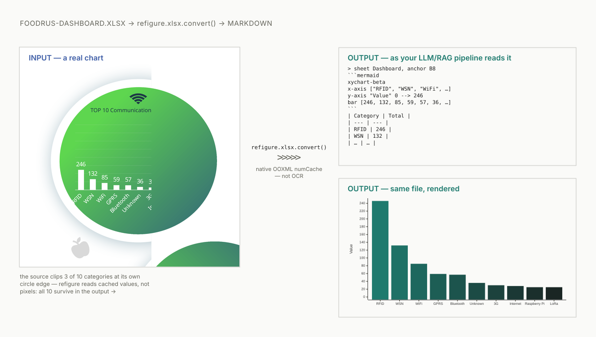
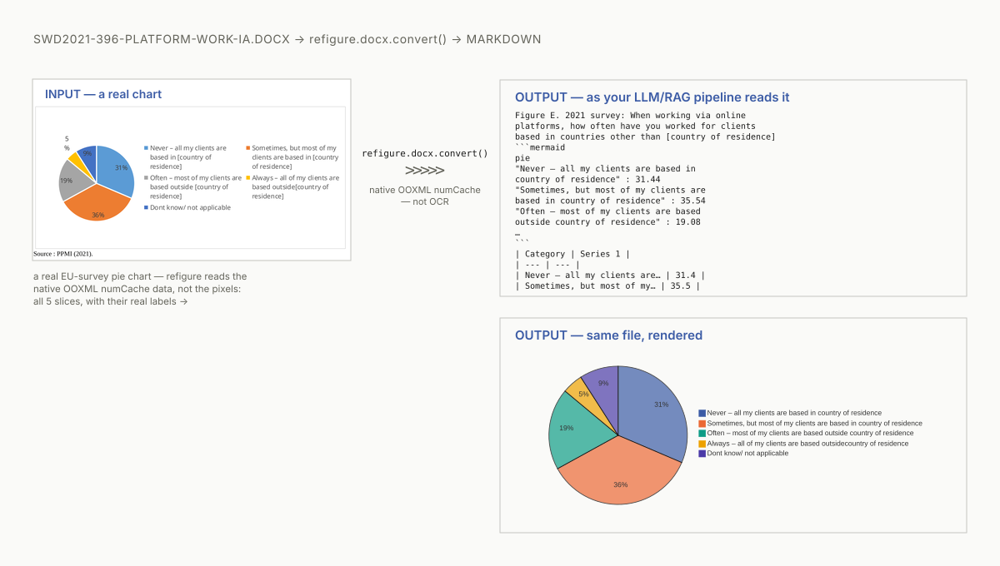
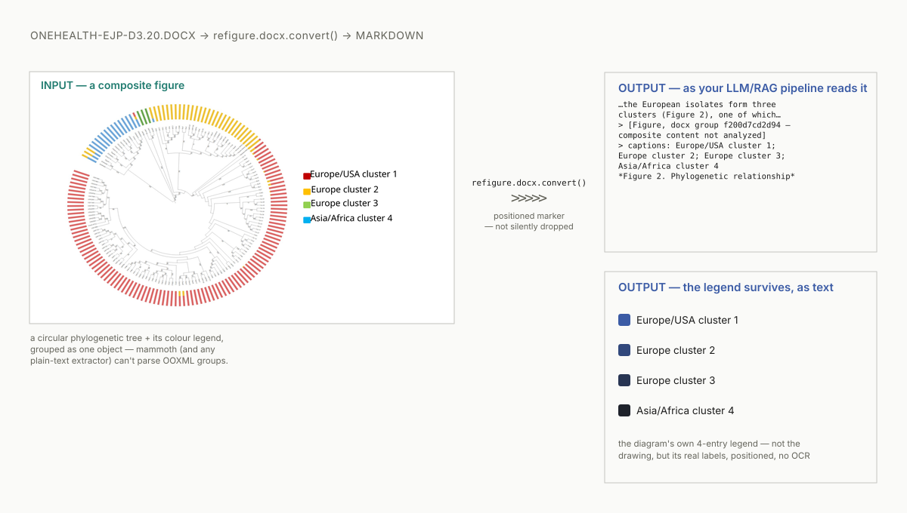

# refigure

**Converters where figures survive.**

[](https://github.com/HelgDemidov/refigure/actions/workflows/ci.yml)
[](https://github.com/HelgDemidov/refigure/actions/workflows/ci.yml)
[](LICENSE)
[](pyproject.toml)

DOCX / XLSX → Markdown converters that treat embedded charts, composite
diagrams and infographics as single semantic objects instead of silently
dropping or fragmenting them: native OOXML chart-data extraction (no
rasterize/OCR/VLM) plus positioned machine-readable markers as the zero-loss
floor, optional VLM interpretation (prose + mermaid) on top, cached and
reproducible offline.

## Demo

**Native chart-data extraction** — real OOXML `numCache`, not a screenshot,
not OCR:

<picture>
  <source media="(prefers-color-scheme: dark)" srcset="docs/assets/demo-dark.svg">
  
</picture>

**Same extraction, from DOCX** — Word embeds native charts too, not just
Excel; refigure reads the same cached OOXML data either way:

<picture>
  <source media="(prefers-color-scheme: dark)" srcset="docs/assets/demo-docx-chart-dark.svg">
  
</picture>

**Composite figures** — positioned, zero-loss, even when the figure itself
can't be rendered (no incumbent does this — see
[Docling issue #1287](https://github.com/docling-project/docling/issues/1287),
open >1 year):

<picture>
  <source media="(prefers-color-scheme: dark)" srcset="docs/assets/demo-groups-dark.svg">
  
</picture>

## Quickstart

```bash
pip install "refigure[docx,xlsx]"
```

```bash
refigure report.docx                      # markdown to stdout
```

```python
from refigure.docx import convert

result = convert("report.docx")
print(result.markdown)
print(f"{result.charts_found} charts, {result.groups_found} composite figures")
```

## Features

- **Native chart-data extraction** — reads OOXML `numCache`/`strCache`
  directly; no rasterize/OCR/VLM step for charts, real numbers every time.
- **Positioned zero-loss markers for composite figures** (DOCX) — grouped
  shapes/infographics that mammoth would otherwise silently fragment into
  disconnected pieces get a clean marker instead, with position and any
  caption text preserved. Absent even in well-funded incumbents — see
  [Docling issue #1287](https://github.com/docling-project/docling/issues/1287).
- **Optional VLM interpretation** (DOCX composite figures, `[vlm]` extra) —
  cloud description + mermaid diagram on top of the zero-loss floor.
  Implemented and tested, but not active or announced as a v1 feature yet
  (see Status).
- **Rich, typed result** — `ConversionResult` (markdown + warnings +
  chart/group counts + `vlm_used`), not a bare string.
- **CLI included** — `refigure` console command, stdin/stdout-first, native
  batch mode, typed exit codes (see below).

## CLI

`refigure` installs a console command — a thin wrapper over the same
`convert()` used programmatically, no separate logic:

```bash
refigure report.docx                      # markdown to stdout
refigure report.docx -o report.md         # markdown to a file
cat report.docx | refigure --format docx  # stdin, format hint required
refigure reports/ -o out/                 # batch: directory, walked recursively
refigure a.docx b.xlsx -o out/            # batch: 2+ explicit sources
```

Batch mode (2+ sources, or a single directory) requires `-o DIR`, keeps
going past a failed source by default (`--fail-fast` aborts on the first
one instead), and always prints a summary (`N/M converted, K failed`) to
stderr. `--json` emits the full result — markdown plus chart/group counts
and warnings — instead of plain markdown. `-v`/`-q` control verbosity;
`--strict` is forwarded to the same `Config.strict` the Python API uses.

Exit codes:

| Code | Meaning |
| --- | --- |
| 0 | success |
| 1 | batch mode: 1+ sources failed (keep-going default) |
| 2 | usage error (bad arguments/flags) |
| 3 | input isn't a valid document of its format |
| 4 | input isn't a valid/safe archive |
| 5 | the format's extra (`[docx]`/`[xlsx]`) isn't installed |
| 6 | unexpected internal error |

## Real examples

Full `convert()` output on real, openly-licensed documents — not
cherry-picked snippets. Each file's own header states its source, license
and attribution.

| Source | Demonstrates | Output |
| --- | --- | --- |
| `hackair-d7.7-pilot-evaluation.docx` | native chart extraction — 8 charts, 6 render as mermaid diagrams | [examples/hackair-native-charts.md](examples/hackair-native-charts.md) |
| `swd2018-254-marine-litter-ia-annex.docx` | combo: 1 chart (table-only — real verify+fallback in action, not every chart maps to mermaid) + 2 composite-figure zero-loss markers | [examples/swd2018-combo.md](examples/swd2018-combo.md) |
| `govtech-2025-charts.xlsx` | XLSX at scale — 55 charts, 33 render as mermaid diagrams | [examples/govtech-xlsx-charts.md](examples/govtech-xlsx-charts.md) |

Open any of these on GitHub and both views are right there: the raw
```` ```mermaid ```` fence an LLM/RAG pipeline would read, and its native
GitHub rendering — no extra step, that's GitHub's own Markdown support.

## Status

Pre-release. Tested against 27 real documents (15 DOCX + 12 XLSX) — 407
native charts found (400 rendered), 35 composite figures recovered as
positioned zero-loss markers — see
[`tests/integration/fixtures/manifest.yaml`](tests/integration/fixtures/manifest.yaml)
for provenance, licenses and attribution. CI gates on a combined
unit+integration test-coverage floor of 95%.

The converters are being extracted from a working document-analysis
pipeline (government AI-policy corpus); first public release planned for
**August 2026** as a single package with per-format extras (`[docx]` /
`[xlsx]`). A `[vlm]` extra also exists (DOCX-only cloud interpretation of
composite figures the chart engine can't reconstruct,
`Config(use_vlm=True)`, provider-agnostic — also needs the system
`soffice`/LibreOffice binary, not installable via pip) — implemented and
tested, but **not active or announced as a v1 feature yet**; no CLI flag
exposes it. PDF is out of scope for this project (see
[`docs/project-meta/converter-viability-assessment/converter-viability-assessment-2026-08-04.md`](docs/project-meta/converter-viability-assessment/converter-viability-assessment-2026-08-04.md)).

`v0.1.0` is packaged, CI-verified and ready — trusted publishing
(GitHub↔PyPI, no stored tokens) is configured on both ends; publication
itself is a separate, deliberate step not yet taken. Until then, PyPI
name `refigure` still shows its `0.0.0` placeholder. `refigure-md` is a
reserved alternate name, not an active release.

## License

Apache-2.0 — see [LICENSE](LICENSE) and [NOTICE](NOTICE).
