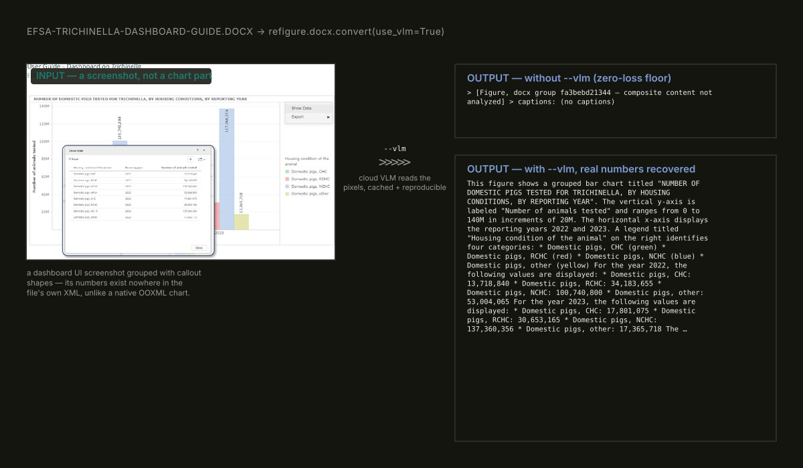

# refigure

**Converters where figures survive.**

[](https://github.com/HelgDemidov/refigure/actions/workflows/ci.yml)
[](https://github.com/HelgDemidov/refigure/actions/workflows/ci.yml)
[](LICENSE)
[](pyproject.toml)
[](https://pypi.org/project/refigure/)
[](https://github.com/HelgDemidov/refigure/pkgs/container/refigure)
[](https://registry.modelcontextprotocol.io/?q=refigure)

<!-- mcp-name: io.github.HelgDemidov/refigure -->

DOCX / XLSX → Markdown converters that treat embedded charts, composite
diagrams and infographics as single semantic objects instead of silently
dropping or fragmenting them: native OOXML chart-data extraction (no
rasterize/OCR/VLM) plus positioned machine-readable markers as the zero-loss
floor, optional VLM interpretation (prose + mermaid) on top, cached and
reproducible offline.

## Demo

**Optional VLM interpretation** — for a figure with no native chart data at
all (a screenshot, not an OOXML chart part) AND no matching mermaid
construct either (a dense radial sunburst — nothing in the 4 original
mermaid types could represent it), `--vlm` both recovers the real content
and produces a genuinely renderable diagram, not just recovered text:



**Native chart-data extraction** — real OOXML `numCache`, not a screenshot,
not OCR:

<picture>
  <source media="(prefers-color-scheme: dark)" srcset="docs/assets/demo-dark.svg">
  
</picture>

**Same extraction, from DOCX** — Word embeds native charts too, not just
Excel; refigure reads the same cached OOXML data either way:

<picture>
  <source media="(prefers-color-scheme: dark)" srcset="docs/assets/demo-docx-chart-dark.svg">
  
</picture>

**Composite figures** — positioned, zero-loss, even when the figure itself
can't be rendered (no incumbent does this — see
[Docling issue #1287](https://github.com/docling-project/docling/issues/1287),
open >1 year):

<picture>
  <source media="(prefers-color-scheme: dark)" srcset="docs/assets/demo-groups-dark.svg">
  
</picture>

## Quickstart

```bash
pip install "refigure[docx,xlsx]"
```

```bash
refigure report.docx                      # markdown to stdout
```

```python
from refigure.docx import convert

result = convert("report.docx")
print(result.markdown)
print(f"{result.charts_found} charts, {result.groups_found} composite figures")
```

Or without a permanent install, via [uv](https://docs.astral.sh/uv/)/`uvx`:

```bash
uvx --from "refigure[docx,xlsx]" refigure report.docx
```

Optional VLM interpretation, for a composite figure the chart engine can't
reconstruct on its own (see Features below):

```bash
pip install "refigure[docx,vlm]"
export OPENROUTER_API_KEY=...                 # or --vlm-api-key-file/--vlm-provider
refigure report.docx --vlm                    # needs the system soffice/LibreOffice binary too
```

## Features

- **Native chart-data extraction** — reads OOXML `numCache`/`strCache`
  directly; no rasterize/OCR/VLM step for charts, real numbers every time.
- **Positioned zero-loss markers for composite figures** (DOCX) — grouped
  shapes/infographics that mammoth would otherwise silently fragment into
  disconnected pieces get a clean marker instead, with position and any
  caption text preserved. Absent even in well-funded incumbents — see
  [Docling issue #1287](https://github.com/docling-project/docling/issues/1287).
- **Optional VLM interpretation** (DOCX composite figures, `[vlm]` extra,
  `--vlm`/`Config(use_vlm=True)`) — cloud description + a real rendered
  mermaid diagram (26 supported diagram types — flowcharts, pie/xy charts,
  sequence/state/ER diagrams, Gantt/timeline/sankey/treemap and more, see
  Status below) on top of the zero-loss floor, for figures with no native
  chart data at all (e.g. a dashboard screenshot). Provider-agnostic —
  OpenRouter by default, or direct OpenAI/Ollama/vLLM/LM Studio/Anthropic
  via `--vlm-provider` (`[vlm-direct]` extra). `--strict` upgrades one
  specific failure (the system `soffice`/LibreOffice binary missing) from
  a graceful skip to a hard error; every other VLM failure still degrades.
- **Rich, typed result** — `ConversionResult` (markdown + warnings +
  chart/group counts + `vlm_used`), not a bare string.
- **CLI included** — `refigure` console command, stdin/stdout-first, native
  batch mode, typed exit codes (see below).
- **MCP server included** — `refigure-mcp` console command (`[mcp]` extra),
  stdio or Streamable HTTP, tools/resources/prompts, batch conversion with
  per-file isolation (see below).
- **Docker image** — `ghcr.io/helgdemidov/refigure`, both console commands
  on `PATH`, `soffice`/LibreOffice baked in — the VLM composite-figure
  path works turnkey, no manual LibreOffice install (see below).

## CLI

`refigure` installs a console command — a thin wrapper over the same
`convert()` used programmatically, no separate logic:

```bash
refigure report.docx                      # markdown to stdout
refigure report.docx -o report.md         # markdown to a file
cat report.docx | refigure --format docx  # stdin, format hint required
refigure reports/ -o out/                 # batch: directory, walked recursively
refigure a.docx b.xlsx -o out/            # batch: 2+ explicit sources
```

Batch mode (2+ sources, or a single directory) requires `-o DIR`, keeps
going past a failed source by default (`--fail-fast` aborts on the first
one instead), and always prints a summary (`N/M converted, K failed`) to
stderr. `--json` emits the full result — markdown plus chart/group counts
and warnings — instead of plain markdown. `-v`/`-q` control verbosity;
`--strict` is forwarded to the same `Config.strict` the Python API uses.

Exit codes:

| Code | Meaning |
| --- | --- |
| 0 | success |
| 1 | batch mode: 1+ sources failed (keep-going default) |
| 2 | usage error (bad arguments/flags) |
| 3 | input isn't a valid document of its format |
| 4 | input isn't a valid/safe archive |
| 5 | the format's extra (`[docx]`/`[xlsx]`) isn't installed |
| 6 | unexpected internal error |

## MCP server

`refigure-mcp` — the same converters as an
[MCP](https://modelcontextprotocol.io) server, for agents/IDEs that speak
the protocol directly instead of shelling out to a CLI or importing the
library. Listed on the official
[MCP Registry](https://registry.modelcontextprotocol.io/?q=refigure) as
`io.github.HelgDemidov/refigure`:

```bash
pip install "refigure[mcp,docx,xlsx]"
refigure-mcp                              # stdio — the MCP client launches it
```

```json
{
  "mcpServers": {
    "refigure": { "command": "refigure-mcp" }
  }
}
```

Or point the client at `uvx` instead, with no permanent install at all:

```json
{
  "mcpServers": {
    "refigure": {
      "command": "uvx",
      "args": ["--from", "refigure[mcp,docx,xlsx,vlm-direct]", "refigure-mcp"]
    }
  }
}
```

`refigure[full]` is a shortcut for `refigure[mcp,docx,xlsx,vlm-direct]` —
every tool, both formats, every VLM provider, one extras string.

Three tools — `convert_docx`, `convert_xlsx`, and `convert_batch` (multiple
files in one call: one bad file reports its own error without aborting the
rest) — each registered only if its format extra is actually installed.
`use_vlm`/`--vlm-provider` and friends work the same as the CLI. A result
too large to inline is stored and handed back as a
`refigure://conversion/{id}` resource instead of inflating the tool
response. Two prompts (`ingest_for_rag`, `explain_conversion_warnings`)
help a client pick the right tool/VLM settings for the job.

Streamable HTTP is opt-in, for a shared/remote deployment — bearer-token
auth is required, not optional:

```bash
echo "sk-... = alice" > tokens.txt
refigure-mcp --transport http --mcp-auth-token-file tokens.txt
```

Per-caller rate-limiting (protects the operator's own spend from a
leaked/runaway token) applies automatically over HTTP, together with a
fairness soft-cap once 2+ callers are configured; `refigure-mcp --help`
covers every tuning flag (concurrency, timeouts, resource-store limits,
batch size, VLM ceiling).

## Docker

One image, both surfaces — `refigure` and `refigure-mcp` are already on
`PATH`, no separate CLI/MCP builds to choose between. The one thing this
format buys over `pip`/`uvx` that neither can: the system `soffice`/
LibreOffice binary the VLM composite-figure path needs is baked in, not a
manual install.

```bash
docker pull ghcr.io/helgdemidov/refigure:latest
```

Pin an exact version instead of `:latest` for reproducibility — e.g.
`:0.3.2` — see the [package page](https://github.com/HelgDemidov/refigure/pkgs/container/refigure)
for available tags.

CLI, via a bind mount (the image's working directory is already `/data`):

```bash
docker run --rm -v "$PWD:/data:ro" ghcr.io/helgdemidov/refigure:latest \
  refigure /data/report.docx
```

MCP, stdio — the client launches the container itself:

```json
{
  "mcpServers": {
    "refigure": {
      "command": "docker",
      "args": ["run", "-i", "--rm", "ghcr.io/helgdemidov/refigure:latest", "refigure-mcp"]
    }
  }
}
```

MCP, Streamable HTTP — `--mcp-http-host 0.0.0.0` is required here, not
optional: the default `127.0.0.1` bind is unreachable through `-p` port
publishing (Docker's NAT reaches the container's external network
interface, not its loopback), so the "obvious" invocation without this
flag would silently never respond:

```bash
echo "sk-... = alice" > tokens.txt
docker run --rm -p 8000:8000 -v "$PWD/tokens.txt:/data/tokens.txt:ro" \
  ghcr.io/helgdemidov/refigure:latest \
  refigure-mcp --transport http --mcp-http-host 0.0.0.0 \
  --mcp-auth-token-file /data/tokens.txt
```

## Real examples

Full `convert()` output on real, openly-licensed documents — not
cherry-picked snippets. Each file's own header states its source, license
and attribution.

| Source | Demonstrates | Output |
| --- | --- | --- |
| `hackair-d7.7-pilot-evaluation.docx` | native chart extraction — 8 charts, 6 render as mermaid diagrams | [examples/hackair-native-charts.md](examples/hackair-native-charts.md) |
| `swd2018-254-marine-litter-ia-annex.docx` | combo: 1 chart (table-only — real verify+fallback in action, not every chart maps to mermaid) + 2 composite-figure zero-loss markers | [examples/swd2018-combo.md](examples/swd2018-combo.md) |
| `govtech-2025-charts.xlsx` | XLSX at scale — 55 charts, 33 render as mermaid diagrams | [examples/govtech-xlsx-charts.md](examples/govtech-xlsx-charts.md) |
| `swd2021-396-platform-work-ia.docx` | native pie chart — real EU-survey labels, all 8 charts render (3 as mermaid) | [examples/swd2021-pie-chart.md](examples/swd2021-pie-chart.md) |
| `efsa-trichinella-dashboard-guide.docx` | `--vlm` interpretation — 27 figures with no native chart data, real numbers recovered from screenshots | [examples/efsa-trichinella-vlm.md](examples/efsa-trichinella-vlm.md) |

Open any of these on GitHub and both views are right there: the raw
```` ```mermaid ```` fence an LLM/RAG pipeline would read, and its native
GitHub rendering — no extra step, that's GitHub's own Markdown support.

## Status

Published on PyPI as `refigure`. Tested against 27 real documents (15 DOCX +
12 XLSX) — 407 native charts found (400 rendered), 35 composite figures
recovered as positioned zero-loss markers — see
[`tests/integration/fixtures/manifest.yaml`](tests/integration/fixtures/manifest.yaml)
for provenance, licenses and attribution. CI gates on a combined
unit+integration test-coverage floor of 95%.

The converters were extracted from a working document-analysis pipeline
(government AI-policy corpus) into a single package with per-format extras
(`[docx]` / `[xlsx]`). VLM interpretation of composite figures the chart
engine can't reconstruct (`[vlm]` extra, `Config(use_vlm=True)`,
provider-agnostic — direct OpenAI/Anthropic via `[vlm-direct]`, also needs
the system `soffice`/LibreOffice binary, not installable via pip) is fully
implemented, tested, and exposed through the `refigure` CLI (`--vlm` and
friends — see CLI above and Quickstart). Mermaid-diagram recognition on
top of that varies by diagram type and by what's actually on the source
figure — common types (flowcharts, pie/xy charts) are picked reliably;
more specialized ones depend on the figure carrying an unambiguous visual
cue, and not every figure produces a diagram at all — a plain text
description is a valid, honest fallback when it doesn't.

**PDF is out of scope, on purpose — a boundary, not a gap.** PDF has no
equivalent of OOXML's cached chart data (`numCache`/`strCache`) for any
mainstream chart generator, so the native, rasterize-free extraction
this project is built on doesn't transfer to it — confirmed by research
into PDF's own structure and how leading PDF converters handle charts
today, not assumed. For mixed-format corpora, route by extension instead
of expecting one tool to cover everything —
[Docling](https://github.com/docling-project/docling) or
[MarkItDown](https://github.com/microsoft/markitdown) for PDF, refigure
for DOCX/XLSX where the chart data actually survives in the file:

```python
import refigure.docx
import refigure.xlsx

if path.suffix == ".pdf":
    markdown = docling_convert(path)      # or any PDF-capable converter
elif path.suffix == ".docx":
    markdown = refigure.docx.convert(path).markdown
else:
    markdown = refigure.xlsx.convert(path).markdown
```

`v0.3.2` published via trusted publishing (GitHub↔PyPI, no stored tokens),
also on GHCR as `ghcr.io/helgdemidov/refigure` and on the official
[MCP Registry](https://registry.modelcontextprotocol.io) as
`io.github.HelgDemidov/refigure`. `refigure-md` is a reserved alternate
name, not an active release.

## License

Apache-2.0 — see [LICENSE](LICENSE) and [NOTICE](NOTICE).
