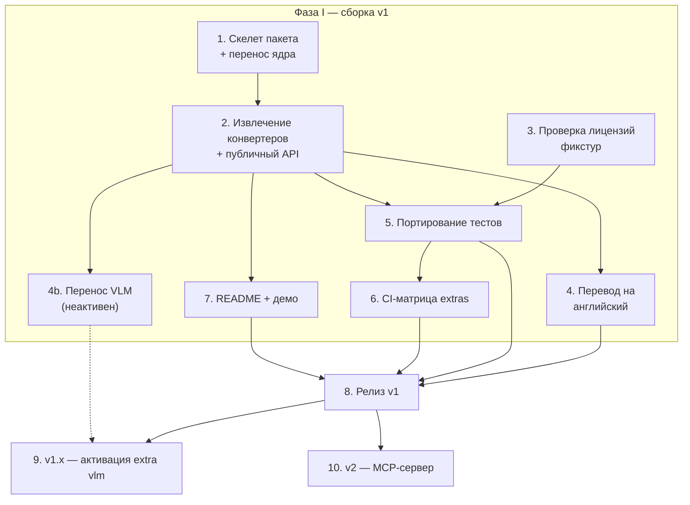

# refigure — последовательность и взаимозависимости фаз и стадий

Дополняет `v1-scope-and-api-design-2026-08-04.md` (там — **что** и **почему**,
здесь — **в каком порядке**). Скоуп/архитектура/API уже решены — это фундамент,
не отдельная стадия ниже.

## Фаза I — сборка v1

1. **Скелет пакета + перенос ядра.** `pyproject.toml`, extras (`[docx]`/`[xlsx]`/`[vlm]`),
   независимые по-форматные подмодули (§2 design-документа). Перенос почти-без-изменений
   файлов (`chart_data.py`/`chart_render.py`/`xlsx_charts.py`/`docx_groups.py`/`zipsafe.py`).
   Ничего дальше не начинается без этого — структурный фундамент.
2. **Извлечение `_convert_docx`/`_convert_xlsx` + обёртка публичного API.** Вычленение
   из `converters.py`, `ConversionResult`/типизированные исключения/`strict` (§3
   design-документа уже решает форму — здесь только реализация). Точка ветвления:
   от неё зависят 4, 4b, 5, 7.
3. **Проверка лицензий фикстур** (govtech CC BY 4.0, провенанс DOCX-эксцерпта) — **не
   зависит ни от чего**, стартует сразу и параллельно 1-2. Должна быть закрыта до 5 —
   иначе портировать тесты не на что.
4. **Перевод комментариев/докстрингов на английский.** Зависит от 2 (нужен код).
   Не блокирует 5/6/7 — только релиз (8).
4b. **Перенос VLM-слоя** (LibreOffice+облачная интерпретация), за `[vlm]` extra +
   runtime-тоггл — **не активен в v1**. Зависит от 2 (форма `ConversionResult` должна
   быть решена до интеграции VLM-полей `vlm_used`/warnings, иначе переделка). Не
   блокирует релиз v1 (8) — только подготавливает v1.x (9), пунктирная связь.
5. **Портирование тестов.** Зависит от 2 (есть что тестировать) и 3 (известно, какие
   фикстуры годны). Логика тестов не меняется — только импорты и layout.
6. **CI-матрица extras.** Зависит от 5 (тесты, которые матрица прогоняет) —
   комбинации `[docx]`/`[xlsx]`/оба/ни один.
7. **README + демо.** Зависит от 2 (API должен быть стабилен для точных примеров).

## Фаза II — релиз v1

8. **Релиз.** Гейт: 4 (перевод завершён) + 5 (тесты зелёные) + 6 (CI зелёный) +
   7 (README готов). Не ждёт 4b — VLM изолирован архитектурой extras (стадия 1),
   его неготовность структурно не может сломать релиз без него.

## Фаза III — v1.x

9. **Активация `[vlm]` extra.** Код уже перенесён и готов (4b, шёл параллельно
   всей фазе I) — здесь публикация/анонс, не разработка с нуля. Отдельно решается
   вопрос async batch-точки входа для VLM (§3 design-документа), не блокирует саму
   активацию базового `use_vlm=True`.

## Фаза IV — v2

10. **MCP-сервер.** Зависит от 8 (нужен стабильный, выпущенный публичный API v1 —
    сервер тонкая обёртка над ним, не самостоятельная реализация). Может стартовать
    параллельно фазе III (9), не зависит от неё — MCP оборачивает то же API v1
    независимо от того, включён ли `[vlm]`.
