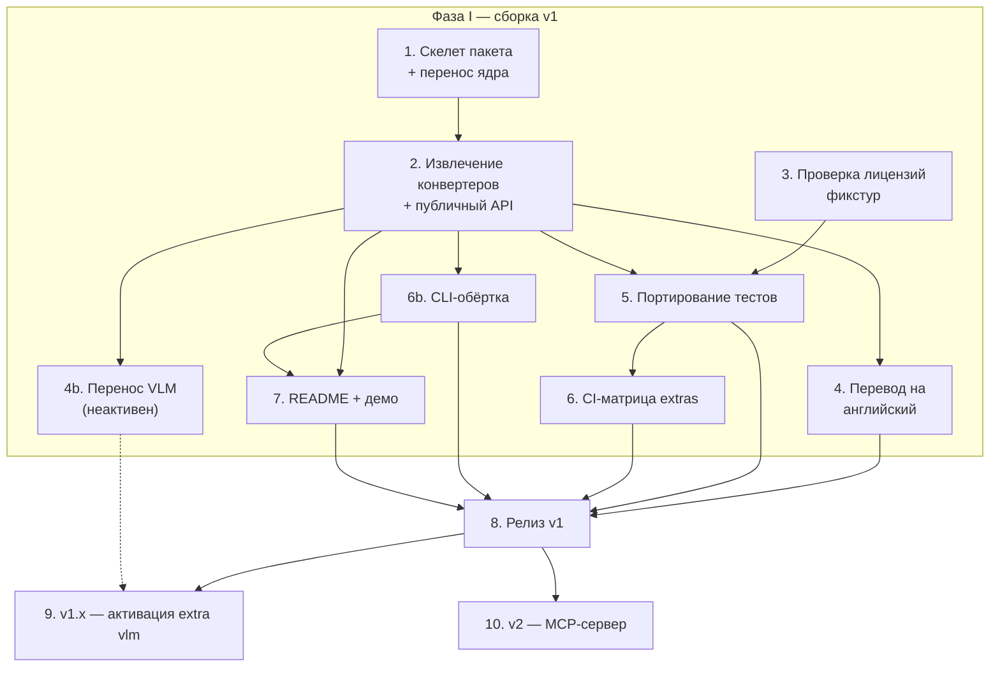

# refigure — последовательность и взаимозависимости фаз и стадий

Дополняет `v1-scope-and-api-design-2026-08-04.md` (там — **что** и **почему**,
здесь — **в каком порядке**). Скоуп/архитектура/API уже решены — это фундамент,
не отдельная стадия ниже.

**Трудоёмкость** — относительная доля от 100% суммарной работы по v1 (фазы I-II,
стадии 1-8, включая 4b и 6b — оба добавлены позже исходной оценки 2026-08-04, см.
пометки при каждом; 4b идёт параллельно фазе I, хоть и не входит в v1-релиз).
Основание оценки: объём НОВОГО кода/решений (не то, что переносится почти без
изменений), реальная связанность с остальным пайплайном G2AI_ME (чем туже связано —
тем больше расцепления), из код-ревью 4 агентов 2026-08-04. Фазы III-IV (9-10) — вне
этого пула, отдельная база оценки после релиза v1, см. пометки там.

## Фаза I — сборка v1 (~98%)

1. **Скелет пакета + перенос ядра — 10%.** `pyproject.toml`, extras
   (`[docx]`/`[xlsx]`/`[vlm]`), независимые по-форматные подмодули (§2
   design-документа). Перенос почти-без-изменений файлов (`chart_data.py`/
   `chart_render.py`/`xlsx_charts.py`/`docx_groups.py`/`zipsafe.py`) — низкая
   доля именно потому, что сам код уже написан и протестирован, новое здесь —
   только структура пакета. Ничего дальше не начинается без этого.
2. **Извлечение `_convert_docx`/`_convert_xlsx` + обёртка публичного API — 15%.**
   Вычленение из `converters.py` агенты оценили в «меньше дня» каждое — но
   основной вес стадии не в этом, а в реализации самой обёртки
   (`ConversionResult`/типизированные исключения/`strict`, §3 design-документа
   уже решает форму, здесь — код) через оба формата. Точка ветвления: от неё
   зависят 4, 4b, 5, 7.
3. **Проверка лицензий фикстур — 5%.** (govtech CC BY 4.0, провенанс
   DOCX-эксцерпта) — **не зависит ни от чего**, стартует сразу и параллельно
   1-2. Небольшая доля, но с реальной неопределённостью (может понадобиться
   переписка/замена фикстуры, не чистый кодинг). Должна быть закрыта до 5.
4. **Перевод комментариев/докстрингов на английский — 8%.** Механическая работа
   на объём (~1400 строк), но именно поэтому не самая тяжёлая стадия — не
   требует новых решений. Зависит от 2. Не блокирует 5/6/7 — только релиз (8).
4b. **Перенос VLM-слоя — 25%, самая тяжёлая стадия.** LibreOffice+облачная
   интерпретация, за `[vlm]` extra + runtime-тоггл, **не активен в v1**.
   `figures_vlm.py` (676 строк) в G2AI_ME — самый связанный с пайплайном модуль
   из всех рассмотренных (`core.fsio`/`core.markers`/`core.openrouter`,
   по код-ревью), плюс кэш нужно переделать в подключаемый бэкенд (§3
   design-документа), а не переносить хардкод-сайдкар. Зависит от 2 (форма
   `ConversionResult` должна быть решена до интеграции VLM-полей `vlm_used`/
   warnings). Не блокирует релиз v1 (8) — только подготавливает v1.x (9).
   Затрагивает и стадию 6 задним числом (решение 2026-08-05): матрица
   `test-extras` (`ci.yml`) и `tests/extras/test_extras_isolation.py` нужно
   расширить веткой `vlm` (+ комбинации) — не редизайн, а один пункт в уже
   существующем списке. Важнее сам чек: PR #8 нашёл реальный баг именно в
   ПОРЯДКЕ импортов (`xlsx.py`'s guard шёл после негвардированного
   транзитивного импорта в `xlsx_charts.py`) — при интеграции VLM-кода в
   существующие модули (`chart_render.py`/`docx_groups.py`) этот же класс
   риска нужно перепроверить матрицей, не полагаться на "добавили
   try/except — значит изолировано".
5. **Портирование тестов — 15%.** Логика тестов не меняется, но объём реальный:
   импорты и layout меняются в ~7 тестовых файлах (`test_docx_groups.py`,
   `test_chart_data.py`, `test_chart_render.py`, `test_chart_render_visual.py`,
   `test_xlsx_charts.py`, `test_docx_chart_group_coexistence.py`,
   `test_chart_render_missing_mermaidx.py`) плюс хелперы `tests/support.py`.
   Из двух исходных интеграционных тестов переносится только один —
   `test_xlsx_charts_datadriven.py` (чистый, без soffice/VLM). Второй,
   `test_docx_groups_live.py`, завязан на `convert.figures_vlm._render_docx_group`
   + системный `soffice` — **отложен до стадии 4b** (решение 2026-08-04):
   портировать нечего, пока `figures_vlm.py` не перенесён. Плюс новый слой —
   параметризованные интеграционные тесты по всему корпусу фикстур
   (`tests/integration/fixtures/`, 27 файлов, см. `manifest.yaml`) — не
   перенос, а новый код поверх публичного `convert()`. Зависит от 2 и 3.
6. **CI-матрица extras — 8%.** Новая инженерия (в G2AI_ME такого нет — там
   всегда всё установлено разом), ограниченная по объёму — предполагавшийся
   прецедент (CI `cldr-cnr`) при фактическом подходе не подтвердился (тот
   репозиторий не имеет Python extras/matrix CI вообще), спроектирована с
   нуля. Оправдала себя немедленно: первый же прогон новой матрицы (PR #8)
   нашёл реальный баг guard-ordering в `xlsx.py`, невидимый всем трём
   прежним CI-джобам (см. `project_extras_isolation_bug` memory). Зависит
   от 5.
6b. **CLI-обёртка — 3%.** Тонкая надстройка над уже готовым публичным API
   (`refigure.docx.convert()`/`refigure.xlsx.convert()`) — ноль нового кода
   извлечения, ноль нового риска в самом движке; основной вес — argparse-
   слой, маппинг типизированных исключений на коды выхода, тесты, раздел в
   README. Оправданность решена не архитектурно, а рыночным чек-апом
   2026-08-05: все три прямых ориентира из
   `converter-viability-assessment-2026-08-04.md` (MarkItDown 139k★, Docling
   64k★+, marker/Datalab 38k★+) уже поставляют CLI как равноправный, не
   факультативный интерфейс — для категории «документ→markdown» это
   ожидаемый минимум на середину 2026, не опция. Скоуп — MVP-паритет с
   MarkItDown, не с Docling: один файл на входе, markdown на stdout или
   `-o file.md`, коды выхода по существующим
   `UnsupportedFormatError`/`CorruptArchiveError`/
   `MissingOptionalDependencyError` — никакого batch/directory/JSON-output на
   первом шаге (отдельная, более амбициозная фича, раздувание против
   принципа «один дифференциатор»). Дизайн-урок стадии 6 применим и здесь:
   если CLI-модуль импортирует `mammoth`/`openpyxl` напрямую — тот же класс
   guard-ordering риска (см. `project_extras_isolation_bug` memory); решение
   — не открывать новый импорт-путь, а вызывать уже гвардированные
   `refigure.docx`/`refigure.xlsx`. Зависит от 2 (публичный API уже готов).
   Не блокирует 4b/5/6. Усиливает 7 — README/демо выигрывает от
   однострочника в терминале (сам MarkItDown в README ведёт именно с
   CLI-строкой, не с Python-сниппетом) — рекомендуемый порядок, не жёсткая
   блокировка по данным. Гейтит релиз (8) наравне с 4/5/6/7, раз становится
   частью заявленного v1 UX.
7. **README + демо — 9%.** Не адаптация существующей документации — нужен
   реальный, убедительный пример «было/стало» на настоящем чарте, это
   содержательная, не механическая работа. Зависит от 2. Формулировки о
   зрелости — решение 2026-08-04 (`CLAUDE.md` §Do NOT, research-backed): НЕ
   «battle-tested»/«production-ready» (непроверяемо при нулевом внешнем
   usage, порог CNCF даже для нижней ступени — ≥3 независимых продакшн-
   адоптера), а конкретное проверяемое заявление со ссылкой на
   `tests/integration/fixtures/manifest.yaml` («протестировано на N реальных
   документах, M нативных чартов, K composite-групп»).

## Фаза II — релиз v1 (~5%)

8. **Релиз — 5%.** В основном гейт-чеклист + механика паблиша (сборка
   sdist/wheel, PyPI trusted publishing, тег версии) — сама работа небольшая,
   раз всё предыдущее уже сделано. Гейт: 4 (перевод завершён) + 5 (тесты
   зелёные) + 6 (CI зелёный) + 6b (CLI протестирован) + 7 (README готов) +
   branch protection на `main` (no-force-push/no-deletion/required-status-
   checks — решение 2026-08-04, `CLAUDE.md` §Git workflow: до релиза не
   нужно, публичный OSS-статус делает это частью гейта, не факультативом).
   Не ждёт 4b — VLM изолирован архитектурой extras (стадия 1), его
   неготовность структурно не может сломать релиз без него.

**Итого фазы I-II: 10+15+5+8+25+15+8+3+9+5 = 103%.** Пул вырос с исходных
100% (оценка 2026-08-04) до 103% пунктом 6b, добавленным 2026-08-05 по
итогам рыночного чек-апа CLI-ландшафта — расширение скоупа задним числом,
не пересчёт уже пройденной методологии; проценты первых 9 пунктов не
трогались.

## Фаза III — v1.x (вне пула v1)

9. **Активация `[vlm]` extra.** Код уже перенесён и готов (4b, шёл параллельно
   всей фазе I) — здесь публикация/анонс, не разработка с нуля; трудоёмкость
   поэтому не считается в 100% v1 (основная работа уже учтена в 4b) и не
   оценивается отдельно до фактического подхода к стадии. Отдельно решается
   вопрос async batch-точки входа для VLM (§3 design-документа), не блокирует
   саму активацию базового `use_vlm=True`.

## Фаза IV — v2 (вне пула v1)

10. **MCP-сервер.** Зависит от 8 (нужен стабильный, выпущенный публичный API v1 —
    сервер тонкая обёртка над ним, не самостоятельная реализация). Может
    стартовать параллельно фазе III (9), не зависит от неё. Трудоёмкость не
    оценивается здесь — база оценки другая (объём MCP-протокольного слоя, не
    объём G2AI_ME-переноса), требует отдельного разбора при подходе к v2.
