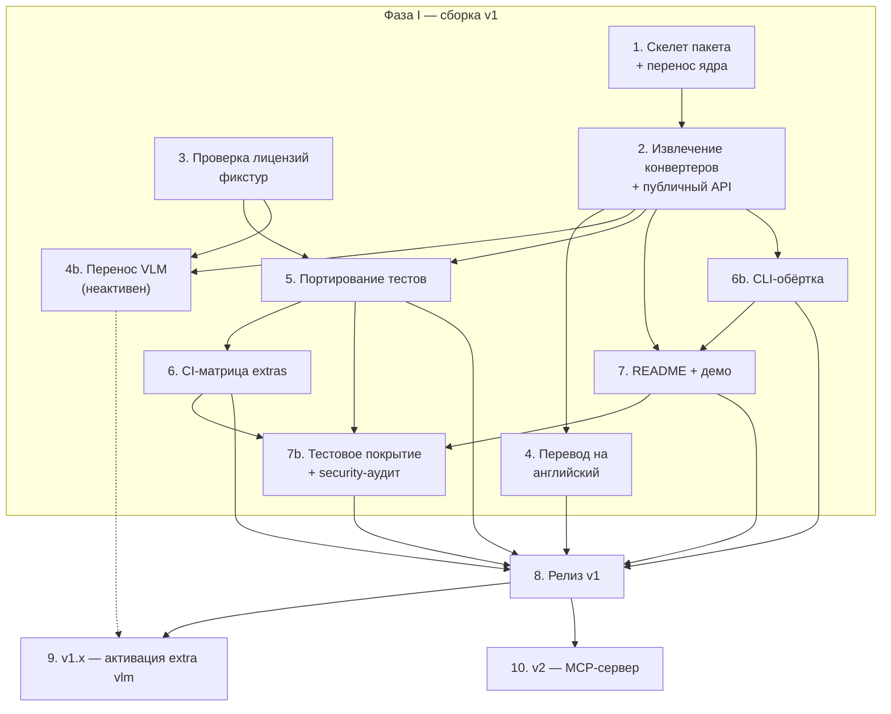

# refigure — последовательность и взаимозависимости фаз и стадий

Дополняет `../v1-scope-and-api-design/v1-scope-and-api-design-2026-08-04.md` (там — **что** и **почему**,
здесь — **в каком порядке**). Скоуп/архитектура/API уже решены — это фундамент,
не отдельная стадия ниже.

**Трудоёмкость** — относительная доля от 100% суммарной работы по v1 (фазы I-II,
стадии 1-8, включая 4b, 6b и 7b — все три добавлены позже исходной оценки
2026-08-04, см. пометки при каждой; 4b идёт параллельно фазе I, хоть и не
входит в v1-релиз).
Основание оценки: объём НОВОГО кода/решений (не то, что переносится почти без
изменений), реальная связанность с остальным исходным пайплайном (чем туже связано —
тем больше расцепления), из код-ревью 4 агентов 2026-08-04. Фазы III-IV (9-10) — вне
этого пула, отдельная база оценки после релиза v1, см. пометки там.

## Фаза I — сборка v1 (~99%)

1. **Скелет пакета + перенос ядра — 10%.** `pyproject.toml`, extras
   (`[docx]`/`[xlsx]`/`[vlm]`), независимые по-форматные подмодули (§2
   design-документа). Перенос почти-без-изменений файлов (`chart_data.py`/
   `chart_render.py`/`xlsx_charts.py`/`docx_groups.py`/`zipsafe.py`) — низкая
   доля именно потому, что сам код уже написан и протестирован, новое здесь —
   только структура пакета. Ничего дальше не начинается без этого.
2. **Извлечение `_convert_docx`/`_convert_xlsx` + обёртка публичного API — 15%.**
   Вычленение из `converters.py` агенты оценили в «меньше дня» каждое — но
   основной вес стадии не в этом, а в реализации самой обёртки
   (`ConversionResult`/типизированные исключения/`strict`, §3 design-документа
   уже решает форму, здесь — код) через оба формата. Точка ветвления: от неё
   зависят 4, 4b, 5, 7.
3. **Проверка лицензий фикстур — 5%.** (govtech CC BY 4.0, провенанс
   DOCX-эксцерпта) — **не зависит ни от чего**, стартует сразу и параллельно
   1-2. Небольшая доля, но с реальной неопределённостью (может понадобиться
   переписка/замена фикстуры, не чистый кодинг). Должна быть закрыта до 5.
   Продолжение этой работы — не новая стадия, а часть 4b (решение
   2026-08-05): раскрытие 26 из 27 фикстур из `.gitignore` + `ATTRIBUTION.md`,
   см. 4b.
4. **Перевод комментариев/докстрингов на английский — 8%.** Механическая работа
   на объём (~1400 строк), но именно поэтому не самая тяжёлая стадия — не
   требует новых решений. Зависит от 2. Не блокирует 5/6/7 — только релиз (8).
4b. **Перенос VLM-слоя — 30%, самая тяжёлая стадия** (пересмотрено
   2026-08-05, было 25% — см. рост скоупа ниже). LibreOffice+облачная
   интерпретация, за `[vlm]` extra + runtime-тоггл, **не активен в v1**.
   Исходный модуль-источник — самый связанный с остальным пайплайном
   из всех рассмотренных на код-ревью, плюс кэш переделан в подключаемый
   бэкенд (§3 design-документа), а не хардкод-сайдкар. Зависит от 2 (форма
   `ConversionResult` должна быть решена до интеграции VLM-полей `vlm_used`/
   warnings) и от 3 (см. её пометку выше). Не блокирует релиз v1 (8) —
   только подготавливает v1.x (9). Полная спецификация:
   `docs/vlm/vlm-layer-port/vlm-layer-port-2026-08-05.md`.

   Затрагивает и стадию 6 задним числом: матрица `test-extras` (`ci.yml`)
   и `tests/extras/test_extras_isolation.py` расширяются веткой `vlm`
   (+ комбинации) — не редизайн, один пункт в уже существующем списке.
   Важнее сам чек: PR #8 нашёл реальный баг именно в ПОРЯДКЕ импортов
   (guard-ordering) — при интеграции VLM-кода в существующие модули этот
   же класс риска перепроверяется матрицей, не полагается на "добавили
   try/except — значит изолировано".

   **Скоуп вырос 2026-08-05 (объясняет 25%→30%), три решения по итогам
   обсуждения с пользователем:**
   - **HTTP-клиент к VLM — подключаемый `VlmClient` Protocol**, не хардкод
     под один облачный агрегатор (тот же довод, что уже применялся к
     кэшу) — refigure явно LLM provider-agnostic, включая возможность
     локальной модели для конфиденциальных документов.
   - **Untested CI path недопустим** — `libreoffice-writer` реально
     ставится в CI (`test-unit`, кэшировано), и ради этого же 26 из 27
     corpus-фикстур раскрываются из `.gitignore` (лицензии чистые,
     атрибуция уже в манифесте) — иначе soffice в CI не помогает, если
     самих фикстур там всё равно нет. 1 личная фикстура остаётся
     gitignored, `test_docx_groups_live.py` получает новую целевую
     фикстуру.
   - **Witness-gate/дефолт модели калибруются эмпирически в рамках этой
     же стадии**, не наследуются из исходного пайплайна без пересчёта и не
     откладываются в v1.x — A/B на реальном корпусе (живые VLM-вызовы +
     ручная разметка), порог `FIGURE_WITNESS_MIN_RECALL` тоже становится
     `Config`-полем. 3 независимых агента исследовали аналогичные пороги
     в трёх смежных областях (production document-AI, RAG-faithfulness,
     VLM-бенчмарки) — все сошлись на «калибровать самим, не наследовать
     число», см. `project_witness_gate_calibration_research` memory.
5. **Портирование тестов — 15%.** Логика тестов не меняется, но объём реальный:
   импорты и layout меняются в ~7 тестовых файлах (`test_docx_groups.py`,
   `test_chart_data.py`, `test_chart_render.py`, `test_chart_render_visual.py`,
   `test_xlsx_charts.py`, `test_docx_chart_group_coexistence.py`,
   `test_chart_render_missing_mermaidx.py`) плюс хелперы `tests/support.py`.
   Из двух исходных интеграционных тестов переносится только один —
   `test_xlsx_charts_datadriven.py` (чистый, без soffice/VLM). Второй,
   `test_docx_groups_live.py`, завязан на `convert.figures_vlm._render_docx_group`
   + системный `soffice` — **отложен до стадии 4b** (решение 2026-08-04):
   портировать нечего, пока `figures_vlm.py` не перенесён. Плюс новый слой —
   параметризованные интеграционные тесты по всему корпусу фикстур
   (`tests/integration/fixtures/`, 27 файлов, см. `manifest.yaml`) — не
   перенос, а новый код поверх публичного `convert()`. Зависит от 2 и 3.
6. **CI-матрица extras — 8%.** Новая инженерия (в исходном пайплайне такого
   нет — там всегда всё установлено разом), ограниченная по объёму — предполагавшийся
   прецедент (CI `cldr-cnr`) при фактическом подходе не подтвердился (тот
   репозиторий не имеет Python extras/matrix CI вообще), спроектирована с
   нуля. Оправдала себя немедленно: первый же прогон новой матрицы (PR #8)
   нашёл реальный баг guard-ordering в `xlsx.py`, невидимый всем трём
   прежним CI-джобам (см. `project_extras_isolation_bug` memory). Зависит
   от 5.
6b. **CLI-обёртка — 4%.** Тонкая надстройка над уже готовым публичным API
   (`refigure.docx.convert()`/`refigure.xlsx.convert()`) — ноль нового кода
   извлечения, ноль нового риска в самом движке; основной вес — argparse-
   слой, маппинг типизированных исключений на коды выхода, тесты, раздел в
   README. Оправданность и дизайн решены не абстрактно, а разбором
   исходников трёх конкурентов (`docs/cli/cli-wrapper/cli-wrapper-2026-08-05.md`, тот же
   день — 3 агента, по одному на MarkItDown/Docling/marker, 2 ключевых
   утверждения перепроверены лично): все три уже поставляют CLI как
   равноправный интерфейс — для категории «документ→markdown» это
   ожидаемый минимум на середину 2026, не опция, — но ни один не сочетает
   stdin/stdout-first (есть только у MarkItDown), нативный batch-ввод
   (есть только у Docling/marker) и типизированные различимые коды выхода
   (нет ни у одного из трёх). Скоуп ревизован по факту этого разбора:
   исходное «никакого batch/JSON на первом шаге» (записано здесь
   2026-08-04) снято — batch-режим у refigure дёшев именно потому, что нет
   ML-инференса конкурентов (не process-pool/device-планирование, а
   последовательный цикл с fault isolation + summary), детали в
   спецификации. Дизайн-урок стадии 6 применим и здесь:
   если CLI-модуль импортирует `mammoth`/`openpyxl` напрямую — тот же класс
   guard-ordering риска (см. `project_extras_isolation_bug` memory); решение
   — не открывать новый импорт-путь, а вызывать уже гвардированные
   `refigure.docx`/`refigure.xlsx`. Зависит от 2 (публичный API уже готов).
   Не блокирует 4b/5/6. Усиливает 7 — README/демо выигрывает от
   однострочника в терминале (сам MarkItDown в README ведёт именно с
   CLI-строкой, не с Python-сниппетом) — рекомендуемый порядок, не жёсткая
   блокировка по данным. Гейтит релиз (8) наравне с 4/5/6/7, раз становится
   частью заявленного v1 UX.
7. **README + демо — 9%.** Не адаптация существующей документации — нужен
   реальный, убедительный пример «было/стало» на настоящем чарте, это
   содержательная, не механическая работа. Зависит от 2. Формулировки о
   зрелости — решение 2026-08-04 (`CLAUDE.md` §Do NOT, research-backed): НЕ
   «battle-tested»/«production-ready» (непроверяемо при нулевом внешнем
   usage, порог CNCF даже для нижней ступени — ≥3 независимых продакшн-
   адоптера), а конкретное проверяемое заявление со ссылкой на
   `tests/integration/fixtures/manifest.yaml` («протестировано на N реальных
   документах, M нативных чартов, K composite-групп»).
7b. **Тестовое покрытие + security-аудит — 17% (предварительно, уточняется
   на `/tech-spec`), добавлена 2026-08-06.** Решение пользователя: до сих
   пор самый существенный пробел плана — ни одна прежняя стадия не гейтит
   релиз по глубине покрытия тестами (coverage измеряется в `test-unit`
   с PR #7, но не гейтится) и не включает security-специфичных
   инструментов сверх `pip-audit` (в `quality`-джобе с PR #4). Две части,
   разные по природе (инфраструктура vs. разовый аудит) — по факту
   раскладки на `/tech-spec` могут стать 2 отдельными спеками/PR, не
   обязательно одним:
   - **Покрытие + бейдж.** Живой замер на момент постановки (не по
     памяти): `tests/unit` в одиночку — 88% (`refigure/docx/__init__.py`
     69%, `refigure/vlm/__init__.py` 71% — главные дыры;
     `refigure/__main__.py` 0%, тривиальный 5-строчный CLI-энтрипоинт).
     Гейт должен считаться по ОБЪЕДИНЁННОМУ прогону (`tests/unit` +
     `tests/integration`) — заметная часть реального ветвления
     `docx`/`xlsx`-модулей закрывается только корпусными
     интеграционными тестами, гейт по одному `tests/unit` дал бы
     заведомо заниженное и нерепрезентативное число. Порог — **95%, не
     100%**: есть легитимно недостижимые пути (сетевые live-VLM-вызовы,
     намеренно не гоняются в CI — см. 3 skip в `test-*.py`), 100% заставил
     бы либо писать фиктивные тесты, либо разрастить `# pragma: no
     cover` до состояния, где число перестаёт быть честным сигналом
     (справочно: прямого поиска публично заявленного порога у
     MarkItDown/Docling/marker не нашлось — они показывают бейдж с
     фактическим числом без формальной политики-минимума, готового
     ориентира «конкуренты требуют X%» не существует). Бейдж — НЕ
     аккаунт в Codecov/Coveralls (лишний внешний сервис+токен на проект,
     который и так избегает лишних third-party зависимостей — ср. отказ
     от LiteLLM/aisuite, OIDC вместо PyPI-токена), а self-hosted
     shields.io endpoint-бейдж от закоммиченного `coverage.json`
     (генерируется в CI на пуш в `main`, коммитится штатным
     `GITHUB_TOKEN`, без нового секрета) — тот же паттерн, что уже
     закоммиченные генерируемые SVG в `docs/assets/` (PR #13).
   - **Security-инструменты + аудит.** Из списка кандидатов пользователя,
     после проверки на актуальность/пересечение: **`pip-audit`
     (SCA) уже есть** и уже покрывает все extras (requirements.txt
     содержит mammoth/openpyxl/pdfplumber/openai/anthropic) — новый
     SCA-инструмент не нужен, OSV-Scanner был бы дублем (`pip-audit`
     и так сверяется с той же OSV-базой через PyPI JSON API). SAST —
     **Bandit** (Apache-2.0, Python-only, де-факто стандарт OSS-Python,
     нулевое трение — тот же `quality`-джоб, что и `pip-audit`) сейчас;
     **CodeQL** — бесплатный default setup без единого workflow-файла,
     но **только на публичном репо** — блокирован тем же самым решением
     «репо → публичный», что уже открытым пунктом висит в §4
     `docs/release/release-gate/release-gate-2026-08-06.md`, не
     новым. Semgrep — избыточен рядом с Bandit+CodeQL на кодовой базе
     этого размера, отложен, не отвергнут. Supply-chain-поведенческий
     слой — **Socket** (GitHub App, бесплатен для OSS), не оба
     кандидата: Phylum по возможностям дублирует Socket, держать два
     инструмента одного класса — не подтверждённая ценность; тот же
     тумблер публичности, что и CodeQL. Из «прочее» — **Trivy** узко
     для secret-сканирования (единственная НЕ покрытая нигде ещё
     возможность), не как замена SCA; Snyk и OWASP Dependency-Check не
     берутся — Snyk дублирует уже бесплатный стек, Dependency-Check
     заточен под Java/.NET, слабое совпадение с чистым Python-проектом.
     Сам аудит (агентами + вручную) — **после** того, как инструменты
     заведены, не параллельно: аудит эффективнее, когда есть на что
     опереться/что триажить, а не только grep вручную с нуля.
   Зависит от 5 (нужен зрелый тестовый набор, чтобы измерять покрытие
   осмысленно) и 6 (security-джобы расширяют уже существующую
   `quality`-инфраструктуру) и 7 (бейдж уходит в уже переписанный
   README). Гейтит релиз (8) наравне с 4/5/6/6b/7.

## Фаза II — релиз v1 (~5%)

8. **Релиз — 5%.** В основном гейт-чеклист + механика паблиша (сборка
   sdist/wheel, PyPI trusted publishing, тег версии) — сама работа небольшая,
   раз всё предыдущее уже сделано. Гейт: 4 (перевод завершён) + 5 (тесты
   зелёные) + 6 (CI зелёный) + 6b (CLI протестирован) + 7 (README готов) +
   7b (coverage-гейт зелёный, security-инструменты заведены и первый
   аудит закрыт) + branch protection на `main` (no-force-push/
   no-deletion/required-status-checks — решение 2026-08-04, `CLAUDE.md`
   §Git workflow: до релиза не нужно, публичный OSS-статус делает это
   частью гейта, не факультативом).
   Не ждёт 4b — VLM изолирован архитектурой extras (стадия 1), его
   неготовность структурно не может сломать релиз без него.

**Итого фазы I-II: 10+15+5+8+30+15+8+4+9+17+5 = 126%.** Пул вырос с
исходных 100% (оценка 2026-08-04) до 126% — 6b добавлен 2026-08-05 по
итогам рыночного чек-апа CLI-ландшафта (3%→4% после разбора трёх
конкурентов расширил скоуп до batch-режима), 4b пересчитан в тот же день
с 25%→30% (provider-agnostic VLM-клиент + CI-инженерия под
libreoffice/фикстуры + A/B-калибровка модели/witness-порога, все три —
реальное расширение скоупа, не косметика), 7b добавлен 2026-08-06 —
17% предварительно (coverage-часть ~6%: новый CI-джоб + бейдж + реальное
закрытие двух измеренных дыр, `docx/__init__.py` 69%→95%,
`vlm/__init__.py` 71%→95%; security-часть ~11%: 3-4 новых
CI-интегрированных инструмента + разовый аудит без предсказуемого заранее
объёма находок) — уточняется на `/tech-spec`, тем же порядком, что и
пересчёты 4b/6b выше. Расширение скоупа задним числом, не пересчёт уже
пройденной методологии — проценты остальных 8 пунктов не трогались.

## Фаза III — v1.x (вне пула v1)

9. **Активация `[vlm]` extra.** Код уже перенесён и готов (4b, шёл параллельно
   всей фазе I) — здесь публикация/анонс, не разработка с нуля; трудоёмкость
   поэтому не считается в 100% v1 (основная работа уже учтена в 4b) и не
   оценивается отдельно до фактического подхода к стадии. `vlm_model`/
   `vlm_witness_min_recall` дефолты **уже откалиброваны в 4b** (решение
   2026-08-05, не осталось на эту стадию). Отдельно решается вопрос async
   batch-точки входа для VLM (§3 design-документа), не блокирует саму
   активацию базового `use_vlm=True`.

## Фаза IV — v2 (вне пула v1)

10. **MCP-сервер.** Зависит от 8 (нужен стабильный, выпущенный публичный API v1 —
    сервер тонкая обёртка над ним, не самостоятельная реализация). Может
    стартовать параллельно фазе III (9), не зависит от неё. Трудоёмкость не
    оценивается здесь — база оценки другая (объём MCP-протокольного слоя, не
    объём переноса из исходного пайплайна), требует отдельного разбора при подходе к v2.
