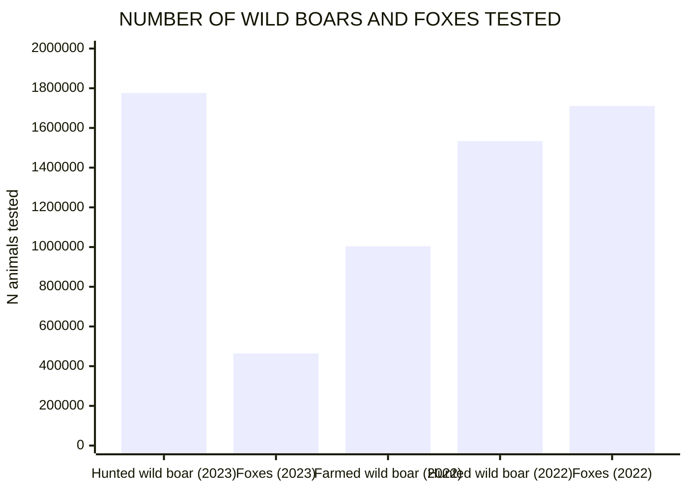
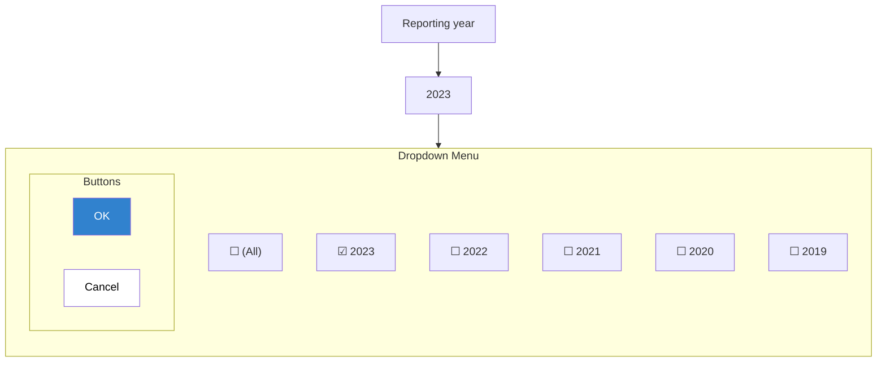
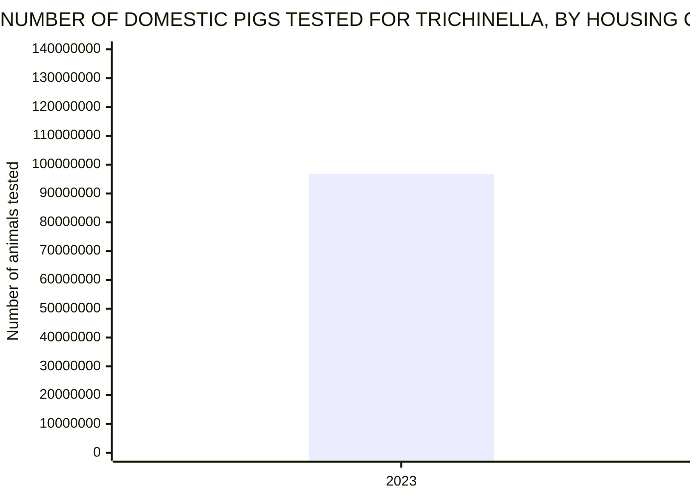

<!--
refigure example output — generated by `refigure.docx.convert()` with Config(use_vlm=True)
Source: efsa-trichinella-dashboard-guide.docx (tests/integration/fixtures/docx/efsa-trichinella-dashboard-guide.docx)
License: CC BY 4.0
Attribution: European Food Safety Authority. User Guide – Dashboard on Trichinella. Supplement to DOI 10.2903/j.efsa.2024.9106 (EU Zoonoses Report).
Source URL: https://zenodo.org/records/13987050
VLM cache: tests/integration/fixtures/vlm-cache/efsa-trichinella-dashboard-guide.json (real VLM call, see that fixture's own commit message for cost/provenance)
Full provenance: tests/integration/fixtures/manifest.yaml
-->

User Guide – Dashboard on *Trichinella*

© European Food Safety Authority, 2024

Table Of Contents

[1. Introduction 3](#_Toc184375845)

[2. Structure of the dashboard 3](#_Toc184375846)

[3. Functionalities of the dashboard 6](#_Toc184375847)

[3.1 Filtering 6](#_Toc184375848)

[3.1.1 Filtering in the filter area 6](#_Toc184375849)

[3.2 Interaction with graphs 7](#_Toc184375850)

[3.2.1 Graph types 7](#_Toc184375851)

[3.2.2 Tooltip information 9](#_Toc184375852)

[3.2.3 Graph legend 9](#_Toc184375853)

[3.2.4 Maximize graphs 11](#_Toc184375854)

[3.2.5 Sorting data 11](#_Toc184375855)

[3.2.6 Data feature menu 13](#_Toc184375856)

[3.2.7 Visualize data in tabular form (‘show data’ option) 16](#_Toc184375857)

[3.2.8 Export of data and graphs 18](#_Toc184375858)

# 1. Introduction

This user guide describes the content and functionalities of the dashboard on *Trichinella* pathogen and provides detailed indications to make full use of this interactive tool. The dashboard is designed to interactively visualise the *Trichinella* data reported each year to EFSA by EU Member States and other reporting countries. It shows metric values such as number of reporting countries, number of animals tested and positive animals, grouped by one or more attributes. Information on the following seven attributes is available in the dashboard: reporting year, EU and non-EU, reporting country, housing condition of animal, animal species, animal species detail. To optimize the data visualisation in the dashboard, different levels of aggregation are defined for some of these attributes; specific filters on different attribute (e.g. Reporting country status and Animal species) can be applied to visualize specific set of information.

In the EFSA dashboard, the *Trichinella* data (since 2019) and related statistics can be displayed interactively using charts, graphs, and maps. The main statistics can also be visualised (and downloaded) in a tabular format.

# 2. Structure of the dashboard

The dashboard on *Trichinella* is composed of the following six pages on:

1. Cover page.
2. Number of tested domestic pigs.
3. Number of tested wild boars and foxes.
4. Occurrence in domestic pigs.
5. Occurrence in wild boars and foxes.
6. Occurrence in other animals.

The user can browse the different pages using the tabs located at the top of the dashboard (Figure 1) or using the index section on the cover page. The selected tab is highlighted in bold, as shown in Figure 1.

> [Figure, docx group 5709bc63a340 — VLM interpretation (google/gemini-3-flash-preview); reconstruction, verify against original]

This figure, titled "Figure 1: Screenshot of tabs of the dashboard pages", is a screenshot from an EFSA (2024) User Guide for a dashboard on Trichinella. The top of the screenshot shows a tabbed navigation bar containing several tabs: "Cover", "Number of tested domestic ...", "Number of tested wild boars a...", "Occurrence in domestic pigs", "Occurrence in wild boars and ...", and "Occurrence in other animals". The "Number of tested domestic ..." tab is currently selected, revealing a sub-menu with links for "Overview" and "Animals tested by country".

Below the navigation bar is a data dashboard view. At the top of this view, there is a warning icon followed by the text "Caution in data interpretation". Two dropdown filters are visible: "EU and non-EU" (set to "(All)") and "Housing condition of the ani..." (set to "(All)"). Underneath these filters, two large summary boxes display key metrics: the "Number of countries" is reported as 31, and the "Number of animals tested" is reported as 416,987,674. A small note at the bottom states, "Each graph can be maximized with the icon that appears in the right corner of the title bar."

> [/VLM interpretation docx group 5709bc63a340]

 **Figure 1**: Screenshot of tabs of the dashboard pages

All the dashboard pages (except for the cover page) have a common structure, consisting of the title (Figure 2) and the caution icon (Figure 3), the filter area (Figure 4), the main statistics area (Figure 5), the graphical area (Figure 6), and the footer area (Figure 7).

The **page title** is located at the top side of each dashboard page (Figure 2), just below the main dashboard title.

> [Image, docx media eb8a550691f4 — VLM interpretation (google/gemini-3-flash-preview); reconstruction, verify against original]

This image shows a horizontal banner with a dark blue background. At the top left, the word "Trichinella" is written in a large, white, italicized sans-serif font. Directly below it, a smaller line of white text reads "Overview of the number of domestic pigs tested for Trichinella", where the last word is also italicized.

> [/VLM interpretation docx media eb8a550691f4]

**Figure 2**: Screenshot of dashboard page title

Under the page title, there might be a **‘caution’ icon** (Figure 3), to show relevant information about data interpretation. Users can access the detailed message clicking on the icon , or on the “Caution in data interpretation” text.

> [Image, docx media 63c6d1234f0f — VLM interpretation (google/gemini-3-flash-preview); reconstruction, verify against original]

This image shows a section header and a warning message from a document. At the top is a dark blue banner containing the main title, "Trichinella", in a large white italicized sans-serif font. Directly below the main title, in a smaller white sans-serif font, is the subtitle "Overview of the number of domestic pigs tested for Trichinella". Below the blue banner, there is a small yellow warning icon shaped like an exclamation point inside a triangle, followed by the text "Caution in data interpretation" in yellow sans-serif font.

> [/VLM interpretation docx media 63c6d1234f0f]

> [Image, docx media aff1549673ec — VLM interpretation (google/gemini-3-flash-preview); reconstruction, verify against original]

This figure is a notification or disclaimer box consisting of two main sections. On the left side, there is a large, yellow equilateral triangle with rounded corners on a dark blue background. Inside the triangle is a vertical blue rectangle with a small blue square below it, forming an exclamation mark icon.

To the right of this icon, on a white background, is a block of grey text that reads: "The statistics displayed are based on data submitted electronically to the EFSA zoonoses database by the Member States. In some instances they may differ from statistics mentioned in the EU One Health Zoonoses report, because Member States updated their data from previous years." In the top right corner of the entire figure, there is a small blue "X" icon.

> [/VLM interpretation docx media aff1549673ec]

**Figure 3**: Screenshot of ‘caution’ icon

Figure 4 shows a screenshot of the **filter area** located under the page title. Users can select one or more terms in each filter to retrieve a particular set of data. Some filters (i.e. Reporting year) available in the different pages are associated with an **‘information’ icon**, which provides information about the specific filters. Users can access the detailed message clicking on the ‘information’ icon.

> [Figure, docx group 9afa6d311f52 — VLM interpretation (google/gemini-3-flash-preview); reconstruction, verify against original]

This figure shows a dashboard titled "Trichinella" with a sub-header "Overview of the number of wild boars and foxes tested for Trichinella." The figure displays a set of interactive filter dropdowns that are also shown in a magnified inset box.

The filters are labeled as follows from left to right:
- "EU and non EU" with the selected value "(All)"
- "Animal species" with the selected value "(All)"
- "Animal species detail" with the selected value "(All)"

Below these filters, a bar chart titled "NUMBER OF WILD BOARS AND FOXES TESTED" is partially visible. The y-axis is labeled "N animals tested" and ranges from 0 to 2.0M. The chart shows several light blue bars corresponding to different animal species details from the year 2023. The data labels on the bars, from left to right, are:
- "1,775,817" for "Hunted wild boar" in 2023
- "464,155" for "Foxes" in 2023
- "1,004,198" for "Farmed wild boar" in 2022
- "1,533,618" for "Hunted wild boar" in 2022
- "1,710,721" for "Foxes" in 2022

> [/VLM interpretation docx group 9afa6d311f52]

**Figure 4**: Screenshot of the filter area showing some of the filters included.

Figure 5 shows a screenshot of the **main statistics area** (e.g. the number of countries, number of animals tested and number of positive animals). These values depend on the filters applied in the page.

> [Image, docx media 11d742d5617c — VLM interpretation (google/gemini-3-flash-preview); reconstruction, verify against original]

This figure consists of two side-by-side rectangular boxes with blue borders, each displaying a statistical value.

The left box is titled "Number of countries" in small, bold blue text at the top. Centered below the title is the number "31" in a large, plain blue font.

The right box is titled "Number of animals tested" in small, bold blue text at the top. Centered below the title is the number "416,987,674" in a large, plain blue font.

> [/VLM interpretation docx media 11d742d5617c]

**Figure 5**: Screenshot of the main statistics area

The central part of each dashboard page is dedicated to the tabular/**graphical area** (Figure 6), which contains different types of charts and may also contain summary tables of the relevant statistics. Data visualised in the graphs (and tables) depends on the filters’ selection. The user can select one or more terms in each filter, to retrieve a particular set of data. All graphs provide some interaction tools that are described in detail in this manual.

> [Image, docx media fb60ab131b98 — VLM interpretation (google/gemini-3-flash-preview); reconstruction, verify against original]

This figure shows a grouped bar chart titled "NUMBER OF DOMESTIC PIGS TESTED FOR TRICHINELLA, BY HOUSING CONDITIONS, BY REPORTING YEAR". The chart displays the "Number of animals tested" on the y-axis, with major tick marks every 20M from 0 to 140M. The x-axis represents the "Reporting year," with groupings for 2022 and 2023.

For each year, four vertical bars represent different categories for the "Housing condition of the animal":
- "Domestic pigs, CHC" (light green bar)
- "Domestic pigs, RCHC" (pink bar)
- "Domestic pigs, NCHC" (blue bar)
- "Domestic pigs, other" (tan bar)

Data labels are oriented vertically above each bar. In 2022, the values are 15,718,840 for CHC, 34,183,655 for RCHC, 100,740,800 for NCHC, and 63,084,065 for other housing conditions. In 2023, the values are 17,881,075 for CHC, 30,653,165 for RCHC, 137,360,356 for NCHC, and 17,365,718 for other housing conditions.

> [/VLM interpretation docx media fb60ab131b98]

**Figure 6**: Screenshot of the tabular/graphical area

At the bottom of the dashboard page there is the **footer area** (Figure 7), which contains additional information, as well as the icons with links to the EU One Health Zoonoses Report, to the user guide, and to the story map.

> [Image, docx media 7b2340920982 — VLM interpretation (google/gemini-3-flash-preview); reconstruction, verify against original]

This figure is a horizontally oriented banner containing two lines of text on the left and three colored button-like boxes on the right.

The top line of text reads: "On 1 February 2020, the United Kingdom became a third country. Data from the United Kingdom are included in the EU statistics for 2019...(read more)". The second line of text states: "Please note that the data visualised are affected by the selected filters. If you have any questions on this dashboard, please contact zoonoses@efsa.europa.eu".

To the right, there are three rectangular buttons arranged in a row:
- A dark blue box containing the text "EU One Health Zoonoses Report" next to a PDF icon.
- A dark grey box containing the text "User guide" next to a circular question mark icon.
- A teal box containing the text "Story map" next to a folded map icon.

> [/VLM interpretation docx media 7b2340920982]

**Figure 7**: Screenshot of the footer area

# 3. Functionalities of the dashboard

## 3.1 Filtering

Different filters can be selected to retrieve a particular set of data. The selected filters work only within each dashboard page.

The user can do a single or multiple selection of the filter items. When one or more filter options are selected, the page refreshes and graphs report only data satisfying the selected filters. If no data are available for the selected filters, the graphical area shows the following message: “Filter excludes all data”.

### 3.1.1 Filtering in the filter area

In the filter area of each dashboard page the user finds drop-down filters (Figure 8); by clicking on the icon of each filter, a list of terms is visualised; one or more options can be selected; by clicking the OK button the user confirms the selection and the drop-down list will be closed.

Figure 8 shows a screenshot of the drop-down list available for the filter ‘Reporting year’.

> [Image, docx media 823674ff8bba — VLM interpretation (google/gemini-3-flash-preview); reconstruction, verify against original]

The image shows a graphical user interface element for selecting a time period. At the top is a label that reads "Reporting year". Below the label is a dropdown selection field displaying the value "2023" with a downward-pointing arrow on the right.

An open menu is visible beneath the selection field, containing a list of selectable options, each with a checkbox to its left. The list includes the following options in descending order: "(All)", "2023", "2022", "2021", "2020", and "2019". The checkbox for the year "2023" is checked with a blue background and a white checkmark, while the checkboxes for all other options are empty squares. At the bottom of this menu are two buttons: a blue button labeled "OK" on the left and a white button with a gray border labeled "Cancel" on the right.

> [/VLM interpretation docx media 823674ff8bba]

**Figure 8**: Screenshot of the drop-down list available for the filter ‘reporting year’

Figure 9 shows in green the filters available in each dashboard page.

|  |  |  |  |  |  |  |  |  |  |  |  |  |
| --- | --- | --- | --- | --- | --- | --- | --- | --- | --- | --- | --- | --- |
| **Filters** | **Dashboard pages** | | | | | | | | | | | |
| **Cover page** | **Number of tested domestic pigs** | | | **Number of tested wild boars and foxes** | | **Occurrence in domestic pigs** | | **Occurrence in wild boars and foxes** | | **Occurrence in other animals** | |
| **Overview** | **Animals tested by country** | **Overview** | | **Animals tested by country** | **Overview** | **Time trends** | **Overview** | **Time trends** | **Overview** | **Time trends** |
| Reporting year |  |  |  |  | |  |  |  |  |  |  |  |
| EU and non-EU |  |  |  |  | |  |  |  |  |  |  |  |
| Reporting country |  |  |  |  | |  |  |  |  |  |  |  |
| Housing condition of animal |  |  |  |  | |  |  |  |  |  |  |  |
| Animal species |  |  |  |  | |  |  |  |  |  |  |  |
| Animal species detail |  |  |  |  | |  |  |  |  |  |  |  |
| Animal category |  |  |  |  | |  |  |  |  |  |  |  |
| Animal category detail |  |  |  |  | |  |  |  |  |  |  |  |

Green: filter available.

**Figure 9**: Filters available in each of the dashboard page

## 3.2 Interaction with graphs

### 3.2.1 Graph types

Several types of graphs are available in the graphical area of the different dashboard’s pages, as listed and described below.

The **vertical stacked bar chart** shows a multi-variable graph where multiple data series are represented as vertical bars stacked. Each bar in the chart represents a total value broken down into sub-categories, with each segment of the bar indicating the contribution of a specific category to the total.

Figure 10 shows the vertical stacked bar chart included in the dashboard page ‘Animal tested - Overview’, where each coloured stack represents the number of animals tested, by animal species and reporting country.

> [Image, docx media e052b4ed6b9c — VLM interpretation (google/gemini-3-flash-preview); reconstruction, verify against original]

This grouped bar chart is titled "NUMBER OF DOMESTIC PIGS TESTED FOR TRICHINELLA, BY HOUSING CONDITIONS, BY REPORTING YEAR". The horizontal x-axis is labeled "Reporting year" and displays two categories: "2022" and "2023". The vertical y-axis is labeled "Number of animals tested" and ranges from 0 to 140M in increments of 20M.

For each year, four bars represent different categories of "Housing condition of the animal":
- "Domestic pigs, CHC" (green bars): 15,718,840 in 2022 and 17,881,075 in 2023.
- "Domestic pigs, RCHC" (red bars): 34,183,655 in 2022 and 30,653,165 in 2023.
- "Domestic pigs, NCHC" (blue bars): 100,740,800 in 2022 and 137,360,356 in 2023.
- "Domestic pigs, other" (yellow bars): 63,084,065 in 2022 and 17,365,718 in 2023.

The "Domestic pigs, NCHC" category shows the highest number of tests in both years, with a significant increase from 2022 to 2023. Conversely, the "Domestic pigs, other" category shows a substantial decrease between the two reporting years.

> [/VLM interpretation docx media e052b4ed6b9c]

**Figure 10**: Example of vertical stacked bar chart

The **map** included in the dashboard, shows the geographic distribution of the number of sample units positive in EU Member States and other reporting countries (Figure 11).

> [Image, docx media 505ec7a4d843 — VLM interpretation (google/gemini-3-flash-preview); reconstruction, verify against original]

This figure is a choropleth map titled "NUMBER OF ANIMALS TESTED AND NUMBER OF POSITIVES FOR TRICHINELLA, BY REPORTING COUNTRY". The map focuses on Europe and surrounding regions, with a legend in the bottom left corner titled "Legend*" and "Number of positive animals".

The legend uses seven color-coded categories to represent the number of positive animals:
- 0 - 1 is indicated by white (transparent/no fill on the map).
- 1 - 1 is indicated by very light yellow.
- 1 - 2 is indicated by light yellow.
- 2 - 3 is indicated by yellow-orange.
- 3 - 6 is indicated by orange.
- 6 - 15 is indicated by a darker orange.
- 15 - 65 is indicated by a reddish-orange.

On the map, most countries are white, indicating 0 - 1 positive animals. Three countries are shaded according to the legend:
- Spain is shaded light yellow, corresponding to the "1 - 2" category.
- Croatia is shaded orange, corresponding to the "3 - 6" category.
- Romania is shaded reddish-orange, corresponding to the "15 - 65" category.

The map includes geographical labels for various regions and countries such as North Atlantic Ocean, United Kingdom, France, Germany, Poland, Ukraine, Spain, Italy, Türkiye, Kazakhstan, Iran, Algeria, Libya, Egypt, and Saudi Arabia. The map interface also contains a search bar, zoom controls, and attribution text stating "Esri, TomTom, FAO, NOAA, USGS" and "Powered by Esri".

> [/VLM interpretation docx media 505ec7a4d843]

**Figure 11**: Map of the number of animals tested and positives, for *Trichinella* in domestic pigs, by reporting country.

Users can select one or multiple countries using three different selection tools , placed on the top left side of the map; additionally, a country can be also search just typing the name in the search area

Zoom-in and zoom-out tools are available on the right side of the map (plus/minus icon)

### 3.2.2 Tooltip information

Several types of interaction/functionalities are available in the graphical area of the different dashboard’s pages, as listed and described in the next sections of the document.

The tooltip information is visible when the mouse pointer is placed on graph element and shows more detailed data (e.g. Reporting year, Number of animals tested and Number of reporting countries).

An Example of tooltip message is shown in Figure 12.

> [Image, docx media e778c396be71 — VLM interpretation (google/gemini-3-flash-preview); reconstruction, verify against original]

This grouped bar chart is titled "NUMBER OF DOMESTIC PIGS TESTED FOR TRICHINELLA, BY HOUSING CONDITIONS, BY REPORTING YEAR". The y-axis is labeled "Number of animals tested" and ranges from 0 to 140M (140,000,000). The x-axis is labeled "Reporting year" and features two categories: 2022 and 2023.

For each year, four bars represent different housing conditions, as defined in the legend "Housing condition of the animal":
*   **Domestic pigs, CHC** (green): 15,718,840 in 2022 and 17,881,075 in 2023.
*   **Domestic pigs, RCHC** (red): 34,183,655 in 2022 and 30,653,165 in 2023.
*   **Domestic pigs, NCHC** (blue): 100,740,800 in 2022 and 137,360,356 in 2023.
*   **Domestic pigs, other** (yellow): 55,671,310 in 2022 and 17,365,718 in 2023.

A tooltip overlaying the 2022 blue bar explicitly confirms its data: "Housing condition of the animal: Domestic pigs, NCHC", "Reporting year: 2022", and "Number of animals tested: 100,740,800".

```mermaid
xychart-beta
    title "NUMBER OF DOMESTIC PIGS TESTED FOR TRICHINELLA, BY HOUSING CONDITIONS, BY REPORTING YEAR"
    x-axis ["2022", "2023"]
    y-axis "Number of animals tested" 0 --> 140000000
    bar [15718840, 17881075]
    bar [34183655, 30653165]
    bar [100740800, 137360356]
    bar [55671310, 17365718]
```

> [/VLM interpretation docx media e778c396be71]

**Figure 12**: Example of the tooltip functionality in a vertical stacked bar chart

### 3.2.3 Graph legend

The **legend**, placed on the right or bottom side of the graphs, describes the variables shown (see Figure 13 and 14).

> [Image, docx media c5313ab29152 — VLM interpretation (google/gemini-3-flash-preview); reconstruction, verify against original]

This figure is a grouped bar chart titled “NUMBER OF DOMESTIC PIGS TESTED FOR TRICHINELLA, BY HOUSING CONDITIONS, BY REPORTING YEAR.” The vertical y-axis is labeled “Number of animals tested” and ranges from 0 to 140M, with increments every 20M. The horizontal x-axis is labeled “Reporting year” and lists two categories: 2022 and 2023.

For each reporting year, four vertical bars represent different housing conditions, categorized in the legend under “Housing condition of the animal” as: “Domestic pigs, CHC,” “Domestic pigs, RCHC,” “Domestic pigs, NCHC,” and “Domestic pigs, other.” Within each year’s group, the bars are ordered from left to right by housing condition: NCHC, RCHC, CHC, and other.

In the 2022 group:
*   The first bar (Domestic pigs, NCHC) has a value of 15,718,840.
*   The second bar (Domestic pigs, RCHC) has a value of 34,183,655.
*   The third bar (Domestic pigs, CHC) is the highest in the group with a value of 100,740,800.
*   The fourth bar (Domestic pigs, other) has a value of 63,084,065.

In the 2023 group:
*   The first bar (Domestic pigs, NCHC) has a value of 17,881,075.
*   The second bar (Domestic pigs, RCHC) has a value of 30,653,165.
*   The third bar (Domestic pigs, CHC) is the highest overall with a value of 137,360,356.
*   The fourth bar (Domestic pigs, other) has a value of 17,365,718.

> [/VLM interpretation docx media c5313ab29152]

**Figure 13**: Example of a legend in a vertical stacked bar chart

Users can minimize or hide the legend of a graph, by clicking on the following icons (also shown in Figure 14):

to minimize the legend

to hide the legend

When the legend is hidden, users must right click on graphical area and select the **Show Legend** option, to display the legend again.

> [Figure, docx group 12281f1f3681 — VLM interpretation (google/gemini-3-flash-preview); reconstruction, verify against original]

The figure shows a grouped bar chart titled "NUMBER OF DOMESTIC PIGS TESTED FOR TRICHINELLA, BY HOUSING CONDITIONS, BY REPORTING YEAR". The vertical axis is labeled "Number of animals tested" and ranges from 0 to 140M in increments of 20M. The horizontal axis is labeled "Reporting year" and displays two categories: 2022 and 2023.

For each reporting year, four vertical bars are presented, each representing a different housing condition. Data labels are printed vertically above each bar.
- For the year 2022, the four bars represent 15,718,840; 34,183,655; 100,740,800; and 63,084,065 animals tested.
- For the year 2023, the four bars represent 17,881,075; 30,653,165; 137,360,356; and 17,451,190 animals tested (the fourth bar and its label are partially obscured by a UI element).

A user interface pop-up box titled "Housing condition of the animal" is overlaid on the right side of the chart, specifically over the bars for 2023. It contains a legend entry with a green square next to the text "Domestic pigs, CHC".

> [/VLM interpretation docx group 12281f1f3681]

**Figure 14**: Example of interaction with legend options

### 3.2.4 Maximize graphs

On the upper right side of each graph the user can find two important icons, which allow maximizing the graph (Figure 14) and showing the data in a tabular form (Section 3.2.7, Figures 24 and 25).

The **Maximize** option can be enabled by clicking the icon (see Figure 15). After the selection, the graph will be shown in full-page mode. Please note that the icon becomes visible only when the mouse pointer is moved over the graph.

> [Image, docx media 06d61e57328c — VLM interpretation (google/gemini-3-flash-preview); reconstruction, verify against original]

This figure is a grouped bar chart titled "NUMBER OF DOMESTIC PIGS TESTED FOR TRICHINELLA, BY HOUSING CONDITIONS, BY REPORTING YEAR". The vertical y-axis is labeled "Number of animals tested" and ranges from 0 to 140M with ticks every 20M. The horizontal x-axis is labeled "Reporting year" and displays two categories: "2022" and "2023".

For each year, there are four bars representing different categories defined in a legend titled "Housing condition of the animal": "Domestic pigs, CHC" (green), "Domestic pigs, RCHC" (pink), "Domestic pigs, NCHC" (blue), and "Domestic pigs, other" (yellow).

In 2022, the "Domestic pigs, CHC" bar is at 15,718,840, "Domestic pigs, RCHC" is at 34,183,655, "Domestic pigs, NCHC" is at 100,740,800, and "Domestic pigs, other" is at 63,084,065.

In 2023, the "Domestic pigs, CHC" bar is at 17,881,075, "Domestic pigs, RCHC" is at 30,653,165, "Domestic pigs, NCHC" is at 137,360,356, and "Domestic pigs, other" is at 17,365,718. Each bar is topped with a vertical data label indicating its exact value.

> [/VLM interpretation docx media 06d61e57328c]

**Figure 15**: Example of maximise option.

### 3.2.5 Sorting data

The **sorting data** option can be activated on X or Y axes, to show data in ascending or descending mode. The graph visualisation will change depending on the sorting option selected.

Users can order the information shown in the x-axis, using the sorting menu by right clicking on the x-axis label.

Figures 16 and 17 show an example of the ascending and descending ordering, respectively, applied on number of animals tested shown in the x-axis.

> [Image, docx media 8ad943e12ce5 — VLM interpretation (google/gemini-3-flash-preview); reconstruction, verify against original]

This bar chart is titled "NUMBER OF DOMESTIC PIGS TESTED FOR TRICHINELLA, BY HOUSING CONDITIONS, BY REPORTING YEAR". It displays the number of animals tested across two reporting years on the x-axis, "2022" and "2023", with the y-axis titled "Number of animals tested" showing a scale from 0 to "140M".

The data is grouped into four categories based on the "Housing condition of the animal":
- "Domestic pigs, CHC" (green bars)
- "Domestic pigs, RCHC" (red bars)
- "Domestic pigs, NCHC" (blue bars)
- "Domestic pigs, other" (yellow bars)

In the reporting year 2022, the count for "Domestic pigs, CHC" is 15,718,840; "Domestic pigs, RCHC" is 34,183,655; "Domestic pigs, NCHC" is 100,740,800; and "Domestic pigs, other" is 63,084,065.

In the reporting year 2023, the count for "Domestic pigs, CHC" is 17,881,075; "Domestic pigs, RCHC" is 30,653,165; "Domestic pigs, NCHC" is 137,360,356; and "Domestic pigs, other" is 17,365,718.

> [/VLM interpretation docx media 8ad943e12ce5]

**Figure 16**: Example of x-axis ascending sorting

> [Image, docx media 1501874691bc — VLM interpretation (google/gemini-3-flash-preview); reconstruction, verify against original]

This grouped bar chart is titled "NUMBER OF DOMESTIC PIGS TESTED FOR TRICHINELLA, BY HOUSING CONDITIONS, BY REPORTING YEAR". The horizontal x-axis is labeled "Reporting year" and lists two years in descending order from left to right: 2023 and 2022. The vertical y-axis is labeled "Number of animals tested" and ranges from 0 to 140M in increments of 20M.

A legend titled "Housing condition of the animal" identifies four categories of domestic pigs:
*   Domestic pigs, CHC (green)
*   Domestic pigs, RCHC (red)
*   Domestic pigs, NCHC (blue)
*   Domestic pigs, other (yellow)

For the year 2023:
*   Domestic pigs, CHC: 17,881,075
*   Domestic pigs, RCHC: 30,653,165
*   Domestic pigs, NCHC: 137,360,356
*   Domestic pigs, other: 17,365,718

For the year 2022:
*   Domestic pigs, CHC: 15,718,840
*   Domestic pigs, RCHC: 34,183,655
*   Domestic pigs, NCHC: 100,740,800
*   Domestic pigs, other: 63,084,065

```mermaid
xychart-beta
    title "NUMBER OF DOMESTIC PIGS TESTED FOR TRICHINELLA, BY HOUSING CONDITIONS, BY REPORTING YEAR"
    x-axis ["2023", "2022"]
    y-axis "Number of animals tested" 0 --> 140000000
    bar [17881075, 15718840]
    bar [30653165, 34183655]
    bar [137360356, 100740800]
    bar [17365718, 63084065]
```

> [/VLM interpretation docx media 1501874691bc]

**Figure 17**: Example of x-axis descending sorting

In the same way, users can order the information shown in the y-axis, using the sorting option by right clicking on the y-axis label. Figure 18 shows an example of ascending order applied to Reporting country. In this case, the descending order will order values from highest to lowest.

> [Image, docx media 30ef32e05ae0 — VLM interpretation (google/gemini-3-flash-preview); reconstruction, verify against original]

This figure is a grouped bar chart titled "NUMBER OF DOMESTIC PIGS TESTED FOR TRICHINELLA, BY HOUSING CONDITIONS, BY REPORTING YEAR". The chart displays the "Number of animals tested" on the vertical y-axis, with major tick marks every 20M from 0 to 140M. The horizontal x-axis, labeled "Reporting year", compares data for two years: "2023" and "2022".

For each year, four bars represent different housing categories, defined by the legend "Housing condition of the animal":
*   "Domestic pigs, CHC" (green)
*   "Domestic pigs, RCHC" (red)
*   "Domestic pigs, NCHC" (blue)
*   "Domestic pigs, other" (yellow)

In the 2023 group, the green bar represents 17,881,075 animals; the red bar represents 30,653,165 animals; the blue bar represents 137,360,356 animals; and the yellow bar represents 17,365,718 animals.

In the 2022 group, the green bar represents 15,718,840 animals; the red bar represents 34,183,655 animals; the blue bar represents 100,740,800 animals; and the yellow bar represents 63,084,065 animals.

> [/VLM interpretation docx media 30ef32e05ae0]

**Figure 18**: Example of y-axis sorting applied on Reporting year.

It's important to note that when the chart displays values grouped by an attribute (for example, the number of animals tested, grouped by animal species), the ascending or descending order feature is applied only to the first value of the attribute in the grouping (for example, the first animal species).

### 3.2.6 Data feature menu

Users can access the data feature menu, by right clicking on one of the elements in bar or line charts. The data feature menu allows selecting the ‘**Keep only**’, ‘**Exclude**’, ‘**Show data**’ or ‘**Data labels**’ options.

Figure 19 shows an example of data feature menu in a vertical stacked bar chart.

> [Image, docx media 454e84ed7af3 — VLM interpretation (google/gemini-3-flash-preview); reconstruction, verify against original]

This grouped bar chart is titled "NUMBER OF DOMESTIC PIGS TESTED FOR TRICHINELLA, BY HOUSING CONDITIONS, BY REPORTING YEAR". The y-axis is labeled "Number of animals tested" and ranges from 0 to 140M in increments of 20M. The x-axis is labeled "Reporting year" and displays two years: 2023 and 2022.

A legend titled "Housing condition of the animal" defines four categories: "Domestic pigs, CHC" (light green), "Domestic pigs, RCHC" (light pink), "Domestic pigs, NCHC" (light blue), and "Domestic pigs, other" (light yellow).

For the year 2023, the number of animals tested are:
- Domestic pigs, CHC: 17,881,075
- Domestic pigs, RCHC: 30,653,165
- Domestic pigs, NCHC: 137,360,356
- Domestic pigs, other: 17,365,718

For the year 2022, the number of animals tested are:
- Domestic pigs, CHC: 15,718,840
- Domestic pigs, RCHC: 34,183,655
- Domestic pigs, NCHC: 100,740,800
- Domestic pigs, other: 63,084,065

A pop-up menu is visible over the 2023 data, showing options such as "1 data point selected," "Keep Only," "Exclude," "Drill," "Show Data...", and "Data Labels".

> [/VLM interpretation docx media 454e84ed7af3]

**Figure 19**: Example of data feature menu in a vertical bar chart.

The ‘**Keep only**’ option excludes all items in the graph, except the one selected (see Figure 20).

**> [Image, docx media 113b451e1adc — raster content not analyzed]

Figure 20**: Example of ‘keep only’ option applied to “Domestic pigs, NCHC” for 2023

The ‘**Exclude**’ option excludes the selected item from the graph (see Figure 20 where the “Animal species” items Wildlife were excluded).

> [Image, docx media 0ca8c90c0f2c — VLM interpretation (google/gemini-3-flash-preview); reconstruction, verify against original]

This clustered bar chart is titled "NUMBER OF DOMESTIC PIGS TESTED FOR TRICHINELLA, BY HOUSING CONDITIONS, BY REPORTING YEAR". The vertical y-axis is labeled "Number of animals tested" and ranges from 0 to 140M in increments of 20M. The horizontal x-axis is labeled "Reporting year" and displays two categories: 2022 and 2023.

A legend titled "Housing condition of the animal" defines three series:
*   Domestic pigs, RCHC (red bars)
*   Domestic pigs, NCHC (blue bars)
*   Domestic pigs, other (yellow bars)

For the year 2022, the number of animals tested was 34,183,655 for Domestic pigs, RCHC; 100,740,800 for Domestic pigs, NCHC; and 63,084,065 for Domestic pigs, other.

For the year 2023, the number of animals tested was 30,653,165 for Domestic pigs, RCHC; 137,360,356 for Domestic pigs, NCHC; and 17,365,718 for Domestic pigs, other.

> [/VLM interpretation docx media 0ca8c90c0f2c]

**Figure 21**: Example of ‘exclude’ option applied to “Domestic pigs, CHC”.

To cancel the filters applied using “exclude” or “keep only” options, use the icon available on the upper left side of the graph, and then select one of the “clear” options listed. Please note that the icon becomes visible only when the mouse pointer is moved over the graph. See Figure 22 for more details.

> [Figure, docx group 9875b30d002e — VLM interpretation (google/gemini-3-flash-preview); reconstruction, verify against original]

This figure is titled "NUMBER OF DOMESTIC PIGS TESTED FOR TRICHINELLA, BY HOUSING CONDITIONS, BY REPORTING YEAR" and is identified as "Figure 22: Example of filters removal". It consists of a grouped bar chart with an inset detail.

The vertical y-axis is labeled "Number of animals tested" and ranges from 0 to 140M with major ticks at 20M, 40M, 60M, 80M, 100M, and 120M. The horizontal x-axis is labeled "Reporting year" and displays two categories: "2022" and "2023".

A legend on the right titled "Housing condition of the animal" defines three categories:
*   "Domestic pigs, RCHC" (red)
*   "Domestic pigs, NCHC" (blue)
*   "Domestic pigs, other" (greenish-yellow)

For the year 2022, the bars show:
*   Domestic pigs, RCHC: 34,183,633
*   Domestic pigs, NCHC: 100,740,800
*   Domestic pigs, other: 63,084,065

For the year 2023, the bars show:
*   Domestic pigs, RCHC: 30,653,165
*   Domestic pigs, NCHC: 137,360,356
*   Domestic pigs, other: 17,365,713

An inset circular zoom, pointed to by a dark blue arrow at the top-left of the chart's plotting area, shows a blue funnel icon with a blue "x" next to it, which is positioned next to the "140M" y-axis label.

```mermaid
xychart-beta
    title "NUMBER OF DOMESTIC PIGS TESTED FOR TRICHINELLA, BY HOUSING CONDITIONS, BY REPORTING YEAR"
    x-axis ["2022", "2023"]
    y-axis "Number of animals tested" 0 --> 140000000
    bar [34183633, 30653165]
    bar [100740800, 137360356]
    bar [63084065, 17365713]
```

> [/VLM interpretation docx group 9875b30d002e]

> [Image, docx media 0ca8c90c0f2c — VLM interpretation (google/gemini-3-flash-preview); reconstruction, verify against original]

This clustered bar chart is titled "NUMBER OF DOMESTIC PIGS TESTED FOR TRICHINELLA, BY HOUSING CONDITIONS, BY REPORTING YEAR". The vertical y-axis is labeled "Number of animals tested" and ranges from 0 to 140M in increments of 20M. The horizontal x-axis is labeled "Reporting year" and displays two categories: 2022 and 2023.

A legend titled "Housing condition of the animal" defines three series:
*   Domestic pigs, RCHC (red bars)
*   Domestic pigs, NCHC (blue bars)
*   Domestic pigs, other (yellow bars)

For the year 2022, the number of animals tested was 34,183,655 for Domestic pigs, RCHC; 100,740,800 for Domestic pigs, NCHC; and 63,084,065 for Domestic pigs, other.

For the year 2023, the number of animals tested was 30,653,165 for Domestic pigs, RCHC; 137,360,356 for Domestic pigs, NCHC; and 17,365,718 for Domestic pigs, other.

> [/VLM interpretation docx media 0ca8c90c0f2c]

**Figure 22**: Example of filters removal

The ‘Show data’ option opens a pop-up window showing data related to the item selected, which can be exported.

Figure 23 shows an example of data option applied to the “Domestic pigs, NCHC” data.

> [Figure, docx group d7fd09c6d27e — VLM interpretation (google/gemini-3-flash-preview); reconstruction, verify against original]

This figure shows a bar chart titled "NUMBER OF DOMESTIC PIGS TESTED FOR TRICHINELLA, BY HOUSING CONDITIONS, BY REPORTING YEAR". The chart's vertical y-axis is labeled "Number of animals tested" and ranges from 20M to 140M in increments of 20M. The horizontal x-axis is labeled "Reporting year" and features a single bar for the year 2023.

A legend on the right side indicates that the light grey bar corresponds to the "Housing condition of the animal" labeled "Domestic pigs, NCHC". An overlay window titled "Show Data" provides a specific value for a similar data point, showing 96,748,782 for the "Number of sampling units tested" for "Domestic pigs, NCHC" in the "Reporting year" 2022. The bar displayed on the chart for the year 2023 aligns with the height representing approximately 96,748,782 on the y-axis.

> [/VLM interpretation docx group d7fd09c6d27e]

**Figure 23**: Example of show data applied to the “Domestic pigs, NCHC” data (graph available in the dashboard page “Units tested of domestic pigs”).

The ‘**Data labels**’ option shows the numeric values for each item in the graph. This option is enabled by default when the data are loaded.

### 3.2.7 Visualize data in tabular form (‘show data’ option)

The ‘**show data**’ option can be enabled by clicking the icon visible on the upper right side of the graph (see Figure 24).

This option will return a tabular form of the data visualized in the graph (see Figure 25); the data shown are affected by the filter selection applied on the dashboard pages.

> [Figure, docx group 97a59d505c9b — VLM interpretation (google/gemini-3-flash-preview); reconstruction, verify against original]

This image is a grouped bar chart titled "NUMBER OF DOMESTIC PIGS TESTED FOR TRICHINELLA, BY HOUSING CONDITIONS, BY REPORTING YEAR". The chart compares the "Number of animals tested" (y-axis, ranging from 0 to 140M) across two reporting years, "2022" and "2023" (x-axis), broken down by four housing conditions. A circular inset detail highlights the "Full screen" and "Options" icons located in the top-right corner of the chart interface.

According to the legend titled "Housing condition of the animal":
- "Domestic pigs, CHC" is represented by green bars. In 2022, this value was 15,718,840, and in 2023 it was 17,881,075.
- "Domestic pigs, RCHC" is represented by red bars. In 2022, this value was 34,183,553, and in 2023 it was 30,553,155.
- "Domestic pigs, NCHC" is represented by blue bars. In 2022, this value was 100,740,800, and in 2023 it was 137,360,336.
- "Domestic pigs, other" is represented by yellow bars. In 2022, this value was 63,084,055, and in 2023 it was 17,355,718.

```mermaid
xychart-beta
    title "NUMBER OF DOMESTIC PIGS TESTED FOR TRICHINELLA, BY HOUSING CONDITIONS, BY REPORTING YEAR"
    x-axis ["2022", "2023"]
    y-axis "Number of animals tested" 0 --> 140000000
    bar [15718840, 17881075]
    bar [34183553, 30553155]
    bar [100740800, 137360336]
    bar [63084055, 17355718]
```

> [/VLM interpretation docx group 97a59d505c9b]

> [Image, docx media e1261aff96b4 — raster content not analyzed]**

**Figure 24**: Example of ‘show data’ option (icon)

> [Figure, docx group fa3bebd21344 — VLM interpretation (google/gemini-3-flash-preview); reconstruction, verify against original]

This figure shows a grouped bar chart titled "NUMBER OF DOMESTIC PIGS TESTED FOR TRICHINELLA, BY HOUSING CONDITIONS, BY REPORTING YEAR". The vertical y-axis is labeled "Number of animals tested" and ranges from 0 to 140M in increments of 20M. The horizontal x-axis displays the reporting years 2022 and 2023.

A legend titled "Housing condition of the animal" on the right identifies four categories:
*   Domestic pigs, CHC (green)
*   Domestic pigs, RCHC (red)
*   Domestic pigs, NCHC (blue)
*   Domestic pigs, other (yellow)

For the year 2022, the following values are displayed:
*   Domestic pigs, CHC: 13,718,840
*   Domestic pigs, RCHC: 34,183,655
*   Domestic pigs, NCHC: 100,740,800
*   Domestic pigs, other: 53,004,065

For the year 2023, the following values are displayed:
*   Domestic pigs, CHC: 17,801,075
*   Domestic pigs, RCHC: 30,653,165
*   Domestic pigs, NCHC: 137,360,356
*   Domestic pigs, other: 17,365,718

The tallest bar in the chart represents Domestic pigs, NCHC in 2023, reaching a value of 137,360,356. In the foreground, an interface window titled "Show Data" is overlaid on top of the chart.

```mermaid
xychart-beta
    title "NUMBER OF DOMESTIC PIGS TESTED FOR TRICHINELLA, BY HOUSING CONDITIONS, BY REPORTING YEAR"
    x-axis ["2022", "2023"]
    y-axis "Number of animals tested" 0 --> 140000000
    bar [13718840, 17801075]
    bar [34183655, 30653165]
    bar [100740800, 137360356]
    bar [53004065, 17365718]
```

> [/VLM interpretation docx group fa3bebd21344]

**Figure 25**: Example of ‘Show Data’ option (tabular form)

After the selection of the “Show Data” option and the visualisation of the data in a tabular form, data can be ordered by clicking on the column’s name. A triangle icon will indicate the type of ordering (ascending or descending). Figure 26 shows an example of ordering applied to the second column of the data table.

> [Figure, docx group 63e4abf23643 — VLM interpretation (google/gemini-3-flash-preview); reconstruction, verify against original]

This image shows a software interface window titled "Show Data," which displays a table containing information about animal testing. The table has three columns: "Housing condition of the animal", "Reporting year", and "Number of animals tested". 

The "Housing condition of the animal" column lists four categories repeated for two different years: "Domestic pigs, CHC", "Domestic pigs, RCHC", "Domestic pigs, NCHC", and "Domestic pigs, other". The "Reporting year" column contains the values "2022" and "2023". The "Number of animals tested" column shows numeric counts ranging from 15,718,840 to 137,360,356.

A circular magnifying glass effect, connected to the "Reporting year" column header by a dark blue callout arrow, zooms in on that specific header and the first few rows of data below it. The header "Reporting year" in the table and the zoomed-in view includes a small upward-pointing black triangle, indicating that the data is sorted by this column. 

The "Show Data" window features a gray title bar with a question mark icon and a close "x" icon. Below the title bar, it indicates "8 Rows" and has buttons for "+" and a share/export icon. At the bottom right of the window, there is a "Close" button. The entire window is overlaid on a background that appears to be part of a larger dashboard or report page titled "User Guide – Dashboard on Trichinella" and "EFSA, 2024".

> [/VLM interpretation docx group 63e4abf23643]

**Figure 26**: Example of data ordering

### 3.2.8 Export of data and graphs

Several types of data export are available in the graphical area of the different dashboard’s pages. Users can download data as described below.

After the selection of ‘**Show Data**’ option (see Figure 26), data can be exported in three different formats:

• Excel

• Pdf

• CSV (option labelled “Data”)

The export data option includes all the attributes originally shown in the table and any information added by the user. Please note that the export action depends on the filter terms selected in the dashboard page.

Figure 27 shows an example of data export.

> [Figure, docx group c6ccf53e6603 — VLM interpretation (google/gemini-3-flash-preview); reconstruction, verify against original]

This figure is a screenshot of a "Show Data" pop-up window from a user guide titled "User Guide – Dashboard on Trichinella EFSA, 2024". The window contains a data table with three visible columns: "Housing condition of the animal", "Reporting year", and an partially visible third column labeled "sted" (likely "Tested").

The table displays 8 Rows of data for two years, 2022 and 2023. For each year, four housing conditions for "Domestic pigs" are listed: "CHC", "RCHC", "NCHC", and "other".

A circular magnification callout highlights the top-right corner of the data table area. This callout emphasizes two interface elements: a plus icon "+" and a share/export icon (a square with an upward-pointing arrow) next to a small downward-pointing chevron. These same icons are visible in the main window to the right of the "8 Rows" label. The "Show Data" window also features a question mark icon and an "x" close icon in its top right title bar, and a "Close" button at the bottom right.

> [/VLM interpretation docx group c6ccf53e6603]

**Figure 27**: Example of data export

After the selection of the data export function, users can save information selecting the target output file (Excel, pdf, CSV).

## Figures (position unknown)

> [Image, docx media 8c6cb6a9c791 — VLM interpretation (google/gemini-3-flash-preview); reconstruction, verify against original]

The image shows the logo for the European Food Safety Authority. The top half of the image contains the acronym "efsa" in a bold, lowercase, dark blue sans-serif font. To the right of the acronym is a graphic element consisting of a dark blue semi-circle bowl shape. Inside the bowl are two overlapping green leaf shapes. Above the bowl and leaves is an arc of small yellow dots that forms a circular crown or halo.

The bottom right quadrant of the image contains the flag of the European Union: a dark blue rectangle with twelve white five-pointed stars arranged in a circle. Beneath this flag, the full name of the organization is printed in all-caps dark blue sans-serif text, stacked in four lines: "EUROPEAN", "FOOD", "SAFETY", and "AUTHORITY".

> [/VLM interpretation docx media 8c6cb6a9c791]
