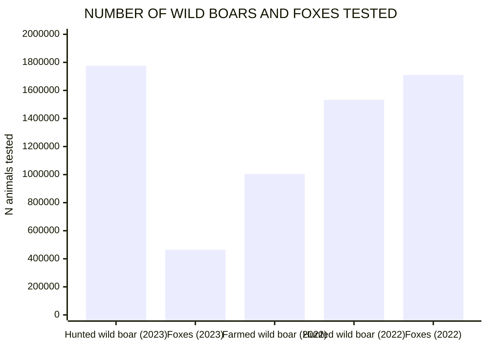
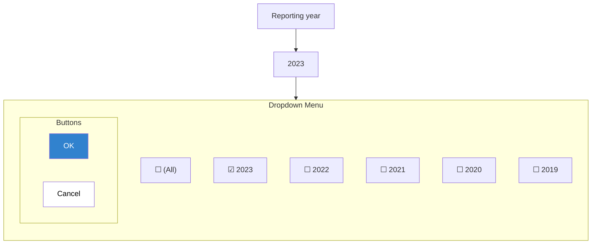

<!--
refigure example output — generated by `refigure.docx.convert()` with Config(use_vlm=True)
Source: efsa-trichinella-dashboard-guide.docx (tests/integration/fixtures/docx/efsa-trichinella-dashboard-guide.docx)
License: CC BY 4.0
Attribution: European Food Safety Authority. User Guide – Dashboard on Trichinella. Supplement to DOI 10.2903/j.efsa.2024.9106 (EU Zoonoses Report).
Source URL: https://zenodo.org/records/13987050
VLM cache: tests/integration/fixtures/vlm-cache/efsa-trichinella-dashboard-guide.json (real VLM call, see that fixture's own commit message for cost/provenance)
Full provenance: tests/integration/fixtures/manifest.yaml
-->

User Guide – Dashboard on *Trichinella*

© European Food Safety Authority, 2024

*(...table of contents omitted for this excerpt...)*

# 1. Introduction

This user guide describes the content and functionalities of the dashboard on *Trichinella* pathogen and provides detailed indications to make full use of this interactive tool. The dashboard is designed to interactively visualise the *Trichinella* data reported each year to EFSA by EU Member States and other reporting countries. It shows metric values such as number of reporting countries, number of animals tested and positive animals, grouped by one or more attributes. Information on the following seven attributes is available in the dashboard: reporting year, EU and non-EU, reporting country, housing condition of animal, animal species, animal species detail. To optimize the data visualisation in the dashboard, different levels of aggregation are defined for some of these attributes; specific filters on different attribute (e.g. Reporting country status and Animal species) can be applied to visualize specific set of information.

In the EFSA dashboard, the *Trichinella* data (since 2019) and related statistics can be displayed interactively using charts, graphs, and maps. The main statistics can also be visualised (and downloaded) in a tabular format.

# 2. Structure of the dashboard

The dashboard on *Trichinella* is composed of the following six pages on:

1. Cover page.
2. Number of tested domestic pigs.
3. Number of tested wild boars and foxes.
4. Occurrence in domestic pigs.
5. Occurrence in wild boars and foxes.
6. Occurrence in other animals.

The user can browse the different pages using the tabs located at the top of the dashboard (Figure 1) or using the index section on the cover page. The selected tab is highlighted in bold, as shown in Figure 1.

> [Figure, docx group 5709bc63a340 — VLM interpretation (google/gemini-3-flash-preview); reconstruction, verify against original]

This figure, titled "Figure 1: Screenshot of tabs of the dashboard pages", is a screenshot from an EFSA (2024) User Guide for a dashboard on Trichinella. The top of the screenshot shows a tabbed navigation bar containing several tabs: "Cover", "Number of tested domestic ...", "Number of tested wild boars a...", "Occurrence in domestic pigs", "Occurrence in wild boars and ...", and "Occurrence in other animals". The "Number of tested domestic ..." tab is currently selected, revealing a sub-menu with links for "Overview" and "Animals tested by country".

Below the navigation bar is a data dashboard view. At the top of this view, there is a warning icon followed by the text "Caution in data interpretation". Two dropdown filters are visible: "EU and non-EU" (set to "(All)") and "Housing condition of the ani..." (set to "(All)"). Underneath these filters, two large summary boxes display key metrics: the "Number of countries" is reported as 31, and the "Number of animals tested" is reported as 416,987,674. A small note at the bottom states, "Each graph can be maximized with the icon that appears in the right corner of the title bar."

> [/VLM interpretation docx group 5709bc63a340]

 **Figure 1**: Screenshot of tabs of the dashboard pages

*(...Figures 2-3, the page-title/caution-icon VLM interpretations, omitted for this excerpt...)*

Figure 4 shows a screenshot of the **filter area** located under the page title. Users can select one or more terms in each filter to retrieve a particular set of data. Some filters (i.e. Reporting year) available in the different pages are associated with an **‘information’ icon**, which provides information about the specific filters. Users can access the detailed message clicking on the ‘information’ icon.

> [Figure, docx group 9afa6d311f52 — VLM interpretation (google/gemini-3-flash-preview); reconstruction, verify against original]

This figure shows a dashboard titled "Trichinella" with a sub-header "Overview of the number of wild boars and foxes tested for Trichinella." The figure displays a set of interactive filter dropdowns that are also shown in a magnified inset box.

The filters are labeled as follows from left to right:
- "EU and non EU" with the selected value "(All)"
- "Animal species" with the selected value "(All)"
- "Animal species detail" with the selected value "(All)"

Below these filters, a bar chart titled "NUMBER OF WILD BOARS AND FOXES TESTED" is partially visible. The y-axis is labeled "N animals tested" and ranges from 0 to 2.0M. The chart shows several light blue bars corresponding to different animal species details from the year 2023. The data labels on the bars, from left to right, are:
- "1,775,817" for "Hunted wild boar" in 2023
- "464,155" for "Foxes" in 2023
- "1,004,198" for "Farmed wild boar" in 2022
- "1,533,618" for "Hunted wild boar" in 2022
- "1,710,721" for "Foxes" in 2022

> [/VLM interpretation docx group 9afa6d311f52]

**Figure 4**: Screenshot of the filter area showing some of the filters included.

*(...Figures 5-7 — main-statistics box and footer-area VLM interpretations — omitted for this excerpt...)*

# 3. Functionalities of the dashboard

## 3.1 Filtering

Different filters can be selected to retrieve a particular set of data. The selected filters work only within each dashboard page.

### 3.1.1 Filtering in the filter area

In the filter area of each dashboard page the user finds drop-down filters (Figure 8); by clicking on the icon of each filter, a list of terms is visualised; one or more options can be selected; by clicking the OK button the user confirms the selection and the drop-down list will be closed.

Figure 8 shows a screenshot of the drop-down list available for the filter ‘Reporting year’.

> [Image, docx media 823674ff8bba — VLM interpretation (google/gemini-3-flash-preview); reconstruction, verify against original]

The image shows a graphical user interface element for selecting a time period. At the top is a label that reads "Reporting year". Below the label is a dropdown selection field displaying the value "2023" with a downward-pointing arrow on the right.

An open menu is visible beneath the selection field, containing a list of selectable options, each with a checkbox to its left. The list includes the following options in descending order: "(All)", "2023", "2022", "2021", "2020", and "2019". The checkbox for the year "2023" is checked with a blue background and a white checkmark, while the checkboxes for all other options are empty squares. At the bottom of this menu are two buttons: a blue button labeled "OK" on the left and a white button with a gray border labeled "Cancel" on the right.

> [/VLM interpretation docx media 823674ff8bba]

**Figure 8**: Screenshot of the drop-down list available for the filter ‘reporting year’

Figure 9 shows in green the filters available in each dashboard page.

|  |  |  |  |  |  |  |  |  |  |  |  |  |
| --- | --- | --- | --- | --- | --- | --- | --- | --- | --- | --- | --- | --- |
| **Filters** | **Dashboard pages** | | | | | | | | | | | |
| **Cover page** | **Number of tested domestic pigs** | | | **Number of tested wild boars and foxes** | | **Occurrence in domestic pigs** | | **Occurrence in wild boars and foxes** | | **Occurrence in other animals** | |
| **Overview** | **Animals tested by country** | **Overview** | | **Animals tested by country** | **Overview** | **Time trends** | **Overview** | **Time trends** | **Overview** | **Time trends** |
| Reporting year |  |  |  |  | |  |  |  |  |  |  |  |
| EU and non-EU |  |  |  |  | |  |  |  |  |  |  |  |
| Reporting country |  |  |  |  | |  |  |  |  |  |  |  |
| Housing condition of animal |  |  |  |  | |  |  |  |  |  |  |  |
| Animal species |  |  |  |  | |  |  |  |  |  |  |  |
| Animal species detail |  |  |  |  | |  |  |  |  |  |  |  |
| Animal category |  |  |  |  | |  |  |  |  |  |  |  |
| Animal category detail |  |  |  |  | |  |  |  |  |  |  |  |

Green: filter available.

**Figure 9**: Filters available in each of the dashboard page

*(...remainder of section 3.2 — graph legends, sorting, the data-feature menu, tabular export, ~500 lines of further VLM-interpreted chart/UI screenshots — omitted for this excerpt; see the full file for the complete conversion...)*
