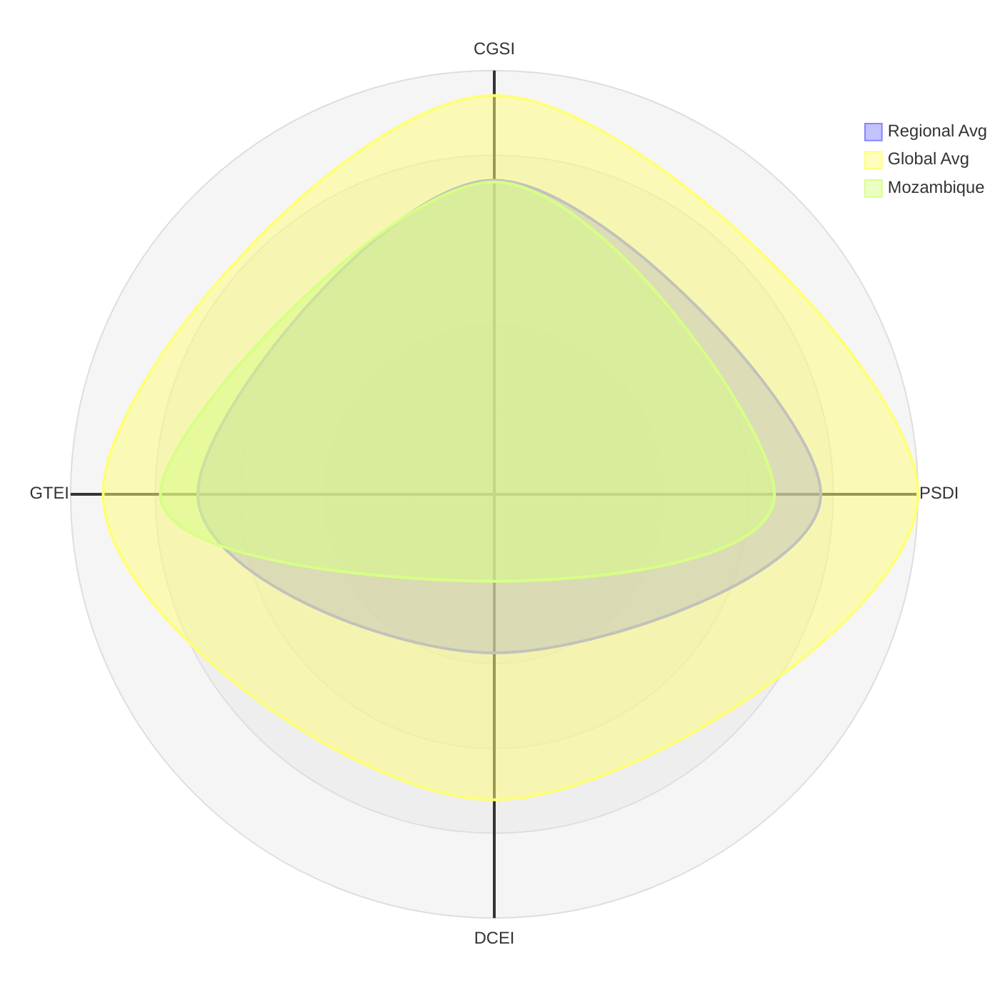
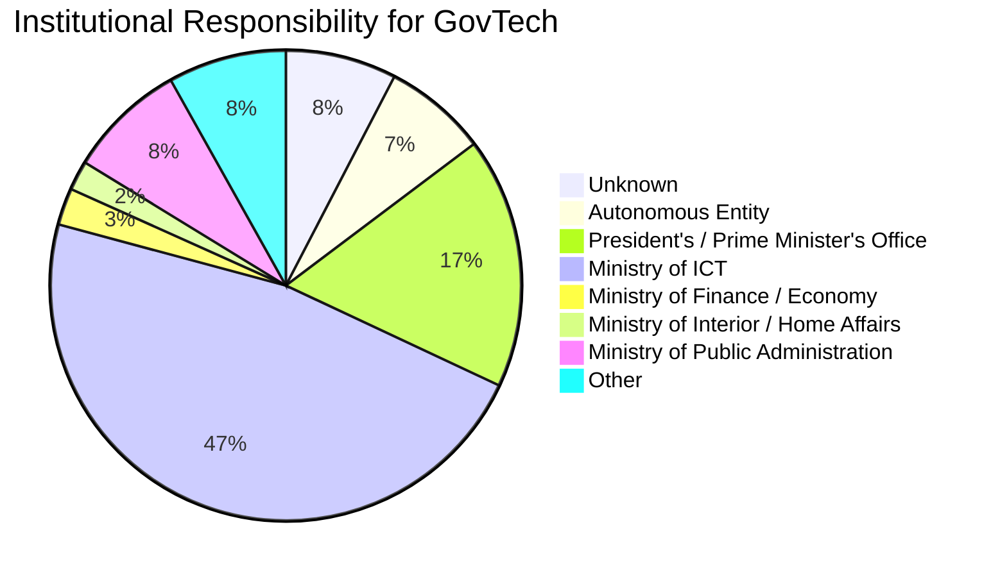

<!--
refigure example output — generated by `refigure.xlsx.convert()`
Source: govtech-2025-charts.xlsx (tests/integration/fixtures/xlsx/govtech-2025-charts.xlsx)
License: CC BY 4.0
Attribution: World Bank Group. GovTech Maturity Index (GTMI) 2025 Update. DOI 10.60572/50tk-0s28.
Source URL: https://datacatalog.worldbank.org/search/dataset/0037889
Full provenance: tests/integration/fixtures/manifest.yaml
-->

*(...the README sheet, a narrative overview table, omitted for this excerpt...)*

## GTMI_Data

| Year | Code | Economy | I-1 | I-1.1 | I-1.2 | I-1.3 | I-1.4 | I-1.5 | I-1.6 | I-1.6.1 | I-1.7 | I-1.8 | I-1.9 | I-1.9.1 | I-1.9.2 | I-2 | I-2.1 | I-2.2 | I-2.3 |
| --- | --- | --- | --- | --- | --- | --- | --- | --- | --- | --- | --- | --- | --- | --- | --- | --- | --- | --- | --- |
| 2020 | AFG | Afghanistan | 0 | - | - | - | New | New | New | New | New | New | New | New | New | 0 | - | - | - |
| 2022 | AFG | Afghanistan | 0 | - | - | - | 0 | - | 0 | - | 0 | 0 | 0 | New | - | 0 | - | - | - |
| 2025 | AFG | Afghanistan | 0 | - | - | - | 0 | - | 0 | - | 0 | 0 | 0 | 0 | - | 0 | - | - | - |
| 2020 | ALB | Albania | 1 | Government Data OneDrive | https://akshi.gov.al/sherbime/sherbimi-onedrive/ | 2014 | New | New | New | New | New | New | New | New | New | 0 | - | - | - |
| 2022 | ALB | Albania | 1 | Government Cloud | 2022-2026 Digital Agenda | 2022 | 2 | National Agency of Information Society | 1 | In progress | 3 | 2 | 0 | New | - | 0 | - | - | - |
| 2025 | ALB | Albania | 2 | Government Hybrid Cloud | https://akshi.gov.al/sherbime/sherbime-te-perqendruara-qeveritare/ | 2022 | 2 | National Agency of Information Society | 1 | https://idp.al/wp-content/uploads/2025/02/ligj-2024-12-19-124-1.pdf | 3 | 2 | 1 | 4 | https://akshi.gov.al/sherbime/sherbime-te-perqendruara-qeveritare/ | 2 | Law No. 43/2023 “On Electronic Governance” | https://akshi.gov.al/wp-content/uploads/2024/11/ligj-2023-06-15-43-i-pe%CC%88rdite%CC%88suar.pdf | 2023 |
| 2020 | DZA | Algeria | 0 | - | - | - | New | New | New | New | New | New | New | New | New | 0 | - | - | - |
| 2022 | DZA | Algeria | 1 | Government Cloud | - | 2023 | 1 | - | 3 | In progress | 4 | 0 | 0 | New | - | 0 | - | - | - |

*(...194 further countries' 2020/2022/2025 rows, plus the GTMI_Groups sheet's per-economy component-score table, omitted for this excerpt...)*

## Stats

> sheet Stats, anchor AH2

Average GTMI score

```mermaid
xychart-beta
x-axis ["A", "B", "C", "D"]
y-axis "Average GTMI score" 0 --> 0.8615
bar [0.5891, 0.5891, 0.5891, 0.5891]
bar [0.8615, 0.6145, 0.3701, 0.1401]
```

| Category | Reg Avg | Avg GTMI |
| --- | --- | --- |
| A | 0.589 | 0.862 |
| B | 0.589 | 0.615 |
| C | 0.589 | 0.370 |
| D | 0.589 | 0.140 |

*(...several further bar-chart anchors on the Stats and Regions sheets omitted for this excerpt...)*

> sheet Stats, anchor AP25

GovTech Maturity Index Components

| Category | Regional Avg  | Global Avg  | Mozambique |
| --- | --- | --- | --- |
| CGSI | 0.487 | 0.619 | 0.484 |
| PSDI | 0.506 | 0.657 | 0.435 |
| DCEI | 0.246 | 0.474 | 0.135 |
| GTEI | 0.460 | 0.607 | 0.518 |

> sheet Stats, anchor BO37

Institutional Responsibility for GovTech

| Category | Economies |
| --- | --- |
| Unknown | 15 |
| Autonomous Entity | 14 |
| President's / Prime Minister's Office | 34 |
| Ministry of ICT | 93 |
| Ministry of Finance / Economy | 5 |
| Ministry of Interior / Home Affairs | 4 |
| Ministry of Public Administration | 16 |
| Other | 16 |

*(...remaining Stats/Regions anchors (a dozen+ further xychart-beta bar charts) plus the Trends, Metadata, External, and Economies sheets omitted for this excerpt; see the full file for the complete conversion...)*
