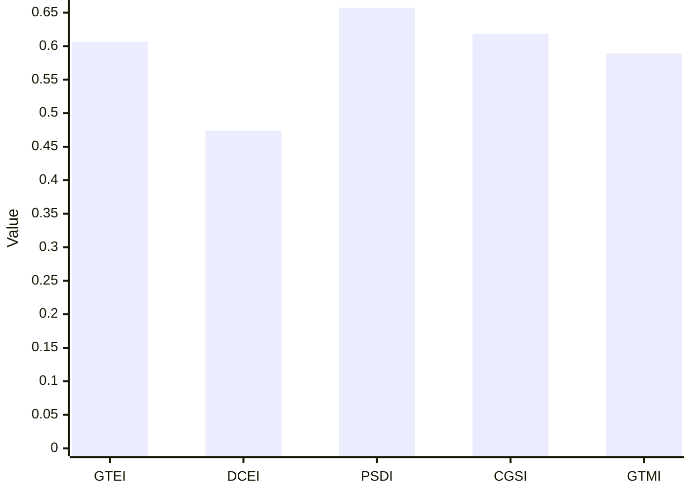
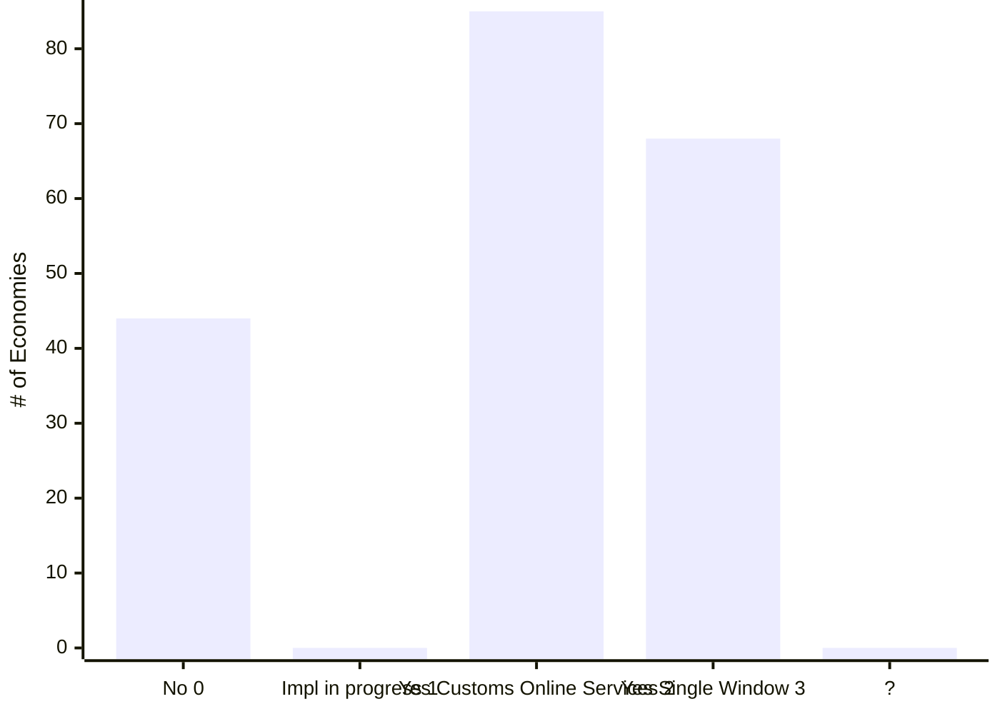
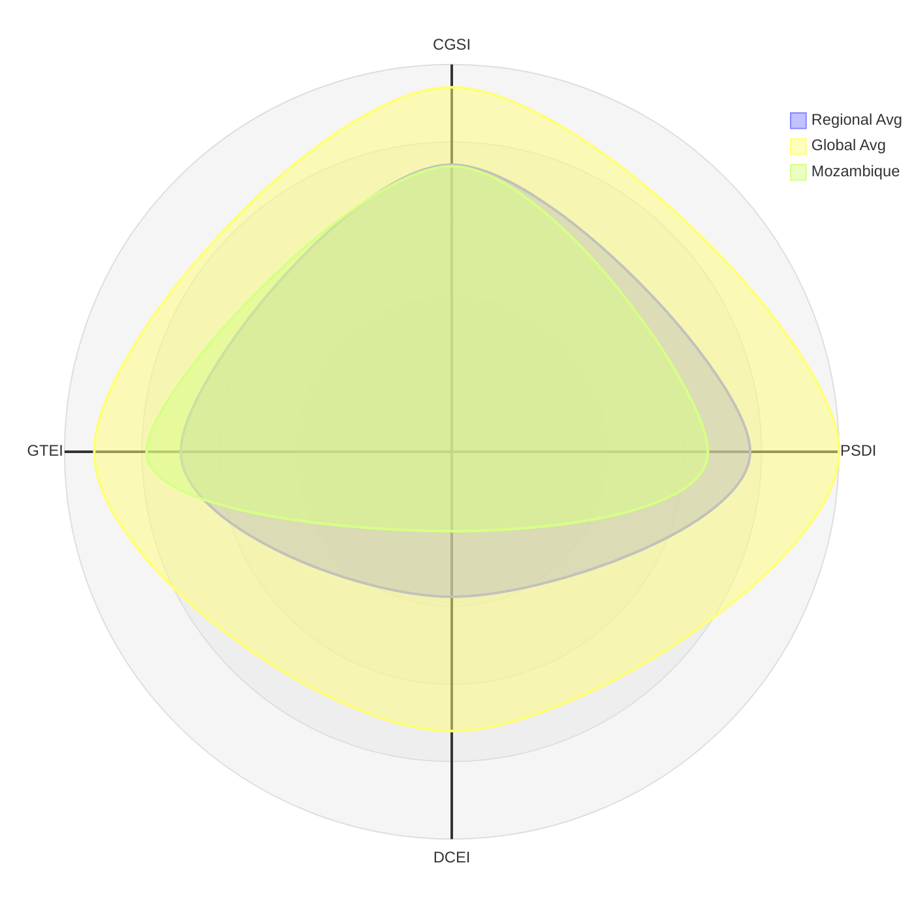
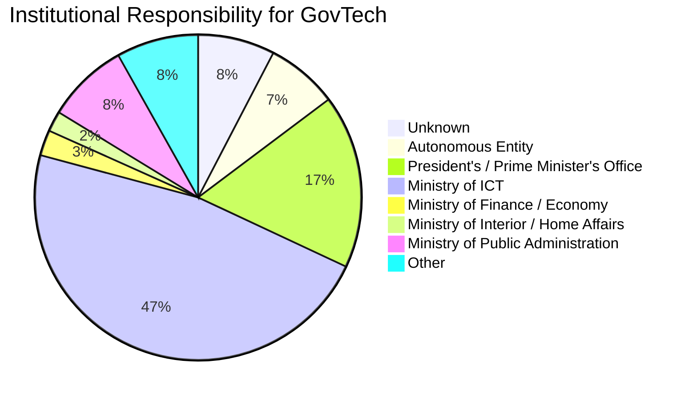

<!--
refigure example output — generated by `refigure.xlsx.convert()`
Source: govtech-2025-charts.xlsx (tests/integration/fixtures/xlsx/govtech-2025-charts.xlsx)
License: CC BY 4.0
Attribution: World Bank Group. GovTech Maturity Index (GTMI) 2025 Update. DOI 10.60572/50tk-0s28.
Source URL: https://datacatalog.worldbank.org/search/dataset/0037889
Full provenance: tests/integration/fixtures/manifest.yaml
-->

## README

|  |  |  |  |  |  | GovTech Maturity Index (GTMI) 2025 Update |  |  |  |  |  |  |  |
| --- | --- | --- | --- | --- | --- | --- | --- | --- | --- | --- | --- | --- | --- |
|  |  |  |  |  |  |  |  |  |  |  |  |  |  |
|  | Workbook sheets |  | Contents |  |  |  |  |  |  |  |  |  |  |
|  | README |  | Presents the contents of the GovTech Dataset and introduces the source data, calculation of the GTMI groups, and other aspects |  |  |  |  |  |  |  |  |  |  |
|  | GTMI_Data |  | 2025 GTMI Dataset including survey responses and remotely collected data (together with 2020 and 2022 data) |  |  |  |  |  |  |  |  |  |  |
|  | GTMI_Groups |  | 2025 GTMI Groups, component scores and the details of calculations |  |  |  |  |  |  |  |  |  |  |
|  | Stats |  | Visuals presenting the int'l outlook, regional, income level, borrower, and FCS distributions, as well as economy/indicator details |  |  |  |  |  |  |  |  |  |  |
|  | Regions |  | Subset of GTMI dataset including 163 countries in seven World Bank regions |  |  |  |  |  |  |  |  |  |  |
|  | Trends |  | Historical trend lines for selected key indicators |  |  |  |  |  |  |  |  |  |  |
|  | Metadata |  | Country data sheet; Explanation of the data fields in the GTMI_Data sheet |  |  |  |  |  |  |  |  |  |  |
|  | External |  | 2024 UN EGDI (I-16, I-18, I-44); e-Participation Index (I-27); 2024 ITU GCI (I-43) |  |  |  |  |  |  |  |  |  |  |
|  | Economies |  | Alphabetic list of 198 economies, together with the list of Fragility and Conflict-affected Situations (FCS) |  |  |  |  |  |  |  |  |  |  |
|  |  |  |  |  |  |  |  |  |  |  |  |  |  |
|  | 2025 GTMI Survey Data |  |  |  |  |  |  |  |  |  |  |  |  |
|  | „   2025 GTMI survey data is presented in the GTMI_Data sheet (together with 2020 and 2022 data covering 198 economies) |  |  |  |  |  |  |  |  |  |  |  |  |
|  |  |  |  |  |  |  |  |  |  |  |  |  |  |
|  | „   Total number of economies included in the 2025 dataset is 197 (Nicaragua didn't authorize the collection of their data) |  |  |  |  |  |  |  |  |  |  |  |  |
|  | „   The GTMI survey includes 43 updated/extended GovTech indicators measuring the maturity of four GovTech focus areas |  |  |  |  |  |  |  |  |  |  |  |  |
|  | „   Additionally, 5 relevant external indicators measured by other relevant indexes, including: |  |  |  |  |  |  |  |  |  |  |  |  |
|  | ⦁  All three components of the United Nations (UN) e-Government Development Index (EGDI) + UN e-Participation Index (EPI) |  |  |  |  |  |  |  |  |  |  |  |  |
|  | ⦁  The ITU’s Global Cybersecurity Index (GCI) |  |  |  |  |  |  |  |  |  |  |  |  |
|  |  |  |  |  |  |  |  |  |  |  |  |  |  |
|  | „   The GTMI is the simple average of the normalized scores of four components: |  |  |  |  |  |  |  |  |  |  |  |  |
|  | ⦁  CGSI - Core Government Systems Index (17 indicators) captures the key aspects of a whole-of-government approach |  |  |  |  |  |  |  |  |  |  |  |  |
|  | ⦁  PSDI - Public Service Delivery Index (9 indicators) presents the state of online portals, e-filing services, e-payment capabilities and more |  |  |  |  |  |  |  |  |  |  |  |  |
|  | ⦁  DCEI - Digital Citizen Engagement Index (6 indicators) measures aspects of public participation platforms, citizen feedback, and open gov/data portals |  |  |  |  |  |  |  |  |  |  |  |  |
|  | ⦁  GTEI - GovTech Enablers Index (16 indicators) captures strategy, institutions, and regulations, as well as digital skills and innovation programs |  |  |  |  |  |  |  |  |  |  |  |  |
|  |  |  |  |  |  |  |  |  |  |  |  |  |  |
|  | „   48 key indicators and related sub-indicators are presented in columns D to PK (424 data fields) |  |  |  |  |  |  |  |  |  |  |  |  |
|  |  |  |  |  |  |  |  |  |  |  |  |  |  |

## GTMI_Data

| Year | Code | Economy | I-1 | I-1.1 | I-1.2 | I-1.3 | I-1.4 | I-1.5 | I-1.6 | I-1.6.1 | I-1.7 | I-1.8 | I-1.9 | I-1.9.1 | I-1.9.2 | I-2 | I-2.1 | I-2.2 | I-2.3 |
| --- | --- | --- | --- | --- | --- | --- | --- | --- | --- | --- | --- | --- | --- | --- | --- | --- | --- | --- | --- |
| 2020 | AFG | Afghanistan | 0 | - | - | - | New | New | New | New | New | New | New | New | New | 0 | - | - | - |
| 2022 | AFG | Afghanistan | 0 | - | - | - | 0 | - | 0 | - | 0 | 0 | 0 | New | - | 0 | - | - | - |
| 2025 | AFG | Afghanistan | 0 | - | - | - | 0 | - | 0 | - | 0 | 0 | 0 | 0 | - | 0 | - | - | - |
| 2020 | ALB | Albania | 1 | Government Data OneDrive | https://akshi.gov.al/sherbime/sherbimi-onedrive/ | 2014 | New | New | New | New | New | New | New | New | New | 0 | - | - | - |
| 2022 | ALB | Albania | 1 | Government Cloud | 2022-2026 Digital Agenda | 2022 | 2 | National Agency of Information Society | 1 | In progress | 3 | 2 | 0 | New | - | 0 | - | - | - |
| 2025 | ALB | Albania | 2 | Government Hybrid Cloud | https://akshi.gov.al/sherbime/sherbime-te-perqendruara-qeveritare/ | 2022 | 2 | National Agency of Information Society | 1 | https://idp.al/wp-content/uploads/2025/02/ligj-2024-12-19-124-1.pdf | 3 | 2 | 1 | 4 | https://akshi.gov.al/sherbime/sherbime-te-perqendruara-qeveritare/ | 2 | Law No. 43/2023 “On Electronic Governance” | https://akshi.gov.al/wp-content/uploads/2024/11/ligj-2023-06-15-43-i-pe%CC%88rdite%CC%88suar.pdf | 2023 |
| 2020 | DZA | Algeria | 0 | - | - | - | New | New | New | New | New | New | New | New | New | 0 | - | - | - |
| 2022 | DZA | Algeria | 1 | Government Cloud | - | 2023 | 1 | - | 3 | In progress | 4 | 0 | 0 | New | - | 0 | - | - | - |
| 2025 | DZA | Algeria | 1 | Government Cloud | https://hcn.dz/SNTN-En.pdf | 2026 | 3 | High Commission for Digitalization | 1 | https://lalgerieaujourdhui.dz/inauguration-dun-cloud-national-dedie-au-stockage-local-des-donnees-un-grand-pas-vers-la-souverainete-numerique/#:~:text=Inauguration%20d'un%20Cloud%20national%20d%C3%A9di%C3%A9%20au%20stockage,vers%20la%20souverainet%C3%A9%20num%C3%A9rique%20%2D%20L'Alg%C3%A9rie%20Aujourd'hui.&text=Avec%20cette%20nouvelle%20infrastructure%2C%20l'Alg%C3%A9rie%20se%20donne,garantissant%20une%20meilleure%20disponibilit%C3%A9%20des%20services%20num%C3%A9riques. | 4 | 1 | 0 | 0 | - | 1 | National Strategy for Digital Transformation in ALGERIA | https://www.hcn.dz | 2026 |
| 2020 | AND | Andorra | 0 | - | - | - | New | New | New | New | New | New | New | New | New | 0 | - | - | - |
| 2022 | AND | Andorra | 0 | - | - | - | 0 | - | 0 | - | 0 | 0 | 0 | New | - | 0 | - | - | - |
| 2025 | AND | Andorra | 0 | - | - | - | 0 | - | 0 | - | 0 | 0 | 0 | 0 | - | 0 | - | - | - |
| 2020 | AGO | Angola | 0 | - | - | - | New | New | New | New | New | New | New | New | New | 0 | - | - | - |
| 2022 | AGO | Angola | 0 | - | - | - | 0 | - | 0 | - | 0 | 0 | 0 | New | - | 0 | - | - | - |
| 2025 | AGO | Angola | 0 | - | - | - | 0 | - | 0 | - | 0 | 0 | 0 | 0 | - | 2 | Arquitectura de Referência do Governo Electrónico | https://ima.gov.ao/fotos/frontend_4/editor2/agenda_governoao27.pdf | 2024 |
| 2020 | ATG | Antigua and Barbuda | 0 | - | - | - | New | New | New | New | New | New | New | New | New | 0 | - | - | - |
| 2022 | ATG | Antigua and Barbuda | 1 | Azure and Private Gov-Cloud | No URL at the moment | 2017 | 3 | Ministry of Information | 3 | Not  defined | 3 | 1 | 0 | New | - | 0 | - | - | - |
| 2025 | ATG | Antigua and Barbuda | 0 | - | - | - | 0 | - | 0 | - | 0 | 0 | 0 | 0 | - | 0 | - | - | - |
| 2020 | ARG | Argentina | 2 | ARSAT | https://www.arsat.com.ar/centro-nacional-de-datos | 2015 | New | New | New | New | New | New | New | New | New | 0 | - | - | - |
| 2022 | ARG | Argentina | 2 | ARSAT | https://www.arsat.com.ar/centro-nacional-de-datos/proyectos/nube-publica-nacional/https://www.arsat.com.ar/ | 2015 | 1 | Empresa Argentina de Soluciones Satelitales | 0 | - | 3 | 2 | 0 | New | - | 0 | - | - | - |
| 2025 | ARG | Argentina | 2 | Nube Pública Nacional | https://nube.arsat.com.ar/ | 2021 | 1 | Empresa Argentina de Soluciones Satelitales | 1 | https://www.arsat.com.ar/soluciones-comerciales/nube-y-datacenter/ | 4 | 2 | 1 | 4 | https://www.bnamericas.com/en/news/more-than-95-of-the-federal-fiber-optic-network-is-already-illuminated#:~:text=Until%20the%20launch%20and%20commissioning,Legal%2C%20Financial%20and%20Insurance%20industries. | 0 | - | - | - |
| 2020 | ARM | Armenia | 0 | - | - | - | New | New | New | New | New | New | New | New | New | 0 | - | - | - |
| 2022 | ARM | Armenia | 1 | Government Cloud Platform | There is no Cloud Platform Strategy yet | 2019 | 3 | EKENG CJSC | 0 | - | 4 | 2 | 0 | New | - | 1 | Government Corporate Network and Data Center | https://www.ekeng.am/en/sub/e_manage | 2012 |
| 2025 | ARM | Armenia | 1 | Government Multi-Cloud Platform | https://www.irtek.am/views/act.aspx?aid=125914 | 2026 | 3 | ISAA, EKENG CJSC | 3 | https://www.irtek.am/views/act.aspx?aid=125914 | 4 | 1 | 0 | 0 | - | 2 | Enterprise Architecture Framework | https://docs.google.com/document/d/1CM82tNIYWVJW2xcmtuJ5F2dJI4mNIlrM/edit?tab=t.0 | 2023 |
| 2020 | AUS | Australia | 2 | Cloud.gov.au | https://cloud.gov.au/ | 2018 | New | New | New | New | New | New | New | New | New | 2 | Open Architecture | https://www.dta.gov.au/our-projects/digital-service-platforms-strategy/digital-platforms-strategic-roadmap | 2019 |
| 2022 | AUS | Australia | 2 | Secure Cloud Strategy | https://www.dta.gov.au/our-projects/secure-cloud-strategy | 2018 | 1 | There are Cloud platforms managed by multiple providers, the largest are hosted by AWS and Microsoft under whole of Government agreements centrally negotiated by the Digital Transformation Agency. | 3 | https://www.dta.gov.au/our-projects/hosting-strategy/hosting-certification-framework | 4 | 1 | 1 | New | Not published | 2 | The Australian Government Architecture | https://www.dta.gov.au/whole-government-architecture | 2021 |
| 2025 | AUS | Australia | 2 | Secure Cloud Strategy | https://architecture.digital.gov.au/secure-cloud-strategy | 2018 | 3 | Digital Transformation Agency (DTA) | 3 | https://www.hostingcertification.gov.au/ | 4 | 1 | 1 | 4 | https://www.digital.gov.au/sites/default/files/documents/2025-03/2025%20Major%20Digital%20Projects%20Report.pdf | 2 | Australian Government Architecture | https://architecture.digital.gov.au/ | 2019 |
| 2020 | AUT | Austria | 2 | GovCloud | https://www.brz.gv.at/en/what_we_do/our_business/cloud-solutions.html | 2013 | New | New | New | New | New | New | New | New | New | 2 | Digital Austria | https://www.bmdw.gv.at/Themen/Digitalisierung/Digitales-Oesterreich.html | 2018 |
| 2022 | AUT | Austria | 2 | GovCloud + Ö-Cloud initiative | https://www.brz.gv.at/en/what_we_do/our_business/cloud-solutions.html | 2013 | 1 | Austrian Federal Computing Center (short: BRZ as abbreviated from the German name Bundesrechenzentrum) | 1 | https://www.brz.gv.at/was-wir-tun/geschaeftsfelder/cloud-solutions.html | 1 | 2 | 1 | New | Internal usage only | 2 | Digital Austria | https://www.bmdw.gv.at/Themen/Digitalisierung/Digitales-Oesterreich.html | 2018 |

## GTMI_Groups

| Year | Code | Economy | Grp | GTMI | GT1 | CGSI | GT2 | PSDI | GT3 | DCEI | GT4 | GTEI | I-1 | I-1.4 | I-1.6 | I-1.7 | I-1.8 | I-1.9 | I-1.9.1 |
| --- | --- | --- | --- | --- | --- | --- | --- | --- | --- | --- | --- | --- | --- | --- | --- | --- | --- | --- | --- |
| 2025 | AFG | Afghanistan | D | 0.12100789492015653 | D | 0.16431800829875517 | C | 0.2753100408163266 | D | 0.019777443609022557 | D | 0.02462608695652174 | 0 | 0 | 0 | 0 | 0 | 0 | 0 |
| 2025 | ALB | Albania | A | 0.9385273487552546 | A | 0.9307039004149378 | A | 0.9410034285714286 | A | 0.9505563909774437 | A | 0.9318456750572083 | 12 | 1 | 1 | 1 | 1 | 2 | 1 |
| 2025 | DZA | Algeria | B | 0.5548755115334016 | B | 0.5446257261410787 | B | 0.6815020408163266 | C | 0.39334736842105267 | B | 0.6000269107551488 | 6 | 1 | 1 | 1 | 1 | 0 | 0 |
| 2025 | AND | Andorra | C | 0.39016981294490316 | C | 0.33226904564315357 | B | 0.5611141224489796 | D | 0.20413233082706767 | C | 0.4631637528604119 | 0 | 0 | 0 | 0 | 0 | 0 | 0 |
| 2025 | AGO | Angola | B | 0.5929368786898562 | B | 0.6948902904564315 | A | 0.7653459591836734 | C | 0.3327879699248121 | B | 0.5787232951945079 | 0 | 0 | 0 | 0 | 0 | 0 | 0 |
| 2025 | ATG | Antigua and Barbuda | D | 0.19382977834886436 | C | 0.3549009128630706 | D | 0.16733844897959185 | D | 0.061804511278195494 | D | 0.19127524027459952 | 0 | 0 | 0 | 0 | 0 | 0 | 0 |
| 2025 | ARG | Argentina | A | 0.7530588938731716 | A | 0.7888401659751038 | A | 0.9065949387755102 | B | 0.6400180451127819 | B | 0.6767824256292906 | 12 | 1 | 1 | 1 | 1 | 2 | 1 |
| 2025 | ARM | Armenia | A | 0.769012775471061 | A | 0.7802443153526971 | A | 0.8122971428571428 | A | 0.7547609022556391 | B | 0.7287487414187643 | 6 | 1 | 1 | 1 | 1 | 0 | 0 |
| 2025 | AUS | Australia | A | 0.9849527090624166 | A | 0.9892574273858922 | A | 0.9923777959183674 | A | 0.9602406015037594 | A | 0.9979350114416476 | 12 | 1 | 1 | 1 | 1 | 2 | 1 |
| 2025 | AUT | Austria | A | 0.9290404945140357 | A | 0.9513341078838174 | A | 0.9759957551020408 | A | 0.855181954887218 | A | 0.9336501601830663 | 12 | 1 | 1 | 1 | 1 | 2 | 1 |
| 2025 | AZE | Azerbaijan | A | 0.7688631475415427 | A | 0.9205148547717842 | A | 0.9743964081632653 | C | 0.3822315789473684 | A | 0.7983097482837528 | 12 | 1 | 1 | 1 | 1 | 2 | 1 |
| 2025 | BHS | Bahamas | B | 0.5022571615265322 | B | 0.5721271369294606 | B | 0.7304695510204081 | D | 0.1621233082706767 | B | 0.5443086498855835 | 12 | 1 | 1 | 1 | 1 | 0 | 0 |
| 2025 | BHR | Bahrain | A | 0.9358569310670041 | A | 0.8707583402489626 | A | 0.9578497959183674 | A | 0.9826947368421052 | A | 0.9321248512585814 | 12 | 1 | 1 | 1 | 1 | 2 | 1 |
| 2025 | BGD | Bangladesh | A | 0.8823196539690765 | A | 0.9327850622406639 | A | 0.9171369795918367 | A | 0.7954406015037594 | A | 0.8839159725400457 | 12 | 1 | 1 | 1 | 1 | 2 | 1 |
| 2025 | BRB | Barbados | C | 0.3181834828340406 | C | 0.43007800829875514 | C | 0.4936375510204082 | D | 0.05933233082706767 | C | 0.28968604118993135 | 0 | 0 | 0 | 0 | 0 | 0 | 0 |
| 2025 | BLR | Belarus | A | 0.7967050828474501 | B | 0.7136403319502075 | A | 0.8441776326530612 | A | 0.8634345864661654 | A | 0.7655677803203661 | 12 | 1 | 1 | 1 | 1 | 2 | 1 |
| 2025 | BEL | Belgium | A | 0.8302825277497499 | A | 0.8503654771784233 | A | 0.9646471836734694 | B | 0.6628812030075188 | A | 0.8432362471395881 | 12 | 1 | 1 | 1 | 1 | 2 | 1 |
| 2025 | BLZ | Belize | C | 0.33884652266151577 | C | 0.46203336099585063 | C | 0.37441142857142856 | D | 0.042027067669172934 | C | 0.476914233409611 | 12 | 1 | 0 | 1 | 1 | 0 | 0 |
| 2025 | BEN | Benin | B | 0.7230424387159233 | B | 0.6878859751037344 | A | 0.8631993469387754 | B | 0.5930646616541353 | B | 0.748019771167048 | 0 | 0 | 0 | 0 | 0 | 0 | 0 |
| 2025 | BTN | Bhutan | A | 0.8141306896861236 | A | 0.8498066390041494 | A | 0.8699056326530612 | B | 0.7205774436090225 | A | 0.8162330434782609 | 12 | 1 | 1 | 1 | 1 | 0 | 0 |
| 2025 | BOL | Bolivia | B | 0.5721194505831084 | B | 0.6950489626556017 | B | 0.7117084081632653 | C | 0.28716390977443607 | B | 0.5945565217391304 | 0 | 0 | 0 | 0 | 0 | 0 | 0 |
| 2025 | BIH | Bosnia and Herzegovina | C | 0.43283273365212466 | B | 0.5573251452282157 | C | 0.28166008163265305 | B | 0.5650345864661653 | C | 0.3273111212814645 | 0 | 0 | 0 | 0 | 0 | 0 | 0 |
| 2025 | BWA | Botswana | C | 0.46893341052523063 | B | 0.605308713692946 | B | 0.6308754285714285 | C | 0.2674887218045113 | C | 0.37206077803203663 | 0 | 0 | 0 | 0 | 0 | 0 | 0 |
| 2025 | BRA | Brazil | A | 0.9859831686754061 | A | 0.9903825726141079 | A | 0.9908222040816327 | A | 0.9752781954887217 | A | 0.9874497025171625 | 12 | 1 | 1 | 1 | 1 | 2 | 1 |
| 2025 | BRN | Brunei Darussalam | B | 0.536313822843493 | C | 0.48689460580912863 | B | 0.6976522448979592 | C | 0.4374375939849624 | B | 0.5232708466819221 | 12 | 1 | 1 | 1 | 1 | 0 | 0 |
| 2025 | BGR | Bulgaria | A | 0.7621469364373796 | B | 0.7012648962655602 | A | 0.9287552653061224 | A | 0.7526977443609023 | B | 0.6658698398169336 | 12 | 1 | 1 | 1 | 1 | 0 | 0 |
| 2025 | BFA | Burkina Faso | C | 0.43342792208014175 | B | 0.5098267219917012 | B | 0.5514422857142858 | D | 0.13729924812030075 | B | 0.5351434324942792 | 12 | 1 | 0 | 1 | 1 | 2 | 1 |
| 2025 | BDI | Burundi | C | 0.4129126279184728 | B | 0.518243153526971 | C | 0.30836897959183673 | C | 0.4530887218045113 | C | 0.37194965675057207 | 6 | 1 | 1 | 1 | 1 | 0 | 0 |
| 2025 | CPV | Cabo Verde | A | 0.7741292786206386 | A | 0.8022960995850623 | A | 0.8307758367346938 | B | 0.737966917293233 | B | 0.7254782608695652 | 12 | 1 | 1 | 1 | 1 | 0 | 0 |

## Stats

| WBreg | Code | Economy | 2025 Grp | GTMI | CGSI | CGSIs | PSDI | PSDIs | DCEI | DCEIs | GTEI | GTEIs | Src | Reg | Level | FCS | Borr | Pop | Sml |
| --- | --- | --- | --- | --- | --- | --- | --- | --- | --- | --- | --- | --- | --- | --- | --- | --- | --- | --- | --- |
| MNA | AFG | Afghanistan | D | 0.12100789492015653 | D | 0.16431800829875517 | C | 0.2753100408163266 | D | 0.019777443609022557 | D | 0.02462608695652174 | R | MNA | L | FCS-1 | IDA | 41.454761 | 0 |
| ECA | ALB | Albania | A | 0.9385273487552546 | A | 0.9307039004149378 | A | 0.9410034285714286 | A | 0.9505563909774437 | A | 0.9318456750572083 | S | ECA | UM | - | IBRD | 2.811655 | 0 |
| MNA | DZA | Algeria | B | 0.5548755115334016 | B | 0.5446257261410787 | B | 0.6815020408163266 | C | 0.39334736842105267 | B | 0.6000269107551488 | S | MNA | UM | - | IBRD | 46.164218999999996 | 0 |
| - | AND | Andorra | C | 0.39016981294490316 | C | 0.33226904564315357 | B | 0.5611141224489796 | D | 0.20413233082706767 | C | 0.4631637528604119 | R | ECA | H | - | - | 0.0809 | 1 |
| AFE | AGO | Angola | B | 0.5929368786898562 | B | 0.6948902904564315 | A | 0.7653459591836734 | C | 0.3327879699248121 | B | 0.5787232951945079 | S | AFR | LM | - | IBRD | 36.749906 | 0 |
| LCR | ATG | Antigua and Barbuda | D | 0.19382977834886436 | C | 0.3549009128630706 | D | 0.16733844897959185 | D | 0.061804511278195494 | D | 0.19127524027459952 | R | LCR | H | - | IBRD | 0.0933 | 1 |
| LCR | ARG | Argentina | A | 0.7530588938731716 | A | 0.7888401659751038 | A | 0.9065949387755102 | B | 0.6400180451127819 | B | 0.6767824256292906 | S | LCR | UM | - | IBRD | 45.538401 | 0 |
| ECA | ARM | Armenia | A | 0.769012775471061 | A | 0.7802443153526971 | A | 0.8122971428571428 | A | 0.7547609022556391 | B | 0.7287487414187643 | S | ECA | UM | - | IBRD | 2.943393 | 0 |
| - | AUS | Australia | A | 0.9849527090624166 | A | 0.9892574273858922 | A | 0.9923777959183674 | A | 0.9602406015037594 | A | 0.9979350114416476 | S | EAP | H | - | - | 26.451124 | 0 |
| - | AUT | Austria | A | 0.9290404945140357 | A | 0.9513341078838174 | A | 0.9759957551020408 | A | 0.855181954887218 | A | 0.9336501601830663 | S | ECA | H | - | - | 9.130429 | 0 |
| ECA | AZE | Azerbaijan | A | 0.7688631475415427 | A | 0.9205148547717842 | A | 0.9743964081632653 | C | 0.3822315789473684 | A | 0.7983097482837528 | S | ECA | UM | - | IBRD | 10.318207000000001 | 0 |
| LCR | BHS | Bahamas | B | 0.5022571615265322 | B | 0.5721271369294606 | B | 0.7304695510204081 | D | 0.1621233082706767 | B | 0.5443086498855835 | S | LCR | H | - | - | 0.39944 | 1 |
| MNA | BHR | Bahrain | A | 0.9358569310670041 | A | 0.8707583402489626 | A | 0.9578497959183674 | A | 0.9826947368421052 | A | 0.9321248512585814 | S | MNA | H | - | - | 1.569666 | 0 |
| SAR | BGD | Bangladesh | A | 0.8823196539690765 | A | 0.9327850622406639 | A | 0.9171369795918367 | A | 0.7954406015037594 | A | 0.8839159725400457 | S | SAR | LM | - | IDA | 171.46698999999998 | 0 |
| LCR | BRB | Barbados | C | 0.3181834828340406 | C | 0.43007800829875514 | C | 0.4936375510204082 | D | 0.05933233082706767 | C | 0.28968604118993135 | S | LCR | H | - | IBRD | 0.28233600000000003 | 1 |
| ECA | BLR | Belarus | A | 0.7967050828474501 | B | 0.7136403319502075 | A | 0.8441776326530612 | A | 0.8634345864661654 | A | 0.7655677803203661 | S | ECA | UM | - | IBRD | 9.115680000000001 | 0 |
| - | BEL | Belgium | A | 0.8302825277497499 | A | 0.8503654771784233 | A | 0.9646471836734694 | B | 0.6628812030075188 | A | 0.8432362471395881 | S | ECA | H | - | - | 11.712893 | 0 |
| LCR | BLZ | Belize | C | 0.33884652266151577 | C | 0.46203336099585063 | C | 0.37441142857142856 | D | 0.042027067669172934 | C | 0.476914233409611 | S | LCR | UM | - | Blend | 0.41110599999999997 | 1 |
| AFW | BEN | Benin | B | 0.7230424387159233 | B | 0.6878859751037344 | A | 0.8631993469387754 | B | 0.5930646616541353 | B | 0.748019771167048 | S | AFR | LM | - | IDA | 14.111034 | 0 |
| SAR | BTN | Bhutan | A | 0.8141306896861236 | A | 0.8498066390041494 | A | 0.8699056326530612 | B | 0.7205774436090225 | A | 0.8162330434782609 | S | SAR | LM | - | IDA | 0.786385 | 0 |
| LCR | BOL | Bolivia | B | 0.5721194505831084 | B | 0.6950489626556017 | B | 0.7117084081632653 | C | 0.28716390977443607 | B | 0.5945565217391304 | S | LCR | LM | - | IBRD | 12.244159 | 0 |
| ECA | BIH | Bosnia and Herzegovina | C | 0.43283273365212466 | B | 0.5573251452282157 | C | 0.28166008163265305 | B | 0.5650345864661653 | C | 0.3273111212814645 | S | ECA | UM | - | IBRD | 3.185073 | 0 |
| AFE | BWA | Botswana | C | 0.46893341052523063 | B | 0.605308713692946 | B | 0.6308754285714285 | C | 0.2674887218045113 | C | 0.37206077803203663 | S | AFR | UM | - | IBRD | 2.4802440000000003 | 0 |
| LCR | BRA | Brazil | A | 0.9859831686754061 | A | 0.9903825726141079 | A | 0.9908222040816327 | A | 0.9752781954887217 | A | 0.9874497025171625 | S | LCR | UM | - | IBRD | 211.140729 | 0 |
| - | BRN | Brunei Darussalam | B | 0.536313822843493 | C | 0.48689460580912863 | B | 0.6976522448979592 | C | 0.4374375939849624 | B | 0.5232708466819221 | R | EAP | H | - | - | 0.458949 | 1 |
| ECA | BGR | Bulgaria | A | 0.7621469364373796 | B | 0.7012648962655602 | A | 0.9287552653061224 | A | 0.7526977443609023 | B | 0.6658698398169336 | S | ECA | H | - | IBRD | 6.795803 | 0 |
| AFW | BFA | Burkina Faso | C | 0.43342792208014175 | B | 0.5098267219917012 | B | 0.5514422857142858 | D | 0.13729924812030075 | B | 0.5351434324942792 | S | AFR | L | FCS-1 | IDA | 23.025776 | 0 |
| AFE | BDI | Burundi | C | 0.4129126279184728 | B | 0.518243153526971 | C | 0.30836897959183673 | C | 0.4530887218045113 | C | 0.37194965675057207 | S | AFR | L | FCS-2 | IDA | 13.68945 | 0 |
| AFW | CPV | Cabo Verde | A | 0.7741292786206386 | A | 0.8022960995850623 | A | 0.8307758367346938 | B | 0.737966917293233 | B | 0.7254782608695652 | S | AFR | UM | - | Blend | 0.522331 | 0 |

> sheet Stats, anchor AH2

Average GTMI score

```mermaid
xychart-beta
x-axis ["A", "B", "C", "D"]
y-axis "Average GTMI score" 0 --> 0.8615
bar [0.5891, 0.5891, 0.5891, 0.5891]
bar [0.8615, 0.6145, 0.3701, 0.1401]
```

| Category | Reg Avg | Avg GTMI |
| --- | --- | --- |
| A | 0.589 | 0.862 |
| B | 0.589 | 0.615 |
| C | 0.589 | 0.370 |
| D | 0.589 | 0.140 |

> sheet Stats, anchor AL2

Avg GTMI Components

```mermaid
xychart-beta
x-axis ["GTEI", "DCEI", "PSDI", "CGSI", "GTMI"]
y-axis "Value" 0 --> 0.6572
bar [0.6067, 0.4739, 0.6572, 0.6186, 0.5891]
```

| Category | Series 1 |
| --- | --- |
| GTEI | 0.61 |
| DCEI | 0.47 |
| PSDI | 0.66 |
| CGSI | 0.62 |
| GTMI | 0.59 |

> sheet Stats, anchor AQ6

```mermaid
xychart-beta
x-axis ["GTEI", "DCEI", "PSDI", "CGSI", "GTMI"]
y-axis "Value" 0 --> 0.6572
bar [0.6067, 0.4739, 0.6572, 0.6186, 0.5891]
bar [0.5179, 0.1348, 0.4347, 0.4845, 0.393]
```

| Category | Avg | Mozambique |
| --- | --- | --- |
| GTEI | 0.607 | 0.518 |
| DCEI | 0.474 | 0.135 |
| PSDI | 0.657 | 0.435 |
| CGSI | 0.619 | 0.484 |
| GTMI | 0.589 | 0.393 |

> sheet Stats, anchor BO10

Distribution of Responses — # of Economies

```mermaid
xychart-beta
x-axis ["No  0", "Impl in progress  1", "Yes Customs Online Services  2", "Yes Single Window  3", "?"]
y-axis "# of Economies" 0 --> 85
bar [44, 0, 85, 68, 0]
```

| Category | Econ |
| --- | --- |
| No  0 | 44 |
| Impl in progress  1 | 0 |
| Yes (Customs Online Services)  2 | 85 |
| Yes (Single Window)  3 | 68 |
|    | 0 |

> sheet Stats, anchor V14

Avg GTMI component scores

```mermaid
xychart-beta
x-axis ["A", "B", "C", "D"]
y-axis "Avg GTMI component scores" 0 --> 0.8842
bar [0.8672, 0.6298, 0.3838, 0.1845]
bar [0.8842, 0.6357, 0.3832, 0.08138]
bar [0.8767, 0.6231, 0.3609, 0.09037]
bar [0.8779, 0.6428, 0.3841, 0.1338]
```

| Category | Avg CGSI | Avg PSDI | Avg DCEI | Avg GTEI |
| --- | --- | --- | --- | --- |
| A | 0.867 | 0.884 | 0.877 | 0.878 |
| B | 0.630 | 0.636 | 0.623 | 0.643 |
| C | 0.384 | 0.383 | 0.361 | 0.384 |
| D | 0.185 | 0.081 | 0.090 | 0.134 |

> sheet Stats, anchor AH14

Average GTMI score

```mermaid
xychart-beta
x-axis ["H", "UM", "LM", "L"]
y-axis "Average GTMI score" 0 --> 0.733
bar [0.5891, 0.5891, 0.5891, 0.5891]
bar [0.733, 0.6039, 0.529, 0.3001]
```

| Category | Reg Avg | Avg GTMI |
| --- | --- | --- |
| H | 0.589 | 0.733 |
| UM | 0.589 | 0.604 |
| LM | 0.589 | 0.529 |
| L | 0.589 | 0.300 |

> sheet Stats, anchor BV14

Income Level Distribution — Economies

```mermaid
xychart-beta
x-axis ["0", "1", "2", "3", "4"]
y-axis "Economies" 0 --> 32
bar [8, 0, 27, 32, 0]
bar [8, 0, 30, 17, 0]
bar [12, 0, 21, 16, 0]
bar [16, 0, 7, 3, 0]
```

| Category | H | UM | LM | L |
| --- | --- | --- | --- | --- |
| 0 | 8 | 8 | 12 | 16 |
| 1 | 0 | 0 | 0 | 0 |
| 2 | 27 | 30 | 21 | 7 |
| 3 | 32 | 17 | 16 | 3 |
| 4 | 0 | 0 | 0 | 0 |

> sheet Stats, anchor CK14

Distribution by Groups — Economies

```mermaid
xychart-beta
x-axis ["0", "1", "2", "3", "4"]
y-axis "Economies" 0 --> 48
bar [2, 0, 30, 48, 0]
bar [3, 0, 22, 17, 0]
bar [16, 0, 28, 3, 0]
bar [23, 0, 5, 0, 0]
```

| Category | A | B | C | D |
| --- | --- | --- | --- | --- |
| 0 | 2 | 3 | 16 | 23 |
| 1 | 0 | 0 | 0 | 0 |
| 2 | 30 | 22 | 28 | 5 |
| 3 | 48 | 17 | 3 | 0 |
| 4 | 0 | 0 | 0 | 0 |

> sheet Stats, anchor AP25

GovTech Maturity Index Components

```mermaid
radar-beta
axis cgsi["CGSI"], psdi["PSDI"], dcei["DCEI"], gtei["GTEI"]
curve regional_avg["Regional Avg"]{0.4873, 0.5064, 0.2459, 0.4599}
curve global_avg["Global Avg"]{0.6186, 0.6572, 0.4739, 0.6067}
curve mozambique["Mozambique"]{0.4845, 0.4347, 0.1348, 0.5179}
```

| Category | Regional Avg  | Global Avg  | Mozambique |
| --- | --- | --- | --- |
| CGSI | 0.487 | 0.619 | 0.484 |
| PSDI | 0.506 | 0.657 | 0.435 |
| DCEI | 0.246 | 0.474 | 0.135 |
| GTEI | 0.460 | 0.607 | 0.518 |

> sheet Stats, anchor AH26

Economies

| Category | D | C | B | A |
| --- | --- | --- | --- | --- |
| NAM | 0 | 0 | 0 | 2 |
| SAR | 0 | 1 | 2 | 3 |
| MNA | 5 | 2 | 8 | 8 |
| LCR | 2 | 12 | 7 | 11 |
| ECA | 2 | 4 | 7 | 40 |
| EAP | 6 | 9 | 8 | 10 |
| AFR | 13 | 19 | 10 | 6 |

> sheet Stats, anchor BV27

Regional Distribution — Economies

```mermaid
xychart-beta
x-axis ["0", "1", "2", "3", "4"]
y-axis "Economies" 0 --> 23
bar [18, 0, 19, 11, 0]
bar [6, 0, 13, 14, 0]
bar [8, 0, 22, 23, 0]
bar [5, 0, 17, 10, 0]
bar [6, 0, 11, 6, 0]
bar [1, 0, 3, 2, 0]
bar [0, 0, 0, 2, 0]
```

| Category | AFR | EAP | ECA | LCR | MNA | SAR | NAM |
| --- | --- | --- | --- | --- | --- | --- | --- |
| 0 | 18 | 6 | 8 | 5 | 6 | 1 | 0 |
| 1 | 0 | 0 | 0 | 0 | 0 | 0 | 0 |
| 2 | 19 | 13 | 22 | 17 | 11 | 3 | 0 |
| 3 | 11 | 14 | 23 | 10 | 6 | 2 | 2 |
| 4 | 0 | 0 | 0 | 0 | 0 | 0 | 0 |

> sheet Stats, anchor CL28

Responses, by Group — Economies

| Category | D | C | B | A |
| --- | --- | --- | --- | --- |
| 0 | 23 | 16 | 3 | 2 |
| 1 | 0 | 0 | 0 | 0 |
| 2 | 5 | 28 | 22 | 30 |
| 3 | 0 | 3 | 17 | 48 |
| 4 | 0 | 0 | 0 | 0 |

> sheet Stats, anchor BO37

Institutional Responsibility for GovTech

```mermaid
pie title Institutional Responsibility for GovTech
    "Unknown" : 15
    "Autonomous Entity" : 14
    "President's / Prime Minister's Office" : 34
    "Ministry of ICT" : 93
    "Ministry of Finance / Economy" : 5
    "Ministry of Interior / Home Affairs" : 4
    "Ministry of Public Administration" : 16
    "Other" : 16
```

| Category | Economies |
| --- | --- |
| Unknown | 15 |
| Autonomous Entity | 14 |
| President's / Prime Minister's Office | 34 |
| Ministry of ICT | 93 |
| Ministry of Finance / Economy | 5 |
| Ministry of Interior / Home Affairs | 4 |
| Ministry of Public Administration | 16 |
| Other | 16 |

> sheet Stats, anchor AH39

Regional Avg GTMI Components, by Groups — Avg GTMI component scores

```mermaid
xychart-beta
x-axis ["A", "B", "C", "D"]
y-axis "Avg GTMI component scores" 0 --> 0.867
bar [0.852, 0.614, 0.3894, 0]
bar [0.8654, 0.6308, 0.4095, 0.1272]
bar [0.867, 0.6124, 0.3369, 0.1074]
bar [0.862, 0.6035, 0.3748, 0.14]
```

| Category | Avg CGSI | Avg PSDI | Avg DCEI | Avg GTEI |
| --- | --- | --- | --- | --- |
| A | 0.852 | 0.865 | 0.867 | 0.862 |
| B | 0.614 | 0.631 | 0.612 | 0.604 |
| C | 0.389 | 0.410 | 0.337 | 0.375 |
| D | 0.000 | 0.127 | 0.107 | 0.140 |

> sheet Stats, anchor AH51

Avg GTMI component scores

```mermaid
xychart-beta
x-axis ["AFR", "EAP", "ECA", "LCR", "MNA", "NAM", "SAR"]
y-axis "Avg GTMI component scores" 0 --> 0.8723
bar [0.4873, 0.5512, 0.7681, 0.5972, 0.609, 0.8511, 0.7909]
bar [0.5064, 0.5992, 0.8184, 0.6535, 0.6387, 0.8723, 0.7764]
bar [0.2459, 0.462, 0.6794, 0.42, 0.5192, 0.8448, 0.5389]
bar [0.4599, 0.5459, 0.7807, 0.5776, 0.5945, 0.8713, 0.6928]
```

| Category | Avg CGSI | Avg PSDI | Avg DCEI | Avg GTEI |
| --- | --- | --- | --- | --- |
| AFR | 0.487 | 0.506 | 0.246 | 0.460 |
| EAP | 0.551 | 0.599 | 0.462 | 0.546 |
| ECA | 0.768 | 0.818 | 0.679 | 0.781 |
| LCR | 0.597 | 0.654 | 0.420 | 0.578 |
| MNA | 0.609 | 0.639 | 0.519 | 0.595 |
| NAM | 0.851 | 0.872 | 0.845 | 0.871 |
| SAR | 0.791 | 0.776 | 0.539 | 0.693 |

> sheet Stats, anchor AH63

# of Economies

```mermaid
xychart-beta
x-axis ["A", "B", "C", "D"]
y-axis "# of Economies" 0 --> 46
bar [46, 9, 8, 4]
bar [24, 11, 15, 5]
bar [8, 20, 15, 6]
bar [2, 2, 9, 13]
```

| Category | High | Upper Middle | Lower Middle | Low |
| --- | --- | --- | --- | --- |
| A | 46 | 24 | 8 | 2 |
| B | 9 | 11 | 20 | 2 |
| C | 8 | 15 | 15 | 9 |
| D | 4 | 5 | 6 | 13 |

> sheet Stats, anchor AP63

# of Economies

| Category | High | Upper Middle | Lower Middle | Low |
| --- | --- | --- | --- | --- |
| A | 46 | 24 | 8 | 2 |
| B | 9 | 11 | 20 | 2 |
| C | 8 | 15 | 15 | 9 |
| D | 4 | 5 | 6 | 13 |

> sheet Stats, anchor AH75

Avg GTMI component scores

```mermaid
xychart-beta
x-axis ["High", "Upper Middle", "Lower Middle", "Low"]
y-axis "Avg GTMI component scores" 0 --> 0.8016
bar [0.7188, 0.6435, 0.5917, 0.3582]
bar [0.8016, 0.6768, 0.6017, 0.3476]
bar [0.6556, 0.4939, 0.369, 0.161]
bar [0.6556, 0.4939, 0.369, 0.161]
```

| Category | Avg CGSI | Avg PSDI | Avg DCEI | Avg GTEI |
| --- | --- | --- | --- | --- |
| High | 0.719 | 0.802 | 0.656 | 0.656 |
| Upper Middle | 0.643 | 0.677 | 0.494 | 0.494 |
| Lower Middle | 0.592 | 0.602 | 0.369 | 0.369 |
| Low | 0.358 | 0.348 | 0.161 | 0.161 |

> sheet Stats, anchor AH87

# of Economies

```mermaid
xychart-beta
x-axis ["A", "B", "C", "D"]
y-axis "# of Economies" 0 --> 39
bar [6, 12, 22, 19]
bar [32, 18, 11, 6]
bar [3, 4, 10, 1]
bar [39, 8, 4, 2]
```

| Category | IDA | IBRD | Blend | Non-borrowing |
| --- | --- | --- | --- | --- |
| A | 6 | 32 | 3 | 39 |
| B | 12 | 18 | 4 | 8 |
| C | 22 | 11 | 10 | 4 |
| D | 19 | 6 | 1 | 2 |

> sheet Stats, anchor AH99

Avg GTMI component scores

```mermaid
xychart-beta
x-axis ["IDA", "IBRD", "Blend", "Non-borrowing"]
y-axis "Avg GTMI component scores" 0 --> 0.8298
bar [0.4575, 0.6796, 0.5461, 0.7454]
bar [0.4506, 0.7215, 0.5862, 0.8298]
bar [0.2438, 0.5463, 0.2921, 0.7003]
bar [0.4154, 0.6563, 0.4985, 0.794]
```

| Category | Avg CGSI | Avg PSDI | Avg DCEI | Avg GTEI |
| --- | --- | --- | --- | --- |
| IDA | 0.457 | 0.451 | 0.244 | 0.415 |
| IBRD | 0.680 | 0.722 | 0.546 | 0.656 |
| Blend | 0.546 | 0.586 | 0.292 | 0.498 |
| Non-borrowing | 0.745 | 0.830 | 0.700 | 0.794 |

> sheet Stats, anchor AH112

# of Economies

```mermaid
xychart-beta
x-axis ["A", "B", "C", "D"]
y-axis "# of Economies" 0 --> 78
bar [1, 3, 8, 9]
bar [1, 1, 6, 10]
bar [78, 38, 33, 9]
```

| Category | Conflict (FCS-1) | Fragile (FCS-2) | Other |
| --- | --- | --- | --- |
| A | 1 | 1 | 78 |
| B | 3 | 1 | 38 |
| C | 8 | 6 | 33 |
| D | 9 | 10 | 9 |

> sheet Stats, anchor AH124

Avg GTMI component scores

```mermaid
xychart-beta
x-axis ["Conflict FCS-1", "Fragile FCS-2", "Other"]
y-axis "Avg GTMI component scores" 0 --> 0.7351
bar [0.3734, 0.3579, 0.6809]
bar [0.3886, 0.2866, 0.7351]
bar [0.1931, 0.1714, 0.5457]
bar [0.3368, 0.2765, 0.6802]
```

| Category | Avg CGSI | Avg PSDI | Avg DCEI | Avg GTEI |
| --- | --- | --- | --- | --- |
| Conflict (FCS-1) | 0.373 | 0.389 | 0.193 | 0.337 |
| Fragile (FCS-2) | 0.358 | 0.287 | 0.171 | 0.277 |
| Other | 0.681 | 0.735 | 0.546 | 0.680 |

> sheet Stats, anchor AH148

Economies

| Category | D | C | B | A |
| --- | --- | --- | --- | --- |
| SAR | 0 | 1 | 2 | 3 |
| MNA | 5 | 2 | 8 | 8 |
| LCR | 2 | 11 | 7 | 11 |
| ECA | 1 | 2 | 6 | 21 |
| EAP | 5 | 8 | 6 | 6 |
| AFR | 13 | 19 | 10 | 6 |

> sheet Stats, anchor AH160

Avg GTMI component scores

```mermaid
xychart-beta
x-axis ["AFR", "EAP", "ECA", "LCR", "MNA", "SAR"]
y-axis "Avg GTMI component scores" 0 --> 0.8029
bar [0.4873, 0.5429, 0.7847, 0.599, 0.609, 0.7909]
bar [0.5064, 0.5552, 0.8029, 0.6582, 0.6387, 0.7764]
bar [0.2459, 0.411, 0.6867, 0.4269, 0.5192, 0.5389]
bar [0.4599, 0.5123, 0.7583, 0.5809, 0.5945, 0.6928]
```

| Category | Avg CGSI | Avg PSDI | Avg DCEI | Avg GTEI |
| --- | --- | --- | --- | --- |
| AFR | 0.487 | 0.506 | 0.246 | 0.460 |
| EAP | 0.543 | 0.555 | 0.411 | 0.512 |
| ECA | 0.785 | 0.803 | 0.687 | 0.758 |
| LCR | 0.599 | 0.658 | 0.427 | 0.581 |
| MNA | 0.609 | 0.639 | 0.519 | 0.595 |
| SAR | 0.791 | 0.776 | 0.539 | 0.693 |

## Regions

| WBreg | Code | Economy > 2025 data | I-1 | I-2 | I-3 | I-4 | I-5 | I-6 | I-7 | I-8 | I-9 | I-10 | I-11 | I-12 | I-13 | I-14 | I-15 | I-17 | I-19 |
| --- | --- | --- | --- | --- | --- | --- | --- | --- | --- | --- | --- | --- | --- | --- | --- | --- | --- | --- | --- |
| AFE | AGO | Angola | 0 | 2 | 2 | 2 | 2 | 2 | 2 | 2 | 1 | 2 | 2 | 2 | 2 | 2 | 0 | 2 | 2 |
| AFE | BWA | Botswana | 0 | 2 | 1 | 0 | 2 | 2 | 2 | 2 | 2 | 2 | 2 | 2 | 2 | 0 | 1 | 2 | 2 |
| AFE | BDI | Burundi | 1 | 0 | 0 | 2 | 2 | 2 | 2 | 2 | 2 | 2 | 2 | 2 | 2 | 1 | 0 | 0 | 0 |
| AFE | COM | Comoros | 0 | 2 | 0 | 1 | 2 | 0 | 0 | 2 | 0 | 2 | 2 | 1 | 2 | 0 | 0 | 0 | 1 |
| AFE | COD | Congo, Dem. Rep. | 0 | 0 | 0 | 0 | 2 | 0 | 2 | 2 | 2 | 2 | 2 | 0 | 2 | 0 | 0 | 2 | 0 |
| AFE | ERI | Eritrea | 0 | 0 | 0 | 0 | 0 | 0 | 0 | 2 | 0 | 0 | 2 | 0 | 0 | 0 | 0 | 0 | 0 |
| AFE | SWZ | Eswatini | 0 | 0 | 2 | 0 | 1 | 1 | 2 | 2 | 2 | 2 | 2 | 1 | 2 | 0 | 0 | 0 | 0 |
| AFE | ETH | Ethiopia | 1 | 2 | 2 | 0 | 2 | 2 | 2 | 2 | 2 | 2 | 2 | 2 | 2 | 0 | 0 | 1 | 2 |
| AFE | KEN | Kenya | 2 | 2 | 2 | 1 | 2 | 2 | 2 | 2 | 2 | 2 | 2 | 2 | 2 | 2 | 1 | 2 | 1 |
| AFE | LSO | Lesotho | 0 | 1 | 1 | 1 | 2 | 2 | 2 | 2 | 2 | 2 | 2 | 0 | 2 | 0 | 0 | 1 | 1 |
| AFE | MDG | Madagascar | 0 | 0 | 2 | 2 | 2 | 2 | 2 | 2 | 2 | 2 | 2 | 2 | 2 | 0 | 0 | 0 | 1 |
| AFE | MWI | Malawi | 1 | 1 | 0 | 2 | 2 | 2 | 2 | 2 | 2 | 2 | 2 | 2 | 2 | 0 | 0 | 0 | 1 |
| AFE | MUS | Mauritius | 2 | 2 | 2 | 2 | 2 | 2 | 2 | 2 | 2 | 2 | 2 | 2 | 2 | 2 | 1 | 2 | 2 |
| AFE | MOZ | Mozambique | 0 | 0 | 2 | 0 | 2 | 2 | 2 | 2 | 2 | 2 | 2 | 2 | 2 | 2 | 0 | 0 | 1 |
| AFE | NAM | Namibia | 0 | 0 | 0 | 2 | 2 | 2 | 2 | 2 | 0 | 0 | 2 | 2 | 2 | 0 | 0 | 0 | 1 |
| AFE | RWA | Rwanda | 2 | 2 | 0 | 2 | 2 | 2 | 2 | 2 | 2 | 2 | 2 | 2 | 2 | 2 | 0 | 2 | 2 |
| AFE | STP | São Tomé and Principe | 0 | 0 | 1 | 0 | 2 | 2 | 0 | 2 | 0 | 2 | 2 | 0 | 2 | 0 | 0 | 2 | 0 |
| AFE | SYC | Seychelles | 0 | 0 | 0 | 0 | 1 | 2 | 2 | 2 | 2 | 2 | 2 | 2 | 2 | 0 | 0 | 0 | 2 |
| AFE | SOM | Somalia | 0 | 0 | 0 | 0 | 2 | 2 | 1 | 1 | 1 | 1 | 0 | 0 | 2 | 0 | 0 | 0 | 0 |
| AFE | ZAF | South Africa | 2 | 2 | 2 | 1 | 2 | 2 | 2 | 2 | 2 | 2 | 2 | 2 | 2 | 0 | 1 | 2 | 2 |
| AFE | SSD | South Sudan | 0 | 0 | 0 | 0 | 2 | 1 | 0 | 0 | 0 | 0 | 2 | 2 | 2 | 0 | 0 | 0 | 2 |
| AFE | SDN | Sudan | 0 | 0 | 0 | 0 | 2 | 1 | 0 | 2 | 0 | 0 | 2 | 2 | 2 | 0 | 0 | 0 | 0 |
| AFE | TZA | Tanzania | 2 | 2 | 2 | 2 | 2 | 2 | 2 | 2 | 2 | 2 | 2 | 2 | 2 | 2 | 2 | 2 | 1 |
| AFE | UGA | Uganda | 2 | 2 | 2 | 2 | 2 | 2 | 2 | 2 | 2 | 2 | 2 | 2 | 2 | 2 | 0 | 2 | 0 |
| AFE | ZMB | Zambia | 1 | 1 | 2 | 2 | 2 | 2 | 2 | 2 | 2 | 2 | 2 | 2 | 2 | 1 | 0 | 2 | 2 |
| AFE | ZWE | Zimbabwe | 0 | 2 | 0 | 0 | 2 | 1 | 2 | 2 | 2 | 2 | 2 | 2 | 2 | 2 | 0 | 0 | 1 |
| AFW | BEN | Benin | 0 | 2 | 2 | 2 | 2 | 2 | 2 | 2 | 2 | 2 | 2 | 2 | 2 | 0 | 0 | 2 | 2 |
| AFW | BFA | Burkina Faso | 2 | 0 | 2 | 0 | 2 | 2 | 2 | 2 | 2 | 2 | 2 | 0 | 2 | 0 | 1 | 0 | 1 |
| AFW | CPV | Cabo Verde | 2 | 2 | 1 | 2 | 2 | 2 | 2 | 2 | 2 | 2 | 2 | 2 | 2 | 2 | 0 | 2 | 2 |

> sheet Regions, anchor AY50

| Category | Yes | Planned / In progress | No |
| --- | --- | --- | --- |
| Nat'l Strategy on Disruptive Tech  I-17 | 14 | 5 | 12 |
| Open Source Software Policy  I-15 | 5 | 7 | 19 |
| Public Investment Mgmt System  I-14 | 17 | 1 | 13 |
| Debt Management System  I-13 | 31 | 0 | 0 |
| e-Procurement Portal  I-12 | 27 | 0 | 4 |
| Social Insurance/Pension System  I-11 | 31 | 0 | 0 |
| Payroll System  I-10 | 23 | 3 | 5 |
| Human Resources MIS  I-9 | 26 | 2 | 3 |
| Customs Mgmt Information System  I-8 | 31 | 0 | 0 |
| Tax Mgmt Information System  I-7 | 31 | 0 | 0 |
| Treasury Single Account  I-6 | 23 | 7 | 1 |
| Financial Mgmt Information System  I-5 | 29 | 2 | 0 |
| Government Service Bus  I-4 | 14 | 4 | 13 |
| Gov Interoperability Framework  I-3 | 12 | 4 | 15 |
| Gov Enterprise Architecture  I-2 | 5 | 3 | 23 |
| Government Cloud  I-1 | 13 | 6 | 12 |

> sheet Regions, anchor BK50

```mermaid
xychart-beta
x-axis ["I-17", "I-15", "I-14", "I-13", "I-12", "I-11", "I-10", "I-9", "I-8", "I-7", "I-6", "I-5", "I-4", "I-3", "I-2", "I-1"]
y-axis "Value" 0 --> 0.2258
bar [0.129, 0, 0.06452, 0, 0.03226, 0.03226, 0, 0.03226, 0, 0, 0.09677, 0, 0.1613, 0.1613, 0.03226, 0.1613]
bar [0.03226, 0.03226, 0, 0, 0, 0, 0.2258, 0.09677, 0, 0, 0.06452, 0.03226, 0.09677, 0.2258, 0.1935, 0.129]
```

| Category | % Increase | % Decrease |
| --- | --- | --- |
| I-17 | 13% | 3% |
| I-15 | 0% | 3% |
| I-14 | 6% | 0% |
| I-13 | 0% | 0% |
| I-12 | 3% | 0% |
| I-11 | 3% | 0% |
| I-10 | 0% | 23% |
| I-9 | 3% | 10% |
| I-8 | 0% | 0% |
| I-7 | 0% | 0% |
| I-6 | 10% | 6% |
| I-5 | 0% | 3% |
| I-4 | 16% | 10% |
| I-3 | 16% | 23% |
| I-2 | 3% | 19% |
| I-1 | 16% | 13% |

> sheet Regions, anchor EE51

| Category | Yes | Planned / In progress | No |
| --- | --- | --- | --- |
| Nat'l Strategy on Disruptive Tech  I-17 | 112 | 20 | 65 |
| Open Source Software Policy  I-15 | 25 | 54 | 118 |
| Public Investment Mgmt System  I-14 | 78 | 8 | 111 |
| Debt Management System  I-13 | 177 | 2 | 18 |
| e-Procurement Portal  I-12 | 157 | 10 | 30 |
| Social Insurance/Pension System  I-11 | 190 | 0 | 7 |
| Payroll System  I-10 | 154 | 9 | 34 |
| Human Resources MIS  I-9 | 150 | 13 | 34 |
| Customs Mgmt Information System  I-8 | 190 | 1 | 6 |
| Tax Mgmt Information System  I-7 | 182 | 5 | 10 |
| Treasury Single Account  I-6 | 141 | 31 | 25 |
| Financial Mgmt Information System  I-5 | 185 | 8 | 4 |
| Government Service Bus  I-4 | 102 | 20 | 75 |
| Gov Interoperability Framework  I-3 | 104 | 26 | 67 |
| Gov Enterprise Architecture  I-2 | 78 | 27 | 92 |
| Government Cloud  I-1 | 103 | 31 | 63 |

> sheet Regions, anchor EO51

```mermaid
xychart-beta
x-axis ["I-17", "I-15", "I-14", "I-13", "I-12", "I-11", "I-10", "I-9", "I-8", "I-7", "I-6", "I-5", "I-4", "I-3", "I-2", "I-1"]
y-axis "Value" 0 --> 0.2081
bar [0.2081, 0.08629, 0.1269, 0.01523, 0.06091, 0.0203, 0.05584, 0.05584, 0.03046, 0.04061, 0.1574, 0.02538, 0.1675, 0.1878, 0.2081, 0.1878]
bar [0.03046, 0.06599, 0.05584, 0.03553, 0.06599, 0.0203, 0.1117, 0.1015, 0, 0.01523, 0.04061, 0.03553, 0.08122, 0.09645, 0.08122, 0.07614]
```

| Category | % Increase | % Decrease |
| --- | --- | --- |
| I-17 | 21% | 3% |
| I-15 | 9% | 7% |
| I-14 | 13% | 6% |
| I-13 | 2% | 4% |
| I-12 | 6% | 7% |
| I-11 | 2% | 2% |
| I-10 | 6% | 11% |
| I-9 | 6% | 10% |
| I-8 | 3% | 0% |
| I-7 | 4% | 2% |
| I-6 | 16% | 4% |
| I-5 | 3% | 4% |
| I-4 | 17% | 8% |
| I-3 | 19% | 10% |
| I-2 | 21% | 8% |
| I-1 | 19% | 8% |

> sheet Regions, anchor AY71

| Category | Yes | Planned / In progress | No |
| --- | --- | --- | --- |
| Use of Digital ID in services  I-26 | 16 |  | 15 |
| Job Portal  I-25 | 20 | 1 | 10 |
| Social Ins/Pension Online Services  I-24 | 22 | 1 | 8 |
| Customs Services/Single Window  I-23 | 26 | 0 | 5 |
| e-Payment Services  I-22 | 28 | 0 | 3 |
| e-Filing for Tax/Customs  I-21 | 27 | 0 | 4 |
| Tax Online Service Portal  I-20 | 28 | 1 | 2 |
| Online Public Service Portal  I-19 | 19 | 10 | 2 |

> sheet Regions, anchor BK71

| Category | % Increase | % Decrease |
| --- | --- | --- |
| I-26 |  |  |
| I-25 | 3% | 6% |
| I-24 | 10% | 6% |
| I-23 | 61% | 3% |
| I-22 | 16% | 6% |
| I-21 | 6% | 10% |
| I-20 | 6% | 10% |
| I-19 | 10% | 10% |

> sheet Regions, anchor EE72

| Category | Yes | Planned / In progress | No |
| --- | --- | --- | --- |
| Use of Digital ID in services  I-26 | 117 |  | 80 |
| Job Portal  I-25 | 151 | 4 | 42 |
| Social Ins/Pension Online Services  I-24 | 139 | 7 | 51 |
| Customs Services/Single Window  I-23 | 153 | 0 | 44 |
| e-Payment Services  I-22 | 157 | 7 | 33 |
| e-Filing for Tax/Customs  I-21 | 155 | 3 | 39 |
| Tax Online Service Portal  I-20 | 167 | 4 | 26 |
| Online Public Service Portal  I-19 | 121 | 46 | 30 |

> sheet Regions, anchor EO72

| Category | % Increase | % Decrease |
| --- | --- | --- |
| I-26 |  |  |
| I-25 | 10% | 3% |
| I-24 | 12% | 6% |
| I-23 | 62% | 3% |
| I-22 | 10% | 5% |
| I-21 | 10% | 5% |
| I-20 | 7% | 6% |
| I-19 | 13% | 8% |

> sheet Regions, anchor AY83

| Category | Yes | No |
| --- | --- | --- |
| Citizen Engagement Stats Public  I-32 | 10 | 21 |
| Gov Platform for Citizen Feedback  I-31 | 19 | 12 |
| Nat'l Platform for Citizen Particip  I-30 | 14 | 17 |
| Open Data Portal  I-29 | 17 | 14 |
| Open Government Portal  I-28 | 19 | 12 |

> sheet Regions, anchor BK83

```mermaid
xychart-beta
x-axis ["I-32", "I-31", "I-30", "I-29", "I-28"]
y-axis "Value" 0 --> 0.1613
bar [0.06452, 0.1613, 0.03226, 0.03226, 0.09677]
bar [0.09677, 0.03226, 0, 0.1613, 0.06452]
```

| Category | % Increase | % Decrease |
| --- | --- | --- |
| I-32 | 6% | 10% |
| I-31 | 16% | 3% |
| I-30 | 3% | 0% |
| I-29 | 3% | 16% |
| I-28 | 10% | 6% |

> sheet Regions, anchor EE84

| Category | Yes | No |
| --- | --- | --- |
| Citizen Engagement Stats Public  I-32 | 61 | 136 |
| Gov Platform for Citizen Feedback  I-31 | 123 | 74 |
| Nat'l Platform for Citizen Particip  I-30 | 113 | 84 |
| Open Data Portal  I-29 | 126 | 71 |
| Open Government Portal  I-28 | 126 | 71 |

> sheet Regions, anchor EO84

```mermaid
xychart-beta
x-axis ["I-32", "I-31", "I-30", "I-29", "I-28"]
y-axis "Value" 0 --> 0.1878
bar [0.08122, 0.1371, 0.1015, 0.05584, 0.1218]
bar [0.07614, 0.06599, 0.0203, 0.1878, 0.08629]
```

| Category | % Increase | % Decrease |
| --- | --- | --- |
| I-32 | 8% | 8% |
| I-31 | 14% | 7% |
| I-30 | 10% | 2% |
| I-29 | 6% | 19% |
| I-28 | 12% | 9% |

> sheet Regions, anchor AY93

| Category | Yes | Planned / In progress | No |
| --- | --- | --- | --- |
| Gov Policy on GovTech Startups  I-48 | 20 |  | 11 |
| Gov Entity for PS Innovation  I-47 | 24 | 2 | 5 |
| Public Sector Innovation Strategy  I-46 | 12 | 10 | 9 |
| Gov Strategy/Prog on Digital Skills  I-45 | 15 | 11 | 5 |
| Digital Signature Platform  I-42 | 18 | 8 | 5 |
| AI Ethical Guidelines  I-41 | 10 | 5 | 16 |
| Green Tech policy for GovTech  I-40 | 12 | 6 | 13 |
| Data Protection Authority  I-39 | 16 | 2 | 13 |
| Data Protection / Privacy Laws  I-38 | 23 | 6 | 2 |
| Right to Information Laws  I-37 | 24 | 2 | 5 |
| Whole-of-Government Approach  I-36 | 5 | 19 | 7 |
| GovTech / Digital Transf Strategy  I-35 | 25 | 3 | 3 |
| Dedicated Data Governance Entity  I-34 | 15 | 1 | 15 |
| Dedicated DG/GovTech Entity  I-33 | 29 | 0 | 2 |

> sheet Regions, anchor BK93

| Category | % Increase | % Decrease |
| --- | --- | --- |
| I-48 | 23% | 3% |
| I-47 | 32% | 3% |
| I-46 | 29% | 10% |
| I-45 | 45% | 10% |
| I-42 | 23% | 10% |
| I-41 |  |  |
| I-40 |  |  |
| I-39 | 16% | 10% |
| I-38 | 16% | 10% |
| I-37 | 10% | 3% |
| I-36 | 3% | 23% |
| I-35 | 23% | 23% |
| I-34 | 23% | 10% |
| I-33 | 16% | 3% |

> sheet Regions, anchor EE94

| Category | Yes | Planned / In progress | No |
| --- | --- | --- | --- |
| Gov Policy on GovTech Startups  I-48 | 128 |  | 69 |
| Gov Entity for PS Innovation  I-47 | 148 | 6 | 43 |
| Public Sector Innovation Strategy  I-46 | 76 | 69 | 52 |
| Gov Strategy/Prog on Digital Skills  I-45 | 95 | 54 | 48 |
| Digital Signature Platform  I-42 | 111 | 48 | 38 |
| AI Ethical Guidelines  I-41 | 77 | 36 | 84 |
| Green Tech policy for GovTech  I-40 | 85 | 28 | 84 |
| Data Protection Authority  I-39 | 132 | 9 | 56 |
| Data Protection / Privacy Laws  I-38 | 153 | 17 | 27 |
| Right to Information Laws  I-37 | 139 | 11 | 47 |
| Whole-of-Government Approach  I-36 | 46 | 98 | 53 |
| GovTech / Digital Transf Strategy  I-35 | 160 | 15 | 22 |
| Dedicated Data Governance Entity  I-34 | 119 | 14 | 64 |
| Dedicated DG/GovTech Entity  I-33 | 182 | 0 | 15 |

> sheet Regions, anchor EO94

| Category | % Increase | % Decrease |
| --- | --- | --- |
| I-48 | 17% | 4% |
| I-47 | 19% | 6% |
| I-46 | 27% | 7% |
| I-45 | 25% | 8% |
| I-42 | 17% | 8% |
| I-41 |  |  |
| I-40 |  |  |
| I-39 | 13% | 4% |
| I-38 | 12% | 6% |
| I-37 | 11% | 4% |
| I-36 | 10% | 27% |
| I-35 | 26% | 24% |
| I-34 | 25% | 4% |
| I-33 | 15% | 2% |

> sheet Regions, anchor BD116

```mermaid
xychart-beta
x-axis ["A", "B", "C", "D"]
y-axis "Value" 0 --> 0.8378
bar [0.8378, 0.569, 0.338, 0.1969]
line [0.5471, 0.5471, 0.5471, 0.5471]
```

| Category | Avg GTMI | Reg Avg |
| --- | --- | --- |
| A | 0.838 | 0.547 |
| B | 0.569 | 0.547 |
| C | 0.338 | 0.547 |
| D | 0.197 | 0.547 |

> sheet Regions, anchor BH116

```mermaid
xychart-beta
x-axis ["A", "B", "C", "D"]
y-axis "Value" 0 --> 0.8416
bar [0.8416, 0.5992, 0.3429, 0.1657]
line [0.5663, 0.5663, 0.5663, 0.5663]
```

| Category | Avg GTMI | Reg Avg |
| --- | --- | --- |
| A | 0.842 | 0.566 |
| B | 0.599 | 0.566 |
| C | 0.343 | 0.566 |
| D | 0.166 | 0.566 |

> sheet Regions, anchor BD133

```mermaid
xychart-beta
x-axis ["A", "B", "C", "D"]
y-axis "Value" 0 --> 0.5734
bar [0.549, 0.5734, 0.4439, 0]
line [0.5471, 0.5471, 0.5471, 0.5471]
```

| Category | Avg GTMI | Reg Avg |
| --- | --- | --- |
| A | 0.549 | 0.547 |
| B | 0.573 | 0.547 |
| C | 0.444 | 0.547 |
| D | 0.000 | 0.547 |

> sheet Regions, anchor BH133

```mermaid
xychart-beta
x-axis ["H", "UM", "LM", "L"]
y-axis "Value" 0 --> 0.6006
bar [0.5452, 0.6006, 0.4302, 0]
line [0.5663, 0.5663, 0.5663, 0.5663]
```

| Category | Avg GTMI | Reg Avg |
| --- | --- | --- |
| H | 0.545 | 0.566 |
| UM | 0.601 | 0.566 |
| LM | 0.430 | 0.566 |
| L | 0.000 | 0.566 |

> sheet Regions, anchor BD159

Economies

| Category | D | C | B | A |
| --- | --- | --- | --- | --- |
| SAR | 0 | 1 | 2 | 3 |
| MNA | 5 | 2 | 8 | 8 |
| LCR | 2 | 11 | 7 | 11 |
| ECA | 1 | 2 | 6 | 21 |
| EAP | 5 | 8 | 6 | 6 |
| AFW | 7 | 8 | 6 | 1 |
| AFE | 6 | 11 | 4 | 5 |

> sheet Regions, anchor AW172

```mermaid
xychart-beta
x-axis ["GTEI", "DCEI", "PSDI", "CGSI", "GTMI"]
y-axis "Value" 0 --> 0.6582
bar [0.5809, 0.4269, 0.6582, 0.599, 0.5663]
```

| Category | Avg GTMI scores |
| --- | --- |
| GTEI | 0.581 |
| DCEI | 0.427 |
| PSDI | 0.658 |
| CGSI | 0.599 |
| GTMI | 0.566 |

> sheet Regions, anchor BD181

```mermaid
xychart-beta
x-axis ["AFE", "AFW", "EAP", "ECA", "LCR", "MNA", "SAR"]
y-axis "Value" 0 --> 0.8029
bar [0.5261, 0.4415, 0.5429, 0.7847, 0.599, 0.609, 0.7909]
bar [0.5244, 0.4851, 0.5552, 0.8029, 0.6582, 0.6387, 0.7764]
bar [0.2885, 0.1955, 0.411, 0.6867, 0.4269, 0.5192, 0.5389]
bar [0.4805, 0.4356, 0.5123, 0.7583, 0.5809, 0.5945, 0.6928]
```

| Category | Avg CGSI | Avg PSDI | Avg DCEI | Avg GTEI |
| --- | --- | --- | --- | --- |
| AFE | 0.526 | 0.524 | 0.289 | 0.480 |
| AFW | 0.442 | 0.485 | 0.196 | 0.436 |
| EAP | 0.543 | 0.555 | 0.411 | 0.512 |
| ECA | 0.785 | 0.803 | 0.687 | 0.758 |
| LCR | 0.599 | 0.658 | 0.427 | 0.581 |
| MNA | 0.609 | 0.639 | 0.519 | 0.595 |
| SAR | 0.791 | 0.776 | 0.539 | 0.693 |

> sheet Regions, anchor AW194

```mermaid
xychart-beta
x-axis ["GTEI", "DCEI", "PSDI", "CGSI", "GTMI"]
y-axis "Value" 0 --> 0.694
bar [0.4908, 0.4129, 0.694, 0.5907, 0.5471]
```

| Category | Avg GTMI scores |
| --- | --- |
| GTEI | 0.491 |
| DCEI | 0.413 |
| PSDI | 0.694 |
| CGSI | 0.591 |
| GTMI | 0.547 |

> sheet Regions, anchor BD213

```mermaid
xychart-beta
x-axis ["FCS-1", "FCS-2", "Non-FCS"]
y-axis "Value" 0 --> 0.6089
bar [0.3509, 0.2668, 0.6089]
line [0.5471, 0.5471, 0.5471]
```

| Category | Avg GTMI | Reg Avg |
| --- | --- | --- |
| FCS-1 | 0.351 | 0.547 |
| FCS-2 | 0.267 | 0.547 |
| Non-FCS | 0.609 | 0.547 |

> sheet Regions, anchor BH213

```mermaid
xychart-beta
x-axis ["FCS-1", "FCS-2", "Non-FCS"]
y-axis "Value" 0 --> 0.6605
bar [0.3229, 0.2731, 0.6605]
line [0.5663, 0.5663, 0.5663]
```

| Category | Avg GTMI | Reg Avg |
| --- | --- | --- |
| FCS-1 | 0.323 | 0.566 |
| FCS-2 | 0.273 | 0.566 |
| Non-FCS | 0.660 | 0.566 |

## Trends

|  | Trends > | Diffusion of PFM institutions and Government systems |  |  |  |  |  |  |  |  |  | 2025 |  |  |  |  |  |  |  |
| --- | --- | --- | --- | --- | --- | --- | --- | --- | --- | --- | --- | --- | --- | --- | --- | --- | --- | --- | --- |
|  |  | False |  |  |  |  |  |  |  |  |  |  |  |  |  |  |  |  |  |
|  |  |  |  |  |  |  |  |  |  |  |  | Year | FMIS | F | Trea | Tr | TSA | Ts | Tax |
|  |  |  |  |  |  |  |  |  |  |  |  | 1984 | 0 | 0 | 107 | 107 | 16 | 16 | 78 |
|  |  |  |  |  |  |  |  |  |  |  |  | 1985 | 0 | 0 | 1 | 108 | 2 | 18 | 0 |
|  |  |  |  |  |  |  |  |  |  |  |  | 1986 | 0 | 0 | 3 | 111 | 0 | 18 | 1 |
|  |  |  |  |  |  |  |  |  |  |  |  | 1987 | 1 | 1 | 1 | 112 | 1 | 19 | 0 |
|  |  |  |  |  |  |  |  |  |  |  |  | 1988 | 0 | 1 | 2 | 114 | 2 | 21 | 2 |
|  |  |  |  |  |  |  |  |  |  |  |  | 1989 | 0 | 1 | 1 | 115 | 2 | 23 | 2 |
|  |  |  |  |  |  |  |  |  |  |  |  | 1990 | 0 | 1 | 6 | 121 | 3 | 26 | 11 |
|  |  |  |  |  |  |  |  |  |  |  |  | 1991 | 0 | 1 | 4 | 125 | 0 | 26 | 7 |
|  |  |  |  |  |  |  |  |  |  |  |  | 1992 | 0 | 1 | 2 | 127 | 0 | 26 | 6 |
|  |  |  |  |  |  |  |  |  |  |  |  | 1993 | 0 | 1 | 5 | 132 | 1 | 27 | 3 |
|  |  |  |  |  |  |  |  |  |  |  |  | 1994 | 0 | 1 | 4 | 136 | 1 | 28 | 5 |
|  |  |  |  |  |  |  |  |  |  |  |  | 1995 | 2 | 3 | 7 | 143 | 3 | 31 | 5 |
|  |  |  |  |  |  |  |  |  |  |  |  | 1996 | 1 | 4 | 5 | 148 | 0 | 31 | 2 |
|  |  |  |  |  |  |  |  |  |  |  |  | 1997 | 4 | 8 | 6 | 154 | 8 | 39 | 3 |
|  |  |  |  |  |  |  |  |  |  |  |  | 1998 | 2 | 10 | 1 | 155 | 4 | 43 | 5 |
|  |  |  |  |  |  |  |  |  |  |  |  | 1999 | 8 | 18 | 1 | 156 | 2 | 45 | 4 |
|  |  |  |  |  |  |  |  |  |  |  |  | 2000 | 4 | 22 | 3 | 159 | 3 | 48 | 4 |
|  |  |  |  |  |  |  |  |  |  |  |  | 2001 | 8 | 30 | 4 | 163 | 6 | 54 | 4 |
|  |  |  |  |  |  |  |  |  |  |  |  | 2002 | 4 | 34 | 6 | 169 | 9 | 63 | 4 |
|  |  |  |  |  |  |  |  |  |  |  |  | 2003 | 7 | 41 | 2 | 171 | 1 | 64 | 4 |
|  |  |  |  |  |  |  |  |  |  |  |  | 2004 | 7 | 48 | 3 | 174 | 7 | 71 | 5 |
|  |  |  |  |  |  |  |  |  |  |  |  | 2005 | 4 | 52 | 4 | 178 | 5 | 76 | 1 |
|  |  |  |  |  |  |  |  |  |  |  |  | 2006 | 12 | 64 | 2 | 180 | 5 | 81 | 5 |
|  |  |  |  |  |  |  |  |  |  |  |  | 2007 | 8 | 72 | 1 | 181 | 9 | 90 | 2 |
|  |  |  |  |  |  |  |  |  |  |  |  | 2008 | 8 | 80 | 3 | 184 | 8 | 98 | 3 |
|  |  |  |  |  |  |  |  |  |  |  |  | 2009 | 11 | 91 | 2 | 186 | 11 | 109 | 3 |
|  |  |  |  |  |  |  |  |  |  |  |  | 2010 | 9 | 100 | 0 | 186 | 6 | 115 | 5 |

> sheet Trends, anchor CP2

UN eGov Development Index (2024) vs. WBG GovTech Maturity Index (2025) — UN eGovernment Development Index

| Category | UN eGDI |
| --- | --- |
| 0.20827 | 0.12 |
| 0.8 | 0.94 |
| 0.59556 | 0.55 |
| 0.68931 | 0.39 |
| 0.41487 | 0.59 |
| 0.64282 | 0.19 |
| 0.85733 | 0.75 |
| 0.84217 | 0.77 |
| 0.9577 | 0.98 |
| 0.90653 | 0.93 |
| 0.76073 | 0.77 |
| 0.71434 | 0.50 |
| 0.91958 | 0.94 |
| 0.65696 | 0.88 |
| 0.6815 | 0.32 |
| 0.74449 | 0.80 |
| 0.81212 | 0.83 |
| 0.48719 | 0.34 |
| 0.45779 | 0.72 |
| 0.6511 | 0.81 |
| 0.66508 | 0.57 |
| 0.63293 | 0.43 |
| 0.61178 | 0.47 |
| 0.84026 | 0.99 |
| 0.75536 | 0.54 |
| 0.81453 | 0.76 |
| 0.28946 | 0.43 |
| 0.24805 | 0.41 |
| 0.57536 | 0.63 |
| 0.42935 | 0.38 |
| 0.84516 | 0.95 |
| 0.62378 | 0.77 |
| 0.0947 | 0.19 |
| 0.17853 | 0.11 |
| 0.88266 | 0.87 |
| 0.87184 | 0.65 |
| 0.7793 | 0.82 |
| 0.25862 | 0.19 |
| 0.33912 | 0.17 |
| 0.27149 | 0.39 |
| 0.80089 | 0.77 |
| 0.55868 | 0.66 |
| 0.88175 | 0.77 |
| 0.49214 | 0.43 |
| 0.86187 | 0.79 |
| 0.82394 | 0.86 |
| 0.98474 | 0.93 |
| 0.29105 | 0.17 |
| 0.54452 | 0.32 |
| 0.70127 | 0.82 |
| 0.77997 | 0.82 |
| 0.66994 | 0.91 |
| 0.5988 | 0.70 |
| 0.28554 | 0.13 |
| 0.15762 | 0.03 |
| 0.97274 | 0.99 |
| 0.31109 | 0.64 |
| 0.67544 | 0.56 |
| 0.95746 | 0.84 |
| 0.87442 | 0.82 |
| 0.57408 | 0.26 |
| 0.25517 | 0.20 |
| 0.77923 | 0.63 |
| 0.93821 | 0.76 |
| 0.63169 | 0.71 |
| 0.86737 | 0.88 |
| 0.64577 | 0.31 |
| 0.57383 | 0.57 |
| 0.40059 | 0.51 |
| 0.30831 | 0.18 |
| 0.54432 | 0.38 |
| 0.21165 | 0.14 |
| 0.48559 | 0.58 |
| 0.8043 | 0.85 |
| 0.96707 | 0.95 |
| 0.66776 | 0.97 |
| 0.79911 | 0.84 |
| 0.65639 | 0.69 |
| 0.45721 | 0.46 |
| 0.91377 | 0.90 |
| 0.90143 | 0.63 |
| 0.83557 | 0.84 |
| 0.66777 | 0.54 |
| 0.9351 | 0.91 |
| 0.68493 | 0.91 |
| 0.90093 | 0.95 |
| 0.6314 | 0.77 |
| 0.45723 | 0.25 |
| 0.23201 | 0.01 |
| 0.96789 | 1.00 |
| 0.7812 | 0.68 |
| 0.7316 | 0.63 |
| 0.44038 | 0.40 |
| 0.88522 | 0.90 |
| 0.5449 | 0.26 |
| 0.41229 | 0.34 |
| 0.25133 | 0.36 |
| 0.54662 | 0.20 |
| 0.85284 | 0.55 |
| 0.91104 | 0.89 |
| 0.84658 | 0.78 |
| 0.70704 | 0.76 |
| 0.32346 | 0.38 |
| 0.37534 | 0.33 |
| 0.81114 | 0.85 |
| 0.67453 | 0.36 |
| 0.30053 | 0.33 |
| 0.8886 | 0.85 |
| 0.48229 | 0.12 |
| 0.34912 | 0.37 |
| 0.75061 | 0.94 |
| 0.78499 | 0.82 |
| 0.32352 | 0.09 |
| 0.77195 | 0.85 |
| 0.71747 | 0.37 |
| 0.84569 | 0.78 |
| 0.72111 | 0.51 |
| 0.68411 | 0.52 |
| 0.28476 | 0.39 |
| 0.50007 | 0.46 |
| 0.60074 | 0.36 |
| 0.44544 | 0.14 |
| 0.57813 | 0.52 |
| 0.95384 | 0.82 |
| 0.92654 | 0.88 |
| 0.21157 | 0.15 |
| 0.48146 | 0.51 |
| 0.93153 | 0.78 |
| 0.85759 | 0.85 |
| 0.50955 | 0.68 |
| 0.50724 | 0.21 |
| 0.72981 | 0.76 |
| 0.30756 | 0.55 |
| 0.72507 | 0.72 |
| 0.807 | 0.92 |
| 0.76212 | 0.72 |
| 0.8648 | 0.67 |
| 0.84153 | 0.90 |
| 0.82438 | 0.86 |
| 0.76364 | 0.60 |
| 0.85325 | 0.96 |
| 0.57993 | 0.83 |
| 0.63054 | 0.29 |
| 0.52547 | 0.35 |
| 0.58762 | 0.34 |
| 0.4899 | 0.35 |
| 0.65509 | 0.22 |
| 0.43078 | 0.19 |
| 0.96022 | 1.00 |
| 0.51625 | 0.43 |
| 0.86184 | 0.98 |
| 0.67733 | 0.35 |
| 0.30422 | 0.42 |
| 0.96912 | 0.93 |
| 0.80214 | 0.66 |
| 0.87589 | 0.88 |
| 0.36811 | 0.26 |
| 0.14677 | 0.10 |
| 0.86162 | 0.62 |
| 0.11907 | 0.16 |
| 0.9206 | 0.89 |
| 0.66668 | 0.66 |
| 0.27594 | 0.14 |
| 0.63655 | 0.33 |
| 0.60812 | 0.46 |
| 0.93262 | 0.80 |
| 0.90035 | 0.80 |
| 0.38876 | 0.05 |
| 0.56055 | 0.29 |
| 0.43272 | 0.88 |
| 0.8351 | 0.83 |
| 0.40202 | 0.41 |
| 0.39198 | 0.59 |
| 0.51639 | 0.34 |
| 0.69726 | 0.46 |
| 0.69348 | 0.72 |
| 0.89131 | 0.81 |
| 0.47569 | 0.15 |
| 0.40425 | 0.12 |
| 0.44636 | 0.79 |
| 0.88407 | 0.87 |
| 0.95328 | 0.92 |
| 0.95773 | 0.86 |
| 0.91945 | 0.77 |
| 0.90059 | 0.91 |
| 0.7999 | 0.96 |
| 0.54271 | 0.41 |
| 0.53603 | 0.34 |
| 0.77092 | 0.74 |
| 0.23175 | 0.07 |
| 0.54237 | 0.60 |
| 0.44807 | 0.45 |

> sheet Trends, anchor B3

Diffusion of Government Systems — Year

| Category | PIMS | Pension MIS | Debt Mgmt | e-Procure | Payroll | HRMIS | Cust MIS | Tax MIS | FMIS |
| --- | --- | --- | --- | --- | --- | --- | --- | --- | --- |
| 1984 | 1 | 25 | 2 | 0 | 2 | 1 | 3 | 3 | 0 |
| 1985 | 1 | 26 | 6 | 0 | 2 | 1 | 3 | 3 | 0 |
| 1986 | 1 | 27 | 9 | 0 | 2 | 1 | 3 | 3 | 0 |
| 1987 | 1 | 28 | 15 | 0 | 2 | 1 | 3 | 3 | 1 |
| 1988 | 1 | 32 | 19 | 0 | 2 | 1 | 3 | 3 | 1 |
| 1989 | 1 | 33 | 22 | 0 | 3 | 1 | 3 | 3 | 1 |
| 1990 | 1 | 37 | 23 | 0 | 4 | 2 | 3 | 5 | 1 |
| 1991 | 1 | 39 | 23 | 1 | 4 | 2 | 6 | 5 | 1 |
| 1992 | 1 | 40 | 24 | 1 | 5 | 3 | 10 | 5 | 1 |
| 1993 | 1 | 41 | 32 | 1 | 5 | 3 | 13 | 7 | 1 |
| 1994 | 1 | 41 | 33 | 1 | 5 | 4 | 17 | 8 | 1 |
| 1995 | 2 | 43 | 40 | 1 | 6 | 4 | 18 | 11 | 3 |
| 1996 | 3 | 45 | 44 | 2 | 6 | 4 | 21 | 13 | 4 |
| 1997 | 3 | 50 | 47 | 2 | 9 | 5 | 22 | 18 | 8 |
| 1998 | 3 | 53 | 57 | 2 | 10 | 7 | 29 | 20 | 10 |
| 1999 | 3 | 55 | 64 | 5 | 14 | 8 | 34 | 24 | 18 |
| 2000 | 4 | 59 | 67 | 8 | 18 | 12 | 37 | 27 | 22 |
| 2001 | 5 | 61 | 74 | 9 | 21 | 13 | 39 | 36 | 30 |
| 2002 | 6 | 65 | 80 | 18 | 24 | 17 | 43 | 42 | 34 |
| 2003 | 6 | 68 | 85 | 20 | 28 | 19 | 51 | 48 | 41 |
| 2004 | 7 | 71 | 89 | 22 | 31 | 22 | 54 | 55 | 48 |
| 2005 | 7 | 77 | 96 | 26 | 38 | 26 | 64 | 60 | 52 |
| 2006 | 7 | 80 | 102 | 33 | 42 | 30 | 70 | 66 | 64 |
| 2007 | 8 | 81 | 108 | 38 | 49 | 34 | 81 | 71 | 72 |
| 2008 | 10 | 85 | 110 | 44 | 53 | 38 | 88 | 79 | 80 |
| 2009 | 13 | 88 | 113 | 52 | 59 | 39 | 95 | 82 | 91 |
| 2010 | 14 | 95 | 115 | 63 | 70 | 51 | 103 | 89 | 100 |
| 2011 | 16 | 103 | 119 | 74 | 80 | 61 | 108 | 95 | 112 |
| 2012 | 20 | 107 | 124 | 80 | 90 | 72 | 119 | 102 | 123 |
| 2013 | 24 | 110 | 125 | 84 | 95 | 76 | 129 | 115 | 128 |
| 2014 | 28 | 117 | 128 | 89 | 103 | 85 | 134 | 127 | 132 |
| 2015 | 30 | 124 | 132 | 93 | 107 | 92 | 138 | 132 | 139 |
| 2016 | 34 | 132 | 133 | 98 | 111 | 96 | 142 | 137 | 144 |
| 2017 | 40 | 134 | 134 | 106 | 116 | 106 | 147 | 141 | 149 |
| 2018 | 47 | 141 | 136 | 111 | 120 | 113 | 151 | 146 | 152 |
| 2019 | 56 | 144 | 142 | 120 | 121 | 114 | 161 | 155 | 156 |
| 2020 | 58 | 154 | 148 | 124 | 126 | 121 | 165 | 161 | 163 |
| 2021 | 63 | 160 | 152 | 132 | 131 | 126 | 172 | 166 | 169 |
| 2022 | 68 | 167 | 164 | 142 | 135 | 132 | 180 | 171 | 173 |
| 2023 | 74 | 171 | 169 | 149 | 143 | 137 | 183 | 173 | 174 |
| 2024 | 77 | 181 | 172 | 154 | 146 | 144 | 187 | 178 | 179 |
| 2025 | 86 | 184 | 179 | 167 | 163 | 163 | 191 | 187 | 193 |

> sheet Trends, anchor AR3

Digital Government Transformation & GovTech Initiatives — Year

| Category | Use of Disruptive Tech | Open Source Software | Digital Signature | Gov Service Bus | Gov Interoperability Fw | Gov Enterp Architect | Government Cloud |
| --- | --- | --- | --- | --- | --- | --- | --- |
| 1984 | 0 | 0 | 0 | 0 | 0 | 1 | 0 |
| 1985 | 0 | 0 | 0 | 0 | 0 | 1 | 0 |
| 1986 | 0 | 0 | 0 | 0 | 0 | 1 | 0 |
| 1987 | 0 | 0 | 0 | 0 | 0 | 1 | 0 |
| 1988 | 0 | 0 | 0 | 0 | 0 | 1 | 0 |
| 1989 | 0 | 0 | 0 | 0 | 0 | 1 | 0 |
| 1990 | 0 | 0 | 0 | 0 | 0 | 1 | 0 |
| 1991 | 0 | 0 | 0 | 0 | 0 | 1 | 0 |
| 1992 | 0 | 0 | 0 | 0 | 0 | 1 | 0 |
| 1993 | 0 | 0 | 0 | 0 | 0 | 1 | 0 |
| 1994 | 0 | 0 | 0 | 0 | 0 | 2 | 0 |
| 1995 | 0 | 0 | 0 | 0 | 0 | 2 | 0 |
| 1996 | 0 | 0 | 0 | 0 | 0 | 2 | 0 |
| 1997 | 0 | 0 | 0 | 0 | 0 | 2 | 0 |
| 1998 | 0 | 0 | 0 | 0 | 0 | 2 | 0 |
| 1999 | 0 | 0 | 3 | 0 | 0 | 2 | 0 |
| 2000 | 0 | 0 | 12 | 0 | 0 | 2 | 0 |
| 2001 | 0 | 0 | 17 | 1 | 0 | 2 | 0 |
| 2002 | 0 | 0 | 23 | 2 | 1 | 2 | 0 |
| 2003 | 0 | 0 | 29 | 2 | 2 | 2 | 0 |
| 2004 | 0 | 1 | 33 | 2 | 3 | 2 | 0 |
| 2005 | 1 | 1 | 36 | 3 | 3 | 2 | 0 |
| 2006 | 1 | 2 | 40 | 4 | 4 | 2 | 1 |
| 2007 | 1 | 3 | 48 | 8 | 5 | 2 | 2 |
| 2008 | 1 | 4 | 59 | 9 | 6 | 3 | 2 |
| 2009 | 1 | 7 | 68 | 10 | 10 | 5 | 2 |
| 2010 | 1 | 7 | 69 | 13 | 12 | 8 | 4 |
| 2011 | 1 | 8 | 73 | 16 | 17 | 14 | 7 |
| 2012 | 1 | 10 | 81 | 21 | 21 | 16 | 10 |
| 2013 | 1 | 11 | 89 | 25 | 21 | 17 | 13 |
| 2014 | 1 | 16 | 94 | 28 | 28 | 19 | 18 |
| 2015 | 1 | 20 | 98 | 32 | 34 | 21 | 24 |
| 2016 | 1 | 27 | 104 | 41 | 38 | 23 | 30 |
| 2017 | 2 | 31 | 107 | 50 | 46 | 28 | 35 |
| 2018 | 8 | 38 | 115 | 63 | 59 | 37 | 55 |
| 2019 | 15 | 43 | 121 | 71 | 71 | 48 | 65 |
| 2020 | 28 | 52 | 124 | 77 | 75 | 52 | 72 |
| 2021 | 38 | 62 | 130 | 87 | 80 | 58 | 77 |
| 2022 | 55 | 66 | 145 | 90 | 89 | 64 | 87 |
| 2023 | 61 | 71 | 148 | 95 | 94 | 68 | 91 |
| 2024 | 87 | 73 | 149 | 98 | 98 | 73 | 97 |
| 2025 | 132 | 79 | 159 | 122 | 130 | 105 | 134 |

> sheet Trends, anchor B33

Institutions — Year

| Category | Social Ins. | Customs | Tax Admin | TSA | Treasury |
| --- | --- | --- | --- | --- | --- |
| 1984 | 76 | 93 | 78 | 16 | 107 |
| 1985 | 79 | 93 | 78 | 18 | 108 |
| 1986 | 79 | 93 | 79 | 18 | 111 |
| 1987 | 83 | 94 | 79 | 19 | 112 |
| 1988 | 83 | 94 | 81 | 21 | 114 |
| 1989 | 85 | 95 | 83 | 23 | 115 |
| 1990 | 94 | 104 | 94 | 26 | 121 |
| 1991 | 98 | 113 | 101 | 26 | 125 |
| 1992 | 104 | 121 | 107 | 26 | 127 |
| 1993 | 108 | 129 | 110 | 27 | 132 |
| 1994 | 115 | 132 | 115 | 28 | 136 |
| 1995 | 117 | 134 | 120 | 31 | 143 |
| 1996 | 119 | 136 | 122 | 31 | 148 |
| 1997 | 124 | 139 | 125 | 39 | 154 |
| 1998 | 126 | 143 | 130 | 43 | 155 |
| 1999 | 129 | 146 | 134 | 45 | 156 |
| 2000 | 130 | 148 | 138 | 48 | 159 |
| 2001 | 135 | 151 | 142 | 54 | 163 |
| 2002 | 136 | 155 | 146 | 63 | 169 |
| 2003 | 141 | 161 | 150 | 64 | 171 |
| 2004 | 143 | 164 | 155 | 71 | 174 |
| 2005 | 146 | 169 | 156 | 76 | 178 |
| 2006 | 150 | 171 | 161 | 81 | 180 |
| 2007 | 152 | 172 | 163 | 90 | 181 |
| 2008 | 156 | 175 | 166 | 98 | 184 |
| 2009 | 159 | 178 | 169 | 109 | 186 |
| 2010 | 165 | 179 | 174 | 115 | 186 |
| 2011 | 166 | 179 | 175 | 116 | 187 |
| 2012 | 171 | 183 | 179 | 119 | 187 |
| 2013 | 174 | 184 | 181 | 125 | 187 |
| 2014 | 178 | 184 | 184 | 126 | 190 |
| 2015 | 179 | 185 | 184 | 135 | 193 |
| 2016 | 183 | 186 | 185 | 139 | 193 |
| 2017 | 186 | 187 | 188 | 143 | 195 |
| 2018 | 187 | 188 | 190 | 145 | 195 |
| 2019 | 189 | 189 | 192 | 154 | 195 |
| 2020 | 192 | 190 | 193 | 160 | 196 |
| 2021 | 193 | 191 | 194 | 163 | 196 |
| 2022 | 194 | 192 | 194 | 163 | 196 |
| 2023 | 194 | 192 | 194 | 165 | 196 |
| 2024 | 194 | 193 | 195 | 169 | 196 |
| 2025 | 194 | 193 | 196 | 172 | 196 |

> sheet Trends, anchor AR33

Digital Government and GovTech Institutions & Strategy — Year

| Category | Startup Support Pol | Public Sector Innov | Digital Skills Strategy | Digital Gov Strategy | PSI Institution | Data Protection Inst | Data Gov Institution | GovTech Institutions |
| --- | --- | --- | --- | --- | --- | --- | --- | --- |
| 1984 | 0 | 0 | 0 | 0 | 6 | 6 | 7 | 3 |
| 1985 | 0 | 0 | 0 | 0 | 6 | 6 | 7 | 3 |
| 1986 | 0 | 0 | 0 | 0 | 6 | 6 | 7 | 3 |
| 1987 | 0 | 0 | 0 | 0 | 6 | 7 | 7 | 3 |
| 1988 | 0 | 0 | 0 | 0 | 6 | 8 | 7 | 3 |
| 1989 | 0 | 0 | 0 | 0 | 6 | 9 | 7 | 3 |
| 1990 | 0 | 0 | 0 | 0 | 7 | 9 | 8 | 4 |
| 1991 | 0 | 0 | 0 | 0 | 8 | 9 | 8 | 4 |
| 1992 | 0 | 0 | 0 | 0 | 9 | 10 | 9 | 4 |
| 1993 | 0 | 0 | 0 | 0 | 13 | 11 | 11 | 7 |
| 1994 | 0 | 0 | 0 | 0 | 13 | 13 | 11 | 7 |
| 1995 | 0 | 0 | 0 | 0 | 13 | 13 | 11 | 7 |
| 1996 | 0 | 0 | 0 | 0 | 13 | 15 | 11 | 8 |
| 1997 | 0 | 0 | 0 | 0 | 13 | 17 | 11 | 9 |
| 1998 | 0 | 0 | 0 | 0 | 13 | 17 | 11 | 9 |
| 1999 | 0 | 0 | 0 | 0 | 17 | 17 | 11 | 11 |
| 2000 | 0 | 0 | 0 | 0 | 19 | 17 | 11 | 12 |
| 2001 | 0 | 0 | 0 | 0 | 20 | 18 | 12 | 15 |
| 2002 | 0 | 0 | 0 | 0 | 20 | 21 | 12 | 16 |
| 2003 | 0 | 0 | 1 | 0 | 21 | 23 | 12 | 20 |
| 2004 | 0 | 0 | 1 | 0 | 22 | 28 | 14 | 26 |
| 2005 | 0 | 1 | 1 | 0 | 24 | 31 | 16 | 30 |
| 2006 | 0 | 1 | 1 | 0 | 27 | 32 | 17 | 32 |
| 2007 | 0 | 1 | 1 | 0 | 28 | 35 | 19 | 37 |
| 2008 | 0 | 1 | 1 | 0 | 29 | 40 | 20 | 43 |
| 2009 | 0 | 1 | 1 | 0 | 32 | 47 | 23 | 50 |
| 2010 | 0 | 1 | 1 | 0 | 34 | 50 | 28 | 52 |
| 2011 | 1 | 1 | 1 | 0 | 37 | 56 | 32 | 56 |
| 2012 | 2 | 2 | 1 | 1 | 42 | 61 | 35 | 62 |
| 2013 | 4 | 3 | 1 | 1 | 44 | 66 | 35 | 66 |
| 2014 | 8 | 5 | 2 | 3 | 51 | 71 | 36 | 72 |
| 2015 | 9 | 9 | 2 | 4 | 58 | 74 | 41 | 75 |
| 2016 | 13 | 14 | 6 | 6 | 61 | 79 | 45 | 80 |
| 2017 | 17 | 22 | 13 | 8 | 72 | 82 | 49 | 86 |
| 2018 | 22 | 29 | 22 | 15 | 84 | 86 | 54 | 96 |
| 2019 | 29 | 41 | 29 | 24 | 96 | 91 | 69 | 107 |
| 2020 | 38 | 50 | 40 | 34 | 105 | 96 | 77 | 120 |
| 2021 | 56 | 72 | 57 | 56 | 119 | 102 | 85 | 135 |
| 2022 | 78 | 98 | 87 | 90 | 132 | 106 | 97 | 154 |
| 2023 | 89 | 112 | 108 | 116 | 140 | 118 | 104 | 165 |
| 2024 | 109 | 129 | 128 | 134 | 147 | 130 | 112 | 175 |
| 2025 | 128 | 145 | 149 | 175 | 154 | 141 | 133 | 182 |

## Metadata

| # | 2025 GTMI Indicators & Sub-indicators | Response options & Data format | Please select a country name |  | Year |  |  | 9 | 2025 |  |  |  |  |  |
| --- | --- | --- | --- | --- | --- | --- | --- | --- | --- | --- | --- | --- | --- | --- |
| Economy | Country name | Australia |  |  | CG GTMI Survey Data |  |  | AUS | 3 |  |  |  |  |  |
| I-1 | Is there a shared cloud platform available for all government entities? | 0= No, 1= Only cloud strategy/policy (no platform yet), 2= Yes (platform in use) | 2 |  |  |  |  | S | 2020 |  |  |  |  |  |
| I-1.1 | Name of the Government Cloud platform | Text | Secure Cloud Strategy |  |  |  |  | Australia | 2022 |  |  |  |  |  |
| I-1.2 | Cloud platform / strategy URL | URL | https://architecture.digital.gov.au/secure-cloud-strategy |  |  |  |  | AUS | 2025 |  |  |  |  |  |
| I-1.3 | Government Cloud was launched / will be launched in (year) | YYYY | 2018 |  |  |  |  |  |  |  |  |  |  |  |
| I-1.4 | Type of cloud platform established | 0= Unknown, 1= Public (Commercial), 2= Private (Government), 3= Hybrid | 3 |  |  |  |  |  |  |  |  |  |  |  |
| I-1.5 | Official name of the entity operating the Government Cloud platform | Text | Digital Transformation Agency (DTA) |  |  |  |  |  |  |  |  |  |  |  |
| I-1.6 | Government Cloud data hosting policy? | 0= No policy / Unknown, 1= Keeping data inside the country, 2= Keeping data outside the country, 3= Hybrid (inside + outside) | 3 |  |  |  |  |  |  |  |  |  |  |  |
| I-1.6.1 | If Yes (there is a cloud hosting policy) > Supporting document (report / URL) | Enter URL (public link) or Attach relevant report | https://www.hostingcertification.gov.au/ |  |  |  |  |  |  |  |  |  |  |  |
| I-1.7 | Cloud services provided | 0= Unknown, 1= SaaS, 2= PaaS, 3= IaaS, 4= XaaS | 4 |  |  |  |  |  |  |  |  |  |  |  |
| I-1.8 | Is there one shared Government Cloud platform or several? | 0= Unknown, 1= Several cloud platforms (Central/Local levels), 2= One shared cloud platform | 1 |  |  |  |  |  |  |  |  |  |  |  |
| I-1.9 | Are government agencies actively using the cloud platform? | 0= No / Unknown, 1= Yes | 1 |  |  |  |  |  |  |  |  |  |  |  |
| I-1.9.1 | If Yes > How would you rate the extent of cloud platform utilization? | 1= Minimal, 2= Moderate, 3= Significant, 4= Extensive | 4 |  |  |  |  |  |  |  |  |  |  |  |
| I-1.9.2 | If Yes > Relevant document / web page (URL) | Enter URL (public link) or Attach relevant document | https://www.digital.gov.au/sites/default/files/documents/2025-03/2025%20Major%20Digital%20Projects%20Report.pdf |  |  |  |  |  |  |  |  |  |  |  |
| I-2 | Is there a government enterprise architecture framework? | 0= No, 1= In draft / Planned, 2= Yes | 2 |  |  |  |  |  |  |  |  |  |  |  |
| I-2.1 | Name of the GEA framework | Text | Australian Government Architecture |  |  |  |  |  |  |  |  |  |  |  |
| I-2.2 | GEA framework / draft URL | URL | https://architecture.digital.gov.au/ |  |  |  |  |  |  |  |  |  |  |  |
| I-2.3 | GEA was introduced / will be introduced in (year) | YYYY | 2019 |  |  |  |  |  |  |  |  |  |  |  |
| I-2.4 | GEA operational status | 0= Unknown, 1= Partially used, 2= Extensively used | 2 |  |  |  |  |  |  |  |  |  |  |  |
| I-2.5 | GEA scope > Is there a shared GEA? | 0= Unknown, 1= Fragmented (Separate Central/Local), 2= Shared Central+Local (WoG) | 2 |  |  |  |  |  |  |  |  |  |  |  |
| I-2.6 | Which entity is maintaining/extending GEA? | 0= Unknown, 1= Ministry level Chief Information Officer 2= Government CIO, 3= Other | 2 |  |  |  |  |  |  |  |  |  |  |  |
| I-2.7 | Which entity is monitoring compliance with GEA? | 0= Unknown, 1= Ministry level Chief Information Officer 2= Government CIO, 3= Other | 2 |  |  |  |  |  |  |  |  |  |  |  |
| I-2.8 | Are government entities actively using the GEA framework? | 0= No / Unknown, 1= Yes | 1 |  |  |  |  |  |  |  |  |  |  |  |
| I-2.8.1 | If Yes > How would you rate the maturity and adoption of the GEA framework? | 1= Initial, 2= Developing, 3= Advanced, 4= Comprehensive | 3 |  |  |  |  |  |  |  |  |  |  |  |
| I-2.8.2 | If Yes > Relevant document / web page (URL) | Enter URL (public link) or Attach relevant document | https://www.dta.gov.au/sites/default/files/2024-10/Digital%20Transformation%20Agency%20Annual%20Report%202023-24.pdf |  |  |  |  |  |  |  |  |  |  |  |
| I-3 | Is there a government interoperability framework? | 0= No / Unknown, 1= In draft / Planned, 2= Yes | 2 |  |  |  |  |  |  |  |  |  |  |  |
| I-3.1 | Title of the GIF report | Text | The Integration and Interoperability Domain of the Australian Government Architecture |  |  |  |  |  |  |  |  |  |  |  |
| I-3.2 | GIF report / draft URL | URL | https://architecture.digital.gov.au/integration-and-interoperability |  |  |  |  |  |  |  |  |  |  |  |
| I-3.3 | GIF was introduced / will be introduced in (year) | YYYY | 2019 |  |  |  |  |  |  |  |  |  |  |  |

## External

| 2024 UN EGDI |  |  |  | I-27 | I-18 | I-44 | I-16 |  | 2024 ITU GCI |  |  | I-43 |  |  |  |  |  |
| --- | --- | --- | --- | --- | --- | --- | --- | --- | --- | --- | --- | --- | --- | --- | --- | --- | --- |
| Code | Country Name | E-Gov Rank | E-Gov Index | E-Particip Index | Online Service Index | Human Capital Index | Telecom Infra Index |  | Code | Economy | GCI Tier | GCI | Legal Measures | Technical | Organizational | Capacity Development | Cooperation |
| AFG | Afghanistan | 188 | 0.20827 | 0.1096 | 0.14379 | 0.2643 | 0.21672 |  | AFG | Afghanistan | T5 | 18.41 | 5.81 | 3.29 | 6.99 | 2.32 | 0 |
| ALB | Albania | 62 | 0.8 | 0.726 | 0.81441 | 0.81059 | 0.77497 |  | ALB | Albania | T2 | 86.50999999999999 | 20 | 18.38 | 19.47 | 12.08 | 16.58 |
| DZA | Algeria | 116 | 0.59556 | 0.0548 | 0.332 | 0.64179 | 0.8129 |  | DZA | Algeria | T3 | 65.86999999999999 | 19.18 | 8.57 | 11.02 | 13.91 | 13.19 |
| AND | Andorra | 88 | 0.68931 | 0.5479 | 0.47804 | 0.66684 | 0.92307 |  | AND | Andorra | T3 | 76.66000000000001 | 18.04 | 15.3 | 13.88 | 11.74 | 17.7 |
| AGO | Angola | 156 | 0.41487 | 0.2192 | 0.39624 | 0.47602 | 0.37238 |  | AGO | Angola | T4 | 39.49 | 13.67 | 1.78 | 5.8 | 2.91 | 15.33 |
| ATG | Antigua and Barbuda | 105 | 0.64282 | 0.3425 | 0.41658 | 0.71757 | 0.79426 |  | ATG | Antigua and Barbuda | T5 | 18.189999999999998 | 11.84 | 0 | 0 | 2.36 | 3.99 |
| ARG | Argentina | 42 | 0.85733 | 0.6301 | 0.79649 | 0.93298 | 0.84254 |  | ARG | Argentina | T4 | 51.510000000000005 | 16.96 | 12.18 | 12.08 | 1.88 | 8.41 |
| ARM | Armenia | 48 | 0.84217 | 0.8493 | 0.7922 | 0.8561 | 0.87824 |  | ARM | Armenia | T4 | 53.81999999999999 | 17.22 | 8.69 | 2.81 | 10.35 | 14.75 |
| AUS | Australia | 8 | 0.9577 | 0.863 | 0.92219 | 1 | 0.95092 |  | AUS | Australia | T1 | 96.24000000000001 | 20 | 17.95 | 20 | 19.44 | 18.85 |
| AUT | Austria | 22 | 0.90653 | 0.7808 | 0.83829 | 0.90028 | 0.98096 |  | AUT | Austria | T2 | 89.16000000000001 | 18.42 | 18.23 | 17.56 | 18.36 | 16.59 |
| AZE | Azerbaijan | 74 | 0.76073 | 0.4932 | 0.73863 | 0.72329 | 0.82034 |  | AZE | Azerbaijan | T2 | 93.75999999999999 | 20 | 18.02 | 18.05 | 17.69 | 20 |
| BHS | Bahamas | 83 | 0.71434 | 0.3151 | 0.54021 | 0.73762 | 0.86522 |  | BHS | Bahamas | T4 | 34 | 11.26 | 3.22 | 5.47 | 6.08 | 7.97 |
| BHR | Bahrain | 18 | 0.91958 | 0.9041 | 0.90305 | 0.86804 | 0.98773 |  | BHR | Bahrain | T1 | 97.94 | 20 | 20 | 20 | 20 | 17.94 |
| BGD | Bangladesh | 100 | 0.65696 | 0.6164 | 0.73744 | 0.58337 | 0.6501 |  | BGD | Bangladesh | T1 | 96.96 | 17.44 | 20 | 20 | 19.52 | 20 |
| BRB | Barbados | 91 | 0.6815 | 0.3288 | 0.49755 | 0.7845 | 0.7624 |  | BRB | Barbados | T4 | 36.52 | 14.92 | 3.01 | 4.17 | 6.45 | 7.97 |
| BLR | Belarus | 77 | 0.74449 | 0.4932 | 0.57598 | 0.74188 | 0.91561 |  | BLR | Belarus | T3 | 61.45 | 18.61 | 2.78 | 11.97 | 8.98 | 19.11 |
| BEL | Belgium | 56 | 0.81212 | 0.5068 | 0.72244 | 0.84416 | 0.86984 |  | BEL | Belgium | T1 | 96.81 | 20 | 18.11 | 19.51 | 19.19 | 20 |
| BLZ | Belize | 141 | 0.48719 | 0.2329 | 0.40545 | 0.52698 | 0.52917 |  | BLZ | Belize | T4 | 32.35 | 14.13 | 0 | 12.38 | 0 | 5.84 |
| BEN | Benin | 146 | 0.45779 | 0.3699 | 0.52016 | 0.37146 | 0.48171 |  | BEN | Benin | T2 | 91.53999999999999 | 20 | 19.29 | 20 | 17.97 | 14.28 |
| BTN | Bhutan | 103 | 0.6511 | 0.4932 | 0.58862 | 0.54781 | 0.81695 |  | BTN | Bhutan | T3 | 60.61 | 14.18 | 16.43 | 13.14 | 9.71 | 7.15 |
| BOL | Bolivia | 99 | 0.66508 | 0.4247 | 0.59869 | 0.68765 | 0.7089 |  | BOL | Bolivia | T4 | 42.99000000000001 | 13.7 | 6.18 | 4.65 | 8.23 | 10.23 |
| BIH | Bosnia and Herzegovina | 107 | 0.63293 | 0.5479 | 0.50028 | 0.62219 | 0.77628 |  | BIH | Bosnia and Herzegovina | T4 | 33.76 | 12.08 | 2.72 | 5.95 | 4.41 | 8.6 |
| BWA | Botswana | 112 | 0.61178 | 0.274 | 0.39852 | 0.57194 | 0.86495 |  | BWA | Botswana | T3 | 78.6 | 19.52 | 16.53 | 15.12 | 13.32 | 14.11 |
| BRA | Brazil | 50 | 0.84026 | 0.863 | 0.90631 | 0.80768 | 0.80685 |  | BRA | Brazil | T1 | 96.38 | 20 | 20 | 17.29 | 19.09 | 20 |
| BRN | Brunei Darussalam | 75 | 0.75536 | 0.4658 | 0.5802 | 0.69909 | 0.9868 |  | BRN | Brunei Darussalam | T3 | 70.38 | 17.2 | 14.89 | 11.35 | 10.76 | 16.18 |
| BGR | Bulgaria | 55 | 0.81453 | 0.6712 | 0.77271 | 0.75378 | 0.91707 |  | BGR | Bulgaria | T3 | 74.56 | 20 | 14.49 | 17.24 | 11.7 | 11.13 |
| BFA | Burkina Faso | 175 | 0.28946 | 0.2192 | 0.33764 | 0.16677 | 0.36402 |  | BFA | Burkina Faso | T3 | 70.22999999999999 | 14.18 | 12.7 | 15.16 | 11.61 | 16.58 |
| BDI | Burundi | 183 | 0.24805 | 0.2192 | 0.3146 | 0.39655 | 0.03305 |  | BDI | Burundi | T5 | 16.77 | 9.9 | 0 | 0 | 1.03 | 5.84 |

## Economies

| # | Code | Economy | Code | # | FCS |  | # | Code | Country | FCS | FY25 FCS Status |  | # | Code | Country | FCS | FY23 FCS Status |  | # |
| --- | --- | --- | --- | --- | --- | --- | --- | --- | --- | --- | --- | --- | --- | --- | --- | --- | --- | --- | --- |
| 1 | AFG | Afghanistan | AFG | 1 | FCS-1 |  | 1 | AFG | Afghanistan | FCS-1 | Conflict |  | 1 | AFG | Afghanistan | FCS-1 | Conflict |  | 1 |
| 2 | ALB | Albania | ALB | 2 | - |  | 2 | BFA | Burkina Faso | FCS-1 | Conflict |  | 2 | BFA | Burkina Faso | FCS-1 | Conflict |  | 2 |
| 3 | DZA | Algeria | DZA | 3 | - |  | 3 | BDI | Burundi | FCS-2 | Institutional and social fragility |  | 3 | BDI | Burundi | FCS-2 | Institutional and social fragility |  | 3 |
| 4 | AND | Andorra | AND | 4 | - |  | 4 | CMR | Cameroon | FCS-1 | Conflict |  | 4 | CMR | Cameroon | FCS-1 | Conflict |  | 4 |
| 5 | AGO | Angola | AGO | 5 | - |  | 5 | CAF | Central African Republic | FCS-1 | Conflict |  | 5 | CAF | Central African Republic | FCS-1 | Conflict |  | 5 |
| 6 | ATG | Antigua and Barbuda | ATG | 6 | - |  | 6 | TCD | Chad | FCS-2 | Institutional and social fragility |  | 6 | TCD | Chad | FCS-2 | Institutional and social fragility |  | 6 |
| 7 | ARG | Argentina | ARG | 7 | - |  | 7 | COM | Comoros | FCS-2 | Institutional and social fragility |  | 7 | COM | Comoros | FCS-2 | Institutional and social fragility |  | 7 |
| 8 | ARM | Armenia | ARM | 8 | - |  | 8 | COD | Congo, Dem. Rep. | FCS-1 | Conflict |  | 8 | COD | Congo, Dem. Rep. | FCS-1 | Conflict |  | 8 |
| 9 | AUS | Australia | AUS | 9 | - |  | 9 | COG | Congo, Rep. | FCS-2 | Institutional and social fragility |  | 9 | COG | Congo, Rep. | FCS-2 | Institutional and social fragility |  | 9 |
| 10 | AUT | Austria | AUT | 10 | - |  | 10 | ERI | Eritrea | FCS-2 | Institutional and social fragility |  | 10 | ERI | Eritrea | FCS-2 | Institutional and social fragility |  | 10 |
| 11 | AZE | Azerbaijan | AZE | 11 | - |  | 11 | ETH | Ethiopia | FCS-1 | Conflict |  | 11 | ETH | Ethiopia | FCS-1 | Conflict |  | 11 |
| 12 | BHS | Bahamas | BHS | 12 | - |  | 12 | GNB | Guinea-Bissau | FCS-2 | Institutional and social fragility |  | 12 | GNB | Guinea-Bissau | FCS-2 | Institutional and social fragility |  | 12 |
| 13 | BHR | Bahrain | BHR | 13 | - |  | 13 | HTI | Haiti | FCS-1 | Conflict |  | 13 | HTI | Haiti | FCS-2 | Institutional and social fragility |  | 13 |
| 14 | BGD | Bangladesh | BGD | 14 | - |  | 14 | IRQ | Iraq | FCS-1 | Conflict |  | 14 | IRQ | Iraq | FCS-1 | Conflict |  | 14 |
| 15 | BRB | Barbados | BRB | 15 | - |  | 15 | KIR | Kiribati | FCS-2 | Institutional and social fragility |  | 15 | KSV | Kosovo | FCS-2 | Institutional and social fragility |  | 15 |
| 16 | BLR | Belarus | BLR | 16 | - |  | 16 | KSV | Kosovo | FCS-2 | Institutional and social fragility |  | 16 | LBN | Lebanon | FCS-2 | Institutional and social fragility |  | 16 |
| 17 | BEL | Belgium | BEL | 17 | - |  | 17 | LBN | Lebanon | FCS-1 | Conflict |  | 17 | LBY | Libya | FCS-2 | Institutional and social fragility |  | 17 |
| 18 | BLZ | Belize | BLZ | 18 | - |  | 18 | LBY | Libya | FCS-2 | Institutional and social fragility |  | 18 | MLI | Mali | FCS-1 | Conflict |  | 18 |
| 19 | BEN | Benin | BEN | 19 | - |  | 19 | MLI | Mali | FCS-1 | Conflict |  | 19 | MHL | Marshall Islands | FCS-2 | Institutional and social fragility |  | 19 |
| 20 | BTN | Bhutan | BTN | 20 | - |  | 20 | MHL | Marshall Islands | FCS-2 | Institutional and social fragility |  | 20 | FSM | Micronesia, Fed. Sts. | FCS-2 | Institutional and social fragility |  | 20 |
| 21 | BOL | Bolivia | BOL | 21 | - |  | 21 | FSM | Micronesia, Fed. Sts. | FCS-2 | Institutional and social fragility |  | 21 | MOZ | Mozambique | FCS-1 | Conflict |  | 21 |
| 22 | BIH | Bosnia and Herzegovina | BIH | 22 | - |  | 22 | MOZ | Mozambique | FCS-1 | Conflict |  | 22 | MMR | Myanmar | FCS-1 | Conflict |  | 22 |
| 23 | BWA | Botswana | BWA | 23 | - |  | 23 | MMR | Myanmar | FCS-1 | Conflict |  | 23 | NER | Niger | FCS-1 | Conflict |  | 23 |
| 24 | BRA | Brazil | BRA | 24 | - |  | 24 | NER | Niger | FCS-1 | Conflict |  | 24 | NGA | Nigeria | FCS-1 | Conflict |  | 24 |
| 25 | BRN | Brunei Darussalam | BRN | 25 | - |  | 25 | NGA | Nigeria | FCS-1 | Conflict |  | 25 | PNG | Papua New Guinea | FCS-2 | Institutional and social fragility |  | 25 |
| 26 | BGR | Bulgaria | BGR | 26 | - |  | 26 | PNG | Papua New Guinea | FCS-2 | Institutional and social fragility |  | 26 | SLB | Solomon Islands | FCS-2 | Institutional and social fragility |  | 26 |
| 27 | BFA | Burkina Faso | BFA | 27 | FCS-1 |  | 27 | STP | São Tomé and Principe | FCS-2 | Institutional and social fragility |  | 27 | SOM | Somalia | FCS-1 | Conflict |  | 27 |
| 28 | BDI | Burundi | BDI | 28 | FCS-2 |  | 28 | SLB | Solomon Islands | FCS-2 | Institutional and social fragility |  | 28 | SSD | South Sudan | FCS-1 | Conflict |  | 28 |
| 29 | CPV | Cabo Verde | CPV | 29 | - |  | 29 | SOM | Somalia | FCS-1 | Conflict |  | 29 | SDN | Sudan | FCS-2 | Institutional and social fragility |  | 29 |
