<!--
refigure example output — generated by `refigure.docx.convert()`
Source: hackair-d7.7-pilot-evaluation.docx (tests/integration/fixtures/docx/hackair-d7.7-pilot-evaluation.docx)
License: CC BY 4.0
Attribution: hackAIR Consortium. D7.7 Final Pilot Evaluation Report v1.0. Horizon 2020 project 689443.
Source URL: https://zenodo.org/records/2531140
Full provenance: tests/integration/fixtures/manifest.yaml
-->

D7.7: Pilot implementation and final evaluation report:   
pilot performance and impact of hackAIR

WP7 – Pilot operation and evaluation

Document Information

|  |  |  |  |  |  |  |  |  |
| --- | --- | --- | --- | --- | --- | --- | --- | --- |
| Grant Agreement Number | 688363 | Acronym | | | hackAIR | | | |
| Full Title | Collective awareness platform for outdoor air pollution | | | | | | | |
| Start Date | 1st January 2016 | | | **Duration** | | | | 36 months |
| Project URL | www.hackAIR.eu | | | | | | | |
| Deliverable | D7.7 Pilot implementation and final evaluation report | | | | | | | |
| Work Package | WP7 Pilot operation and evaluation | | | | | | | |
| Date of Delivery | **Contractual** | 31st December 2018 | | | | **Actual** | 28th December 2018 | |
| Nature | Report | | **Dissemination Level** | | | | Public | |
| Lead Beneficiary | VUB | | | | | | | |
| Responsible Author | Carina Veeckman (VUB), Laura Temmerman (VUB) | | | | | | | |
| Contributions from | Christodoulos Keratidis (DRAXIS), Panagiota Syropoulou (DRAXIS), Irene Zyrichidou (DRAXIS) | | | | | | | |

*(...table of contents, document history, executive summary, and the introduction/workshop-feedback sections omitted for this excerpt...)*

## Demographic profile of the hackAIR users

In total 84 users started the survey, and 76 completed it. After data cleaning, the responses of *71 participants* were analysed, some participants were deleted from the dataset as they only filled in the demographic related questions. Similar to the survey of phase I, most of the respondents are from the German pilot (36.6%, N=26), followed by the Greek test case (31%, N = 22) and finally by the Norwegian pilot (15.5%, N=11). There are also six respondents from Belgium, four from the Netherlands, one from the United Kingdom and one from Sweden.

There is a disparity in the amount of males and females (in contrast to the workshop participants), similar to phase I, with 74.6% of the respondents being male. Most of the participants are aged between 31 and 40 years (45.1%, N=32), followed by 41 and 50 years (25.4%, N=18). 23.9% (N=17) of the total amount of respondents has a former experience in air quality monitoring. There seems to be an equal distribution among men and women in having former experience in AQ monitoring (35.7% female, 33.3% male).

Gender

```mermaid
xychart-beta
x-axis ["Category 1"]
y-axis "Value" 0 --> 74.6
bar [74.6]
bar [25.4]
```

| Category | Male | Female |
| --- | --- | --- |
| Category 1 | 74.6 | 25.4 |

Age

```mermaid
xychart-beta
x-axis ["Category 1"]
y-axis "Value" 0 --> 45.1
bar [12.7]
bar [45.1]
bar [25.4]
bar [8.5]
bar [5.6]
bar [2.8]
```

| Category | 21-30 | 31-40 | 41-50 | 51-60 | 61-70 | 70+ |
| --- | --- | --- | --- | --- | --- | --- |
| Category 1 | 12.7 | 45.1 | 25.4 | 8.5 | 5.6 | 2.8 |

Former experince in AQ montioring

```mermaid
xychart-beta
x-axis ["Category 1"]
y-axis "Value" 0 --> 76.1
bar [23.9]
bar [76.1]
```

| Category | Experience  | No experience |
| --- | --- | --- |
| Category 1 | 23.9 | 76.1 |

Figure 1: Demographic profile of the respondents of the evaluation survey Phase 2 (N=71)

Looking at the distribution in usage of the hackAIR tools, the web platform seems to be the most popular, with 60.6% (N=43) of survey respondents using it. This is followed by the mobile application (57.7%, N=41), and lastly the hackAIR sensors (50.7%, N=36). In the figure and table below, the distribution in combined and single usage of the hackAIR tools is reported. From this distribution, it is clear that most respondents have a combined usage between several hackAIR tools (web + mobile + sensors: 18.3%, N=13) and the usage of the web platform combined with the mobile application (18.3%, N=13), followed by the usage of the sensor solely (18.3%, N=13). Another notable result is that there are almost as many respondents using hackAIR with sensor (50.7%, N=36) and without[[1]](#footnote-1) (49.3%, N=35).

> [Image, docx media 52decc7792e5 — raster content not analyzed]

Table 8: Distribution of tools used in percentage

|  |  |
| --- | --- |
| **hackAIR tool** | **Usage** |
| Web + app + sensor(s) | 18.3% (N=13) |
| Web + app | 18.3% (N=13) |
| Web + sensor(s) | 8.4% (N=6) |
| App + sensor(s) | 5.6% (N=4) |
| App (solely) | 15.5% (N=11) |
| Web (solely) | 15.5% (N=11) |
| Sensor(s) (solely) | 18.3% (N=13) |

Figure 2: Venn diagram of the usage of the hackAIR tools

*(...the remainder of the tools/features evaluation, the full behaviour-change-theory literature review, and the Brussels/Berlin/Oslo experiment sections (which repeat this same demographic-chart pattern several more times) omitted for this excerpt; see the full file for the complete conversion...)*
