```mermaid
xychart-beta
x-axis ["Category 1"]
y-axis "Value" 0 --> 74.6
bar [74.6]
bar [25.4]
```

```mermaid
xychart-beta
x-axis ["Category 1"]
y-axis "Value" 0 --> 58.6
bar [58.6]
bar [41.4]
```

<!--
refigure example output — generated by `refigure.docx.convert()`
Source: hackair-d7.7-pilot-evaluation.docx (tests/integration/fixtures/docx/hackair-d7.7-pilot-evaluation.docx)
License: CC BY 4.0
Attribution: hackAIR Consortium. D7.7 Final Pilot Evaluation Report v1.0. Horizon 2020 project 689443.
Source URL: https://zenodo.org/records/2531140
Full provenance: tests/integration/fixtures/manifest.yaml
-->

> [Image, docx media 857f5a313a08 — raster content not analyzed]

D7.7: Pilot implementation and final evaluation report:   
pilot performance and impact of hackAIR

WP7 – Pilot operation and evaluation

> [Image, docx media 8de0f4ab9b66 — raster content not analyzed]

Document Information

|  |  |  |  |  |  |  |  |  |
| --- | --- | --- | --- | --- | --- | --- | --- | --- |
| Grant Agreement Number | 688363 | Acronym | | | hackAIR | | | |
| Full Title | Collective awareness platform for outdoor air pollution | | | | | | | |
| Start Date | 1st January 2016 | | | **Duration** | | | | 36 months |
| Project URL | www.hackAIR.eu | | | | | | | |
| Deliverable | D7.7 Pilot implementation and final evaluation report | | | | | | | |
| Work Package | WP7 Pilot operation and evaluation | | | | | | | |
| Date of Delivery | **Contractual** | 31st December 2018 | | | | **Actual** | 28th December 2018 | |
| Nature | Report | | **Dissemination Level** | | | | Public | |
| Lead Beneficiary | VUB | | | | | | | |
| Responsible Author | Carina Veeckman (VUB), Laura Temmerman (VUB) | | | | | | | |
| Contributions from | Christodoulos Keratidis (DRAXIS), Panagiota Syropoulou (DRAXIS), Irene Zyrichidou (DRAXIS) | | | | | | | |

##### Document History

|  |  |  |  |
| --- | --- | --- | --- |
| Version | Issue Date | Description | Contributor |
| 0.1 | 3/7/2018 | Table of contents | Carina Veeckman |
| 0.2 | 13/7/18 | Behaviour change theories and models | Laura Temmerman |
| 0.3 | 23/7/18 | Behaviour change results – draft | Carina Veeckman |
| 0.4 | 19/10/18 | Brussel’s behaviour change results | Carina Veeckman, Laura Temmerman |
| 0.5 | 12 /12/2018 | Evaluation survey | Laura Temmerman |
| 0.6 | 13/12/2018 | Interview analysis | Laura Temmerman |
| 0.7 | 1712/2018 | Impact assessment | Carina Veeckman |
| 0.8 | 18/12/2018 | Introduction, conclusion, final check | Laura Temmerman, Carina Veeckman |
| 0.9-1.0 | 21/12/2018 | Final review | Christodoulos Keratidis (DRAXIS), Panagiota Syropoulou (DRAXIS), Irene Zyrichidou (DRAXIS) |

Disclaimer

|  |
| --- |
| Any dissemination of results reflects only the author's view and the European Commission is not responsible for any use that may be made of the information it contains. |

Copyright message

|  |
| --- |
| **© hackAIR Consortium, 2016**  This deliverable contains original unpublished work except where clearly indicated otherwise. Acknowledgement of previously published material and of the work of others has been made through appropriate citation, quotation or both. Reproduction is authorised provided the source is acknowledged. |

Table of Contents

Executive summary 8

1 Introduction 14

2 Feedback from the hackAIR workshops – Phase 2 15

2.1 Participant profile 15

2.2 General satisfaction with the workshop 15

2.3 User satisfaction with the web platform and sensors 16

2.4 User acceptance of the hackAIR solution 17

2.5 Progress from period II to period III 18

3 Evaluation survey – Phase 2: Measuring user experience, acceptance and usability of the hackAIR solution 20

3.1 Survey design 20

3.2 Demographic profile of the hackAIR users 21

3.3 Evaluation of the hackAIR tools 22

3.3.1 Web platform 22

3.3.2 Mobile application 23

3.3.3 hackAIR sensors 24

3.4 Evaluation of specific features 25

3.4.1 Tips of the day 25

3.4.2 Personalized recommendations 26

3.5 Gathered insights with hackAIR 28

3.6 Conclusions: Acceptance of the hackAIR solution 28

3.6.1 Attitude and intention to continue to use hackAIR 28

3.6.2 Overview of metrics 31

3.6.3 Progress from phase 1 to phase 2 32

4 Behaviour change analysis of hackAIR 34

4.1 Phase 1: Goal and focus of the behaviour change campaign 35

4.2 Phase 2: Conceptualisation 37

4.2.1 Behaviour change models 37

4.2.1.1 The Theory of Planned Behaviour (TPB) 37

4.2.1.2 The Self-efficacy Theory 38

4.2.1.3 The Health Belief Model (HBM) 38

4.2.1.4 Social Practice Theory (SPT) 39

4.2.1.5 Diffusion of Innovation Theory (DoI) 40

4.2.1.6 Five Doors theory 43

4.2.1.7 Fogg Behavior Model (FBM) 44

4.2.2 Theories of change 45

4.2.2.1 Trans-theoritical Model or Stages of Change (SoC) 45

4.2.3 Behaviour change within the context of air quality 46

4.2.3.1 Prevention and protection behaviour in relation to air quality 46

4.2.3.2 Citizen voice and the local air quality policy 47

4.2.3.3 Experimental designs for behaviour change in air quality 47

4.3 Phase 3: Translation 50

4.3.1 Behaviour change experiment in Brussels 53

4.3.2 Behaviour change study in Berlin and Oslo 57

4.4 Phase 4: Foundation 58

4.4.1 Foundation – Brussels 58

4.4.2 Foundation – Berlin 59

4.4.3 Foundation - Oslo 60

4.5 Phase 5: Experimentation 61

4.5.1 Behaviour change results – Brussels 61

4.5.1.1 Demographics analysis 61

4.5.1.2 Preliminary analysis 63

4.5.1.3 First analysis – T0 63

4.5.1.4 Second analysis – T1 65

4.5.2 Interviews Analysis: Brussels – Berlin – Oslo 68

4.5.2.1 Description of the personas 69

4.5.2.2 Personas 72

4.5.3 Discussion 77

5 Impact assessment of hackAIR 79

5.1 Impact assessment results: ex-ante 79

5.2 Impact assessment results: ex-post 80

5.2.1 Impact on community building and empowerment 80

5.2.2 Impact on access to and sharing of information about air quality 82

5.2.3 Impact on educational tools about air quality 83

5.2.4 Impact on science and academia 83

5.2.5 (Indirect) political impact 84

5.2.6 Economic impact on process/service innovation 84

6 Conclusion 85

7 References 86

8 Annexes 90

8.1 Annex I : Feedback form presented at the hackAIR workshops 90

8.2 Annex II: Evaluation survey 97

8.3 Annex III: Behaviour change analysis 101

8.3.1 Survey 101

8.3.2 Statistical analysis 105

8.3.2.1 Belief 105

8.3.2.2 Knowledge 106

8.3.2.3 Behaviour 106

8.3.2.4 Air quality profile 108

8.3.3 Interview analysis 109

8.3.3.1 Guide 109

Table of Figures

Table 1: User satisfaction, performance and acceptance scores 11

Table 2: General satisfaction about the hackAIR workshops – Norway and Germany (5 point Likert scales, 1= strongly disagree, 5=strongly agree) 16

Table 3: User satisfaction and user performance regarding the web platform and the sensor (10-point Likert scale, 1 being extremely dissatisfied; 10 being extremely satisfied or 1 being very difficult and 10 very easy) 17

Table 4: User acceptance score for hackAIR (5 point Likert scales, 1= strongly disagree, 5=strongly agree) 17

Table 5: Progress in user satisfaction scores from period II to period III 18

Table 6: Progress in user satisfaction and user performance regarding the web platform and sensors from period II to period III 19

Table 7: User acceptance score for hackAIR period II versus period II (5 point Likert scales, 1= strongly disagree, 5=strongly agree) 19

Table 8: Distribution of tools used in percentage 22

Table 9: User performance of the hackAIR web platform (N=43) 23

Table 10: User satisfaction regarding the web platform (10-point Likert scale ranging from 1 - extremely dissatisfied to 10 - extremely satisfied) 23

Table 11: User performance of the hackAIR mobile application (N=41) 24

Table 12: User satisfaction regarding the mobile application (10-point Likert scale ranging from 1 - extremely dissatisfied to 10 - extremely satisfied) 24

Table 13: User performance of the hackAIR mobile application (N=36) 24

Table 14: Perceived usefulness of the Tips of the day (5-point Likert scale ranging from 1 – strongly disagree to 5 – strongly disagree) 25

Table 15: Perceived usefulness of the personalised recommendations (5-point Likert scale ranging from 1 – strongly disagree to 5 – strongly disagree) 26

Table 16: Satisfaction about the provided information (5-point Likert scale ranging from 1 – strongly disagree to 5 – strongly disagree) 28

Table 17: Attitude and intention to use hackAIR (5-point Likert scale ranging from 1 – strongly disagree to 5 – strongly disagree) 28

Table 18: Mean scores of computed variables (All scores were measured on a 5-point Likert scale, ranging from 1 – strongly disagree to 5 – strongly agree) 29

Table 19: Main results of the Phase 2 survey 30

Table 20: Satisfaction about the provided information phase I and II (5-point Likert scale ranging from 1 – strongly disagree to 5 – strongly disagree) 32

Table 21: Comparison table of the metrics scores from phase 1 to phase 2 32

Table 22: The MBAA phases (for more information, please consult D6.2). 34

Table 23: Behaviour change objectives in hackAIR 35

Table 24: Behaviour change intervention: providing information. 36

Table 25: Preventive and protective behaviours towards air pollution. 47

Table 26: Pro's and con's on experimental and observational research design (McLeod, 2007 ; 2015). 47

Table 27: Experimental designs for behaviour change in air quality. 49

Table 28: hackAIR's core concept in relation to the literature 50

Table 29: Reliability analysis of the scales 63

Table 30: T0 profiles repartition 64

Table 31: T1 profile repartition and change with the intervention 65

Table 32: Results of hackAIR's behaviour change experiment 66

Table 33: Constructs highlighted during the content analysis of the interviews, with presence and strength of the constructs within each persona (no stars = not present; one star = basic ; two stars = medium ; three stars= advanced). 68

Figure 1: Demographic profile of the respondents of the evaluation survey Phase 2 (N=71) 21

Figure 2: Venn diagram of the usage of the hackAIR tools 22

Figure 3: Frequency of use – Tips of the day (N=70) 25

Figure 4: Frequency of use – Personalised recommendations (N=68) 26

Figure 5: Evaluation framework with indicators measuring usability, UX and acceptance (D7.2) 29

Figure 6: The Modular Behavioural Analysis Approach (MBAA). 34

Figure 7: representation of the Theory of planned behaviour 37

Figure 8: The Health Belief Model (HBM). Source: Sheeran & Abraham (2005 ; p.31) 39

Figure 9: Social practice theory model (SPT). Source : Morris et al. (2012 ; p.12) 40

Figure 10: The diffusion process. Source: Kaminski (2011, p.4) 41

Figure 11: The 5 doors theory. Source: Robinson (2011, p.5) 43

Figure 12: Fogg Behaviour Model. Source: Fogg (2009, p.2) 44

Figure 13: hackAIR's behaviour change model 52

Figure 14: Hypotheses under investigation in the Brussels behaviour change study. 54

Figure 15: Research design – Brussels. 55

Figure 16: Theoretical explanation of the variation that can be observed between groups 56

Figure 17: Pictures from the sensor building event in Brussels (13/6/2018). 58

Figure 18: Socio-demographic repartition of the sample (in %, N=58) 61

Figure 19: Motivations to participate in the sensor-building workshop (in %, N=58) 62

Figure 20: Motivation to inform themselves about air pollution (in %, N=58) 62

Figure 21: Explanation of the level of the profile 64

Figure 22: Significant results of the hackAIR change experiment 67

# Executive summary

This deliverable is part of work package 7, task 7.4.2 “Collection of findings and conclusions”, and is the final evaluation report of the project.

The first part of the deliverable summarizes all the findings related to the testing of the hackAIR solution during the pilot trials from June to December 2018. These testing results are compared with the user satisfaction and acceptance scores of the previous evaluation period running from February to March 2018 (cfr. D7.4 “Intermediate pilot implementation and evaluation report”). For period III, the evaluation framework in D7.2 “Evaluation and impact assessment framework” defined the following milestones in line with the project key performance indicators (DoW, p.5):

|  |
| --- |
| Milestones period III (M29-M34) |
| The hackAIR platform is operational for a large base of users |
| All types of end-user groups (basic and expert users) are able to use the hackAIR solution for various needs |
| User performance rates level up to 80% |
| User acceptance rates level up to 80% |
| User satisfaction rates level up to 90% |

Secondly, during the last implementation period, VUB also extensively investigated the impact of using citizen science tools for air quality monitoring developed by hackAIR on the behaviours of citizens. Based upon the predefined behaviour change techniques in D6.2, VUB conducted several behaviour change studies in Brussels, Berlin and Oslo. These behavioural change studies had the objective to investigate changes in behaviour, on the level of beliefs, knowledge and protective or preventive behaviours towards air quality. The predefined success indicators for the behaviour change analysis defined in the DoW are the following:

|  |
| --- |
| Milestones period III (M29-M34) |
| Increased awareness: 85% |
| Effectiveness in promoting behaviour change: 80% |

Last, an impact assessment of the project was conducted through self-assessment exercises with project partners of the hackAIR consortium. The methodology relied on the identification of mostly social impacts, and was developed upon the insights of the IA4SI evaluation tools (cfr. <http://ia4si.eu/> ).

All these findings were collected according to outlined evaluation tools in D7.2.”Evaluation and impact assessment framework”. We recommend the reader of this document to check the summary of main outcomes in the following paragraphs, and to examine the chapters for more detailed explanations:

Outcome I: hackAIR organised 15 sensor building workshops with 407 participants during period I and II. In total, 110 participants completed the feedback form during these workshops for analysing the general user satisfaction and user acceptance with the hackAIR citizen science tools.

* Overall, the workshops had a good gender balance during evaluation period I and II. During period I (February – May 2018), there was an equal presence of females and males that attended the workshops. During period II (June – December 2018), there were 56,6% males, 41% females and 2,4% other.
* In terms of age distribution, the workshops were mostly attended by citizens ageing between 21 and 50 years old, with a good representation of the different age categories. This shows that pilot communities were able to reach out to diverse profiles in terms of age and gender for the workshops, and that an inclusive approach can be achieved in terms of age and gender for monitoring the local air quality through the distribution of low-cost sensors with hands-on workshops.
* In terms of former technical experience and skills, only 13,6% of the total amount of participants (N=110) had former experience with monitoring air quality, while 31,8% had former experience in assembling DIY sensors (of any kind). For both Germany and Norway, there was an almost equal distribution in these types of profiles. This indicates that monitoring air quality was a new topic to most of the participants, while approximately 3 in 10 had a more technical experienced profile. For the pilot coordinators this meant that they had to make the workshops inclusive for different levels of skills in digital science.
* Participants were very positive about the organised workshops: they found the workshops enjoyable and valuable (88% for period II), had an overall pleasant experience with using hackAIR (84% for period II), and state to have learnt new things (83% for period II). Although the mean scores of most of these variables increased for period II and are above the 80% threshold, there were no significant increases found with period I.
* In comparison to period I, the user satisfaction scores for the sensors increased, (83% versus 76% period I) while the scores decreased for the web platform (74% versus 82% period I). However, these changes were *not* significant, meaning that the overall satisfaction scores with the sensors and web platform remained status quo for the workshop participants and reached the 80% threshold.
* The user performance scores with the sensors were rather moderate during the workshops of period II, with success scores between 52% and 58%. These scores are lower than period I. This means that more participants experienced issues during the workshops of period II, and that a learning curve in combination with after-support for troubleshooting was more than necessary for sensor users. Pilot coordinators heavily invested in after-support, and also succeeded in increasing the user performance scores (see outcome II).
* The user acceptance score for the hackAIR solution is very positive for period II: 84% of workshop participants have the intention to use hackAIR frequently to monitor air quality after the workshop.

Outcome II: Through the various citizen science tools of hackAIR, both basic users and expert users were engaged (cfr. Definition D2.2, p.12). In total, 2877 basic users were engaged and 807 expert users were involved with the project at 14/12/2018. For measuring their user satisfaction and acceptance of the web platform, mobile application and sensors, an extended online survey was distributed and fully completed by 127 users.

* 1688 basic users were engaged in Germany, 188 in Norway and 1021 in other European countries. Basic users have a general interest in air quality, and contribute through uploading pictures of the sky, by submitting a subjective perception with the mobile application, or by using a cardboard sensor. In total, there were 2.909 downloads of the mobile application, with 1.271 usable mobile sky photos.
* 372 advanced users were engaged in Germany, 128 in Norway and 307 in other European countries. Advanced users mostly contribute with open hardware measurements by assembled low-cost sensors.
* In terms of combined usage of the hackAIR tools, the survey sample had an equal distribution of solely sensors users (expert users, 50.7%) and non-sensors users (basic users, 49.3%). Users having a sensor mostly check their data through both the web platform and mobile application (18.3%). The same logic applies for non-sensor users. Most users had thus a combined usage of the hackAIR tools.
* In contrast to the socio-demographic profile of the workshop participants, there is a disparity in gender, with mostly male respondents (74,6% for period II) aged between 31 and 40 years old (45,1% for period II) and 41-50 years old (25,4% for period II). Among this survey sample, there is thus an inherent bias in the socio-demographic profile of people who used the hackAIR tools for citizen science purposes; which is often archetypical for citizen science projects (cfr. Geoghegan, Dyke, Pateman, West, & Everett, 2016).
* In terms of former technical experience and skills, 23.9% affirms to have former experience in monitoring air quality; which is higher than the sample group of the workshop participants (13,6%).
* The scores for user satisfaction, user performance and acceptance are summarized in the table below. The table both summarizes the scores for the extended survey completed by basic and experts users, and the feedback forms collected at the workshops:

Table 1: User satisfaction, performance and acceptance scores

|  |  |  |  |
| --- | --- | --- | --- |
|  | **Target goal** | **Period I** | **Period II** |
| **User acceptance of the hackAIR platform** | 80% | 78.6% (online survey)  86.6% (feedback forms)  Overall mean score: 82,6% | 78% (online survey)  84% (feedback forms)  Overall mean score: **81%** |
| **User satisfaction of the hackAIR platform** | 90% | Online survey:   * Web platform: 52.5% * Mobile application: 55.1% * Sensors: 59.3%   Overall mean score: 55.6%  Feedback forms:   * Web platform: 82.1% * Sensors: 76%   Overall mean score: 79% | Online survey:   * Web platform: 68% * Mobile application: 66% * Sensors: 69%   Overall mean score: 67.6%  Feedback forms:   * Web platform: 74% * Sensors: 83%   Overall mean score: 78,5% |
| **User performance/Usability**  **(\*only tasks that 50% of the users tried are taken into account)** | 80% | Online survey:   * Web platform: 60,4%  (without task 5 & 6) * Mobile application: 61.3% (without task 4 & 5) * Sensors: 78.8%   Overall mean score: 66.8%  Feedback forms:   * Sensors: 70% | Online survey:   * Web platform: 69%  (without task 5) * Mobile application: 64%  (without task 3) * Sensors: 82%   Overall mean score: **71.6%**  Feedback forms:   * Sensors: 55.6% |

* The user acceptance scores are very good for the second period, reaching close to the 80% threshold (78%). No significant change occurred between period I and II for the online survey results. As mentioned above, the user acceptance scores for the workshop participants are higher; when combining both mean scores then the threshold of 80% is surpassed (81%).
* The user satisfaction scores are moderate to good for the second period, and show a significant improvement with period I for the online survey and a status quo for the feedback forms of the workshops (seen the increase in mean scores was proved not to be significant). Further, during period II, the satisfaction for the ‘overall look and feel’ (71%, +14%) and ‘ease of learning’ (69%, +12%) also significantly improved for the web platform. These aspects were also more positively perceived for mobile app users.
* The user performance scores are moderate to good for the second period for the web platform and mobile application, and very good for the sensors. As explained above, pilot coordinators heavily invested in after-support and troubleshooting, and this led to a significant decrease in issues for sensor owners.

Outcome III: A behaviour change experiment was conducted in Brussels through a quasi-experimental design with in total 58 participants. After the participation in a sensor-building workshop and six-weeks period of experimentation with citizen science tools, the behaviour change analysis showed a significant improvement in ‘citizen voice’, the knowledge and soft mobility behaviour of the participants.

* A quasi-experimental design was set up with 24 participants in the experimental group, and 34 in the control group. The citizens in the experimental group participated in a sensor-building workshop in June 2018 and completed a baseline survey (T0), received information messages from the VUB and experimented with citizen science tools for six weeks. After that, changes in behaviour on the level of beliefs (problem awareness, citizen voice, self-efficacy), knowledge (perceived and practical) and behaviours (preventive and protective) were examined through a second survey (T1).
* It was remarkable that the air quality profiles of the participants in the experimental group were already quite advanced at T0. Most of the participants already had a high level of awareness about air pollution issues in Brussels, while their knowledge and behaviours were on the medium level. Nobody of the participants in the experimental group had a basic air quality profile, 14 had a medium profile and 10 an advanced profile.
* At T1, 33,3% of the participants levelled up in their air quality profile, even though they were already quite advanced. More specifically, 7 have now a medium level profile and 17 an advanced profile. The biggest improvement was made on the level of knowledge increase, with 62,5% levelling up in this category. In total, 71% of the participants have now an advanced air quality profile (and reaching almost the effectiveness in promoting behaviour change).
* In more detail, when controlling the variance with the control group, the hackAIR citizen science tools had a significant impact on the participant’s citizen voice, practical and perceived knowledge, as well as on their soft mobility behaviour. This means that those who participated in the sensor-building workshop and experimented with the citizen science tools for a certain period were feeling more empowered to raise their voice around the air quality policy in Brussels, and felt that policy makers were not taken enough the opinions and concerns of the Brussels’ citizens into account. Further, participants felt more knowledgeable about their individual level of exposure to air pollutants in Brussels, and were taking more soft mobility actions to decrease their individual source of air pollution (walking, biking, or public transport). No significant changes were found for self-efficacy, problem awareness, or other types of preventive or protective behaviours (cfr. outcome IV)
* In terms of perceived change (subjective perception of participants), 54% (N=13) felt slightly to moderately more empowered to act against air pollution by having access to the citizen science tools; 89% (N=19) felt slightly to moderately more aware about the impacts of air pollution (and achieving the threshold of 85%); 76% (N=16) felt slightly to moderately more knowledgeable about air quality, and 70% felt like that they had taken action to either decrease their individual source of air pollution or undertook some actions to decrease their own exposure to air pollution.

Outcome IV: 20 in-depth interviews were organised to better understand the impact on the ways of thinking and the behaviours of citizens in Brussels from participating in hackAIR. The interviews were conducted in Brussels, Oslo and Berlin and revealed three different personas with specific motivations for participating in air quality monitoring through citizen science:

* Three main motivations were identified for participating in citizen science activities for air quality monitoring: (1) “Helen the health concerned” – this was the type of persona that was the most present in all pilot studies, and mostly participates out of a health concern, being her own health and her families’ health. This type of person mostly wants to be informed about the local air pollution at home, work, or at the school of the children. People fitting in to his category will actively seek for information, and will also participate in collective events to march for better air quality in their city. The usage of the hackAIR citizen science tools is rather basic, and is mostly concentrated on checking the air quality data coming from own sensors, or from sensors nearby. The impact on her behaviour is mostly on the level of beliefs and knowledge, making this type of person mostly more concerned than before about air pollution.

(2) “Tom the tech enthusiast” – mostly participates out of interest in the sensor technology. This type of person is motivated by the technical aspects of the project, and wants to learn more about the data analysis. The usage of the hackAIR citizen science tools is rather basic, as they rather prefer to download the data and make their own analysis on a different platform. The impact on his behaviour is mostly on the level of knowledge increase.

(3) “Simon the science devotee” mostly participates because of the scientific aspect of the project, and hopes that by having a sensor they are contributing to better data collection of air pollution measurements in the city. The usage of the hackAIR citizen science tools is rather elementary: they will install the sensor, but rather trust the scientist to further work upon it. The impact on his behaviour is thus also rather limited, although they affirm to be now more attentive to the subject.

* The main barriers for reducing the own source of air pollution are the following (prevention behaviour): (1) Participants felt that they were already taking enough measures and made particular choices in their daily life activities to contribute towards a cleaner air, such as not owing a car, reducing plane travels, etc. (2) they feel that government institutions should enforce more measures in order to change behaviours more easily (3) they are lacking information on which additional measures they could undertake.
* The main barriers for protecting oneself against air pollution are the following (protective behaviour): (1) Participants have the idea through the citizen science tools that the air pollution is not as bad as they thought it would be; (2) their comfort prevails: most participants refuse to wear a mask or to limit outdoor activities when the air pollution would be bad, and blame others for not contributing in making the situation better.

Outcome V: An impact assessment of the project was conducted through self-assessment exercises with partner of the hackAIR consortium. The methodology relies on the evaluation tools of IA4SI.

* hackAIR mostly established social impacts on the following domains: “impact on access and sharing of information around air quality’, and ‘impact on community building and empowerment’. The hackAIR platform can be regarded as one of the most complete sources of information on particulate matter, bringing measurements of official stations together with crowd-sourced measurements of citizens.
* Furthermore, an indirect political impact could also be identified, as well as economical impact through the potential selling of pre-assembled low-cost sensors.

# Introduction

This deliverable summarizes the main results and findings of the last implementation period of the hackAIR project. According to the stipulated evaluation framework in D7.2, this final evaluation report provides an answer to the following research questions:

* What is the user experience and user acceptance of the developed innovation? (e.g. ease of learning, overall satisfaction rates, user performance, etc.). To provide an answer to this research question, feedback forms were developed to collect feedback from users willing to buy and install a sensor (further labelled as ‘expert users’). These feedback forms were completed after the sensor building workshops. Further, an extended online survey was set up to also collect feedback from ‘simple users’. Simple users are users of the hackAIR platform or mobile application, without owning a sensor. Pilot coordinators also sent the extended survey to sensor users, to know if the user performance rates increased over time. During the workshops, participants faced some issues with the assembly of the sensors, and which had to be solved over time through after-support. Chapter 2 presents the results of the feedback forms, and Chapter 3 about the extended online survey.
* What is the impact on users behaviour of participating in the hackAIR project and using the different citizen science tools? This is the main research question of the last reporting period. To provide an answer to this question, an extensive literature review was conducted to review the most relevant theories and models in psychology about behaviours. From these insights, a conceptual framework with the main applicable theoretical dimensions for hackAIR was developed. Next, the results were collected according to the Modular Behavioural Analysis Approach. For the pilot in Brussels, it was opted to perform a quasi-experimental design with surveys and interviews, while in Berlin and Oslo only interviews were used. Chapter 4 presents the results of the behaviour change studies conducted in three hackAIR pilots.
* What are the types of impacts generated by the hackAIR project (e.g. impact on information, community building and empowerment, etc.)? Through self-assessment exercises with consortium partners and through interviews with key users in Berlin and Oslo, the main social impacts of the project were identified. Chapter 5 presents the results of the impact assessment.

Last, we also would link to mention the following plans for publishing the results of the hackAIR project by VUB:

* Conference presentation at the international symposium on ‘Resistance is in the Air’ (April 2019)
* Article submission in the journal ‘Sustainable Cities and Society’, special issue on ‘Air Pollution control towards sustainable buildings and cities’ (July, 2019)

# Feedback from the hackAIR workshops – Phase 2

After the organization of each workshop module (i.e. build your own air quality sensor workshop), participants were invited to share their feedback with the hackAIR partners through a feedback form. This feedback form was developed by VUB and ON:SUB, and is part of the workshop toolkit and downloadable at: <http://www.hackair.eu/hackair-workshop-toolkit/>, or available in this document in Annex I : Feedback form presented at the hackAIR workshops. Pilot coordinators printed out this feedback form and handed it out to the workshop participants, and sent the answers back (in an anonymous way) to VUB. Since the feedback forms were printed on paper, not all participants completely finished the survey. These missing values are indicated in the tables underneath the column “missing”.

The feedback form consisted out of the following questions, and were questioned for both evaluation periods:

* General profile questions: gender, age, former experience with monitoring air quality, former experience in assembling DIY sensors
* General satisfaction about the workshop (learning new things, feeling empowered by hackAIR, the workshop was enjoyable and valuable)
* Specific questions about the hackAIR platform and sensors
* A general satisfaction score on 10 for the platform and sensors, and other specific aspects: Satisfaction score on 10 for the ease of use, overall look and feel, ease of learning, processing speed and usefulness of included features
* User performance questions for the sensors (adding a new sensor to the profile, sending data, and checking the PM value on the map)

## Participant profile

In total, 85 participants (38 for Norway and 47 for Germany) answered the feedback form during phase 2 with a good balance in age and gender: 56.6% male (N=47), 41.0% female (N=34) and 2.4% other (N=2). Most of the workshop participants (84.1%, N = 69) were under 50 years old, with 20.7% (N=17) under 20 years old, 19.5% (N=16) participants between 21 and 30 years old, 22.0% (N=18) participants between 31- 40 years old, 22.0% (N=18) 41-50 years old.

Only 12% (N=10) of them had a former experience in monitoring air quality, and almost a third of the respondents (32.9%, N=27) had a former experience in assembling DIY sensors.

## General satisfaction with the workshop

Regarding the obtained results for general satisfaction and attitudes around the workshops, it is obvious that the organised workshops were really well received by the participants (See Table 2). As a matter of fact, participants reported that using hackAIR is a pleasant experience for them (*M*= 4.0, *SD*= 0.80), and that the workshop they attended was really enjoyable and valuable (*M* = 4.0, *SD* = 1.07).

Participants also state that they have a better understanding now about the air quality in their neighbourhood (*M* = 3.9, *SD* = 0.84), and have learnt new things (*M* = 4.0, *SD* = 0.84).

The Norwegian pilot also conducted a workshop with high school students (N=19). The teacher organised this in the scope of one of their classes, meaning the students themselves did not choose to participate, as it was their teacher’s decision. This decision impacted the overall experience of the workshop, and decreased the average mean. There is an increase in mean scores when comparing the results with and without the students being included. The mean scores with the students are reported as “% All” and the mean scores without the students included are only reported in percentage in the column “% without students”.

Table 2: General satisfaction about the hackAIR workshops – Norway and Germany (5 point Likert scales, 1= strongly disagree, 5=strongly agree)

|  |  |  |  |  |  |  |  |  |  |
| --- | --- | --- | --- | --- | --- | --- | --- | --- | --- |
| **Questions** | **Valid** | | **Missing** | **Mean** | **SD** | **Min** | **Max** | **% All** | **% without students** |
| I learned new things about air quality (measurements) | | 84 | 1 | 4.0 | .84 | 1 | 5 | **80%** | **83%** |
| I feel empowered to use the hackAIR platform/sensor | | 83 | 2 | 3.3 | 1.08 | 1 | 5 | **66%** | **72%** |
| The workshop was enjoyable and valuable for me | | 84 | 1 | 4.0 | 1.07 | 1 | 5 | **80%** | **88%** |
| Overall using hackAIR is a pleasant experience | | 64 | 21 | 4.0 | .80 | 1 | 5 | **80%** | **84%** |
| I understand better how good/bad air quality is in my neighbourhood | | 61 | 24 | 3.9 | .84 | 1 | 4 | **78%** | **84%** |

## User satisfaction with the web platform and sensors

Regarding the user satisfaction scores for the web platform (Table 2), participants reported to be quite satisfied (*M* = 7.1, *SD* = 1.68). They were pleased by the overall look and feel (*M* = 7.7 *SD* = 1.77), the processing speed (*M* = 7.3, *SD* = 2.30), the usefulness of the included features (*M* = 7.1, *SD* = 1.90), and the ease of use (*M* = 7.0, *SD* = 1.97). The ease of learning (*M* = 6.8, *SD* = 2.28) was rather perceived as moderate. Further, it has to be noted that the ease of learning and the process speed/loading both obtain a high standard deviation, meaning that the opinions of participants are quite diverse on these aspects.

Regarding the user satisfaction scores for the sensors (Table 3), respondents reported being quite satisfied by them (*M* = 7.4, *SD* = 1.82). However, participants seemed to be less satisfied with the activities they were able to perform with them during the workshops, such as adding a sensor to their profile (*M* = 6.0, *SD* = 2.68), while even fewer participants were able to send the data from their sensors to the platform (*M* = 5.6, *SD* = 2.56), as well as to check the PM value of their own sensors on the map (*M* = 5.5, *SD* = 2.66). There are again high standard deviations for these three tasks, showing that participants had various experiences with them. Regarding the asymmetry of the results between the performance scores of the tasks and the overall satisfaction, it can hypothesized that participants were satisfied to own a sensor but not so much with the activities they were able to undertake with it during the workshops. These results show that a learning curve is necessary to start to learn how to work with a low-cost sensor for air quality monitoring, and that user support is also necessary after the workshops. In the following chapter, it also become obvious that once users are more acquainted with their sensors over time, the scores in satisfaction and user performance increase.

Table 3: User satisfaction and user performance regarding the web platform and the sensor (10-point Likert scale, 1 being extremely dissatisfied; 10 being extremely satisfied or 1 being very difficult and 10 very easy)

|  |  |  |  |  |  |  |  |  |
| --- | --- | --- | --- | --- | --- | --- | --- | --- |
| **Questions** | **Valid** | **Missing** | **Mean** | **SD** | **Min** | **Max** | **% All** | **% without students** |
| **Overall satisfaction regarding the web platform** | 40 | 45 | 7.1 | 1.68 | 3 | 10 | **71%** | **74%** |
| Ease of use | 50 | 35 | 7.0 | 1.97 | 3 | 10 | **70%** | **77%** |
| Overall look and feel | 51 | 34 | 7.7 | 1.77 | 2 | 10 | **77%** | **80%** |
| Ease of learning | 50 | 35 | 6.8 | 2.28 | 1 | 10 | **68%** | **77%** |
| Process speed/loading | 49 | 36 | 7.3 | 2.30 | 2 | 10 | **73%** | **76%** |
| Usefulness of included features | 49 | 36 | 7.1 | 1.90 | 3 | 10 | **71%** | **75%** |
| **Overall satisfaction regarding the sensor** | 34 | 51 | 7.4 | 1.82 | 4 | 10 | **74%** | **83%** |
| Adding a new sensor to my profile  (user performance) | 44 | 41 | 6.0 | 2.68 | 2 | 10 | **60%** | **58%** |
| Sending my sensor’s data to hackAIR (user performance) | 39 | 46 | 5.6 | 2.56 | 2 | 10 | **56%** | **57%** |
| Checking the PM value of my sensor (user performance) | 39 | 46 | 5.5 | 2.66 | 2 | 10 | **55%** | **52%** |

## User acceptance of the hackAIR solution

As final outcome for the score of user acceptance, participants seem to have a high intention to use the hackAIR platform frequently (*M* = 3.8, *SD* = 1.06). The statement “I intend to use hackAIR frequently to monitor air quality” has a mean score of 3.6 (or 76%), which is very close to the threshold of 80%. If we exclude the students group, then the score on user acceptance is even higher and above the threshold (84%).

Table 4: User acceptance score for hackAIR (5 point Likert scales, 1= strongly disagree, 5=strongly agree)

|  |  |  |  |  |  |  |  |  |  |
| --- | --- | --- | --- | --- | --- | --- | --- | --- | --- |
| **Questions** | **Valid** | | **Missing** | **Mean** | **SD** | **Min** | **Max** | **% All** | **% without students** |
| I intend to use hackAIR frequently to monitor air quality (user acceptance) | | 78 | 7 | 3.8 | 1.06 | 1 | 5 | **76%** | **84%** |

## Progress from period II to period III

Overall, the user satisfaction scores for the workshops are positive. The participants had a pleasant experience during the workshops that allowed them to explore and acquire skills and knowledge about the hackAIR web platform and sensors, giving them tools to use them by themselves once at home.

When looking at the progress of the general satisfaction and attitude scores about the workshop with the previous reporting period, we can observe some status quos (Table 5). If we exclude the scores from the student group in Norway, three scores increase while two scores decrease. If we look at the scores including all participants, only one score improved over time, being “I learned new things about air quality measurements”. For this reason, we *prefer to exclude* the student group of Norway in the calculation of the T-tests for evaluating significant change between period II and period III. However, *none* of the variations in scores are significant (Sig. value is above 0.05 – last column), meaning that the workshops were still well received by the participant group in the third period – with almost all of the scores above the 80% threshold.

Table 5: Progress in user satisfaction scores from period II to period III

Regarding the user satisfaction with the tools presented during the workshop (without the student group), being the web platform and the sensor, the overall satisfaction drops for the web platform (- 8%) and increases for the sensors (+6%). However, the various user experience metrics for the web platform, such as ease of use, overall look and feel, ease of learning, processing speed and perceived usefulness, increase for the third period. In contrast, the user performance scores regarding the sensors have dropped, sometimes by more than 20%. However, most of variations in the scores are not significant. There is only one exception for the performance of adding a sensor to the user profile, which was significantly dropped.

|  |  |  |  |  |  |  |  |
| --- | --- | --- | --- | --- | --- | --- | --- |
| **Questions** | **Period II** | **Period III** | | **Improvement** | | | |
| **%** | **% all** | **% without students** | **% - % all** | **% - % without student** | **F** | **Sig.** |
| I learned new things about air quality (measurements) | 76% | 80% | 83% | **+4%** | **+7%** | 1.016 | .078 |
| I feel empowered to use the hackAIR platform/sensor | 73% | 66% | 72% | **-6%** | **-1%** | .803 | .776 |
| The workshop was enjoyable and valuable for me | 83% | 80% | 88% | **-3%** | **+5%** | .588 | .294 |
| Overall using hackAIR is a pleasant experience | 87% | 80% | 84% | **-7%** | **-3%** | 1.799 | .375 |
| I understand better how good/bad air quality is in my neighbourhood | 79% | 78% | 84% | **-1%** | **+5%** | 7.713 | .329 |

Overall, the user satisfaction scores are positive and are close to the 80% threshold. In contrast, the user performance scores for the sensors are rather moderate (between 52% - 57%). However, the user performance scores increase over time through the means of troubleshooting by the community managers of the pilot countries. (cfr. Chapter 3 – extended survey results).

Table 6: Progress in user satisfaction and user performance regarding the web platform and sensors from period II to period III

|  |  |  |  |  |  |  |  |
| --- | --- | --- | --- | --- | --- | --- | --- |
| **Questions** | **Period II** | **Period III** | | **Improvement** | | | |
| **%** | **% all** | **% without student** | **% - % all** | **% - % without students** | **F** | **Sig** |
| **Overall satisfaction regarding the web platform** | 82% | 71% | 74% | **-9%** | **-8%** | 1.050 | .125 |
| Ease of use | 71%% | 70% | 77% | **-1%** | **+6%** | .024 | .273 |
| Overall look and feel | 76% | 77% | 80% | **+1%** | **+4%** | .530 | .278 |
| Ease of learning | 67% | 68% | 77% | **+1%** | **+10%** | 1.230 | .056 |
| Process speed/loading | 68% | 73% | 76% | **+5%** | **+8%** | 8.342 | .249 |
| Usefulness of included features | 68% | 71% | 75% | **+3%** | **+8%** | 1.045 | .205 |
| **Overall satisfaction regarding the sensor** | 76% | 74% | 83% | **-2%** | **+6%** | .085 | .190 |
| Adding a new sensor to my profile | 83% | 60% | 58% | **-23%** | **-25%** | 13.448 | **.007** |
| Sending my sensor’s data to hackAIR | 67% | 56% | 57% | **-11%** | **-10%** | 7.287 | .086 |
| Checking the PM value of my sensor | 60% | 55% | 52% | **-5%** | **-8%** | 1.129 | .112 |

Last, the overall acceptance of the hackAIR solution dropped with a few percentages (without the student group). However, this change is not significant and reaches the 80% threshold.

Table 7: User acceptance score for hackAIR period II versus period II (5 point Likert scales, 1= strongly disagree, 5=strongly agree)

|  |  |  |  |  |  |  |  |
| --- | --- | --- | --- | --- | --- | --- | --- |
| **Questions** | **Period II** | **Period III** | | **Improvement** | | | |
| **%** | **% all** | **% without students** | **% - % all** | **% - % without student** | **F** | **Sig.** |
| I intend to use hackAIR frequently to monitor air quality | 87% | 76% | 84% | **-11%** | **-3%** | .237 | .452 |

# Evaluation survey – Phase 2: Measuring user experience, acceptance and usability of the hackAIR solution

In this chapter, the results from phase 2 of the online survey focusing on usability, user experience and acceptance of the hackAIR solution (web platform, mobile application and sensors) are reported. Some of the results are further elaborated with qualitative insights gathered during the interviews implemented in the scope of the behaviour change framework.

## Survey design

During the period 1/07/2018 and 12/12/2018, on online survey was activated to collect user feedback in the different pilots about the usability, user experience and acceptance of the hackAIR solution. The survey used in phase 2 is very similar to the one used for phase 1 (see D7.4, p.27). Some items for phase 2 were deleted: items related to gamification, some statements related to the personalized recommendations, and about the comparison feature of the Air Quality Index amongst cities. The reason for the deletion of these items is that these features were regarded as less useful by users, and were either deleted or kept status quo.

The estimated response time of the survey was 10 minutes. As a reminder, the survey consisted of the following type of questions:

* **Block I** - Introduction and profile questions: pilot country, former experience in monitoring air quality, gender, age, type of the hackAIR tools (web, mobile and sensors) used. The routing is programmed as such, that the respondent will only receive questions about the tools he/she marked to use during the testing period.
* **Block II** – User experience with the web platform: user performance & user satisfaction.
* **Block III** - User experience with the mobile application: user performance & user satisfaction.
* **Block IV** - User experience with the hackAIR sensors: user performance & user satisfaction.
* **Block V** – Feature specific questions about the tip of the day, personalized recommendations: frequency of use and perceived usefulness.
* **Block VI** – Gathered insights and lessons learned: satisfaction about the information received, and ability to interpret the information around air quality.
* **Block VII** – Intention to continue to use the hackAIR solution

During July-December 2018 the survey was spread through project specific channels and also pilot specific activities:

* The survey link was communicated via the social media pages of NILU and BUND, and also through their newsletter, or at specific workshops and seminars. The survey was also send to workshop participants who obtained a sensor.
* Draxis communicated the link to the survey to users from the various (high) schools involved, and also the hacker community.
* The VUB also disseminated the survey amongst Belgian users.

The survey was developed with the survey software Qualtrics, and the analysis was performed with SPSS. The survey can be found in Annex II: Evaluation survey.

In the following paragraphs, the survey results are reported for the hackAIR web platform, mobile application and sensors. For the sake of statistical relevance and a better comprehension, the number of respondents per each question is noted as N in the tables. Hence, all given percentages are calculated in relation to the number of respondents of each question (depending on the routing and amount of missing answers), and thus not always the total number of survey responses collected (N = 76).

## Demographic profile of the hackAIR users

In total 84 users started the survey, and 76 completed it. After data cleaning, the responses of *71 participants* were analysed, some participants were deleted from the dataset as they only filled in the demographic related questions. Similar to the survey of phase I, most of the respondents are from the German pilot (36.6%, N=26), followed by the Greek test case (31%, N = 22) and finally by the Norwegian pilot (15.5%, N=11). There are also six respondents from Belgium, four from the Netherlands, one from the United Kingdom and one from Sweden.

There is a disparity in the amount of males and females (in contrast to the workshop participants), similar to phase I, with 74.6% of the respondents being male. Most of the participants are aged between 31 and 40 years (45.1%, N=32), followed by 41 and 50 years (25.4%, N=18). 23.9% (N=17) of the total amount of respondents has a former experience in air quality monitoring. There seems to be an equal distribution among men and women in having former experience in AQ monitoring (35.7% female, 33.3% male).

Gender

| Category | Male | Female |
| --- | --- | --- |
| Category 1 | 74.6 | 25.4 |

Age

```mermaid
xychart-beta
x-axis ["Category 1"]
y-axis "Value" 0 --> 45.1
bar [12.7]
bar [45.1]
bar [25.4]
bar [8.5]
bar [5.6]
bar [2.8]
```

| Category | 21-30 | 31-40 | 41-50 | 51-60 | 61-70 | 70+ |
| --- | --- | --- | --- | --- | --- | --- |
| Category 1 | 12.7 | 45.1 | 25.4 | 8.5 | 5.6 | 2.8 |

Former experince in AQ montioring

```mermaid
xychart-beta
x-axis ["Category 1"]
y-axis "Value" 0 --> 76.1
bar [23.9]
bar [76.1]
```

| Category | Experience  | No experience |
| --- | --- | --- |
| Category 1 | 23.9 | 76.1 |

Figure 1: Demographic profile of the respondents of the evaluation survey Phase 2 (N=71)

Looking at the distribution in usage of the hackAIR tools, the web platform seems to be the most popular, with 60.6% (N=43) of survey respondents using it. This is followed by the mobile application (57.7%, N=41), and lastly the hackAIR sensors (50.7%, N=36). In the figure and table below, the distribution in combined and single usage of the hackAIR tools is reported. From this distribution, it is clear that most respondents have a combined usage between several hackAIR tools (web + mobile + sensors: 18.3%, N=13) and the usage of the web platform combined with the mobile application (18.3%, N=13), followed by the usage of the sensor solely (18.3%, N=13). Another notable result is that there are almost as many respondents using hackAIR with sensor (50.7%, N=36) and without[[1]](#footnote-1) (49.3%, N=35).

> [Image, docx media 52decc7792e5 — raster content not analyzed]

Table 8: Distribution of tools used in percentage

|  |  |
| --- | --- |
| **hackAIR tool** | **Usage** |
| Web + app + sensor(s) | 18.3% (N=13) |
| Web + app | 18.3% (N=13) |
| Web + sensor(s) | 8.4% (N=6) |
| App + sensor(s) | 5.6% (N=4) |
| App (solely) | 15.5% (N=11) |
| Web (solely) | 15.5% (N=11) |
| Sensor(s) (solely) | 18.3% (N=13) |

Figure 2: Venn diagram of the usage of the hackAIR tools

Among the sensors owners (N=36), the hackAIR home V2 Wemos sensor is the most prevailing (40.8%, N=29), followed by the hackAIR home V1 Arduino (9.9%, N=7), and finally the hackAIR mobile sensors (5.6%, N=4). Only 5.6% (N=4) of the respondents reported using the hackAIR cardboard device.

## Evaluation of the hackAIR tools

### Web platform

In the questionnaire, respondents could first indicate which hackAIR features they already explored, and which kind of activities they were able to perform successfully through the web platform. The following results are from the sample group that is using the web platform (N=43).

Users from the web platform were relatively able to perform most of the mentioned activities successfully, such as editing their user profile (83.7%), filtering data sources of air quality on the map (83.7%), and checking their own contribution on the map (69.8%). The most unsuccessful activity was “checking the air quality history of my city”, with only 39.5% success, and 32.6% of non-success. However, it should be noted that there is a large portion of users from other countries besides Germany and Norway, for which this feature is not available yet.

The most untried task was following a fellow hackAIR user, with more than half of the users never having tried this feature (55.8%), 30.2% successfully undertaking it and 14% unsuccessfully. For this reason, this task is not included in the overall performance score regarding the web platform.

Overall, user performance rates are good, and are between the predefined milestones for the second phase of the evaluation (between 80-90%) – with the exception of tasks 3, 4 and 5. However, when looking at the success rate of these tasks only considering the users that have actually tried them, scores level up to respectively 54.7% 93.7% and 68.3%.

Table 9: User performance of the hackAIR web platform (N=43)

|  |  |  |  |  |
| --- | --- | --- | --- | --- |
| **User performance: accomplished tasks  on the web platform** | **N** | **Successful** | **Unsuccessful** | **Not tried yet** |
| Task 1: Editing my user profile | 43 | **83.7%** | 4.7% | 11.6% |
| Task 2: Filtering data sources of air quality on the map | 43 | **83.7%** | 7% | 9.3% |
| Task 3: Checking the air quality history of my city | 43 | **39.5%** | 32.6% | 27.9% |
| Task 4: Checking my own contribution on the map | 43 | **69.8%** | 4.7% | 25.6% |
| Task 5: Following a fellow hackAIR user | 43 | **30.2%** | 14% | 55.8% |

For the second phase of the evaluation, the overall satisfaction score for the web platform is satisfactory 6.8/10 (*SD* = 2.12, *N* = 43). Satisfaction about specific aspects of the web platform are in line with the overall general satisfaction score, with mean scores between 6 and 7: ease of use (*M* = 6.5, *SD* = 2.40), overall look and feel (*M* = 7.1, *SD* = 2.33), ease of learning (*M* = 6.9, *SD* = 2.11) and processing speed/loading time (*M* = 6.3, *SD* = 2.61):

Table 10: User satisfaction regarding the web platform (10-point Likert scale ranging from 1 - extremely dissatisfied to 10 - extremely satisfied)

|  |  |  |  |  |  |  |
| --- | --- | --- | --- | --- | --- | --- |
| **User satisfaction regarding the web platform** | **N** | **Mean** | **SD** | **Min** | **Max** | **%** |
| General satisfaction score | 43 | 6.8 | 2.12 | 1 | 10 | **68%** |
| Ease of use | 43 | 6.5 | 2.40 | 1 | 10 | **65%** |
| Overall look and feel | 43 | 7.1 | 2.33 | 2 | 10 | **71%** |
| Ease of learning | 43 | 6.9 | 2.11 | 2 | 10 | **69%** |
| Processing speed/loading time | 43 | 6.3 | 2.61 | 2 | 10 | **63%** |

### Mobile application

In the questionnaire, respondents could also indicate which features they already explored, and how satisfied they currently are with the mobile application. The following results are from the sample group that is using the mobile application (N=41).

In terms of user performance rates, it seems that less users were able to edit their user profile details through the mobile application than the web platform (70.7% versus 83.7%). Further, the majority of the respondents could successfully take and upload a picture of the sky (65.9%), and submit their perception about the local air quality (56.1%). 39% of the respondents did not yet try to submit their perception about the local air quality. Unfortunately, most of the participants having a cardboard sensor (*N* = 3) did not succeed in taking and uploading a photo of their cardboard sensor (66.7% unsuccessful). Overall, these are all similar results likewise phase I.

Table 11: User performance of the hackAIR mobile application (N=41)

|  |  |  |  |  |
| --- | --- | --- | --- | --- |
| **User performance: accomplished tasks on the mobile application** | **N** | **Successful** | **Unsuccessful** | **Not tried yet** |
| Task 1: Taking a picture of the sky | 41 | **65.9%** | 2.4% | 31.7% |
| Task 2: Submitting my perception about the local air quality | 41 | **56.1%** | 4.9% | 39% |
| Task 3: Taking and uploading a photo of your hackAIR card board sensor | 3 | **33.3%** | 66.7% | 0% |
| Task 4: Editing my use profile details | 41 | **70.7%** | 9.8% | 19.5% |

For the second testing period, the overall satisfaction score for the mobile application is 6.6/10 (*SD* = 2.48), which is in line with the web platform (6.8/10). The satisfaction regarding specific aspects of the mobile application score slightly higher than the web platform, and have scores around 7: overall look and feel (*M* = 7.1, *SD* = 2.31), ease of learning (*M* = 7.1, *SD* = 2.17) ease of use (*M* = 7.0, *SD* = 2.33), process speed and loading time (*M* = 6.5, *SD* = 2.29):

Table 12: User satisfaction regarding the mobile application (10-point Likert scale ranging from 1 - extremely dissatisfied to 10 - extremely satisfied)

|  |  |  |  |  |  |  |
| --- | --- | --- | --- | --- | --- | --- |
| **User satisfaction regarding  the mobile application** | **N** | **Mean** | **SD** | **Min** | **Max** | **%** |
| General satisfaction score | 41 | 6.6 | 2.48 | 1 | 10 | **66%** |
| Ease of use | 41 | 7.0 | 2.33 | 1 | 10 | **70%** |
| Overall look and feel | 41 | 7.1 | 2.31 | 1 | 10 | **71%** |
| Ease of learning | 41 | 7.1 | 2.17 | 1 | 10 | **71%** |
| Processing speed/loading time | 41 | 6.5 | 2.29 | 1 | 10 | **65%** |

### hackAIR sensors

Last, respondents could also rate their experience with the hackAIR sensors. The following results are from the sample group that obtained a hackAIR sensor (N=36).

Respondents were very successful in accomplishing activities with the sensors: adding a new sensor to their hackAIR profile (86.1%), sending their sensor’s data to the hackAIR platform (86.1%) and checking the PM value of their sensors on the map (75.0%). The user performance scores for sensors are hence very good, and meet the predefined milestones for the third evaluation period (between 80-90%):

Table 13: User performance of the hackAIR mobile application (N=36)

|  |  |  |  |  |
| --- | --- | --- | --- | --- |
| **User performance: accomplished tasks  on the mobile application** | **N** | **Successful** | **Unsuccessful** | **Not tried yet** |
| Task 1: Adding a new sensor to my hackAIR profile | 36 | **86.1%** | 8.3% | 5.6% |
| Task 2: Sending my sensor data to hackAIR | 36 | **86.1%** | 8.3% | 5.6% |
| Task 3: Checking the PM value of my sensor on the map | 36 | **75.0%** | 13.9% | 11.1% |

However, in comparison to the user performance scores, the overall user satisfaction is rather moderate, even though quite satisfactory, with a mean score of 6.9/10 (*SD* = 2.75, *N* = 36). As was said in D7.4, seen the disparity between the general performance scores and the user satisfaction, it can be implied that satisfaction does not end with just assembling the device, but also in interpreting the results.

Further, the user performance scores are also higher here than for the feedback forms collected at the workshop. This can be explained by the fact that pilot coordinators distributed the online survey continuously, and that once users arrive back home and once settled down with the sensor, the issues get solved over time.

## Evaluation of specific features

### Tips of the day

hackAIR provides «tips of the day» on the dashboard of the web platform and mobile application. An example of a tip*:* «If you commute to the city, think about leaving your car at park & ride spots».

| Category | Every tme I log into hakAIR | Nearly every time I log to hackAIR | Sometimes | Rarely | I never read the tips | I don't know where I can find these tips |
| --- | --- | --- | --- | --- | --- | --- |
| Frequency of use | 11.4 | 8.6 | 22.9 | 15.7 | 11.4 | 30 |

Tips are placed on the dashboard in a separate field and with a designated icon. However, it seems most of the respondents still do not spot them, as 30.0% (N=21) of the total amount of respondents (N=70) stated that they do not know where they can find these tips. Further, 11.4% (N= 8) never read the tips, while 58.6% (N= 41) read the tips. Those who read the tips don’t check it at a frequent basis, but rather from sometimes (22.9%, N=16) to rarely (15.7%, N=11).

Figure 3: Frequency of use – Tips of the day (N=70)

The 40 respondents (1 missing) who read the tips also answered the questions about the perceived usefulness:

Table 14: Perceived usefulness of the Tips of the day (5-point Likert scale ranging from 1 – strongly disagree to 5 – strongly disagree)

|  |  |  |  |  |  |  |
| --- | --- | --- | --- | --- | --- | --- |
| **Perceived usefulness of the Tips of the day** | **N** | **Mean** | **SD** | **Min** | **Max** | **%** |
| I think the “tips of the day” are very informative | 40 | 3.6 | .84 | 1 | 10 | **72%** |
| The “tips of the day” give me sufficient information to take individual steps to contribute to a better air quality | 40 | 3.7 | .89 | 1 | 10 | **74%** |
| I find it enjoyable to read the “tip of the day” | 40 | 3.9 | .91 | 1 | 10 | **78%** |

Overall, it seems that the perceived usefulness of the “tips of the day” is rather neutral to moderate. Respondents mostly think that the tips of the day are informative. The overall calculated mean is 3.7 for the perceived usefulness of the tips of the day, and which is higher than phase I (M= 3,22).

### Personalized recommendations

hackAIR also provides personalised recommendations based on provided profile information about particular health sensitivities or outdoor activities.

| Category | Every tme I log into hakAIR | Nearly every time I log to hackAIR | Sometimes | Rarely | I never read the recommandations | I don't know where I can find these recommandations |
| --- | --- | --- | --- | --- | --- | --- |
| Frequency of use | 10.3 | 10.3 | 17.6 | 8.8 | 17.6 | 35.3 |

Similar to phase I, the personalised recommendations are *not* enough visible on the hackAIR platform and mobile application, since 35,3% (N= 24) of the total amount of respondents (N=68) did not know where to find these. Further, 47.1% (N=32) of respondents read the personalised recommendations, while 17.6% (N=12) never reads them. The frequency of reading personalised recommendations is quite diverse; some respondents read it rarely (8.8%, N=6), while others read it every time to nearly every time they log in (20.6%, N=14).

Figure 4: Frequency of use – Personalised recommendations (N=68)

The 32 respondents (1 missing) who read the personalised recommendations gave their opinion about the perceived usefulness of it:

Table 15: Perceived usefulness of the personalised recommendations (5-point Likert scale ranging from 1 – strongly disagree to 5 – strongly disagree)

|  |  |  |  |  |  |  |
| --- | --- | --- | --- | --- | --- | --- |
| **Perceived usefulness of the Tips of the day** | **N** | **Mean** | **SD** | **Min** | **Max** | **%** |
| The available user profile details allow me to describe my needs for the personalized recommendations I wish to receive | 32 | 3.8 | .75 | 2 | 5 | **76%** |
| I think the provided recommendations based upon my personal health sensitivities and outdoor activities are informative | 32 | 3.9 | .70 | 3 | 5 | **78%** |
| I think the provided recommendations of hackAIR efficiently reflect my specified profile details (age, location, health sensitivities, preferred outdoor activities) | 32 | 3.7 | .80 | 2 | 5 | **74%** |

Overall, the perceived usefulness of the personalised recommendations is well received by the respondents. Respondents mostly think that the personalised recommendations are informative; fit with the information needs and efficiently reflect the profile details. All mean scores for the statements are above 3, and the calculated overall mean is 3.8 (76%), which is higher than phase I (M= 3,37).

## Gathered insights with hackAIR

Regarding the satisfaction about the provided info around air quality on the hackAIR platform, respondents seemed to be quite pleased. Respondents mostly state that thanks to hackAIR they now better understand the air quality in their neighbourhood (*M* = 3.9, *SD* = 1.03, N = 63), and are also able to interpret the PM value (M = 3.7, SD = 1.05, N = 63). However respondents find the air quality index less informative (M = 2.9, SD = 1.17, N = 63), with 47.6% (N=30) of the respondents disagreeing. This could be due to the fact that many users do not know exactly from first sight how to interpret the data fusion and linkage with the index.

Table 16: Satisfaction about the provided information (5-point Likert scale ranging from 1 – strongly disagree to 5 – strongly disagree)

|  |  |  |  |  |  |  |
| --- | --- | --- | --- | --- | --- | --- |
| **Satisfaction about the provided information** | **N** | **Mean** | **SD** | **Min** | **Max** | **%** |
| I am able to interpret the PM value to understand the air quality | 63 | 3.7 | 1.05 | 1 | 5 | **74%** |
| The provided air quality index on hackAIR is informative | 63 | 2.9 | 1.17 | 1 | 5 | **58%** |
| Through hackAIR, I understand better how good or bad the air quality is in my neighbourhood | 63 | 3.9 | 1.03 | 1 | 5 | **78%** |

## Conclusions: Acceptance of the hackAIR solution

### Attitude and intention to continue to use hackAIR

The general experience of participants with hackAIR seems to be very positive, respondents report that they would continue using hackAIR to check information about air quality (*M* = 4.0, *SD* = 1.12) and intend to use hackAIR frequently to monitor the air quality (*M* = 3.8, *SD* = 1.12). Respondents also expressed having fun using the hackAIR tools (*M* = 3.9, *SD* = 1.08) and, overall, having a pleasant experience using hackAIR (*M* = 3.8, *SD* = 1.13, *N* = 63):

Table 17: Attitude and intention to use hackAIR (5-point Likert scale ranging from 1 – strongly disagree to 5 – strongly disagree)

|  |  |  |  |  |  |  |
| --- | --- | --- | --- | --- | --- | --- |
| **Attitude and intention to continue to use hackAIR** | **N** | **Mean** | **SD** | **Min** | **Max** | **%** |
| I will continue using hackAIR to check information about air quality (intention statement I) | 63 | 4.0 | 1.12 | 1 | 5 | **80%** |
| I intend to use hackAIR frequently to monitor air quality (intention statement II) | 63 | 3.8 | 1.12 | 1 | 5 | **76%** |
| I have fun using the hackAIR tools  (attitude statement I) | 63 | 3.9 | 1.08 | 1 | 5 | **78%** |
| Overall, using hackAIR is a pleasant experience  (attitude statement II) | 63 | 3.8 | 1.13 | 1 | 5 | **76%** |

These results are positive, and show that respondents have an interest in continuing to use the hackAIR platform, although general satisfaction scores, and satisfaction for particular features were moderate to good.

Framework of indicators and hypotheses

In relation to the stipulated framework of indicators and hypotheses in D7.2, some insights can be reported.

> [Image, docx media 134a7513b59a — raster content not analyzed]

Figure 5: Evaluation framework with indicators measuring usability, UX and acceptance (D7.2)

In terms of construct validity, two new variables could be computed. First, a new variable was computed for “intention to continue to use hackAIR” through two items. The cronbach’s alpha10 (Santos, 1999) for “I intend to use hackAIR frequently to monitor air quality” (intention statement I) and “I will continue using hackAIR to check information about air quality (intention statement II) was high enough (*α* = .94) to compute a new variable. The mean score for the new computed variable is reported in the table below.

Second, a new variable was computed for “Perceived usefulness of provided air quality information” through two items. The cronbach’s alpha for ‘The provided air quality index on hackAIR is informative” and “Through hackAIR, I understand better how good or bad the air quality is in my neighbourhood” was high enough (*α* =.84) to compute a new variable. The mean score for the new computed variable is reported in the table:

Table 18: Mean scores of computed variables (All scores were measured on a 5-point Likert scale, ranging from 1 – strongly disagree to 5 – strongly agree)

|  |  |  |  |  |  |
| --- | --- | --- | --- | --- | --- |
| **New construct’s descriptive** | **Cronbach’s alpha** | **N** | **Mean** | **SD** | **%** |
| Perceived usefulness | .84 | 63 | 3.8 | .94 | **76%** |
| Intention | .94 | 63 | 3.9 | 1.09 | **78%** |

The table below shows the correlation coefficients between particular indicators of the evaluation framework. A correlation represents the linear relationship between two variables and means that a higher/lower score on one variable can also result in a higher/lower result of the other variable. The current significant correlations coefficients are reported in the table below, and are rather weak to moderate. To give an example: a higher score in user satisfaction relates to a higher score for the perceived usefulness about the web platform, the more perceive it as useful, the more satisfied they are.

Table 19: Main results of the Phase 2 survey

|  |  |  |  |  |
| --- | --- | --- | --- | --- |
| **Correlation (Pearson or Spearman) – linear relationship between two variables** | **N** | ***r*** | ***P*-value** | **Explanation** |
| **WEB PLATFORM** | | | | |
| User performance – user satisfaction | 43 | -.05 | .754 | No correlation |
| User satisfaction – perceived usefulness | **43** | **.61** | **.00** | Moderate correlation |
| User satisfaction – perceived ease of use | **43** | **.75** | **.00** | Moderate to high correlation |
| **MOBILE APP** |  |  |  |  |
| User performance – user satisfaction | **41** | **-.39** | **.01** | Weak correlation |
| User satisfaction – perceived usefulness | **36** | **.56** | **.00** | Weak to moderate correlation |
| User satisfaction – perceived ease of use | **41** | **.62** | **.00** | Moderate correlation |
| **SENSOR** |  |  |  |  |
| User performance – user satisfaction | **35** | **-.36** | **.03** | Weak correlation |
| User satisfaction – perceived usefulness | **32** | **.34** | **.05** | Weak correlation |

While significant correlations could be found, most of them are rather weak to moderate; with the exception of user satisfaction and the perceived ease of use for the web platform and the user satisfaction and perceived usefulness for the mobile application. Furthermore, some correlations are negative, meaning that while one score increased, the other one decreased. This is the case for the relationship between the user performance and the user satisfaction regarding the mobile application: when the user performance increase, the user satisfaction decrease. This could imply that in this phase users are more familiar with the tools (also seen the higher score for ease of learning), and feel less satisfied with it. Nevertheless, this is an assumption, since the correlation is very weak. However, the same relationship can be found for the user performance and the user satisfaction of the sensor.

### Overview of metrics

The table below provides an overview of the main user satisfaction and performance scores with the hackAIR tools:

|  |  |  |  |
| --- | --- | --- | --- |
| **Main results** | **N** | **Scores[[2]](#footnote-2)** | **SD** |
| **Web platform** | | | |
| General user satisfaction | 43 | **68%** | 2.12 |
| Ease of use | 43 | **65%** | 2.40 |
| User performance | 43 | **69%** | - |
| **Mobile application** |  |  |  |
| General user satisfaction | 41 | **66%** | 2.48 |
| Ease of use | 41 | **70%** | 2.33 |
| User performance | 41 | **64%[[3]](#footnote-3)** | - |
| **Sensors** |  |  |  |
| General user satisfaction | 35 | **69%** | 2.75 |
| User performance | 35 | **82%** | - |

As can be deducted from the table above, the sensors receive the highest scores among the participants with a satisfaction reaching 69% (*SD* = 2.66, *N* = 30). Moreover, the user performance score is also very good, and reach up to more than 80% (*M* = 82%, *N* = 35).

The satisfaction scores for the mobile application are satisfactory, scoring 66% for general user satisfaction (*SD* = 2.48, *N* = 41), and 64% (*N* = 41) for the user performance. The ease of use for the mobile application on the other hand reaches 70% (*SD* = 2.33, *N* = 41), indicating a fairly good opinion.

The web platform obtains a general user satisfaction of 68% (*SD* = 2.12, *N* = 43) and an ease of use of 65% (*SD* = 2.40, *N* = 29). The user performance regarding the web platform almost hits the 70% mark (*M* = 69%).

### Progress from phase 1 to phase 2

In terms of gathered insights, we are happy to see that thanks to hackAIR, users better understand how good or bad the air quality is in their neighbourhood. There is a significant improvement of 13% between period I and II, due to the changes in user interface implemented by the technical team:

Table 20: Satisfaction about the provided information phase I and II (5-point Likert scale ranging from 1 – strongly disagree to 5 – strongly disagree)

|  |  |  |  |  |  |  |  |
| --- | --- | --- | --- | --- | --- | --- | --- |
|  | **Phase 1** | | **Phase 2** | | **Improvement** | | |
| **Satisfaction about the provided information** | **N** | **Score** | **N** | **Score** | **+%** | **t** | **Sig** |
| I am able to interpret the PM value to understand the air quality | 30 | 73% | 30 | 74% | +1% | .326 | .746 |
| Through hackAIR, I understand better how good or bad the air quality is in my neighbourhood | 30 | 55% | 30 | 78% | **+13%** | -2.740 | **.008** |

The table below provides an overview of the main user satisfaction and performance scores with the hackAIR tools comparing the phase 1 and the phase 2 of the evaluation process. In the last column, the significant changes are reported:

Table 21: Comparison table of the metrics scores from phase 1 to phase 2

|  |  |  |  |  |  |  |  |  |  |  |
| --- | --- | --- | --- | --- | --- | --- | --- | --- | --- | --- |
| **Main results** | **Phase 1** | | | **Phase 2** | | | **Improvement** | | | |
| **N** | **Score** |  | **N** | **Score** |  | |  | **Test** | **Sig** |
| **Web platform** |  |  | |  |  |  | |  |  |  |
| General user satisfaction | 31 | **52%** | | 43 | **68%** | | **+16%** | | .029 | **.002** |
| Ease of use | 29 | **56%** | | 43 | **65%** | | **+9%** | | .028 | .065 |
| User performance | 31 | **60%** | | 43 | **69%** | | **+9%** | | 3.375 | .066 |
| Overall look and feel | 29 | 57% | | 43 | 71% | | **+14%** | | -2.594 | .012 |
| Ease of learning | 29 | 57% |  | 43 | 69% |  | | **+12%** | -2.275 | **.026** |
| Processing speed | 29 | 53% |  | 43 | 63% |  | | +10% | -1.678 | .098 |
| **Mobile application** |  |  |  |  |  |  | |  |  |  |
| General user satisfaction | 37 | **55%** | | 41 | **66%** | | **+11%** | | .972 | **.036** |
| Ease of use | 36 | **65%** | | 41 | **70%** | | **+5%** | | 2.644 | .252 |
| User performance | 37 | **54%** | | 41 | **64%** | | **+10%** | | 4.026 | **.045** |
| Overall look and feel | 36 | 65% | | 41 | 71% | | +6% | | -1.060 | .293 |
| Ease of learning | 36 | 64% | | 41 | 71% | | +7% | | -1.438 | .155 |
| Processing speed | 36 | 61% | | 41 | 65% | | +4% | | -.845 | .401 |
| **Sensors** |  |  |  |  |  |  | |  |  |  |
| General user satisfaction | 30 | **59%** | | 35 | **69%** | | **+10%** | | .003 | .152 |
| User performance | 30 | **79%** | | 35 | **82%** | | **+3%** | | .542 | .461 |

As can be observed from the table above all metrics have improved from phase 1 to phase 2, thanks to the technical improvements that were made with the hackAIR solution tools. A significant improvement occurred for the overall user satisfaction with the web platform (+16%), with a significant improvement for the overall look and feel (+14%) and the perceived ease of learning (+12%). The overall user satisfaction also significantly increased for the mobile application (+11%) and its user performance (+10%).

However, most scores remain below the milestones for this period III (80-90%) with the exception of the user performance regarding the sensors (82%). This implies that while the solution continually improved over time, further fine tweaking could be done to achieve optimal usability and user experience with the platform and mobile application.

# Behaviour change analysis of hackAIR

In this chapter, the results from the behaviour change studies of the hackAIR pilots are reported. In total, three studies were set up, of which one in Berlin (October – November 2018) and Oslo (October 2018), and an additional one in Brussels (June – September 2018). Thanks to the participation of VUB and CREVIS in diverse dissemination activities in Brussels, a good collaboration partnership was established among diverse citizens’ initiatives in air quality, and which led to the opportunity to set up an additional behaviour change experiment related to a [sensor building event](https://www.eventbrite.co.uk/e/build-your-air-quality-sensor-tickets-45510743860) in June 2018.

> [Image, docx media 84d3c27b9967 — raster content not analyzed]

The execution and collection of the results from these behaviour change studies are reported through the Modular Behavioural Analysis Approach (MBAA). This model is specifically designed by imec-SMIT-VUB to implement behavioural change interventions in the form of surveys, interviews and experiments with digital solutions. More information about the MBAA approach can be read in «D6.2 Behavioural change techniques». The different steps of the model are once more depicted in the Figure below, and are followed in the next chapters for reporting the results:

Figure 6: The Modular Behavioural Analysis Approach (MBAA).

Table 22: The MBAA phases (for more information, please consult D6.2).

|  |  |
| --- | --- |
| **Phase I: Valorisation identification** | Identifying the goal and focus of the envisioned behaviour change campaign |
| **Phase 2:  Conceptualisation** | Defining the main theoretical dimensions by examining behaviour change theories, models of behaviour and stages of change. Further, in this stage the specific behaviour change intervention is defined. |
| **Phase 3: Translation** | Defining the main objectives and hypotheses for the behaviour change analysis. |
| **Phase 4: Foundation** | Preparing the technology and infrastructure for the behavioural change analysis, as well as recruitment of participants and ethics. |
| **Phase 5: Experimentation** | Collecting empirical results through research methods (e.g. surveys, interviews, experimental design, etc.). |

## Phase 1: Goal and focus of the behaviour change campaign

The overall purpose of the behavioural change campaign in hackAIR is to create a collective moment for monitoring air quality in a pro-active way, and that leads to more sustainable and pro-environment friendly behaviours and lifestyles of citizens. The behaviour change analysis hereby focuses on changes that take place on the individual level, with changes occurring in the beliefs, knowledge and actual behaviours of citizens. Following the insights of Community Based Social Marketing (cfr D6.2), the behaviour change campaign in hackAIR focused on three different objectives of change:

* Belief objectives: what do you want your audience to believe or feel?
* Knowledge objectives: what do you want your audience to know?
* Behaviour objectives: what do you want your audience to do?

These three levels were further specified into the following behaviour change objectives (consortium meeting Oslo, May 2017):

|  |  |
| --- | --- |
| Behaviour change objectives of hackAIR | |
| Belief | * Increased belief of self-efficacy in taking actions to decrease the individual source of air pollution * Increased awareness about air pollution and its effects on health and human well-being * Increased awareness about individual actions they can take to contribute towards better air quality * Increased belief that citizen concerns will be taken into account for local policy making |
| Knowledge | * Increased knowledge about the levels of air pollution they are exposed to in their daily life * Increased knowledge about sources of air pollutants * Increased knowledge about the impacts that air pollution can have on their health and well-being * Increased knowledge about the impact of their behaviour on air pollution * Increased knowledge about actions they can take to contribute to more accurate measurements * Increased knowledge about actions they can take to reduce the individual source of air pollution |
| Behaviour | * Participate in the measurement activities of hackAIR * Participate in awareness raising activities of hackAIR * Taking actions to decrease the individual source of air pollution * Taking actions to protect oneself from hazardous health effects of air pollution |

Table 23: Behaviour change objectives in hackAIR

The behaviour change analysis focused thus on achieving and measuring change (or progress) regarding beliefs, knowledge and actual behaviours of citizens. Since not every citizen is in the same starting position and is willing to change his/her behaviour, the analysis looked to the progress that citizens make along the above-mentioned objectives. This progress is categorised into three main levels[[4]](#footnote-4): **basic behaviour, medium behaviour and advanced behaviou**r.

Each level was specified in D6.2 with examples, with for instance basic knowledge being defined as having information about the objectives of the hackAIR project, medium knowledge having knowledge about the local pilot and knowing how to join the activities and advanced knowledge having information about the levels of local air pollution, the causes and impacts. During the behaviour change experiment in Brussels, the quantitative analysis looked to the progress in scores on different seven-point Likert scales related to these objectives (score 0 to 2.99 = basic; score 3 to 4.99 = medium and score 5 to 7 = advanced). In addition, in-depth interviews were executed to question the motivations and barriers for change (for all pilots).

The behaviour change studies focused on particular interventions that were set up in the pilots to catalyse a change in behaviour. The specific chosen behaviour change intervention for the hackAIR pilots was **to give information** via different citizen science tools and during measurement activities of hackAIR, and which worked in an enhancing and reinforcing way:

|  |  |
| --- | --- |
| Behaviour change intervention: Providing information | |
| Enlighten | Providing information that supports citizens in making choices, and in providing information on how to act, or when people are acting.  *During the hackAIR pilot activities, information was provided through the following ways: installation instructions for setting up a hackAIR sensor, installation videos for connecting the hackAIR sensor with the hackAIR platform, air quality index on the hackAIR web app and mobile application, tips of the day, personalized recommendations, FAQ, ‘about air quality’ and ‘about hackAIR’ through the project website, etc. During the experiments, participants were triggered to check these different information sources via communication messages, or were directly presented and explained to them during workshops.* |
| Exemplify | Providing information through showing the example.  *During the hackAIR pilot activities, awareness raising events and sensor building workshops were organised. During these types of workshops, pilot coordinators and workshop moderators showed the audience how to assemble a sensor, and shared some guidelines how to interpret the air quality information. Further, also user stories and blog posts were shared about the experiences on the social media of hackAIR. In some pilots, ambassadors also helped out the other users in assembling the devices.* |
| Enable | Providing tools to act. This is about removing as much barriers as possible to perform the behaviour and assist citizens with the process of learning to perform the act.  *During the hackAIR pilot activities, the most important tools that were provided to act were the different provided sensor kits. Through these sensor kits, citizens could start monitoring the air quality locally and learn more about local pollution levels. Further, the mobile application and the web platform presented the collected data.* |
| Experience | Let people experience the behaviour in a positive way and see that they made a good choice.  *During the hackAIR pilot activities, awareness raising events and sensor building workshops mainly provided a learning experience on how to assemble sensors. However, these events were also opportunities to meet up with like-minded people, and to make new contacts and share experiences.* |

Table 24: Behaviour change intervention: providing information.

## Phase 2: Conceptualisation

In this chapter, main models of behaviour change are explained and reviewed according to their relevance for the hackAIR project. Behaviour change models help to explain specific behaviours by identifying the underlying factors that influence them.

### Behaviour change models

#### The Theory of Planned Behaviour (TPB)

The Theory of Planned Behaviour is a model developed by Azjen and Fishbein in the 70’. Generally speaking, the TPB postulates that the intention to perform a behaviour is the main antecedent of the actual behaviour, and that this intention is in its turn influenced by three components: the **attitude** towards the behaviour, the **subjective norm** and the **perceived behavioural control** (Ajzen, 1991). Historically, the theory of planned behaviour (TPB) is the extension of the theory of the reasoned action (TRA) developed by Ajzen and Fishbein in the 70’, following the limitations of this first model. Indeed, the TRA did not allow to report behaviours on which individuals did not have full volitional control (Ajzen, 1991).

> [Image, docx media 5a28ecb441f1 — raster content not analyzed]

Figure 7: representation of the Theory of planned behaviour

As can be observed from the Figure above, belief is an important construct that plays a key role in the determination of behaviour. The three components that have an influence on the intention to undertake a specific behaviour, being attitude, subjective norm and perceived behavioural control, are influenced by specific beliefs: behavioural beliefs, normative beliefs and control beliefs (Ajzen, 1991). The benefit of taking those beliefs into account is that they allow us to understand the reason why those components (behavioural attitude, subjective norm and perceived behavioural control) play a role in the prediction of the intention to perform a behaviour (Greaves, Zibarras, & Stride, 2013). It has been demonstrated that this model has a great power of prediction, as indicated by Armitage & Conner (2001) in their meta-analysis, explaining on average 27% of the variance of the investigated behaviour. Furthermore, this theory is largely used within the context of pro-environmental behaviour, such as the reduction of food waste (Graham-Rowe, Jessop, & Sparks, 2015), pro-environmental behaviours in the workplace (Greaves, Zibarras & Stride, 2013), recycling (Pakpour, Zeidi, Emamjomeh, Asefzadeh, & Pearson, 2014) as well as the use of public transport (Heath & Gifford, 2002). Understanding the Theory of Planned Behaviour and how the attitude, subjective norm and perceived behavioural control influence behaviours is fundamental to identify intervention points that have the potential to influence individual behaviours. However, the TPB is not considered effective in the framework of achieving behaviour change (Morris, Marzano, Dandy, & O’brien, 2012). The theory might be a useful method to identify particular points of leverage (Morris et al., 2012), but it does not offer tracks to actually change or influence those points (Hardeman et al., 2002).

|  |
| --- |
| In the framework of hackAIR, we will investigate the construct of belief and how this variable can change over time to influence citizen’s behaviour regarding air quality. |

#### The Self-efficacy Theory

Self-efficacy is a central construct in behaviour change research. Self-efficacy, or efficacy expectation, is “the conviction that one can successfully execute the behaviour required to produce outcomes” (Bandura, 1978, p. 141). Furthermore, it translates “the effort people will expend and how long they will persist in the face of obstacles and aversive experience” (Bandura, 1978, p. 141).

Self-efficacy is thus an important construct in terms of behaviour change, as one’s own belief in regards to its effectiveness to undertake a behaviour will affect the fact that one will even try to undertake the said behaviour (Bandura, 1978). Indeed, people tend to avoid situations or behaviours they believe they will not successfully handle. In a behaviour change framework, self-efficacy needs to be investigated and, if needed, positively reinforced within the population.

|  |
| --- |
| This theory helps us understanding why citizens might not be undertaking certain behaviours such as, as we will later see, prevention and protection behaviour in relation to air quality. Understanding a barrier such as a lack of confidence in one’s own ability to successfully undertake behaviour is crucial when attempting a behaviour change intervention. |

#### The Health Belief Model (HBM)

The Health Belief Model (HBM) was originally developed to explain the failure of people to participate in programmes to prevent or detect diseases (Strecher & Rosenstock, 1997). The model is based on the concept of value-expectancy from cognitive theories, where behaviours are determined by the degree to which individuals assess value to a certain outcome as well as their assessment of the expectation that a particular action will achieve this outcome (Skinner, Tiro, & Champion, 2015). Within the framework of the HBM, the value is translated as the desire to avoid illness and stay (or to get) well while the expectation is translated as the belief that a specific health action would prevent an illness or a condition (Skinner, Tiro & Champion, 2015 ; Strecher & Rosenstock, 1997).

The HBM highlights two aspects of the perception of health behaviours: perceived threat and behavioural evaluation (Abraham & Sheeran, 2005). The HBM thus posits that behaviours are determined by beliefs about threats to an individual’s well-being and the effectiveness and outcomes of particular actions or behaviours (Morris et al., 2012).

> [Image, docx media f9ab3694c0a4 — raster content not analyzed]

Figure 8: The Health Belief Model (HBM). Source: Sheeran & Abraham (2005 ; p.31)

The HBM model is composed of several components:

1. **Perceived threat**: “construct formed by the combination of susceptibility and severity. Perceived susceptibility should be multiplied by perceived severity to calculate perceived threat; thus if either of these components is zero, the perceived threat would be zero” (Skinner, Tiro & Champion, 2015 ; p.77).
   * **Perceived susceptibility**: “one’s subjective perception of the risk of contraction a health condition” (Strecher & Rosenstock, 1997, p.113).
   * **Perceived severity**: “feelings concerning the seriousness of contracting an illness” (Strecher & Rosenstock, 1997, p.114).
2. **Behavioural evaluation**: “consisted of two sets of beliefs, those concerning the benefits or efficacy of a recommended health behaviour and those concerning the costs of, or barriers to, enacting the behaviour” (Sheeran & Abraham, 2005 ; p.30).
   * **Perceived benefits**: “beliefs regarding the effectiveness of the various available actions in reducing the disease threat” (Strecher & Rosenstock, 1997, p.114).
   * **Perceived barrier**: “potential negative aspects of a particular health action” (Strecher & Rosenstock, 1997, p.114).
3. **Cues to action**: “cues that trigger action” (Strecher & Rosenstock, 1997, p.114).
4. **Health motivation**: this construct was added in later versions of the model, being defined as a “readiness to be concerned about health matters” (Sheeran & Abraham, 2005 ; p.30).

Rosenstock (1974) highlights that “the combined levels of susceptibility and severity provided the energy or force to act, and the perception of benefits (less barriers) provide a preferred path of action” (p.332).

|  |
| --- |
| In the context of air pollution, two concepts are particularly interesting: the concept of perceived threat, that could be linked to the construct of “problem awareness”, and the concept of “behavioural evaluation” that could be linked to the construct of “self-efficacy”. |

#### Social Practice Theory (SPT)

The principal contribution of the Social Practice Theory (SPT) is the recognition that human behaviours are an outcome of several interconnected elements (Morris et al., 2012). The emphasis is particularly put on material contexts within which those behaviours occur: “the material world and related systems of production and provision are important in organising, structuring and sometimes preventing certain practices” (Morris et al., 2012, p.11).

The model consists of three interlinked components (Morris et al., 2012) :

1. **Materials**: “physical objects which permit or facilitate certain activities to be performed in specific ways” (Chatterton & Chatterton, 2011 ; p.24).
2. **Meanings**: “images, interpretation and concepts or concepts associated with activities that determine how and when they might be performed” (Chatterton & Chatterton , 2011 ; p.24).
3. **Procedure**: “skills, know-how and competencies that permit, or lead to activities being undertaken in certain ways” (Chatterton & Chatterton, 2011 ; p.24).

> [Image, docx media 1999d3c50081 — raster content not analyzed]

Figure 9: Social practice theory model (SPT). Source : Morris et al. (2012 ; p.12)

From the interaction of these three elements emerge a fourth one: the practices (represented by the dotted circuit in Figure 9). Those practices are formed through a “gradual alignment of the three elements, resulting in new sets of societal expectations or conventions” (Chatterton & Chatterton, 2011 ; p.24).

The primary insight from this theory is to focus not only on individual behaviour but also on social practice and on the interaction of individual’s practices and their material contexts (Morris et al., 2012). Consequently, policies have to be designed to cover a large range of actors, and may need to be more complex than first thought in order to address how specific outcomes might be achieved (Chatterton & Chatterton, 2011).

|  |
| --- |
| In the context of hackAIR, this interaction is fundamental, as citizens will be interacting with a mobile application on their smartphones, being the “material” component. This material component will in turn act on their beliefs regarding air pollution, this being the “meaning” component. The hackAIR app will also lead them to acquire skills and competencies, or knowledge, regarding the behaviours that can be undertaken to reduce the individual sources of air pollution, representing the “procedure component”. With this system working together, the hypothesis is that it will enable citizens to acquire or improve their practices in relation to air quality, and lead to a behaviour change. |

#### Diffusion of Innovation Theory (DoI)

The diffusion of innovation is the process by which people adopt an “innovation” (Kaminski, 2011). An innovation is defined by Rogers (2003, p.12, cited by Sahin, 2006) as “an idea, practice, or object perceived as new”.

According to the Diffusion of Innovation Theory, an innovation will diffuse through the population more rapidly if some conditions are met (Cain & Mittman, 2002 ; Sahin, 2006) :

* **Relative advantage**: if the perceived value gained through the adoption of the innovation is greater than previous options (Sahin, 2006).
* **Trial ability**: if prospects have the possibility to try the innovation without too much investment (Sahin, 2006).
* **Observability**: if prospects have the possibility to witness the adoption of the innovation by someone else as well as the results of the said innovation (Sahin, 2006).
* **Compatibility**: if the innovation is able to coexist with existing norms, rules and social networks (Sahin, 2006).
* **Complexity**: if the innovation is easy to understand and use (Sahin, 2006).

> [Image, docx media 2df10c9aa14c — raster content not analyzed]

Figure 10: The diffusion process. Source: Kaminski (2011, p.4)

Furthermore, interpersonal communication plays a central role in the adoption of innovation as prospects tend to evaluate them through “the subjective valuations of near peers” (Rogers, 2003, p.36, cited by Sahin, 2006).

Generally, there are only a few people interested by a new idea and willing to adopt it. Once those people, called “**early adopters**”, have adopted the new idea, they will “spread the word” to other people, first the “**early majority**”, then the “**late majority**” and finally the “**laggards**”, driving them into adopting in their turn the idea, reaching “critical mass”. The new idea will then spread into the population until a saturation point is met (Kaminski, 2011).

Based on this typology, social marketing has developed three profiles to classify people regarding their position towards an innovation. First, the “**show me**” group is composed by innovators and early adopters from the DoI Model. Those people usually do not need anything more than an example through education and information to follow the lead (Lee & Kotler, 2015). Second, the “**help me group**” is composed by the early and late majority from the DoI. Those people are not opposed to the innovation or new behaviour but there are barriers to them taking actions. They need incentives, opportunities and convenient external factors to take action (Lee & Kotler, 2015). This group is generally the main one targeted by social marketing. Finally, the “**make me**” group is composed by the laggards from the DoI. Those people show no interest at all to adopt the innovation or the new behaviour. It will take laws and fines to make them comply (Lee & Kotler, 2015).

|  |
| --- |
| The social component, and more specifically peer or diffusion networks, is of great importance in the adoption of an innovation. The hackAIR project, being part of the citizen science field, is still quite unknown among the larger public. In this respect, involving ambassadors as early adopters would be a great help in the diffusion process.  Furthermore, the typology is of great help in the scope of the hackAIR project as it indicates clearly three groups in which participants of the study can be assigned to depending on their profiles. |

#### Five Doors theory

The 5 doors theory is a generic theory of change, built on several theories (Robinson, 2011). The theory works as a checklist and guide when designing and evaluating a program. It consists of five factors, and for a behaviour or product to be adopted, all five factors must be present in the adopter’s life (Robinson, 2011).

> [Image, docx media 15f4e7fcd77f — raster content not analyzed]

Figure 11: The 5 doors theory. Source: Robinson (2011, p.5)

The first component is “**desirability**”, which can be translated as answering a want (Robinson, 2011). Citizens should have a need to adopt a new behaviour to successfully adopt it. Knowing that desire is driven by frustration within universal needs (to live fearlessly, to exercise autonomy, to be respected by peers, to be competent, to be healthy, to raise healthy children, to realise dreams, and to reduce the innumerable hassles, stresses and humiliations of life) (Robinson, 2011), frustrations in citizen’s life must be identified as well as how the new behaviour could reduce it.

The second factor is an “**enabling context**” or more specifically changing the environment to enable (Robinson, 2011). The entire contextual system in which people evolve must be analysed and potentially modify when planning a change program (Robinson, 2011) in the aim to decrease barriers and increase enablers to the new behaviour.

The third factor is “**can do**” which can be translated as increasing self-efficacy (Robinson, 2011). Actors have to think that they can actually carry out the change. An increase in self-efficacy can be brought by “increasing familiarity, autonomy, social proof (others doing successfully), being part of a purposeful group, clear goal and regular feedback, personal interaction/incentives/gifts, commitments, enjoyment” (Robinson, 2011 ; p.10).

Fourth, a “**positive buzz**” (Robinson, 2001): stories are generally the first encounter individuals will have with changes. The story, or the buzz, needs to be positive, carrying an emotional impact and a surprising twist, and must reveal something about how to carry out the change (Robinson, 2011).

The fifth and last component is an “**invitation**”. It has to be addressed to the target population, letting them have a clear overview of the change (or the new behaviour), as well as the extent of their needed commitment and what the agency is offering in return. This invitation should end with a clear call to action to ease individuals into their new path (Robinson, 2011).

|  |
| --- |
| In the framework of behaviour change related to air quality, the “frustration” leading to a desire to change one’s own behaviour might not be evident for everyone as air pollution’s impacts might not be sufficiently known by the general public. In this context, the intervention should first focus on an increase in awareness about air pollution and its related problems in the aim of triggering universal needs such as “to be healthy” and “to raise healthy children”. Secondly, to the possible extent, hackAIR should give citizens keys to see possible alternatives in their environment, as the project will not directly change citizen’s environment. Thirdly, by giving citizens access to information on how to carry out different behaviours, hackAIR will hopefully increase citizen’s self-efficacy. Fourth, “success stories” will be told via social media. Lastly, direct emails will be send to the participant with call to action. |

#### Fogg Behavior Model (FBM)

The Fogg Behavior Model (FBM) states that for a target behaviour to happen, people must present or be exposed to three factors: **sufficient motivation**, **sufficient ability** as well as an **effective trigger**, with all those three factors being present at the same time for the behaviour to occur (Fogg, 2009).

> [Image, docx media 7e9e065c8397 — raster content not analyzed]

Figure 12: Fogg Behaviour Model. Source: Fogg (2009, p.2)

Graphically represented, the model can be seen as a two-axis structure. The horizontal axis represents the ability of people to perform the behaviour and the horizontal axis represents their motivation to do it. It can be seen that the target behaviour, represented by the green star, is at the crossing of “high ability” and “high motivation” next to a trigger (Fogg, 2009). As Fogg (2009) indicates, this representation is conceptual, and while the axes are fixed, the target behaviour as well as the trigger could be placed anywhere on the graph depending on the situation.

|  |
| --- |
| This model is a great reminder that even people presenting the greatest motivation might not be changing their behaviour if they don’t have the opportunity to do so. Contextual environment such as time, money and non-routine are some big barriers to behaviour change and should not be underestimated. While hackAIR cannot do anything about those variables, this model is of great help to understand why a behaviour change intervention might not deliver the expected outcomes. |

### Theories of change

#### Trans-theoritical Model or Stages of Change (SoC)

The stages of change theory describes a model of six stages that people have to pass in order to change their behaviour (Lee & Kotler, 2015 ; Morris et al., 2012):

1. **Stage 1: pre-contemplation**. These people have no intention to change their behaviour in the near future, have little to no awareness about the problem and are typically in denial. Possible strategies for change to go to the next change would be through conscious raising, dramatic relief, social liberation or environmental re-evaluation (Lee & Kotler, 2015 ; Morris et al., 2012).
2. **Stage 2: contemplation**. These people acknowledge the problem and are thinking about solving it but are not quite ready to act yet, with no foreseen commitment to take in the next six months. Self re-evaluation is a possible strategy for change. (Lee & Kotler, 2015 ; Morris et al., 2012).
3. **Stage 3: preparation**. These people have the intention to take action but are not yet making actual changes and might have experienced an unsuccessful attempt in the past. Helping relationships who provide support, and an increase in self-efficacy might help in moving towards a next phase (Lee & Kotler, 2015 ; Morris et al., 2012).
4. **Stage 4: action**. These people are overtly modifying their behaviours. In this case, reinforcement management is needed where rewards are provided for the positive behaviour. (Lee & Kotler, 2015 ; Morris et al., 2012).
5. **Stage 5: maintenance**. These people are working towards consolidating their gains and efforts in the aim to sustainably changing their habits. Reminder and cues are important here to sustain the behaviour. (Lee & Kotler, 2015 ; Morris et al., 2012).
6. **Stage 6: termination**. People in this stage have completed the behaviour change process (Lee & Kotler, 2015).

The model indicates that the transitions between stages are dependent on self-efficacy and on a decisional balance between pros and cons regarding the change (Morris et al., 2012). A linear progression through these stages is possible but relatively rare, with people going back and forth between stages (Lee & Kotler, 2015). Individual in the same stage could face the same barriers (Morris et al., 2012). Consequently, change procedures could target people present in the same stage with the same intervention. Following this statement, it is thus primary to identify in which phase people are.

|  |
| --- |
| The notion of different stages is very important to keep in mind within behaviour change interventions, and more so the fact that people present in the same stage are facing the same challenges and questioning and should thus be targeted by the same intervention. |

### Behaviour change within the context of air quality

#### Prevention and protection behaviour in relation to air quality

It has been largely demonstrated that air pollution has a profound effect on the environment and human health, and subsequently that reducing the level of air pollution in cities is beneficial for the citizens’ health and quality of life, in particular for those with pre-existing health conditions (Sierra-Vargas & Teran, 2012). The local air quality policy plays a major role in this combat, but also citizens can have an impact through their personal actions. At the individual level, citizens can act in two different ways toward air pollution: being preventive or either protective towards the air pollution.

The prevention of air pollution encompasses individual actions that are undertaken to prevent air pollution to be produced in the first place, or to reduce it to a certain extent. Combustion processes in general are sources of many air pollutants such as carbon monoxide (CO), nitrogen oxides (NOx), sulfur dioxides (SO2) and particulate matter (PM). Reducing one’s car usage and opting for a **soft mobility alternative** is an adequate response to air pollution in cities. Soft mobility practices commonly encompass all forms of non-motorized transports (Rocca, 2010), in the framework of our study public transport will also be included as they enable citizens to reduce their individual source of air pollution.

Residential wood burning is another source of air pollution coming from a combustion processes (Boman, Forsberg, & Järvholm, 2003). In some regions of the world where citizens mainly heat their home by burning wood, the related PM emissions surpass traffic-related emissions (Szidat et al., 2007). **Alternatives for and reduction of wood or coal burning** can greatly reduce the PM emissions in cities.

Airplanes are as well a great source of air pollution: not only do they produce a great amount of PM, they also reject other air pollutants such as carbon monoxide (CO), nitrogen oxides (NOx) and sulfur dioxides (SO2). The engine of the aircraft is one of the main sources of those air pollutants, but there are other sources contributing to air pollution that are necessary for the aircraft to flight, such as auxiliary power units, ground service equipment and vehicular traffic (Masiol & Harrison, 2014). **Taking less planes** would, in this context, help greatly to reduce the air pollution one is producing, or contributing to produce.

It might not be obvious but waste can represent another source of air pollution. While the impact on soil and water is more apparent, poorly managed waste disposal is equally a threat to air quality, since landfill and incineration are the most commons methods of waste disposals (European Environment Agency, 2008). In this context, the **reduction of waste** is a solution to decrease the atmospheric pollution, one of the actions being to buy goods with as less packaging as possible.

The last action that citizens can undertake when facing air pollution is to **grow vegetation** in their city. It has been demonstrated that vegetation removes pollutants in several ways such as “by absorbing gaseous pollutants, through interception of PM by leaves, and by breaking down organic compounds” (Sierra-Vargas & Teran, 2012, p. 1036). Planting more vegetation in cities is thus an effective way to face pollution, even though it is not preventing it.

The protection from the air pollution encompasses actions that are undertaken in the aim to protect oneself from being exposed to air pollution and its negative effects. One of the most accessible action is to **avoid high traffic roads**, reducing one self’s exposure to air pollution since air pollutants levels are highly variable from location to location (Laumbach, Meng, & Kipen, 2015 ; Sierra-Vargas & Teran, 2012). More radical is the one of simply **staying indoor** as concentrations of air pollutants are generally lower indoors compared to outdoors (Laumbach et al., 2015). Another action that can be undertaken is to **wear a mask**. When properly fitting, a “facemask” can reduce down to less than 10% to what an individual would be exposed to without a facemask (Laumbach et al., 2015). Finally, another simple action that can be undertaken is to **shut off the car ventilator or to turn it to recirculation** when stuck in traffic (Laumbach et al., 2015).

|  |  |
| --- | --- |
| **Prevention behaviour** | **Protection behaviour** |
| 1. Soft mobility (driving less frequently with the car, and using public transport instead, or biking and walking) 2. Taking less planes 3. Buying goods with as less packaging as possible 4. Burning less woods 5. Planting more vegetation | 1. Avoiding high-traffic roads 2. Avoiding being outside 3. Wearing a mask 4. Turning off the car ventilator |

Table 25: Preventive and protective behaviours towards air pollution.

#### Citizen voice and the local air quality policy

Citizen science can involve citizens in various degrees, from data collection to the co-creation of the project or being the research subject itself. Noveck (2009) highlights the role of access to information in this new form of citizen participation, and more so the role that technology can have in the context of open government by enabling both transparency and participation. Indeed, technology enables to open decision processes that are usually happening behind closed-doors as we as to combine the knowledge of dispersed experts citizens (Noveck, 2009). As Meijer, Curtin, & Hillebrandt (2012) argued “open government is composed of two elements : vision and voice” (p.13). Vision refers to the access of information, the transparency of the government, and voice refers to the participation of the citizens in the decision-making processes. Citizen voice refers more specifically to the right to participate in decision making processes across social, economic, cultural and political spheres (Lister, 2004, cited in Tacchi, 2012). This voice requires recognition, and it is “through the process of ‘listening’ that the value of voice can be mutually registered” (Tacchi, 2012, p. 655). As Bickford (1996) reminds us, listening is central for developing a democratic theory in a social and political context.

In citizen science projects, participant have access to information and may or may not be willing to act for the subject of the project. In the framework of hackAIR, one of our hypotheses is that by having access to the air quality information of their city, citizens will be more willing to act for the cause, or would at least feel like they can participate in the decision-making processes around the local air quality policy.

#### Experimental designs for behaviour change in air quality

When investigating citizens’ behaviours towards air quality, experimental designs do not seem to be a popular research design. Most studies (e.g., Cooper & Alley, 2010) ; Evans, Colome, & Shearer, 1988 ; Semenza et al., 2008 ; Zeidner & Shechter, 1988) investigate behaviour change in relation to air pollution through an observational design (i.e. there is no intervention implemented by the researchers). It has to be noted that experimental designs are the only research designs that can prove a cause-to-effect relationship.

Table 26: Pro's and con's on experimental and observational research design (McLeod, 2007 ; 2015).

|  |  |  |
| --- | --- | --- |
|  | **Pro’s** | **Con’s** |
| **Experimental design** | More validity  Can determine cause-to-effect relationship (causality) | Require more resources and time  Ethical concerns in certain design |
| **Observational design** | Require less resources and time  No ethical concerns | Less validity  Difficult to determine cause-to-effect relationship (causality) |

In this context, it is interesting to look into experimental designs within the framework of air quality and behaviour change. Two studies stand out: “Public engagement on urban air pollution: an exploratory study of two interventions” (Oltra, Sala, Boso, & Asensio, 2017) and “Effect of Using an Indoor Air Quality Sensor on Perceptions of and Behaviours Toward Air Pollution” (Wong-Parodi, Dias, & Taylor, 2018).

The first research “Public engagement on urban air pollution: an exploratory study of two interventions” (Oltra et al., 2017) investigates the effect of the use of passive information (group 1) and portable sensors (measuring NO2 ; group 2) over one week through focus groups. Regarding the use of passive information (group 1), they found that participants confirm or report being more aware of the problem after an informational video on the subject. Participants also reported a greater knowledge than before, and through their involvement in the study they realized how little they knew about the subject. The participants displayed a dual perception of severity: some think about air pollution as a current threat while some think that the threat is only in the future, causing them to minimize the severity of air pollution. In any case, participants reported low levels of self-efficacy regarding air pollution as the threat is perceived as inevitable, invisible and familiar and that no actions can reduce one’s exposure. Regarding behaviours, participants reported a lot of barriers impeding them to undertake self-protective actions such as buying a mask, or reduction of air pollution actions such as the “start and stop” system of their car. Regarding the use of the portable sensors (group 2), the main results were that participants reported being able to understand the degree of pollution because they could measure the problem themselves. This influenced their perception of the air quality around them, as they were surprised: some by the high levels, while some by the lower expected levels. The perception of severity of the problem does not seem to be much impacted as participants are more focused on the measurements in themselves. Self-efficacy is similar to the first group, participants reporting very low levels. Regarding behaviours, the same observations as in the first group were made, no changes in neither self-protection nor in the reduction of air pollution actions being observed.

The second research, “Effect of Using an Indoor Air Quality Sensor on Perceptions of and Behaviours Toward Air Pollution” (Wong-Parodi et al., 2018) investigates the impact of using an indoor portable air quality sensor (measuring PM2,5) on the knowledge, attitudes and behaviours of the participants. Participants were more concerned about the consequences of indoor air pollution than before, as well as more knowledgeable after using the sensor, being now aware of the impact of cooking, movement and vacuuming on indoor air pollution. Although participants did not significantly changed their behaviour over time, the study shows a tendency towards undertaking actions to reducing indoor air pollution, with participants reporting having significantly better air quality in their home than before having the sensor.

|  |  |  |  |
| --- | --- | --- | --- |
|  | **Design** | **Setup** | **Results** |
| **Oltra et al. (2017)** | Experimental, exploratory, qualitative (focus group)  Over a one week period (2 measurements T0 and T1) | G1 : passive information  G2 : portable sensor | Same or greater awareness  Increase in knowledge  Dual severity perception: current vs future  Low-levels of self-efficacy  No changes in behaviours  Changes in perception/awareness: emotional reaction (surprised, concerned)  No change in severity perception  Low-levels of self-efficacy  No changes in behaviours |
| **Wong-Parodi et al. (2018)** | Quantitative (online survey) and qualitative (interviews)  Over a three weeks period (2 measurements T0 and T1) | G1 : usage of an indoor portable PM2.5 air quality sensor and web platform | Higher concern  Increase in knowledge  Tendency of undertaking changes in behaviours |

Table 27: Experimental designs for behaviour change in air quality.

## Phase 3: Translation

Based on the literature review, the main theoretical dimensions were identified. The dimensions that are part of the conceptual framework are summarized in the table below, and linked towards specific hypotheses for the behaviour change analysis. The specific formulated hypotheses are applicable for each behaviour change study. However, the methods used to identify the behaviour change was different.

Table 28: hackAIR's core concept in relation to the literature

|  |  |  |  |  |
| --- | --- | --- | --- | --- |
| Core hackAIR concepts | | Definitions | Theoretical concepts | Theoretical framework |
| BEHAVIOUR | Prevention | *Behaviour undertaken in the aim of reducing one’s own source/production of air pollution* | N/A | TPB |
| Protection | *Behaviour undertaken in the aim of reducing one’s own exposure to air pollution* | N/A | TPB |
| BELIEFS | Beliefs | *Set of personal salient information that one holds regarding a certain matter* | Beliefs | TPB |
| Self-efficacy | *One’s personal trust in its own capacity to undertake specific behaviours related to air quality* | Self-efficacy | Self-efficacy theory |
| Perceived behavioural control | TPB |
| Perceived barriers | HBM |
| Enabling context | 5 doors theory |
| Self-efficacy | 5 doors theory |
| Ability | FBM |
| Problem awareness | *One’s awareness that air pollution represents a problem to human health and the environment.* | Attitude | TPB |
| Perceived threat | HBM |
| Image, symbolic & meanings | SPT |
| Citizen Voice | *One’s belief that citizens are being heard by local policy makers in terms of policy around air quality in their city.* | Citizen voice | Open government Noveck (2009) ; Meijer, Curtin, & Hillebrandt (2012) |
| KNOWLEDGE | Practical | *One’s practical knowledge about air pollution (e.g. significance of PM value, localisation of information about air quality)* | Competence, procedure & skills | SPT |
| Perceived | *One’s perception of its own knowledge on air pollution (e.g. knowledge on level of exposure, sources and impact of air pollution)* | Relative advantage | DoI |
| Perceived benefits | HBM |
| CITIZEN SCIENCE TOOLS | Online platform & App | *The mobile application and the web platform are key components of the hackAIR solution, providing users with a tangible point of information on air quality and air quality sensors.* | Material & object | SPT |
| Trigger | FBM |
| Personalized information | *Personalized information are displayed on the mobile application and web platform, according to the Air Quality Index and the profile provided by the user.* | Health motivation | HBM |
| Perceived susceptibility | HBM |
| Ambassadors | *An ambassador program was developed were citizen volunteers were playing a key role (more information can be found in D6.2)* | Invitation | 5 doors theory |
| Subjective norm | TPB |
| Workshop | *Different workshops to build air quality sensor were organized in the different pilot cities, as well as in Brussels* | Observability | DoI |
| Subjective norm | TPB |

> [Image, docx media 71aadd2836a9 — raster content not analyzed]

Figure 13: hackAIR's behaviour change model

**H1**: Having access to citizen science tools will positively influence the beliefs objectives

*H1.a*. : Having access to citizen science tools will positively influence self-efficacy

*H1.b*. : Having access to citizen science tools will positively influence problem awareness

*H1.c*. : Having access to citizen science tools will positively influence citizen voice

**H2**: Having access to citizen science tools will positively influence the knowledge objectives

*H2.a*. : Having access to citizen science tools will positively influence perceived knowledge

*H2.b*. : Having access to citizen science tools will positively influence practical knowledge

**H3**: Having access to citizen science tools will positively influence the behaviour objectives

*H3.a*. : Having access to citizen science tools will positively influence prevention behaviour

*H3.b*. : Having access to citizen science tools will positively influence protection behaviour

**H4** : Having access to citizen science tools will positively influence the air quality profile (beliefs, knowledge & behaviours) of the participants

### Behaviour change experiment in Brussels

The specific focus of the behaviour change intervention campaign in Brussels was to encourage citizens to start monitoring air quality in their city through a provided do-it-yourself sensor kit (purchase cost of 35 euros), and to investigate the collected data through related data platforms of hackAIR and other instances. During a widely promoted sensor-building event on 13/6/2018, citizens could assemble their sensors with provided instructions and guidance of workshop moderators. 100 citizens signed up, and eventually 83 sensors were assembled that day. The following partners supported the event: civic lab (Leuven), hackAIR, VUB, Open Knowledge Belgium, BeCentral, Luchtpijp, VRT Sandbox and BRAL.

Seen already many citizen science initiatives are active in Brussels to monitor air quality, the behaviour change campaign was not excluded to the data collection tools and platform of hackAIR. Many other platforms and tools exist that already have a wide adoption, such as those of Influencair (supported by civic lab) and Luftdaten. Therefore, the behaviour change campaign looked at how citizen science tools *in general* can contribute in creating a collective movement and change in behaviours related to air quality. As such, participating citizens received communications from the VUB with the identity of hackAIR, but were free to check any other available data platform for their sensors measurements. In these communications, the participants of the study were invited to check out the hackAIR platform and application and were informed that different APIs are integrated on hackAIR, displayed different data sources. Seen the collective established partnership among citizen initiatives in Brussels, this was also a reinforcing message to say that all initiatives are supporting the same cause, and are not in competition with each other.

|  |
| --- |
| *Focus of the behaviour change campaign in Brussels:*  Citizens were encouraged to participate in the collective sensing of air quality in Brussels through the locally provided citizen science tools (sensor kit and available data platforms). The behaviour change campaign investigated changes in beliefs, knowledge and self-reported behaviours of citizens that participated in the sensor building workshops. An experimental design was chosen to investigate the actual change with a pre-test post-test design, and a control group. |

***The behaviour change intervention***

The specific behaviour change intervention used in this study in Brussels was the **provision of information** through the participation of citizens in a collective sensor-building workshop (13/6/2018), and through three specific communication messages. These communication messages were send by the VUB and invited participants of the study to check out the hackAIR platform, download the mobile application and take pictures (with reference to the specific technology behind it), etc. More information about the communication message can be found in chapter 4.4.

***Behaviour change objectives***

The behaviour change study in Brussels followed the general formulated behaviour change objectives of hackAIR, and focused on measuring change (or progress) of beliefs, knowledge and self-reported behaviours of citizens. The behaviour change was measured through an assessment of progress regarding these objectives and was facilitated by a division between “basic behaviour”, “medium behaviour” and “advanced behaviour”.

***Hypothesis under investigation***

Following the formulated behaviour change objectives of this experimental study in Brussels, the subsequent hypotheses are under investigation:

> [Image, docx media 71aadd2836a9 — raster content not analyzed]

Figure 14: Hypotheses under investigation in the Brussels behaviour change study.

**H1**: Having access to citizen science tools will positively influence the beliefs objectives

*H1.a*. : Having access to citizen science tools will positively influence self-efficacy

*H1.b*. : Having access to citizen science tools will positively influence problem awareness

*H1.c*. : Having access to citizen science tools will positively influence citizen voice

**H2**: Having access to citizen science tools will positively influence the knowledge objectives

*H2.a*. : Having access to citizen science tools will positively influence perceived knowledge

*H2.b*. : Having access to citizen science tools will positively influence practical knowledge

**H3**: Having access to citizen science tools will positively influence the behaviour objectives

*H3.a*. : Having access to citizen science tools will positively influence prevention behaviour

*H3.b*. : Having access to citizen science tools will positively influence protection behaviour

**H4** : Having access to citizen science tools will positively influence the air quality profile of the participants

The air quality profile can be defined as the sum of the beliefs and knowledge one has on air quality, as well as the behaviours related to air quality one is undertaking. The air quality is thus a general concept, and in this case a score, accounting one’s general position in regards to air quality. The definition of the other concepts present in the hypothesis can be found in Table 28.

Method I: quasi-experimental design

For the behaviour change study in Brussels it was opted to perform a quasi-experimental research design with a pre-test and a post-test. Quasi-experimental research designs differentiate themselves from experimental designs by the fact that the experimental group and the control group are not randomly assigned (Campbell & Stanley, 2015). Randomization of the control and experimental group was not possible for the hackAIR behaviour change experiment in Brussels since we recruited the experimental group on the workshop location, and this is why we had to opt for a quasi-experimental research design. The participants in this study voluntarily subscribed for the study, and were followed for a two-months period.

During this type of experimental design, a certain variable is manipulated (here, the intervention: with or without participation in hackAIR) to measure the effect upon other variables (here: belief, knowledge and behaviours). Within hackAIR, the intervention was the participation of citizens in a sensor-building workshop in Brussels by which the participants were enabled through tools and information to start monitoring the air quality, as well as access to the hackAIR web platform and mobile application (and their own sensor’s data). The control group is used to make sure that changes over time really occurred because of the intervention, and not because of any other external factors, such as, in this situation, a big focus on air quality in the media, elections coming up or a peak of air pollution in the city that could have an influence on participant’s beliefs, knowledge or behaviour regarding air quality.

> [Image, docx media a9136b70ead8 — raster content not analyzed]

Figure 15: Research design – Brussels.

The research design is thus composed of two measurements (T0 and T1) for each group (experimental and control group). At T0 and T1, both the experimental group and control group filled in a survey. The surveys completed at T0 serve as a baseline measurement, while the surveys at T1 have the objective to investigate if the intervention has an actual impact on the experimental group. For this, we decided to conduct multiple regressions on the dataset[[5]](#footnote-5). Multiple regression is a type of statistical analysis, and more specifically, a type of regression where multiple regressions are performed successively on the same dataset, with the addition of new variables within each regression.

Since a regression is the analysis of the influence one variable has on another one, we would here want to see if the group (experimental or control) has an influence on the dependent variable (e.g. belief, knowledge and behaviour). Or reformulated: if by being in the control or being experimental group, there is an influence on belief, knowledge or behaviour. This would consist of one regression, and while this is the main regression of the analysis, it was the latest one conducted.

The reason for this is simple: we have first conducted two other regressions to control for the effect of other variables that could have an influence on our dependant variables. The first of these regressions is conducted to control for the influence of the demographic variables (gender, age, education and living area). This enables us to say that the remaining variations observed in the dataset are not due the demographic repartition of the groups. The second regression is conducted to control for any variation that was observed between the control group and the experimental group at T0 on the level of the dependant variables (e.g. belief, knowledge and behaviour). This enables us to say that the remaining variations observed in the dataset are not due to pre-existing variations in those scores. Once those two regressions were conducted, our main regression was conducted in its turn and enabled us to observe the real impact of the intervention.

> [Image, docx media 27a1cc8af213 — raster content not analyzed]

Figure 16: Theoretical explanation of the variation that can be observed between groups

The regressions conducted with the demographic and pre-existing variable serve thus the purpose of “cleaning” the variation observed between the two groups (experimental and control), in order to observe the actual variation due to the intervention. Nonetheless, as in all statistical analysis, there will always be an error remaining, meaning that there will always be factors having an influence on the dependant variables, but that cannot be identified (see Figure above).

Method II: interviews

Furthermore, interviews were organised with interested participants. The aim of these interviews was to gain more insights on the participants’ experience with the hackAIR experiment and to deepen our understanding of the results coming from the statistical analysis. Hence, the hypotheses investigated were the same but explored in a qualitative way. In this scope, an interview guide was written with questions covering all the hypotheses presented above (more information on Interview Guide can be found in Annex III. To avoid any vocabulary issues, as English is often not the average participant’s mother tongue, a list of topics covering the different questions was sent to the participants a few days before the interview.

### Behaviour change study in Berlin and Oslo

***The behaviour change intervention***

The aim of the behaviour change intervention in the pilot cities of Berlin and Oslo was to investigate the impact of being involved with hackAIR on any level, from basic user to advanced user, on the general formulated behaviour change objectives of hackAIR. The intervention consisted the use of hackAIR (sensor, web platform, mobile application) for a certain period, followed by an interview.

***The behaviour change objectives***

The behaviour change study in Berlin and Oslo followed the general formulated behaviour change objectives of hackAIR, and focused of measuring change (or progress) of beliefs, knowledge and self-reported behaviours of citizens.

***Hypothesis under investigation***

The hypotheses under investigation are the same as in the Brussels’ experiment and can be found chapter 4.3.

***Method***

The study in Berlin consisted of semi-structured interviews with hackAIR users following a predefined Interview Guide. To avoid any vocabulary issues, as English is often not the average participant’s mother tongue, a list of topics covering the different questions was sent to the participants a few days before the interview. The interviews were later transcribed and can be provided upon request. A qualitative analysis was then performed on the transcriptions and the results can be found in Chapter 4.5.2 for Berlin and Oslo.

## Phase 4: Foundation

In this subchapter, the different organisational and supportive elements to set-up the behavioural change experiment are discussed, being the technology, infrastructure, recruitment of participants (with related communication messages) and ethics.

### Foundation – Brussels

Technology

A precondition for the behaviour change experiment was that participating citizens had access to the hackAIR platform, or other related data platforms in Brussels such as [influencair.be](http://influencair.be/). Users were invited to register on the hackAIR web platform and to download the mobile application, and to contribute with more measurements through uploading pictures of the sky. However, seen the air quality index is not available in this region, the participants did not have access to the tips of the days nor the personalized recommendations.

Infrastructure

Method I: quasi-experimental design

Another precondition for the behaviour change experiment was that participating citizens obtained an air quality sensor (PM10/PM2.5). This sensor was provided to them as a kit at the sensor-building workshop. The sensor kit included all different components for assembling the sensor, instruction material, brochure and sticker from hackAIR and the survey from the pre-test to complete. During the workshop, the Wi-Fi connection was also established and pretested, seen this is one of the major difficulties that citizens can experience once they return back at home.

Further, the sensor was placed in a casing, being a ‘rain pipe tube’ to protect it from water. During the workshop, VUB provided creative material to decorate the sensor (e.g. sticky tape, stickers, decorative trees, moss and flowers, eyes, etc.).

> [Image, docx media ee3a81e60c37 — raster content not analyzed]

> [Image, docx media e2654bcad277 — raster content not analyzed]

Figure 17: Pictures from the sensor building event in Brussels (13/6/2018).

Method II: interviews

The interviews were organised at the imec-SMIT-VUB offices in Brussels, at BeCentral (where the workshop took place) or at the participant’s house according to the participant’s preference. Participants were interviewed in a quiet room where the consent form was first presented to them. They were also informed that they were audio-recorded. The interviews lasted between 24 and 54 minutes. In total, **seven participants** were interviewed.

Recruitment of participants – Communication messages

The recruitment of the experimental group occurred during the sensor-building workshop on 13/6/2018 in Brussels, during which 52 participants expressed interest and filled in the survey of the pre-test.

The recruitment of the control group occurred through various channels, i.e. via colleagues at the university, friends and family, via the VUB Green team, etc. The conditions for recruiting people for the control group were that they had to live in Brussels, and had averagely the same age, gender, and occupation as the experimental group. Furthermore, the beliefs, knowledge and behaviour profiles of the control group were taken into account, and had to be the same as the experimental group. When comparing the mean values, the experimental group and control group had the same baseline measurement. For more information about the behaviour profiles, please consult chapter 4.5

In terms of follow-up during the research study, the experimental group received three communication messages:

* Message I: This message welcomed the participants to the research study, and invited them to register on the hackAIR platform or to download the mobile application. Information was given about where to find the data of their sources on the hackAIR platform.
* **Message II:** This message reminded the participants of getting their sensor up and running, to check the data on the hackAIR platform and to download the mobile application. In the message, an example of a picture of the sky at the VUB campus was also included to trigger participants to go outside and contribute with measurements. A link was included that explained them more about the technology behind the picture analysis.
* **Message III**: This message invited the participants to complete the second survey of the post-test design. It was stated that when participants filled in both surveys, they also received from us a small token of appreciation, being a gift voucher of ten euros or an air purifying plant. Participants could also sign up for an interview with one of the researchers of VUB in August 2018.

Participant consent, ethics and privacy

During the sensor-building workshop, participants were invited to participate in the behaviour change study of hackAIR. If they expressed interest, they first signed a participant consent and then completed the survey. In the participant form, it was mentioned that participants had the right to resign from the study at any moment they wanted, they have to be older than 18 years old, and also included more specific details about the duration of the actual study with stated objectives. Furthermore, participants also signed a privacy statement that explained which personal data (first name, last name and email address) was collected from them, who the data controller is, and which rights they have to revoke or change their personal data. No location information was collected from the participants during the study, seen the location of the sensor is anonymous on the data platforms since it is not directly linked to personally identifiable information.

### Foundation – Berlin

Technology

The technology used in the Berlin intervention consists of the hackAIR sensor, mobile application and web platform. Additionally, some participants attended a workshop organised by BUND.

Infrastructure

The interview was conducted in the BUND’s office in Berlin. BUND was in charge of welcoming the participants as well as presenting the interviewer and the participant. Participants were interviewed in a quiet room where the consent form was first presented to them. They were also informed that they were audio-recorded. The interviews lasted between 20 and 47 minutes.

Recruitment of participants

hackAIR users in Berlin were asked by BUND if they were willing to take part in an interview to share their experience with the hackAIR sensor, mobile application or web platform. Interestingly, none of Berlin’s citizens answered positively to this call. This is for us an interesting finding, compared to the enthusiasm of the Brussels participants. As we will further see in the analysis, it might be that air pollution in Berlin is not such an urgent matter as it is in Brussels, leading citizens to be less involved with the topic. Another reason for this absence of participation is that the lead users present in the database of BUND are not citizens of Berlin but are living the surrounding cities and could then not be included in this study. To solve the lack of participants, BUND decided to involve colleagues that were using hackAIR. To this call, **seven participants** answered positively. The sample used in this study is thus not as random as we could have hoped for, but as we will observe, the profiles of the participants, even though they are all working in the same organization, are quite diverse and this is why we carried on with the study.

Participant consent, ethics and privacy

Before the start of the interview, participants were asked to carefully read the consent form presented to them, and if they agreed with it, to sign it and return it to the interviewer. The consent form presented the aim of the interview and the scope of the use of the results.

### Foundation - Oslo

Technology

The technology used in Oslo consists of the hackAIR sensor, mobile application and web platform. Additionally, some participants attended a workshop organised by NILU.

Infrastructure

Due to technical issues (strike in Brussels airport during the planned week), it was not possible to meet the respondents in person. Therefore, it was decided to conduct the interviews via Skype. Some participants opted for a video call while other preferred an audio call. The interviews lasted between 27 and 68 minutes.

Recruitment of participants

hackAIR users in Oslo were asked by NILU if they were willing to take part in an interview to share their experience with the hackAIR sensor, mobile application or web platform. In total, **six interviews** were conducted.

Participant consent, ethics and privacy

Before the day of the interview, the consent form was sent to the participant via email, who were asked to carefully read it, and if they agreed with it, to sign it and return it to the interviewer via email. The consent form presented the aim of the interview and the scope of the use of the results.

## Phase 5: Experimentation

### Behaviour change results – Brussels

#### Demographics analysis

In total, 58 participants responded to both surveys (T0 and T1), 24 as part of the experimental group and 34 as part of the control group. There were originally 84 participants recruited at T0, 44 as part of the experimental group and 40 as part of the control group, but we faced some drop-out during the process. This might be due to a loss of interest in the subject or a lack of time and availability, as the second survey was sent during the summer months (July – August) where citizens are commonly on holidays. Nevertheless, all measures were taken to involve a maximum of participants: in total four messages (one original and three reminders) were sent to the experimental group and three (one original and two reminders) to the control group to ask them to fill in the second survey. As previously mentioned, both groups were also promised an incentive (to choose from a gift voucher of 10€ in a popular nature-related shop well-known in Brussels or an air-purifier plant “Calathea”) if they answered the second survey. Even with those measures taken, there were 26 drop-outs.

Our sample of participants was mainly composed of male respondents (58,6%, N = 34/58), aged between 21 and 40 years old (79,3%, N = 46/58), and highly educated with more than 80% having a master degree or higher (N = 47/58). This seems as a biased profile, but it is not uncommon to have in citizen science projects. As Haklay (2013) described, there is an inherent bias in the socio-economic layout of citizen science projects, where participants are generally male, well-educated and have higher salaries, given them both the time and the resources to take part in citizen science activities.

Gender

| Category | Male | Female |
| --- | --- | --- |
| Category 1 | 58.6 | 41.4 |

Age

```mermaid
xychart-beta
x-axis ["Category 1"]
y-axis "Value" 0 --> 41.4
bar [1.7]
bar [41.4]
bar [37.9]
bar [8.6]
bar [5.2]
bar [3.4]
bar [1.7]
```

| Category | 15-20 | 21-30 | 31-40 | 41-50 | 51-60 | 61-70 | 70+ |
| --- | --- | --- | --- | --- | --- | --- | --- |
| Category 1 | 1.7 | 41.4 | 37.9 | 8.6 | 5.2 | 3.4 | 1.7 |

Education

```mermaid
xychart-beta
x-axis ["Category 1"]
y-axis "Value" 0 --> 70.7
bar [5.2]
bar [13.8]
bar [70.7]
bar [10.3]
```

| Category | Secondary  | Bachelor | Master | Doctor or higher |
| --- | --- | --- | --- | --- |
| Category 1 | 5.2 | 13.8 | 70.7 | 10.3 |

Figure 18: Socio-demographic repartition of the sample (in %, N=58)

The living area of the participants was questioned to make sure that respondents were all living in Brussels. 69% (N = 40) was living in the city centre and 31% (N = 18) was living in the suburbs or just right outside of Brussels.

##### Motivations

The participants’ motivations for taking part in the sensor-building workshop are mostly out of concerns about the level of air pollution in Brussels (91,7%, N = 22/24), and more specifically, because they had concerns about the impact air pollution has on human health (83,3%, N = 20/24) and on the environment (66,7%, N = 16/24). Following those main motivations, almost 6 in 10 participated because they wanted to learn more about the sensor technology (58,3%, N = 14/24). Half of them wanted to contribute to science (50%, N = 12/24) and only 29,1% wanted to meet other citizens of their neighbourhood around the topic of air quality (N = 7/24).

> [Image, docx media 594e4d4bfa85 — raster content not analyzed]

Figure 19: Motivations to participate in the sensor-building workshop (in %, N=58)

We also asked the respondents what motivates them to inform themselves about air quality. Half of the respondents answered that it was out of general curiosity (N = 12/24), followed by 41,7% who said that it was because they lived in an area with high pollution levels (N = 10/24). 37,5% said it was for their children (N = 9/24) and 33,3% because they work or spend a lot of time outside (N = 8/24), and 16,7% because they bike to work (N = 4/24). Finally, 16,7% stated that they inform themselves about air pollution because they have an existing health condition (N = 4/24).

> [Image, docx media 33d23725cc8e — raster content not analyzed]

Figure 20: Motivation to inform themselves about air pollution (in %, N=58)

#### Preliminary analysis

Since the scales used in the survey to measure the several dependent variables (e.g. belief, knowledge, behaviours) were not pre-validated in previous studies and specifically made for the purpose of this project, a reliability analysis had to be conducted to assess the internal validity of the scales. The reliability of a scale is the measure in which the different items of the scale are related to one another, forming a group that measures the same construct. The measure for scale reliability is Cronbach’s alpha[[6]](#footnote-6) and should be higher than .60, the higher the better (Reynaldo & Santos, 1999).

Table 29: Reliability analysis of the scales

|  |  |  |
| --- | --- | --- |
| Construct | Reliability with all items (∝) | Reliability if item deleted |
| **Belief** | .608 | .745 if citizen voice deleted |
| Self-efficacy | .828 | / |
| Problem awareness | .761 | / |
| Citizen voice | .911 | / |
| **Knowledge** | .685 | / |
| Practical | .676 | / |
| Perceived | .526 | .643 if item “I have sufficient knowledge about my level of exposure to air pollutants in Brussels” is deleted |
| **Behaviour** | .716 | / |
| Prevention | .539 | No improvement if item deleted |
| Protection | .694 | / |

As can be observed from the table above, two Cronbach’s alpha needed to be adjusted by deleting an item. For the belief scale, the sub-construct “citizen voice” was removed from the construct, increasing the alpha to .745. Regarding the sub-construct “perceived knowledge”, one item from the scale was deleted in order to increase to alpha to .643.

We can also observe that the alpha for the sub-construct “prevention behaviour” is very low (.539) and that no changes can be made to increase it. This has two implications: (1) statistical analysis cannot be performed on this global score as it does not constitute an unique construct, and (2) it means that respondents do not perceive the activities stated in the different items to be part of one larger behaviour, or that these activities are too different from one another to be on the same spectrum. While more in-depth statistical analysis should not be performed on this score, the observation of whether or not this global score increases over time can be conducted as this score is a simple addition of each score of the different activities that can be performed in the scope of both the prevention and the protection behaviour.

#### First analysis – T0

As described above, the progress of the participants is categorized into three main segments, or “levels” : basic, medium and advanced. On a 7-point Likert scale, basic profiles range from score 0 to 2.99, medium profiles from score 3 to 4.99 and advanced profiles from score 5 to 7. This segmentation is applied to the belief, knowledge and behaviour of the participants, as well as to their general “air quality profile”, which is a composite score of the three aforementioned.

For example, let’s take Helen who is very concerned and engaged in the topic of air quality. Helen has a belief score of 6,3/7, putting her in the advanced level of the belief category, and she also has a score of 5,2/7 on the behaviour category, putting her again on the advanced level. Nevertheless, Helen thinks that she does not know much about air pollution, and scores a low 2,4/7 on this category, putting her in the basic level. Overall, Helen has global score of 4,6/7 ((6,3 + 5,2 + 2,4)/3), placing her in the medium level for her general air quality profile.

> [Image, docx media cc3113dd9a10 — raster content not analyzed]

Figure 21: Explanation of the level of the profile

When analysing the profiles of the participants of the experimental group[[7]](#footnote-7) at T0 (before the intervention), we can observe that most of them (87,5%, N = 21/24) are already on the advanced profile for the beliefs (See Table 30). The belief score, being a composite score of problem awareness and self-efficacy, means that participants are very much aware of the air pollution in Brussels and the threat it represents, but also that they think they can do something about it. This also implies that there is not much room for improvement with the intervention in terms of beliefs as most respondents are already on the highest level.

Looking at knowledge and behaviours, we can observe that most participants are on the medium level, with 71% (N = 17/24) for knowledge and 62,5% (N = 15/24) for behaviours. Further improvement can thus be made within these two categories. Looking at the general air quality profile of the participants, more than half of them are on the medium level (58%, N = 14/24), while the remaining are on the advanced level (42%, N = 10/24).

Table 30: T0 profiles repartition

|  |  |  |  |
| --- | --- | --- | --- |
| **T0 scores (N = 24)** | Basic level | Medium level | Advanced level |
| Belief | 0 | 12,5% *(N=3)* | 87,5% *(N=21)* |
| Knowledge | 21% *(N=5)* | 71% *(N=17)* | 8% *(N=2)* |
| Behaviours | 4% *(N=1)* | 62,5% *(N=15)* | 33% *(N=8)* |
| **Profile** | **0** | **58% *(N=14)*** | **42% *(N=10)*** |

#### Second analysis – T1

##### Profiles and impact of the intervention

At T1, being six weeks after completion of the first survey at the workshop, participants completed a second survey. A second analysis was conducted to investigate the impact of the intervention on the level of the participants.

Table 31: T1 profile repartition and change with the intervention

|  |  |  |  |  |
| --- | --- | --- | --- | --- |
| **T1 scores  (N = 24)** | Basic level | Medium level | Advanced level | Level up/down |
| Belief | 0 | 0 | 100% *(N=24)* | **12,5% (N=3) ↑** |
| Knowledge | 0 | 50% *(N=12)* | 50% *(N=12)* | **62,5% (N=15) ↑**  4,1% (N=1) ↓ |
| Behaviours | 0 | 75% *(N=18)* | 25% *(N=6)* | **4,1% (N=1) ↑**  8,3% (N=2) ↓ |
| **Profile** | **0** | **29% *(N=7)*** | **71% *(N=17)*** | **33,3% (N=8) ↑**  4,1% (N=1) ↓ |

As can be observed from the table above, the intervention had mostly a positive impact on the participants, a third of them levelling up on their general air quality profile, 71% of them being in the advanced level, 29% in the medium level and none in the basic level. As a matter of fact, none of the participants are displaying a basic level in neither of our variables, which was not the case before the intervention.

All participants are now on the advanced level regarding their beliefs, even though, as previously explained, only 12,5% of them had the possibility to improve.

The biggest improvement to be seen is in regards to the *knowledge* of the participants, with 62,5% of them levelling up in this category, half of them being in the medium level, the other half in the advanced level.

The behaviour category is more mixed in the results. Only one participant effectively levelled up, while two levelled down, the medium level attracting those participants. This is an unexpected finding that we will further investigate in this document.

##### Perceived change

During the second survey, participants were also asked if they perceived any changes in their belief, knowledge or behaviours. The following results report about the perceived changes by participants.

54% (N=13) indicated that they feel slightly to moderately *more empowered* to act against pollution than before having access to the citizen science tools offered by hackAIR. However, only 16% (N=4) felt that their voice as a citizen was more heard than before having access to the workshop.

89% (N=19) of the participants indicated that they felt slightly to moderately *more aware* of air pollution and its impact than before while 76% (N=16) of the participants indicated that they felt slightly to moderately *more knowledgeable* about air quality than before having access to the citizen science tools.

Only 33% (N=8) felt like they undertook more actions than before to decrease their individual source of air pollution, an only 37,5% (N=9) felt like they undertook more actions to decrease their own exposure to air pollution.

##### Behaviour change analysis

The following table presents the results of the hackAIR behaviour change analysis. For both groups (experimental and control), the mean delta scores are displayed for each variable investigated. This delta score is the result of the subtraction of the mean score at T0 from the mean score at T1 for each variable. If the delta score is positive it means that participants have progressed on the variable, if it is negative, they have regressed. Knowing the direction of the change is however not sufficient, it has to be made sure that the change is actually significant. This is why we have conducted the multiple linear regression. As a reminder, this type of analysis will reveal if there is a significant difference between the control group and the experimental at T1, considering the baseline measurement for each variable (T0 score) and the considered demographics variables (age, gender, education and living area). To present this analysis, the β coefficient of the effect of the group (experimental versus control) is presented, followed by the significance of the test. In social sciences, it is commonly admitted that the significance of a test is reached if the alpha value is below .05. Hence, only the variables where the significance is under .05 will be admitted as significantly impacted by the behaviour change analysis (and coloured in green).

Table 32: Results of hackAIR's behaviour change experiment

|  |  |  |  |  |  |  |
| --- | --- | --- | --- | --- | --- | --- |
|  | **Experimental group  (N = 24)** | | **Control group  (N = 34)** | | **β coefficient** | **Sig.** |
| **Delta M\*** | **SD** | **Delta M\*** | **SD** |
| BELIEF | .236 | .989 | .181 | .613 | .169 | .328 |
| Self-efficacy | .319 | .940 | .284 | .954 | .197 | .382 |
| Problem awareness | .153 | 1.414 | .078 | .739 | .137 | .544 |
| Citizen voice | **.541** | 1.357 | -.127 | .910 | .665 | **.024** |
| KNOWLEDGE | **.871** | .759 | .096 | .853 | .945 | **.000** |
| Perceived | **.785** | .749 | .176 | .832 | 1.236 | **.006** |
| Practical | **.958** | .977 | .015 | 1.264 | .611 | **.000** |
| BEHAVIOUR | -.069 | .492 | .046 | .533 | .099 | .519 |
| Soft mobility | **.045** | .843 | -.536 | .693 | .697 | **.004** |
| Travelling by planes | .167 | .868 | .242 | 1.562 | .304 | .385 |
| Zero waste | -.043 | .878 | .441 | 1.284 | -.214 | .463 |
| Burning of wood | .368 | 1.211 | .150 | 1.182 | .372 | .296 |
| Plant | .000 | 1.183 | -.345 | 1.587 | .748 | .100 |
| Avoiding high-traffic roads | -.167 | 1.434 | -.069 | 1.361 | .389 | .379 |
| Avoiding being outside | -.261 | 1.251 | .687 | 1.469 | -.358 | .310 |
| Wearing a mask | -.458 | 1.615 | -.062 | .435 | .138 | .411 |
| Turning off ventilation in car while stuck in traffic | .417 | .793 | .286 | 1.765 | .582 | .333 |
| AIR QUALITY PROFILE | **.346** | .436 | .108 | .385 | .393 | **.001** |

*\* Delta M = mean score T1 minus the mean score T0. If it is positive, participants have improved, if it is negative, participants have regressed.*

As can be observed the table above, six of our 11 hypotheses are confirmed (green coloured rows). First the construct of citizen voice is positively impacted by the behaviour change experiment (*β* = .665 ; *p.* = .024). Participants have significantly increased by an average of 7%[[8]](#footnote-8) on this construct, translating the fact that they now feel more heard by the local policy makers in terms of air quality in Brussels.

Secondly, hackAIR’s citizens tools have positively influenced participants general knowledge on air quality (*β* = .945 ; *p*. = .000) by an average of 12,4%, and moreover, they have influenced both type of knowledge : perceived knowledge (*β* = 1.236 ; *p*. = .006) by an average of 11,2% and practical knowledge (*β* = .611 ; *p*. = .000) by an average of 13,7%. This implies that people reported knowing more about what air quality is and where to find information about it, but also that they perceive themselves as being more knowledgeable on the topic of air quality, its sources and impacts.

Thirdly, one of the main objectives of the experiment was to investigate the potential effect of the citizen science tools onto the behaviour of the participant. We can observe that only one type of behaviour was positively and significantly impacted by the experiment, being the soft mobility behaviour (*β* = .697 ; *p.* = .004), with a small increase of 0,6%. This translates the fact that the experimental group has significantly engaged in more soft-mobility related behaviour such as walking, biking or taking public transports instead of driving their car.

Finally, we can observe that the hackAIR behaviour change experiment did have an effect on the general air quality profile of the participants (*β* = .393 ; *p*. = .001) with an increase of nearly 5% in this general score. This means that participants who have been in contact with hackAIR’s citizen science tools have significantly and positively increased their general air quality profile, meeting our last and final hypothesis.

The results of hackAIR’s change experiment are summarized in Figure 22: Significant results of the hackAIR change experimentFigure 22.

> [Image, docx media 6cb8cd5f08ee — raster content not analyzed]

Figure 22: Significant results of the hackAIR change experiment

### Interviews Analysis: Brussels – Berlin – Oslo

A content analysis was carried out on the interviews that were conducted in all three pilot cities, which highlighted similarities, but also differences. The table below presents the main constructs that were highlighted during the content analysis, and are grouped into three categories: (1) the motivations to own/build a sensor, (2) the impacts that the citizen tools had on the interviewee’s life on the level of beliefs, knowledge and behaviours, and (3) the barriers to engage in a protection or prevention behaviour.

Based on the participant’s motivation to build and own an air quality sensor, three personas were created to report the profile of the participants: “**Helen the health concerned**”, “**Tom the tech enthusiast**” and “**Simon the science devotee**”. These three personas were found across the three pilot cities, and also in the survey results from Brussels. It is to be noted that one person is rarely composed of one and only persona, but is rather a mix of the three with one of them prevailing.

Table 33: Constructs highlighted during the content analysis of the interviews, with presence and strength of the constructs within each persona (no stars = not present; one star = basic ; two stars = medium ; three stars= advanced).

|  |  |  |  |  |  |
| --- | --- | --- | --- | --- | --- |
| **Category** | **Idea** | **Description** | **Helen** | **Tom** | **Simon** |
| Motivations | Health aspect | Mentioned a concern in regards to the health impact of air pollution | ★★★ | ★★ | ★★★ |
| Local exposure | Mentioned an interest to know the local air pollution and their own level of exposure. This idea is strongly linked to the heath aspect | ★★★ | ★★ | ★★ |
| Technical aspect | Mentioned an interest in the technical aspect of the sensor and the project |  | ★★★ |  |
| Science aspect | Mentioned an interest in the scientific aspect of the project and how they want to contribute to science |  |  | ★★★ |
| Social aspect | Mentioned an interest in the social aspect of the workshop or the project | ★★★★ | ★ | ★★★★ |
| Mobility aspect | Mentioned mobility as one of their interest | ★★ | ★★★ | ★★★ |
| Impact | Belief | Mentioned a direct impact of the citizen tools on their beliefs (awareness, concerns, reassurance, etc.) | ★★ | ★★ | ★★ |
| Knowledge | Mentioned a direct impact of the citizen tools on their knowledge (of air pollution, on the technology used, etc.) | ★★ | ★★ | ★★ |
| Behaviour | Mentioned a direct impact of the citizen tools on their prevention and protection behaviour | ★ | ★★★★ | ★★★ |
| Barriers to change | Pre-existing belief, knowledge and behaviours | Mentioned that they were already aware or concerned, that they had a lot of knowledge and/or that they were already engaging in protection and prevention behaviour | ★★★★ | ★★★ | ★★★ |
| Not bad enough | Mentioned that their air quality in their city isn’t bad enough, or is better than in other cities, for them to take more drastic measures | ★★ | ★★ | ★ |
| Comfort | Mentioned that their comfort, interests and daily life activities are more important than some prevention or protection behaviour | ★★ | ★★★★ | ★★ |
| Missing information | Mentioned that there is still information needed and sometimes completely missing for them to fully understand their data and/or the issue of air pollution in general | ★★ | ★★ | ★ |
| No grasp | Mentioned that they have no grasp on air pollution, that it is “out of their hands” and that they are therefore blocked | ★★ | ★★★★ | ★★★ |

#### Description of the personas

As can be observed in Table 33, the three personas share some common motivations, impacts and barriers related to air quality monitoring. All personas have a strong to very strong interest in air quality and already have a high awareness, medium knowledge and advanced prevention as well as some protection behaviours. These similarities are further discussed in the paragraphs below. The qualitative insights are presented through quotes from participants. Each letter refers to the city where the interview was conducted: A for Brussels, B for Berlin and C for Oslo. Each number refers to one participant for each city. More information can be found in Annexes

**Motivations**

The most common motivator to own an air quality sensor is related to the concern of the impact of air pollution on the human health (and especially for ‘Helen’). Related to this concern, a common motivation for respondents to own a sensor was to have access to their local exposure, their “own air pollution” data. They often place this idea in opposition with the official measurement stations, which according to their belief are not nearby or placed at a relevant location for them (seen the location of their house, school or work).

“I think that health is the main ... and specifically because the sensor is really hanging at your place, in your street, then it gives you an idea (...) it really is about your place. So, it is not the sensor that is 200 meters away ... Hm ... it gives a better idea about the air quality in your area” (A5)

“it was something that I was sometimes concerned by, living in a big city like Berlin and being exposed to traffic, to diesel buses where you can smell sometimes that there are things in the air that should not or that cannot be healthy for you.” (B5)

“We have data from weather stations, I believe there are three ... that cover my region, but none of them are in interesting areas, right? In areas that could have high particles.”(C2)

All three personas mentioned that they enjoyed the social aspect of the project, and the idea of contributing to something bigger. This element was particularly present within the Brussels’ pilot.

“I tried to talk to some other participants and the strongest teachings I got was via those participants, the diversity of the profile: a sport teacher, someone was there for his daughter, a foreigner that was there because she bikes a lot ... I thought that the diversity of the profiles was really impressive.” (A2)

“(…) It is like when I said to you: see all the points of the map, you see there are people out there and I think you feel, you could feel empowered” (B1)

The mobility issues were also a common denominator for these three personas as they strongly link it to the air pollution issue in their city.

“I think I started thinking about it because I learned more about mobility ... And then it is linked in that way.” (A5)

“It are almost the same people that are the driving forces behind air quality and behind mobility / bicycle issues.” (B3)

**Impacts and barriers**

Overall, very few participants reported that having access to these citizen science tools had an effect on their beliefs about air pollution. The reason for this is that, according to them, they were already very aware of the problem and quite concerned by it. However, some did report that while they did not see any changes in their concerns of the problem, they were more aware about the extent of the issue.

“I am not more concerned but I am more aware (…). And ... I am conscious about it, when it is time to move somewhere else in my life, buy another house, I will look if it is close to a road for example, I will be conscious about it in the future, and I was not conscious about it before.” (C1)

“I think being part of this has made me more conscious about air quality. (…) I think it has made me more aware” (B5)

“More attentive, yes. (…) It is mainly being attentive to the quality of the air that I breathe. (…) Your study made me realise that we had to be more careful.(…) I think it is because I have this sensor at home, I am more aware about these questions.” (A3)

Participants reported to have learnt something about the sensor technology through the project, but the topic of air pollution still remains a blur for most of them. Most participants mentioned that they are still lacking information to fully understand what air pollution is, and to know what the impacts or sources are when they look at their data. An exception can be made for the respondents of the Norwegian pilot who reported to have learnt a lot on the subject, both thanks to hackAIR and to their own personal research.

“I learned how easy it is to make an air quality sensor ... the few components there are in it ... but I also did some reading on the sensor technology ...” (A5)

“I wasn't quite sure of what to do with the data. Hm ... And I am not quite sure right now.” (B3)

“Somehow, I thought before that I would be able to say "Look ! At 7am, with all the traffic, living right next to the tunnel ...", that I could really prove ... To have something in my hand to see, here are the effects of the traffic. Now, I am noticing that there are maybe effects that I still cannot understand really well ...” (A6)

“I got a better knowledge about air quality and this hackAIR sensor, you measure the particles of a certain size and that I was not aware of before” (C4)

While respondents did not always state a direct impact of hackAIR on their knowledge of air pollution, they did mention that being involved with these citizen science tools was as a stepping stone for them towards being more involved with the subject. Thereby, they report paying more attention to the issue whenever it was mentioned in the news or elsewhere. Hence, because hackAIR opened a door for them, or supported an already existing interest, they reported to have gained more knowledge on the subject.

“I think I became a bit more interested in the subject so (…) For example if I saw a title I would be more likely to read it than before.” (A4)

“(…) having access to a platform and the map is ... is ... you know, it gives you the knowledge the pollution actually is an issue, and hm ... And why acting in a political sense would be important to relieve that specific hotspot.” (B3)

“And I think the act of having assembled something hm ... is becoming a memory in your mind, and somehow that sticks with you and whenever you hear something about air quality it kind of triggers that memory and then you remember ho yeah, I assembled this device and then you remember your own data that you maybe compared with others and can put it in a different relation than before. (…) Maybe before I would have read a news article differently or thought differently or maybe not even have read it because it would not have been interesting to me.” (B5)

“Yeah, I think it is always, if I see something on the newspaper for example on air pollution or so, you are more interested.” (C4)

Respondents did not report many changes in terms of prevention behaviours. There are several reasons for that. First, they believe that they are *already doing a great deal to limit* their own sources of air pollution, and this can be supported by the different activities they could undertake. Most of them don’t own a car and when they do they don’t use it daily, they try to reduce their plane travels as much as possible but for work reasons this is not always possible, they are aware not to buy goods with too much packaging, they generally don’t burn woods and they try to plant more plants. However, they report that this is not always easy and that they sometimes *feel blocked in their daily life and that action must come from government institutions*. They also confess that it is possible they could do more, but they don’t know exactly what are the additional actions they could undertake.

“(…) I think that I am not a very big source of PM but maybe I am wrong. I don't know. This is the reason why I think that there was no behaviour change because I don't know what to change.” (B2)

“I have always been reasonably aware. And I don't do much things that contribute to air pollution anyway.” (A1)

“I don't think it has a lot of impact. But it is mostly because I don't think that I can improve anything in my life (…)” (A5)

“Hm... the short answer is no. (…) I would say I am quite aware of the issue behind air pollution, but I do a number of things myself, so my behaviour has been influenced but long before I got involved with hackAIR.” (C3)

Regarding their protection behaviour, the most common action that they were already undertaking was to avoid high-traffic roads. Nonetheless, this is the solely measure that hackAIR could impact, as it could not impact other types of protection behaviours. The explanation they give in regards to that matter is various. First, they do not feel like the air pollution *in their city is bad enough* to take more drastic measures such as wearing a mask or avoiding being outside; secondly, they don’t believe that avoiding the air pollution is the solution to the issue ; thirdly it seems *unfair* to them that they would have to undertake such binding measures.

“I don't feel an impact ... Like if I was leaving in Beijing, I guess I would use a mask, but I feel the air in Oslo is not as bad, so I don't need the mask.” (C5)

“My opinion is that the situation has to change, air quality has to be better, and politics and companies have to change, it is not fair that I, or other, people have to wear a mask.” (B2)

“I haven't avoided being outside, because I feel that that is just ... I am not going to change the time when I go to the shop just because of air pollution, I am just going to go ...” (A2)

“I have been outside all the time without information and so why should I change it ? With the information I should change the sources of air pollution but I can't change my ... I shouldn't be distracted by it. I have to live on.” (B1)

#### Personas

As mentioned above, based on the participants’ motivations to build and own an air quality sensor, three personas were created to report the profile of the participants interviewed: “Helen the health concerned”, “Tom the tech enthusiast” and “Simon the science devotee”. In the following paragraphs more details are provided.

##### > [Image, docx media fbfd01ed9133 — raster content not analyzed] “Helen the health concerned”

**Helen** - The Health concerned

**Helen is concerned about the potential impact of air pollution on her health and on her children.**

***“I want to know what the level of air pollution is me and my children are exposed to, what are the effects on health and what I can do to limit the risks.”***

**Mind-set**: ……………………….…..…. Worry

**Main motivation**: ……...…………. Observe my local exposure

**Status towards air quality**: …… Active

**HackAIR usage**: …………………….. Basic

**Change:** ………………..………………. Basic to medium

**Recommendation**: ……………….. Local AQI with detailed personalized recommendations

**Motivation** The first persona, “Helen the health concerned” was created on the basis of participants’ concern for the health impact of air pollution. As it was previously said, this appears to be the most prominent motivation to build and own an air quality sensor amongst the participants. This also implies thatHelen is already aware that air pollution represents a threat to human health. However, this concern is not just a general concern about human health, it is specific to Helen’s health as well as her family, especially her children. Even more particular, this concerns for health, drives Helen to be concerned about her local air quality and her family’s exposure to it, rather than the general air quality of their city. She is quite active in regards to air quality in her city and will often take part in events related to air pollution such as collective march. She also enjoys workshop and events on air quality because she has the feeling that she is not alone to be concerned by the issue.

“(…) my interest in air quality is of course the health impact for me and my son, my family.” (C1)

“Ha, it was really great! I think it was really motivating to see how that many people were building their own air sensor! You can feel the dynamism, that people are taking matters into their own hands. There are a lot more people than just myself who are worried about it ...” (A6)

**Usage of the hackAIR platform** Her motivations drives Helen to a particular usage of hackAIR. Helen is not interested in having a general air quality index for her own city, she wants to see what the air pollution is around her home, workplace or around her children’s school as this was the first reason she decided to build an air quality sensor. She is thus interested in her own sensor’s data and in the nearest sensors’ data. Her usage of the hackAIR platform is thus rather rudimental, as she often bypasses it to directly consult her own sensor’s data. More so, she often doesn’t use any of the other available hackAIR features such as the “ taking a picture of the sky” or impression features which she puts in opposition to the sensor. Since her motivation was to have access to her data, she is also looking for a quick and easy tool and will often disengage with the platform if she encounters issues.

“You can either measure the air pollution, you can either take a photo or you have an sensor and I kind of opted for the sensor and forgot about the picture more or less.” (B3)

“I try with the sensor and since I did not succeed, I don't know, I just stopped completely with hackAIR.” (B4)

“I sort of like lost motivation really ... In the end, I got a bit fed up of not performing in the way I expected it should really. Seemed a little bit unreliable unfortunately.” (C3)

**Impact of the citizen science tools** Helen affirms that her participation increased her knowledge about air pollution as well as the technology used in the sensor, leading her to be even more concerned than before. She also feels like she now has the proof of the pollution she is exposed to, and confirms it was one of her main motivations to own a sensor (this is especially true for the respondents of the Norwegian pilot).

“I feel like I have the proof that my office has bad air quality. Before, there was just this one official air quality, somewhere in ... Molenbeek, the one big one. And it was assumed to be the air quality of Brussels. But now I have one for my office, and I can say that my street had bad air pollution that day at that time” (A1)

“That is the reason I joined the hackAIR project, to have that data ... So I can produce evidence that is on my house. So I can show them that this is your neighbour ... your neighbour's house that collected this data so you know that the air at your neighbour's house is this bad and it means that your air is just as bad.” (C1)

Paradoxically, she reports sometimes that the air quality measurements retrieved by her sensor are better than what she expected, and that she somehow feels relieved about her local exposure and that it might be a reason why she has not been undertaking more protection measures.

“ (…) you would think that the air quality would be a lot ... worse (…) But all of our values were below the ... the "danger zone”, so it was ok, and then I think ... I felt good ... It was like okay to know that it was not too bad.” (A5)

“Hum ... to be honest. I expected the air pollution to be worse than it is. It is obviously bad, and I do pay more attention to air pollution now” (A1)

“maybe I am also kind of content that the air quality is good in my garden” (B3)

Regarding her behaviour, she reports only a small impact on her daily activities since she was already undertaking most measures, but indicates that she is even more attentive than before to the subject of air pollution.

**How to engage Helen:** Helen will spend time trying to understand what her data means, nevertheless, she is often confronted with lacking information. This lack of information is what impeaches her to fully understand what her data really means, and what the implications are it in terms of health impact. Helen would benefit from detailed personalized recommendations in relation to her local air quality. In this approach, she could be interested by a more local air quality index, specifically to her neighbourhood. Practical tips of the day would also be useful for her as she often states that she does not know what to do more than what she actually does in terms of protection or prevention behaviours.

##### “Tom the tech enthusiast”

> [Image, docx media fbfd01ed9133 — raster content not analyzed]

**Mind-set**: ……………………….…..…. discovery

**Main motivation**: ……...…………. learn about the technology

**Status towards air quality:** …… varies

**HackAIR usage**: …………………….. Varies

**Change:** ………………..………………. Basic to medium

**Recommendation** : ……………….. Make the technical information mare visible for Tom

**Tom** - The Tech enthusiast

**Tom is interested in how the technology of the citizen science tools works.**

***“I want to learn about the technology and how it can help with the problem of air pollution.”***

**Mindset** : discovery

**Motivation** : learn about the technology

**Status towards air quality** : varies

**hackAIR usage** : medium to advanced

**Motivation** Tom is a tech enthusiast and his first motivation to build an air quality sensor was the technical aspect of it: getting the chance to build the sensor himself, trying to understand the technology allowing the measurements and how the data is analysed. Just as Helen, Tom is also interested to know his local air quality as he believes the official measurement stations are localized at irrelevant spots. Tom is also interested in the mobility issues of his city.

“I liked a lot technology and this kind of thing ... so ... it is a challenge to build on air sensor so ...” (A4)

“I think that what interested me most was the building and playing around more or less.” (B3)

“The hackAIR project itself was first of all a technical interest but ... I am also interested in the air quality” (C4)

**Usage of the hackAIR platform** Tom has a basic usage of hackAIR. He has discovered the different features but has lost interest because they did not feel scientific enough, plus he did not really understand how they worked. Tom uses hackAIR to check his sensor’s data but will often use it to download his history and to make his own analysis on another platform. He also states that he does not think that hackAIR is accessible to everyone, but rather reserved to an “elite”. However, he understands that the strength of the measurements lies in the numbers of sensors.

“Because it is not plug and play sort of, you have to do something yourself and you have to connect it to your wireless network and you have to know something about that to make it work. So it takes a little bit of special interest and knowledge to do it.” (C1)

“Only a very elite group of people ... the very specially interested ones are using it and not all of us have ... have had a good enough experience” (C3)

“It is innovative in one special way and that is big data. Because you have a lot of information points and some of that will be of course not perfect or generate errors in some ways but when you have a sufficient number of sensors, then you will have big data that show a very good picture of how the air actually is, so that is why I think it is innovative.”

**Impact of the citizen science tools:** Tom states that he has learned about air pollution as well as the technology used in hackAIR but that there is still a lot of information he is missing to understand the problem and its impact on it. This could be the reason why Tom does not report a big impact of the citizen tools on his daily behaviour.

**How to engage Tom:** Tom could be engaged on the platform if it was made clear that more information were available on the technology used and the science behind the picture feature for example. Tom is just not aware that this information is available.

##### > [Image, docx media fbfd01ed9133 — raster content not analyzed] “Simon the science devotee”

**Simon** - The Science devotee

**Wants to helps scientists so that they can help citizens, he wants to be part of something bigger.**

***“The most important thing is that the data is available for scientists to do something with it, to have a better idea to what is the problem and what are the best ways to reduce the exposure of people to air pollution.”***

**Mind-set**: ……………………….…..…. help

**Main motivation**: ……...…………. take part in the project

**Status towards air quality**: …… passive

**HackAIR usage**: …………………….. Basic to none

**Change:** ………………..………………. Basic

**Recommendation**: ……………….. Send more feedback of the usage of his data by scientists

**Mindset** : discovery

**Motivation** : learn about the technology

**Status towards air quality** : varies

**hackAIR usage** : medium to advanced

**Motivation:** Simon’s main motivation to engage with hackAIR is the scientific aspect of the project. Simon hopes that by having a sensor he is contributing to a larger database of air pollution measurements in his city. He is interested in how his data is used by scientists. The issues of mobility in his city are also on his mind, and it is often via this topic that Simon got concerned about the air pollution. The social aspect of the project, meeting new people and sharing his experience is also important for Simon.

“I was really proud to have it, because I thought that I was helping science” (A2)

“(…) be part of showing air quality really is and in my backyard, on my balcony, and to see how the air quality is ... in the real life, not on imaginary data collection stations out somewhere you don't know where.” (B1)

**Usage of the hackAIR platform:** Simon’s usage of hackAIR is quite elementary. Since Simon is not especially interested in his own local air pollution, he does not have the need to consult his sensor’s data. The other features available on the hackAIR app could be of interest for Simon, but since it is not his main priority, he has not taken the time to discover the platform.

“The most important thing is that the data is available for scientists to do something with it, to have a better idea to what is the problem and what are the best ways to reduce the exposure of people to air pollution.” (A4)

**Impact of the citizen science tools/** Simon does not report great impact of the citizen science tools on his beliefs, and even less on his knowledge of air pollution. This could be due to the very basic use of hackAIR Simon has. However, Simon reports an impact on the fact that is now more attentive to the subject. He attributes the lack of impact on his behaviour to the fact that the matter is out of his hands.

“I think also the fact that I don't have a grasp on it, I cannot do anything about it. Pollution or not, this will not change my day.” (A2)

**How to engage Simon:** Simon could be attracted to the platform with more feedback on the usage of his data and how every user helps in the advancement of science. A general air quality index for his city could also be interesting for Simon as this is a concrete example of how his data is used. However, Simon would not use these data to change his daily behaviour as he believes having no grasp on daily air pollution nor does he want to disrupt his daily activities.

### Discussion

First, it should be mentioned that the results of the behaviour change studies are not generalizable. They are very specific to the sample being investigated, and are influenced by a self-selection bias of participants. Participants themselves decided to take part in the sensor-building workshop in Brussels and also voluntarily signed up for an interview afterwards. The participants in Brussels and Oslo were recruited through an open invitation by the pilot coordinators. Therefore, the participants in the studies might have particular motivations that are different from the general population. Furthermore, citizen science is also subject to a demographic bias where researchers are often confronted to a specific participant’s profile. As Haklay (2013) mentions *“There is an inherent bias in the socio-economic make up of citizen science (…). [Participants] will be predominantly male, well-educated and from higher brackets of the income scale, which gives them both the time capital to participate in the activity and the financial resources for specialist equipment and/or participation in field work*.” (p. 112). Although the intention was to select a wide variety of aware and non-aware citizens on the matter of air pollution, the participating profiles in our studies were already highly advanced on the level of beliefs, knowledge and behaviours.

Three main motivations for participation in the study were observed, that led to the creation of three personas. First, and predominantly, there is a prevailing health concern related to air pollution and the specific local exposure of the participant. “Helen the health concerned” was the representative of this motivation. Secondly, there is the technical interest in the sensor technology that led to creation of “Tom the tech enthusiast”. Finally, “Simon the science devotee” impersonated the interest in participating and helping in a scientific project. Even though these three personas have distinct motivations to own a sensor, they all share a deep common interest, awareness and concern about air quality.

In the behavioural change experiment in Brussels, it was noticeable that the usage of the hackAIR citizen science tools led to *no statistically improvement of the participants’ beliefs* about air pollution. Since participants were already having a very high level of awareness and concern about air quality, there was no room for statistical improvement to be seen on the Likert scales. In fact, 87,5% (N=21) of the experimental group was already on an advanced level regarding their beliefs, 12,5% (N=3) on the medium level and none on the basic level before the intervention. However, the *subjective perception* of the participants was that they felt more concerned by realising the magnitude of the air pollution issue.

The first significant result in the behaviour change analysis of hackAIR was an increase in the “*citizen voice”* of the participants. This impact was also reported by participants in the interviews, more specifically by “Helen”. Helen feels more empowered with having access to her data and her own level of exposure, feeling that she has now the proof of what she is exposed to and could use it to start a discussion with neighbours and authorities. Helen also feels more empowered to act against air pollution, but doesn’t have the impression that local policy makers hear her voice and concerns.

In terms of *knowledge increase*, the behaviour change experiment had the largest potential to establish impacts; seen 21% (N=5) was on the basic level, 71% (N=17) on the medium level and only 8% (N=2) on the advanced level. Indeed, the knowledge of participants did significantly increase with the usage of the hackAIR citizen science tools, both on the level of practical and perceived knowledge, and especially for “Helen’s”. The usage of the hackAIR citizen tools indeed resulted in 62,5% (N=15) of the participant levelling up to a higher level in knowledge, with 50% on the medium level (N=12), 50% (N=12) on the advanced level and none on the basic level. Participants feel that they now have more knowledge about what air pollution is, in terms of particles and what it represents, as well as on the technology used in the sensor. On the impact and sources of air pollution the participants still felt to lack information. However, all the credits for this improvement cannot be attributed to solely hackAIR: participants often mentioned that they did research on their own. Nevertheless, they report that hackAIR acted as a reminder and a stepping-stone for them to be more aware and receptive to information and news regarding air pollution and quality both in general and in their city.

In terms of the actual impact on behaviours, only one specific type of behaviour was significantly impacted. This was the soft mobility behaviour, referring to an increase of biking, walking or taking the public transport instead of driving the car. There was thus a significant impact on one of the prevention behaviours, and none on the protection behaviours.

Looking at the behaviours objectives, we observe that only 4,1% (N=1) of the participants levelled up. This result is interesting since a potential increase on the Likert scales was possible. In fact, we can observe that after the usage of the citizen science tools, there is still 75% (N=18) of the participants on the medium level, and only 25% (N=6) on the advanced level. Regarding the lack of impact on the different protection behaviours, this can be explained by the perception of the air pollution issue by the participants. First, some report that they do not feel like the air pollution is bad enough in their city to undertake more protection measures (See also Oltra et al. (2017). Secondly, participants report in the interviews that they don’t want to engage in protection behaviour since it is not solving the issue. They also mentioned a fairness argument, arguing that it is not fair for citizens to engage in drastic protection behaviours, such as wearing a mask and avoiding being outside, while “institutional others” (Clarke & Agyeman, 2011) are not doing their part. This argument is also used for prevention behaviours, with participants saying that they are “already doing everything they can possibly do”. A possible explanation for this phenomenon is that participants often feel blocked to do more, and that actions have to come from these “institutional others” to allow them to undertake more measures.

While globally, the hackAIR’s citizen science tools had a general positive impact on the participants since a third of them levelled up on their “air quality profile” level during the intervention with 71% (N=17) of them being in the advanced level, 29% (N=7) in the medium level and none in the basic level, as well as impacted the citizen voice, knowledge and soft mobility behaviour of the participants, it did not reach some of its other objectives.

It especially lacks more prominent impact onto participant’s behaviours. As Skov et al. (1991) and Oltra et al. (2017) mentioned, in the context of individuals behaviour change, participatory sensing and citizen science might not be sufficient. Indeed, it relies on the assumption that increasing the amount of information that one has on a topic will impact one’s related behaviour. This assumption however negated the existence of the effects of external factors in the decision making of individuals. As the Social Practice Theory taught us, the social and material context must be considered in order to successfully change one’s behaviour. For this, as participants themselves stated, “institutional others” or policy makers have to act to modify this material and social context to enable citizens to undertake more “air quality friendly” behaviours.

In this context, as Meijer et al. (2012) have noted, “communication science teaches us that conceptualizing the users as an amorphous mass – ‘the citizens’ – is not helpful” (p.18). Policy makers have to acknowledge that there are diverse types of profiles within their citizens, with each its own capabilities and interests. Therefore, they might not react equally to the same intervention set up by the authorities. In this framework, the consideration of the highlighted personas might be helpful.

# Impact assessment of hackAIR

This chapter summarizes the main results of the impact assessment that was conducted during the project lifetime. As explained in D7.2, the main focus of the impact assessment methodology in hackAIR relied on the prediction and evaluation of mostly social impacts, i.e. the social consequences that are likely to happen from using the air quality monitoring tools to measure the local air quality and from the way communities are empowered to take direct action.

The impact assessment was conducted in two different stages: (1) ex-ante the pilot trials: with identification and ranking of the most relevant social impact indicators through an online survey in January-February 2018 by consortium partners. This input helped to validate the relevant indicators that were originally identified and selected from literature and from the IA4SI methodology. Next, (2) an ex-post assessment was conducted after the pilot trials through in-depth interviews with hackAIR users in Berlin and Oslo, and with a representative from each consortium partner. These results led to a final set of impact indicators with detailed explanations about the outcomes.

For hackAIR, the final set of validated impact indicators is the following:

* Social impact on community building and empowerment
* Social impact on access to and sharing of information about air quality
* Social impact on ways of thinking/opinions and changes in behaviour (See chapter 4)
* Social impact on educational tools about air quality
* Social impact on science and academia
* (Indirect) political impact
* Economic impact on process/service innovation

In the following sections, the results are presented along the main identified indicators for the ex-ante and ex-post assessment. The results mainly highlight the view from the consortium partners, as the results from the users of Berlin and Oslo are included in the sections about the behaviour change study to reflect the impact on ways of thinking/opinions and changes in behaviour (cfr. Chapter 4).

## Impact assessment results: ex-ante

In advance of the pilot trials, the consortium partners mostly envisioned to establish outcomes on the level of ‘impact on ways of thinking/opinions and changes in behaviour’, followed by ‘impact on access to and sharing of information about air quality’ and ‘impact on community building and empowerment’. The other two domains, being educational tools and science and academia were ranked as less prevalent.

Some quotes of the partners affirm that they had high expectations of being able to establish behaviour change through hackAIR:

«More knowledge on air quality in the population, increased awareness about air pollution sources and how to reduce air pollution in daily life of citizens»

«Citizens have drastically reduced the use of cars in favour of public transport and bicycles»

«I envisioned that hackAIR would create a totally new community of citizens who are concerned about air pollution»

For the impact on access to and sharing of information, consortium partners mostly expected to improve the access towards information about the local air quality and increase the number of information sources about it. The capacities of the project to reach out both to aware and non-aware citizens were rather unclear.

For the impact on community building and empowerment, consortium partners mostly envisioned to reach out to a large amount of users who substantively contributed to data collection through the platform (e.g. amount of subjective perceptions, number of pictures uploaded, etc.), followed by the capacity to enlarge the local network of BUND and NILU, network diversity and the number of collaborations with other projects in the domain and outside the domain of air quality.

For outcomes on the level of ‘educational tools on air quality’, not many assumptions were made by the consortium partners, except for the amount of organised workshops and different topics that could be covered through these training activities. One partner also mentioned that reaching out to schools would have a big potential.

Further, for the impact on the level of ‘science and academia’, consortium partners expected to contribute to open science contributions (through publications and new data sources), and to have an impact on citizens’ awareness about the scientific issue and knowledge about air quality, as well as the citizens’ attitudes towards the accessibility of science. The consortium partners expected to generate fewer outcomes on the level of the citizen-researcher relationship, seen the pilot coordinators are also new to using sensor technology for air quality monitoring.

Last, consortium partners also self-assessed the potential to generate a political and economical impact. The probability of achieving political impact was rather perceived as low, seen it is not within the core scope of the project. Furthermore, there are no dedicated activities to support citizens in local policy making. However, it could be an indirect outcome of citizens having better access and information about the local air quality. In terms of economical impact, consortium partners mentioned the commercial opportunities that might arise from cooperation with firms and municipalities who are interested in the data sources. Further, one consortium partner also mentioned the indirect potential of the project in reducing economic costs for hospital visits and medicines for respiratory diseases caused through air pollution.

## Impact assessment results: ex-post

In the following sections, the specific outcomes ex-post the pilot trials are described per specific impact indicator, and representing the views of all consortium partners.

### Impact on community building and empowerment

Fostering the creation or enlargement of local community groups

All pilots involved in the hackAIR project agree that the project’s activities led to a certain degree of enlargement of the local community groups. To engage and communicate with communities, partners agree that the workshops, social media, storytelling and the photo contest were the most successful tactics to implement.

For **the pilot in Germany (Berlin),** the members of the BUND network were engaged in the first place, but it also led to approximately 100 new contacts that were initially not involved. These new contacts registered via the newsletter or bought a sensor via BUND, without being an actual member of the network. The largest portion of users for the German pilot was mostly outreached online (via social media, newsletters and press releases), although the degree of involvement here was rather passive. In contrast, users who bought a sensor had a higher degree of involvement, with also a couple of users who became extremely active and evolved towards ambassadors in the project. These active users participated in the data analysis, helped coding, and also supported other sensor users. For instance, through the organisation of a local workshop in Frankfurt, one participant became an ambassador within the project. To support this active user, BUND offered the opportunity to organise webinars and have a dedicated mailing list. However, in general, according to the experience in Germany, it was rather hard to enlarge the local community groups, seen the technical difficulties experienced but also due to the inherent working processes of BUND. The biggest experienced struggle for BUND was the technical support that had to be provided to sensor users. The type of work and also the amount of effort that had to be dedicated to user support was underestimated, and often led to frustrating situations. Furthermore, BUND strongly advocates engagement and communication with their local members, and this was sometimes hard to realize for a solution in beta testing. Therefore, the organisation waited until the prototype was stable enough for reaching out to a larger user audience until summer 2018. However, through the trials, the pilot coordinators of BUND learnt a lot about how their organisation can function as a pilot for beta testing a solution. Through these experiences, BUND is definitely eager to participate again in a citizen science project within the environmental field.

For the pilot in **Norway (Oslo),** it has been really successful to test the hackAIR sensors with the municipality of Oslo, with different (high) schools and also a NGO in Bergen. Some individual citizens and citizens groups from different municipalities also asked on demand to organise a workshop for them. The main degree of participation of users in Oslo was rather medium. Most citizens were interested in using and assembling a sensor, but less in sharing their subjective perception around air quality or taking a picture of the sky. The ambassador or leadership tactic was not actively implemented, but some participants during the workshop volunteered at their own interest. However, no specific enlargement of local community groups took place, and the pilot activities were rather ad-hoc organised. This is due to the fact that the Norwegian Asthma and Allergy Association was not interested in measuring particulate matter with their community groups, but were rather interested in pollen. NILU tried to reach out multiple times to them, and though they shared the project information on their social media, it did not evolve towards an extensive collaboration partnership seen the diverging scope. NILU mostly used social media, local newspapers and flyers to reach out to local citizens. Similar to the experiences of BUND, the main challenge of NILU was the technical support that had to be provided to users. The community managers of NILU were not always able to answer the questions, and these had to be forwarded to other colleagues or project partners. This often slowed down the communication, while participants were expecting a quick answer from them. Furthermore, NILU saw that only ¼ of all the distributed sensors was up and running after the workshop. This meant that a lot of after-support had to be provided, and that the early prototypes had a too high threshold for most of the participants.

For the extended activities in **Brussels,** a collaboration partnership was madewith several other existing citizen groups and organisations in air quality. Through the organised project activities, the project was able to reach out to these pre-existing groups, and also to bring in additional users in the overall community. A progressive trend was noticed in the number of users and organisations that expressed an interest in the topic, and who decided to join along the movement. The contacts in Brussels were mostly established through personal communications by VUB and CREVIS, and through oral presentations during several workshops. By disseminating the project, new contacts were made and some of them also felt empowered to start their own measurement campaign with some of the hackAIR tools. For instance, the organisation beweging.net started a [crowd funding](https://www.growfunding.be/en/bxl/luchtpijp) campaign with several activities in it that are inspired by the hackAIR tools, such as the photo safari and the crafting of the cardboard sensor.

For the extended activities in **Thessaloniki (**and Athens**)**, no enlargement of the local community groups can be witnessed, seen the activities focused on organising some activities with local schools, universities and the hacker community. A couple of hackathons were organised and also a summer school.

In support of the creation and enlargement of the local community groups, on:sub also used the social media monitoring tools developed by CERTH. These tools were very useful at the start of the launch of the pilot trials, and especially for identifying new contacts through Twitter in a strategic matter. Through its usage, existing projects and communities could be easily identified, and leveraged up with them.

Collaborations with other projects

All project partners in hackAIR strongly agree that new collaborations were quickly established with other organisations, citizen groups or projects. Some of these collaborations are also sustainable, such as the Air Quality Working Group with ECSA, or the collaboration with JRC.

For the **pilot in Germany**, the most prevalent collaborations were with Luftdaten, Greenpeace, and with the local network of Open Knowledge (cfr. Open Data Day March 2018). The data API from Luftdaten was integrated on the hackAIR platform, however, due to technical constraints the hackAIR API was not incorporated on their servers. Luftdaten does not have the scope to develop a data platform that integrates different data sources, and rather focuses on their hardware solely. Instead, other initiatives, such as openAQ, are more useful to display different data sources on a map. Further, there is an on-going collaboration with OpenSenseMap from Germany, which was founded by the German science and education ministry, which will also display the hackAIR API.

For the extended activities in **Brussels**, the most prevalent collaborations were with Open Knowledge and beweging.net. The networking activity and the collaboration partnership with them led to the co-organisation of several workshops, reinforcing the message of monitoring air quality and creating awareness in Brussels. However, there is still a challenge in building identity and engagement with citizens in Brussels because of the different established names and initiatives, which is perceived as confusing by many. A more united approach could benefit the ecosystem in Brussels.

Self-assessment of including non-aware citizens, and citizens at risk of social inclusion

All project partners in hackAIR agree that the project’s activities also reached out to **non-aware citizens** in the local communities. All monitoring campaigns started from a quite small community that has grown tremendously over the years. For instance, in Brussels, there is a big community now who is feeling more aware about the local air quality (cfr. Behavioural change experiment) – and to which hackAIR contributed in a certain degree.

However, the project’s capacities for reaching out to users at **risk of social exclusion** were rather limited. Only two specific cases can be identified: (1) engagement of citizens living in (deprived) neighbourhood areas with high pollution with little action towards improving the air quality from policy makers, and (2) engagement of citizens who felt discriminated and endangered by the problem of mobility and who wanted to evoke change.

The **pilot coordinators in Germany** affirmed that they were able to reach out to citizens that were not familiar with monitoring air quality, although the members of the BUND network have already an advanced behavioural profile. Further, even internally, the hackAIR project was a blind spot for many employees. **The pilot coordinators in Norway** also agree to have increased the awareness around the topic, and that participants learnt something about how to decrease the individual exposure. However, it is difficult to say whether the participants involved were at risk of social exclusion or not. In general, there were two types of profiles; either more interested in the ICT tools and sensor technology, or either more interested in the health impact of air pollution.

Further, the participating profiles from the workshops in all pilot countries were rather male and with an overrepresentation of older age categories. This again reflects the selection bias in citizen science.

### Impact on access to and sharing of information about air quality

The project self-assessment of its capability to improve users access to a range of new sources of information around air quality

All project partners strongly agree that the project’s activities led to an improved user access of different data sources around air quality. At the moment of writing, the hackAIR platform can be regarded as one of the most complete information sources combining both official data and users’ generated data. The type of data also varies, with for example the presence of the feature “taking a picture of the sky” on the mobile application. One recommendation given by project partners is to extend the amount of information is also to have a forecasting function and to have information on local/individual exposure.

The **personalized recommendations** provided on the hackAIR platform made it more accessible for users to interpret the air quality information. However, it seems that due to the limited potential to match with a specific user’s time, place and daily life activities, these recommendations had rather a limited usage in all pilot communities. This was mostly caused by privacy regulations, as well as possible health concerns from users. Furthermore, there is a potential issue with providing such type of information service since the scope of hackAIR is not to provide a medical nor emergency service.

A big deal of the information and knowledge sharing also occurred offline through the organised **workshops**. The main challenge here was to make the information accessible for every user, depending on the entry level of knowledge. The language has to be clear and simple. Further, in some workshops it was also visible that a big part of the participants showed up out of an interest in the technology itself. Therefore, one has to be careful to not to focus too much on the technology, but more on the air quality issues and share information about what citizens can do to reduce exposure to pollution.

Quality of information

All partners agree that the quality of the provided citizen science data was one of the major topics during the project. During user support, citizens asked a lot of questions around the reliability of the measurements collected through the DIY-sensors, and how it could be properly analysed (e.g. calibration, the variance in measurements due to weather conditions, outliers in data, etc.). Furthermore, many lessons learned were collected in data modelling of the citizen science data, and in how to handle certain limitations. The experience is here that the more sensors you have within a certain area the better, since it decreases the variability in outliers. Further, in the direct communication with sensors users, it was explained that the sensor gives you an *indication* about the local air quality, and that PM2.5 is more reliable (and in relation towards specific weather conditions).

### Impact on educational tools about air quality

Tools for education/training developed by the project

The pilot communities agree that the developed workshop toolkit by on:sub was very efficient for organising the workshops, and proved the potential to be used independently by any other interested organisation or project.

For the **pilot in Germany**, the organisation of the workshops helped to a certain degree in knowledge sharing around the topic of air quality. However, a lot of information with most of the sensors users in Germany was also spread online, or via personal communication. The workshops were efficiently organised and had a routine set-up, on average it took 1 to 2 days to prepare the logistics. The workshops created a lot of interest and were positively received by the participants. No schools were engaged during the pilot trial in Germany.

The **pilot in Norway** had the same experience as the pilot in Germany, and saw workshops as a great tool to share knowledge on air quality and the sensor technology. However, one difficulty was encountered when organising a workshop with a class of high school students. The students were not as receptive as hoped to the material presented to them, expressing a lot of frustration towards some features of the sensor and the platform. They also seemed to have a limited attention span, required more breaks than in the previous organised workshops. On the basis of this experience, NILU expressed that it would be more effective to coach several teachers, so that they can conduct the workshop themselves at their school. As such, teachers can better fit the content to the needs of the students, and adept the content also to educational objectives.

For the extended activities in **Brussels** and **Athens**, 1 to 3 workshops were organised with local schools (primary school, secondary school and also students). The project’s activities did not have any impact on the curriculum activities, but were co-organised with teachers in biology or sciences. During these teaching hours, a specific workshop was organised that introduced the topic of air quality, with also a hands-on exercise. It was made sure that the language was accessible for the particular age groups, and that the teacher gave an introductory session about air quality in advance of the actual workshop.

### Impact on science and academia

Use of open access & Sharing project results (open science)

The main outputs of the hackAIR project are the core technological [components](http://www.hackair.eu/docs/) of the technology platform and the sensors that are made available to any other interested community for monitoring the air quality. Further, the air quality data collected during the hackAIR project is also made available. Last, also the scientific [publications](http://www.hackair.eu/about-hackair/deliverables/) and deliverables are freely accessible.

Although many open source outputs have been delivered by the project, it should also be mentioned that the impact on the **citizen-researcher relationship** was rather moderate. The communication and engagement towards citizens was rather performed by community managers who helped in framing the research questions, and who made the scientific information easily accessible.

The actual interactions between scientist and citizens were rather limited, with the exception of organised webinars and «Ask an expert» chat that was organised by on:sub. This should not be regarded as a weakness in se, seen community managers provided the training to ensure that the tools and methodology were well understood.

### (Indirect) political impact

Project self-evaluation of its capability to influence the capacities of citizens and civic society organisations influencing policies around air quality

Project partners agreed that the outcomes on this level are rather limited, seen there were no specific activities or tools organised to evoke direct policy impact. However, project partners have the opinion that the project brought together citizens on this particular topic, created awareness, and empowered them in monitoring the local air quality. Indirectly, this supports the decision-making power of citizens, who as such can form a better-informed opinion about the local air quality, and in raising their voices towards policy makers.

In both pilots, no specific actions were taken by citizens in terms of campaigns, manifestations or collection of signatures. However, one specific activity that was organised was the roundtable in Frankfurt with experts and policy makers about how low-cost sensors can be used to complement high-end measurement stations.

### Economic impact on process/service innovation

Creation of new services, entrepreneurial activities or crowd funding

One of the main activities to explore new ideas for service offering is the selling of pre-assembled sensors by on:sub. A first batch of 100 sensors was sold, and new orders are coming in. Seen these activities are going very well, there seems to be an opportunity to further explore and upscale this idea.

Furthermore, there are also some on-going conversations with CONA to replicate and customize the hackAIR platform, as well as with Innovafabs for the distribution of assembled hackAIR sensors.

For the extended activities in **Brussels**, a crowd funding campaign by beweging.net was organised, with hackAIR as a partner. This campaign was able to collect the necessary money within the set timeframe, and will soon launch its activities.

# Conclusion

To conclude this deliverable, while some of the predefined milestones were not nearly achieved, the project was very welcomed by its users. The workshops seemed to be very appreciated by the participants, giving them the opportunity to have a first contact with the technology related to air quality. Further, the user satisfaction and performance scores increased over time, with also acceptance scores about the 80% threshold.

Furthermore, the citizen science tools of hackAIR proved their efficacy in increasing the participants’ citizen voice, knowledge (both practical and perceived) and soft mobility behaviour. Further, 89% (N=19) of the participants reported feeling more aware of air pollution and its impact than before, while 76% (N=16) of them felt they were more knowledgeable. On top of that, 70% reported that they felt to take more actions than before to decrease the individual source of air pollution, or to decrease their own exposure to it.

From Social Practice Theory and the Theory of Planned Behaviour, we know that beliefs and knowledge are not the only variables that influence one’s behaviour: contextual and social barriers also need to be taken into account. These barriers were reported by participants in the behaviour change studies, mentioning that they feel “stuck” and enable to do more to prevent air pollution and to protect themselves from it.

In the context of air quality and citizen science, three personas were identified with distinct motivations, usage of the tools and approaches. Further research studies should potentially explore the effect of different tactics to promote behaviour change in the context of air pollution. More interesting is the lack of representation of some profiles or strata of the society. This is highly common in citizen science, and further research should be undertaken to establish a more inclusive approach. Indeed, while the identified personas help to understand citizens motivations for air quality monitoring, one must ask oneself why other profiles are not interested in it, how to sensitize them, and how to enable them to change their behaviour. Strategies such as developed in hackAIR encompassing features to encourage, exemplify, engage and enable participants seem to have their limitations, and as described in Defra (2008), product availability and regulation might be necessary in order to change some segments of the population’s behaviours.

# References

Abraham, C., & Sheeran, P. (2005). The health belief model. *Predicting Health Behaviour*, *2*, 28–80.

Ajzen, I. (1991). The theory of planned behavior. *Organizational Behavior and Human Decision Processes*, *50*(2), 179–211. https://doi.org/10.1016/0749-5978(91)90020-T

Armitage, C. J., & Conner, M. (2001). Efficacy of the Theory of Planned Behaviour: A meta-analytic review. *British Journal of Social Psychology*, *40*(4), 471–499. https://doi.org/10.1348/014466601164939

Bandura, A. (1978). Self-efficacy: Toward a unifying theory of behavioral change. *Advances in Behaviour Research and Therapy*, *1*(4), 139–161.

Bickford, S. (1996). *The Dissonance of Democracy: Listening, Conflict, and Citizenship*. Cornell University Press.

Boman, B. C., Forsberg, A. B., & Järvholm, B. G. (2003). Adverse health effects from ambient air pollution in relation to residential wood combustion in modern society. *Scandinavian Journal of Work, Environment & Health*, *29*(4), 251–260.

Bresnahan, B. W., Dickie, M., & Gerking, S. (1997). Averting Behavior and Urban Air Pollution. *Land Economics*, *73*(3), 340–357. https://doi.org/10.2307/3147172

Cain, M., & Mittman, R. (2002). Diffusion of innovation in health care.

Campbell, D. T., & Stanley, J. C. (2015). *Experimental and quasi-experimental designs for research*. Ravenio Books.

Chatterton, T., & Chatterton, T. (2011, December). An introduction to thinking about “energy behaviour”: A multi-model approach [Report or Working Paper]. Retrieved July 24, 2018, from http://www.decc.gov.uk/publications/basket.aspx?filetype=4&filepath=11/about-us/economics-social-research/3887-intro-thinking-energy-behaviours.pdf&minwidth=true

Clarke, L., & Agyeman, J. (2011). Shifting the Balance in Environmental Governance: Ethnicity, Environmental Citizenship and Discourses of Responsibility. *Antipode*, *43*(5), 1773–1800. https://doi.org/10.1111/j.1467-8330.2010.00832.x

European Environment Agency. (2008, December 19). Sources of air pollution [Page]. Retrieved November 7, 2018, from https://www.eea.europa.eu/publications/2599XXX/page010.html

Evans, G. W., Colome, S. D., & Shearer, D. F. (1988). Psychological reactions to air pollution. *Environmental Research*, *45*(1), 1–15. https://doi.org/10.1016/S0013-9351(88)80002-1

Fogg, B. (2009). A behavior model for persuasive design (p. 1). ACM Press. https://doi.org/10.1145/1541948.1541999

Geoghegan, H., Dyke, A., Pateman, R., West, S., & Everett, G. (2016). Understanding motivations for citizen science. *Final Report on Behalf of UKEOF, University of Reading, Stockholm Environment Institute (University of York) and University of the West of England*.

Gliner, J. A., Morgan, G. A., & Harmon, R. J. (2003). Pretest-posttest comparison group designs: Analysis and interpretation. *Journal of the American Academy of Child & Adolescent Psychiatry*, *42*(4), 500–503.

Graham-Rowe, E., Jessop, D. C., & Sparks, P. (2015). Predicting household food waste reduction using an extended theory of planned behaviour. *Resources, Conservation and Recycling*, *101*, 194–202. https://doi.org/10.1016/j.resconrec.2015.05.020

Greaves, M., Zibarras, L. D., & Stride, C. (2013). Using the theory of planned behavior to explore environmental behavioral intentions in the workplace. *Journal of Environmental Psychology*, *34*, 109–120. https://doi.org/10.1016/j.jenvp.2013.02.003

Haklay, M. (2013). Citizen Science and Volunteered Geographic Information: Overview and Typology of Participation. In D. Sui, S. Elwood, & M. Goodchild (Eds.), *Crowdsourcing Geographic Knowledge* (pp. 105–122). Dordrecht: Springer Netherlands. https://doi.org/10.1007/978-94-007-4587-2\_7

Hardeman, W., Johnston, M., Johnston, D., Bonetti, D., Wareham, N., & Kinmonth, A. L. (2002). Application of the Theory of Planned Behaviour in Behaviour Change Interventions: A Systematic Review. *Psychology & Health*, *17*(2), 123–158. https://doi.org/10.1080/08870440290013644a

Heath, Y., & Gifford, R. (2002). Extending the Theory of Planned Behavior: Predicting the Use of Public Transportation1. *Journal of Applied Social Psychology*, *32*(10), 2154–2189. https://doi.org/10.1111/j.1559-1816.2002.tb02068.x

Laumbach, R., Meng, Q., & Kipen, H. (2015). What can individuals do to reduce personal health risks from air pollution? *Journal of Thoracic Disease*, *7*(1), 96–107. https://doi.org/10.3978/j.issn.2072-1439.2014.12.21

Lee, N. R., & Kotler, P. (2013). *Social marketing: Changing behaviors for good*. Sage Publications.

Masiol, M., & Harrison, R. M. (2014). Aircraft engine exhaust emissions and other airport-related contributions to ambient air pollution: A review. *Atmospheric Environment*, *95*, 409–455. https://doi.org/10.1016/j.atmosenv.2014.05.070

McLeod, S. A. (2007). Experimental design. Retrieved from https://www.simplypsychology.org/experimental-designs.html

McLeod, S. A. (2015). Observation methods. Retrieved from https://www.simplypsychology.org/observation.html

Meijer, A. J., Curtin, D., & Hillebrandt, M. (2012). Open government: connecting vision and voice. *International Review of Administrative Sciences*, *78*(1), 10–29.

Morris, J., Marzano, M., Dandy, N., & O’brien, L. (2012). Theories and models of behaviour and behaviour change. *Forest Research: Surrey, United Kingdom*.

Noveck, B. S. (2009). Wiki-government. *How Technology Can Make Government Better, Democracy Stronger, and Citizens More Powerful. Washington, DC: Brookings Institution*.

Oltra, C., Sala, R., Boso, À., & Asensio, S. L. (2017). Public engagement on urban air pollution: an exploratory study of two interventions. *Environmental Monitoring and Assessment*, *189*(6), 296.

Pakpour, A. H., Zeidi, I. M., Emamjomeh, M. M., Asefzadeh, S., & Pearson, H. (2014). Household waste behaviours among a community sample in Iran: An application of the theory of planned behaviour. *Waste Management*, *34*(6), 980–986. https://doi.org/10.1016/j.wasman.2013.10.028

Reynaldo, J., & Santos, A. (1999). *Cronbach’s Alpha: A Tool for Assessing the Reliability of ScalesJournal of Extension. Vol. 37 (2)*.

Robinson, L. (2011). 5 Doors : An integrated theory of behaviour change. Retrieved from http://www.enablingchange.com.au/tools.php

Rocca, R. A. L. (2010). Soft Mobility and Urban Transformation. *Tema. Journal of Land Use, Mobility and Environment*, *2*(0). https://doi.org/10.6092/1970-9870/125

Rosenstock, I. M. (1974). Historical Origins of the Health Belief Model , Historical Origins of the Health Belief Model. *Health Education Monographs*, *2*(4), 328–335. https://doi.org/10.1177/109019817400200403

Sahin, I. (2006). Detailed Review of Rogers’ Diffusion of Innovations Theory and Educational Technology-Related Studies Based on Rogers’ Theory. *Turkish Online Journal of Educational Technology - TOJET*, *5*(2), 14–23.

Semenza, J. C., Wilson, D. J., Parra, J., Bontempo, B. D., Hart, M., Sailor, D. J., & George, L. A. (2008). Public perception and behavior change in relationship to hot weather and air pollution. *Environmental Research*, *107*(3), 401–411.

Sierra-Vargas, M. P., & Teran, L. M. (2012). Air pollution: Impact and prevention. *Respirology (Carlton, Vic.)*, *17*(7), 1031–1038. https://doi.org/10.1111/j.1440-1843.2012.02213.x

Skinner, C. S., Tiro, J., & Champion, V. L. (2015). The health belief model. *Health Behavior: Theory, Research, and Practice. 5th Ed. San Francisco (US): Jossey-Bass*, 75–94.

Strecher, V. J., & Rosenstock, I. M. (1997). The health belief model. *Cambridge Handbook of Psychology, Health and Medicine*, 113–117.

Szidat, S., Prévôt, A. S. H., Sandradewi, J., Alfarra, M. R., Synal, H.-A., Wacker, L., & Baltensperger, U. (2007). Dominant impact of residential wood burning on particulate matter in Alpine valleys during winter. *Geophysical Research Letters*, *34*(5). https://doi.org/10.1029/2006GL028325

Tacchi, J. (2012). Open content creation: The issues of voice and the challenges of listening. *New Media & Society*, *14*(4), 652–668. https://doi.org/10.1177/1461444811422431

Wong-Parodi, G., Dias, M. B., & Taylor, M. (2018). Effect of Using an Indoor Air Quality Sensor on Perceptions of and Behaviors Toward Air Pollution (Pittsburgh Empowerment Library Study): Online Survey and Interviews. *JMIR MHealth and UHealth*, *6*(3).

Zeidner, M., & Shechter, M. (1988). Psychological responses to air pollution: Some personality and demographic correlates. *Journal of Environmental Psychology*, *8*(3), 191–208. https://doi.org/10.1016/S0272-4944(88)80009-4

# Annexes

## Annex I : Feedback form presented at the hackAIR workshops

> [Image, docx media 33b277c2a7bf — raster content not analyzed]

Feedback form for participants   
hackAIR workshop tour

This post-workshop questionnaire gives participants the chance to evaluate the workshop, to give feedback to the hackAIR system and functions as impact assessment.

Version 1.0 | December 2017

1. About this document

This document is part of the workshop toolkit. It contains a questionnaire (3-5 minutes) for workshop participants. Facilitators are asked to hand out this form after the workshop and allow time for participants to fill out the form.

The form contains questions about the workshop and the perceived ease of use, intention of use and usefulness of the hackAIR system. Specific questions are asked for the hackAIR web platform, mobile application and the sensors. If some questions are not applicable to your workshop, please indicate N/A.

A summary of the feedback given in these forms can be written down in the post-workshop report and then sent to the hackAIR communications team at [hackair@onsubject.eu](mailto:hackair@onsubject.eu).

1. Feedback form

It is great that you participated in a hackAIR workshop. Now we are curious to learn more about your experience. Please take some minutes to share your feedback with us. Thanks in advance! The hackAIR team.

We start with some profile questions to have more context information about your experience:

What is your gender?

* Female
* Male
* Other

What is your age group?

* < 20 years
* 21-30 years
* 31-40 years
* 41-50 years
* 51 to 60 years
* 61 to 70 years
* > 70 years

Do you have former experience in monitoring air quality (beyond hackAIR)?

* Yes
* No

Do you have former experience in assembling DIY sensors?

* Yes
* No
* Not applicable for this workshop

# Questions about the workshop

|  |
| --- |
| **I learned new things about air quality (measurement)** |
| * Strongly disagree * Disagree * Either disagree nor agree * Agree * Strongly agree |
| **I feel empowered to use the hackAIR platform/sensor** |
| * Strongly disagree * Disagree * Either disagree nor agree * Agree * Strongly agree |
| **The workshop was enjoyable and valuable for me** |
| * Strongly disagree * Disagree * Either disagree nor agree * Agree * Strongly agree |
| **Additional comments on the workshop** |
|  |

# Questions about the hackAIR platform

# **Not applicable for this workshop**

|  |  |  |  |  |  |  |  |  |  |  |  |  |  |
| --- | --- | --- | --- | --- | --- | --- | --- | --- | --- | --- | --- | --- | --- |
| **How satisfied are you right now with the hackAIR web platform (platform.hackair.eu)? Please give a satisfaction score from 1 to 10, with 1 being extremely dissastisfied and 10 being extremely satisfied:** | | | | | | | | | | | | | |
| **\_\_\_/10** | | | | | | | | | | | | | |
| **How satisfied are you with the following aspects of the hackAIR web platform? Please circle your rating from extremely dissatisfied (score: 1) to extremely satisfied (score: 10)** | | | | | | | | | | | | | |
|  | **Extremely dissatisfied** | | | **Dissatisfied** | | | **Neutral** | | | **Satisfied** | | **Extremely satisfied** | |
| **The ease of use** | **1** | **2** | **3** | | **4** | **5** | | **6** | **7** | | **8** | **9** | **10** |
| **Overall look and feel** | **1** | **2** | **3** | | **4** | **5** | | **6** | **7** | | **8** | **9** | **10** |
| **Ease of learning** | **1** | **2** | **3** | | **4** | **5** | | **6** | **7** | | **8** | **9** | **10** |
| **Processing speed/loading time of the time** | **1** | **2** | **3** | | **4** | **5** | | **6** | **7** | | **8** | **9** | **10** |
| **Usefulness of included features** | **1** | **2** | **3** | | **4** | **5** | | **6** | **7** | | **8** | **9** | **10** |
| **If you experienced any particular difficulties during the workshop related to the hackAIR web platform, please let us know. Any suggestions for improvements are also welcome:** | | | | | | | | | | | | | |
|  | | | | | | | | | | | | | |

# Questions about the mobile application

# **Not applicable for this workshop**

|  |  |  |  |  |  |  |  |  |  |  |  |  |  |
| --- | --- | --- | --- | --- | --- | --- | --- | --- | --- | --- | --- | --- | --- |
| **How satisfied are you right now with the hackAIR mobile application (iOS/Android)? Please give a satisfaction score from 1 to 10, with 1 being extremely dissastisfied and 10 being extremely satisfied:** | | | | | | | | | | | | | |
| **\_\_\_/10** | | | | | | | | | | | | | |
| **How satisfied are you with the following aspects of the hackAIR mobile application? Please circle your rating from extremely dissatisfied (score: 1) to extremely satisfied (score: 10)** | | | | | | | | | | | | | |
|  | **Extremely dissatisfied** | | | **Dissatisfied** | | | **Neutral** | | | **Satisfied** | | **Extremely satisfied** | |
| **The ease of use** | **1** | **2** | **3** | | **4** | **5** | | **6** | **7** | | **8** | **9** | **10** |
| **Overall look and feel** | **1** | **2** | **3** | | **4** | **5** | | **6** | **7** | | **8** | **9** | **10** |
| **Ease of learning** | **1** | **2** | **3** | | **4** | **5** | | **6** | **7** | | **8** | **9** | **10** |
| **Processing speed/loading time of the time** | **1** | **2** | **3** | | **4** | **5** | | **6** | **7** | | **8** | **9** | **10** |
| **Usefulness of included features** | **1** | **2** | **3** | | **4** | **5** | | **6** | **7** | | **8** | **9** | **10** |
| **If you experienced any particular difficulties during the workshop related to the hackAIR mobile application, please let us know.** **Any suggestions for improvements are also welcome:** | | | | | | | | | | | | | |
|  | | | | | | | | | | | | | |

# Questions about the sensors

# **Not applicable for this workshop**

|  |  |  |  |  |  |
| --- | --- | --- | --- | --- | --- |
| **How satisfied are you right now with the hackAIR sensors? Please give a satisfaction score from 1 to 10, with 1 being extremely dissastisfied and 10 being extremely satisfied:** | | | | | |
| **\_\_\_/10** | | | | | |
| **How easy did you find it to complete the following actions? Please mark your answer:** | | | | | |
|  | **Very easy** | **Easy** | **Neutral** | **Difficult** | **Very difficult** |
| **Adding a new sensor to my hackAIR profile** |  |  |  |  |  |
| **Sending my sensor data to hackAIR** |  |  |  |  |  |
| **Checking the PM value of my sensor on the map** |  |  |  |  |  |
| **If you experienced any particular difficulties during the workshop related to the hackAIR sensors, please let us know. Any suggestions for improvements are also welcome:** | | | | | |
|  | | | | | |

# Final questions

|  |
| --- |
| **Overall, using hackAIR is a pleasant experience** |
| * Strongly disagree * Disagree * Either disagree nor agree * Agree * Strongly agree |
| **I intend to use hackAIR frequently to monitor air quality** |
| * Strongly disagree * Disagree * Either disagree nor agree * Agree * Strongly agree |
| **Through hackAIR, I understand better how good or bad the air quality is in my neighbourhood** |
| * Strongly disagree * Disagree * Either disagree nor agree * Agree * Strongly agree |

## Annex II: Evaluation survey

**Hello there,**

We want to thank you for taking part in this collaborative endeavour to measure the local air quality with hackAIR. This questionnaire gives you the chance to evaluate the hackAIR platform and mobile application, and to provide suggestions for further design improvements. We are happy to hear how we can further improve your user experience, and in making our tools even more accessible.

If you need direct support for using the hackAIR tools, please let us know via [info@hackair.eu](mailto:info@hackair.eu) or ping us through our [Facebook](https://www.facebook.com/hackairproject/?ref=br_rs%22%20target=%22_blank) page! The average fill-in time of this survey is 10 minutes. All answers are treated anonymously.

**The hackAIR team.**

*hackAIR is supported by the Horizon 2020 programme on ‘Collective Awareness Platforms for Sustainability and Social Innovation’ of the European Union under grant agreement number 688363 until December 2018.*

1) **Let’s start!**   We start with some profile questions to have more context information about your experience with hackAIR.   **In which country are you currently monitoring the local air quality with hackAIR?**

* Germany (1)
* Norway (4)
* Greece (5)
* Belgium (6)
* Other country, please specify: (7)

2) **Do you have former experience in monitoring air quality (beyond hackAIR)?**

* Yes (1)
* No (2)

3) **What is your age category?**

* < 20 (1)
* 21 - 30 (2)
* 31 - 40 (3)
* 41 - 50 (4)
* 51 - 60 (5)
* 61 - 70 (6)
* > 71 (7)

4) **What is your gender?**

* Female (1)
* Male (2)
* Other (3)

5) **Which hackAIR tools are you currently using for monitoring and accessing data about the local air quality? Multiple options are possible:**

* The hackAIR web platform (platform.hackair.eu) (1)
* The mobile application for the smartphone (iOS / Android) (4)
* A hackAIR sensor: hackAIR home, hackAIR mobile, or a hackAIR cardboard sensor (5)

6) **Which of the following hackAIR sensors did you try? Multiple options are possible:**

* hackAIR home (V1 Arduino) (1)
* hackAIR home (V2 Wemos) (2)
* hackAIR mobile (3)
* hackAIR cardboard (4)

7) **Your general experience with hackAIR**   Let’s focus now on your general experience with hackAIR. We are curious to hear which features you explored so far and worked for you.   **Which of the following activities were you able to perform successfully on the hackAIR web platform (**[platform.hackair.eu](http://platform.hackair.eu)**)**

I was able to perform this successfully ; I was not able to perform this successfully ; I did not try this (yet)

* Filtering data sources of air quality on the map (sensors, photos, perceptions, open data) (1)
* Checking the air quality history of my city (last week, month or year) (2)
* Checking my own contribution on the map (sensor data, photo, perception) (3)
* Following a fellow hackAIR user or a friend (5)
* Editing my user profile details (6)

8) **Since some of the aforementioned tasks were not performed successfully, can you tell us more details about what went wrong?**  (optional and open)

9) **How satisfied are you right now with the hackAIR web platform (**[platform.hackair.eu](http://platform.hackair.eu)**)?** Please enter a satisfaction score from 1 to 10, with 1 being extremely dissatisfied and 10 being extremely satisfied: (open)

10) **What needs to improve for you in order to give the hackAIR web platform a higher score?** (optional and open)

11) **How satisfied are you with the following specific aspects of the hackAIR web platform (**[platform.hackair.eu](http://platform.hackair.eu)**):** (from Extremely dissatisfied to Extremely satisfied)

* The ease of use
* Overall look and feel
* Ease of learning
* Processing speed / loading time of the website

12) **Which of the following activities were you able to perform successfully on the hackAIR mobile application (iOS/Android)?**I was able to perform this successfully ; I was not able to perform this successfully ; I did not try this (yet)

* Taking and uploading a picture of the sky (1)
* Submitting my perception about the local air quality (how do you feel the air today) (2)
* Taking and uploading a photo of your hackAIR cardboard sensor (3)
* Editing my user profile details (4)

13) **Since some of the aforementioned tasks were not performed successfully, can you tell us more details about what went wrong?**  (optional and open)

14) **How satisfied are you right now with the hackAIR mobile application (iOS / Android)?**   
 Please enter a satisfaction score from 1 to 10, with 1 being extremely dissatisfied and 10 being extremely satisfied: (open)

15) **What needs to improve for you in order to give the hackAIR mobile application a higher score?** (optional and open)

16) **How satisfied are you with the following specific aspects of the hackAIR mobile application (iOS / Android):** (from Extremely dissatisfied to Extremely satisfied)

* The ease of use
* Overall look and feel
* Ease of learning
* Processing speed / loading time of the mobile application

17) **Which of the following activities were you able to perform successfully with the hackAIR sensors:** I was able to perform this successfully ; I was not able to perform this successfully ; I did not try this (yet)

* Adding a new sensor to my hackAIR profile (1)
* Sending my sensor data to hackAIR (2)
* Checking the PM value of my sensor on the map (3)

18) **Since some of the aforementioned tasks were not performed successfully, can you tell us more details about what went wrong?**  (optional and open)

19) **How satisfied are you right now with the hackAIR sensors?**  
 Please enter a satisfaction score from 1 to 10, with 1 being extremely dissatisfied and 10 being extremely satisfied: (open)

20) **What needs to improve for you in order to give the hackAIR sensors a higher score?** (optional and open)

21) In this part, we zoom in on your experience with specific features of the hackAIR solution.      
TIPS OF THE DAY   How often do you read the “tips of the day” on the dashboard of hackAIR?  
 *An example of a tip: If you commute to the city, think about leaving your car at park&ride spots.*

* Every time I log into hackAIR (1)
* Nearly every time I log into hackAIR (4)
* Sometimes (5)
* Rarely (6)
* I never read the tips (7)
* I don’t know where I can find these tips (8)

22) **To what extent do you agree with the following statements about the ‘tips of the day’ of hackAIR?**(from strongly disagree to strongly agree)

* I think the “tips of the day” are very informative (1)
* The “tips of the day” give me sufficient information to take individual steps to contribute to a better air quality (2)
* I find it enjoyable to read the “tips of the day” (3)

23) **PERSONALISED RECOMMENDATIONS**   hackAIR provides **personalised recommendations** based on your provided profile information about particular health sensitivities or outdoor activities.    *An example of a recommendation you receive when performing outdoor activities, such as running:* *Air quality is good. Enjoy your usual outdoor activities!*    **How often do you read these personalised recommendations on the dashboard of hackAIR?**

* Every time I log into hackAIR (1)
* Nearly every time I log into hackAIR (4)
* Sometimes (5)
* Rarely (6)
* I never read the recommendations (7)
* I don’t know where I can find these recommendations (8)

24) **To what extent do you agree with the following statements about the provided personalised recommendations of hackAIR?** (from strongly disagree to strongly agree)

* The available user profile details allow me to describe my needs for the personalised recommendations I wish to receive (4)
* I think the provided recommendations based upon my personal health sensitivities and outdoor activities are informative (2)
* I think the provided recommendations of hackAIR efficiently reflect my specified profile details (age, location, health sensitivities, preferred outdoor activities) (5)

25) **GATHERING INSIGHTS**   hackAIR provides you data about the air quality through a PM value and an air quality index. Based on that, air quality in your city is either very good, good, medium or bad.    **To what extent do you agree with the following statements about this provided information:** (from strongly disagree to strongly agree)

* I am able to interpret the provided PM value to understand the air quality (1)
* The provided air quality index on hackAIR is informative (3)
* In general, I lack knowledge to interpret air quality data correctly (4)
* Through hackAIR, I understand better how good or bad the air quality is in my neighbourhood (5)

26) **If you would like to tell us something more about your gathered insights through hackAIR, please write it in the text box below:** (optional and open)

27) **At last …** We would like to know if you will continue using hackAIR.     
 **To what extent do you agree with the following statements?** (from strongly disagree to strongly agree)

* I have fun using the hackAIR tools (web platform/application/sensors) (3)
* I intend to use hackAIR frequently to monitor air quality (6)
* Overall, using hackAIR is a pleasant experience (7)
* I will continue using hackAIR to check information about air quality (8)

## Annex III: Behaviour change analysis

### Survey

**Dear participant**,

Six weeks ago, you answered our first survey. Now it is time to answer our second and last survey of the research study! With this survey, we would like to find out more about your current perspectives and opinions on outdoor air pollution. Your personal experience from having an air quality sensor is what matter to us, therefore there are no wrong or right answers. Do no try to remember what you answered last time, and try to answer spontaneously. This survey is expected to take 8 minutes to fill in.

*hackAIR is supported by the Horizon 2020 programme on ‘Collective Awareness Platforms for Sustainability and Social   Innovation’ of the European Union under grant agreement number 688363 until December 2018.*

1) **During the sensor building workshop on 13/06/2018 at BeCentral, you received a kit to assemble an air quality sensor. Were you able to successfully install your sensor at home and retrieve data?**

* Yes, my air quality sensor is up and running
* No, I'm still having difficulties to get it up and running
* I did not assemble any air quality sensor

2) **Can you explain us a bit more about the difficulties you are experiencing to get your sensor up and running?** (open) **If these difficulties continue to exist, we recommend you to come to one of the biweekly** [Civic Lab meetings](https://www.meetup.com/Civic-Lab-Brussels/events/jxxrspyxkbpc/%22%20target=%22_blank) **at BeCentral. During these meet-ups, you can ask for further assistance.**

3) **How often did you check the air quality data of your sensor or of other sensors during the past 4 to 6 weeks?**

* I checked it one or two times during this period
* I checked it every other week
* I checked it once per week
* I checked it twice per week
* I checked it every other day
* I checked it every day
* I checked it multiple times per day
* I have never checked the air quality data

4) **Via which online platform(s) did you check the data of your air quality sensor or of other sensors?**

* Via https://www.madavi.de/sensor/graph....
* Via influencair.be
* Via the hackAIR web platform
* Via the hackAIR mobile application
* Via Luftdaten
* Via another online platform:

5) **Did you download the "**[hackAIR](http://www.hackair.eu/%22%20target=%22_blank)**" mobile application?**

* Yes
* No

6) **Did you register on "**[hackAIR](http://www.hackair.eu/)**" (either on the mobile app or on the web platform)?**

* Yes, I registered
* No, I did not register

7) **The following questions refer to some of your beliefs regarding air quality.**  
**To what extent do you currently agree with the following statements:**(from strongly disagree to strongly agree)

* As a citizen, I feel that I can take actions that will reduce my individual source of air pollution
* I feel that there is NOTHING I can do to decrease the air pollution I am personally emitting
* I think that I am able to cut back my individual source of air pollution.
* I think that air pollution is a threat to the biosphere in Brussels
* In my opinion, air pollution is NOT a severe matter in Brussels
* In my opinion, air pollution in Brussels is having a negative impact on human well-being

8) **The following questions are related to the impact citizens can have on the policy around air pollution in Brussels. To what extent do you currently agree with the following statements:**(from strongly disagree to strongly agree)

* I feel that my concerns are taken into consideration by the local policy makers in Brussels
* As a citizen of Brussels, I believe that my voice is heard when the local policy around air quality is being made
* Right now, I think that policy makers do NOT care about the opinion of the Brussels’ citizens around air quality

9) **The following questions refer to your current knowledge regarding air quality.  Please indicate if you agree with the following statements:** (from strongly disagree to strongly agree)

* I know where to find information about everyday air pollution level in Brussels
* I know how to interpret the PM value to understand air quality
* I have sufficient knowledge about my level of exposure to air pollutants in Brussels

10) **How would you rate your current knowledge about ...** (from terrible to excellent)

* The sources of air pollution
* The impact air pollution has on human health

11) **The following questions refer to some behaviours you might undertake in your everyday life related to air pollution.** **How often do you currently take the following measures in the aim of decreasing your individual source of air pollution ?** (from never to every time – not applicable)

* I limit driving by carpooling taking public transport, biking or hiking
* I limit airplane travel
* I buy goods with as less packaging as possible
* I limit the burning of wood or coal
* I grow plants in my garden / in my neighbourhood

12) **Are you taking any additional measures (other than those stated above)  to decrease your individual source of air pollution since your participation in the workshop on 13/6?**

* Yes
* No

13) **Can you please shortly describe these measures ?** (optional and open)

14) **How often do you currently take the following measures in the aim of decreasing your individual exposition to pollution ?** (from never to every time – not applicable)

* If I walk/bike, I intentionally avoid high-traffic roads
* If the air pollution level is high, I avoid being outside
* If the air pollution level is high, I wear a mask or protect my nose/face with some fabric
* I turn off the indoor air ventilator of my car when stuck in traffic

15) **Are you taking any additional measures (other than those stated above) to decrease your individual exposition to air pollution since your participation in the workshop on 13/6?**

* Yes
* No

16) **Can you please shortly describe these measures ?** (optional and open)

17) **The following questions are related to possible changes that might have occurred between today and your participation to the workshop on 13/06.** **Please indicate your perceived change for the following statements: "Since my participation in the workshop, ..."** (from much less to much more)

* I feel empowered to act against air pollution
* I feel that I am aware about air pollution and its impacts
* I feel that my voice as a citizen of Brussels is heard by the authorities in regards to air quality policies
* I feel that I am knowledgeable about air quality
* I feel that I undertake actions to decrease my individual source of air pollution
* I feel that I undertake actions to decrease my personal exposure to air pollution

18) **Would you like to take part in one of our interviews about your experience with air quality?**  
During this interview, we will talk more in depth about your opinions and behaviours regarding air quality. We are interested to hear if you learnt something new by having the air quality sensor at home, or if you are changing your habits to help contributing to a better air quality in Brussels.  
For this interview, we can meet up at a public space or at your home, and it will take approximately one hour.

* Yes, send me the informations
* No

19) **To thank you for your participation in our research study, we would like to give you a little present as a token of appreciation.**   
    
If you have filled in both surveys, you can redeem one of the following gifts. Note that you will have to come and retrieve it yourself in Brussels (at BeCentral our at our VUB office in Elsene) - several dates and times will be shared with you.  Please make your choice:

* An air purifying plant (cost 10 euros, e.g. calathea plant)
* A gift voucher (10 euros) from the store "Nature et découvertes"
* I don't wish to redeem a gift

20) **And finally, your email address!** **Please, use the same email address which you used in the first survey. This is VERY important for us to be able to link all answers!**  
If you don't remember, this is also the email address on which you receive our communication messages.

### Statistical analysis

For all of the following analysis, the row “Group” in the tables is presenting the results for the investigated variable (e.g. belief, knowledge, behaviour) at the level of the group, meaning : is there a significant difference between the control and the experimental group for this variable. A result is significant if the alpha[[9]](#footnote-9) for the test is below or equal to .05 (α ≤ .05).

#### Belief

|  |  |  |  |  |
| --- | --- | --- | --- | --- |
| **Dependant variable** : Belief T1 | **R2** | **Beta Coefficient** | **t** | **Sig.** |
| Model | .372 | - | F(6,51) = 5.036 | .000 |
| Constant |  | 17.424 | 1.508 | .138 |
| Age |  | .164 | 2.121 | **.039** |
| Gender |  | .102 | .599 | .552 |
| Education |  | .159 | 1.302 | .199 |
| Living area |  | -.132 | -1.296 | .201 |
| Belief T0 |  | .415 | 4.492 | .000 |
| Group |  | .169 | .987 | .328 |

|  |  |  |  |  |
| --- | --- | --- | --- | --- |
| **Dependant variable** : Self-efficacy T1 | **R2** | **Beta Coefficient** | **t** | **Sig.** |
| Model | .475 | - | F(6,51) = 7.688 | .000 |
| Constant |  | 29.429 | 1.941 | .058 |
| Age |  | .201 | 1.991 | .052 |
| Gender |  | .043 | .192 | .849 |
| Education |  | .189 | 1.185 | .241 |
| Living area |  | -.245 | -1.836 | .072 |
| Self-efficacy T0 |  | .555 | 6.092 | .000 |
| Group |  | .197 | .882 | .382 |

|  |  |  |  |  |
| --- | --- | --- | --- | --- |
| **Dependant variable** : Problem awareness T1 | **R2** | **Beta Coefficient** | **t** | **Sig.** |
| Model | .197 | - | F(6,51) = 2.086 | .071 |
| Constant |  | 7.749 | .512 | .611 |
| Age |  | .126 | 1.243 | .220 |
| Gender |  | .236 | 1.042 | .302 |
| Education |  | .100 | .624 | .535 |
| Living area |  | -.038 | -.285 | .777 |
| Problem awareness T0 |  | .276 | 2.725 | .009 |
| Group |  | .137 | .611 | .544 |

|  |  |  |  |  |
| --- | --- | --- | --- | --- |
| **Dependant variable** : Citizen voice T1 | **R2** | **Beta Coefficient** | **t** | **Sig.** |
| Model | .423 | - | F(6,51) = 6.223 | .000 |
| Constant |  | 9.877 | .528 | .600 |
| Age |  | -.208 | -1.624 | .111 |
| Gender |  | .131 | .475 | .637 |
| Education |  | -.067 | -.341 | .735 |
| Living area |  | -.066 | -.401 | .690 |
| Citizen voice T0 |  | .618 | 6.046 | .000 |
| Group |  | .665 | 2.327 | **.024** |

#### Knowledge

|  |  |  |  |  |
| --- | --- | --- | --- | --- |
| **Dependant variable** : Knowledge T1 | **R2** | **Beta Coefficient** | **t** | **Sig.** |
| Model | .577 | - | F(6,51) = 11.597 | .000 |
| Constant |  | 3.171 | .227 | .821 |
| Age |  | -.098 | -1.019 | .313 |
| Gender |  | -.188 | -.919 | .362 |
| Education |  | .123 | .836 | .407 |
| Living area |  | -.007 | -.060 | .952 |
| Knowledge T0 |  | .547 | 5.367 | .000 |
| Group |  | .945 | 4.496 | **.000** |

|  |  |  |  |  |
| --- | --- | --- | --- | --- |
| **Dependant variable** : Knowledge practical T1 | **R2** | **Beta Coefficient** | **t** | **Sig.** |
| Model | .610 | - | F(6,51) = 13.282 | .000 |
| Constant |  | -10.403 | -.518 | .607 |
| Age |  | -.264 | -1.919 | .061 |
| Gender |  | -.169 | -.569 | .572 |
| Education |  | .196 | .931 | .356 |
| Living area |  | .112 | .633 | .530 |
| Knowledge practical T0 |  | .596 | 6.003 | .000 |
| Group |  | 1.236 | 4.071 | **.000** |

|  |  |  |  |  |
| --- | --- | --- | --- | --- |
| **Dependant variable** : Knowledge perceived T1 | **R2** | **Beta Coefficient** | **t** | **Sig.** |
| Model | .419 | - | F(6,51) = 6.133 | .000 |
| Constant |  | 17.291 | 1.184 | .242 |
| Age |  | .089 | .897 | .374 |
| Gender |  | -.220 | -1.024 | .311 |
| Education |  | .052 | .336 | .738 |
| Living area |  | -.135 | -1.056 | .296 |
| Knowledge perceived T0 |  | .587 | 4.599 | .000 |
| Group |  | .611 | 2.847 | **.006** |

#### Behaviour

|  |  |  |  |  |
| --- | --- | --- | --- | --- |
| **Dependant variable** : Behaviour T1 | **R2** | **Beta Coefficient** | **t** | **Sig.** |
| Model | .715 | - | F(6,51) = 21.330 | .000 |
| Constant |  | 7.341 | .750 | .456 |
| Age |  | -.089 | -1.406 | .166 |
| Gender |  | -.291 | -2.146 | **.037** |
| Education |  | .004 | .045 | .964 |
| Living area |  | -.049 | -.572 | .570 |
| Behaviour T0 |  | .758 | 9.007 | .000 |
| Group |  | .099 | .650 | .519 |

|  |  |  |  |  |
| --- | --- | --- | --- | --- |
| **Dependant variable** : Soft mobilityT1 | **R2** | **Beta Coefficient** | **t** | **Sig.** |
| Model | .777 | - | F(6,43) = 24.932 | .000 |
| Constant |  | 10.107 | .670 | .507 |
| Age |  | .005 | .050 | .960 |
| Gender |  | -.193 | -.812 | .421 |
| Education |  | -.081 | -.468 | .642 |
| Living area |  | -.073 | -.556 | .581 |
| Soft mobility T0 |  | .765 | 8.581 | .000 |
| Group |  | .697 | 3.059 | **.004** |

|  |  |  |  |  |  |
| --- | --- | --- | --- | --- | --- |
| **Dependant variable** : Bprev2 (travelling by plane) T1 | | **R2** | **Beta Coefficient** | **t** | **Sig.** |
| Model | .543 | | - | F(6,50) = 9.893 | .000 |
| Constant |  | | 13.281 | .586 | .561 |
| Age |  | | .264 | 1.491 | .142 |
| Gender |  | | .007 | .023 | .982 |
| Education |  | | -.205 | -.775 | .442 |
| Living area |  | | -.100 | -.499 | .620 |
| Bprev2 T0 |  | | .553 | 5.807 | .000 |
| Group |  | | .304 | .876 | .385 |

|  |  |  |  |  |  |
| --- | --- | --- | --- | --- | --- |
| **Dependant variable** : Bprev3 (zero waste) T1 | | **R2** | **Beta Coefficient** | **t** | **Sig.** |
| Model | .386 | | - | F(6,50) = 5.249 | .000 |
| Constant |  | | 14.661 | .759 | .452 |
| Age |  | | .176 | 1.293 | .202 |
| Gender |  | | .257 | .903 | .371 |
| Education |  | | .263 | 1.262 | .213 |
| Living area |  | | -.126 | -.740 | .463 |
| Bprev3 T0 |  | | .554 | 5.270 | .000 |
| Group |  | | -.214 | -.740 | .463 |

|  |  |  |  |  |  |
| --- | --- | --- | --- | --- | --- |
| **Dependant variable :** Bprev4 (burning wood) T1 | | **R2** | **Beta Coefficient** | **t** | **Sig.** |
| Model | .471 | | - | F(6,32) = 4.747 | .001 |
| Constant |  | | 18.075 | .785 | .438 |
| Age |  | | -.075 | -.472 | .640 |
| Gender |  | | -.423 | -1.262 | .216 |
| Education |  | | -.344 | -1.284 | .208 |
| Living area |  | | -.110 | -.548 | .588 |
| Bprev4 T0 |  | | .466 | 4.614 | .000 |
| Group |  | | .372 | 1.073 | .291 |

|  |  |  |  |  |  |
| --- | --- | --- | --- | --- | --- |
| **Dependant variable :** Bprev5 (plants) T1 | | **R2** | **Beta Coefficient** | **t** | **Sig.** |
| Model | .636 | | - | F(6,43) = 12.499 | .000 |
| Constant |  | | 56.224 | 1.917 | .062 |
| Age |  | | .141 | .749 | .458 |
| Gender |  | | -.234 | -.532 | .597 |
| Education |  | | .074 | .260 | .796 |
| Living area |  | | -.484 | -1.882 | .067 |
| Bprev5 T0 |  | | .755 | 7.322 | .000 |
| Group |  | | .748 | 1.679 | .100 |

|  |  |  |  |  |  |
| --- | --- | --- | --- | --- | --- |
| **Dependant variable :** Bprot1 (avoiding high-traffic roads) T1 | | **R2** | **Beta Coefficient** | **t** | **Sig.** |
| Model | .379 | | - | F(6,46) = 4.670 | .001 |
| Constant |  | | 10.766 | .396 | .694 |
| Age |  | | -.029 | -.137 | .892 |
| Gender |  | | -.383 | -.973 | .336 |
| Education |  | | -.154 | -.474 | .638 |
| Living area |  | | -.066 | -.278 | .782 |
| Bprot1 T0 |  | | .575 | 4.179 | .000 |
| Group |  | | .389 | .888 | .379 |

|  |  |  |  |  |  |
| --- | --- | --- | --- | --- | --- |
| **Dependant variable :** Bprot2 (avoiding being outside) T1 | | **R2** | **Beta Coefficient** | **t** | **Sig.** |
| Model | .293 | | - | F(6,48) = 3.313 | .008 |
| Constant |  | | -11.195 | -.490 | .626 |
| Age |  | | -.213 | -1.409 | .165 |
| Gender |  | | .239 | .715 | .478 |
| Education |  | | .311 | 1.334 | .188 |
| Living area |  | | .107 | .534 | .596 |
| Bprot2 T0 |  | | .469 | 4.133 | .000 |
| Group |  | | -.358 | -1.027 | .310 |

|  |  |  |  |  |  |
| --- | --- | --- | --- | --- | --- |
| **Dependant variable :** Bprot3 (wearing a mask) T1 | | **R2** | **Beta Coefficient** | **t** | **Sig.** |
| Model | .169 | | - | F(6,49) = 1.665 | .150 |
| Constant |  | | 4.929 | .434 | .666 |
| Age |  | | -.017 | -.222 | .825 |
| Gender |  | | .044 | .270 | .788 |
| Education |  | | -.043 | -.370 | .713 |
| Living area |  | | -.033 | -.333 | .741 |
| Bprot3 T0 |  | | .171 | 2.473 | .017 |
| Group |  | | .138 | .829 | .411 |

|  |  |  |  |  |  |
| --- | --- | --- | --- | --- | --- |
| **Dependant variable :** Bprot4 (turning off ventilation in car when stuck in traffic) T1 | | **R2** | **Beta Coefficient** | **t** | **Sig.** |
| Model | .657 | | - | F(6,26) = 8.287 | .000 |
| Constant |  | | 15.974 | .411 | .684 |
| Age |  | | -.012 | -.056 | .956 |
| Gender |  | | -.974 | -1.857 | .075 |
| Education |  | | -.434 | -1.193 | .243 |
| Living area |  | | -.095 | -.282 | .780 |
| Bprot4 T0 |  | | .655 | 4.580 | .000 |
| Group |  | | .582 | .987 | .333 |

#### Air quality profile

|  |  |  |  |  |  |
| --- | --- | --- | --- | --- | --- |
| **Dependant variable :** Bprot4 (turning off ventilation in car when stuck in traffic) T1 | | **R2** | **Beta Coefficient** | **t** | **Sig.** |
| Model | .723 | | - | F(6,51) = 22.185 | .000 |
| Constant |  | | 11.200 | 1.611 | .113 |
| Age |  | | .006 | .133 | .894 |
| Gender |  | | -.147 | -1.446 | .154 |
| Education |  | | .107 | 1.463 | .150 |
| Living area |  | | -.084 | -1.384 | .172 |
| Bprot4 T0 |  | | .667 | 8.574 | .000 |
| Group |  | | .393 | 3.617 | **.001** |

### Interview analysis

Disclaimer: most of the interviews were conducted in English, and it is to be noted that English was often not the mother tongue of the participants. Grammar and vocabulary mistakes were kept in the transcription as to not interpret what the participant meant with the words s/he used.

All the interviews began with a short introduction: “First, a very big thank you for agreeing to participate in this interview, we are very grateful that you did. We want to let you know that you are being audio-recorded. This is solely for the purpose of this study, to help us go back and listen to the tapes again when needed. Is this ok with you? Regarding the study let me remind you of its aim and of who we are. We are a research group called SMIT which is part of the VUB. We are working on a European project called hackAIR which, as you know, investigating air quality. The aim of this interview is to understand your experience with hackAIR, the platform and the sensor, and the impact it could have on your daily life. It is estimated that the interview will last approximately 1h. Is this still okay for you? Do you have any question?”. This is referred in the interview as “Introduction”.

The sentences beginning with a dash and in bold represent the questions asked by the interviewer/researcher to the participant, which answer is written in a normal text format. The slash (“/”) represents the moment the conversation is interrupted by the other person.

If you wish to retrieve the transcripts of the interviews, feel free to send us an email at:

[Carina.veeckman@imec.be](mailto:Carina.veeckman@imec.be)

[Laura.temmerman@vub.ac.be](mailto:Laura.temmerman@vub.ac.be)

#### Guide

**Introduction**

All the interviews begun with this short introduction : “First, a very big thank you for agreeing to participate in this interview, we are very grateful that you did. We want to let you know that you are being audio-recorded. This is solely for the purpose of this study, to help us go back and listen to the tapes again when needed. Is this ok with you ? Regarding the study, let me maybe remind you of its aim and of who we are. We are a research group called SMIT which is part of the VUB. We are working on a European project called hackAIR which, as you know, investigated air quality and its monitoring. The aim of this interview is to understand your experience with hackAIR, the platform and the sensor, and the impact it could have had on your daily life. It is estimated that the interview will last approximately 1h. Is this still okay for you ? Do you have any question ?”. This is referred in the interview as “Introduction”.

**Presentation**

* Before we start with air quality, can you tell me a bit about yourself ?
  + In which part of the city do you live ? How is the environment there ?
  + Do you live alone, with a spouse, with children, pets ?
  + What do you do for a living ?
  + How old are you ?
  + What do you do as hobbies ?

**Usage of hackAIR**

* Where did you hear about hackAIR ?
  + What have you done in relation with hackAIR ?
  + How long have you been using it ?
* Do you use hackAIR ?
  + App ?
  + Web platform ?
  + Sensor ?

**Relation to air quality**

* The subject of investigation of hackAIR is air quality and its monitoring. What is your relation to air quality/pollution ?
  + In what aspects does it interest you ?
  + When did it became something you cared about ?
  + How do you perceive the air quality of the location where you currently live?
  + Are you engaged in any other form with this subject (e.g. policy related, campaigns, etc. ) ?
* Do you often check the air quality index of your city ?
  + → YES :
    - Where (what platform/means) ?
    - How often (once a day, a week, etc.) ?
    - In what situation (before work, running, etc.) ?
  + → NO : why ?
    - Is it because you don’t (really) think about it ?
    - Is it because of the platform(s) (not good looking/easy to use)

**Social contacts**

* Did you make new contacts (e.g. experts, organisations, or other citizens interested in AQ) by participating in hackAIR?
* Do you feel there is a growing community of citizens who monitor the AQ in your city (through hackAIR or other initiatives)?
* If yes, do you think it is a shared interest, or only by a specific group of citizens?

**HachAIR features and evaluation**

* Did you register to hackAIR ?
  + → if NO : why not ?
* Did you download the app ?
  + → if NO : why not ?
* What do you mostly use ? App or web platform ?
  + Do you use both ? Only one ?
* How do you use it ? Can you talk me through ? What do you mostly check/do with it ?
  + What do you check when going on the web platform or the app ?
  + What do you prefer about it ? Your favourite feature ?
  + What do you not like about it ?
* Overall would you say that the platform and/or the app
  + Are easy to use ?
  + Are useful ?
* Do you have a sensor ?
  + Where did you build your sensor ?
* If applicable : what did you think about the workshop ?
  + Was it easy ?
  + Was it helpful ?
  + Was did you really like about it ?
  + Is there something you did not enjoy ? You would do differently ?
* Where do you check the recorded data ?
  + HackAIR ?
  + Influencair ?
  + Luftdaten
  + Madavi.de
  + Else ?
* How often ?
  + When in the day ? ( = why ?)
* Is this something you do often, DIY project ?
  + Why did you do this, what was your motivation, your aim ?
  + Was it the subject ? = Air quality ?
  + Was it the technology used ?
* (IF APPLICABLE) Did you add your sensor to your profile ?
* Were you able to check your sensor on the map ?
* Did you see that you could also use the app to take a picture of the sky to participate in the measurement of air quality ?
  + → YES : did you do it ? Why/why not ?
  + → NO : is this something you would have been interested in ? Why ?
* To what extent do you feel the hackAIR technology is innovative?
  + Added value ?
  + Why do you find it interesting ?
  + How would you sell it ?
* Do you think there is a potential interest from companies or other social organisations in using the technology or collected datasets?

**Behaviour change**

* As you may have understood by now, our main aim is to investigate if by the use of the sensor as well as with the platform and the mobile application, there was a change in your perception of air quality, as well as in your behaviour. We are thus interested in your perception of what has changed with your usage of hackAIR.
* Off the top of your head, have you noticed any changes generated by the use of the platform/app or the fact that you owned a sensor ? Can be anything, any changes, any thoughts, any skills, … (or not !).
* Ok, I will go into details know about specific aspects. I would like you to think of them in relation to hackAIR.
* Would you say that anything has changed in your perception of air quality and pollution in general, or in Berlin/Oslo ?
  + Do you feel more concerned about it now than before ?
  + Do you feel more aware of the problem it represents now than before ?
  + Do you feel more empowered to act against it now than before ?
  + Do you think your voice as a citizen is being heard about the local air quality policy in Berlin/Oslo?
* Do you think that you know more about air pollution/quality (in general) now than before ?
  + → If YES : what do you think led to it ?
    - Did you do some research on your own because you were more interested in the topic after the use of the platform/sensor ?
    - Did you read more about it on the hackAIR website ? Or other websites, forums, books?
    - Did you pay more attention to what you were hearing or reading the subject ?
* More specifically, do you feel that you now know more about :
  + The impact that air pollution can have ?
  + On human health ?
  + On the environment ?
  + Can you tell me a bit about it ?
  + Where did you learn/find info ?
  + Did you know this before the use of the platform/sensor ?
* Where does air pollution comes from ? Its sources ?
  + Can you tell me a bit about it ?
  + Where did you learn/find info ?
  + Did you know this before the use of the platform/sensor ?
  + How to interpret the PM value ?
  + Do you know what PM stands for ?
  + Can you tell me a bit about it ?
  + PM2.5 ; PM10 ? What are those ?
  + Where did you learn/find info ?
  + Did you know this before the use of the platform/sensor ?
* Do you feel that you know better where to find information on air quality ?
* Did you actively look for more information ?
* Where you more attentive to information on the topic ?
* Regarding your behaviour in relation to air quality, would you say anything has changed ?
  + Have you done any conscious change ?
  + Maybe even unconscious change that you have noted ? Perhaps also a change in specific habits?
* Would you say you have done anything more to prevent air pollution yourself that you did not do before the use of the platform/sensor ?
  + What about driving less ? taking more public transport, or your bike ?
  + What about taking less planes to travel ?
  + What about buying goods with less packaging ?
  + What about burning less ?
  + What about planting some plants outdoors ?
* Would you say you have done anything more to protect yourself from air pollution that you did not do before the use of the platform/sensor ?
  + What about avoiding high traffic roads ?
  + What about avoiding being outside when the pollution level is high ?
  + What about wearing a mask ?
  + What about turning off your car ventilator when stuck in traffic ?

**Political interests**

* Do you inform yourself about the local air quality policy in your city (e.g. related to mobility, biking, burning from wood/coal, etc.)?
  + If yes, how?
* Are you informing or persuading others about certain aspects of the local air quality policy in your city?
  + Friends, family ?
  + Schools ?
  + Local authorities ?
* Did you take any political action during your participation in the hackAIR project related to air quality? (e.g. a campaign or a boycott)

**Conclusion**

* Will you continue to monitor the air quality data from your sensor?
* Do you plan any additional actions for monitoring the air quality in Berlin/Oslo? E.g. making your friends and family aware, going to a civic lab meeting, etc.
* Do you have any specific questions for us that you would like to talk about?

1. These are also called ‘simple users’ [↑](#footnote-ref-1)
2. Scores were translated from a 10-point scale to a percentage when needed.  
   For the user performance’s score, the mean score was only calculated with activities that more than 50% of the participants had tried. [↑](#footnote-ref-2)
3. The task "taking and uploading a photo of your hackAIR cardboard sensor" was not included in this mean score since only three participants answered this item. [↑](#footnote-ref-3)
4. This segmentation is based upong the principles of Lee and Kotler who make a distinction between a ‘show me’, ‘help me’ and ‘make me’ segment *(Lee & Kotler, 2013)*. [↑](#footnote-ref-4)
5. In this set-up the multiple regression analysis serves the same purpose as an ANCOVA (since an ANCOVA is a case of multiple regression), where the covariate would be the demographic variables and the pretest scores, with the benefit of bypassing issues related to the application assumptions of this type of statistical analysis (linear relationship between pretest and posttest scores and homogeneity of regression slopes of each pretest-posttest relationship). For more information see Gliner, Morgan, and Harmon (2003). [↑](#footnote-ref-5)
6. The Cronbach’s alpha is an index of reliability regarding the scale being used (Santos, 1999). It translates the fact that the used scale elicit consistent and reliable responses through subjects and time. [↑](#footnote-ref-6)
7. We are only looking at the experimental group because it is the only group to undertake the experimentation. [↑](#footnote-ref-7)
8. These percentages are accounting for the average increase in the experimental group between T0 and T1 for each variable where a significant impact of the behaviour change intervention was observed. It can be calculated by subtracting the T0 score from the T1 score (= Delta M) and dividing it by 7 (since all scores are reported on a 7-point Likert scale). The percentage is thus only referring to the experimental group, without taking into account the variation of the control group as the statistical analysis does. This is the reason why some percentages might seem low at first glance: they have to be put in perspective with the change that occurred within the control group. [↑](#footnote-ref-8)
9. The significance of the alpha is written “Sig.”. [↑](#footnote-ref-9)

## Figures (position unknown)

> [Image, docx media 57a844217236 — raster content not analyzed]
> [Image, docx media ccdf2be9b95d — raster content not analyzed]
