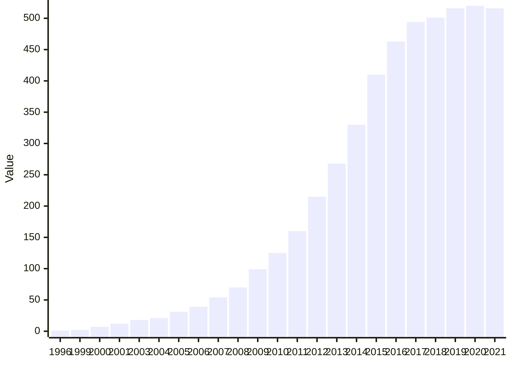
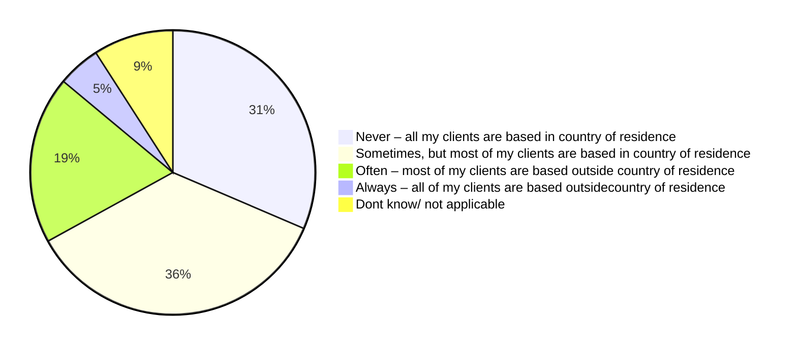
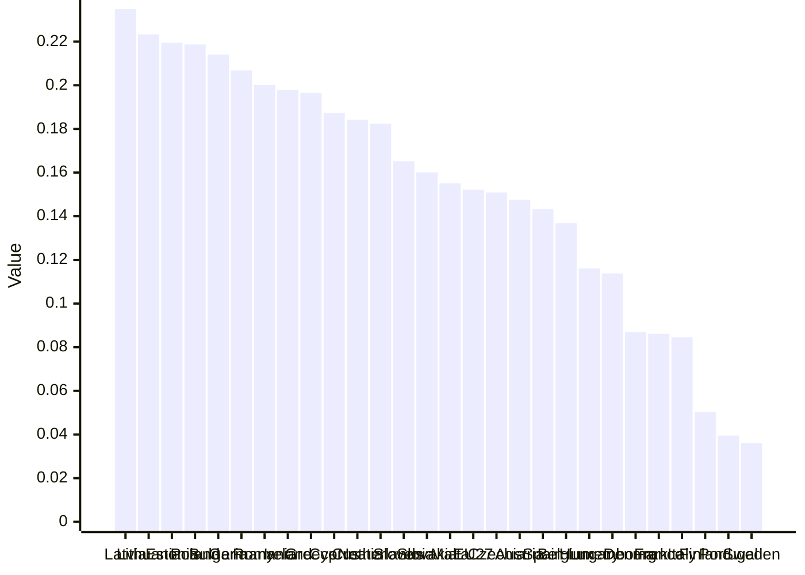

<!--
refigure example output — generated by `refigure.docx.convert()`
Source: swd2021-396-platform-work-ia.docx (tests/integration/fixtures/docx/swd2021-396-platform-work-ia.docx)
License: EU reuse right (Commission Decision 2011/833/EU)
Attribution: European Commission. SWD(2021) 396 final — Impact Assessment accompanying the proposal on improving working conditions in platform work. EUR-Lex CELEX 52021SC0396.
Source URL: http://publications.europa.eu/resource/cellar/48491c8f-59bb-11ec-91ac-01aa75ed71a1.0001.01/DOC_1
Full provenance: tests/integration/fixtures/manifest.yaml
-->

> [Image, docx media 742b6bf5a787 — raster content not analyzed]

Table of Contents

[1. Introduction 3](#_Toc87546947)

[1.1 Political context 3](#_Toc87546948)

[1.2 Legal context 4](#_Toc87546949)

[2. Problem definition 5](#_Toc87546950)

[2.1 What is the problem? 5](#_Toc87546951)

[2.2 What are the problem drivers? 8](#_Toc87546952)

[2.3 Why is it a problem? 13](#_Toc87546953)

[2.4 How will the problem evolve? 14](#_Toc87546954)

[3. Why should the EU act? 16](#_Toc87546955)

[3.1 Legal basis 16](#_Toc87546956)

[3.2 Subsidiarity: Necessity and added value of EU action 17](#_Toc87546957)

[4. Objectives: What is to be achieved? 18](#_Toc87546958)

[5. What are the available policy options? 19](#_Toc87546959)

[5.1 What is the baseline against which options are assessed? 19](#_Toc87546960)

[5.2 Policy options addressing the risk of misclassification (Policy Area A) 22](#_Toc87546961)

[5.3 Policy options addressing algorithmic management (Policy Area B) 25](#_Toc87546962)

[5.4 Policy options on enforcement, traceability and transparency, including in cross-border situations (Policy Area C) 29](#_Toc87546963)

[5.5 Accompanying measures 31](#_Toc87546964)

[5.6 Options discarded at an early stage 32](#_Toc87546965)

[6. What are the impacts of the policy options? 32](#_Toc87546966)

[6.1 Impacts of options under Policy Area A 33](#_Toc87546967)

[6.2 Impacts of options under Policy Area B 37](#_Toc87546968)

[6.3 Impacts of options under Policy Area C 39](#_Toc87546969)

[7. How do the options compare? 40](#_Toc87546970)

[7.1 Effectiveness 40](#_Toc87546971)

[7.2 Efficiency 42](#_Toc87546972)

[7.3 Coherence 44](#_Toc87546973)

[8. Preferred option 45](#_Toc87546974)

[9. How will actual impacts be monitored and evaluated? 49](#_Toc87546975)

[Annexes: Table of Contents 51](#_Toc87546976)

***Glossary***

For the purpose of this document, the terms below have the following meaning:

* “**people working through platforms**” or **“persons performing platform work”** refers to individuals performing work organised via a digital labour platform, regardless of these people’s legal employment status (worker, self-employed or any third-category status). The term ‘platform worker’ is only used as an equivalent when quoting official documents which contain such term;
* “**digital labour platform**” refers to a private internet-based company which provides an online service ensuring the supply of on-demand work, performed by individuals for individual or corporate customers, regardless of whether such work is performed on-location or online. Throughout the report, the term is used interchangeably with “platform”;
* **“on-location labour platform”** refers to a digital labour platform which only or mostly organises work performed in the physical world, e.g. ride-hailing, food-delivery, household tasks (cleaning, plumbing, caring…)
* **“online labour platform”** refers to a digital labour platform which only or mostly organises work performed in the online world, e.g. AI-training, image tagging, design projects, translations and editing work, software development;
* “**platform work**” refers to the work performed on demand and for remuneration by people working through platforms, regardless of their employment status, of the type of platforms (on-location vs online) or the level of skills required;
* “**algorithmic management**” refers to automated monitoring and decision-making systems through which digital labour platforms control or supervise the assignment, performance, evaluation, ranking, review of, and other actions concerning, the work performed by people working through platforms;
* “**false self-employment**” refers to a situation in which a person is declared as self-employed while fulfilling the conditions characteristic of an employment relationship.

1. **Introduction**
   1. **Political context**

The digital transition, accelerated by the COVID-19 pandemic, is re-defining the EU’s economy as well as its labour markets. **Platform work** has become an important element of this newly emerging social and economic landscape. **It carries a great innovation potential and creates many opportunities**, by helping people complement their revenues from other jobs and expand their entrepreneurial activities. The flexibility in working hours enables many to enjoy a better work-life balance. It also offers new job-opportunities to people who face high entry-barriers to labour markets, such as youth and migrants. **Still, it presents important challenges.** Many of the issues faced by people working through platforms (see Section 2) are difficult to address with existing legal frameworks (see Section 1.2). As digital labour platforms disrupt traditional services and introduce new ways of working, technological change must go hand in hand with fairness in line with the EU’s social model.

**This is why, in her Political Guidelines[[1]](#footnote-2), President von der Leyen pledged to address the changes brought by the digital transformation to labour markets**, by looking into ways to improve the working conditions of people working through platforms and supporting the implementation of the European Pillar of Social Rights. The Pillar and its Action Plan, endorsed by Member States, social partners and civil society at the Porto Social Summit in May 2021, provide a framework at EU level for tackling the challenges posed by digitalisation. The **European Parliament**[[2]](#footnote-3), the **Council**[[3]](#footnote-4), the **European Economic and Social Committee**[[4]](#footnote-5) and the **Committee of the Regions**[[5]](#footnote-6)have all called for specific action on platform work, allowing its opportunities to be reaped and its challenges tackled in view of supporting the conditions for a sustainable growth of digital labour platforms in the EU. The **Commission Work Programme for 2021**[[6]](#footnote-7) announces a legislative initiative based on Article 153 TFEU in the fourth quarter of the year, subject to consultation of social partners. The two-stage consultation took place between 24 February and 7 April (first stage)[[7]](#footnote-8) and between 15 June and 15 September (second stage)[[8]](#footnote-9). For a synopsis of social partners’ responses in the two-stage consultation, see Annex 2.

**1.2 Legal context**

*1.2.1 Relevant social and labour acquis*

The **Charter of Fundamental Rights of the European Union** protects and promotes a broad range of rights in the work context.[[9]](#footnote-10) The EU has created a minimum floor of labour rights that apply to workers in all Member States, although their enforcement is for national authorities. A number of EU legal instruments regulate working conditions, for instance on limitations to working hours, occupational health and safety risks and on the lack of predictability and transparency of working conditions, as well as access to social protection. However, most of these only concern people classified as workers, which is not the case for many of those working through platforms (see Section 2.2.1). Furthermore, the specific challenges of algorithmic management in the platform work context (see Section 2.2.2), are not covered by existing labour laws at EU level.(For an analysis of the relevant EU social and labour *acquis*, see Annex 6.)

*1.2.2 Relevant internal market acquis*

The EU’s *acquis* on the internal market includes relevant laws for the platform economy, such as **the General Data Protection Regulation[[10]](#footnote-11) and the Platforms-to-Business (P2B) Regulation**.[[11]](#footnote-12) The European Commission has also put forward new legislative proposals of relevance, such as the Digital Services Act (DSA) package[[12]](#footnote-13) and the Artificial Intelligence Act (AIA)[[13]](#footnote-14), and is preparing an initiative to ensure that EU competition law does not stand in the way of collective agreements that aim to improve the working conditions of certain solo self-employed people (including those working through platforms).[[14]](#footnote-15) (For an analysis of the relevant EU internal market *acquis,* see Annex 7.) **In spite of these, many platform work challenges remain** (see Section 5.1). For example, in the algorithmic management context, such challenges reflect the important role that the representatives of people working through platforms and labour inspectorates could play in bringing about better working conditions. The personal and/or material scopes of these instruments do not cover the full array of specificities of platform work. Also, **the** **case-law on the applicability of the EU’s internal market *acquis* to digital labour platforms is not conclusive.** (For an overview of relevant court and administrative decisions, see Annex 10.)

*1.2.3 Relevant national initiatives*

National responses to platform work are diverse and developing unevenly across Europe. **A few** **EU Member States (EL, ES, FR, IT and PT) have adopted national legislation** specifically targeting the improvement of working conditions and/or access to social protection in platform work. In some Member States (AT, DK, EE, FI, HU, HR, LU, RO, SK and SI) people working through platforms may be indirectly affected by wider, non-platform specific legislative initiatives. In others (DE, LT and NL), potentially relevant legislation is being debated. (For an overview of national responses, see Annex 9.)

1. **Problem definition**

> [Image, docx media 8245ced0dd35 — raster content not analyzed]

The below ‘problem tree’ illustrates how the drivers analysed in the following section relate to the problem this initiative aims at tackling, with its underlying consequences for different stakeholders.

**2.1 What is the problem?**

**Some** **people working through platforms face poor working conditions and inadequate access to social protection.** In many cases, this concerns people working through platforms who are false self-employed, i.e. their employment status is misclassified (see Section 2.2.1). Those who are workers are entitled to the rights and protections of the national and EU labour *acquis,* such as on collective bargaining, minimum wage, working time, paid annual leave, parental leave, and occupational health and safety. In most instances, workers are also the only ones to have adequate access to social protection. The genuine self-employed do not have access to such rights and protections (with some exceptions[[15]](#footnote-16)). Some, but not all, may be able to improve their situation by means of their autonomy and stronger labour market position.[[16]](#footnote-17)

Misclassified people working through platforms have thus neither the rights and protections of the national and EU labour *acquis* that workers have, nor the autonomy and stronger labour market position enjoyed by some genuine self-employed people (see Section 2.2.1). In concrete terms, this means that they may not have access to:

* **Decent pay** – Around 55% of people working through platforms earn less than the net hourly minimum wage of their country.[[17]](#footnote-18)
* **Balanced working time schedules** *–* On average, people working through platforms spend 8.9 hours per week doing unpaid tasks (such as researching tasks, waiting for assignments, participating in contests to get assignments and reviewing work ads), against 12.6 hours doing paid tasks. The unpredictability of platform work may be detrimental to the work-life balance of those performing it.
* **Health and safety provisions** *–* Accidents and occupational injuries insurance is only made available by 23% of digital labour platforms[[18]](#footnote-19), with one survey highlighting that circa 42% of people working through delivery platforms have been involved in a collision.[[19]](#footnote-20) A study has found that only 18% of riders in Spain wears a helmet[[20]](#footnote-21), possibly because of a lack of provision of it by the platform, lack of obligations to do so and personal risk-taking attitudes. Approximately 50% of people working through online platforms suffer from clinical levels of social anxiety, well above the 7-8% found in the general population.[[21]](#footnote-22)
* **Coverage against occupational risks** – Platforms representing 97% of earnings in platform work in the EU do not pay contributions towards unemployment benefits.[[22]](#footnote-23) Most platforms do not want to offer social protection to people working through them because they fear this might be used in court to reclassify them as employers.[[23]](#footnote-24)
* **Facilitated procedures to claim their rights** – In most Member States, the only way for people working through platforms to challenge a misclassification (and/or retrieve the rights linked to another employment status) is by judicial means. Such procedures require some knowledge of legal procedures or access to relevant professionals (e.g. lawyers), and entail substantial costs. These may range from EUR 300 (in DE, based on a person’s income) to EUR 5000 (in IE, including lawyers’ fees).[[24]](#footnote-25)

In parallel, some of these people are subject to a certain degree of control by some platforms, which use algorithms to assign tasks to, monitor, evaluate and discipline them. Such technologically-enabled control[[25]](#footnote-26) is often referred to as “algorithmic management”[[26]](#footnote-27), which further exacerbates their working conditions and their risk of being misclassified (see Section 2.2.2). Understanding how one’s behaviour (e.g. whether one accepts a task or not) influences access to future task opportunities is paramount, as it has implications for the income of people working through platforms, irrespective of their employment status. Since algorithmic management is a relatively new phenomenon and is largely unregulated, the challenges it poses are also faced by those working through platforms who are classified as workers and by the genuine self-employed. **The negative effects of a potentially widespread misclassification of the employment status compounded by the control exerted by the platforms through algorithmic management, as well as by the difficulties related to enforcement, traceability and transparency in cross-border situations, are not limited to platform work. However, they are much stronger and more frequent on platforms** – whose business models are founded on algorithmic management – than in ‘traditional businesses’[[27]](#footnote-28): according to one survey, only 42% of EU enterprises[[28]](#footnote-29) use at least one AI-based technology.[[29]](#footnote-30)

Platforms have played an important role at the beginning of the pandemic in allowing many businesses the flexibility to stay afloat. For example, many restaurants kept working during lockdown, supported by the services food-delivery platforms offered. Despite this flexibility, the **COVID-19 crisis** has further highlighted the importance of access to social protection and support against occupational risks for people working through platforms.

The EIGE 2021 survey has showed that 80% of people engaged in platform work experienced some kind of negative effects related to COVID-19 lockdowns at some point, affecting their or their partner’s ability to work (e.g., they or their partners lost jobs, had financial difficulties, got sick, had to take leave, had to take care of sick children or elderly people). However, only less than half of them received government support (e.g., sick or unemployment benefits, wage support). Few on-location platforms voluntarily compensated for lost income of people working through them in case they became sick with COVID-19 or had to quarantine due to coming in contact with an infected person.

Data access and collection challenges make it difficult to estimate the exact number of people working through platforms, and thus the exact number of those who may be affected by the aforementioned downsides of platform work. Based on a survey done in preparation of this report, **there may be around 28.3 million people working through platforms in the EU-27** (6 million on on-location platforms, 22 million on online ones).[[30]](#footnote-31) A relevant share of these may be misclassified (see Section 2.2.1). The same difficulty exists for the estimation of the number of digital labour platforms active in the EU**.** A very conservative estimation[[31]](#footnote-32) found **there may be more than 500 active platforms** – a majority of which are on-location –, **mostly concentrated in Western and Southern Member States** (DE, ES, FR, IT, NL) and some Eastern Member States (PL, RO).[[32]](#footnote-33) Approximately 361 of them are SMEs[[33]](#footnote-34), against 155 larger enterprises. The former may face unfair competition by the latter. Amongst other factors contributing to larger platforms’ size and success, there is the compensation of losses by investors with the aim to establish future quasi-monopolies by driving competitors out of business.[[34]](#footnote-35) Such losses are dampened through high profits, thanks to artificially low costs vis-à-vis consumers, made possible, among other things, by lowering labour costs through the misclassification of workers as false self-employed.

**The business models of many digital labour platforms may often be based on cutting social costs in the short-term to be more competitive and gain significant shares of the market they operate within in the medium-term. Such economic strategy is not conducive to long-term economic sustainability**. It may also challenge the levelling of the playing field within the platform economy. Moreover, the aforementioned challenges in platform work are spurring governments to take action. This creates significant legal uncertainty for platforms, who have to comply with diverging policy approaches and heterogeneous judicial outcomes across Member States (see Annexes 9 and 10, respectively). Such context does not support the conditions for a sustainable growth of digital labour platforms in the EU.

**2.2 What are the problem drivers?**

*2.2.1 Risk of employment status misclassification[[35]](#footnote-36)*

**The key challenge in platform work is the risk of misclassification of the employment status**. The employment status, i.e. being classified as a worker or as a self-employed, determines access, or lack thereof, respectively, to the EU and national labour *acquis*. It is therefore a key gateway to tackle most of the challenges in platform work which are related to working conditions and access to social protection, apart from the specific challenges posed by algorithmic management in the context of platform work.

Determining the correct employment status is not straightforward and depends on national laws and CJEU case-law. However, in most cases, the level of control exerted over the person performing the work is one main element to consider. High levels of control are generally a defining characteristic of an employment relationship. Of the 28.3 million people working through platforms in the EU-27, **circa 5.5 million are estimated to be subject to a certain degree of control**[[36]](#footnote-37)from the platform they work through. These are spread between on-location platforms (2.3 million people) and online ones (3.2 million people). The risk of misclassification is proportionately much higher in the former (2.3 million out of 6 million, i.e. 38%) than in the latter (3.2 million out of 22 million, i.e. 15%). Given that **around 90% of people working through platforms are estimated to be formally self-employed[[37]](#footnote-38)**, it is likely that most of those 5.5 million people are misclassified. The assessment of such risk of misclassification is based on the supposed subordination of these people to the platform they work through, and not on the frequency/intensity of work they perform (i.e. weekly number of hours and/or percentage of income derived from platform work).

**The risk of misclassification is primarily driven by a** **lack of regulatory clarity**. No Member State has so far comprehensively addressed the risk of misclassification in platform work. Some Member States (IT, ES, FR) have opted for sectoral legislation, focusing on transport and delivery platforms.[[38]](#footnote-39) A large number of Member States (BE, DE, EL, ES, FR, IE, IT, MT, NL, SE) clarify ambiguous employment relationships through legal, administrative or case law-based procedures which refer to general labour market situations and do not take into account the specificities of platform work. The flexibility inherent in, and the constantly evolving business models of, platforms have largely prevented the latter set of tools’ effectiveness. This is mirrored in the high number of court and administrative procedures initiated across the EU and beyond.

Indeed, **the lack of regulatory clarity on the employment status in platform work is compounded by the unconsolidated jurisprudence on the matter.** In Member States and beyond, there have been more than 100 court decisions and 15 administrative decisions on cases of alleged misclassification in platform work.[[39]](#footnote-40) Although these procedures have often produced contradictory outcomes, most have led to the reclassification of the concerned people working through platforms (particularly on on-location ones in the transport and delivery sectors, which are likely the ones exerting the most control, see Section 2.2.2).[[40]](#footnote-41)

**The risk of misclassification is also driven by the weak labour market position of many of those concerned by it**. Challenging a misclassification requires people to be knowledgeable about their rights and to be able to organise themselves and face the potential consequences of a lawsuit. This is especially difficult for people in a weak labour market position, such as low-income groups, young people and those with a migrant background.Minimum wage earners make up half the digital labour platforms’ workforce (see Section 2.1). People working through platforms in the EU are younger than workers in ‘traditional businesses’.[[41]](#footnote-42) In 2018, the average age was 33.9 years in platform work compared to 42.6 years in ‘traditional’ businesses. The proportion of foreign-born people doing platform work as a main occupation[[42]](#footnote-43) in the EU was 13.3%.[[43]](#footnote-44)

*Stakeholders’ views:* **Social partners agree with the Commission** that the risk of misclassification is an important challenge in platform work. Other stakeholders, such as civil society organisations and associations representing people working through platforms,generally agree on its importance within the debate on platform work.

*2.2.2 Issues related to algorithmic management[[44]](#footnote-45)*

**Poor working conditions in platform work are also related to algorithmic management, which is inherent to the business model of digital labour platforms.** Algorithmic management is particularly relevant for the allocation of tasks. More than half of platforms active in the EU (mostly on-location ones) grant low autonomy on task allocation (i.e. people are not free to choose which tasks to perform).[[45]](#footnote-46) It also entails surveillance, which is present in some form in platforms representing over 90% of overall earnings in the platform economy.[[46]](#footnote-47) The degree of algorithmic control varies a lot across sectors and platforms. On-location ones (particularly in food-delivery) exert significant algorithmic control.[[47]](#footnote-48) Furthermore, it can conceal employment subordination behind a claim of independence, based on a lack of human managers (**it thus facilitates misclassification**). Where there might be humans reviewing automated decisions, they might lack protection against undue repercussions for not enforcing automated decisions affecting people working through platforms.

The lack of autonomy and the surveillance induced by algorithmic management in platform work can have negative impacts on the working conditions of people subject to it, for instance in terms of **psychosocial stress** (as people working through platforms feel constantly watched and evaluated)[[48]](#footnote-49), **risk of accidents** (as algorithms may incentivise dangerous behaviour, for instance by offering bonuses for faster deliveries)[[49]](#footnote-50) **and income unpredictability** (algorithmic scheduling allows the allocation of shifts at short notice).[[50]](#footnote-51)

Because it is a relatively new phenomenon, algorithmic management remains largely unregulated under both the labour and internal market EU *acquis* (see Annexes 6 and 7, respectively). It can thus have nefarious effects on the working conditions of people working through platforms, regardless of their employment status. Genuine self-employed people working through platforms are negatively affected by the lack of safeguards against monitoring, surveillance and unaccountable, automated decisions concerning their contracts. People working through platforms as workers face the same challenges and more, including the impossibility for their representatives to be fully informed and consulted by platforms and the lack of appropriate safety and health rules catering to the specificities of platform work. Those affected the most are however false self-employed people, who, in addition to all of the above issues, struggle to challenge their employment status even more so than in ‘traditional companies’ with similar misclassification practices. This is because platforms are able to conceal their employer-like behaviour behind algorithmic management, the true functioning of which is difficult to both understand and prove in legal and administrative proceedings.

**Algorithmic management in a workplace context is not limited to digital labour platforms**. It is used in very different ways - from very basic monitoring of work schedules, shifts and working hours to more complex applications aimed at task allocation and pay calculation. The foremost example is that of online retailers’ warehouses, where products for delivery are arranged according to an order that is only known by the algorithm underpinning hand-held devices, through which the workers are guided in their filling up of delivery trollies in the most efficient order. Such management systems are now spreading to supermarket warehouses too (Wood, 2021).

**There is currently limited evidence on the size of the issue.** Estimates range from 7% (Eurostat) to 12% (ESENER) of enterprises using AI, but these concern different applications and types of AI-enabled technology. A survey carried out for the purposes of this report found that 42% of European companies use at least one AI-based technology. Such discrepancies show that, to date, it is not yet clear to what extent its limited application to ‘traditional’ workplaces affects people’s working conditions there, nor what is its actual take-up by companies in terms of automated management tasks. To the contrary, algorithmic management is inherent to the business model of platforms, where all but a few management tasks directly related to the services offered are automated. To date, **algorithmic management is therefore a platform work quasi-specific challenge, which is not replicated to the same extent in the wider employment context.**

Such challenges are driven by **information asymmetries**[[51]](#footnote-52) **and insufficient dialogue** between platforms and (representatives of) people working through them(see Annex A11.2). Platforms contribute to these challenges through their terms and conditions, which may unilaterally regulate pay, working time, dispute resolution, customer service etiquette and more, while using technological means to monitor, evaluate and discipline people’s work.[[52]](#footnote-53) **This leads to unclear responsibilities and lack of redress mechanisms vis-à-vis unintelligible and unaccountable decisions**, for instance as regards work sanctions and contract terminations.[[53]](#footnote-54)In 2019, riders were unfairly discriminated against by Deliveroo’s algorithm, which did not distinguish illegitimate from legitimate reasons for being unable to work, such as being sick.[[54]](#footnote-55) In 2020, people working through UberEats blamed unexplained changes to the algorithm for affecting their jobs and incomes. When they asked for explanations, they were told there was no “manual control” on task allocation[[55]](#footnote-56), leading to lack of clarity for the people working through the platform on how the algorithm affects their working conditions.

**The** **impossibility to transfer reputational data across platforms is also problematic**. Although reputational data is not exclusive to digital labour platforms, in this context client-driven ratings determine people’s access to future tasks and/or job assignments. Because such ratings are linked to the platform through which they were given, the people they refer to are also tied to that very platform. This often causes a ‘lock-in effect’, by which people face too high an opportunity cost (in terms of future task assignments) to switch to the competitors of the platform through which they have built their online reputation. This issue also causes a complementary problem, by which incumbent people working through a platform who have good ratings tend to attract all the best assignments, to the detriment of newcomers with scarce or negative ratings (‘superstar effects’)[[56]](#footnote-57). Overall, these issues reduce **the professional mobility and weaken the bargaining power of people working through platforms, and prevent genuine** **competition between platforms**. To date, there is no evidence of such problems existing or being particularly prominent outside of the platform economy.

The General Data Protection Regulation and the forthcoming Artificial Intelligence Act both include important provisions for the challenges of algorithmic management, but do not fully address challenges of platform work from a labour law perspective (see Section 5.1 and Annex 8). The same is true for the P2B Regulation and the forthcoming Digital Services Act (see Section 5.1 and Annex 7).

*Stakeholders’ views:* **Trade unions recognise the challenges of unregulated algorithmic management in platform work** and have expressed the fear that they may spread beyond platform work. **Employers’ representatives stress that the spread beyond platform work is already happening**.[[57]](#footnote-58) A majority of platforms believe there is a need to increase the basic level of transparency vis-à-vis algorithms (without touching upon business secrets and intellectual property issues), their ‘understandability’ and human oversight. National authorities, academics and experts also agree on the importance of ‘algorithmic management’ within the debate on platform work.

*2.2.3 Issues related to enforcement, traceability and transparency, including in cross-border situations[[58]](#footnote-59)*

**Issues related to enforcement, traceability and transparency, including in cross-border situations exacerbate the problem of poor working conditions and inadequate access to social protection.** National authorities do not have easy access to data on platforms and people working through them, e.g. on their employment status, on the share of them who are actually active (and not merely enrolled without having done any tasks[[59]](#footnote-60)) and on platforms’ terms and conditions. **Only a minority of platforms’ terms and conditions (19%) clearly spell out the contractual relations with the people working through them**.[[60]](#footnote-61)

**The problem of traceability is especially relevant when platforms operate in several Member States**, making it unclear where platform work is performed and by whom. There is, generally speaking, an insufficient identification of platforms operating in the EU. Furthermore, 59% of all people working through platforms in the EU engage with clients from outside their country of origin, often simultaneously and under different employment statuses and terms and conditions.[[61]](#footnote-62) 22% of platforms operating in the EU are from third countries, while 19% do not have EU legal representatives; 41% operate in more than one Member State.[[62]](#footnote-63) It is noteworthy that traceability is not only a problem within online platforms work, but also in on-location ones. Indeed, even if the latter intermediate work which is carried out physically in a specific place, it is often far from clear where such platforms are legally based and which rules on employment, tax and social protection contributions inform their terms and conditions. This has repercussions for people working through platforms, but also for Member States’ authorities (see Section 2.3).

*Stakeholders’ views:*Social partners agree that the Commission has sufficiently acknowledged the cross-border dimension of platform work in its preliminary analysis. **Trade unions believe this is one of the main reasons warranting EU action**. Most platforms acknowledge that enforcement, traceability and transparency, especially in cross-border situations, is a noteworthy issue in platform work, as do a majority of public authorities and many academics and experts.

**2.3 Why is it a problem?**

*Consequences for people working through platforms:* As a result of their employment status misclassification, **some people working through platforms may not be covered by the rights and protections of the EU and national labour *acquis* they should be entitled to**. This often leads to low and unpredictable earnings, precariousness, poor safety provisions, higher risk of accidents due to a lack of protective equipment, lack of career perspectives and training opportunities.These challenges are exacerbated by platforms’ use of algorithmic management, which is characterised by information asymmetries and lack of scrutiny in social dialogue and collective negotiations. Platforms can thus conceal misclassification practices more easily. Also, many people working through platforms are unable to appeal against algorithmic management decisions because of unclear responsibilities and a general lack of redress mechanisms.As an indirect effect of Member States’ difficulties in accessing and processing relevant information on platforms, including in cross-border situations, people working through them are negatively impacted by the lack of enforcement of rules aimed at improving their situation, and by the potential inefficacy and/or limitations of future policies.

*Consequences for businesses, markets and consumers:* Because of Member States’ diverging approaches to platform work and national courts’ heterogeneous decisions on the employment status, **digital labour platforms** **face legal uncertainty and obstacles to the scaling-up of their business**. **This prevents a sustainable growth of the platform economy in the EU** **and leads to a general fragmentation of the single market**. Platforms which contract genuine self-employed people may refrain from providing social benefits, insurance or training measures on a voluntary basis, for fear of being reclassified as employers as a result (‘chilling effect’). Platforms employing workers and traditional businesses may face unfair competition by platforms which cut costs by misclassifying as self-employed the people working through them. The same unfair practice may give them a dominant position in the market, with detrimental effects for consumer welfare. Businesses in sectors where algorithmic management is not widespread may face unfair competition by platforms and other companies cutting costs through unfair or illicit algorithmic management practices. Algorithm-driven unfair practices may also undermine consumer trust and affect consumer welfare, in view of their negative impact on working conditions in platform work and the general reputation of platforms. The difficulties faced by Member States vis-à-vis data access and enforcement of rules, including in cross-border situations, may result in further legal uncertainty for businesses. **SME platforms may face unfair competition** **vis-à-vis bigger, international players who are able to conceal their operations behind multi-market presence claims**.

*Consequences for Member States:* **The misclassification of people working through platforms translates into fewer revenues flowing into public budgets**, since self-employed people tend to pay lower taxes and seldom pay into social protection schemes. Some self-employed people may autonomously decide not to pay social protection contributions due to individual risk-aversion (‘behavioural bias’). The lack of legal certainty concerning the employment status challenges Member States’ agency, by preventing their enforcement of labour, social protection and tax rules. Such challenges are mostly felt in Member States with higher shares of people working through platforms (DE, FR, IT, ES, NL, PL and RO), which are also, to date, the most active in terms of relevant policy actions (alongside AT, BE, DK, EL, IE, LU and PT).[[63]](#footnote-64) Member States’ prospective attempts at tackling the challenges of platform work are also constrained by the lack of relevant information because of data access and sharing challenges, including in cross-border situations. Indeed, it may be difficult for Member States to retrieve information on where platform work is performed and by whom, especially if platforms are based in one country and operate through people based elsewhere.

**2.4 How will the problem evolve?**

Without policy action, **the number of people working through platforms under poor working conditions and without adequate access to social protection will most likely continue to increase** (see Section 5.1), in parallel with the growth of the platform economy as a whole. This makes the aforementioned challenges all the more pressing.

**In the last five years, the EU’s platform economy revenues have increased dramatically.** A conservative estimate puts this growth at around 500%, from EUR 3 billion in 2016 to EUR 14 billion in 2020. An estimated three-quarter of these revenues originated from ride-hailing and delivery platforms.[[64]](#footnote-65) A more realistic estimate puts revenues in 2020 at EUR 20.3 billion.[[65]](#footnote-66) This was part of a total e-commerce sales growth of 12.7%, amounting to EUR 717 billion.[[66]](#footnote-67) **Megatrends such as globalisation, digitalisation and other societal changes will spur a similarly sustained growth in the next few years** (see Annex 12).Alongside North America, Europe will drive the growth of the global ‘gig economy’, which will likely reach EUR 385.9 billion in 2023, up from EUR 184.9 billion in 2018.[[67]](#footnote-68)

The number of platforms active in the EU has also grown incrementally and will likely keep doing so in the next few years. Online platforms were predominant until 2015, but since then have been surpassed by on-location ones. **A conservative estimate in 2020 found there were 235 active online platforms to 355 on-location ones in the EU-27**.[[68]](#footnote-69) The Member State from which most platforms originate is FR (89), followed by BE (49), ES (44), DE (41), NL (38) and IT (26).[[69]](#footnote-70) In terms of aggregate earnings of people working through platforms, DE-originated platforms are largest (about EUR 1 billion), followed by FR (EUR 0.7 billion), NL (EUR 0.4 billion), ES (EUR 0.4 billion) and EE (EUR 0.2 billion).[[70]](#footnote-71) The 25 largest platforms of the same conservative estimate[[71]](#footnote-72) account for about four-fifths of the total earnings of people working through platforms, suggesting **the digital labour platform economy in the EU-27 is arguably highly concentrated**. Most of these offer on-location services (ride-hailing and delivery). Most platforms are of EU origin (77% in absolute numbers). These account for half of the aggregate earnings of people in platform work, with the overwhelming majority of the other half coming from platforms originally from the US.[[72]](#footnote-73)

These numbers could decrease if smaller platforms are pushed out of the market, while total revenues will keep on growing. **A projection done for this report foresees fewer than 300 on-location platforms in the EU-27 by 2030[[73]](#footnote-74)**, while global revenues from ride-hailing platforms alone are expected to more than double by 2026, from EUR 95.8 billion (2020) to EUR 195 billion.[[74]](#footnote-75) This could result in the predominance of large platforms, which might thwart competition, innovation and the bargaining power of people working through platforms, with detrimental effects for their working conditions. New, transnational trends like the emergence and growing popularity of ‘dark kitchens’ and ‘dark stores’[[75]](#footnote-76), or other responses to changing consumer preferences, might pose new challenges to the world of work and make policies targeting platform work even more difficult to future-proof.

1. **Why should the EU act?**

**3.1 Legal basis**

**Article 153(1) TFEU** provides the legal basis for the Union to support and complement the activities of the Member States with the objective to improve working conditions, social protection and social protection, workers’ health and safety, and the information and consultation of workers, among others. In those areas, Article 153(2)(b) TFEU empowers the European Parliament and the Council to adopt – in accordance with the ordinary legislative procedure – **directives setting** **minimum requirements** **for gradual implementation**, having regard to the conditions and technical rules obtaining in each of the Member States. This legal basis would enable the Union to set minimum standards regarding the **working conditions of people working through platforms**, where they are in an employment relationship and thus considered as workers. The Court of Justice of the European Union (CJEU) has ruled that “the classification of a ‘self-employed person’ under national law does not prevent that person being classified as a worker within the meaning of EU law if his independence is merely notional, thereby disguising an employment relationship”.[[76]](#footnote-77) **False self-employed people** would thus also be covered by EU labour legislation based on Article 153 TFEU.

Should possible Union action also address the situation of **genuine self-employed** people working through platforms in relation to the **protection of their personal data** processed by algorithmic management systems, it would be appropriate to base it, in as far as those specific rules are concerned, on **Article 16 TFEU**. Article 16 TFEU empowers the European Parliament and the Council to adopt – in accordance with the ordinary legislative procedure – directives laying down rules relating to the protection of individuals with regard to the processing of personal data by Union institutions, bodies, offices and agencies, and by Member States when carrying out activities which fall within the scope of Union law, and the rules relating to the free movement of such data. This legal basis could be combined with Article 153 TFEU, as both share the same legislative procedure, and would allow including genuine self-employed into the scope of a Directive addressing algorithmic management, as far as the processing of personal data by automated monitoring and decision-making systems is concerned.

Alternatively, a Directive addressing the situation of genuine self-employed people working through platforms as business actors could be based on an internal market legal basis. Possible provisions in the TFEU include **Article 53(1)** – which empowers the EU to issue directives coordinating national provisions concerning the uptake and pursuit of activities as self-employed persons – or **Article 114** allowing for the approximation of laws with regard to the establishment and functioning of the internal market. The situation of genuine self-employed people working through platforms might otherwise be addressed through measures based on **Article 352 TFEU**. This would either imply a Directive or a Council Recommendation(in coordination with **Article 292 TFEU**, by which the Council can adopt recommendations acting on a proposal from the Commission).

**3.2 Subsidiarity: Necessity and added value of EU action**

**Only an EU initiative can set common rules** on how to address the risk of misclassification of the employment status that apply to all relevant platforms operating in the EU, while also preventing fragmentation in existing and forthcoming regulatory approaches to algorithmic management and addressing the cross-border dimension of platform work.

**The specific EU added value lies and results in the establishment of minimum standards** in these areas, below which Member States cannot compete, but which can be expanded at national level. This may foster upwards convergence in employment and social outcomes across Member States. Such action would not unduly increase the possible administrative burden for platforms, and would take into account the impact on SMEs (see Annex A3.3).

**National action alone would not achieve the EU’s Treaty-based core objectives of promoting sustainable economic growth and social progress**, as Member States may compete with one another to attract platforms’ investments by lowering the social standards and working conditions of people working through them, or simply by not enforcing their own rules. Some **Member States may also see their interests damaged by the limitations posed to policy action by the legal uncertainty and lack of clear information on platform work**, stemming from heterogeneous national legislative approaches across the EU and from authorities’ lack of means to ensure compliance of digital labour platforms with such rules.

The working conditions and social protection of people doing cross-border platform work is equally uncertain and depends strongly on their employment status. National authorities (such as labour inspectorates, social protection institutions and tax agencies) are often not aware of which platforms are active in their country, how many people are working through them and under what employment status. **Risks of non-compliance with rules and obstacles to tackling undeclared work are higher in cross-border situations, in particular when online platform work is concerned**. In this context, relevant actions aimed at tackling the cross-border challenges of platform work, including but not limited to social dumping risks and lack of data to allow for a better enforcement of rules, are best taken at EU level.

1. **Objectives: What is to be achieved?**

**The EU’s ambition is to be digitally sovereign in an open and interconnected world**, and to pursue digital policies that empower people and businesses to seize a human-centred, sustainable and more prosperous future.[[77]](#footnote-78)

The **general objective** of this initiative is to:

*Improve the working conditions and social rights of people working through digital labour platforms, including with the view to support the conditions for sustainable growth of digital labour platforms in the European Union.*

The **specific objectives** through which the general objective will be addressed are to:

(1) *Ensure that people working through digital labour platforms have – or can obtain – the correct legal employment status in light of their actual relationship with such platforms and gain access to the applicable labour and social protection rights.*

(2) *Ensure fairness, transparency and accountability in algorithmic management in the platform work context.*

(3) *Enhance transparency, traceability, and awareness of developments in platform work and improve enforcement of the applicable rules for all people working through digital labour platforms, including those operating across borders.*

1. **What are the available policy options?**

> [Image, docx media da1fcfa77c7e — raster content not analyzed]

 The below graph illustrates the intervention logic underpinning the development of the policy options, based on the analysis of the problem drivers and the problem definition (see Section 2).

**5.1 What is the baseline against which options are assessed?**

**Platforms’ business models will likely spread to new sectors and transform them**. This can lead to certain improvements, such as more efficient processes, with algorithms effectively managing a vast pool of data and proposing user-friendly solutions. This can in turn expand business opportunities and lead to job creation. Still, such positive developments are unlikely to reflect on the quality of jobs in the platform economy. In a scenario of no relevant action at EU level, **the number of people working through platforms who experience poor working conditions and inadequate access to social protection is expected to increase,** in parallel with the growth of platform work as an overall trend. There are 28.3 million people working through platforms in the EU-27.[[78]](#footnote-79) It is estimated that this number will reach 43 million by 2025 and remain stable thereafter.[[79]](#footnote-80)

**The risk of misclassification of the employment status in platform work will continue to be unaddressed at EU level**. Some Member States may put forward relevant policies to address this risk and may also tackle its underlying problem of inadequate access to social protection in the context of their national implementation of the Council Recommendation on access to social protection for workers and the self-employed. However, in the absence of common minimum standards across the EU, platforms will take advantage of fragmentation and, as is already happening[[80]](#footnote-81), quit stringently regulated markets, while remaining active in Member States with laxer rules (‘regulatory shopping’). The fear of losing the platforms’ investments, sources of income for people working through them and services appreciated by consumers will push national governments to compete with one another to offer the most accommodating conditions to platforms. In the medium to long term, only large platforms will be able to grow and sustain a loss-making business model in a market dominated by legal uncertainty, due to heterogeneous jurisprudential approaches across Member States. **The already high costs of non-compliance with rulings on misclassifications will multiply**.[[81]](#footnote-82) This will push smaller players who are unable to sustain such costs out of the market, contributing to the concentration of the EU’s platform economy. Traditional companies employing workers in sectors where platforms are also active will continue to face unfair competition by the false self-employment model. **The forthcoming initiative on collective bargaining for self-employed people in a weak position will likely bring benefits** **to those falling under its scope**, especially in terms of stronger bargaining power in the labour market (for further details on the overlaps and differences between this latter initiative and the one supported by this report, see Annex 7). However, the problems related to misclassification will persist.

**Without further action, issues related to algorithmic management in platform work will persist.** Relevant challenges will be partially addressed at EU level through a combined effect of the Platforms-to-Business (P2B) Regulation, the General Data Protection Regulation (GDPR) and the Artificial Intelligence Act (AIA). The P2B Regulation may prevent some unfair practices of platforms vis-à-vis the self-employed people falling under its scope[[82]](#footnote-83) – e.g. on the transparency and intelligibility of platforms’ terms and conditions, on fair contract termination notice periods, and on fair redress mechanisms – although workers (including reclassified ones) will remain unprotected. **Building on the GDPR[[83]](#footnote-84), some Member States may decide to introduce specific rules on the processing of workers’ personal data** and algorithmic management, but this may lead to ‘regulatory shopping’ practices by platforms similar to those expected vis-à-vis national rules aiming to address the risk of misclassification. Automated decisions taken solely by algorithms will remain subject to the GDPR if producing legal or similarly significant effects. More legal clarity on what constitutes such effects and on the exceptions to the rule in the context of platform work will remain necessary to ensure an efficient protection of the rights of people working through platforms. Platforms could exploit this loophole. Existing transparency provisions under the GDPR will continue not to extend to the representatives of people working through platforms and labour authorities. **The adoption of the AIA will tackle discrimination and bias in high-risk AI systems**, ensuring the protection of fundamental rights in the EU. This will lead to improved trust in AI systems and to a better uptake of the technology. However, within the meaning of the proposed AIA, platforms, and not the people working through them, are to be considered as the ‘users’ of high-risk AI systems. The transparency provisions for high-risk systems therefore do not extend to the people affected by such systems.[[84]](#footnote-85) Once adopted, the AIA will improve transparency before the placement of algorithmic management systems on the market – by ensuring that platforms as users of high-risk AI systems have access to the necessary information on the potential consequences of said systems for employment contexts. Issues related to transparency on how the behaviour of people working through platforms affects their access to tasks which arise post-placement will remain unaddressed. This will leave them exposed to the risks of a use of algorithms potentially shaped by platforms against the interests of people working through them. It is estimated that around 72.5 - 101 million Europeans[[85]](#footnote-86) could be already exposed to some algorithmic processes at their workplace (on data uncertainties regarding the use of algorithms in the broader labour market, see the box in section 2.2.2.). **If left unregulated in platform work contexts**, it is unlikely that a horizontal approach will effectively address the challenges posed by AI to the world of work, since these will be too broad for constantly evolving business models not to filter through potential legal loopholes. The negative aspects of **algorithmic management will thus continue** to affect stress levels, work-life balance and income stability[[86]](#footnote-87) **in platform work, only to be then replicated in traditional businesses once a sufficient number of these will have taken up AI-driven practices.**

**Issues related to transparency and enforcement, including in cross-border situations, will remain unaddressed.** The growth of platform work in all sectors will spur Member States to take action through policies tackling its different challenges. Said policies would however be thwarted by the lack of cross-border data sharing and reporting obligations. In the continued absence of relevant rules at EU level, **non-transparent business models will likely spread among platforms**, which by means of their cross-border nature would be able to operate in different Member States while only being registered in one (or, illegally, none).This lack of transparency would exacerbate the difficulties faced by Member States in understanding where some types of platform work are being performed, by whom and according to which regulations (or lack thereof).Some forthcoming EU initiatives would introduce binding Business-to-Government (B2G) data-sharing schemes[[87]](#footnote-88) and corporate reporting obligations[[88]](#footnote-89), but their scope would be too narrow and too wide, respectively, for platforms to be captured in any meaningful way. **Governments** **will face growing difficulties** **in the enforcement of rules** on labour, tax and social protection, especially in cross-border situations. They may also face increasing fiscal shortfalls caused by platforms not paying taxes nor social protection contributions. Some Member States may introduce reporting obligations, but platforms’ ‘regulatory shopping’ would make them ineffective.

**5.2 Policy options addressing the risk of misclassification (Policy Area A)**

**The policy options to address the risk of misclassification of the employment status in platform work differ in strength and expected impacts**. Most of the following options are not mutually exclusive. Depending on the desired level of ambition, options A1 and/or A2 could be combined with either A3a, A3b or A3c.

*5.2.1 Option A1: Interpretation and guidance*

This option would provide **non-binding guidance** to economic actors, policy-makers and legal institutions on the interpretation of national (and EU) case law on the concept of ‘worker’, notably on the jurisprudence on misclassification in the platform economy. This would include possible criteria or indicators in favour of, or against, the existence of an employment relationship (or of self-employed activity) in platform work.

*5.2.2 Option A2: Shift of the burden of proof and measures to improve legal certainty*

This option would introduce the below set of procedural facilitations and dispute prevention mechanisms. They would allow misclassified self-employed people on platforms to challenge their employment status, and digital labour platforms to ascertain the correct employment status for a given business model:

* a **rule on** **shifting the burden of proof:** to contest their self-employed status in legal proceedings, people doing platform work would only have to establish basic proof of elements indicating an employment relationship (*prima facie* evidence). It would then be for the digital labour platform to prove that the person is in fact self-employed;
* a **certification procedure** would enable digital labour platforms, as well as people working through them (or their representatives), to obtain legal certainty concerning the correct designation of the contractual relationship between the digital labour platform and the person working through it. The decision to certify such status would be taken through a simplified out-of-court procedure by an independent body (e.g. labour authority, university), after analysing relevant facts and hearing both sides. It would apply to all contractual relations of the digital labour platform sharing the same organisational features and be valid for as long as the platform does not substantially change the contractual conditions;
* a **clarification** that **insurances, social protection and training measures voluntarily provided or paid by the platforms** should not be considered as indicating the existence of an employment relationship. This would remove the ‘chilling effect’ that keeps platforms from improving working conditions of the genuine self-employed.

The combination of these instruments would ensure a balanced approach to achieving the correct employment status classification. Platforms operating through genuine self-employed people would have an incentive to engage in the certification procedure, through which they would obtain a certain legal certainty for their business model in a relatively hassle-free and low-cost process. It would be possible to challenge decisions on certification in court, but such challenges would no longer benefit from the shift in the burden of proof. The clarification on insurances, social protection and training measures would further reassure platforms operating through genuine self-employed people, while allowing for the latter’s conditions to improve. In situations of misclassification, the shift of the burden of proof would guarantee that false self-employed people working through them have a simplified way to obtain their correct employment status classification.

*5.2.3 Option A3: Rebuttable presumption (including a shift in the burden of proof)*

This option would introduce a **rebuttable presumption** of the existence of an employment relationship with **digital labour** **platforms**. It would thus determine the employment status that should apply as a standard rule. The presumption would not be absolute. Digital labour platforms would be able to counter it in legal or administrative proceedings by proving that the person working through them is correctly classified as self-employed. It thus **contains a shift in the burden of proof**, as in Option A2, but without the need for the claimant to present any *prima facie* evidence. Moreover, such presumption could be relied on not only by individuals in reclassification claims before courts or administrative bodies, but also by:

* trade unions when organising collective representation, action or bargaining;
* labour inspectorates when conducting inspections or imposing sanctions;
* social protection or tax authorities when collecting contributions or taxes.

**The personal scope of this option could be diversified as follows**:

* **Sub-option A3a: Rebuttable presumption applied to on-location digital labour platforms**, where misclassification is frequent. All successful reclassification cases identified (both jurisprudential and administrative) concerned on-location platform work.
* **Sub-option A3b**: **Rebuttable presumption applying to all digital labour platforms** **exerting a certain degree of control** over people working through them and their work. Such control by digital labour platforms could be established through a non-exhaustive list of indicators, including, for instance, the following:
* effectively determining, or setting upper limits for, the level of remuneration;
* controlling or restricting the communication between the person performing platform work and the customer after the intermediation has taken place;
* requiring the person performing platform work to respect specific rules with regard to appearance, conduct towards the customer or performance of the work;
* verifying the quality of the results of the work.[[89]](#footnote-90)
* **Sub-option A3c: Rebuttable presumption applied to all digital labour platforms**, regardless of the type and /or control exerted.

*5.2.4 Stakeholders’ views[[90]](#footnote-91)*

**Most platforms[[91]](#footnote-92) and employers’ representatives[[92]](#footnote-93) oppose the idea of reclassification** of people working through them as workers through a rebuttable presumption, as per Option A3. Two notable exemptions are represented by Dutch food-delivery platform JustEat Takeaway[[93]](#footnote-94) and Finnish food-delivery platform Wolt.[[94]](#footnote-95) Some online platforms say they would consider leaving the EU market if such options concerned them. **Employers’ representatives** acknowledge the challenges related to the risk of misclassification, but maintain that addressing them should be a national prerogative.[[95]](#footnote-96)

**Some on-location platforms advocated a certification procedure** similar to that proposed under Option A2. The preferred option for most on-location platforms would be reassurances allowing people to remain self-employed while gaining the right to collectively bargain (which is the subject of another initiative under preparation by the Commission) and being given some social protection by platforms, e.g. sick leave and insurance (Option A2).

While agreeing with platforms and employers’ representatives that businesses and consumers would probably face higher costs as a result of reclassification, trade unions and representatives of people working through platforms stress that **the improvement of** **employment standards should be the priority of this initiative** and that concerns over costs cannot overshadow the need for better working conditions in platform work.

**All trade unions[[96]](#footnote-97) and representatives of people working through platforms[[97]](#footnote-98) agree that a clarification of an employment relationship is needed**. According to many of them, platforms should employ people working through them if they fall under the criteria of an employment relationship (Option A3b). Some, stressed that the chosen policy option should allow for **case-by-case determination of an employment relationship**, as there are different types of platforms with various forms of work organisation. This would be possible under Option A3b. Some trade unions said that reclassification should be limited to on-location platforms only, where false self-employment is more frequent (Option A3a). Others would prefer a rebuttable presumption applying to all platforms. Some expressed a preference for a simplified**, out-of-court administrative procedure** to reclassify workers (Option A2).

**The European Parliament** has called on the Commission to introduce a rebuttable presumption of an employment relationship for people working through platforms (Option A3), combined with the reversal of the burden of proof and possibly additional measures.[[98]](#footnote-99)

Some representatives of national authorities expressed a preference for the non-binding guidance (Option A1). However, there were diverging opinions. **A majority of the representatives prefer either a rebuttable presumption (Option A3) or the shift in the burden of proof (Option A2).**

**A majority of experts and academics[[99]](#footnote-100) agreed that** **recommendations/guidance from the EU would not be effective** or bring any change. Most experts called for hard law which could help to bring claims in courts, specifying that a rebuttable presumption might only be suitable for on-location platforms. All interviewed experts agreed that introducing a third category status would be ineffective and would increase legal uncertainty.

**5.3 Policy options addressing algorithmic management (Policy Area B)**

Algorithm-driven business models and automated decision-making bring challenges to working conditions, in particular in platform work. The initiative would build upon the existing instruments (labour law, GDPR, P2B) and proposed ones (AIA, DSA) to introduce new rights in this area to ensure fairness and transparency in algorithmic management in the platform work context, notably by bringing data rights within the remit of labour law, where actors such as trade unions and labour inspectorates play an important role. The options considered build on the evidence that algorithmic management is, to date, a platform work quasi-specific challenge which should be addressed as such. They differ in the level of ambition and in the personal scope considered (workers and self-employed), but remain within the remit of digital labour platforms, catering to their business specificities.

*5.3.1 Option B1: Guidance*

This option would consist in **non-binding guidelines** regarding possible actions (e.g. best practice sharing, information campaigns, setting up of national ombudsmen offices to deal with complaints) by Member States or digital labour platforms to strengthen the rights of people working through platforms vis-à-vis algorithmic management, without prejudice to the role of the European Data Protection Board in issues falling under the scope of GDPR.

*5.3.2 Option B2: Transparency, consultation, human oversight and redress*

This option would build on existing data protection and other legislation by specifying the application of certain GDPR rules in the context of platform work and by creating new labour rights and obligations for platforms [/employers] regarding:

* **transparency** of **automated monitoring and decision-making systems**, to make them more intelligible to the people affected, their representatives and labour inspectorates (including on task allocation and performance assessment);
* **consultation** with workers’ representatives on substantial changes in work organisation or in contractual relations linked to algorithmic management;
* **human oversight and review** of **significant decisions** taken by algorithms in individual cases (e.g. termination and suspension of accounts or decisions with similar effects); protection against undue repercussions for human supervisors;
* requests to provide **written explanations** for such decisions and/or to **reconsider** them within reasonable time periods (e.g. one week, longer deadline for SMEs);
* restrictions on the **collection of certain data** (e.g. while the person is not working);
* **risk assessments** on the impact of algorithmic management on the safety and health of workers.

The personal scope of these rights could cover:

* **Sub-option B2a:** employed people working through platforms;
* **Sub-option B2b:** employed and self-employed people working through platforms.

Foreseen new material rights under option B2 would be key for shedding further light on the possible concealment of the exercise of control by platforms via algorithms. As such, they will reinforce potential new measures to address the misclassification of the employment status (Policy Area A). Beyond the notion of control, however, algorithmic management influences the access to tasks (and hence income). Understanding how people’s behaviour affects algorithmic decisions on task allocation might therefore be particularly important for the genuine self-employed working through platforms, who do not have the minimum level of income security and predictability guaranteed by the status of worker.

Some of the provisions in existing and proposed EU legislation are relevant for the identified algorithmic management challenges, still, specificities of employment relations necessitate further action beyond what is achievable with these instruments. For example, the proposed **Artificial Intelligence Act** **(AIA)** would ensure transparency and provision of information to users of high-risk AI systems (platforms), but such rights do not extend to the people affected by such systems. Because it is essentially a product safety legislation, the AIA introduces safeguards before AI systems are placed on the market, put into service and used. Its rationale therefore does not and cannot take into account the specificities of employment relations. For instance, it does not reflect the importance of social dialogue in the world of work. It also cannot be the basis for specific rights and rules in employment relations, which have been established over decades. Furthermore, the AIA proposal is based on an internal market legal basis (Article 114 TFEU). Without an EU-level labour framework for regulating algorithmic management, there is a risk that national regulations in this area (such as the recent Spanish ‘Ley Riders’ law) might be seen by courts as infringing the functioning of the internal market and thus be struck down. An EU-wide labour law framework would not pose this risk. Besides, it is not an uncommon practice to introduce specific labour legislation even where general product safety rules exist already. Occupational safety and health rules are one such example.

While **GDPR** provisions are relevant for increasing transparency to individual data subjects, they do not apply to worker representatives or to labour inspectorates. GDPR provisions (Article 22) granting the right for data subjects not to be subject to a decision based solely on automated processing do not specify which automated decisions are significant enough in the platform work context to necessitate human review. They are not very specific on which kind of information regarding automated monitoring and decision-making systems are to be made available. In the fast-moving platform work context it is also important to ensure that periods for reaction are shorter than those provided by redress opportunities available under the GDPR. For further analysis on the complementarities between Option B2 and the AIA and GDPR, see Annex 7.

Finally, the **Platforms-To-Business (P2B) Regulation** provides for transparency, safeguards and complaint mechanisms for certain self-employed ‘business users’ of online intermediation services (those engaged in direct transactions with clients). Moreover, its material scope does not address issues such as the need for human monitoring of automated systems, the need for transparency in automated monitoring and decision-making systems (apart from ranking) and the need for a specific review mechanism vis-à-vis automated decisions with significant impacts on working conditions, so Option B2 would address these gaps for self-employed people to whom the P2B Regulation already confers relevant rights and for those excluded from its scope, while creating new rights for people classified as workers.

*5.3.3 Option B3: same as Option B2 + portability of reputational data*

In addition to the rights granted under Option B2, this option would promote the use of the existing right to **data portability** under the GDPR and extend it to **reputational data** (including ratings by platforms and clients) to ensure better professional mobility across the platform economy. **Platforms would need to make their reputational systems compatible and interoperable** to ensure that such extended right to data portability could be exercised efficiently. The scope of this option could differentiate between:

* **Sub-option B3a:** employed people working through platforms;
* **Sub-option B3b:** employed and self-employed people working through platforms.

*5.3.4 Stakeholders’ views[[100]](#footnote-101)*

Most platforms and employers’ representatives believe that **the GDPR, P2B and proposed AI Act regulations are sufficient** to address algorithmic management challenges. If a new instrument is to be pursued, they believe guidelines would suffice (Option B1).[[101]](#footnote-102) Some have called for an approach based on transparency, human oversight and accountability in full respect of data protection.[[102]](#footnote-103) Platforms agree that the new measures should aim at increasing the ‘**understandability’ of algorithms**, **human oversight and right to redress**. A majority of platforms and employers’ representatives saw **ratings portability as unfeasible** from a technical infrastructure viewpoint. Even if it were feasible, some platforms believe they could not trust the ratings of competitors. They thus oppose Option B3.

All trade unions and representatives of people working through platforms **support EU** **action to address algorithmic management in the platform work context through hard law** (as per Options B2 and B3). They claim that non-binding guidance or recommendations as envisaged by Option B1 would be ineffective. A set of standardsor rights established by the EU should allow for domestic negotiations and the development of national rules. Most representatives are **against the** **automatic termination and suspension of accounts** and support the idea of eliminating such practice from platform work, as envisaged by Options B2 and B3. Some support Option B3, saying that the **portability of ratings** **is important** to ensure people working through platforms are not dependent on one platform and feel ‘locked in’.

**The European Parliament** has called on the Commission to ensure algorithmic transparency in platform work. Such action should improve rights in case of restriction, suspension or termination by the platform, by ensuring all people working through platforms have the right to a prior reasoned statement, and, if this is disputed, a right of reply and to effective and impartial dispute resolution (Option B2).[[103]](#footnote-104)

**Some representatives of national authorities advocate for** **guidance (Option B1)** to strengthen the rights of people working through platforms vis-à-vis algorithmic management. Such guidance should be flexible and adjustable in view of the rapid developments in the field. **Others worried that** **if guidance (instead of measures envisaged under Option B2 and B3) are introduced, national regulatory actions may be too heterogeneous,** leading to further problems of cross-border social dumping.National representatives believe transparency obligations should concern a platform’s dealing with the working conditions (including information on how wages are determined) and people’s performance evaluations.

Most interviewed academics argue that guidance (Option B1) might be overlooked by Member States. They also agree that **while regulating at EU level is essential, new rules should leave room for national social dialogue and regulations**. Most interviewed experts agree that a new law enshrining algorithmic management rights in the labour *acquis* is necessary to **complement the GDPR and P2B regulation**.

**5.4 Policy options on enforcement, traceability and transparency, including in cross-border situations (Policy Area C)**

Cross-border platform work creates additional challenges to national authorities, related to verifying platforms’ compliance with existing laws and their enforcement, including as regards collection of taxes and social protection contributions. Cross-border and technology-driven business models are inherent to platform work and constitute part of the attractiveness of its working conditions. Indeed, the competitive advantage of some platforms may rightfully lie in their superior technological know-how, efficient algorithmic practices and strategically built multi-market presence. The following policy options take stock of this reality while aiming at increasing transparency in platform work and improving data access for authorities, including in cross-border situations. **Platforms would therefore not be required to disclose the detailed functioning of their automated monitoring and decision-making systems, including algorithms, or other detailed data that contains commercial secrets or is protected by intellectual property rights**. Rather, the following options would simply require them to make publicly available the data they hold on the number of people working through them, the jurisdiction under which they do so and based on what remuneration/working contracts agreed with them..

*5.4.1 Option C1: Clarification on the obligation to declare platform work, including in cross-border situations*

This option would **clarify** the obligations of platforms which act as employers **to declare the work performed** through them to the authorities of the Member State in which people working through platforms as workers pursue their activity, and **to share relevant data** (e.g. remuneration paid) with those authorities. This would support the traceability of cross-border platform work, close data gaps and provide clarity on applicable rules, notably labour law, social protection coverage and coordination, and rules regarding jurisdiction and applicable law, and thereby contribute to the enforcement of existing rules. It would also ensure that digital labour platforms are treated on an equal footing with offline businesses.

*5.4.2 Option C2: Publication requirements for platforms*

This option would require platforms to **publish** on their websites – for each Member State in which they are active – **information on their** **most up-to-date Terms and Conditions** for people working through them, the **number of people** working through them, their employment status and social protection coverage, as well as **operational data** such as the average remuneration, working time and number of tasks accepted/refused per worker. Such information would have to be updated on a regular basis (e.g. twice per year) or provided upon request by relevant authorities. Some of such obligations could be more stringent for platforms of a certain size, allowing for a more proportionate approach vis-à-vis SMEs. SMEs would thus be required to update their websites less frequently.

Measures under Option C2 would complement the provisions foreseen at the moment of writing this report in the forthcoming **Data Act** in situations where governments need to access data held by platforms for reasons of public interest (platforms qualifying as small and micro enterprises would likely be excluded from the obligation to provide such data).

*5.4.3 Option C3: Register of platforms*

This option would involve a **central public register**, covering all platforms active in a given Member State. Similarly to Option C2, this register could also include the most up-to-date terms and conditions of platforms, the number of people working through them and information on under which status and social protection coverage they do so, as well as other operational data. Having these data in one central register would bring more transparency and easier access to information for regulators, enforcement authorities, people working through platforms, and other relevant stakeholders. Such information would have to be updated on a regular basis and could be more stringent for platforms of a certain size, allowing for a more proportionate approach vis-à-vis SMEs. SMEs would thus be required to input such a register less frequently.

In addition to the options considered above, the relevance of platform work will be taken into account in the **pilot project on the European Social Security Pass**, whose aim is to explore the feasibility of a solution to digitise the cross-border verification of social protection coverage and entitlements. Such a digital solution could address challenges in the identification of people working through platforms across borders or in two or more Member States for social protection coordination purposes. Since this is a separate initiative, it will not be assessed in this report. More information is provided in Annex A11.3.

*5.4.4 Stakeholders’ views[[104]](#footnote-105)*

**Employers’ representatives call for additional transparency** on platform data, including in cross-border situations, but stress that it should not imply too many bureaucratic burdensfor smaller platforms. Some platforms stress that reporting is only relevant for platforms which do not employ their workers (as those who do already report data to national authorities). **They pointed to single market rules that are relevant to cross-border issues**, which also apply to platforms and self-employed people working through them**.** SGI Europe singled out the European Labour Authority (ELA) as an enabler of cross-border good practices.[[105]](#footnote-106)

**Online platforms put forward the idea of EU action to create a system for easing legal checks on freelancers**. They believe it is currently difficult to carry out such checks (e.g. on work permits) on people who want to work through them, which discourages them from entering markets in other Member States. **Some platforms and associations have endorsed the importance of public institutions accessing privately held data for policymaking purposes**.[[106]](#footnote-107)

**Trade unions and representatives of people working through platforms** would want platforms to have a representative in each Member State they do business in, to increase legal accountability.They also stressed the importance of applying existing rules on the choice of jurisdiction (Brussels Ia and Rome I Regulations) to the context of platform work and that of existing and forthcoming initiatives on social protection coordination (e.g. European Social protection Number).ETUC underlined border cooperation between labour inspectorates is very important and that ELA could play a crucial role in this.

**The European Parliament** has called on the Commission, in collaboration with Member States, to collect robust and comparable data on people working through platforms. This should provide a more accurate idea of the scale of digital labour platform activity and deepen the knowledge of the working and employment conditions of people working through platforms.[[107]](#footnote-108)

Representatives of national authorities stress that Member States have different sets of competences and working methods vis-à-vis cross-border social protection and taxation. **Some thus support having guidance, which they believe would therefore benefit all actors involved.** Many of them endorsed having publication requirements, but stressed these should be limited to platforms above a certain size.

Academics think some information held by platforms would be **useful for policymaking purposes**, since itis currently hard for policymakers to estimate how many people work through platforms, for how long, earning how much. Others do not believe that cross-border issues overall are a very urgent matter.

**5.5 Accompanying measures**

All policy options in the three areas presented above could be introduced in combination with accompanying measures. These could be part of a separate Communication or Recommendation, and could include:

1. Inviting Member States to provide information, **advice and guidance** to people working through platforms on the tax, social protection and/or labour law obligations and data protection rights related to their platform activity via information websites and hotlines;
2. Supporting **social dialogue and capacity building of social partners** in platform work, including establishment of communication channels allowing worker representatives to contact people working through the platforms and provide them with relevant information;
3. Encouraging the **exchange of best practices and mutual learning** between Member States.

The accompanying measures would have the purpose to enhance the effectiveness of Policy Areas A, B and C. They would serve as a bridge between this initiative and other related initiatives of the European Commission, such as that aimed at removing obstacles to collective bargaining for the self-employed in a weak position (see Annex 7) and other pre-existing measures pertaining to the EU’s social and labour *acquis* (see Annex 6).

**Given the high-level and general character of these Accompanying Measures, their specific impacts would be too difficult to assess.** They thus do not feature in Section 6. Nevertheless, in Section 8 their positive effects are considered in combination with the measures under the Preferred Option.

**5.6 Options discarded at an early stage**

Three options addressing the employment status of people working through platforms have been discarded so far:

* **Defining ‘workers’ at EU level** to clarify under which conditions people working through platforms benefit from labour rights. In accordance with the Treaties, EU labour law can only “support and complement” Member States’ activities. While CJEU case law interprets the personal scope of labour law directives, interfering with national concepts of ‘worker’ and ‘self-employed’ to determine the employment status of people working through platforms at EU level could run counter the subsidiarity principle. Neither trade unions’ nor employers’ representatives support the introduction of an EU definition of ‘(platform) worker’.
* **Establishing a ‘third’ employment status at EU level** to grant certain labour and social protection rights to all people working through platforms, irrespective of their employment status.Both trade unions’ and some employers’ representatives reject the idea of establishing an intermediary status between ‘worker’ and ‘self-employed’ at EU level, on subsidiarity grounds. Imposing such third status on Member States would be equally sensitive from the point of view of subsidiarity, as it would imply going beyond the field of working conditions into matters of social protection. During the consultations carried out for this report, most interviewed representatives of public authorities said **people working through platforms should be** **included in the EU’s two existing categories of employment** (i.e. worker and self-employed) without creating a third one.
* **Introducing a conclusive (‘irrebuttable’) presumption** to the effect that all people working through platforms (possibly in a certain sector) would be deemed to be in an employment relationship, without any possibility for platforms to prove the contrary. Such an option seems disproportionate, as certain platforms which are legitimately based on a self-employed business model could fall within the scope of this presumption, merely because of their sector of activity.

**6. What are the impacts of the policy options?**

The measures under the three Policy Areas considered in Section 5 may have different impacts on different stakeholders, depending on which options are implemented. Options under Policy Area A may have low to high costs for businesses, offset by low to high benefits for public authorities and, most notably, people working through platforms. Options under Policy Area B are likely to have low costs for businesses and high benefits for people working through platforms, both workers and self-employed depending on the chosen personal scope. Options under Policy Area C may have low costs for businesses and public authorities, with moderate to high benefits for the latter and, indirectly, for people working through platforms.

Furthermore, **the combination of** **measures under Policy Area A and C may ensure a level playing field** between platforms currently operating through false self-employed people, on the one hand, and platforms operating through workers as well as traditional businesses, on the other. The level playing field would come through the aligniment of the costs (in terms of tax and social protection contributions) that would be faced by the former – following a reclassification– to those already borne by the latter as employers. Importantly, measures under Policy Area B concern the platform work-specific challenge of algorithmic managament. Although they aim at the introduction of new obligations which would only be faced by digital labour platforms, this would not disadvantage them, since traditional businesses do not make use of AI-driven practices to the same extent (see box in Section 2.2.2). These measures would thus not negatively affect the level playing field.

All measures considered under Policy Area A, B and C would have stronger impacts in those Member States where platform work is more widespread (mostly Western and Southern Member States – see Annex A4.2, Figures B and C). When it comes to territorial impacts, **cities with up to 100,000 inhabitants could be impacted the most in terms of availability of services since platforms,** if forced to optimise their business activities because of compliance costs with this initiative, might quit small smarkets in favour of larger cities, where they could take advantage of economies of scale. Such impacts would however only relate to on-location platform work. For this type of platform work, it is already the case that platform work is relatively more available in larger cities. Such platforms operate in only 3% of all cities with up to 100,000 inhabitants, but in 39% of cities with more than 1 million inhabitants. Evidence from the survey conducted for the study underlying this report[[108]](#footnote-109) shows also that most of the people who work through platforms are concentrated in larger cities. Among the respondents who provide on-location services, 28% were based in cities with up to 100,000 inhabitants, while the remaining 72% were in larger cities. For a more fine-grained territorial impacts analysis, see Annex A4.2.

It should be noted that the analysis of impacts are subject to a certain degree of uncertainty, given the general scarcity of data available on platform work and the high number of assumptions which the projections and forecasts had to build upon. Further details on the limitations of the impacts’ analysis are given in Annex A5.1.

**6.1 Impacts of options under Policy Area A[[109]](#footnote-110)**

*6.1.1 Economic impacts*

*Benefits for businesses, markets and consumers*: **Measures under** **Policy Area A would benefit platforms that already employ workers** by making sure that platforms operating through false self-employed people follow the same regulations and do not engage in unfair competition. For the same reason, temporary work agencies – e.g. those which supply riders to some delivery platforms – stand to gain from the measures under Policy Area A if, as it is likely, platforms reclassified as employers were to use their services to deal with surges in consumer demand. Most of the platforms affected under the different options would be of EU origin (see Tables 6-9, Annex 4.1): from 77% under options A1 and A3c to 90% under options A2 and A3a.

**‘Traditional businesses’ that compete with platforms by operating in the same sector would enjoy indirect benefits from measures under Policy Area A**, thanks to a newly level playing field in the costs for social protection contributions (which, to date, are on average 24.5% higher for companies thatemploy workers compared to those, including platforms, that rely on self-employed contractors[[110]](#footnote-111)). **Platforms which offer services through genuine self-employed people may benefit from increased legal certainty** **vis-à-vis potential court challenges.** Platforms operating through false self-employed would also benefit from increased legal certainty and lower non-compliance costs, which it is estimated would reach EUR hundreds of millions in the baseline scenario (see Section 5.1).

**Measures under Policy Area A may increase the quality of services offered to consumers on platforms**. Interviewed stakeholders and experts argued this could be the case thanks to reclassification, since workers would receive training on how to improve their work. For example, people employed by Hilfr, a cleaning services platform in Denmark which signed a collective agreement with trade union 3F, are now eligible to receive training on the safe use of chemicals. This may explain why 60% of Hilfr’s revenues come from cleaners employed by the platform[[111]](#footnote-112), even though customers can also choose to hire the self-employed cleaners who provide services at a lower price.

*Costs for businesses, markets and consumers:* Measures under Policy Area A would affect a varying number of platforms (see Tables 6-9, Annex 4.1). Options A1 and A3c would affect all digital labour platforms currently active in the EU. Option A2 would affect mostly ride-hailing and delivery platforms (around 25% of all platforms). Option A3a would affect on-location platforms representing around 64% of all platforms. Option A3b is expected to affect platforms representing around 32% of the total. If forced to hire their self-employed contractors following a court’s reclassification, **platforms would** **be faced with annual costs** **of up to EUR 4.5 billion**, depending on the measures introduced (see Table 1, Annex 4.1). These costs would include the increase in earnings for people who previously earned less than the minimum wage (which they would be entitled to after reclassification), the social protection contributions made on their behalf, as well as taxes. **Platforms facing such costs may decide to partially pass them on to their newly acquired workers** (e.g. by lowering the salaries of those who were already earning above the minimum wage, see next section)**, to businesses to whom they offer services or to their customers.**

**Businesses that rely on platforms in their operations may be faced with higher service fees.** These, compounded by the reduced number in people working through platforms, may lead to some decrease in overall revenues (a lack of data does not allow to quantify objectively such loss).However, **new companies might emerge to gain the market share of platforms going out of business** because of the law.[[112]](#footnote-113) Companies based on alternative business models, such as cooperatives, might have opportunities to grow once the playing field were levelled. Interviewed academics and trade unionists foresee similar scenarios and pointed to the correlation between better working conditions of workers and their companies’ productivity that is found in literature[[113]](#footnote-114), which could also apply to platforms after reclassification.

**Options under Policy Area A may increase the service prices paid by consumers**, depending on how many platforms would become employers and on the revenue available to them to compensate for higher costs (instead of passing them entirely onto consumers). One platform estimated such hikes could hover around 30-40% if it fell under the scope of the rebuttable presumption (option A3). A more realistic estimate, based on available case studies, puts this figure at around 24%.[[114]](#footnote-115) In the delivery sector, consumers may face longer waiting times as a result of fewer people offering services through platforms. **The increase in consumer prices as a result of reclassification might be lower in more competitive markets**, where companies might be pushed to cut costs (or profits) to remain competitive.

**The impact on EU-wide competitiveness and innovation potential may be null to moderate, depending on the platforms affected**. Most on-location platforms (i.e. delivery and ride-hailing) would be impacted equally in all Member States and their services’ extra-EU exportability, which by the very nature of these services is low to null, would not change. A minority of on-location platforms might quit less profitable markets at local or national level (e.g. if knowledge of local languages is not needed to perform that very service) to compensate for overall higher costs. Online platforms operating in the EU may become less competitive vis-à-vis their counterparts active in more laxly regulated markets. They could either go out of business or leave the EU. Such negative effects should be considered against a scenario of increased regulatory certainty and reduced legal risks.

*Benefits for Member States*: **Measures under Policy Area A facilitating reclassification may increase annual revenues for public authorities by up to EUR 3.98 billion.**[[115]](#footnote-116) These would come in the form of additional tax and social protection contributions coming from platforms, workers (including newly reclassified ones) and genuine self-employed people (including those obtaining such status as a result of measures under Policy Area A).[[116]](#footnote-117) Up to EUR 2.64 billion would concern on-location platforms, and up to EUR 1.33 billion online ones. Public authorities would also enjoy enhanced legal certainty and procedural clarity vis-à-vis reclassification requests’ assessments and decisions.

*Costs for Member States:* Options A2 and A3 could entail some costs for public authorities, who would have to deal with the certification and/or reclassification procedures. **Such costs (entailing setting up new bodies) may be negligible** **or may be compensated by the revenues generated by those very bodies**. For instance, in Italy, the setting up of work contracts certification committees entailed *una tantum* expenses that were then offset by the income generated through fees paid by the parties to the certified contracts (such fees are established at local level and vary between EUR 100 and 800). Among the interviewed representatives of national authorities (see Annex A2.3), most could point to existing bodies which could deal with the changes brought by the initiative. Processing misclassification claims would arguably fall under the already foreseen running costs of courts and administrative bodies. Furthermore, the increased legal certainty stemming from options under Policy Area A may reduce the overall number of court and administrative cases related to misclassification in platform work.

*6.1.2 Social impacts*

*Benefits for people working through platforms:*Measures under Policy Area A would improve the access to, and ease the process of, litigation to address misclassification. **This may lead to the reclassification of up to 4.1 million people (up to 2.35 million on on-location platforms, 1.75 million on online ones)** depending on the measures implemented (see Table 2, Annex 4.1). As a consequence, these people working through platforms reclassified as workers would be covered by the existing EU and national labour and social *acquis*. This would bring them substantial social benefits in terms of improved working conditions, including health and safety, employment protection and access to training opportunities. As workers, they would also gain access to social protection according to national rules. **People who currently earn below the minimum wage would enjoy increased annual earnings of up to EUR 484 million**, as statutory laws and/or industry-wide collective agreements would cover them as well. This means an average annual increase in EUR 121 per worker, ranging from EUR 0 for those already earning above the minimum wage before reclassification to EUR 1800 for those earning below it.[[117]](#footnote-118) In-work poverty would thus decrease as a result of reclassification. Income stability and predictability would improve. **Genuine self-employed people working through platforms (and those confirmed to be so after reclassification) would benefit from increased legal certainty.** Up to 3.78 million people at risk of misclassification would be confirmed to be genuine self-employed, and possibly obtain more autonomy and flexibility as a result.If implemented, option A2 may also lead between 1.5 and 2.47 million genuine self-employed people to enjoy better working conditions and improved access to social protection, as a result of the removal of the ‘chilling effect’ on platforms willing to offer such benefits.

*Costs for people working through platforms:* **Measures under Policy Area A may negatively affect the flexibility** **enjoyed by people working through platforms**. However, such flexibility, especially in terms of arranging work schedules, may be only apparent, since actual working times depend on the real-time demand for services, supply of workers, and other factors.

It is difficult to meaningfully quantify the impacts of measures under Policy Area A on overall employment levels. Such a quantification would have to consider a very high number of variables (e.g. evolving national regulatory landscapes, shifts in platforms’ sources of investment, reallocation of tasks from part-time false self-employed to full-time workers), as well as assumptions on the behaviour affected actors would have in response to the measures. There are some real-life examples which give an idea of how diverse the reactions could be to reclassification measures, depending on local circumstances and various factors. There is one example provided by Uber, in Geneva, which reduced employment as a result of reclassification; another example provided by Glovo, in Spain, which employed some of its couriers and changed conditions for others so that they would operate as genuine self-employed; a third example comes from Uber Eats, in Spain, which turned to temporary agency work. Only one platform in Spain (Deliveroo) announced it would leave the market as a result of the Ley Riders. It should be noted that this platform had then a weak position in the Spanish market, representing less than 2% of its global sales. At the same time, following the introduction of the Ley Riders, some new platforms entered or expanded their presence in Spain, building on the existing demands for services, and offering employment contracts. **Given the heterogeneity of results observed across markets, it is difficult to calculate the exact impact on employment levels of measures leading to the reclassification of the employment status.**

Moreover, platforms tend to cooperate with a large number of contractors based on fragmented tasks. Such tasks would likely be consolidated for employment contracts leading to possibly somewhat fewer jobs, but with a higher number of working hours. In such cases, the levels of employment would remain the same in terms of full-time equivalents.

For some people working through platforms currently earning above the minimum wage, reclassification might lead to lower wages, as some platforms might offset higher social protection costs by reducing salaries.

*6.1.3 Environmental impacts*

Measures foreseen under Policy Area A may have indirect environmental impacts, both positive and negative (e.g. the growth of online platforms allowing for decreasing commuting trends and the reclassification of ride-hailing platforms thwarting the use of electric vehicles by drivers). Available evidence does not allow for a precise or meaningful assessment.

**6.2 Impacts of options under Policy Area B[[118]](#footnote-119)**

*6.2.1 Economic impacts*

*Benefits for businesses, markets and consumers:* **Options under Policy Area B would increase legal certainty for platforms vis-à-vis algorithmic management**, allowing for a sustainable growth of AI-based technologies in the EU. Most of the platforms affected are of EU origin: from 77% under options B1, B2b and B3b to 93% under options B2a and B3a. (For further characteristics of the platforms affected under the different Policy Area B options, see Tables 10 and 11, Annex 4.1). Compliant platforms would also improve their business reputation as ethical data processors and gain the trust of consumers and regulators, with positive spill-over effects for their business revenues. **Consumers would benefit from more transparency on the processes underpinning services entailing algorithmic management**. Options under Policy Area B would also establish minimum market standards across Member States, ensuring a level playing field for all platforms in the EU.

*Costs for businesses, markets and consumers:* **Measures under Policy Area B would affect a varying number of platforms.** Options B1, B2b and B3b would affect all digital labour platforms currently active in the EU. Options B2a and B3a would affect platforms that currently employ the people working through them (8% of all identified platforms, mostly on-location). If reclassification were to happen as per measures under Policy Area A, this figure would increase to up to 32% of all platforms. Platforms acting as employers as a result of options under Policy Area A would also have to face the compliance costs of consulting workers’ representatives on algorithmic management. These costs could vary depending on the extent, type and frequency of such consultations and on the scope of such measures (see Table 3, Annex 4.1). They could amount to some EUR 35 000 for all platforms combined. [[119]](#footnote-120)

Similarly, under Policy Area B **platforms would have to face the costs of ensuring human oversight and review of significant decisions taken by algorithms**, providing written explanations of these decisions and internal redress mechanisms (a one-off expense to set up the relevant infrastructure, and possibly running costs afterwards). The establishment of a right to data portability (Option B3) would mean that platforms would need to make their reputational systems compatible and interoperable, through good willed cooperation and possibly substantial infrastructural expenses. **Such requirements may** **have stronger effects on SMEs**, which most platforms are (see Section 6.1). Hence, the facilitations foreseen for SMEs (see Section 5.3.2). Many large platforms already have internal dispute resolution systems and would thus be better equipped to deal with additional requirements. Interviewed platforms and employers’ representatives had diverging views on the potential costs of Policy Area B, although they agreed these would depend on the extent of the requirements. **Competitiveness and innovation potential, including for SMEs, would not be negatively affected by these measures**. Their limited administrative burdens would unlikely discourage companies from investing in the EU, which accounts for over 20% of the world’s market for AI technologies.[[120]](#footnote-121) On the contrary, the legal certainty provided by these measures for existing and prospective platforms could spur further investments and innovation.

*6.2.2 Social impacts*

*Benefits for people working through platforms:*Covering only workers, as per option B2a, would result in up to 4 million people working through platforms gaining better insight on how algorithms affect working conditions. Identified needs vis-à-vis income stability and predictability for the remaining 24 million people would however not be addressed, as they will not gain any better understanding of how algorithmic management affects task allocation. Covering both workers and self-employed people, **as per option B2b, would lead to improved working conditions for up to 28.3 million people across the EU** (see Table 4, Annex 4.1). This would also have positive spill over effects on their earnings, as increased transparency on pay, performance evaluation and client-ratings would grant them firmer control over their own work schedule and organisation and empower them to defend their rights. For instance, trade unions and representatives of people working through platforms said algorithms could be amended to take into account the time spent waiting for meals to be prepared and packed, waiting at red lights on the way to delivery and other issues. Representatives of national authorities and academics also expressed this view (see Annex A2.3). **Better access to information on algorithmic management would allow to better understand to what extent platforms are concealing subordination and therefore misclassification.** Understanding the algorithmic practices used to influence the behaviour of people working through platforms (e.g., nudges such as bonuses for faster food delivery during peak demand periods) would allow to **prevent health and safety risks, including stress and psychosocial risks** which are widespread in platform work (see Section 2.1). **Better access to information on algorithmic management practices in platform work is likely to improve social dialogue**. Currently, many related claims rely on fragmented information, which prevents people working through them from formulating clear demands and filing comprehensive and sound lawsuits (see Section 2.2.2). A right to reputational data portability, if efficiently implemented, would likely offer more opportunities of work mobility and career development for people working through platforms, especially online ones.

*6.2.3 Environmental impacts*

Measures under Policy Area B would have no noticeable impacts on the environment.

**6.3 Impacts of options under Policy Area C[[121]](#footnote-122)**

*6.3.1 Economic impacts*

*Benefits for platforms and consumers:* **Measures under Policy Area C would likely increase administrative transparency** in platform work. This would improve the quality of services offered to consumers, thus their welfare, and foster trust in the platform economy as a whole. Hence, platforms may benefit from increased trust coming from public authorities, people working through platforms, and potential customers, with its resulting advantages. Measures under Policy Area C would also contribute to a level playing field between platforms currently operating through false self-employed people, on the one hand, and platforms operating through workers as well as traditional businesses, on the other. The level playing field would come through the alignment of the costs (in terms of tax and social protection contributions) that would be faced by the former – following a reclassification as per measures under Policy Area A – to those already borne by the latter as employers. The increased transparency and traceability ensured by measures under Policy Area C would thus facilitate the enforcement of the reclassification and its resulting alignment of costs between competitors.

*Benefits for Member States:* **Public authorities pointed to the extra budgetary revenues that would derive from increased enforcement, traceability and transparency, including in cross-border situations**. Interviewed academics, who also espoused this view, gave the example of the Romanian tax reform (which equalised income tax for workers and the self-employed) and stressed that cross-border transparency could underpin the reclassification of people working through platforms’ employment status, by empowering relevant authorities.[[122]](#footnote-123) The enhanced traceability of cross-border platform work would support the collection of additional revenues to public authorities, expected as a consequence of measures under Policy Area A (see Section 6.1.1).

*Costs for platforms:*The three options under policy area C would affect all digital labour platforms currently active in the EU. Around 46% of them operate in more than one Member State, whereas 77% of all those platforms are of EU origin.[[123]](#footnote-124) (For further characteristics of the platforms affected under the different Policy Area C options, see Table 12, Annex 4.1). **The impacts of measures under Policy Area C are strongly interlinked with those under Policy Area A**. If, depending on the latter, platforms are reclassified as employers, they would become subjected to a number of reporting requirements depending on the former. Option C1 *per se* would not entail any costs above the baseline, since it would clarify applicable rules and reinforce platforms’ awareness vis-à-vis their duty to comply with such rules in their capacity of employers. Options C2 and C3 would entail one-off administrative costs for platforms, depending on which measures under Policy Area C would be introduced (see Table 5, Annex 4.1). It is estimated that all on-location platforms combined would pay EUR 30 400 to comply with the reporting obligations under option C2, whereas for online platforms such costs would amount to EUR 17 300. Setting up national registers, as per option C3, may entail substantial costs for both Member States (who would have to run them) and platforms, who would have to periodically feed into theme. It was not possible to precisely assess these costs. Whereas some interviewed platforms believe such costs would be negligible because relevant information is already collected, others feared that costs could escalate depending on the number of people concerned by the data[[124]](#footnote-125), also because **some platforms have many people signing up without ever doing any work.**[[125]](#footnote-126)Some employer organisations spoke against reporting obligations, arguing that platforms are registered as any other enterprise. **Measures under Policy Area C would likely not affect the EU’s competitiveness or innovation potential**, given the very limited administrative burdens entailed (including for SMEs).

* + 1. *Social impacts*

*Benefits for people working through platforms and social partners:* While people working through platforms might not immediately feel the direct effects of some measures under Policy Area C, relevant information becoming available to public authorities would strengthen the role of labour inspectorates, tax and social protection agencies and allow for improved rules-enforcement and better policy-making. This would further facilitate the pursuit of the objectives underpinning the measures under Policy Area A. The enhanced traceability of cross-border platform work would improve effective access to social protection of people doing cross-border platform work as workers. Trade unions and representatives of people working through platforms believe **increased traceability and transparency, including in cross-border situations, would prevent social dumping**, expose the grey economy and reduce undeclared work. They also think it would foster social dialogue through improved clarity on who does what kind of platform work and where.

*6.3.3 Environmental impacts*

Options under Policy Area C would have no noticeable impacts on the environment.

**7. How do the options compare?**

Options under Policy Areas A, B and C are compared against the criteria of *effectiveness*, *efficiency* and *coherence*. Based on this assessment, the preferred option (see Section 8) is assembled as a package of the preferable options stemming from each Policy Area.

**7.1 Effectiveness**

‘Effectiveness’ refers to the extent that options under Policy Areas A, B and C help achieve the objectives of the initiative, as outlined in Section 4 – See Table 13 below. When rating the policy options, the business, employment, competition and competitiveness dimensions were all taken into account.

Under Policy Area A, all options score positively. Option **A3b** (*Rebuttable presumption applied to platforms exerting a certain degree of control)* **is the most effective**. Option **A1** *(Interpretation and guidance)* is the least effective, since guidance alone would likely achieve fewer results than stronger measures.Option **A2** *(Shift of burden of proof and measures to improve legal certainty)* is quite effective, although it would require people working through platforms to proactively provide *prima facie* evidence of a misclassification. This can be difficult for people in a weak labour market position (see Section 2.2.1).The rebuttable presumption (all options under A3) includes by definition a shift in the burden of proof – without theneed to present *prima facie* evidence – and is therefore more effective in improving working conditions in platform work. Option **A3a** *(Rebuttable presumption applied to on-location platforms)*, while effective, has a narrow scope and would leave out a share of the misclassified people in platform work, i.e. those working through online platforms.Option **A3c** (*Rebuttable presumption applied to all platforms*) is also considered quite effective. Its scope, however, encompassing all platforms regardless of the control exerted, would be too broad and encompass also many online platforms which operate through genuine self-employed people (see Section 2.2.1). Under A3c, these platforms would have to go through unnecessary court procedures. The general objective of the initiative would be best achieved under option A3b. In fact, option A3c would be equally effective in improving the working conditions of people working through platforms, but it would be less effective than A3b in supporting the conditions for sustainable growth of digital labour platforms in the EU. **It is for these reasons that A3b is considered the most effective option.**

Under Policy Area B, all options score positively in terms of effectiveness. Option **B1** (*Guidance)*, though effective, would have limited added value in view of existing, overlapping guidelines e.g. by the European Data Protection Board. Option **B2b** (*Transparency, consultation, human oversight and redress applied to employed and self-employed people working through platforms*) is quite effective, but **B3b** (*same as B2b + data portability rights applied to employed and self-employed people working through platforms*) **is the most effective**. B2b would target the algorithmic management challenges faced by all people working through platforms, regardless of their employment status (unlike its counterpart option only targeting workers, **B2a**, which for this reason has a lower score). Option B3b would be equally effective in improving the working conditions of people working through platforms, and would go beyond by granting them additional reputational data portability rights. Based on the stakeholder consultations carried out for this report, however, the practical feasibility of B3b has been put into doubt, in view of the disproportionate administrative and compliance costs it may place on platforms (especially SMEs). B3a does the same but only targets workers. Hence, its lower score.

Under Policy Area C, **the most effective options are C1** *(Clarification on the obligation to declare platform work, including in cross-border situations)* and **C3** (*Register of platforms*). The former would make sure that existing rules on social protection coverage and coordination, as well as other relevant laws in the labour domain, apply to platforms operating across borders. The latter, by setting up national registers with data on platforms, would contribute to solve many issues related to transparency and enforcement, including in cross-border situations. Option **C2** (*Publication requirements for platforms*), while quite effective, would require Member States’ authorities to proactively look for relevant information on platforms’ websites. Hence, its lower grading compared to C1 and C3.

|  |  |  |  |  |  |  |  |  |  |
| --- | --- | --- | --- | --- | --- | --- | --- | --- | --- |
| **Table 13: Comparison of the effectiveness of options under Policy Areas A, B and C** | | | | | | | | | |
| **Policy area A** | Options | Baseline | A1 | A2 | | A3a | A3b | | A3c |
| Rating | 0 | + | ++ | | ++ | +++ | | ++ |
| Criteria for comparing options | * Number of people at risk of misclassification who are reclassified as workers (with accompanying benefits) * Number of people at risk of misclassification ending up in genuine self-employment * Number of people in better working conditions in self-employment * Easier access to/ process of litigation related to employment status * Effects on the sustainable growth of platforms in the EU * Effects on the EU’s competitiveness and innovation potential | | | | | | | |
| **Policy area B** | Options | Baseline | B1 | B2a | | B2b | B3a | | B3b |
| Rating | 0 | + | + | | ++ | ++ | | +++ |
| Criteria for comparing options | * Number of people who obtain new rights regarding transparency, consultation, human oversight and redress * Number of people who can improve their working conditions in platform work through data portability * Effects on the sustainable growth of platforms in the EU * Effects on the EU’s competitiveness and innovation potential | | | | | | | |
| **Policy area C** | Options | Baseline | C1 | | C2 | | | C3 | |
| Rating | 0 | +++ | | ++ | | | +++ | |
| Criteria for comparing options | * Better knowledge on developments in platform work * Accessibility of information * Clarity on applicable rules for people working through platforms across borders * Consistency across Member States * Feasibility of implementation * Effects on the sustainable growth of platforms in the EU * Effects on the EU’s competitiveness and innovation potential | | | | | | | |

**7.2 Efficiency**

‘Efficiency’ refers to the ratio of the benefits of each option to its associated costs (see Tables 1-5, Annex 4.1 for a detailed overview of options’ economic and social impacts). All policy options assessed against the criterion of efficiency are compared to the baseline scenario (see Section 5.1).

Under Policy Area A, **options A2** (*Shift of burden of proof and measures to improve legal certainty*) **and A3b** (*Rebuttable presumption applied to platforms exerting a certain degree of control)* **are the most efficient** (see Table 14 below). Option **A1** *(Guidance)* can be considered quite efficient, since it has very few costs. However, it also comes with very few benefits, given its non-stringent measures. Option **A2** has moderate costs and moderate benefits, obtained through measures that increase legal certainty while improving the likelihood of people working through platforms to gain their correct employment status. The latter element, however, would depend on people proactively bringing *prima facie* evidence of their employment status to courts, which can be difficult for those in a weak labour market position (see Section 2.2.1) and in the context of algorithmic management (see Section 2.2.2). Hence, the benefits would probably be limited to a sub-set of proactive and well-organised people working through platforms. Option **A3a** would have high costs for the platforms targeted and high benefits for the people working through them. However, within the broader context of platform work, it would have a limited beneficial impact since it would only concern a subset of people working through platforms. Option **A3b** entails substantial costs for platforms fulfilling one of the ‘control’ criteria (see Section 5.2.3), but would also have substantial and immediate benefits for the many people who would be re-classified as workers as a result of the rebuttable presumption. Option **A3c** would have high benefits for people working through platforms but arguably disproportionate costs for platforms, many of which would be unnecessarily targeted by the rebuttable presumption. **A1,** **A2 and A3b are thus considered the most efficient for diverging reasons: A1 and A2 have low and moderate costs and low and moderate benefits, respectively. A3b has higher costs and higher benefits**. Hence, their final costs/benefits ratio is similar, albeit with very different results in practice. Despite this, it should be noted that, because of its non-binding measures which would likely achieve little in practice, option A1 has a lower grading compared to A2 and A3.

Under Policy Area B, **option B2b** (*Transparency, consultation, human oversight and redress applied to employed the self-employed people working through platforms)* **is the most efficient** (see Table 14 below), allowing for the benefits of a regulated algorithmic management to improve the working conditions of both workers and self-employed people in platforms. As explained in Section 2.1, both these groups are affected by algorithmic management, regardless of their employment status. The costs for platforms associated to this option are moderate compared to the benefits for both people working through them and platforms themselves, e.g. thanks to improved legal certainty (see Section 2.3). For these reasons, option **B2a** only targeting workers would bring benefits to only a share of people affected by algorithmic management, while entailing moderate costs for platforms. Option **B1**, on the other hand, would have few costs but also very few benefits. Option **B3** – with both its sub-options providing data portability rights to workers (B3a) and workers plus the self-employed (B3b) – would entail substantially higher costs against only moderately higher benefits than B2, thanks to reduced ‘lock-in effects’ (see Section 2.2.2).

Under Policy Area C, option **C1** (*Clarification on the obligation to declare platform work, including in cross-border situations*) **is the most efficient** (see Table 14 below), since it would have no costs above the baseline (see Table 5, Annex 4.1) and would possibly bring benefits in terms of effective access to social protection and labour law applicability for people working through platforms. Option C2 (*Publication requirements for platforms),* demanding that platforms publish relevant data on their websites and checking the ones of interest to specific labour or tax inspections, would also be quite efficient, albeit with higher costs than C1.Option**C3** (*Register of platforms)* would be arguably more beneficial than C2 but with much higher costs (which would arguably offset the benefits, hence the “0”). For public authorities to set up a register, collect relevant data from all platforms and keep the register up to date, as foreseen by option C3, would entail substantial expenses.

|  |  |  |  |  |  |  |  |  |  |
| --- | --- | --- | --- | --- | --- | --- | --- | --- | --- |
| **Table 14: Comparison of the efficiency of options under Policy Areas A, B and C** | | | | | | | | | |
| **Policy area A** | Options | Baseline | A1 | A2 | | A3a | A3b | | A3c |
| Rating | 0 | ++ | +++ | | ++ | +++ | | + |
| Criteria for comparing options | Fulfilment of objectives in view of the following costs:   * Number of people working through platforms with increased working hours * Number of people losing the opportunity of platform work * Adjustment, administrative and compliance costs to platforms * Foregone platform revenue * Foregone revenue for businesses that rely on platforms * Availability, cost and quality of service to consumers * Administrative cost to the public sector * Revenue of the public sector * Public sector administrative and enforcement costs | | | | | | | |
| **Policy area B** | Options | Baseline | B1 | B2a | | B2b | B3a | | B3b |
| Rating | 0 | + | + | | ++ | - | | - |
| Criteria for comparing options | Fulfilment of objectives in view of the following costs:   * Adjustment, compliance and administrative costs to platforms * Public sector administrative and enforcement costs * Feasibility of implementation | | | | | | | |
| **Policy area C** | Options | Baseline | C1 | | C2 | | | C3 | |
| Rating | 0 | +++ | | ++ | | | 0 | |
| Criteria for comparing options | Fulfilment of objectives in view of the following costs:   * Fragmentation across Member States * One-off and recurring costs for platforms * Public sector administrative and enforcement costs | | | | | | | |

**7.3 Coherence**

‘Coherence’ refers to the coherence of each option with the values, aims, objectives and existing and forthcoming initiatives of the EU.

Under Policy Area A, all **options score positively in terms of coherence** (see Table 15 below), in so far as they contribute to the Treaty-based goals of promoting employment and improved living and working conditions (Article 151 TFEU), and to the implementation of the European Pillar of Social Rights, notably of the Principle 5 on ‘*Secure and adaptable employment*’, Principle 7 on ‘*Information about employment conditions and protection in case of dismissals*’, Principle 10 on ‘*Healthy, safe and well-adapted work environment and data protection*’ and Principle 12 on ‘*Social Protection*’. They also address the rights set out in the Charter of Fundamental Rights of the EU in relation to the right of workers to fair and just working conditions (Article 31). Option **A1** *(Guidance)* has lower scores than **A2** *(Shift of the burden of proof and measures to improve legal certainty)* and **A3** (*Rebuttable presumption*) and its sub-options, since the less stringent nature of the measures it entails would translate in a less stringent adherence to the values, aims and objectives of existing and forthcoming initiatives of the EU. As regards the sub-options of A3, **A3b is considered more coherent with the social objectives of the initiative than A3a**, which has a limited scope encompassing only on-location platforms, leaving out potentially misclassified people working through online platforms. In so far that it has a more proportionate approach, basing the rebuttable presumption on ‘control’ criteria (see Section 5.2.3), **A3b** supports the conditions for a sustainable growth of platforms in the EU and is therefore also **more coherent than A3c with the aims and objectives of the internal market *acquis* and with the principle of effectiveness of EU law**.

Under Policy Area B, **all** **options score positively** in terms of coherence, but with differences (see Table 15 below). The less stringent nature of measures under option **B1** *(Guidance)* explains the lower grade in terms of coherence. Option **B2** (and its sub-options) would usefully complement and specify existing rights under the GDPR and proposed obligations under the AIA, and therefore obtains the highest score. The issue of data portability regarding ratings considered under option **B3** (and its sub-options), however, would be more appropriate to be tackled through broader EU action in related policy areas (e.g. under the European Strategy for Data), as the challenges identified go beyond the context of platform work.

Under Policy Area C **all options score positively** but option C1 (*Clarification on the obligation to declare platform work, including in cross-border situations)* scores higher than both C2 (*Publication requirements for platforms*) and C3 (*Register of platforms*), since it contributes to the correct application of existing laws. Option C2, while quite coherent, would nevertheless impose administrative burdens on platforms. C3 is the least coherent, since it would potentially duplicate similar, existing registers for companies at national and EU level. *—* see Table 15 below.

|  |  |  |  |  |  |  |  |  |  |
| --- | --- | --- | --- | --- | --- | --- | --- | --- | --- |
| **Table 15: Comparison of the coherence of options under Policy Areas A, B and C** | | | | | | | | | |
| **Policy area A** | Options | Baseline | A1 | A2 | | A3a | A3b | | A3c |
| Rating | 0 | + | ++ | | ++ | +++ | | ++ |
| Criteria for comparing options | * EU’s aims and objectives: EU’s internal market acquis & principle of effectiveness of EU law. * Fundamental Rights of the European Union (Charter). * Principles of the European Pillar of Social Rights. * EU labour law acquis | | | | | | | |
| **Policy area B** | Options | Baseline | B1 | B2a | | B2b | B3a | | B3b |
| Rating | 0 | + | ++ | | ++ | + | | + |
| Criteria for comparing options | * EU’s aims and objectives: EU’s internal market acquis & principle of effectiveness of EU law. * Fundamental Rights of the European Union (Charter). * Principles of the European Pillar of Social Rights. * EU labour law acquis | | | | | | | |
| **Policy area C** | Options | Baseline | C1 | | C2 | | | C3 | |
| Rating | 0 | +++ | | ++ | | | + | |
| Criteria for comparing options | * EU’s aims and objectives: EU’s internal market acquis & principle of effectiveness of EU law * Fundamental Rights of the European Union (Charter) * Principles of the European Pillar of Social Rights * EU labour law acquis * ‘Platform-to-Business’ or ‘P2B’ regulation * Amended Directive on Administrative Cooperation (DAC7). | | | | | | | |

**8. Preferred option**

|  |  |
| --- | --- |
| **Policy Area A** | * Rebuttable presumption applied to platforms that exercise a certain degree of control including a shift in the burden of proof (**option A3b**) |
| **Policy Area B** | * Transparency, consultation, human oversight and redress for both workers and self-employed people working through platforms (**option B2b**) |
| **Policy Area C** | * Clarification on the obligation to declare platform work, including in cross-border situations (**option C1**), combined with: * Publication requirements for platforms (**option C2**) |
| **Accompanying measures** | * Invitation to Member States to provide advice and guidance, to encourage social dialogue and exchange best practices and mutual learning. |

***Under Policy Area A***, the preferred option is **a** **rebuttable presumption** **limited to those platforms that exercise a certain degree of control** over the people working through them and the work they perform (**option A3b**). This optionalsoincludes **a shift in the burden of proof**: once the presumption is triggered, it is up to the platforms which are presumed to be employers to prove otherwise in court. Considering all the three criteria, it is overall the most efficient, effective and coherent option. Although some platforms and employers’ representatives believe that a rebuttable presumption may have unintended consequences for platforms with a business model legitimately based on self-employment, others[[126]](#footnote-127) support it, considering it as a fair measure bringing legal clarity and ensuring a level playing field between platforms operating through false self-employed, on the one hand, and those operating through workers and traditional businesses, on the other. **Option A3b is a proportionate measure, as it only targets platforms that behave in an employer-like manner** (based on a conservative estimate, there are at least 166 such platforms in the EU, overwhelmingly active in the delivery sector – see Annex A4.1). The threshold to prove control of the performance of work should not be put too high, lest it make the use of the presumption impracticable. The presumption is rebuttable and therefore does not mean that there is no place for genuine self-employment with real autonomy in platform work. This option is supported by many representatives of national authorities, trade unions and representatives of people working through platforms (see Section 5.2.4). This option would allow the initiative to comply with the EU’s principles of subsidiarity and proportionality. Its architecture mirrors the feedback collected during the consultation of stakeholders (see Annex 2), notably on the need to avoid one-size-fits-all measures. Indeed, option A3b’s criteria-based approach would allow for a targeted action that takes into account the differences between platforms’ business models (introducing gradual administrative burdens based on the likelihood of misclassification). It would also cater to Member States’ social policy traditions, leaving space for national labour law definitions against which the presumption would be assessed. It should be underlined that the above measures under the preferred option would only target those people working through platforms who are at risk of misclassification, i.e. some 5.5 million people out of the overall 28 million.

***Under Policy Area B***, the preferred option is a package of rights regarding transparency, consultation, human oversight and redress for both workers and self-employed people working through platforms (**option B2b**). This option is the most effective, efficient and coherent and is supported by trade unions, representatives of people working through platforms, most Member States’ authorities and some platforms. It would also be in line with the expectations of the European Parliament (see Section 5.3.4 and Annex A2.3). Option B2b would take into account the challenges that the use of algorithms in managing a workforce poses to both workers and the self-employed. It would grant them rights to keep better control on how their personal data are being used and to challenge the decisions that are taken on this basis. It would improve collective rights and strengthen social dialogue. By building on and specifying existing data protection rights (laid down in the GDPR), this option would improve legal certainty and keep the additional burden for platforms to a strict minimum. Including the self-employed would avoid an additional disincentive for platforms to offer employment relationships to the people working through them. Options B3a and B3b (on reputational data portability for workers and workers plus self-employed, respectively) where closely considered as possible additions to this package of rights, but were ultimately discarded based on a balanced consideration of stakeholders’ feedback: notably, platforms were staunchly against these interoperability measures, which they considered too costly (compared to the benefits delivered) and overreliant on businesses’ reciprocal trust and cooperation in ensuring technological compatibility (see Section 5.3.4). Given the strong interlinks between the risk of misclassification of the employment status and the control exerted by platforms by means of algorithmic management (see Section 2.2.2), the preferred option under Policy Area B complements well the preferred option under Policy Area A.

***Under Policy Area C***, the preferred option is to combine a clarification on the obligation to declare platform work, including in cross-border situations (**option C1**) with a duty for platforms to publish information on their Terms and Conditions for platform work, the number of people working through them, their employment status, social protection coverage and other data concerning their work (**option C2**). It is the most efficient and coherent option. Although option C3 (*Register of platforms*) would also be very effective, it is the least efficient. It also raises questions of subsidiarity, since requiring Member States to set up national business registers may impinge on their prerogatives and duplicate existing databases. It may also not be proportional vis-à-vis SME platforms, which would have to go through lengthy bureaucratic processes to feed into the national registers this option entails. Option C1 would not create any new obligations, but ensure that digital labour platforms which act as employers are aware of and comply with their existing obligations to declare the work and share relevant data with the authorities of the Member State in which people working through platforms as workers pursue their activity, thereby improving their social protection coverage. Option C2 only constitutes a light-touch administrative burden for platforms, but would shed transparency also on platforms that do not consider themselves employers. Therefore it would greatly facilitate the tasks of labour inspectorates, social protection institutions and tax authorities to enforce rules – including on the employment status – and collect contributions and taxes, in particular in cross-border situations. It would also improve transparency for workers and their representatives. For SMEs, the periodicity and extent of such requirements would be less stringent. The preferred options under Policy Area C dovetail with the preferred options under Policy Areas A and B.

**Table 16 below summarises the main combined impacts of the preferred option**. (For a more detailed analysis of such impacts, see Annex 3)

|  |  |  |  |  |
| --- | --- | --- | --- | --- |
| **Table 16: Comparison of the combined costs and benefits of the preferred option (A3b + B2b + C1+C2)** | | | | |
| **Policy area A**  **(Option A3b)** | **Stakeholders** | **People working through platforms** | **Platforms, businesses relying on them and consumers** | **Member States** |
| **Benefits** | Up to **4.1m** people reclassified as workers  Up to **EUR 484m** increase in earnings | Increased legal certainty  Reduced non-compliance costs in the medium to long term  Levelled playing field | Up to **EUR 4bn** increased revenues per year (social protection and tax contributions)  Levelled playing field |
| **Costs** | Reduced flexibility for some misclassified workers  Reduced work opportunities in some sectors | Up to **EUR 4.5bn** increase in costs per year  An increase in consumer prices if platforms push costs on consumers  Revenue losses (depending on a number of factors) | 0 |
| **Policy area B (Option B2b)** | **Benefits** | Improved working conditions for over **28m** people working through platforms | Increased legal certainty  Increased business transparency  Increased consumer welfare  Levelled playing field | Increased legal certainty  Increased business transparency  Levelled playing field |
| **Costs** | 0 | Negligible one-off costs to provide transparency on algorithmic processes  Up to **EUR 35.000** in increased recurring costs (for all platforms combined) to consult workers). | 0 |
| **Policy Area C (Options C1+ C2)** | **Benefits** | (Indirectly) improved working conditions and social protection  (Indirectly) improved legal certainty  (Indirectly) improved business transparency | Increased legal certainty  Increased business transparency  Levelled playing field | Increased legal certainty  Increased transparency  Improved enforcement of existing rules on labour standards, tax and social protection contributions |
| **Costs** | 0 | Less than **EUR 30.300** for on-location platforms (combined, one-off)  Less than **EUR 17.200** for online platforms (combined, one-off) | Negligible costs |

In terms of **choice of the legal instrument**, the cornerstone of the package would be one or more **Directives** including relevant measures under all Policy Areas. A Directive is regarded as the most suitable to deliver on the objectives of the initiative and is also considered to be the most proportionate and effective option. It provides binding minimum requirements, while it leaves room for the Member States to adapt to the specific national contexts. The binding nature of a Directive and its enforceability would best serve the objectives of this initiative. A **Council Recommendation** would not deliver the same improvement for people working through platforms as a Directive, due to its non-binding nature. The legal basis for a Directive enshrining the preferred option into law would be a combination of Articles 16 and 153 TFEU. The former would cover provisions under Policy Area B on specific algorithmic management rights for self-employed people and workers vis-à-vis the processing of their data by automated monitoring and decision-making systems. The latter would cover the provisions under Policy Area A on the employment status misclassification, provisions under Policy Area B on specific algorithmic management rights pertaining to the working conditions of workers (such as information and consultation) and provisions under Policy Area C on the transparency and traceability of platform work.

The preferred options under Policy Areas A, B and C would be complemented by the Accompanying Measures described in Section 5.5. Although these would be part of a separate, non-legislative instrument, they would further enhance the role of social partners as well as of national institutions in pursuing the objectives of the initiative, in respect of the principles of subsidiarity and proportionality. Such Accompanying Measures would also contribute to minimising the costs and maximising the benefits of the initiative, by involving relevant stakeholders and allowing them to best cater the implementation of the preferred options under Policy Areas A, B and C to the needs of different business models and Member States’ diverse social policy and regulatory traditions.

The preferred option would be fully compatible – from a legal and practical point of view – with a parallel initiative aiming to ensure that EU competition law does not stand in the way of collective agreements by solo self-employed in a weak position (including people working through platforms) to improve their working conditions (see Annex 7). While the preferred option under Policy Area A would ensure the correct determination of the employment status of people working through platforms and therefore lead to better working conditions for false self-employed, the competition law initiative would ensure that genuine self-employed working through platforms are also enabled to improve their working conditions by engaging in collective bargaining.

**A successful outcome for this package would consist in an attractive European model of platform work**, bringing false self-employed people under the umbrella of labour law and social protection, improving conditions for genuine self-employed people working on platforms, ensuring legal certainty and a level-playing field for digital labour platforms and giving public authorities the means to enforce legislation and rules. **This package would be effective, efficient and coherent**, as it would take advantage of the positive effects of the individual options while exploiting constructive synergies and interactions. It would also be proportional, in that it would foresee fewer publication requirements for SMEs. It would also not place costs on platforms going beyond what is needed to make the initiative effective. Such a package would be respectful of the principle of subsidiarity, setting minimum standards which Member States would be free to build upon based on their national sensitivities. Such an approach is in line with the feedback received through the consultation of stakeholders and social partners, rejecting a one-size-fits-all approach.

**9. How will actual impacts be monitored and evaluated?**

Progress towards achieving the objectives of the initiative will be monitored by a series of core indicators related to the objectives of the initiative.These and the related data sources are summarised in Table 17 below. The monitoring framework will be subject to further adjustment according to the final legal and implementation requirements and timeline. The initiative could be evaluated 5 years after it enters into force in line with the Better Regulation Guidelines. This would take into account a two-year period of transposition by Member States, allow sufficient time to evaluate effects on platforms’ business models, which may need some time to adapt to the new rules, and to gather data through the EU Labour Force Survey, which is under development, and which would provide comparable data that could be used to set up qualitative benchmarks. [[127]](#footnote-128)

|  |  |  |  |
| --- | --- | --- | --- |
| **Table 17: Indicators on progress towards the initiative’s objectives** | | | |
| **Specific objectives** | **Operational objectives** | **Indicators** | **Sources of data** |
| Ensure that people working through platforms have – or can obtain – the correct legal employment status in light of their actual relationship with the platform and gain access to the applicable labour and social protection rights. | *Facilitate the rectification of the employment status of misclassified people working through platforms.* | % of people working through platforms reclassified as workers.  % of new people working through platforms as workers (net of the reclassified ones). | Transposition checks  Member States’ data  Implementation report  Labour Force Survey |
| *Prevent the misclassification of the employment status of people working through platforms.* |
| *Ensure that, if reclassified as workers, people working through platforms can access labour and social protection rights.* |
| *Improve information, consultation and redress rights and mechanisms for people working through platforms.* | % of people who are satisfied with the intelligibility and accessibility of the terms and conditions of the platforms they work through. | Implementation report  Potential ad hoc survey/study  Transposition checks  Member States’ data |
| Ensure fairness, transparency and accountability in algorithmic management in the platform work context. | *Facilitate the disclosure, scrutiny and social dialogue over platforms’ algorithmic use in the labour domain.* | % of all collective agreements involving platforms which cover algorithmic management. |
| Enhance transparency, traceability, and awareness of developments in platform work and improve enforcement of the applicable rules for all people working through platforms, including those operating across borders. | *Increase the administrative transparency of platforms.* | % of platforms publishing their terms and conditions, net of those which did it before the initiative.  % of platforms publishing relevant information on people working through them, net of those doing it before the initiative. |
| *Facilitate the enforcement of existing rules related to platforms and people working through them.* | % of increased fiscal revenues coming from platforms.  % of increased social protection revenues coming from platforms.  % of increased labour authorities’ decisions (as a sign of enhanced enforcement) concerning platforms, the employment status and / or working conditions of people working through them. |

# Annexes: Table of Contents

[Annex 1: Procedural information 52](#_Toc86749294)

[A1.1. Lead DG, Decide Planning/CWP references 52](#_Toc86749295)

[A1.2. Organisation and timing 52](#_Toc86749296)

[A1.3. Consultation of the RSB 52](#_Toc86749297)

[A1.4 Evidence, sources and quality 55](#_Toc86749298)

[Annex 2: Stakeholders’ consultation 57](#_Toc86749299)

[A2.1. Results of the first phase Social Partners’ consultation 57](#_Toc86749300)

[A2.2. Results of the second phase Social Partners’ consultation 59](#_Toc86749301)

[A2.3 Other stakeholders’ consultation 62](#_Toc86749302)

[Annex 3: Who is affected and how? 75](#_Toc86749303)

[A3.1 Overview of benefits of the preferred option 78](#_Toc86749304)

[A3.2 Overview of costs of the preferred option 79](#_Toc86749305)

[A3.3 The SME test 81](#_Toc86749306)

[Annex 4: Impacts of the policy options 83](#_Toc86749307)

[A4.1 Tables on the impacts of the policy options 83](#_Toc86749308)

[A4.2 Territorial impacts of the policy options 96](#_Toc86749309)

[Annex 5: Analytical methods 100](#_Toc86749310)

[A5.1: Methodology and calculations 100](#_Toc86749311)

[A5.2: Data visualisations 130](#_Toc86749312)

[Annex 6: Relevance of the EU’s social and labour acquis 139](#_Toc86749313)

[Annex 7: Relevance of the EU’s internal market acquis 142](#_Toc86749314)

[Annex 8: Overview of complementarities of the preferred option with the proposed AI Act and GDPR 147](#_Toc86749315)

[Annex 9: Relevance of national initiatives on platform work 150](#_Toc86749316)

[Annex 10: Overview of decisions by national courts or administrative bodies on the employment status 157](#_Toc86749317)

[Annex 11: Internal drivers analysis 171](#_Toc86749318)

[A11.1 Internal drivers related to the employment status 171](#_Toc86749319)

[A11.2 Internal drivers related to platforms’ algorithm-based business model 179](#_Toc86749320)

[A11.3 Internal drivers related to the cross-border nature of platform work 186](#_Toc86749321)

[Annex 12: External drivers analysis 190](#_Toc86749322)

### **Annex 1: Procedural information**

#### **A1.1. Lead DG, Decide Planning/CWP references**

The lead DG is DG EMPL, DG Employment, Social Affairs and Inclusion.

Agenda planning: [PLAN/2020/8677](https://intragate.ec.europa.eu/decide/sep/entrance?Alcatraz_v3.15.3.16573-2020-10-13T17:20:23.070+02:00)

Work Programme reference: Policy Objective No.9, Section: A Europe Fit for the Digital Age, Initiative: Improving the working conditions of platform workers (legislative, incl. impact assessment, Article 153 TFEU, Q1/Q4 2021)

#### **A1.2. Organisation and timing**

An Interservice Steering Group (ISSG) was established to accompany the work on the initiative. The following DGs participated in the ISSG: SG, SJ, CNECT, COMM, COMP, ECFIN, ESTAT, GROW, IDEA, JRC, JUST, MOVE, RTD, TAXUD, TRADE.

The Impact Assessment was assessed by the ISSG in two meetings: on 8 July and on 16 September 2021. It was then assessed via an Interservice Consultation (ISC) launched on 15 November 2021 (DGs consulted: AGRI, CNECT, COMM, COMP, EAC, ECFIN, ESTAT, GROW, HOME, IDEA, JRC, JUST, MARE, MOVE, NEAR, REGIO, RTD, SG, SJ, TAXUD and TRADE).

The Analytical Document accompanying the second phase consultation of social partners on which the Impact Assessment is based, together with the second stage consultation document, was shared with the ISSG on 19 May and adopted following ISC (DGs consulted: SG, SJ, AGRI, CNECT, COMM, COMP, EAC, ECFIN, ESTAT, GROW, HOME, I.D.E.A, JRC, JUST, MOVE, REGIO, RTD, TAXUD, TRADE). The first stage consultation document was assessed by the ISSG on 5 May 2021 (present DGs: SG, SJ, CNECT, COMM, COMP, ECFIN, GROW, SJ, JRC, JUST, MOVE, TAXUD, TRADE) and adopted following ISC (DGs consulted: SG, SJ, AGRI, CNECT, COMM, COMP, EAC, ECFIN, ESTAT, GROW, HOME, IDEA, JRC, JUST, MOVE, REGIO, RTD, TAXUD, TRADE).

#### **A1.3. Consultation of the RSB**

**The Impact Assessment report was reviewed by the Regulatory Scrutiny Board (RSB) on 27 October 2021.** The RSB delivered a positive opinion with reservations on 29 October 2021. The revisions introduced in response to the RSB opinion are summarised in the tables below.

|  |  |
| --- | --- |
| **RSB’s requests for improvement** | **Changes done in the IA** |
| (1) The report should clarify its scope as compared to that of the parallel initiative on collective bargaining agreements for self-employed.  It should be more specific on the main  gaps in existing or planned EU legislation this initiative aims to address (in particular  GDPR, Platform-to-Business Regulation, Artificial Intelligence Act, Data Act).  It should explain to what extent the problem of algorithmic management for self-employed is already covered in the Platform-to-Business Regulation.  It should discuss how the data portability rights could overlap with the wider provisions that would be included in the Data Act.  The report should define, upfront, the scope of this initiative. It should clarify to what extent it covers genuine self-employed and people having platform work as a secondary or marginal job. It should explain why the initiative targets all 5.5 million people at risk of misclassification, and not only the 3.8 million who do platform work as a main activity.  The report should acknowledge that the problem of employment status misclassification is not of equal magnitude between online and on-location labour platforms. | **Section 2.1 on the problem definition has been edited to include more direct reference to the initiative on collective bargaining. A new paragraph explaining in more detail the differences and interlinks between the two initiatives has been added in Annex 7.**  **Clarifications to this effect have been added under the description of Option B2 for the GDPR, P2B regulation and AIA (Section 5.3.2), under the description of Option C2 for the Data Act (Section 5.4.2), as well as in Annex 7.**  **Clarifications on how various measures under sub-option B2b are tailored to the self-employed in a way that ensures complementarity with the P2B Regulation have been added to Section 5.3.2.**  **Section 2.2.2 has been expanded to include explanations on the challenges posed by the impossibility to transfer reputational data across platforms. So has Section 5.4.2. Annex 7 was edited to include specific references to the Data Act provisions (notwithstanding changes which may occur between the publication of this report and the adoption of the Data Act) and its potential interlinks with the initiative supported by this report.**  **The problem tree and intervention logic have been removed from the Annexes and included at the beginning of Section 2 (problem tree) and Section 5 (intervention logic). Clarifications on the coverage of genuine self-employed and marginal workers were added to Section 2.2.1, including on the risk of misclassification being proportionately stronger in on-location platforms and on the assessment of the risk of misclassification being based on the subordination of a person to a platform rather than the frequency/intensity of their work. While it is not possible to say upfront that the initiative would only target misclassified people (since measures under policy packages B and C target all people working through platforms), clarifications that the policy option targeting misclassified people would target all 5.5 million people at risk of misclassification have been added under Section 8. Finally, clarifications on the legal basis have been added to Section 3.1 and Section 8, specifying how the preferred option would be enshrined into law in the form of a Directive with a combined legal basis of Articles 16 and 153 TFEU.** |
| (2) The report should explain why and how issues related to algorithmic management are particularly problematic for platforms.  It should justify the need for platform-specific action in the absence of a horizontal approach.  It should clarify any links between algorithmic management and addressing the risk of misclassification.  It should explain how it would ensure a level playing field between platforms and traditional businesses. | **Clarifications to this end have been included in the new paragraph in Section 2.2.2, as well as in the box under that same section.**  **Clarifications explaining why a platform work specific action is needed have been included to the baseline scenario (Section 5.1) and to the description of policy options on algorithmic management (Section 5.3).**  **Clarifications on the link between the employment status misclassification, algorithmic management and poor working conditions have been added in the form of a new paragraph in section 2.2.2.**  **Clarifications to this end have been added in the form of an introductory chapeau to Section 6.** |
| (3) The report should explain how the publication requirements in the transparency options would avoid the disclosure of commercially sensitive information.  It should specify the more stringent obligations envisaged for larger platforms as well as the obligations involved in the lighter approach for SMEs. | **The chapeau paragraph under Section 5.4 has now been expanded to explain that all options under Policy Area C would build on the knowledge that platforms base their competitive advantage on technological know-how and algorithmically-driven efficiency, and would therefore not require them to disclose commercially sensitive information (incl. what is covered by intellectual property rights). Clarifications on why the traceability of platform work is also a problem for on-location platforms have been added to Section 2.2.3.**  **Further details on the ‘lighter’ approach vis-à-vis SMEs have been added under the description of policy options C2 (Section 5.4.2) and C3 (Section 5.4.3).** |
| (4) The report should further develop the impact analysis. It should identify and analyse territorial impacts and impacts on employment.  In particular, it should analyse whether an  increase in business compliance costs may result in a reduction in employment by platforms.  It should analyse to what extent the preferred option will affect the availability of services for on-location platforms in small towns and regions (territorial impacts).  It should clarify whether the estimated increase in earnings resulting from reclassification  accounts for the additional income tax.  It should also clarify how the tax contributions of  self-employed and workers are factored into the estimates of revenues for public authorities. | **Section 1.2.3 has been aligned to Annex 9, which has been edited and expanded substantially to include a comprehensive description of relevant national initiatives. An explanation on the lack of data on the effects of national initiatives was added at the beginning of Annex 9. Reference to the national implementation plans carried out by Member States in compliance with the Council Recommendation on access to social protection was added to the baseline scenario (Section 5.1). References to territorial impacts were added to the chapeau paragraph under Section 6. Also, a new Annex (A4.2) on territorial impacts has been added to the IA report. The analysis of “Costs for people working through platforms” under Section 6.1.2 has been expanded to further clarify why it is difficult to meaningfully quantify the impacts on employment levels, while giving a few real-life examples of what has happened in different markets affected by reclassification policy measures.**  **Clarifications to this end were added in footnote 115, explaining that additional net earnings of workers would take into account higher income taxes and social protection contributions.**  **Further clarifications were added in the analysis of “Benefits for Member States” under Section 6.1.1, as well as in footnote 115. Annex A5.1 was also updated to clarify further how the calculations on the differences between workers’ and self-employed income taxes and social protection contributions were taken into account (main text and footnote 201).** |
| (5) The report should ensure analytical alignment with the parallel initiative on collective bargaining agreements for self-employed.  Data, definitions and forecasts should be consistent and apparent differences between the two initiatives should be clearly explained. | **The statistics and forecasts had already been coordinated with the parallel initiative on collective bargaining. Projections on the growth of the number of people working through platforms leading to 2030 have also been aligned. Given that the latter initiative’s personal scope is narrower than that of this initiative, there are differences in the number of people working through platforms considered by the two. A clarification to this effect has been added in Annex A5.1.** |
| (6) The methodological annex should include detail on the methodological approach and any limitations or uncertainties in the analysis.  It should include information on how the estimates were calculated and what the assumptions were based on. | **A clarification on the uncertainties and limitations of the impacts’ analysis was added at the beginning of Section 6. Clarifications on how the identified megatrends were factored into the projections for the number of platforms and people working through them have been added to Annex A5.1, (Baseline projections section). In Section 6, under the caveat on data limitations, direct reference was made to the methodological annex (A5.1), which further describes the assumptions upon which projections and forecasts were based.** |
| (7) The report should present stakeholder views with more precision, indicating the views of different categories of stakeholders on the options. It should include the views of platform businesses in the analysis of impacts and feature them more prominently in the discussion of the preferred option.  The report should explain how it takes account of dissenting views.  It should clarify references to ‘representatives’, ‘experts’ and ‘interviewed people’. | **The stakeholders whose views are reported upon are now specified in footnotes in Section 5.2.4, giving them more prominence. The views of two major platform stakeholders on policy options were added under Section 5.2.4, as was that of one major platform stakeholder under Section 5.3.4. Further clarifications on which stakeholders support the preferred option were added to Section 8, under the description of Policy Area A measures.**  **Explanations on why dissenting views on options B3a and B3b were taken into account (hence their non-inclusion in the preferred option) were added in Section 8 under description of Policy Area B measures.**  **Clarifications to this end were added in newly created footnotes 89, 90, 94 and 95.** |

#### **A1.4 Evidence, sources and quality**

The following expert advice has fed into the Impact Assessment:

* External studies commissioned from external experts:

PPMI (2021). Study to support the impact assessment of an EU initiative on improving working conditions in platform work.

“Digital Labour Platforms in the EU: Mapping and Business Models“ (2021) by CEPS

“Study to gather evidence on the working conditions of platform workers“ (2020) by CEPS

* Reviews by the European Centre of Expertise in the field of labour law, employment and labour market policies (ECE).

“Case Law on the Classification of Platform Workers: Cross-European Comparative Analysis and Tentative Conclusions” (2021)

“Thematic Review 2021 on Platform work“ (2021) based on country articles for the 27 EU Member States.

* Eurofound reports: “Employment and Working Conditions of Selected Types of Platform Work“ (2018)
* JRC reports: “Platform Workers in Europe Evidence from the COLLEEM Survey“ (2017), and “New evidence on platform workers in Europe. Results from the second COLLEEM survey“ (2020).
* ILO report: “The role of digital labour platforms in transforming the world of work“ (2021).
* The European Parliament reports:

“A Strong Social Europe for just transitions”

“Fair working conditions, rights and social protection for platform workers“

* CJEU cases
* Relevant academic literature, as referred to in footnotes.

### **Annex 2: Stakeholders’ consultation**

#### **A2.1. Results of the first phase Social Partners’ consultation**

The first phase social partners’ consultation was open from 24 February 2021 to 7 April 2021. The Commission received fourteen replies from European social partners representing trade unions and employers’ organisations at EU level.

Six trade unions contributed to the consultation – the European Trade Union Confederation (ETUC), the Council of European Professional and Managerial Staff (Eurocadres), CEC-European Managers, the European Confederation of Independent Trade Unions (CESI) and the European Transport Workers’ Federation (ETF), and Eurocockpit.

On the employers’ side, eight organisations replied to the consultation, namely BusinessEurope, SGI Europe, SMEunited, the Council of European Employers of the Metal, Engineering and Technology-Based Industries (CEEMET), Hotels, Restaurants and Cafés in Europe (HOTREC), the World Employment Confederation Europe (WEC-Europe), the Retail, Wholesale and International Trade Representation to the EU (EuroCommerce), and the Airline Coordination Platform.

***Identification of the issues and possible areas for EU action***

**Trade unions** **and employers’ organisations** generally agreed with the identification of the issues. Trade unions noted that the Commission’s consultation document did not raise some issues – ETUC for example mentioned that the Commission had not tackled the issue of the status of platform companies as either employers, (temporary work) agencies or intermediaries.

**Trade unions** were generally supportive of an EU initiative on platform work. They highlighted that the employment status should be at the core of such action and they were in favour of a binding EU instrument. Regarding personal scope, ETUC and Eurocadres would like to see the initiative extended to all non-standard forms of work. CEC-European Managers noted that the enjoyment of rights should not depend on the distinction between employment and self-employment. ETUC further noted that the level of rights for the self-employed needed to be decided nationally in cooperation with social partners.

**Employers’ organisations** were generally sceptical of an EU initiative on platform work. They argued that it would not be appropriate to introduce one-size-fits-all rules. They recognised that there was a need for action, but that this should be generally taken at the national level and within the framework of the different national social and industrial relations systems. BusinessEurope noted potential action should respect the diversity of needs and desires of those working through platforms.

***Need and scope for EU action***

Regarding the ***types of platforms*** the possible initiative could cover, **trade unions** pointed out that EU action should cover both online and on-location platforms. **Employers** pointed to the diversity of platforms business models and the fact that platforms were not a distinct economic sector as an argument against a one-size-fit all solution. BusinessEurope called for the EU to promote dialogue, facilitate exchanges of experience and best practice, which could cover all types of digital platform work.

Social partners had diverging views on the ***material scope*** of an initiative. Regarding **employment status**, trade unions would like to see the introduction of a rebuttable presumption of employment status with a reversal of the burden of proof. For some trade unions (ETUC, Eurocadres and ETF), the recognition of platforms as employers with sector-specific obligations was equally important and necessary as the clarification of the employment status of people working through platforms.

Employers’ organisations noted that the determination of status should be done on a case-by-case basis at national level in order to respect the different Member State models. BusinessEurope and SGI Europe in particular highlighted the need to respect individual decisions, and that a possible initiative should not force people working through digital labour platforms into an undesired employment relationship.

Trade unions opposed the introduction of a third status for people working through platforms. On the employers’ side, EuroCommerce and WEC-Europe were also against a third category.

Regarding the proposed objective to ensure fair **working conditions** for all, trade unions agreed that some minimum level of protection should apply to all people working through platforms irrespective of employment status. CEC European Managers contended the level of protection afforded to those working through platforms should not depend on the sector or activity. ETF recalled the need for wage- and occupational health and safety (OSH)-related rights for people working through on-location platforms. In particular, it proposed wages based on an hourly rate to account for waiting time and suggested that platforms provided safety instructions and equipment, and covered maintenance costs.

Employers’ organisations agreed that all people should work under fair conditions, but where the people working through these platforms were classified as workers, existing labour laws already apply. They agreed that there might be a need for the platforms to provide clear information to the people working through them in a transparent way, for instance on how the platform functions and its terms and conditions.

Trade unions recognised the need to facilitate **access to social protection**. ETUC and Eurocadres recalled their position that the initiative should cover all non-standard workers. Employers’ organisations agreed that access to social protection was important, but noted that EU instruments, such as the Council recommendation on access to social protection, already existed.

Trade unions agreed that people working through platforms should enjoy certain rights when it comes to **automated decision-making and the use of algorithms**.Employers’ organisations referred to existing EU initiatives, such as the General Data Protection Regulation (GDPR) and the Platform to Business Regulation, as well as the subsequently proposed Regulation laying down harmonised rules on artificial intelligence (AI)[[128]](#footnote-129).

Trade unions recognised the need to make access to **collective bargaining and representation** easier. Employers’ organisations recognised the need to make access to collective bargaining easier if when assessed on a case-by-case basis, and only for those classified as workers.

Similarly, trade unions were supportive of **access to training** for all people working through platforms and on an equal footing with workers. ETUC and Eurocadres, in particular, stressed the importance of recognizing platforms as employers when it came to financing access to training. Employers’ organisations, meanwhile, recognised the importance of training but highlighted that the EU should not determine how training was organised or financed.

Regarding **cross-border** dimensions, some trade unions highlighted the importance of cooperation between Member States. ETUC specified that the possibility to establish a presumption of employment relationship should be made in the country where the worker operated and in accordance with national legislation.

Employers’ organisations recognised the cross-border aspect of the platform economy and welcomed initiatives that worked towards a better digital infrastructure and a less burdensome regulatory approach, which particularly affected smaller European platform providers. BusinessEurope noted the need for a risk-based approach, while applying corrective measures on markets only when this was necessary and if not disproportionate.

***Willingness to enter into negotiations***

**Neither side indicated willingness to enter negotiations** at this stage of the consultation process**. Trade unions** brought up the need for urgent action, the low chances of successful negotiation among European social partners, and issues with collective representation in platform work. **Employers’ organisations** noted that implications for the self-employed from platform work challenges preclude them from entering negotiations. Some mentioned the need for more clarity on the measures the Commission intends to propose, and others brought up the framework agreement on digitalisation reached in June 2020 as explicitly applying to platform work.

#### **A2.2. Results of the second phase Social Partners’ consultation**

The second stage social partners’ consultation was open from 15 June to 15 September 2021. In total, 14 replies from recognised social partners were received. Eight trade unions and six employers’ organisations sent their replies.

The trade unions, which contributed to the consultation, are: European Trade Union Confederation (ETUC), Eurocadres (Council of European Professional and Managerial Staff), European Confederation of Independent Trade Unions (CESI), European Transport Workers’ Federation (ETF), UNI Europa, the European services workers union, European Federation of Trade Unions in the Food, Agriculture and Tourism (EFFAT), CEC European Managers and European Cockpit Association (ECA).

On the employers’ side, six organizations replied to the consultation, namely BusinessEurope, SGI Europe, SMEunited, Council of European Employers of the Metal, Engineering and Technology-Based Industries (CEEMET), Hotels, Restaurants and Cafés in Europe (HOTREC) and World Employment Confederation Europe (WEC-Europe).

***Objectives of a possible EU action***

Both **Trade unions and Employers’ organisations** generally agreed with the overall objectives identified by the European Commission.

**Trade unions** strongly object a third status for people working through platforms and any notion of platform work as a separate form of work necessitating specific rules regarding employment or social protection. For some (ETUC, Eurocadres and ETF), the recognition of platforms as employers with sector-specific obligations is equally important and necessary as the clarification of the employment status of people working through platforms. ETUC and Eurocadres would like to see the upcoming initiative extended to all non-standard forms of work.

Additionally, **trade unions** support the plan to introduce new rights related to the algorithmic management, notably information and consultation rights for workers and workers’ representatives, exclusion of automated firing, right to data protection and privacy and portability of data. They consider existing GDPR rights need to be made more specific in the context of platform work, and that the proposed AI Act does not address the specificity of AI uses in employment (ETUC). Finally, trade unions are also in favour of the reporting obligations of platforms, clarification of the applicable social legislation of the country where the worker executes his work and underline the role of social partners in collective representation and social dialogue.

**Employers’ organisations** agree that there are issues e.g. regarding working conditions, misclassification of employment status or access to information that should be tackled. However, they prefer that this is done at the national level, on a case-by-case basis and within the framework of the different national social and industrial relations systems. Employers’ organisations further highlighted that any possible action at EU level should be in line with two main principles: allowing genuine self-employed to be able to fully benefit from the autonomy and freedom associated with their status and support sustainable growth of platforms. (Business Europe, SME United). BusinessEurope noted potential action should respect the diversity of needs and desires of those working through platforms.

**Employers’ organisations** recognize the need to improve the information and transparency of algorithmic decisions and data privacy of people working through platforms. They however consider that the existing (P2B Regulation, GDPR) or upcoming (AI Act) legal instruments are designed for the purpose. The focus should therefore lie on efficient implementation and enforcement of these regulations at the national level. The need to improve knowledge and clarity on the applicable rules when it comes to cross-border platform work was also recognized by employers’ organisations.

***Possible avenues for EU action***

**Trade unions** call on the Commission to propose a Directive based on Article 153(2) TFEU that provides for the rebuttable presumption of an employment status with reversed burden of proof and a set of criteria to verify the status, and maintain that such instrument should apply both to online and on-location platforms. With regard to the criteria to verify the employment status, ETUC has suggested own set of criteria based on ECJ decisions; the ABC test from California was also proposed as a possible example (ETF).

**Trade unions** agree with the proposals of providing improved information to workers affected by algorithmic management and the need to reinforce information and consultation rights on algorithmic management systems, and the protection of the data of workers, ensuring full involvement of social partners. ETUC, ETF and UNI Europa also pointed to algorithmic worker surveillance and alerted that such practices in the workplaces should be prohibited, also in view of increasing ‘platformization’ of traditional sectors.

**Trade unions** also highlighted the role of collective bargaining and the need to stimulate social dialogue in platform work and to support capacity building in this context. With regard to cross-border challenges, trade unions stressed the need for transparency and reporting obligations as well as the need to improve enforcement of applicable rules. They stated that platform companies should fall under the same rules as other companies in cross-border situations.

**Employers’ organisations** agree that people providing services through platforms should be correctly classified. They are however against a rebuttable presumption of employment coupled with a reversal of the burden of proof, in particular through a binding EU instrument. In their view it would take away individuals’ choice to be self-employed. Some maintained that a self-regulatory approach by platforms themselves, combined with a dedicated forum of key actors developing guidance on determining employment status, would be the right approach (BusinessEurope), while others would support non-binding measures e.g. EU guidelines or a Council Recommendation (SMEunited).

Regarding the management of algorithms **employers’ organisations** do not believe that a separate EU initiative on issues related to platform work is necessary in view of the upcoming Regulation on Artificial Intelligence that should also cover the employment context. A proper enforcement of existing legislative framework (P2B Regulation and GDPR) should be done on a national level to tackle the issues with respect to protecting personal data and ensuring transparency and accountability. Employers’ organisations also emphasised that Article153 TFEU cannot be used as a legal basis for the part of the initiative that concerns self-employed.

**Employers’ organisations** agree that having access to reliable data is important when platforms, or self-employed providing services through a platform, are operating cross-border. Apart from enforcement of existing rules, code of conduct/guidelines (HOTREC) or a register or reporting obligations by platforms e.g. on number of people working through them (SGI Europe), by platforms was proposed as a possible solution by some.

***Willingness to enter into negotiations***

Social partners concluded that they will **not enter into negotiations.**

**Trade Unions** argue that the discussions with employers on this issues would not lead to any legislation as European employers’ organisations are not willing to enter discussion on legal frameworks. In addition, most platform companies deny that they are employers and are not members of employer associations. Finally, with respect to the increasing number of court cases, trade unions call for ambitious legislation without further delays (ETUC).

**Employers’ organisations** claim that since the initiative does not only concern employees and the labour market as such, but also self-employed, it would not be appropriate for them to enter into negotiations, as this would go beyond their mandate. At the same time, regarding the issue of employment status, which falls within the remit of social affairs, the approach they propose for a dedicated forum would naturally involve social partners, in a tripartite social dialogue setting.

#### **A2.3 Other stakeholders’ consultation**

**A number of stakeholders consultations have been performed to inform this initiative**, including the Treaty-based two-stage consultation of the European Social Partners described in Annex 2.

In December 2020, **EU employment and social affairs ministers** held a debate on platform work. They acknowledged that platform work is an international phenomenon with a strong cross-border dimension, and that therefore there is a role for the EU to address the related challenges.

The **European Parliament** has adopted a report on “A Strong Social Europe for just transitions”[[129]](#footnote-130), calling on the Commission to propose a directive on decent working conditions and rights in the digital economy. In November 2020, the European Parliament’s Employment Committee held an exchange of views with the Commission and different stakeholders on platform work. On 16 September 2021 the European Parliament adopted a **resolution on “fair working conditions, rights and social protection for platform workers – new forms of employment linked to digital development”** (2019/2186(INI)).[[130]](#footnote-131)

The **European Economic and Social Committee**[[131]](#footnote-132) and the **Committee of the Regions**[[132]](#footnote-133) have put forward opinions on platform work.

Prior to the launch of the formal consultation of the social partners, **the Commission held several meetings with a variety of stakeholders in different formats and at different levels**, to make sure that everyone’s voice is taken into account for the purpose of this initiative. Grassroot associations representing people working through platforms, digital labour platform companies, trade unions, experts from academia, international organisations, and representatives from civil society were among the stakeholders that the Commission reached out to, and continues to engage with.

In addition, an extensive **interview programme** was conducted in the context of the **Impact Assessment study** gathering insights from a diverse pool of stakeholders including workers’ organisations, employers’ organisations, policy makers, digital labour platforms, representatives of people working through platforms, experts and academics. In total 61 interviews were held between May and August 2021.

A public consultation on the platform initiative was not conducted. However, views were collected within the framework of the **open public consultation on the Digital Services Act** which ran from 2 June to 8 September 2020 and which contained a Section on challenges of self-employed individuals offering services through platforms.

**Stakeholders’ meetings**

In support of its work on a legislative initiative to improve the working conditions in platform work, the Commission gathered evidence from different stakeholders, via dedicated and bilateral meetings.

In total, the Commission was in contact with 28 platforms, 4 organisations representing platforms and 24 organisations representing people working through platforms, with several of them at multiple occasions.

Digital labour platforms: Bolt, Wolt, Uber, DeliveryHero, Deliveroo, Heetch, Scribeur, Testbirds, Workis, Glovo, Zenjob, Voocali, JustEat TakeAway, Care.com International, Pozamiatane.pl, TaskHero, TaskRabbit, Jovoto, MelaScrivi, ClickWorker, Wirk, Freelancer, Solved.fi, Didaxis, Hlidacky, FreeNow, Upwork and Stuart.

Associations representing platforms and digital companies: Move EU, the Association of Freelance Platforms (API), Bitkom Association.

Organisations representing platform workers: Riders & Derechos, United Freelancers, Collectif des livreurs autonomes de Paris (CLAP), Les Coursiers Bordelais, Austrian Trade Union (ÖGB), Riders Union FNV, Intersyndicale National VTC, Couriers' Asociation, Lithuania, European Alternatives, UILTuCS Uil, Unión General de Trabajadores, Riders Union Reggio Emilia, 3F Transport, CoopCycle, Smart, Person working through platforms (Germany), Asociación Española de Riders Mensajeros (Asoriders), Asociación Autónoma de Riders (AAR), AMRAS Pop-up Kollejtif Kolyma2, Zentrale, ACEACOP -La Poit’ à Vélo, Liefern am Limit, Deliverance Milano, Glovo couriers Poland.

On 20 and 21 September 2021 the Commission held **two dedicated meetings with the representatives of digital labour platforms and people working through platforms**. The aim of the meetings was to collect views and opinions of relevant stakeholders regarding the possible avenues of EU action.

25 organisations were invited for each of the meetings, representing a variety of platforms and platform workers’ associations, covering a wide range sectors and services (ride hailing, delivery, household services, professional services, clickwork, student jobs etc.), different sizes, business models, geographical locations etc.

The following digital labour platforms were present at the meeting: Bolt, Wolt, Uber, Delivery Hero, Deliveroo, Heetch, Scribeur, Testbirds, Workis, Glovo, Zenjob, Voocali and the Association of Freelance Platforms (API).

Platform workers were represented by the following organisations: Riders & Derechos, United Freelancers, Collectif des livreurs autonomes de Paris (CLAP), Les Coursiers Bordelais, Austrian Trade Union (on behalf of GPA-DJP), Riders Union FNV, Intersyndicale National VTC, Couriers' Asociation, Lithuania, European Alternatives, UILTuCS Uil, Unión General de Trabajadores, Riders Union Reggio Emilia, 3F Transport.

**Platform companies** said that they share the overall goal of the Commission, which is to ensure decent working conditions of people working through platforms. They were however opposing the proposed means to achieve this objective, notably the rebuttable presumption and the reversal of the burden of proof. They pointed to the variety of business models and a general desire of people working through platforms to keep their self-employment status. They argued that the platforms would be willing to offer better conditions, i.e. social protections, insurance, fair compensation within the self-employed model, without the risk of reclassification. The participants called for more legal certainty, some of them proposed an ethical charter as a self-regulation tool. Regarding the algorithmic management, they agreed that more transparency is need, notably on processes, key deliverables, allocation of tasks etc. Some participants asked for more clarity on the definition of algorithms for the purpose of the initiative and argued that ratings portability should not create incentive to introduce ratings.

**Platform workers’ representatives** challenged the platforms’ classification of people working through them as self-employed, noting that such people are not entrepreneurs, but are controlled by the platforms. They highlighted that platforms impose the status of self-employment and the pay rates. Most of the participants were in favour of the introduction of a rebuttable presumption of employment status, combined with a reversal of the burden of proof. Many participants explicitly reiterated their opposition to a third status in platform work and welcomed the Commission intention not to introduce such a status in its upcoming proposal. In relation to the algorithmic management, platform workers representatives pointed out that algorithms are not neutral and lead to optimisation of work in such a way that people working through platforms risk their health. As the income of people working through platforms depends on the speed of fulfilling the tasks, many of them have to perform as fast as possible. This increases physical risks, such as from road accidents. They also pointed out that people working through platforms should have the right to know how their behaviour influences task allocation by algorithms. Some participants underlined that algorithms need to be transparent not only to courts but also to the people working through platforms and the inspection services of Member States. They also called for the mass collection of private data by platforms to be stopped. Some of them noted the importance of data portability across platforms. Many of the participants underlined the importance of ensuring collective bargaining rights for the people working through platforms. They stressed that some drivers and riders seek help, but many more are in such a precarious position that they do not have the possibility to come forward to defend their own interests. Prior to the launch of the social partners consultation in February 2021, a number of stakeholders’ meetings were organised in 2020.

Asa major stakeholder event “Platform Work Summit” originally planned for September 2020 had to be cancelled due to the restrictions related to the COVID-19 crises, the event was replaced by several online workshops targeting various groups of stakeholders i.e. platform workers’ associations, trade unions, platform companies, Member States’ representatives, experts from academia and international organisations and representatives of civil society. Stakeholders’ meetings organised in 2020:

26/06 - Technical workshop with representatives from ILO and Eurofound

08/09 - Round-table with Commissioner Schmit and representatives from academia, platform executives, platform associations and trade unions

17/09 - Workshop with experts from academia and think tank researchers

01/10 - Workshop with platforms’ executives

05/10 - Workshop with platform workers associations

12-14/10 - Mutual learning event organised by the German Presidency with Member States’ experts

14/10 - Exchange with EMCO – Member States representatives

08/12 – Strategic Dialogue with civil society organisations

Overall, all stakeholders called for an action at EU level to articulate a common definition of platform work and establish harmonized approaches at EU level in order to bring clarity and certainty over the applicable rules across the continent. At the same time, the stakeholders warned against a one-size-fits-all approach and accentuated that the EU initiative needs to take into consideration the specificities of different types of platform work, variety of platforms’ business models and differences in labour and social traditions across Member States.

In addition to the above, numerous bilateral meetings were organised between the Commission and the representatives of the digital labour platforms, platform workers’ associations, national experts, academics and social partners.

**Stakeholders’ views on the main challenges in platform work:**

***i. Employment status***

The issue of employment status of platform workers was very prominent within all the discussions. There seemed to be a consensus among stakeholders that there is a need to clarify the **essential criteria** of an employment status to avoid the issue of bogus self-employment. The majority also agreed that **third employment status** is not a suitable solution, as it might also spread among the most vulnerable employees in the broader economy.

**Trade unions** pointed to the fact that the status of platform workers varies according to the type of work and platforms and there are also considerable differences among Member States. They highlighted that in case atypical workers do not have employee status, they should be entitled to protection equivalent to that of ordinary employees.

**Member States** argued that the issue of employment status is broader than platform work and expressed that employment contract type should be based on the platform character and nature of the relationship between the platform and the person providing a service through the platform. **Member States** and the **platform workers’ associations** also pointed to the fact that there is a considerable share of genuine self-employment in platform work and that this flexibility should be maintained and reflected in any future policy initiative. They equally called for the enforcement of the existing labour law legislation.

The **platform companies** pleaded for decoupling social protection from the employment status as the current rules do not allow platforms in many MSs to offer social benefits and insurance without facing a risk of worker misclassification.

During the **academic** debate, some participants singled out the degree of control exercised by the platform as a possible criterion to determine the worker status. An option of regulating an activity rather than focusing on the status was also put forward.

***ii. Working conditions***

During the discussions with stakeholders there was a general agreement among the stakeholders that fair working conditions should apply to all platform workers regardless of the types of their contract, forms of employment or labour law status.

**Trade unions** highlighted that it is necessary to ensure that the remuneration or fees of self-employed persons are not lower than those of employees engaged in the same or similar activities. They also argued that standby time and search times should be counted as working time. Similarly they pointed out to the risks in terms of civil liability and insurance which are borne by platform workers and stressed that e.g. in case of transport and delivery services, the platform companies should be responsible for accidents involving their workers.

**Platform workers’ associations** testified that working conditions and earnings of platform workers deteriorated during the pandemic period, with an over-supply of platform labour and pay rates cut and dropped under the national minimum. They also pointed to increased health and safety risks for on-location platform workers, particularly in the transport, delivery, household maintenance and care sectors and called for increased protections.

**Platform companies** put the onus on adaptation of Member States’ labour and welfare systems and suggested decoupling of benefits from employment status. They also pointed out that many platform workers are active on more than one platform at a time (‘multi-apping’) which complicates counting of the working time.

**Member States** highlighted the contradiction between the legal status of platform workers and the fact that they do not enjoy the same rights as “genuine self-employed”, such as the ability to set their own tariffs, or choose their working time. They emphasised the need for better enforcement of existing labour law and claimed that the main responsibility for ensuring decent working conditions should remain on national level. Member States also stressed the need to create upskilling opportunities for platform workers.

The **academic experts** suggested as a possible “soft” solution platforms-undersigned Codes of Conduct, at the same time argued that an enforcing and monitoring authority would be needed. The concept has already been tested in Germany where a crowdsourcing Code of Conduct sets minimum standards with respect to working conditions and relations between workers, clients, and platforms. An Ombudsman office has been set up as a redress mechanism to deal with the disputes.

***iii. Access to social protection***

**Trade unions** emphasized that there is a need to ensure a minimum level of protection under labour and social law at an affordable price for all self-employed persons working on platforms and to minimize the risks of insecurity. This includes adequate social protection in the event of illness, disability, unemployment, accident and old age. They also pointed out that the platform work challenges should be tackled in the broader context of labour market precariousness particularly regarding self-employed workers.

**Platform workers’ associations** highlighted that vulnerabilities of platform workers, notably the access to social protection were exacerbated by the COVID-19 pandemic. During the crisis, many platform workers have had difficulties to access social protection, as a result of eligibility requirements and the nature of platform work as a supplementary income.

From the perspective of **platform** **companies**, there is a need for creating harmonized rules across Member States to ensure a level playing field among platforms but also vis-à-vis the traditional sectors of the economy. They called for an agile way of establishing decent working conditions and basic social protection for platform workers without endangering competitiveness and creating the risk of misclassification. They also suggested the adoption of a framework of portable benefits that will enable platform workers to optimise their protection across all the online platforms they use.

The **Member States** pointed to the fact that there are different protection needs for diverse types of platforms and for a variety of work arrangements (part-time, hybrid income etc.). According to MSs’ representatives the current COVID-19 crises has shown the legal coverage gap of self-employed in general and of platform workers in particular. In contrast to standard employees, these groups had no access to the widely used short-time allowances (e.g. Kurzarbeitergeld in Germany). At the same time, they argued that it is important to strike the right balance between regulation and innovation. The potential EU regulation should make it possible for emerging small and medium-sized enterprises or start-ups to grow out of a local or regional niche. Some MSs reported having measures in place that ensure social protection of platform workers. E.g. in Estonia, a physical person may open a ‘business account’ on the amounts received on which tax is paid and if enough social tax is paid, this guarantees the person access to health and pension insurance.

***iv. Algorithmic management***

**Trade unions** expressed their concerns regarding the challenges posed by usage of algorithmic management solutions for workforce management. In their contribution to the DSA consultation trade unions pointed to the specificities of platform-based work, i.e. transparency of online ratings, pay periods, pay transparency, privacy, data protection, data ownership and deactivation, as well as the risk of replication of discriminatory behaviour by algorithms. They emphasised the need for transparency on the functioning of work organised via platforms through algorithmic control, ranking and reputation systems and pricing. They also stressed that the portability of the reputation acquired on the platform should be made possible in order to counter lock-in effects.

The challenges of algorithmic management were extensively discussed during the debate with **academics.** According to the future of work experts, we witness a paradoxical situation when many platforms claim they are providing mere matchmaking services while they exert control over all the aspects of the service delivery: from setting terms and conditions and checking relevant qualifications to ensuring proper performance and payment. This “platform paradox” is putting in question the employment status of significant proportion of platform workers. The academics also pointed out to strategies of some platforms to maintain competition amongst service providers and use various incentives to increase their participation on the market (so called “nudging”).

**Member States** highlighted the fact that data about the scope and characteristics of platform work are still insufficient. They argued the need of access to data collected by platforms, and accurate reporting by platforms most importantly regarding the income data. They also suggested that a framework for data portability should be created respecting data privacy rules in line with GDPR provisions. The system of portable ratings would empower workers to negotiate better conditions on a platform or move to a different platform.

**Platform companies** highlighted positive examples of automated workforce management, namely creating efficiencies in work allocation, optimizing supply and demand for services, as well as ensuring quality of services through online ratings and best prices for providers and customers.

***v. Cross-borders issues***

The questions of cross-border implications of platform work were extensively discussed during the peer-learning event organised by German Presidency. Several **Member States** pointed to the fact that the provision of work by the employee is disconnected from the requirement of his physical presence in the workplace and increases the part of working time that takes place outside the company's premises, thus making it difficult to control the implementation of labour law provisions and especially compliance with working time limits. The potential increase of platform work and its global character poses a risk of race to the bottom in terms of earnings and social protections of platform workers and create negative externalities for the sustainability of national public budgets. Member States highlighted the need to clarify the place for jurisdiction and called for an EU action in the area of labour law, taxation and social protection coverage for platform work with cross-border dimension. In this context, Member States also stressed the role of labour inspectorates.

Following the end of the second stage social partners’ consultation two additional meetings are scheduled for September 2021 with digital labour platforms and platform workers’ representatives to discuss the possible direction of EU action and the relevant legislative instrument.

**Stakeholders’ interview programme for the Impact Assessment**

In total 61 interviews were held in the context of the Impact Assessment study between May and August 2021 to collect views from workers’ organisations (13 interviews), employers’ organisations (6), policy makers (7), digital labour platforms (19), representatives of people working through platforms (8), experts and academics (8). The interviews were focused on the policy options in the three identified areas: employment status, algorithmic management and cross-border transparency.

**Reflection on policy options:**

***i. Employment status of people working though platforms***

All **trade unions and representatives of people working through platforms** agreed that a clarification of an employment relationship is needed. According to many, platforms should employ people working through them if the person falls under the criteria of an employment relationship. Establishing employment criteria is a priority and California serves as a good example on how to do it. Trade unions’ representatives stressed that the policy option should allow for case-by-case determination of an employment relationship, as there are different types of platforms with various forms of work. The two options mentioned the most by trade unions were 1) shifting the burden of proof to the platforms; 2) establishing a rebuttable presumption of employment (which could apply to only on-location platform work or to all people working through platforms).

Most **on-location platforms and employer representatives** do recognise that the current situation of some of the workers is sub-optimal. The preferred option for most on-location platforms is ‘contractor with extra protections’ model, in which people would remain self-employed, but they would gain the right to organise collectively; while platforms would pay for their sick leave and insurance; and ensure other work protections. Not all platforms for on-location work completely opposed the idea to reclassify a share of people working through them as workers. However, platforms which agreed that bogus-self-employed should be workers, emphasised the importance of the criteria determining on who qualifies as genuine self-employed and who – does not. Some of the on-location platforms advocated for the certification procedure, applied in some countries outside the EU.

Most representatives of **national authorities** expressed the need for EU guidance in terms of reclassification. Some expressed a preference for the non-binding guidance. In relation to different policy options there were diverging opinions with majority of the representatives preferring either rebuttable presumptions or the shift of the burden of proof. False self-employment should be addressed from a general perspective as it is an issue not only in platform work. Some authorities expressed that they plan to expand the social protection framework for the self-employed which would address many issues related to platform work. Almost all representatives of national authorities noted that the self-employed should have the right to collectively bargain. And thus the EU needs to address the competition law preventing access to these rights.

Majority of **experts and academics** agreed that recommendations/ guidance from EU would not be effective or bring any change. Most experts argue for hard law and regulation which could help to bring claims in courts. The majority of experts considered rebuttable presumption as a possible policy option but also stressed it might be applicable only to on-location platforms. Experts also stressed that the solution should be more universal and beneficial for all non-standard workers rather than just for those in platform work. Rebuttable presumption could be formulated in a way to address on-demand work.

The creation of a **third/intermediated status** did not receive any support of none of the stakeholders’ groups as it would create a system which is too difficult to navigate. Including people working through platforms under the protection of labour law was considered the best option by the majority of stakeholders.

***ii. Algorithmic management***

All **trade unions and workers’ representatives** support EU action to address algorithmic management through measures such as a Directive. They claim that non-binding guidance or recommendations would be ineffective. Most trade unions and workers‘ representatives agreed that the EU should focus on: increasing transparency, guaranteeing human oversight, ensuring appropriate channels for redress, reinforcing information and consultation rights, strengthening the right to privacy, promoting ratings’ portability, and excluding automatic contract terminations. When it comes to channels for redress, representatives supported including human oversight in this step. In addition, to redress mechanisms there should also be communication channels to report technical problems or errors on the app. Most representatives spoke against the automatic termination and suspension of accounts and supported the idea of eliminating such practice on platforms. Almost all workers’ representatives noted that stronger protection is necessary in regards to data collection and use. GDPR regulation should be complemented as platform work has changed the ways in which platforms use and collect data. Interviewees also stressed that people working through platforms should be able to challenge and negotiate algorithms.

Majority of **platforms and employer’s organisations** agreed that regulation for AI is necessary. However, most said that the current GDPR, P2B and AI Act regulations are sufficient and if any new rules are to be passed they should avoid overregulating. Most platforms and representatives argued for non-binding guidelines. Furthermore, almost all platforms expressed that they already provide information in regards to algorithmic management. However, defining algorithmic management could be the first step to understanding whether platforms are providing enough information. Almost all platforms were against the idea of sharing their trade secrets and publishing information on algorithms used in platform work. Platforms agreed that the new regulation should aim to increase the ‘understandability’ of algorithms and human oversight. To level the playing field a basic level of transparency should be provided by all platforms. Majority of interviewees saw ratings portability as unfeasible as it would require making reputational information uniform across all platforms. The majority agreed that the new regulation should include provisions concerning automatic termination of contracts and mechanisms for redress. Almost all platforms stressed that regulation should ensure EU companies do not lose their competitive advantage against other international companies.

Representatives of **national authorities** advocated for comprehensive, non-binding guidelines to strengthen platform workers’ rights in algorithmic management. These guidelines should not include strict rules and should not take form of a Directive. Rather, they should assist MS in introducing mechanisms responding to the issues of algorithmic management (such instruments need to be elastic and adjustable in view of the rapid developments in this field). According to public authorities, transparency rights should primarily concern the operating mechanisms of the platform, the working conditions (including information on how the salary is determined) and how the evaluations are determined. Further, public authorities stressed these questions should not be addressed by a platform-specific instrument only as they are relevant also for all self-employed workers, and beyond. Information on algorithmic management alone might not be enough. Interviewees stressed that people working through platforms should be able to challenge and negotiate algorithms.

Majority of **experts and academics** argued that recommendations and guidance regulating algorithmic management might be overlooked by Member States. At the same time experts agreed that the new EU regulation should leave room for national social dialogue and regulating at the domestic level. The EU could set minimum standards for algorithmic management which would be further negotiated by social partners at the domestic level. Majority of experts agreed that a new regulation is necessary which would complement GDPR and P2B regulations. They stressed that the regulation should take into account that algorithmic management is not a characteristic of platform work only and can be also found in traditional work arrangements. Experts supported that the regulation should focus on 1) excluding automatic contract terminations; and 2) ensuring appropriate channels for redress. The minimum standards could include information on task allocation and reasons for suspending or deactivating accounts as well as reputational rankings. Also, people working through platforms should have the ability to negotiate algorithms. Experts also agreed that the new regulation should aim to diminish the risk of discrimination and arbitrary ratings. A body to enforce these rights would be necessary. Most considered that a committee of non-discrimination could be used or a new body should be created on a national level.

***iii. Cross-border transparency***

**Trade unions and organisations of people working through platforms** are in in general in favour of increasing cross-border transparency. Some trade unions, however, suggest considering to oblige platforms to have their representative in each MS. This regulation could provide that if there is no platform representative in a MS, such a platform could not use work of a worker from this MS. Due to significant differences between national legislations, transparency in the area of labour market legislation through multilingual platforms should be increased in the first stage, then followed by advanced European integration in this area.

The views of both **online platforms and employer representatives** with regard to increasing cross border transparency are rather diverse. Online platforms supported EU action in creating the system for verified freelancers. In order to save time and resources, online platforms support the idea of automatised reporting. They encourage the EU to create the API as the register system would require time to implement and transition to reporting. Employer representatives advocate for transparency but stress that it should not imply too much bureaucratic burdens, especially for smaller platforms. Therefore, they suggest to apply SME definition, which would imply that only large platforms need to register. Further, employer organisations believe guidance regarding existing legislation could be elaborated on the implications of cross-border platform work. Some employer organisations spoke against additional registration obligation, arguing that platforms are registered as any other enterprise. Instead, they advocated for EU (rather than MS), level register in order to prevent further fragmentation and an unnecessary multiplication of tasks.

The majority of representatives of **public authorities** supported increasing cross-border transparency. Some of them argue that labour inspectorates in the different EU MS currently work quite differently, have different set of competences, therefore, some guidelines on the transnational rules applicable regarding social protection and taxation would benefit all actors involved. Having in mind the great uncertainty regarding the applicable law, it would be most useful to adopt operational guidelines regarding jurisdictional issues, based on the existing instruments (Rome I Regulation and Brussels I Regulation). The option suggesting that publication requirements could be limited to platforms above a certain size, could according to public authorities create incentives for platforms to look for such forms of their business operation which would circumvent this threshold. Some public authorities also claimed that creating a centralised register at the EU level would not be a feasible option as it would require creating such registers in every EU MS and then each EU MS would need to communicate it to the EU. In addition, it would have to be continuously updated.

**Experts and academics** agreed that some kind of provision of information by platforms would be useful. According to them, currently, it is hard to estimate how many people work through these platforms, for how long, what are their earnings. However, some of them believe that cross-border issues overall is not a very urgent problem as many platforms have local subsidiaries. Furthermore, some respondents from academia doubted if increasing transparency with regard to cross-border issues has any significant benefits, as well as if it would work in practice. They highlighted that the number of people working through platforms is constantly in flux and platforms may not be willing to share such information.

**Digital Services Act - Open Public Consultation**

Issues of the employment status and working conditions of people working though platforms had been covered to some extent also in a public consultation on the Digital Services Act (DSA) that ran from June to September 2020. It explored emerging challenges in other areas related to online platforms and digital services, including the **situation of self-employed people offering services through platforms**.

Altogether 2863 replies were received including 2182 individuals, 621 organisations, 59 administrations and 55 others. The questions were focused on rights and obligations of platform workers, role of platforms, the contractual relationship with the platform and customers and main areas for improvement. The variety of services offered through online platforms and covered by the responses included food delivery, household maintenance, ride-hailing, software development, translations, art and design, health counselling or training.

Most individuals and organisations highlighted the need for action to remove existing obstacles to improve the situation of individuals offering services online and offline. The most frequently mentioned obstacle was the lack of clarity concerning the employment status of individuals offering services, including the risk of infringing competition law. The main concerns of the individuals supported by the views of social partners and trade unions included the lack of social protection coverage, work precariousness and uncertainty vis-à-vis working time and risks of social dumping. The majority of respondents indicated that they are not able to collectively negotiate their remuneration or other conditions vis-à-vis platforms. The public authorities also argued that EU measures should be considered addressing unjustified barriers to cross-border transactions.

Furthermore, the issue of the lack of transparency in online ratings, lack of transparency in remuneration, and the lack of possibility to organise collectively vis-à-vis the platform represented the three most pertinent challenges in the participants’ responses. A big majority of the respondents (both citizens and organisations) indicated that the possibility of collective bargaining would represent a significant improvement for individuals offering services both in the online and offline economy.

Finally, the platforms and the business associations highlighted the need for creating harmonized rules across Member States to ensure a level playing field among platforms but also vis-à-vis the traditional sectors of the economy. They called for an agile way of establishing decent working conditions for platform workers without endangering competitiveness and creating the risk of misclassification[[133]](#footnote-134).

**Views of the European Parliament**

The European Parliament Employment Committee issued a report on **“Strong Social Europe for Just Transitions“** (co-rapporteurs Dennis Radtke (EPP, DE) and Agnes Jongerius (S&D, NL) calling on the Commission to propose a directive on decent working conditions and rights in the digital economy, covering all workers, including non-standard workers on atypical contracts, workers in platform companies and the self-employed.

It called on the Commission to ensure in this directive that platform businesses comply with the existing national and European legislation, to clarify the employment status of platform-based workers through the rebuttable assumption of an employment relationship and to safeguard their working conditions, social protection and health and safety, as well as their right to organise, to be represented by trade unions and to negotiate collective agreements, including for the self-employed.

On 16 September 2021 the European Parliament adopted a **resolution on “Fair working conditions, rights and social protection for platform workers – new forms of employment linked to digital development”** (2019/2186(INI)) – rapporteur Sylvie Brunet (RE, FR).[[134]](#footnote-135) The resolution calls on the Commission to introduce into its forthcoming proposal a rebuttable presumption of an employment relationship for platform workers, in accordance with national definitions as set out in Member States’ respective legislation or collective agreements, combined with the reversal of the burden of proof. It calls on the Commission and Member States to ensure appropriate protection of platform workers’ rights and well-being, such as non-discrimination, privacy, autonomy and human dignity in the use of AI and algorithmic management. It calls for a European framework to guarantee people working for digital labour platforms have the same level of social protection as non-platform workers of the same category. This includes social protection contributions, responsibility for health and safety and the right to engage in collective bargaining to negotiate fair terms and conditions. The Resolution was adopted with 524 votes in favour, 39 against and 124 abstentions.

**Results of the online panel survey**

To ensure that the impact assessment captures the views of those most affected by the initiative – **people working through platforms and other workers who encounter algorithmic management practices in their work** – online panel survey was carried out in nine Member States: Denmark, France, Germany, Italy, Lithuania, the Netherlands, Poland, Romania and Spain. The countries were selected on the basis of a hierarchical cluster analysis to make sure that these countries are representative of the EU in terms of the key characteristic of their labour markets and platform work. A sample of 10,938 valid responses was collected from daily internet users aged between 16 and 74 in these EU countries.

The main results of the survey:

* The survey shows that 17% of EU daily internet users have done platform work during the last six months. Of all daily internet users, 11% have worked at least once a month, and 3% worked more than 20 hours per week or earned more than half of their income through platforms.
* Of those who engaged in platform work at least once a month during the last half-year, 44% performed high-skill online work; 29% - low-skill online work; 18% - low-skill on-location work; and 9% - high-skill on-location work, based on the main type of work they did.
* The survey indicates that 76% of people working through platforms at least once a month use more than one platform. The median number of platforms that workers in all types of platform workuse is 2.
* According to the survey, people working though platforms more than sporadically spent on average 8.9 hours per week on unpaid tasks, as compared to the average of 12.6 hours spent on paid tasks.
* In an ideal situation, people would prefer to work, on average, 19.8 hours per week.
* Talking of overall experience of working via the platform, 20% faced negative consequences from the platform when they refused clients or work assignments, and 60% were not provided working tools, materials or protective equipment.
* Moreover, 79% of people working though platforms more often than monthly think that platforms should be more transparent on how they allocate tasks and set pay levels.
* The survey indicates that 59% of all people working though platforms at least once a month worked for clients from other countries at least sometimes. Although the vast majority of these respondents reported that they served clients in other EU countries, the US was also indicated as a major market.
* 81% of people working through platforms at least once a month indicated that they are satisfied or very satisfied with the flexibility of working times and hours in platform work; and 84% - with the flexibility of working locations.
* 27% of people working through platform at least once a month reported that they are very unsatisfied or rather unsatisfied with the availability of tasks or work assignments on platforms, and 29% of people working though platforms more than sporadically reported that they are unsatisfied with their pay levels on platforms.
* Overall, 27% of daily internet users in the survey reported that they are employed, and software or algorithms are used at their workplaces at least for one (and 17% – at least for three) of the following purposes, automatically determining the following aspects of their work:
* For 16% of respondents - work schedules, shifts or working hours.
* For 18% - pay.
* For 9% - working locations or routes.
* For 13% - content of work or tasks.
* For 9% - pace of work.
* For 10% - assessment of performance.
* For 11% - specific clients they work with.
* For 10% - collection of client or customer feedback about their work.
* Algorithmic decisions sometimes feel unclear and untransparent. Whereas people feel controlled by algorithms, they also point out that they have few options to respond to decisions that they feel are arbitrary and unfavourable.
* 68% of people working through platforms at least once a month expressed an opinion that client ratings should have less impact on their work.

### **Annex 3: Who is affected and how?**

The preferred option consists of the following elements:

|  |  |
| --- | --- |
| Employment status | * Rebuttable presumption applied to platforms that exercise a certain degree of control and shift in the burden of proof (option A3b) |
| Algorithmic management | * Transparency, consultation, human oversight and redress for both employed and self-employed platform workers (option B2b) |
| Cross-border transparency | * Clarification on the obligation to declare platform work, including in cross-border situations (option C1), combined with: * Publication requirement for platforms (option C2) |
| Accompanying measures | * Enforcement provisions (as part of a legislative instrument) * Invitation to Member States to provide advice and guidance, to encourage social dialogue and to establish ombudsman institutions (as part of a non-binding instrument) |

**Impacts on platforms**

The preferred option under **Policy Area A** of **rebuttable presumption** will be limited to those digital labour platforms that exercise a certain degree of control over the people working through them and the work they perform. This is likely to affect specific types of platforms more than others:

* Low-skill on-location services, known as app work, will be affected the most, as they tend to exercise the highest levels of control on their workers
* Some types of online services, such as online micro-tasking, could fall under the scope as well.
* Genuine labour marketplaces, mostly for high-skill online and on-location services, will be out of scope of this option.
* Other platforms for both highly-skilled and low-skilled online work might be affected – as some of them do not operate as pure marketplaces, and do exert notable levels of control on workers, or operate similarly to temporary work agencies (TWAs).

Platforms are likely to seek legal certainty before legal disputes arise. They will be obliged to choose and implement a business model either in the direction of providing an employment contract; or minimise the level of control to ensure genuine self-employment, or a hybrid model. Then the following directions of actions from the affected platforms can be expected, related to different costs:

* A considerable share of *on-location* platforms might adapt their business model to employ people working through them, either themselves or through temporary employment agencies. While some of these platforms will be incentivised by the signalling effect of the options, others will reclassify after lost court cases. A limited number of *online* platforms is likely to reclassify the people working through them – notably where the tasks require knowledge of local languages or access to local businesses and are therefore difficult to move out of the EU. Some large on-location and online platforms will implement the dual strategy, employing workers themselves, through temporary employment agencies and services contracts, in various combinations. The costs for platforms will relate not only to one-off expenses of changing the platform business models, but also increased recurrent wage and non-wage expenses.
* O*n-location* platforms might quit less profitable markets, at local (e.g., town, city, region) or national level. A number of *online* platforms aiming to avoid litigation and fines, or for which employment is likely to undermine their business models, will either go out of business or leave the EU markets. This may cause indirect costs of reduced competition and innovation.
* A smaller number of *on-location* and larger number of *online* platforms might change their T&Cs in the way that their relationship with people working through them meets the criteria of genuine self-employment: by approximating the pure marketplace model or making sure that platform cannot be considered the primary source of work-related income. This will incur one-off compliance costs.

Under the preferred policy options from **Policy Areas B and C**, all types of platforms will face a slightly increased administrative burden due to the new obligations related to reporting and algorithmic transparency, consultation, human oversight and redress, as well as one-off compliance costs for implementing the new structures and functionalities.

**Impacts on people working through platforms**

The preferred combination of options of the **Policy Area A** will result into people working through platforms falling into one of several possible groups.

* The reclassified workers, who are currently in the most precarious platform work, will get more stable earnings, paid leave, better social insurance coverage, compensation for standby periods, and better health and safety conditions at work. Some of them, however, might lose some flexibility related to independent contractor status.
* The working conditions should also improve, in terms of autonomy and flexibility, for people who work through platforms that will ensure the genuine self-employment in their relationships with the workforce.
* Platforms optimizing their workforce under the new business models and/or leaving the EU or specific markets would reduce the opportunities for part-time self-employment for people working through platforms, and increase competition between people working through platforms in the EU.
* The reclassified EU-based online freelancers could face the decreasing demand for their services, due to increased costs and administrative burden for their customers.

As a result of the preferred options from the **Policy Area B**, both reclassified platform workers and people working through platforms who will be genuine self-employed, will have increased rights in terms of algorithmic transparency, consultation, human oversight and redress. These would grant the possibility to keep better control of how their personal data are being used and to challenge the decisions that are taken on this basis, as well as improve collective rights and strengthen social dialogue. As an indirect effect of these developments, further improvement in the working conditions of people working through platforms can be expected. This will be the result of platforms opening their algorithms up to external scrutiny, as well as their enhanced responsibility with respect to the people working through them.

This impact will be further strengthened by the preferred options of **Policy Area C**, which, will ensure effective access to social protection for people working through platforms (as workers) in cross-border situations. It will also, indirectly, improve working conditions due to enhanced oversight of platform work, better policy making and greater transparency on the numbers of people working through platforms and their working conditions.

**Impacts on consumers**

Impacts on consumers are mostly related to the preferred option under the **Policy Area A.**

* Reclassification may **increase the prices for consumers** of on-location services 0-40%, with the most realistic estimate of 24% based on available case studies, depending on the extent of reclassification and other revenue sources available for platforms
* The availability/ supply of services provided by platforms is likely to decrease as platforms exit specific markets and fewer workers provide them at the same time/ peak periods.
* The effects on the quality of services will be mixed, but mostly positive. On the one hand, platforms will be in charge of worker training and ensuring the quality of services. On the other hand, especially in the segment of on-location services, lower availability of services may contribute to longer waiting times.

**Impacts on public authorities**

* Implementation of the preferred options under **all Policy Areas** will introduce enforcement costs for the national governments and authorities, as the public sector will have to introduce new procedures and/ or change the current procedures in order to apply and implement these measures.
* The preferred option under **Policy Area A** is likely to have budgetary implications in terms of extra income that could be collected in the case of reclassification given that the level of taxation applicable to employees is higher than the level of taxation of self-employed independent contractors.
* Thanks to the Clarification on the obligation to declare platform work, including in cross-border situations, national authorities will obtain clarity on the social protection coverage of people working through platforms as workers, and on the relevant contributions which are due. Thanks to the new reporting requirements, the public sector will also have better access to information about platform work. This will facilitate the work of labour inspectorates, social protection institutions and tax authorities to enforce rules – including on the employment status – and collect contributions and taxes.

**Other general impacts**

* Ambiguous effect on GDP. Negative effect on GDP possible due to decreased consumption, lower business investment, and outsourcing of online platform work to third countries. A positive countervailing effect could be expected as some people working through platforms will earn higher income and thus are likely to consume more. Additional taxes collected would increase public budgets, which could lead to greater government expenditure, resulting in a positive impact on GDP.
* Classification of people working through platforms who are currently bogus self-employed will bring them effectively into the scope of employee social protection would broaden the tax and social contribution base at least in some Member States. This, in turn, should help adjust the social protection systems to the changing economy and the world of work, improving their adequacy, sustainability and resilience in the long term.

By clarifying the obligations of digital labour platforms in the EU, the considered policy options contribute to fostering a transparent, rules-based digital single market, underpinned by a level playing field for all businesses and strong social rights for the people working in it. This has implications for the EU’s international partners, as it strengthens the Union’s values-based approach to the digital transition.

#### **A3.1 Overview of benefits of the preferred option**

|  |  |  |
| --- | --- | --- |
| **Overview of benefits (total of all policy options and accompanying measures) of the Preferred Option** | | |
| Stakeholder | Description | Amount |
| People working through platforms (employed and self-employed) | Better working conditions and improved social protection for people *reclassified* as employees (combination of Policy Options A2, A3b and B2b) | **Policy** **Option A3b** is likely to contribute to the reclassification of between **1.7 million** (760 000 low-skilled on-location, 60 000 high-skilled on-location, 400 000 low-skilled online and 500 000 high-skilled online) and **4.1 million people** (2m low-skilled on-location, 340 000 high-skilled on-location, 1.25m low-skilled online and 500 000 high-skilled online).  The benefits for them:   * More stable and predictable income * Longer and more stable working hours * Compensation for standby working time * Paid leave * Fuller access to social protection * Better opportunities for collective bargaining * Better health and safety conditions for reclassified on-location workers (especially delivery riders and ride-hailing drivers)   Of those who would be reclassified (in the upper bound scenario), 31% would experience a rise in their income if they earned at least the minimum wage after reclassification. This results in a total increase of EUR 203-484 million for all platform workers in EU-27, or an average increase per person of EUR 121.07 per year. The latter would vary from 0 for those workers who already make minimum wage or more, to at most EUR 1800 per year for those who make less than minimum wage and work an average number of hours.  In addition to gains from the increased earnings, reclassified workers would also benefit from access to paid leave, valued at an average annual gain of EUR 178 per worker, or EUR 349 million to EUR 830 million for all reclassified workers in the EU combined (assuming that they would continue working the same number of hours as prior to reclassification).  Compensation for the costs of COVID-19 protective materials, currently borne by on-location workers, can reach EUR 42 million – EUR 121 million per year. In addition, reclassified delivery workers would receive a one-off benefit in terms of a high-visibility vest and helmet, valued at EUR 73.2 million.  Health and safety benefits include: reduction in injuries and fatalities of traffic participants due to decreased incentives for risky behaviour in traffic; wider use of safety gear as it is provided by platforms safety training provided by platforms.  **Policy Option B2b** will strengthen the effect of Policy Option A3b and contribute to the improvement of the working conditions of platform workers:   * Workers will be better aware about algorithmically made decisions that impact their working conditions (for example, allocation of work) and will be able to use a set of tools and procedures to challenge decisions that are not acceptable to them * Platforms will design the algorithms by taking workers’ position into consideration in response to the consultation process or as a result of the complaint-handling mechanism |
| Better working conditions and improved social protection for the *self-employed* working through platforms (combination of Policy Options A3b and B2b) | As an effect of **Policy Option A3b**, up to 3.78 million people who are currently at risk of being misclassified, are likely to become genuine self-employed.  **Policy Option B2b** will complement the beneficial effect of Policy Option A3b, improving the self-employed’s working conditions:   * The self-employed persons working through platforms will be better aware about algorithmically made decisions that impact their working conditions (for example, allocation of work, determination of pay rates) and will be able to use a set of tools and procedures to challenge decisions that are not acceptable to them * Platforms will design the algorithms by taking the position of people working through platforms into consideration, in response to the consultation process or as a result of the complaint-handling mechanism |
| Improved transparency, information and consultation rights (Policy Option B2b) | As an effect of **Policy Option B2b,** peopleworking through platforms will be granted rights concerning algorithmic transparency, consultation, human oversight and redress. This will apply to up to 28.29 million people currently working through platforms. These would grant the possibility for people working through platforms to better understand criteria used for algorithmic management; control of how their data is being used and challenge the decisions that are taken on this basis, as well as improve collective rights and strengthen social dialogue. |
| Digital labour platforms | Lower legal and compliance costs (Policy Option A3b) | The legal and non-compliance costs are likely to increase in the short to medium term as Policy Option A3b would make it easier and less costly for people working through platforms to challenge their legal status. However, such costs are likely to decrease in the medium to long term**.** Policy Option A3b provides for a clear set of criteria concerning the definition of control exercised by digital platforms over people working through them. The platforms will adapt to make sure that their business models take these criteria into consideration.  Significant savings to platform companies are likely, given that the number of legal cases concerning misclassification has been increasing in the EU since 2015, resulted in reclassification decisions in 65 out of observed 103 court decision, and incurred cost for the on-location digital platforms from tens to hundreds of millions euros in legal costs and fines. |
| Reputational and business gains through higher service quality and social responsibility (Policy Options A3b, B2b, C1and C2) | Better service quality of on-location platforms due to better supervision of service delivery, training to people working through platforms, adequate access to social protection and improved working conditions. |
| Traditional businesses competing with platforms | Level playing field with other platforms and traditional companies in the same sectors (Policy Option A3b and C1) | Removal of the unfair competitive advantage of platforms relying on false self-employment vis-à-vis the companies that currently employ their workers.  The clarification on the obligation to declare platform work, including in cross-border would also ensure that digital labour platforms are treated on an equal footing with offline businesses vis-à-vis social protection coverage of their workers. |
| Consumers | Improved quality of services provided by platforms | Better service quality of on-location platforms due to better supervision of service delivery, training to people working through platforms and improved working conditions |
| Public sector | Increased income from tax and social protection contributions (A) | From on-location platforms: EUR 0.93 billion to EUR 2.64 billion per year  From online platforms: EUR 0.74 billion to 1.33 billion per year |
| Better implementation and enforcement of labour market policies and platform regulation (combination of Policy Options A3b, B2b, C1 and C2) | **Policy Option B2b** will provide better transparency concerning algorithmic management, which underpins platforms’ business models.  **Policy Option A3b** will provide more clarity to authorities concerning the criteria for assessing the extent of control that platforms exercise over people working though them. The rebuttable presumption will also provide the authorities instruments to bring potential cases of misclassification to court.  **Policy Options C1 and C2** will ensure that people working through platforms cross-border as workers have adequate access to social protection, as per relevant national rules of the country they work in. It will also ensure that digital labour platforms are treated on an equal footing with offline businesses. The publication requirements will enhance availability of data on people working though platforms that could be used for policy design, monitoring and implementation. |

#### **A3.2 Overview of costs of the preferred option**

|  |  |  |
| --- | --- | --- |
| **Overview of costs (total of all policy options and accompanying measures) of the Preferred Option** | | |
| People working through platforms (employed and self-employed) | Loss of flexibility and autonomy for the reclassified people working through platforms (Policy Option A3b) | Some loss of flexibility and autonomy for those people (around 1.72 – 4.09 million people) who are currently working through platforms, are at risk of misclassification and will obtain the status of an employee after the policy options are implemented |
| Lower availability of work through platforms and lower income for the self-employed (Policy Option A3b) | Very difficult to estimate in a meaningful way. According to platforms, reduced market access and fewer work opportunities for 41-80% of people currently working through delivery and ride-hailing platforms.  Potentially increased price competition by self-employed people who could set their own prices.  Fewer EU citizens will provide services via online platforms because they could not compete on price with self-employed non-EU freelancers. |
| Digital labour platforms | Increased legal and compliance costs (Policy Option A3b) | Currently legal and non-compliance costs are from tens to hundreds of millions euros for on-location platforms. As Policy Option A3b would make it easier and less costly for people working through platforms to challenge their legal status, the legal and non-compliance costs are likely to be even higher in the short to medium term. Nevertheless, they are expected to decrease below the baseline in the long run. |
| Administrative costs (Policy Option A3b, B2b, C1 and C2) | Administrative cost of hiring employees (recruitment, contractual arrangements, shift allocations, etc.) are not considered to change drastically given that platforms already recruit and contract people as independent contractors. Furthermore, the processes are largely automatized.  Legal research to adapt to changing employment rules in different Member States: one-off combined cost of legal research of at least EUR 557,000 + recurring costs of at least EUR 712.5 per expansion to a new country + the cost of adapting to the new legal rules.  One-off costs of providing more algorithmic transparency for people working through platforms. Recurring cost per consultation with workers’ representatives estimated at EUR 67.36 for each platform (assuming one manager attends one two hour consultation), or EUR 199,665 across affected platforms. The recurring cost of ensuring human oversight and review of significant decisions taken by algorithms, providing written explanations of these decisions, and internal complaint-handling procedures. Recurring cost of maintaining redress mechanisms. The precise costs per platform could vary depending on whether the platform already has any complaint handling procedures and how many people work through the platform.  The clarification on the obligation to declare platform work, including in cross-border situations would have no costs above the baseline, since it would make sure that platforms abide by the national rules they would have to comply with anyway, in their capacity of employers.  Providing information on the web-site regarding the number of people working through platforms and their employment status:  One-off cost per platform: EUR 92.28  Combined one-off cost for all on-location platforms: EUR 30,360  Combined one-off cost for online platforms: EUR 17,256  Recurring annual cost of updates per platform: between EUR 0 (if data are automatically linked to the tool) and EUR 185 (if manual updates are needed)  Combined cost of updates for all on-location platforms: EUR 0 – EUR 60,720.  Combined cost of updates for all on-location platforms: EUR 0 – EUR 34,512 |
| Costs to platforms due to rise in wages for people making less than minimum wage, and social protection contributions paid by employers | Annual costs related to reclassification: EUR 1.87 – 4.46 billion |
| Ambivalent effect on revenue growth | In some relevant cases (i.e. Uber in Geneva following a court decision to reclassify workers), a drop in orders was reported following reclassification. In others (i.e. Hilfr in Denmark following the collective agreement with 3F), an increase in revenues was observed. |
| Traditional businesses | Loss of revenue | Difficult to assess as it will depend on market structures, platform strategies and those of their competitors, as well as level of dependence of restaurants on delivery platforms.  Based on the case of Spain, around 0.16% - 1.0% of restaurant revenue lost. |
| Consumers | Reduced availability and potentially higher prices of platform services | Reduced availability of services (especially on-location) as on-location platforms may cease operations in smaller cities  Higher service prices from 0 to 40%, with 24% as the realistic scenario |
| Public sector | Administrative costs (Policy Options A3b, B2b, C2) | The number of court cases concerning misclassification will be higher than the baseline in the short to medium term; then this number will decrease (A3b).  Extra resources will be needed in order to carry out and conclude the increased number of inspections, however they are not considered significant in view of the overall public spending on labour market supervision.  Cost to public sector of overseeing how the platforms implement the transparency, consultation, human oversight and redress are not considered significant given the overall public spending on market regulation and monitoring (B2b).  Cost to public sector of monitoring whether platforms publish the information requested and enforce the publication requirement if platforms do not comply (C2) |

#### **A3.3 The SME test**

|  |  |
| --- | --- |
| **1) Identification of affected businesses** | **Details in:** |
| The businesses directly affected by the Initiative would be digital labour platforms. Since digital labour platforms tend to use independent contractors, the headcount criterion is far less important than the turnover or balance sheet criteria when defining SMEs. Using the available information on digital labour platforms’ turnover, we estimate that between 70% and 92% of all digital labour platforms operating in the EU are SMEs.  Businesses indirectly affected by the Initiative include traditional businesses that either compete with digital labour platforms (i.e. traditional taxi companies, nanny agencies, etc.) or rely on platforms in their operations (i.e. restaurants, fleet operators, some of the temporary work agencies which contract workers on behalf of platforms).  To estimate the number of businesses providing taxi services, we consider Structural Business Statistics on other passenger land transport (excluding rail). In 2017 there were:   * 631 large businesses in EU-27 (using the headcount criterion); * 2,890 medium-sized businesses; * 14,971 small businesses; and * 79,040 micro businesses that employ between 2 and 9 people (we exclude companies that employ up to 1 person because these are self-employed people the impacts on whom are considered separately in the impact assessment).[[135]](#footnote-136)   It is not possible to estimate how many of the taxi services are in operating in the same markets as ride-hailing digital labour platforms.  Regarding restaurants, in 2018 there were:[[136]](#footnote-137)   * 554 large businesses in EU-27; * 6,489 medium-sized businesses; * 110,482 small businesses; and * 471,532 micro businesses that employ between 2 and 9 persons (we exclude companies that employ up to 1 person same as above).[[137]](#footnote-138)   It is not possible to estimate how many of the restaurants rely on delivery platforms, and to what extent.  The number of businesses indirectly affected in other sectors cannot be estimated. | Section 5.2.3, Economic impacts on platforms.  Section 5.2.3, Economic impacts on traditional businesses. |
| **2) Consultation of SME stakeholders** | |
| In the two stages of the formal consultation of the social partners, SMEUnited was among the consulted employer organisations, and submitted responses.  In total, 18 interviews were carried out with digital labour platforms. Given that headcount and revenue information is available only for a limited number of platforms, the selection strategy for interviews aimed to balance between 11 platforms that operate in multiple countries (Solved.fi, Upwork, Freelancer, Wolt, Uber, Deliveroo, Bolt, Free Now, DeliveryHero, Workis), and 8 platforms that operate in a single market only (Scribeur, Wirk, Voocali, Didaxis, TestBirds, Pozamiatane, Zenjob, TaskHero).  Furthermore, 6 interviews with employers’ organisations were carried out to consider the effects on traditional businesses, including SMEs. These include Confederation of German Employers' Associations (BDA), AssoDelivery, Lithuanian Business Confederation, Union of Entrepreneurs and Employers (Związek Pracodawców Polskich (ZPP)), Employers‘ Confederation Concordia, and Spanish Confederation of Business Organisations (CEOE). | Annexes 2 and 3  Annexes 2 and 3 |
| **3) Measurement of the impact on SMEs**[[138]](#footnote-139) | |
| To differentiate between the effects on SMEs and large platforms, we consider each impact separately:   * All digital labour platforms will endure an increase in wages paid to workers (if the latter currently do not make at least minimum wage) and an additional cost in terms of employers’ social protection contributions paid to tax authorities if they have to reclassify workers as a result of policy options A1-A3c. However, SMEs are likely to be more affected. While non-wage costs in EU-27 on average constitute 24.5% of total labour costs, the share is likely greater for SMEs. According to the Centre for Economics and Business Research, as a business increases in size, a greater proportion of total employment costs are devoted towards productive assets such as wages, instead of overheads, meaning that firms may become more efficient with size.  In other words, the smaller the firm, the higher the share of non-wage costs relative to total employment costs.[[139]](#footnote-140) * Regarding **non-compliance costs**, the majority of court decisions in misclassification cases that concern platform work include large companies such as Uber, Deliveroo, Roamler, Glovo, and others rather than SMEs.[[140]](#footnote-141) Thus, even if Policy Area A policy options lead to an increase in litigation in the short term, SMEs are likely to be affected less than large digital labour platforms. * The cost of **legal research** to adapt to employment rules in different Member States, and the actual one-off **adaptation costs**, will likely be relatively greater for SMEs than for large businesses. This is because large digital labour platforms already have legal staff, which might not be the case for micro and small businesses. This could influence the ability of SMEs to expand to other countries compared to large firms. However, SMEs would benefit from greater legal certainty when setting up in other Member States. Furthermore, several mitigating measures already exist which facilitate access to relevant information for all companies, and which would facilitate compliance by SMEs (see below). * The impact on **revenue growth for** SMEs may be the same, lower or higher as for large companies, depending on how much of the additional costs they pass onto consumers. For example, the Hilfr platform in Denmark experienced an increase in revenues in 2019 following the collective agreement with 3F (signed in August 2018), after which part of the platforms’ workforce became employed. On the other hand, Uber – a much larger company than Hilfr – reported a drop in orders in Geneva when the platform reclassified its workers following a court order because of price increases to customers and longer waiting times.   Meanwhile, **SME businesses that compete with digital labour platforms (for example, taxis)** might benefit from options in Policy Area A to a greater extent than large businesses. This is because SMEs are more likely to be pushed out of the market by platforms which provide similar (i.e. transportation) services compared to larger, more established businesses.  Regarding businesses that rely on platforms in their operations, **SME restaurants** which rely on digital labour platforms might be disadvantaged compared to large restaurants because it may be more difficult for SME restaurants to withstand an increase in commissions if the digital labour platforms decide to pass on part of their higher expenses to their users. | Section 6.1, summary available in Section 6.1.3. |
| Policy options presented in **Policy Area B** may **have stronger effects on SME digital labour platforms**: most of the large platforms already provide at least some information on how their algorithms are formed and have internal dispute resolution systems for the people who work through platforms. Large businesses are also better equipped to deal with the additional administrative burden than SMEs when it comes to consulting worker representatives, providing human oversight of significant decisions taken by algorithms, or carrying out risk assessments on the impact algorithmic management on the safety and health of workers.  Effects on **traditional businesses** from options in Policy Area B are considered negligible. | Section 6.2, summary available in Section 6.2.3. |
| Similarly as with Policy Area B, **options under Policy Area C may be more costly for SME digital labour platforms**. Reporting requirements in Policy Area C would result in costs that are fixed or do not change much with the size of a business. Publishing the number of people who work through the platform, including their employment status, takes a certain amount of time, and it makes no difference that a larger business might have to fill in bigger figures than a smaller enterprise. Larger businesses can employ specialists to deal with regulatory obligations more efficiently. For larger businesses, investment in computerisation and familiarisation with regulatory obligations will often be worthwhile because of the larger number of cases to be dealt with. This too results in higher efficiency. In micro enterprises the entrepreneur himself will often be responsible for taking care of the regulatory obligations. This means that the most valuable resource of the micro business will be occupied with tasks that do not directly contribute to the success of the enterprise.[[141]](#footnote-142) Nevertheless, the costs resulting from options in Package C are relatively small, at EUR 92.28 per platform to present information about the people working through the platform on the web and an additional EUR 0-184,56 recurring costs every year depending on the update method chosen. In addition, digital labour platforms, even the smallest ones, are by definition highly digitalised, therefore processes to collect and update data should be possible to automate.  The provisions foreseen under Policy Area C on the obligation to declare platform work, including in cross-border situations, would have no costs above the baseline for SMEs, since they would make sure existing rules at national level are complied with.  Effects on traditional businesses are considered negligible. | Section 6.3.2.2, summary available in Section 6.3.3. |
| **4) Assessment of alternative options and mitigating measures** | |
| Given that each of the Policy Areas impose a greater burden on SMEs than on large companies, a number of mitigating measures already exist or could be considered:   * Adjustment of requirements under Policy Area B (e.g. longer deadlines to provide responses for request of review of decisions) * The reduction in the scope and/or frequency of information required to disclose and/or C. * Availability of clear information and relevant templates for requirements related to employment status – Member States are already obliged to provide such information under the Posting of workers enforcement directive: (2014/67/EU, Article 5) and are encouraged to provide templates and models for documents related to the information for workers under the transparent and predictable working conditions directive (2019/1152, Article 5). * Information on employment conditions for employers is already available via the Eures portal[[142]](#footnote-143) |  |

### **Annex 4: Impacts of the policy options**

#### **A4.1 Tables on the impacts of the policy options**

|  |  |  |  |  |  |  |
| --- | --- | --- | --- | --- | --- | --- |
| **Table 1: Summary of economic impacts of options under Policy Area A** | | | | | | |
| **Impact** | **Baseline** | **A1** | **A2** | **A3a** | **A3b** | **A3c** |
| **Consumers** | | | | | | |
| **Prices** | Consumers enjoy competitive prices, which some argue are below the true cost of operation. | Negligible impact on consumers in the short term; higher prices than baseline in the long run if guidelines encourage select MS to adopt laws similar to the Riders’ Law. | Assuming that platforms cannot adapt their business models to be in line with genuine self-employment, prices for ride-hailing and delivery services could increase up to 40%. | Same as A2 for ride-hailing and delivery platforms. Prices would also increase for other on-location services, i.e. the hourly rates of employed cleaners working through the Hilfr platform were 9.4% higher compared to the self-employed cleaners. | Same as A3a for on-location platforms. Prices would remain unchanged for tasks that can be performed by freelancers outside of EU (due to downward effect on prices from competition). Prices would increase for tasks that require local language or other expertise. | Same as A3b. |
| **Availability of service** | Wide coverage, including in small towns, for on-location services.[[143]](#footnote-144)  At least 117 online platforms active in all EU-27 countries.[[144]](#footnote-145) | Negligible impact in the short-term; in the long run platforms could consider withdrawing from markets (either individual EU MS or smaller towns) where MS adopt laws similar to the Riders’ Law as a result of the guidelines. | Lower availability of ride-hailing and delivery services in less densely populated areas if platforms cannot switch to genuine self-employment.  No impact regarding services supplied through other platforms. | Same as ride-haling and delivery services in A2, but for services supplied through all on-location platforms. | Same as A3a regarding services supplied through on-location platforms.  No impact on the availability of online services that can be supplied by freelancers outside the EU.  Negligible impact on the availability of online services that require local expertise or language skills – even if targeted online platforms exit the market, traditional businesses could easily supply these services given their online nature. | Same as A3b. |
| **Quality of service** | Ongoing improvements in the quality of services provided through both on-location and online platforms as a growing number of people (see Section 5.2) compete for customers. | Negligible impacts in the short-run; mixed effects on quality in the long run if guidelines encourage select MS to adopt laws similar to the Riders’ Law (see the previous discussion). | Mixed effects on the quality of ride-hailing and delivery services: potentially improved quality due to employee training and discontinuation of nudging techniques & surcharge pricing; reduced quality in terms of longer waiting times, lower impact of negative reviews, and lower levels of competition. | Same as A2, but for all on-location platforms. | Same as A2, but for all targeted platforms. | Same as A2, but for all on-location and online platforms. |
| **Traditional businesses** | | | | | | |
| **Effects on businesses that compete with platforms** | Traditional businesses like taxi companies are losing an increasing share of the market, in part due to higher cost of employing workers. | Slight improvements in terms of fair competition could be expected in the long run, though by then many traditional businesses in direct competition with digital labour platforms may no longer operate. | Improvements in the taxi and delivery sectors in terms of ensuring fair competition for traditional businesses that employ workers.  Possibility of an unfair advantage for traditional businesses (i.e. taxi companies) that promote bogus self-employment unless these are also regulated). | Same as A2, but the Initiative would benefit a greater number of traditional businesses as it would cover a wider scope of on-location services. | Same as A3a, but businesses in direct competition with targeted online digital labour platforms would also benefit. | Same as A3b given that the remaining online platforms would likely prove that their relationship with people providing services through them is genuine self-employment. |
| **Effects on businesses that rely on platforms** | Restaurants are increasingly utilising delivery platforms in their operations, especially in light of the COVID-19 pandemic.  Temporary work agencies are utilised by few digital labour platforms for staffing decisions. | Negligible effect in the short run; possible negative effect on restaurant revenues in the long run if guidelines encourage select MS to adopt laws similar to the Riders’ Law in Spain. | Less than 1.0% of restaurant revenue, which in EU-27 translates to EUR 3.8 billion.  Increased demand for TWA services for both delivery and ride-hailing services. | Same as A2 for restaurants.  Increased demand for TWA services regarding a variety of on-location services. | Same as A2 for restaurants.  No information exists on whether targeted online platforms could turn to TWAs for their staffing needs. | Same as A2 for restaurants.  No information exists on whether any online platforms could turn to TWAs for their staffing needs – some said they would leave the EU. |
| **Economy at large** | | | | | | |
| **Consumption** | Digital labour platforms generate at least EUR 13.8 billion in total revenue.[[145]](#footnote-146) | Negligible impact in the short run; ambiguous impact on consumption in the long run if guidelines encourage select MS to adopt laws similar to the Riders’ Law in Spain. | Ambiguous effect: reclassification will reduce the consumption of ride-hailing and delivery services, yet increase the consumption by reclassified workers if their incomes increase. | Ambiguous effect: reclassification will reduce the consumption of on-location services, yet increase the consumption by reclassified workers if their incomes increase. | Same effect regarding on-location platforms as in A3a.  Not possible to estimate the impact regarding online platform services given lack of historical precedent. | Same as A3b. |
| **Net exports** | 11.8 million people in the EU provide services to clients based outside the EU.[[146]](#footnote-147) | No change from the baseline. | No change from the baseline given that net exports are less relevant for on-location platforms. | No change from the baseline given that net exports are less relevant for on-location platforms. | Possibly negative effect on net exports – fewer EU citizens would be able to provide services via targeted online platforms because they could not compete in terms of price with self-employed non-EU freelancers. | A greater negative impact than A3b given that some online platforms would likely cease operations in the EU rather than go through the administrative burden of proving that their freelancers are genuine self-employed. |
| **Government spending** | Negligible | Negligible | Additional tax contributions (due to greater employer and employee social protection rates compared to those paid by the self-employed, by 10 percentage points on average across EU-27) could lead to greater government spending. | Same as A2, but the impact would be greater given the wider scope of the policy option. | Same as A3a, but the impact would be greater given the wider scope of the policy option. | Same as A3b. |
| **Platforms** | | | | | | |
| **Number of platforms affected based on a very conservative estimate** | N/A | More than 516 | More than 127 | More than 329 | More than 166 | More than 516 |
| **Annual earnings of people working through platforms and related social protection contributions** | EUR 13.3 billion regarding all people at risk of misclassification | Social protection contributions would increase in the long run if a number of MS adopt laws similar to the Riders’ Law due to the guideline. | Additional EUR 0.8 – 2.2 billion per year in costs regarding annual gross earnings of people working through platforms compared to the baseline. | Additional EUR 1.0 – 2.9 billion per year in costs regarding annual gross earnings of people working through platforms compared to the baseline. | Additional EUR 1.9 – 4.5 billion per year in costs regarding annual gross earnings of people working through platforms compared to the baseline. | Same as A3, plus litigation costs for more platforms that will have to rebut the presumption but will ultimately not be reclassified as employers. |
| **Non-compliance costs** | Lately increasing from tens to hundreds of millions euros for on-location platforms only. No litigation for online platforms. | Decrease below the baseline in the long run. | Decrease below the baseline in the long run, even more so that A1. | Decrease below the baseline in the long run, even more so that A2. | Same as A3a for on-location platforms; slightly higher number than baseline for targeted online platforms given the lack of fines for online platforms in the baseline. | Same as A3 for on-location platforms; slightly higher number than baseline for all online platforms given the lack of fines for online platforms in the baseline. |
| **Legal research to adapt to different EU employment rules** | At least EUR 712.5 for platforms that employ workers per country of operation. | No change from the baseline in the short-run; one-off costs to platforms in countries that adopt new legislation as a result of the guidelines in the long-run. | One-off combined cost for all platforms with a self-employment model of at least EUR 180,000 for legal research + recurring costs of at least EUR 712.5 per expansion to a new country + the cost of adapting to the new legal rules, yet this cost cannot be estimated.  No change from the baseline for platforms that employ workers. | One-off combined cost for all platforms with a self-employment model of at least EUR 557,000 + recurring costs of at least EUR 712.5 per expansion to a new country + the cost of adapting to the new legal rules, yet this cost cannot be estimated.  No change from the baseline for platforms that employ workers. | Same as A3a for on-location platforms.  Not possible to estimate for online platforms, but cost per platform would be higher than for on-location platforms due to the higher average number of countries online platforms operate in (17.3 vs 3.5).  No change from the baseline for platforms that employ workers. | Same as A3b. |
| **Revenue growth** | Revenues of on-location platforms displaying a positive growth trend.  Not possible to estimate for online platforms. | No change from the baseline. | Ambiguous effect: in some relevant cases (i.e. Uber in Geneva following a court decision to reclassify workers), a drop in orders was reported following reclassification. In others (i.e. Hilfr in Denmark following the collective agreement with 3F), an increase in revenues was observed. | Same as A2. | Same as A3a for on-location platforms.  Not possible to estimate for online platforms given the lack of information on the revenues of targeted online platforms and similar historical precedents. | Same as A3b. |
| **Public sector** | | | | | | |
| **Administrative costs for the public sector** |  | Several FTEs for the EC to develop the guideline and to ensure further monitoring and update. | Trend concerning court cases higher than in the baseline in the short-medium term.  Costs for Member States to assign the certifying institution, develop the procedure, conduct certification. Establishment of new institutions not expected. | Costs to the Member States to revise their legal frameworks for implementing the rebuttable presumption  The number of court cases concerning misclassification will be higher than the baseline in the short to medium term; then the number will decrease | Costs of adapting the legal framework roughly similar to A3a  Number of court cases higher than under A3a, because the number of platforms affected is higher | Cost of adapting the legal framework higher than under A3a or A3b  Number of court cases higher than under A3b, because the number of platforms affected is higher |
| **Increased tax and social protection contributions due to reclassification** | EUR 1.6 billion - EUR 3.7 billion in tax contributions from people at risk of misclassification (or those in main platform work concerning the lower-bound estimate) | Limited, but above the baseline trend, in the medium to long term | Additional EUR 726 million – EUR 1.95 billion compared to the baseline | Additional EUR 928 million – EUR 2.64 billion compared to the baseline | Additional EUR 1.67 billion to EUR 3.98 billion compared to the baseline | Same as A3b |
| **Facilitation for tax authorities and/or labour inspections to detect and pursue cases of false self-employment** |  | Some facilitation, but we would not expect that this option will significantly increase the number of cases pursued or decrease the workload | Some facilitation, but not significant enough to lead to either increase of decrease in terms of FTEs at these institutions | More clarity to authorities how to oversee platform work.  Extra resources might be needed in order to carry out and conclude the increased number of inspections. | Same as A3a | Same as A3b |

|  |  |  |  |  |  |  |  |
| --- | --- | --- | --- | --- | --- | --- | --- |
| **Table 2: Summary of social impacts of options under Policy Area A** | | | | | | | |
| **Impact** | **Baseline** | **A1** | **A2** | **A3a** | **A3b** | | **A3c** |
| **Number of people at risk of misclassification** | Estimated 5.51 million people in total (see Table 10) | The issue of misclassification resolved through a) employing people working through platforms; b) other outcomes (incl. retain current status, genuine self-employment, no longer working through platforms, better social protection or working conditions in self-employment); c) ensuring that people working through platforms are genuine self-employed. Under each option, a combination is expected (Note: more people within the ‘Other’ category may become genuine self-employed, in addition to what’s indicated under (c), however data is not sufficient to make a more precise estimate) | | | | | |
| a) No change from the baseline in the short term; above the baseline in medium to long term  c) Up to 2.25 million people\* | a) 0.57 - 1.54 million people  b) 26.74 – 27.71 million people  c) Up to 2.25 million people\* | a) 0.82-2.35 million people  b) 25.94-27.46 million people  c) Up to 1.52 million people\* | a) 1.72 – 4.1 million people  b) 24.19-26.56 million people  c) Up to 3.78 million people | | a) 1.72 – 4.1 million people  b) 24.19-26.56 million people  c) Up to 3.78 million people |
| **Income, social protection and working time of people working through platforms** | The self-employed are not eligible for minimum wage, paid leave; they are to cover their working tools and protective materials. | Benefits for reclassified workers: lower income unpredictability and variability during low- and high-demand periods; paid holidays; shift of social contributions onto the employer and fuller social insurance coverage; coverage of expenses on work equipment and protective gear.  Costs for reclassified workers: lower flexibility and autonomy, fewer options for multi-homing.  Benefits people working through platforms who become genuine self-employed: less control by platforms, ability to set working time and pay rates.  Costs (indirect) for those who do not have employment contract with the platform company: platforms may prioritise orders to people under the employment contract; platforms sub-contract work agencies, which may decrease the income of people working through platforms; ability to set rates might lead to the ‘race to the bottom’. | | | | | |
| Limited, but above-zero benefits in the medium to long term. | Increased net wages to workers EUR 82 million to EUR 221 million per year  Value of paid leave in for those reclassified: EUR 173 million – EUR 411 million per year  Compensation for the costs of COVID-19 protective materials for reclassified delivery and ride-hailing workers: EUR 37 million – 104 million per year.  An additional one-off benefit for delivery workers in terms of a high-visibility vest and helmet, valued at EUR 73.2 million.  For at least 1.5 - 2.47 million people: better working conditions or social protection in self-employment | Increased net wages to workers EUR 83 million to EUR 239 million per year  Value of paid leave in for those reclassified: EUR 173 million – EUR 411 million per year  Compensation for the costs of COVID-19 protective materials for reclassified on-location workers: EUR 42 million – 121 million per year.  An additional one-off benefit for delivery workers in terms of a high-visibility vest and helmet, valued at EUR 73.2 million. | | Increased net wages to workers: EUR 203 million - 484 million per year.  The value of paid leave for those reclassified: EUR 349 - 830 million per year  Compensation for the costs of COVID-19 protective materials for on-location workers: EUR 42 million – EUR 121 million per year.  One-off benefit for delivery workers: high visibility vest and helmet: EUR 73.2 million. | Similar to A3b. |
| **Situation related to health and safety, to which the employment status and platform practices contribute** | Costs of estimated number of additional road accident fatalities linked to ride-hailing in EU-27: EUR 478.1 million – EUR 2.05 billion per year  The monetary costs of fatal and non-fatal accidents at work of the people working through platforms in EU-27 could reach EUR 20 billion per year. | Limited, but above-zero benefits in the medium to long term | Higher benefits compared to A1 due to higher level of reclassification. Mostly in the low-skill transport and delivery work. | Higher benefits compared to A2 due to higher level of reclassification. Mostly in the low-skill on-location type of platform work | | Higher benefits compared to A3a due to higher level of reclassification. Mostly in the low-skill on-location type of platform work | Similar to A3b |
| **Possibility of flexible work to earn (additional) income and to work through several platforms simultaneously** | Majority people working through platforms have another job; also for a majority, an opportunity to earn extra income without commitment to platforms or clients was moderately to strongly important | Loss of opportunities of sporadic/ marginal platform work, as platforms reduce the number of people working through them after reclassification or discontinue their operations, or prioritise orders to workers on employment contracts. For reclassified on-location workers: loss of opportunities to work through more than one platform at the same time, although non-simultaneous work through several platforms will remain possible. Because of this, low-skill on-location workers are likely to be more affected than people working through platforms online. | | | | | |
| No negative change from the baseline | Up to 2.25 million people among those who are potentially misclassified will become genuine self-employed | Up to 1.52 million people who are potentially misclassified will become genuine self-employed | | Up to 3.78 million people who are potentially misclassified will become genuine self-employed | Up to 3.78 million people who are potentially misclassified will become genuine self-employed |

|  |  |  |  |  |  |  |
| --- | --- | --- | --- | --- | --- | --- |
| **Table 3: Summary of economic impacts of options under Policy Area B** | | | | | | |
| **Impact** | **Baseline** | **B1** | **B2a** | **B2b** | **B3a (portability element only)** | **B3b (portability element only)** |
| **Costs to platforms** | Platforms benefit since algorithms allow them to efficiently manage large forces, yet different requirements regarding algorithmic transparency across various EU MS entail costs. | Administrative costs to adapt to different EU regulations slightly higher than in the baseline | Not possible to estimate the cost of providing more transparency without precise information on what platforms would be required to disclose.  Cost per consultation with workers’ representatives estimated at EUR 67.36 for each platform (assuming one manager attends the consultation), or EUR 2,896 combined for all platforms that currently employ workers.  The cost of ensuring human oversight/review of significant decisions taken by algorithms, providing written explanations of these decisions, and internal complaint-handling procedures could vary substantially for each platform depending on whether it already has any complaint handling procedures and how many people work through the platform.  Not possible to estimate the precise cost of conducting a risk assessment, but the cost would be rather small for platforms that employ workers assuming that the assessment regarding risks from algorithmic management could be integrated into the overall OSH assessment.One-off cost to develop a communication channel: EUR 6,000-35,700 per platform;  EUR 258,000-1.5 million for all platforms combined.  Recurring cost to maintain the communication channel: EUR 1,500-8,925 per platform per year;  EUR 64,500-382,775 per year in maintenance costs for all platforms combined. | Same as B2a regarding transparency requirements.  Cost per consultation with workers’ representatives same as B2a, but the combined cost for all affected platforms is EUR 34,758.  The cost of ensuring human oversight/review of significant decisions taken by algorithms, providing written explanations of these decisions, and internal complaint-handling procedures would vary similarly as in B2a, but the cost across platforms would be higher than in B2a because more platforms would be affected.  The cost of risk assessment could be substantially higher than in B2a given that platforms currently do not perform OSH risk assessments for the self-employed.  One-off cost to develop a communication channel: EUR 3.1-18.4 million for all platforms combined;  Recurring cost to maintain the communication channel: EUR 774,000-4.6 million for all platforms combined. | Not possible to estimate the costs, but they would be substantial given that it took three years to get six platforms to contribute to the Data Transfer Project cited above. | Overall cost would be much greater than B3a given a much larger number of platforms that would have to become interoperable. |
| **Costs/ benefits to public authorities** |  | Costs/ benefits not possible to estimate because of the non-binding nature of the instrument and long causal chain | Limited costs to public authorities. No new institutions envisioned. | Limited costs to public authorities. No new institutions envisioned. | Limited costs to public authorities. No new institutions envisioned. | Limited costs to public authorities. No new institutions envisioned. |

|  |  |  |  |  |  |  |
| --- | --- | --- | --- | --- | --- | --- |
| **Table 4: Summary of social impacts of options under Policy Area B** | | | | | | |
| **Impact** | **Baseline** | **B1** | **B2a** | **B2b** | **B3a (portability element only)** | **B3b (portability element only)** |
| **People exposed to algorithmic management** | A total of 72.48 million - 101.05 million people exposed to algorithmic management processes at their place of work (main or secondary) at least to some extent. Up to 28.29 million of them are people working though platforms. There is currently a lack of clarity, transparency and platform accountability related to such working conditions. | People gaining new rights with respect to the practices of algorithmic management in their work. | | | | |
| 0.86 – 2.05 million people | 1.72 – 4.01 million people | <28.29 million people | 0.96 to 2.01 million people | <24.11 million people |

|  |  |  |  |  |
| --- | --- | --- | --- | --- |
| **Table 5: Summary of economic and social impacts of options under Policy Area C** | | | | |
| **Impact** | **Baseline** | **C1** | **C2** | **C3** |
| **Administrative costs to platforms** | No administrative costs. | Same as baseline. . | Estimated total one-off cost per platform: 4 x 23,07 = EUR 92.28  Combined cost for all on-location platforms – 92.28 x 329 = EUR 30,360  Estimated total one-off cost for online platforms – 92.28 x 187= EUR 17,256  Cost of updates could be 0 if data is automatically linked with the feature (likely scenario).  Double the costs above per year if manual updates are needed. | Estimated one-off cost for on-location platforms – EUR 105,660  Estimated one-off cost for online platforms – EUR 299,356  Cost of updates could be 0 if data is automatically linked with the feature (likely scenario).  Double the costs above if manual updates are needed. |
| **Impacts on consumers, traditional businesses, and the economy at large** | Negligible | Negligible | Negligible | Negligible |
| **Public sector** | | | | |
| **Costs/ benefits to the public sector** | N/A | Potentially increased revenues from social protection contributions, derived from better compliance with employer’s obligations, depending on options under Policy Area A. | Minimal costs to public authorities: public authorities monitor whether platforms publish the information requested and enforce the publication requirement if platforms do not comply. | Millions or thousands of EUR for a register, which will collect information on up to 100 platforms per country. |
| **Social impacts for people working through platforms** | | | | |
| **Benefits** | Member States may not always be aware of platform work being done by people residing within them, because its cross-border nature allows for information concealment. People working through concerned platforms may therefore not have adequate access to social protection and labour rights. | People doing cross-border platform work as workers will have more adequate access to social protection and labour rights, according to the national rules of the Member State they work in. | Additional information on digital labour platforms and people working through them will strengthen the role of labour inspectorates and other public authorities and allow better policymaking and implementation. This, in turn, is likely to have several indirect positive effects on people working though platforms, including improved working conditions due to enhanced oversight of platform work, and greater transparency on the numbers of people working through platforms and their working conditions. | |
| **Costs** | N/A | N/A | N/A | |

|  |  |
| --- | --- |
| Table 6 Characteristics of the platforms affected by options A1 and A3c | |
| **Platforms affected** | 516 (100% of all identified platforms in a conservative estimate ) |
| **Type** | |  |  | | --- | --- | | Online | 36% | | On-location | 54% | | Both | 10% | |  |  | |
| **Services** | |  |  | | --- | --- | | Contest-based | 4.3% | | Delivery | 19.2% | | Domestic work | 13.0% | | Freelance | 27.2% | | Home services | 17.5% | | Medical consultation | 0.2% | | Microtask | 10.7% | | Professional services | 2.5% | | Taxi | 5.4% | |
| **Countries of operation** | 54% operate in a single EU country only, 46% in more than one EU country |
| **Origin** | 77% originated in the EU, 23% outside the EU |
| **Turnover** | If the earnings of people working through platforms are excluded, data are available for 132 platforms. Of these, 122 (92%) had a turnover of less than EUR 50 million.  If the earnings of people working through platforms are included, data are available for 123 platforms. Of these, 86 (70%) had a turnover of less than EUR 50 million. |

Source: CEPS dataset.

Note: the services typology and its definitions are outlined in the CEPS study[[147]](#footnote-148). The true number of platforms affected might be higher.

|  |  |
| --- | --- |
| Table 7. Characteristics of platforms most affected by option A2 | |
| **Platforms affected** | 127 (25% of all identified platforms in a conservative estimate) |
| **Type** | On-location |
| **Services** | |  |  | | --- | --- | | Delivery | 78% | | Taxi | 22% | |
| **Countries of operation** | 69% operate in a single EU country only, 31% in more than one EU country |
| **Origin** | 90% originated in the EU, 10% outside the EU |
| **Turnover** | If the earnings of people working through platforms are excluded, data are available for 49 platforms. Of these, 43 (88%) had a turnover of less than EUR 50 million.  If the earnings of people working through platforms are included, data are also available for 49 platforms. Of these, 35 (71%) had a turnover of less than EUR 50 million. |

Source: CEPS dataset.

Note: the provisions of option A2 (shift in the burden of proof, the certification procedure, a clarification that insurances, social benefits and training measures voluntarily provided or paid by the platforms should not be considered as indicating the existence of an employment relationship) apply to all digital labour platforms, but the table describes those platforms for which the effects of option A2 would be the costliest due to successful reclassification cases. The true number of platforms affected might be higher.

|  |  |
| --- | --- |
| Table 8. Characteristics of platforms affected by option A3a | |
| **Platforms affected** | 329 (64% of all identified platforms in a conservative estimate) |
| **Type** | 84% on-location  16% that provide both online and on-location services |
| **Services** | |  |  | | --- | --- | | Contest-based | 0.30% | | Delivery | 30% | | Domestic work | 20% | | Freelance | 9% | | Home services | 26% | | Microtask | 2% | | Professional services | 3% | | Taxi | 9% | |
| **Countries of operation** | 70% operate in a single EU country only, 30% in more than one EU country |
| **Origin** | 89% originated in the EU, 11% outside the EU |
| **Turnover** | If the earnings of people working through platforms are excluded, data are available for 97 platforms. Of these, 89 (92%) had a turnover of less than EUR 50 million.  If the earnings of people working through platforms are included, data are also available for 95 platforms. Of these, 66 (69%) had a turnover of less than EUR 50 million. |

Source: CEPS dataset.

Note: the services typology and its definitions are outlined in the CEPS study[[148]](#footnote-149). The true number of platforms affected might be higher.

|  |  |
| --- | --- |
| Table 9. Characteristics of platforms affected by option A3b | |
| **Platforms affected** | 166 (32% of all identified platforms in a conservative estimate) |
| **Type** | |  |  | | --- | --- | | Online | 20% | | On-location | 77% | | Both | 4% | |  |  | |
| **Services** | |  |  | | --- | --- | | Delivery | 51% | | Domestic work | 8% | | Freelance | 15% | | Home services | 2% | | Microtask | 10% | | Professional services | 1% | | Taxi | 13% | |
| **Countries of operation** | 68% operate in a single EU country only, 32% in more than one EU country |
| **Origin** | 88% originated in the EU, 12% outside the EU |
| **Turnover** | If the earnings of people working through platforms are excluded, data are available for 52 platforms. Of these, 47 (90%) had a turnover of less than EUR 50 million.  If the earnings of people working through platforms are included, data are also available for 51 platforms. Of these, 37 (73%) had a turnover of less than EUR 50 million. |

Source: CEPS dataset.

Note: the services typology and its definitions are outlined in the CEPS study[[149]](#footnote-150). The true number of platforms affected might be slightly higher. Only those platforms which are solely responsible for the matching process are presented in the table, even though in a number of cases both the platform and the client/worker might be involved. This is because platforms solely responsible for matching arguably exercise the greatest level of control.

|  |  |
| --- | --- |
| Table 10. Characteristics of the platforms affected by options B1, B2b and B3b | |
| **Platforms affected** | 516 (100% of all identified platforms in a conservative estimate) |
| **Type** | |  |  | | --- | --- | | Online | 36% | | On-location | 54% | | Both | 10% | |  |  | |
| **Services** | |  |  | | --- | --- | | Contest-based | 4.3% | | Delivery | 19.2% | | Domestic work | 13.0% | | Freelance | 27.2% | | Home services | 17.5% | | Medical consultation | 0.2% | | Microtask | 10.7% | | Professional services | 2.5% | | Taxi | 5.4% | |
| **Countries of operation** | 54% operate in a single EU country only, 46% in more than one EU country |
| **Origin** | 77% originated in the EU, 23% outside the EU |
| **Turnover** | If the earnings of people working through platforms are excluded, data are available for 132 platforms. Of these, 122 (92%) had a turnover of less than EUR 50 million.  If the earnings of people working through platforms are included, data are available for 123 platforms. Of these, 86 (70%) had a turnover of less than EUR 50 million. |

Source: CEPS dataset.

Note: the services typology and its definitions are outlined in the CEPS study[[150]](#footnote-151). The true number of platforms affected might be higher.

|  |  |
| --- | --- |
| Table 11. Characteristics of the platforms affected by options B2a and B3a | |
| **Platforms affected** | 43 (8% of all identified platforms in a conservative estimate) |
| **Type** | |  |  | | --- | --- | | Online | 5% | | On-location | 93% | | Both | 2% | |  |  | |
| **Services** | |  |  | | --- | --- | | Delivery | 14% | | Domestic work | 42% | | Home services | 28% | | Professional services | 16% | |
| **Countries of operation** | 79% operate in a single EU country only, 21% in more than one EU country |
| **Origin** | 93% originated in the EU, 7% outside the EU |
| **Turnover** | If the earnings of people working through platforms are excluded, data are available for 19 platforms. Of these, 17 (89%) had a turnover of less than EUR 50 million.  If the earnings of people working through platforms are included, data are also available for 18 platforms. Of these, 13 (72%) had a turnover of less than EUR 50 million. |

Source: CEPS dataset.

Note: the services typology and its definitions are outlined in the CEPS study[[151]](#footnote-152). The true number of platforms affected might be higher.

|  |  |
| --- | --- |
| Table 12. Characteristics of the platforms affected by Policy Area C | |
| **Platforms affected** | 516 (100% of all identified platforms in a conservative estimate) |
| **Type** | |  |  | | --- | --- | | Online | 36% | | On-location | 54% | | Both | 10% | |  |  | |
| **Services** | |  |  | | --- | --- | | Contest-based | 4.3% | | Delivery | 19.2% | | Domestic work | 13.0% | | Freelance | 27.2% | | Home services | 17.5% | | Medical consultation | 0.2% | | Microtask | 10.7% | | Professional services | 2.5% | | Taxi | 5.4% | |
| **Countries of operation** | 54% operate in a single EU country only, 46% in more than one EU country |
| **Origin** | 77% originated in the EU, 23% outside the EU |
| **Turnover** | If the earnings of people working through platforms are excluded, data are available for 132 platforms. Of these, 122 (92%) had a turnover of less than EUR 50 million.  If the earnings of people working through platforms are included, data are available for 123 platforms. Of these, 86 (70%) had a turnover of less than EUR 50 million. |

Source: CEPS dataset.

Note: the services typology and its definitions are outlined in the CEPS study[[152]](#footnote-153). The true number of platforms affected might be higher.

#### **A4.2 Territorial impacts of the policy options**

Data[[153]](#footnote-154) on the countries in which each platform operates also shows that most platforms are active in the Western European larger countries, as opposed to Central and Eastern Europe and small countries – although notable numbers of platforms are active there as well.

**Figure A. The number of platforms active in EU Member States**

> [Image, docx media 10136c826b61 — raster content not analyzed]

Source: PPMI (2021). Based on CEPS (2021).

It should be noted that available country-level estimations vary notably. Given that very few EU-level surveys exist that cover this topic in all the Member States, some of these differences also stem from differences in the methodology used. Although it is often hardly comparable, the figure below provides an attempt to group the Member States into low and high prevalence countries.

**Figure B. Prevalence of platform work in EU Member States based on different sources**

|  |  |  |  |
| --- | --- | --- | --- |
| Source | Low prevalence (0% -5%)[[154]](#footnote-155) | Medium prevalence (5,01% - 10%) | High prevalence (Over 10%) |
| **Eurobarometer, 2018** | CY, LT, PT, EL, DE, EE, SE, IT,CZ, MT | FI, BG, PL, AT, IE, BE, HR, LU, ES, DK, RO, SI, HU, NL, SK | FR, LV |
| **COLLEEM, 2018** |  | CZ, SK, HU, FI, FR, IT | ES, NL, PT, IE, DE, LT, HR, RO, SE |
| **Huws et al, 2018** |  | EE, NL, SE, FI, ES, AT, FR | CZ, SI, ES, IT |
| **ETUI, 2019** | PL, BG, LV | SK, HU |  |
| **2021 survey** |  |  | DK, DE, FR, IT, LT, NL, PL, RO, ES |

Note on the reference periods: Huws et al 2018 – weekly platform work; Eurobarometer 2018 and COLLEEM 2018, ETUI 2019 – ever platform work, 2021 survey – platform work in 6 past moths.

Given that the Initiative may prompt some platforms to leave smaller towns and regions, it is important to understand the extent to which platforms operate in towns and smaller cities. Two separate data sources were combined to this end.

First, selected nine on-location platforms were selected based on the large number of cities they operate in. These are:

* Glovo
* Just Eat
* Wolt
* Deliveroo
* Bolt
* Uber
* Free NOW
* Taxi EU
* Cabify

On their websites, all these platforms provide lists of cities in which they operate. A dataset was created on this basis, merging the information collected through a desk research with that of publicly available World Cities database[[155]](#footnote-156), which provides information on the cities’ populations.

Such a merged database shows that **platforms vary greatly in terms of their activities in towns and smaller cities** (see Table 1 below). Only 10% of all the cities where Cabify operates have populations of up to 100,000 people. The equivalent statistic is 83% for Glovo. Across the platforms selected, cities of up to 100,000 inhabitants on average comprise about half (47%) of all the cities where these platforms operate. It should be noted that the World Cities database does not include data on the population of 699 out of 2,191 (32%) cities where the selected platforms operate. Many of them have fewer than 100,000 inhabitants.

Table 1. Number of cities where selected platforms operate, by size of the city population

|  |  |  |  |  |  |  |
| --- | --- | --- | --- | --- | --- | --- |
|  | *Up to 1000* | *Up to 10k* | *Up to 100k* | *Up to 1 mln* | *Over 1 mln* | *Total* |
| *Bolt* | 0 | 7 | 97 | 102 | 15 | 221 |
| *Cabify* | 0 | 0 | 1 | 7 | 2 | 10 |
| *Deliveroo* | 0 | 10 | 137 | 70 | 7 | 224 |
| *Freenow* | 0 | 0 | 6 | 11 | 7 | 24 |
| *Glovo* | 1 | 38 | 757 | 154 | 5 | 955 |
| *JustEat* | 0 | 2 | 43 | 52 | 6 | 103 |
| *TaxiEU* | 0 | 5 | 56 | 60 | 8 | 129 |
| *Uber* | 0 | 2 | 65 | 79 | 14 | 160 |
| *Wolt* | 0 | 1 | 76 | 58 | 6 | 141 |

Note: the table includes cities EU-27 for which population sizes could be identified from the World Cities database.

Nevertheless, if it is considered that there are in general fewer large cities compared to small cities, it is clear that platforms are more likely to operate in urban areas. Below, in Table 2, the same information as expressed in Table 1, but as a share of the total number of cities in each population size group. On average, the selected platforms operate in only 3% of all cities with up to 100,000 inhabitants, but in 39% of cities with more than 1 million inhabitants.

Table 2. Percentage of cities where selected platforms operate, by size of the city population

|  |  |  |  |  |  |
| --- | --- | --- | --- | --- | --- |
|  | *Up to 1000* | *Up to 10k* | *Up to 100k* | *Up to 1 mln* | *Over 1 mln* |
| Bolt | 0% | 0% | 2% | 27% | 75% |
| Cabify | 0% | 0% | 0% | 2% | 10% |
| Deliveroo | 0% | 0% | 2% | 18% | 35% |
| Freenow | 0% | 0% | 0% | 3% | 35% |
| Glovo | 3% | 1% | 13% | 40% | 25% |
| JustEat | 0% | 0% | 1% | 14% | 30% |
| TaxiEU | 0% | 0% | 1% | 16% | 40% |
| Uber | 0% | 0% | 1% | 21% | 70% |
| Wolt | 0% | 0% | 1% | 15% | 30% |

Note: the table includes cities in EU-27 for which population sizes could be identified from the World Cities database.

Furthermore, it is important to consider how many people in cities of different size rely on platforms for income. To answer this question, people working through platforms identified in the PPMI 2021 survey by the city where they are based were geographically located on an EU map (see Figure C below).

The map shows that most of the people who work through platforms are concentrated in larger cities. More specifically, of the respondents who provide on-location services and whose city populations could be identified using the World Cities database mentioned above, 28% were based in cities with up to 100,000 inhabitants, while the remaining 72% were in larger cities.

> [Image, docx media 2d4d2abc3650 — raster content not analyzed]

Figure C. Distribution of people working through on-location platforms in the PPMI 2021 survey countries, in the EU

### **Annex 5: Analytical methods**

#### **A5.1: Methodology and calculations**

This annex describes the analytical methods used in the impact assessment.

**Estimation of the numbers of people working through platforms**

Estimation of the numbers of people working through platforms across the EUwas complicated by the fact that, differently from some other types of non-standard work, no comparable EU-level statistics exist on the number of people engaged in this type of labour activity post-pandemic, covering all the Member States. The relevant indicators are not measured in the EU-wide Eurostat surveys, nor collected by national statistics offices using comparable methodologies. Therefore, a combination of sources (and assumptions about similarity between countries covered and not covered by the surveys) was applied to estimate the shares of people in different types of platform work.

To begin with, the **2021 survey of people working through platforms** carried out for the PPMI study supporting this Impact Assessment[[156]](#footnote-157) served as the basis to estimate the prevalence rates. Its detailed methodology report with the considerations related to possible biases in data, is presented in Annex 4G[[157]](#footnote-158). This survey complemented earlier surveys such as COLLEEM 2017, COLLEEM 2018 with the most recent data, and indicated a notable growth of platform work in view of the COVID-19 pandemic. The findings of the 2021 survey also indicate that a large share of people who worked through platforms in December 2020 – May 2021, started these activities in 2019-2021 (57.7%). If the COLLEEM figures are viewed using this new information (assuming that some people who worked back then stopped their activities, and many new ones started), the 6-month prevalence rates of the 2021 survey seem reasonable.

The country selection for the survey followed a specific methodology, showing that the survey countries represent, on several indicators, broader regions/ clusters of countries similar in the selection ciriteria (geography, use of internet, use of platforms, labour market indicators;).

Nine countries were selected to carry out the survey in the EU. To make sure that the selection is representative of the EU as a whole, a number of indicators were considered during the selection The countries were then clustered based on the indicators using hierarchical cluster analysis. Ward’s method, using squared Euclidean distance, was applied for the grouping of cases. It minimises the variance within groups and maximises their homogeneity. The exercise resulted in nine clusters. The size of the clusters varies: some include one country only (Greece) whereas others include more Member States (Cluster 2, for example, includes Denmark, Germany, Ireland, Luxembourg and Austria) (for more details on the clustering methodology see the PPMI forthcoming study, Annex 4G). The following countries were selected, representing broader geographical regions/ clusters that they belong to: Lithuania, Denmark, Germany, the Netherlands, Poland, Romania, France, Italy, Spain.

With the quota sampling design and application of weights, the survey sample in the selected countries technically represents 201 million EU-27 daily internet users (out of total 265 million). Based on that, it was assumed that **the prevalence rate of the survey countries approximates the prevalence rate of EU-27**.

While the survey provided the data on **how many people worked through platforms** *at least once during a period of six months*, this definition was too broad to consider the numbers of people affected by the initiative. As in the COLLEEM analysis,[[158]](#footnote-159) data on frequency, hours and income generated from platform work was used to narrow the definition and categorise the intensity of platform work activities (also see the table below):

* Those who have provided labour services via platforms but more than a month ago[[159]](#footnote-160) before the survey (indicating that they have worked less than once a month) were classified as people in **sporadic** platform work. This category was not included in most of the analysis.
* Those who worked through platforms in the month prior to the survey, but who spent less than 10 hours a week on platforms and got less than 25%[[160]](#footnote-161) of their income via platforms, were classified as people in **marginal** platform work.
* Those who worked through platforms in the month prior to the survey, and spent between 10 and 19 hours per week or got between 25% and 50% of their income via platforms were classified as people in **secondary** platform work. As in COLLEEM, this category includes those people working through platforms who provided inconsistent information in terms of income and hours: those who spend more than 20 hours a week doing platform work but say they get less than 25% of their personal income via platforms; and those that say they get more than 50% of their income via platforms but say they spend less than 10 hours a week in platform work.
* Those who provided labour services via platforms in the past month, and worked through platforms at least 20 hours a week or got at least 50% of their income (excluding the cases mentioned above) were classified as people in **main** platform work.

Classification of platform work by time and income (Table 1)

|  |  |  |  |  |
| --- | --- | --- | --- | --- |
|  | Less than 10 hours a week | Between 10 and 19 hours a week | More than 20 hours a week | No answer |
| Less than 25% of monthly income | Marginal | Secondary | Secondary | Marginal |
| 25-50% of monthly income | Secondary | Secondary | Main | Secondary |
| More than 50% of monthly income | Secondary | Main | Main | Main |
| No answer | Marginal | Secondary | Main | N/A |

Source: Brancati, U., Pesole, A., & Férnandéz-Macías, E. (2020).

Prevalence of each category of platform work was estimated using the weighted survey dataset, and was multiplied by the number of people aged 16-74[[161]](#footnote-162) and the share of daily internet users[[162]](#footnote-163) in the EU-27 to estimate the absolute figures of people potentially affected by the initiative. In total, over **28 million people in EU-27 have worked via platforms more than sporadically** between December 2020 and May of 2021.

It is important to note that the estimates are upper-bound figures based on triangulation with available administrative data. For example, in Q2 2020, there were 141,000 micro-entrepreneurs in France registered as working in transport and delivery sectors.[[163]](#footnote-164) The equivalent figure based on PPMI 2021 survey data stands at 505,000 people. While the survey is likely to over-estimate people generating income through platforms, the figure based on administrative data is likely an underestimate. The true number might be higher because the figure does not take into account those who are employed by platforms, or those who work through platforms without registering with public authorities. Furthermore, the delivery sector grew substantially during the pandemic. This growth is captured by data reported in the survey given that it was collected in 2021, but is missing from the administrative data. Finally, the practice of renting one’s account to a number of third-country nationals is prevalent in ride-hailing and delivery work, which would again increase the true number of people working through these platforms.[[164]](#footnote-165)

The prevalence of online platform work might also be overestimated because the survey was carried out online. Triangulation with other sources of information is not possible because other surveys regarding this type of work were also carried out online, and no administrative data exists to compare the results.

**Number of people at risk of misclassification**

Another major issue of data availability concerns the more specific question of the **extent to which the employment status of people working through platforms is misclassified**. Several aspects contribute to this. First, determination of employment status of people working through platforms is in general a complicated question, which – as many cases identified in the Member States show – is brought to courts on individual cases. Therefore, the actual extent of misclassification is very difficult to estimate. Neither EU-level, nor consistent national level data on misclassification exists. Moreover, no unified criteria for determining employment status exists across the EU. Individual Member States may see people in identical employment situations differently in terms of their employment status. Therefore, determining the possible extent of misclassification from a self-administered online survey, relying on the respondent self-reports, may not produce the most reliable information even if a large number of indicators is considered. The impact assessment therefore applied an approach to use a number of indicators in the survey to narrow down the numbers of people who are *at risk of misclassification*:

* To begin with, these are the people who **work through platforms more than sporadically** (including both paid and unpaid working time).[[165]](#footnote-166) It is then broked down by narrower categories defined above, for which the Policy Options may have different impacts.
* Furthermore, some sectors (or **types of work**) in the labour platform economy are more likely to face the issues of misclassification than others. This especially concerns low-skill, on-location work (the so-called *app-work*,*[[166]](#footnote-167)* more specifically), such as ride-hailing, delivery services. The estimated number of people in these sectors is around 2.8 million in the EU-27. However, different considered Policy Options may affect different types of platform work, so the table below (and the following tables) lists estimations for each.

Estimated numbers of people working through platforms in EU-27, by type and intensity of work (Table 2)

|  |  |  |  |  |
| --- | --- | --- | --- | --- |
|  | Main | Secondary | Marginal | Total |
| Low-skill on-location | 1,043,000 | 1,993,000 | 1,148,000 | 4,184,000 |
| *…of these transportation or delivery* | *768,000* | *1,370,000* | *639,000* | *2,777,000* |
| High-skill on-location | 471,000 | 1,058,000 | 311,000 | 1,840,000 |
| Low-skill online | 1,810,000 | 4,563,000 | 3,380,000 | 9,753,000 |
| High-skill online | 3,762,000 | 6,492,000 | 2,257,000 | 12,511,000 |
| **Total** | **7,086,000** | **14,106,000** | **7,096,000** | **28,288,000** |

Source: estimations based on 2021 survey.

* Survey respondents were grouped into the four categories (low-skill on-location; high-skill on-location; low-skill online; high-skill online) using the following mapping. The main criterion regarding assignment to high-skilled work was whether any schooling or formal training was required to carry out the tasks. Respondents indicated tasks in Q2 ‘**What type of web-based remote services have you provided via online platforms since December 1, 2020?**’ as well as Q3 ‘**What type of on-location services have you provided via online platforms since December 1, 2020?’. If tasks from more than one category (**low-skill on-location; high-skill on-location; low-skill online; high-skill online) were selected, respondents were then shown Q4 ‘**Which of the following types of work via platforms did you engage in most often since December 1, 2020?’, with answer options being the tasks they selected in the two previous questions. This question was used to decide which category of work they should be assigned to.**

Mapping of survey respondents into main categories of platform work based on tasks they perform (Table 3)

|  |  |
| --- | --- |
| **Type of tasks** | **Category** |
| Clerical and data-entry tasks | Low-skilled online |
| Creative and multimedia work | High-skilled online |
| Sales and marketing support work | High-skilled online |
| Software development and technology work | High-skilled online |
| Writing and translation work | High-skilled online |
| Online micro tasks | Low-skilled online |
| Other online professional services | High-skilled online |
| Transportation services | Low-skilled on-location |
| Delivery services | Low-skilled on-location |
| Housekeeping or other home services | Low-skilled on-location |
| Construction and repair work | High-skilled on-location |
| Sports, beauty, health and wellness services | High-skilled on-location |
| Photography services | High-skilled on-location |
| Pet care | Low-skilled on-location |
| Childcare or elderly care services | Low-skilled on-location |
| Teaching or counselling services | High-skilled on-location |
| Tourism and gastronomy services | High-skilled on-location |
| Temporary auxiliary work | Low-skilled on-location |
| Mystery shopper activities | Low-skilled on-location |

* Although, as mentioned above, different Member States define the criteria for employment relationship in various ways, some of the principal indicators aimed at determining **subordination** are mostly consistent (e.g., autonomy or lack thereof in choosing tasks/ projects, timeframes and setting costs, etc.). At the same time, however, they are difficult to capture, especially in survey self-reports. Two indicators from the survey were therefore used as proxies to determine groups of people in which subordination relationships are most likely: situations in which platforms set working schedules or minimum work periods;[[167]](#footnote-168) and not being able to set one’s own price rates.[[168]](#footnote-169) It was also assumed that platforms set pay rates for all people who work through transportation and delivery platforms based on the observed business practices. Estimations of the size of this group, based on the 2021 survey data, are presented by type and intensity of platform work in the table below.

Estimated numbers of people working through platforms who cannot set their schedules and pay rates in EU-27, by type and intensity of work (Table 4)

|  | Main | Secondary & Marginal | Total |
| --- | --- | --- | --- |
| Low-skill on-location | 764,000 | 1,244,000 | 2,008,000 |
| *…of these transportation or delivery* | *574,000* | *967,000* | *1,541,000* |
| High-skill on-location | 59,000 | 280,000\* | 339,000\* |
| Low-skill online | 402,000 | 847,000 | 1,249,000 |
| High-skill online | 497,000 | 1,414,000 | 1,911,000 |
| **Total** | **1,723,000** | **3,785,000** | **5,508,000** |

Source: estimations based on 2021 survey. \*Estimates are based on a small sample size.

It is important to note that the criteria listed above, and resulting figures denote the groups of people in different modes of platform work, within which **misclassification** **is more likely**. In other words, not all the people who fall within this group may be misclassified, because it depends both on national legislation and actual circumstances of specific employees. Nevertheless, these criteria are a useful proxy for estimating the possible upper limit of the numbers of people at risk of misclassification.

**Baseline projections**

The baseline projections on the growth of the platform economy, numbers of platforms and numbers of people working through platforms were based on the available data including observations from two or more points in time:

* Data on the numbers of active online and on-location platforms in the EU covering the period of 2003-2020, coming from the database of the project ‘Digital Labour Platforms in the EU: Mapping and business models’.
* Data on the size of the digital labour platform economy covering the period of 2016-2020 from the database of the project ‘Digital Labour Platforms in the EU: Mapping and business models’.
* Administrative tax data on micro-entrepreneurs in the transport sector in France in 2015-2020, and on ride-hailing service providers in Lithuania in 2016-2020 (as such reliable data was available on the transportation sector only, the projections for on-location platforms and people working through them were limited to this sector).
* Data on online platform labour supply from EU-27 workers in 2017-2021 from the Online Labour Index.[[169]](#footnote-170)
* Estimates on the numbers of people engaging in platform work of various frequency/ intensity, based on the COLLEEM I (2017), COLLEEM II (2018) and 2021 survey conducted for this impact assessment. The detailed methodology of these estimates is provided in the previous section of this annex.

For the projections in the number of people working through platforms, linear equations were applied using Trendlines function in MS Excel. The assumptions behind this decision were based on the observable trends of globalisation, digitalisation and labour market transformation (described in Annex 12) that have driven the expansion of platform work so far and are expected to continue. These megatrends were already present during the time period (1985-2020) which was used when analysing temporary work agency jobs, and similarly pointed to the slowing in the growth of such jobs. These lessons learned were incorporated in the process of projecting the number of people working through platforms.

These projections are aligned with the ones produced for the impact assessment of the upcoming initiative on collective representation for the self-employed. However, they do differ slightly, because the initiative on collective representation of the self-employed disregards people for whom platform work is a marginal activity, as defined above. They argue that these people would not engage in collective bargaining even if they had collective bargaining rights, hence including them in the impact assessment may exaggerate the impacts of their initiative. Our scope, meanwhile, includes people who work through platforms in a marginal way because they will fall under the scope of this initiative and are likely to experience its effects.

Meanwhile, projections in the growth of the number of platforms were modelled using polynomial equations as they maximised the R2 and the resulting trend better reflects the slowdown in the proliferation of platforms observed in recent years.[[170]](#footnote-171)Overall, forecasting using trendlines has been used in the literature when historical data about the variable of interest is available, showing that it can produce reliable results in the short-term.[[171]](#footnote-172) Nevertheless, it is important to note that the trendline approach is somewhat less reliable in the medium and long-term.[[172]](#footnote-173) Taking this into account as well as the years for which historical data are available, the forecasts regarding the growth in the number of platforms are limited to 2030. It is important to note that forecasts are more reliable in the near future.

**Number of people affected by each Policy Option of Policy Area A**

The key problem Policy Area A aims to address is misclassification of some people working through platforms. Five directions are possible for people working though platforms as platforms react to options under Policy Area A:

* People working through platforms are reclassified to employees and employed by platforms or through Temporary Work Agencies (TWAs).
* People working through platforms who become genuine self-employed.
* People working through platforms who lose the possibility of such work.
* People working through platforms as self-employed who see their working conditions or social protection improved.
* People working through platforms who are not affected, and continue working through platforms under the same model as they currently do (employed, genuine self-employed, or bogus self-employed).

The main factors determining to which group a person working through platforms will fall into under different Policy Options will depend on the type of work and presence of subordination to/ control by the platform.

Given the nature of data that can be drawn upon for this assessment, it is possible to estimate the following directions:

* People working through platforms are reclassified to employees and employed by platforms or through TWAs (Temporary Work Agencies).
* Other outcomes (incl. retain current status, genuine self-employment, no longer working through platforms, better social protection or working conditions in self-employment).
* Genuine self-employment. (This overlaps partly with the previous category; the reason is that in some cases the data allows to reason about what group of people is likely to become genuine self-employed, however the data is not sufficient to argue about the direction for the remaining group(s) and this direction might include genuine self-employment as well as better social protection/ working conditions or leaving the platform work altogether).

**Policy Option A1: non-binding guidance**

The impacts of Policy Option A1 in terms of the numbers of people reclassified will be limited and in the short term will not differ from the baseline. In the longer term the effect is likely to be higher than zero.

A number of previous EU initiatives provided guidelines and recommendations and their implementation has already been monitored or evaluated. These include:

* Council Recommendation of 8 November 2019 on access to social protection for workers and the self-employed.[[173]](#footnote-174)
* Council Recommendation of 15 February 2016 on the integration of the long–term unemployed into the labour market.[[174]](#footnote-175)
* Council Recommendation of 22 April 2013 on establishing a Youth Guarantee.
* Council Recommendation of 20 December 2012 on the validation of non-formal and informal learning.[[175]](#footnote-176)
* EU Youth Strategy and the Council Recommendation of 20 November 2008 on the Mobility of Young Volunteers.[[176]](#footnote-177)

The evaluations of these initiatives show that a certain number of Member States[[177]](#footnote-178) have implemented a specific measure or a set of measures suggested in the recommendation document. In some cases, the pertinent measures have already existed in the national law before the recommendation; in other cases, the measures were taken after the recommendation was adopted. The evaluations point out that given the non-mandatory nature of the policy instrument and many intertwining factors, the causal links are difficult to establish. Nevertheless, the changes tend to be most visible in Member States that previously lacked the measures suggested in the recommendation. In other words, it can be concluded that guidelines, interpretation and similar elements have a sensitising effect on the stakeholders, especially in countries that previously did not use the suggested measures. It is very likely that after a recommendation is adopted, a number of Member States will use it as one of the sources for pursuing policy change.

It can be expected that Policy Option A1 would highlight platform work on the national policy agendas as an issue area, **especially in Member States** in which any policy measures related to platform work have not been considered yet, neither by policy makers, nor by other actors. As of early 2021, the group of such countries included Bulgaria, Czechia, Cyprus, Latvia, Hungary, Poland and Slovakia. In countries where the policy or social partner discussions are already ongoing, Policy Option A1 might provide more unified direction for different Member States.

In the longer term the effect of Policy Option A1 is likely to be higher than zero due to the following reasons:

* People working through platforms may refer to the guidelines in their reclassification claims. Therefore, there could be a slight increase uptake of litigation by people working on on-location platforms.
* Interview data shows that digital labour platforms and policy makers from the Member States would welcome policy decisions which could introduce clarity with regard to the employment status of people working through them. Digital labour platforms would use the guidance to adjust their terms and conditions to make sure that people who are working through them comply as much as possible with the criteria for the genuine self-employed.
* Table 4 indicates that around 1.52 million of people undertake high-skilled platform work in a non-sporadic way, and platforms set their work schedules and pay rates. This puts this group of people at risk of being misclassified. Nevertheless, it is reasonable to assume that business models that draw on the highly skilled are easier to combine with the self-employment status. Therefore, it is likely that guidance will be welcomed and used both by platforms and people working through platforms who want to make sure that their working relationship conforms to that of genuine self-employed.
* Some national or regional authorities may use the interpretation and guidance alongside examples from other Member States (such Riders’ Law in Spain) as sources for changing their policies in the direction which assumes that certain business models are incompatible with the self-employment status. In the medium or long term this will lead to a reclassification of a certain number of people working through platforms. This trend is most likely to affect the ride-hailing and food delivery sectors due to high level of control exercised by the platforms. The extent of reclassification is impossible to estimate because of the long causal chain and multiplicity of intertwining factors.

Summary effects of A1 concerning the employment of people working through platforms

|  |  |  |  |  |
| --- | --- | --- | --- | --- |
|  | Low-skill on location | High skill on-location | Low-skill online | High-skill online |
| (i) Employed after reclassification | No change from the baseline in the short term, above the baseline in medium to long term | | | |
| (ii) Other outcomes (incl. retain current status, genuine self-employment, no longer working through platforms, better social protection or working conditions in self-employment)\* | No change from the baseline in the short term. In the longer term, the number of people at risk of misclassification is likely to decrease due to reclassification or genuine self-employment. | | | |
| *(iii) (within ii) People at risk of misclassification who become genuine self-employed\** | People who are currently at risk of being misclassified will have their working arrangements revised and clarified so that they become clearly genuine self-employed. This will be pertinent to at least 2.25 million high skilled online and on-location people working through platforms who are currently at risk of being misclassified. | | | |

\* More people within the ‘Other’ category may become genuine self-employed, in addition to what’s indicated in the line iii, however data is not sufficient to make a more precise estimate.

**Policy Option A2: Shift of burden of proof and measures to improve legal certainty**

Policy Option A2 would introduce procedural facilitations, both for misclassified self-employed people working through platforms to challenge their employment status and for digital labour platforms to ascertain the correct employment status for a given business model.

It is assumed that in response to Policy Option A2:

* Some on-location platforms (particularly in ride-hailing and delivery sectors) will change to an employment model, employing workers either themselves or through TWAs.
* Some platforms will provide real autonomy to the self-employed, although this is a less viable option for many platforms with stronger algorithmic management, necessary for efficient provision of services.
* The clarification that certain benefits for workers provided by platforms will not be used as indicators of an employment relationships, meanwhile, is likely to improve the working conditions and social protection of the self-employed on platforms.
* Few on-location platforms under the pressure to reclassify their workers (e.g., after court rulings) will apply a dual model.
* Very few online platforms might start using (on-demand) employment contracts, most likely through TWAs. An example could be the case of Upwork in California, where they use a third-party payroll company providing employment contracts, allowing to comply with the ABC Test.

People who will be mostly affected by Policy Option A2 are likely to be the ones who are already more likely to turn to courts with cases related to employment status and its misclassification. These are, first of all, **people working through ride-haling and delivery platforms**. The estimated number of people working in these occupations across the EU as their main, secondary or marginal activity is up to **2.78 million** (see Table 2). However, the characteristics of workers who are more likely to turn to courts and be reclassified includes subordination (or control exercised by the platforms). In ride-hailing and delivery sector, this figure is up to 1.54 million(see Table 4). The estimate of **1.54 million** is very much an upper limit. It is much more likely that reclassification decisions will be initiated by and affect those people for whom platform work is the main activity. This constitutes around **0.57 million** people (Table 4).

Clarification regarding voluntarily funded insurances, social benefits and training measures will prompt some platforms to improve the social protection and career opportunities also of some self-employed people working through platforms. In the interviews, several platforms (such as Bolt, Wolt, Delivery Hero, Free Now and others) expressed that the current lack of clarity prevents them from presenting the people working through them with a better set of benefits. More specifically, they are concerned that provision of such benefits could become an argument for the existence of an employment relationship in reclassification cases. The clarification would help solve this problem, provided it is accepted and interpreted consistently across the EU by the courts. Overall, the working conditions and social protection may improve for large number of people working through platforms. It is reasonable to assume that those most likely to be affected are **low-skilled on-location people in main or secondary platform work** (Table 2). This leaves out people in marginal platform work as people might be expected to work a certain amount of time in order for the benefits to become applicable. Therefore, the total number of people concerned is 3.04 million. Given that, as explained in the previous paragraph, 0.57 to 1.54 million of such people are likely to be reclassified, it can be argued that the range of people for whom the working conditions and social protection is likely to improve, is **1.5 to 2.47 million people**.[[178]](#footnote-179)

Similarly to Policy Option A1, it could be assumed that policy instruments under option A2 will be used by platforms to ascertain that people working through them are genuine self-employed. For example, platforms may consult with the certifying authorities or use precedents set by the certifying authorities to align their terms and conditions with the criteria for genuine self-employment and then apply to get the certificate. This could affect at least the **high-skilled on-location and online people** (**2.25 million**, see Table 4) who are currently at risk of being misclassified, because the business models that draw on the highly skilled are easier to combine with the self-employment status.[[179]](#footnote-180)

Summary effects of A2 concerning the employment of people working through platforms (Table 5)

|  |  |  |  |  |  |
| --- | --- | --- | --- | --- | --- |
|  | Low-skill on location | High skill on-location | Low-skill online | High-skill online | **Total** |
| (i) Employed after reclassification | 0.57 – 1.54 million | 0 | 0 | 0 | 0.57 – 1.54 million |
| (ii) Other outcomes (incl. retain current status, genuine self-employment, no longer working through platforms, better social protection or working conditions in self-employment)\* | 2.64 - 3.61 million | 1.84 million | 9.75 million | 12.51 million | 26.74 – 27.71 million |
| *(iii) (within ii) People at risk of misclassification who become genuine self-employed\** | 0 | Up to 0.34 million | 0 | Up to 1.91 million | Up to 2.25 million |
| *(iv) (within ii) Better working conditions or social protection in self-employment\** | 1.5 - 2.47 million | 0 | 0 | 0 | 1.5 - 2.47 million |

\* More people within the ‘Other’ category may become genuine self-employed or receive better social protection or working conditions, in addition to what’s indicated in the lines iii and iv, however data is not sufficient to make a more precise estimate.

**Policy Option A3: rebuttable presumption**

* A3a: Rebuttable presumption applying to on-location platforms.
* A3b: Rebuttable presumption applied to platforms that exercise a certain degree of control.
* A3c: Rebuttable presumption applying to all platforms.

**Sub-option A3a**

If rebuttable presumption is applied to on-location platforms (**Sub-option A3a**), it is reasonable to assume that:

* This option would mainly affect platforms for low-skill jobs, where algorithmic management is strong, and subordination of people working through platforms to them is pronounced. On-location platforms operating as marketplaces will be only concerned to the extent that they exert strong control on their workers.
* Many on-location platforms will adapt their business model to employ people working through them, either themselves or through temporary employment agencies. While some of these platforms will be incentivised by the signalling effect of the options, others will reclassify after lost court cases.
* Some large platforms will implement the dual strategy, employing workers themselves, through temporary employment agencies and services contracts, in various combinations.
* Some platforms may quit less profitable markets, at local (e.g., town, city, region) or national level.

The impacts for people working through high-skill and through low-skill on-location platforms are expected to differ as currently they tend to use very different practices related to work organisation, client-worker matching and worker control. Low-skill on-location platforms are much more likely to exert control or sub-ordination over people working through them. Table 2 and Table 4 demonstrate that 48% of those doing low-skilled on-location work are likely to be at risk of misclassification; the same risk applies to 18% of those in high-skilled on-location work. It can be assumed that as an **upper bound** reclassification will apply to all those people at risk of being misclassified and who are working non-sporadically through low-skilled and high-skilled on-location platforms (**2.01** and **0.34 million** respectively, Table 4). As a **lower bound** scenario, this could only concern those in main platform work (**0.82 million for low-skill and high-skill platforms combined**) as it is likely that platforms would only employ those people who work more hours.

Given the different business practices of low-skilled vs. high-skilled platforms, it is also reasonable to assume that **the actual extent of reclassification** for low-skilled platforms is more likely to be in the mid to higher range of the two bounds whereas for high-skilled platforms it will be **much closer** to the lower bound.

In the scenario when those at risk of being misclassified (Table 4) **are not** reclassified as employees (e.g. the lower bound scenario), they could either lose the possibility to work via platforms altogether or are likely to become genuine self-employed. Notably, this is easier to do for high-skill on-location platforms compared to low-skill on-location platforms as the high-skilled platforms usually do not exert as high level of control over people working through them as it is the case with low-skilled platforms.

Summary effects of A3a concerning the employment of people working through platforms (Table 6)

|  |  |  |  |  |  |
| --- | --- | --- | --- | --- | --- |
|  | Low-skill on location | High skill on-location | Low-skill online | High-skill online | **Total** |
| (i) Employed after reclassification | 0.76 - 2.01 million | 0.06 - 0.34 million | 0 | 0 | 0.82 – 2.35 million |
| (ii) Other outcomes (incl. retain current status, genuine self-employment, no longer working through platforms, better social protection or working conditions in self-employment)\* | 2.18 – 3.42 million | 1.50 – 1.78 million | 9.75 million | 12.51 million | 25.94 – 27.46 million |
| *(iii) (within ii) People at risk of misclassification who become genuine self-employed\** | Up to 1.24 million | Up to 0.28 million | 0 | 0 | Up to 1.52 million |

\* More people within the ‘Other’ category may become genuine self-employed in addition to what’s indicated in the line iii, however data is not sufficient to make a more precise estimate.

**Sub-option A3b**

This Sub-optionsuggests applying the rebuttable presumption to platforms that exercise **a certain degree of control** over the people working through them and the work they perform. Such control may, for instance, consist of effectively determining, or setting upper limits for, the level of remuneration; restricting the communication between the person performing platform work and the customer; requiring the person performing platform work to respect specific rules with regard to appearance, conduct towards the customer or performance of the work; or verifying the quality of the results of the work.

This Sub-option will affect the on-location platforms similarly to Sub-option A3a.

The following effects on and responses from online platforms are likely:

* A limited number of online platforms is likely to reclassify the people working through them – mainly those which exert a considerable level of control on the workers (primarily platforms for micro-tasking). Pure marketplace-like platforms will not be affected, but other platforms for both highly-skilled and low-skilled work might be – as some of them do not operate as pure marketplaces, and do exert notable levels of control on workers, or operate similarly to TWAs.[[180]](#footnote-181)
* Some platforms will change their Terms & Conditions (T&C) in the way that their relationship with people working through them meets the criteria of genuine self-employment. This might be done by approximating the pure marketplace model (e.g., in terms of how the schedules and prices are set); or making sure that platform cannot be considered the primary source of work-related income (e.g., by setting caps on how many hours can be worked or how much can be earned a month).
* The reclassified EU-based online workers may face decreasing demand for their services, due to increased costs and administrative burden. Therefore, only a small number of platforms – notably where the tasks require knowledge of local languages or access to local businesses and are therefore difficult to move out of the EU – will adapt their business model and reclassify workers to employees. As in case with on-location platforms, some large online platforms will implement the dual strategy, employing a certain number of workers themselves, through TWAs, cooperatives services contracts, in various combinations. Other platforms that want to avoid litigation and fines, or for which employment would completely undermine their business models, will either go out of business or leave the EU markets. This would reduce the opportunities for self-employment for EU freelancers.

The impacts on the **online workers** will vary notably depending on the type and content of their work, as well as the specific platforms that they use.

It is reasonable to assume that reclassification will concern only the people working through online platforms **who are controlled by the platforms to a notable degree** and are at risk of being misclassified.[[181]](#footnote-182) The upper limit of people working through online platforms possibly impacted by this Policy Option is **3.16 million** across EU-27 (low skill online and high-skill online, Table 4). Yet given the very different level of control that low-skill online platforms may exercise as compared to high-skill platforms, those working for high-skill online platforms and for whom platform work is secondary or marginal job, are unlikely to be reclassified in any circumstances. Therefore, as the upper bound scenario, the extent of reclassification may reach **1.75 million people** working through online platforms (1.25 low-skilled + 0.5 million high-skilled). Most likely however, **this is an extreme scenario**. **A more likely scenario** is reclassification only of those in main platform work. This would set the extent of reclassification at 0.9 million (0.4 low-skilled + 0.5 million high-skilled).

Yet even this number **may turn out to be an overestimate**. In part, it is based on data from an online survey which is likely to overestimate the total number of people working through online platforms Furthermore, this estimate does not consider how many people the online platforms would actually be willing to employ, as none of them could provide such figures during the interviews. Two platforms argued that they may cease operations in Europe in the case they are asked to employ people working through them. Following on this argument, it may be argued that only those platforms for whom operations in Europe are essential **because of the specificity of service and the need for local expertise** would choose to employ people after reclassification. The overview of the detailed skills data collected automatically from the four platforms for online work allows to narrow down the list of such services to: writing and translation in EU languages, and professional services requiring knowledge of local requirements and regulations (e.g., architecture, legal advice, some types of engineering). According to OLI data on worker country by occupation, **only 10%** of European workers engage in these types of work.[[182]](#footnote-183) Based on this, it could be assumed that the figures of workers actually employed would be reduced significantly, for example to around **0.04 million** and **0.05 million** in low-skilled and high-skilled online work respectively (i.e. 10% of 0.4 million low-skilled and 0.5 million high-skilled people working through platforms). The remaining people working through online workers would either continue to work as genuine self-employed (this would concern the majority of remaining workers), or they would lose the ability to work through platforms in the rare cases when they are in a subordinated relationship with the platform and the increased costs do not make for a sound business case for the platform to continue operating in a particular Member State. The other possible outcomes (incl. retain current status, genuine self-employment, no longer working through platforms, better social protection or working conditions in self-employment) would concern people in low-skilled and high-skilled online work (in Table 2) minus those potentially reclassified, which gives a range of **24.19 – 26.56 million**.

In line with the arguments presented for options A1 and A2, it is reasonable to assume that especially for high skilled online platforms it will be quite easy to review their T&C to make sure that the status of people working through such platforms is that of genuine self-employment. According to the 2021 survey, the number of such people is 1.91 million; taking into consideration the assumed highest level of reclassification, the likely number of genuine self-employed is **1.41 million**. Further, it could also be assumed that platforms will revise their Terms and Conditions so that low-skilled people working through platforms online (Table 4) who are not reclassified become genuine self-employed, which is up to **0.85 million people**.

Summary effects of A3b concerning the employment of people working through platforms (Table 7)

|  |  |  |  |  |  |
| --- | --- | --- | --- | --- | --- |
|  | Low-skill on location | High skill on-location | Low-skill online | High-skill online | **Total** |
| (i) Employed after reclassification | 0.76 - 2.01 million | 0.06 - 0.34 million | 0.4 – 1.25 million\*\* | 0.50 million\*\* | 1.72 – 4.1 million |
| (ii) Other outcomes (incl. retain current status, genuine self-employment, no longer working through platforms, better social protection or working conditions in self-employment)\* | 2.18 - 3.42 million | 1.50 – 1.78 million | 8.5 – 9.35 million | 12.01 million | 24.19 – 26.56 million |
| *(iii) (within ii) People at risk of misclassification who become genuine self-employed\** | Up to 1.24 million | Up to 0.28 million | Up to 0.85 million | Up to 1.41 million | Up to 3.78 million |

\* More people within the ‘Other’ category may become genuine self-employed in addition to what’s indicated in the line iii, however data is not sufficient to make a more precise estimate.

\*\* An even lower estimate of 0.04 – 0.05 million is possible following the reasoning presented above the table, yet it was not used for the calculation of the likely social and economic costs and benefits in the further chapters because of limitations to differentiate people working through online platforms by occupation using survey data.

**Sub-option A3c**

The **Sub-option A3c** assumes a broader and less specific scope for the rebuttable presumption. Eventually the Member States will have to determine the definition of the platform and set criteria concerning the degree of control over people working through platforms, which would determine the existence of the employment relationship. It means that:

* Different Member States may set slightly different criteria and thus even the minimal threshold for applying the rebuttable presumption may differ among the Member States.
* In the medium to long term, administrative decisions and court cases will lead to a situation where specific business models for which the rebuttable presumption will apply and the number of platforms affected will be the same as under Options A3a and A3b.
* However, the number of such administrative decisions and court cases will be higher than under Options A3a and A3b because of the broader scope of the initiative.

Based on this, it could be assumed that the impacts concerning the number of people affected will be the same as under Sub-option A3b.

**Calculation of costs and benefits for Policy Area A**

**Impacts on people who work through platforms**

Benefits related to income, social protection and working time of **people working through platforms** were calculated. These, as well as other impacts presented below, rely on a number of assumptions:

* All people who cannot set their schedule and pay rates would be reclassified under Option A3b and would continue to be employed by platforms, unless they perform high-skilled tasks through online platforms as a secondary and marginal occupation.[[183]](#footnote-184) This provides an upper-bound estimate of the level of impacts. Given that it may not make financial sense for platforms to employ people for whom platform work is a secondary or marginal occupation, the lower bound estimates consider only those workers for whom platform work is the main occupation. In reality online platforms may choose to employ an even more limited number of people (see the discussion preceding Table 8), for example, only those whose language skills are necessary to perform the tasks. Nevertheless, the number of such people is not possible to estimate using survey data. If a lower share of people providing services via online platforms were to be employed, the impacts on workers’ earnings, costs to platforms and public budgets would reduce in size.
* People not making hourly minimum wage currently will make minimum wage post-reclassification. The wages will remain the same for those who already make minimum wage or more. The number of hours worked will remain the same. In reality, the working hours for the people who will be employed by platforms might increase to account for the fact that some people will not be employed following reclassification. Nevertheless, this means that the effect on overall hours worked (as well as wages paid and received) will even out (i.e. higher number of hours for those who will be employed by platforms, zero to those who will no longer work through platforms). Otherwise, platforms would not be able to satisfy the demand for their services. Hence, the fluctuations in the hours worked post-reclassification between workers that will be employed and those who will no longer work through platforms are disregarded.
* Those people who sporadically (less than once a month) work through platforms will no longer be able to work through them. This is in line with the percentages presented by platforms in interviews. Impact on their earnings (and tax contributions) is assumed to be negligible because 97% of the people working through platforms sporadically have other jobs or occupations.
* People who can set their pay rates and schedules, or who work through online platforms as a secondary or marginal high-skilled occupation, will continue to work through platforms as genuine self-employed in Option A3b.[[184]](#footnote-185) If some of these people no longer work through platforms following reclassification, the estimated impacts on people’s earnings, costs to platforms and tax contributions would respectively decrease.
* All people currently working through platforms are assumed to be self-employed. Although this is not the case in reality (i.e. a number of platforms, such as Just Eat Takeaway.com employs part of all of their workers), the people who are employed by platforms cannot be reliably identified using self-reported survey data. Furthermore, the number of employed people who work through platforms is still negligible compared to those who operate as independent contractors.

Employing the assumptions outlined above, the impact on the **net annual earnings** of people who work through platforms was estimated in the following way. First, the number of people to be reclassified under each option was estimated using survey data, taking those who cannot set their pay rates and schedules when working through platforms, with the exception of people working in high-skilled online work as a secondary and primary occupation. While imperfect in the context of all criteria that are used to establish an employment relationship, these two indicators do point to a level of subordination. Furthermore, considering two indicators instead of one provides more confidence that platforms exercise a level of control over these people. The number of people to be reclassified was then converted to represent the share of each country’s population using data on 16-74 year-olds obtained from Eurostat.[[185]](#footnote-186) The share of the population to be reclassified was extrapolated to each EU country using the clusters that were employed to select countries to survey.[[186]](#footnote-187) This ultimately resulted in estimates of the number of people to be reclassified in each EU country. The average hourly wage of the people to be reclassified, median hours worked per week and the average number of weeks worked per year in each surveyed country was estimated using survey data[[187]](#footnote-188) and extrapolated to non-surveyed EU countries using the same method as outlined above. These variables, including the number of people to be reclassified, were multiplied together to arrive at the estimate of net annual earnings in each country in the baseline scenario.

To estimate the net annual earnings under Option A3b, the minimum wage[[188]](#footnote-189) was assumed for those people who would be reclassified under this Option, if their estimated average hourly wage was less than the minimum wage of the country where they live. Annual net earnings under option A3b were then estimated using the same method as presented above, but with the updated average hourly rates. The overall impact of Option A3b on net annual rates was estimated by subtracting the net annual baseline earnings from the annual net earnings estimated under Option A3b. See the following dataset for illustration. Note that lower bound estimates were received by multiplying upper bound estimates by 0.4201 – the share of people at risk of misclassification for whom platform work is the main occupation.[[189]](#footnote-190) Variability by country could not be established due to a limited sample size.

The impact of Option A3c on earnings was assumed to be the same as A3b. The impacts of Options A2 and A3a were estimated using the same methodology as for A3b, with the exception that the sample was limited to people working through the delivery and ride-hailing platforms only in A2, and all on-location platforms in A3a.

Monetisation of benefits to reclassified workers in terms of net earnings in A3b

| **Country** | **Reclassified people** | **Average hourly baseline wage, EUR** | **Median hours worked per week** | **Average weeks worked per year** | **Annual net baseline earnings, EUR** | **Average hourly A3b wage, EUR** | **Annual net A3b earnings, EUR** | **A3b impact on net earnings, upper bound, EUR** |
| --- | --- | --- | --- | --- | --- | --- | --- | --- |
| Austria | 73,216 | 14.1 | 23 | 8.8 | 208,113,569 | 14.4 | 212,200,280 | 4,086,711 |
| Belgium | 77,898 | 12.2 | 20 | 10.3 | 195,130,315 | 13.0 | 207,242,521 | 12,112,206 |
| Bulgaria | 91,226 | 4.0 | 22 | 10.5 | 84,714,763 | 4.6 | 97,291,530 | 12,576,767 |
| Cyprus | 8,321 | 7.3 | 30 | 12.4 | 22,678,667 | 7.8 | 23,948,448 | 1,269,781 |
| Croatia | 28,268 | 12.2 | 20 | 10.3 | 70,808,856 | 13.0 | 75,204,132 | 4,395,275 |
| Czechia | 63,371 | 4.0 | 22 | 10.5 | 58,847,502 | 4.6 | 67,584,012 | 8,736,509 |
| Denmark | 36,543 | 14.1 | 23 | 8.8 | 103,872,716 | 14.4 | 105,912,457 | 2,039,741 |
| Estonia | 7,657 | 4.0 | 22 | 10.5 | 7,110,337 | 4.6 | 8,165,939 | 1,055,602 |
| Finland | 75,939 | 12.6 | 24 | 9.8 | 225,605,982 | 12.9 | 231,491,102 | 5,885,119 |
| France | 444,948 | 12.2 | 20 | 10.3 | 1,114,574,562 | 13.0 | 1,183,758,877 | 69,184,315 |
| Germany | 823,781 | 14.1 | 23 | 8.8 | 2,341,567,376 | 14.4 | 2,387,548,566 | 45,981,190 |
| Greece | 88,996 | 9.0 | 27 | 11.7 | 248,239,915 | 9.5 | 262,824,379 | 14,584,464 |
| Hungary | 91,451 | 4.0 | 22 | 10.5 | 84,923,059 | 4.6 | 97,530,749 | 12,607,691 |
| Ireland | 39,350 | 14.1 | 23 | 8.8 | 111,851,127 | 14.4 | 114,047,540 | 2,196,413 |
| Italy | 332,552 | 7.3 | 30 | 12.4 | 906,309,202 | 7.8 | 957,053,559 | 50,744,357 |
| Latvia | 24,150 | 4.0 | 22 | 10.5 | 22,426,507 | 4.6 | 25,755,949 | 3,329,443 |
| Lithuania | 16,335 | 4.0 | 22 | 10.5 | 15,168,611 | 4.6 | 17,420,545 | 2,251,934 |
| Luxembourg | 5,243 | 14.1 | 23 | 8.8 | 14,901,657 | 14.4 | 15,194,279 | 292,623 |
| Malta | 3,178 | 4.0 | 22 | 10.5 | 2,950,871 | 4.6 | 3,388,958 | 438,087 |
| Netherlands | 243,119 | 12.6 | 24 | 9.8 | 722,281,655 | 12.9 | 741,122,971 | 18,841,316 |
| Poland | 356,884 | 4.0 | 22 | 10.5 | 331,409,888 | 4.6 | 380,611,052 | 49,201,164 |
| Portugal | 94,737 | 7.3 | 30 | 12.4 | 258,188,850 | 7.8 | 272,644,874 | 14,456,024 |
| Romania | 251,798 | 4.0 | 22 | 10.5 | 233,825,257 | 4.6 | 268,538,992 | 34,713,735 |
| Slovakia | 51,595 | 4.0 | 22 | 10.5 | 47,912,171 | 4.6 | 55,025,219 | 7,113,048 |
| Slovenia | 19,280 | 4.0 | 22 | 10.5 | 17,903,459 | 4.6 | 20,561,409 | 2,657,950 |
| Spain | 605,925 | 7.3 | 30 | 12.4 | 1,651,335,774 | 7.8 | 1,743,794,256 | 92,458,482 |
| Sweden | 138,301 | 12.6 | 24 | 9.8 | 410,878,668 | 12.9 | 421,596,779 | 10,718,111 |
|  |  |  |  |  |  |  | Total: | **483,928,059** |

The benefit in terms of **paid leave** was calculated by making use of the average annual hours worked by those people who will be reclassified under Option A3b, estimated using the methodology presented above. An employed person gets around a month of paid holidays per year, and there are 1,920[[190]](#footnote-191) hours of paid work and 160[[191]](#footnote-192) hours of paid leave per year, so each hour worked generates 0.083[[192]](#footnote-193) hours of paid leave. The average annual hours worked by those people who will be reclassified were multiplied by 0.083 (the estimated hours of paid leave that each hour worked generates) to measure the paid leave not gained. These numbers were then multiplied by the number of people who will be reclassified in the EU-27 and their average hourly wages, and summed up. The estimates were produced using both the upper and lower bound ranges of people who will be reclassified under each option. See the dataset overleaf for the illustration.

Benefits related to the **protective equipment** were based on the fact that, in the context of the pandemic, the masks and sanitizers alone could cost around EUR 40[[193]](#footnote-194) for a person per month. Multiplied by the number of people working through on-location platforms who would be reclassified ( 0.82 million – 2.35 million) as well as their average annual working hours in each country resulted in a monetary estimate of benefits for all workers combined. The estimate assumes that all people working through on-location platforms face similar expenditures regarding sanitizers and masks as do people working through ride-hailing and delivery platforms.

Monetisation of paid leave benefit for reclassified workers under A3b

| **Country** | **Reclassified people** | **Average hourly wage** | **Median hours worked per week** | **Average weeks worked per year** | **Average annual hours worked** | **Hours of paid leave generated** | **Gain due to access to paid leave per worker** | **Gain for all workers, upper bound, EUR** | **Gain for all workers, lower bound, EUR** |
| --- | --- | --- | --- | --- | --- | --- | --- | --- | --- |
| Austria | 73,216 | 14.4 | 23 | 8.8 | 201.4 | 16.7 | 240.6 | 17,612,623 | 7,399,063 |
| Belgium | 77,898 | 13.0 | 20 | 10.3 | 205.0 | 17.0 | 220.8 | 17,201,129 | 7,226,194 |
| Bulgaria | 91,226 | 4.6 | 22 | 10.5 | 230.5 | 19.1 | 88.5 | 8,075,197 | 3,392,390 |
| Cyprus | 8,321 | 7.8 | 30 | 12.4 | 370.9 | 30.8 | 238.9 | 1,987,721 | 835,042 |
| Croatia | 28,268 | 13.0 | 20 | 10.3 | 205.0 | 17.0 | 220.8 | 6,241,943 | 2,622,240 |
| Czechia | 63,371 | 4.6 | 22 | 10.5 | 230.5 | 19.1 | 88.5 | 5,609,473 | 2,356,540 |
| Denmark | 36,543 | 14.4 | 23 | 8.8 | 201.4 | 16.7 | 240.6 | 8,790,734 | 3,692,987 |
| Estonia | 7,657 | 4.6 | 22 | 10.5 | 230.5 | 19.1 | 88.5 | 677,773 | 284,732 |
| Finland | 75,939 | 12.9 | 24 | 9.8 | 236.2 | 19.6 | 253.0 | 19,213,761 | 8,071,701 |
| France | 444,948 | 13.0 | 20 | 10.3 | 205.0 | 17.0 | 220.8 | 98,251,987 | 41,275,660 |
| Germany | 823,781 | 14.4 | 23 | 8.8 | 201.4 | 16.7 | 240.6 | 198,166,531 | 83,249,760 |
| Greece | 88,996 | 9.5 | 27 | 11.7 | 310.9 | 25.8 | 245.1 | 21,814,423 | 9,164,239 |
| Hungary | 91,451 | 4.6 | 22 | 10.5 | 230.5 | 19.1 | 88.5 | 8,095,052 | 3,400,731 |
| Ireland | 39,350 | 14.4 | 23 | 8.8 | 201.4 | 16.7 | 240.6 | 9,465,946 | 3,976,644 |
| Italy | 332,552 | 7.8 | 30 | 12.4 | 370.9 | 30.8 | 238.9 | 79,435,445 | 33,370,831 |
| Latvia | 24,150 | 4.6 | 22 | 10.5 | 230.5 | 19.1 | 88.5 | 2,137,744 | 898,066 |
| Lithuania | 16,335 | 4.6 | 22 | 10.5 | 230.5 | 19.1 | 88.5 | 1,445,905 | 607,425 |
| Luxembourg | 5,243 | 14.4 | 23 | 8.8 | 201.4 | 16.7 | 240.6 | 1,261,125 | 529,799 |
| Malta | 3,178 | 4.6 | 22 | 10.5 | 230.5 | 19.1 | 88.5 | 281,283 | 118,167 |
| Netherlands | 243,119 | 12.9 | 24 | 9.8 | 236.2 | 19.6 | 253.0 | 61,513,207 | 25,841,698 |
| Poland | 356,884 | 4.6 | 22 | 10.5 | 230.5 | 19.1 | 88.5 | 31,590,717 | 13,271,260 |
| Portugal | 94,737 | 7.8 | 30 | 12.4 | 370.9 | 30.8 | 238.9 | 22,629,525 | 9,506,663 |
| Romania | 251,798 | 4.6 | 22 | 10.5 | 230.5 | 19.1 | 88.5 | 22,288,736 | 9,363,498 |
| Slovakia | 51,595 | 4.6 | 22 | 10.5 | 230.5 | 19.1 | 88.5 | 4,567,093 | 1,918,636 |
| Slovenia | 19,280 | 4.6 | 22 | 10.5 | 230.5 | 19.1 | 88.5 | 1,706,597 | 716,941 |
| Spain | 605,925 | 7.8 | 30 | 12.4 | 370.9 | 30.8 | 238.9 | 144,734,923 | 60,803,141 |
| Sweden | 138,301 | 12.9 | 24 | 9.8 | 236.2 | 19.6 | 253.0 | 34,992,533 | 14,700,363 |
|  |  |  |  |  |  | **Total:** | **177.7** | **829,789,128** | **348,594,413** |

**Impacts on platforms**

**Number of platforms affected** was estimated using the CEPS dataset.[[194]](#footnote-195) Only the active platforms were included in the estimates. The active platforms were filtered depending on each Policy Option:

* all platforms were included in Option A1;
* only those providing delivery and transportation services under A2;
* all on-location platforms in A3a;
* all platforms that pro-actively workers with clients in A3b;
* all platforms under A3c.

**The costs to platforms, in terms of higher wages paid to reclassified workers as well as employer social security contributions** they would be subject to, were estimated relying on the annual net earnings of workers described under benefits for people working through platforms. It was not possible to apply a different income tax rate for the self-employed in the analysis. Hence, the considered income tax rate was assumed to be the same for both workers and the self-employed.[[195]](#footnote-196)

The gross annual baseline earnings by people working through platforms for each country separately were estimated using the following formula:

Where the total tax rate for the self-employed considers the income tax[[196]](#footnote-197) and social protection contributions paid by the self-employed[[197]](#footnote-198), taking into account the share of people who do not pay taxes[[198]](#footnote-199), as per the following formula:

The same logic was applied to estimate gross annual earnings under each Policy Option, but the total tax rate for the reclassified persons considered employer[[199]](#footnote-200) and employee[[200]](#footnote-201) social protection contributions instead of the contributions paid by the self-employed:

The impact of each Policy Option on the costs to platforms were derived by subtracting gross annual baseline earnings from gross annual earnings estimated for each Policy Option. See the dataset overleaf for illustration of the upper-bound impacts. Lower-bound impacts were estimated by multiplying upper-bound estimates by 0.4201, which is the share of people who would be reclassified under Option A3b for whom platform work is the main activity.[[201]](#footnote-202)

Estimation of **non-compliance costs** was based on the historical precedents and examples from some EU countries. These were compiled using the European Centre of Expertise overview of court decisions in the EU since 2015.[[202]](#footnote-203)

To measure the costs of **legal research to adapt to the different rules of contracting and employing individuals across EU-27**, information from an interview with one of the on-location platforms was used. The interviewed representative noted that it took 50 hours of legal research before internationalisation to one country from another. Since that platform employs people who work through it, 90% of research focused on labour law, while 10% - on civil law.

It was assumed that a paralegal is qualified to carry out such research. Using the Structure of Earnings Survey, estimates were retrieved separately for men and women legal, social, cultural and related associate professionals working at companies of different sizes, which were then averaged for SMEs and larger firms. The employee was assumed to be 35 years-old, working full-time, in a capital region and having spent 3 years with the company. Applying these characteristics, the average hourly rate of legal associate professionals in EU-27 is EUR 14.25.[[203]](#footnote-204)

Thus, the average cost for each platform which employs workers and expands to another EU country is estimated at: 50 x 14.25 = 712.5 euros per platform and per expansion to one country.

This estimate, however, is lower-bound because the interviewed platform conducted additional research regarding social protection contributions, yet the specific number of hours could not be specified. Similarly, the cost does not include the time taken to update Terms & Conditions, etc. However, it was considered that these costs are negligible for online platforms because people all over the world can instantly sign up to work through them, meaning that online platforms do not need to consider the regulations of each country where freelancers are based.

In order to calculate legal research costs, EUR 712.5 (recurring costs per expansion to a new country) was multiplied by the sum of EU countries in which on-location platforms that rely on a self-employment model operate, minus the countries where they are headquartered.

Monetisation of A3b impacts on costs to platforms, EUR

| **Country** | **Annual net baseline earnings, EUR** | **Self-employed social protection tax rate** | **Income tax rate** | **Share of people who do not pay taxes** | **Gross annual baseline earnings, EUR** | **Employer social protection tax rate** | **Employee social protection tax rate** | **Total A3b tax rate** | **Gross annual A3b earnings, EUR** | **A3b impact on gross earnings, upper bound, EUR** |
| --- | --- | --- | --- | --- | --- | --- | --- | --- | --- | --- |
| Austria | 208,113,569 | 0.26 | 0.30 | 0.33 | 334,297,097 | 0.21 | 0.15 | 0.44 | 381,918,034 | 47,620,937 |
| Belgium | 195,130,315 | 0.21 | 0.41 | 0.41 | 307,433,736 | 0.27 | 0.13 | 0.48 | 399,554,949 | 92,121,213 |
| Bulgaria | 84,714,763 | 0.28 | 0.10 | 0.38 | 110,645,686 | 0.19 | 0.14 | 0.27 | 132,434,294 | 21,788,609 |
| Cyprus | 22,678,667 | 0.16 | 0.30 | 0.38 | 31,617,593 | 0.08 | 0.08 | 0.29 | 33,678,979 | 2,061,386 |
| Croatia | 70,808,856 | 0.20 | 0.30 | 0.42 | 99,730,784 | 0.17 | 0.20 | 0.39 | 122,422,484 | 22,691,700 |
| Czechia | 58,847,502 | 0.21 | 0.20 | 0.38 | 79,214,714 | 0.34 | 0.05 | 0.36 | 105,913,456 | 26,698,742 |
| Denmark | 103,872,716 | - | 0.42 | 0.55 | 127,860,250 | - | - | 0.19 | 130,371,033 | 2,510,783 |
| Estonia | 7,110,337 | 0.33 | 0.31 | 0.27 | 13,307,142 | 0.34 | 0.02 | 0.48 | 15,800,816 | 2,493,674 |
| Finland | 225,605,982 | 0.23 | 0.36 | 0.26 | 403,046,323 | 0.19 | 0.10 | 0.48 | 443,899,843 | 40,853,520 |
| France | 1,114,574,562 | 0.17 | 0.32 | 0.33 | 1,660,191,477 | 0.36 | 0.11 | 0.53 | 2,509,275,136 | 849,083,659 |
| Germany | 2,341,567,376 | - | 0.31 | 0.28 | 3,025,841,461 | 0.20 | 0.20 | 0.51 | 4,895,962,817 | 1,870,121,356 |
| Greece | 248,239,915 | 0.07 | 0.22 | 0.59 | 281,919,268 | 0.25 | 0.16 | 0.25 | 352,750,560 | 70,831,292 |
| Hungary | 84,923,059 | 0.18 | 0.15 | 0.38 | 106,353,236 | 0.17 | 0.19 | 0.31 | 141,348,912 | 34,995,677 |
| Ireland | 111,851,127 | 0.04 | 0.45 | 0.26 | 174,467,520 | 0.09 | 0.04 | 0.42 | 198,006,076 | 23,538,556 |
| Italy | 906,309,202 | 0.24 | 0.31 | 0.44 | 1,308,637,572 | 0.32 | 0.09 | 0.40 | 1,603,192,437 | 294,554,864 |
| Latvia | 22,426,507 | 0.32 | 0.26 | 0.36 | 35,855,857 | 0.24 | 0.11 | 0.39 | 42,233,471 | 6,377,614 |
| Lithuania | 15,168,611 | 0.13 | 0.24 | 0.32 | 20,143,595 | 0.21 | 0.13 | 0.39 | 28,538,247 | 8,394,652 |
| Luxembourg | 14,901,657 | 0.01 | 0.39 | 0.32 | 20,472,910 | 0.14 | 0.11 | 0.43 | 26,718,321 | 6,245,410 |
| Malta | 2,950,871 | 0.15 | 0.35 | 0.37 | 4,307,841 | 0.10 | 0.10 | 0.35 | 5,185,857 | 878,016 |
| Netherlands | 722,281,655 | 0.06 | 0.46 | 0.55 | 940,366,174 | 0.13 | 0.28 | 0.39 | 1,210,560,890 | 270,194,716 |
| Poland | 331,409,888 | 0.32 | 0.08 | 0.31 | 456,104,592 | 0.20 | 0.14 | 0.29 | 534,735,512 | 78,630,919 |
| Portugal | 258,188,850 | 0.21 | 0.29 | 0.36 | 379,332,467 | 0.24 | 0.11 | 0.40 | 458,072,705 | 78,740,238 |
| Romania | 233,825,257 | 0.03 | 0.10 | 0.27 | 258,341,904 | 0.02 | 0.35 | 0.34 | 409,936,254 | 151,594,351 |
| Slovakia | 47,912,171 | 0.14 | 0.16 | 0.30 | 60,893,278 | 0.19 | 0.09 | 0.32 | 80,537,833 | 19,644,555 |
| Slovenia | 17,903,459 | 0.38 | 0.20 | 0.42 | 27,086,774 | 0.16 | 0.22 | 0.34 | 31,108,081 | 4,021,307 |
| Spain | 1,651,335,774 | 0.30 | 0.27 | 0.41 | 2,477,130,261 | 0.30 | 0.06 | 0.37 | 2,768,992,815 | 291,862,554 |
| Sweden | 410,878,668 | 0.10 | 0.25 | 0.44 | 512,793,249 | 0.31 | 0.07 | 0.36 | 655,386,113 | 142,592,864 |
|  |  |  |  |  |  |  |  |  | **Total:** | **4,461,143,164** |

**Impacts on traditional businesses**

Upper-bound impacts under the Options A2-A3c for the **businesses that rely on platforms** in their operations were measured based on the Adigital study on the Spanish Riders’ Law. It indicated that restaurants will lose EUR 250 million during the first year after the Riders’ law goes into force in Spain.[[204]](#footnote-205) Taking into account that the revenues of the Spanish restaurant industry in 2019 stood at EUR 25.34 billion,[[205]](#footnote-206) it was estimated that a drop of EUR 250 million would constitute 1.0% of total restaurant revenue.

Lower-bound impacts were estimated in the following way. Adigital estimated that restaurants will endure a EUR 250 million drop in revenues because:

1. services will no longer be available in areas with fewer than 100,000 residents, which constitutes 10% of the delivery market;
2. in areas with 100,000-250,000 inhabitants, services will only be provided during peak hours, which constitutes 15% of the delivery market;
3. services will no longer be available in the most remote parts of cities with more than 250,000 inhabitants, which constitutes 8% of the delivery market; and
4. only limited service will be provided in the suburbs of the cities with more than 250,000 inhabitants, which constitutes 23% of the market.

Seeing that other companies like Atajo[[206]](#footnote-207) are already emerging in cities with up to 150,000 inhabitants, it was assumed that the impact in remote areas will be half as strong as projected by Adigital, hence 5% of the market will be lost in towns with up to 100,000 residents and 4% in the most remote areas of cities with 250,000+ inhabitants. In this way, it was recognized that the delivery business might not be viable in the most remote areas (hence, only partial replacement of platform delivery services was assumed). Furthermore, assumption was made that restaurants themselves or companies that emerge to replace platforms will provide deliveries at all hours in areas with 100,000-250,000 inhabitants, and in the suburbs (hence effect in the drop of orders is assumed at 0%). Accordingly, this translated to a 9% drop in the delivery market, which would reduce restaurant revenues by EUR 40.2 million in Spain, which would constitute 0.16% of total restaurant revenue.

**Impacts on the public sector**

The total taxes paid to the public sector in the baseline and under each Policy Option were estimated by subtracting the net annual earnings (see Section 5.a) from gross annual earnings (see Section 5.b)[[207]](#footnote-208). The impact of each Policy Option on tax revenues of the public sector was estimated by subtracting the taxes paid in the baseline from the taxes paid under each option. Both upper and lower-bound estimates were produced as with impacts on net and gross earnings. See the following page for illustration.

A3b impacts on taxes paid to public budgets

| **Country** | **Annual net baseline earnings** | **Gross annual baseline earnings, EUR** | **Taxes paid in the baseline** | **Annual net A3b earnings** | **Gross annual A3b earnings, EUR** | **Taxes paid under A3b** | **A3b impact on taxes, upper bound, EUR** | **A3b impact on taxes, lower bound, EUR** |
| --- | --- | --- | --- | --- | --- | --- | --- | --- |
| Austria | 208,113,569 | 334,297,097 | 126,183,528 | 212,200,280 | 381,918,034 | 169,717,754 | 43,534,226 | 18,288,728 |
| Belgium | 195,130,315 | 307,433,736 | 112,303,421 | 207,242,521 | 399,554,949 | 192,312,428 | 80,009,007 | 33,611,784 |
| Bulgaria | 84,714,763 | 110,645,686 | 25,930,923 | 97,291,530 | 132,434,294 | 35,142,764 | 9,211,841 | 3,869,895 |
| Cyprus | 22,678,667 | 31,617,593 | 8,938,926 | 23,948,448 | 33,678,979 | 9,730,531 | 791,605 | 332,553 |
| Croatia | 70,808,856 | 99,730,784 | 28,921,927 | 75,204,132 | 122,422,484 | 47,218,352 | 18,296,425 | 7,686,328 |
| Czechia | 58,847,502 | 79,214,714 | 20,367,212 | 67,584,012 | 105,913,456 | 38,329,444 | 17,962,232 | 7,545,934 |
| Denmark | 103,872,716 | 127,860,250 | 23,987,534 | 105,912,457 | 130,371,033 | 24,458,576 | 471,041 | 197,885 |
| Estonia | 7,110,337 | 13,307,142 | 6,196,805 | 8,165,939 | 15,800,816 | 7,634,877 | 1,438,072 | 604,134 |
| Finland | 225,605,982 | 403,046,323 | 177,440,341 | 231,491,102 | 443,899,843 | 212,408,742 | 34,968,401 | 14,690,225 |
| France | 1,114,574,562 | 1,660,191,477 | 545,616,914 | 1,183,758,877 | 2,509,275,136 | 1,325,516,259 | 779,899,344 | 327,635,715 |
| Germany | 2,341,567,376 | 3,025,841,461 | 684,274,086 | 2,387,548,566 | 4,895,962,817 | 2,508,414,252 | 1,824,140,166 | 766,321,284 |
| Greece | 248,239,915 | 281,919,268 | 33,679,353 | 262,824,379 | 352,750,560 | 89,926,181 | 56,246,829 | 23,629,293 |
| Hungary | 84,923,059 | 106,353,236 | 21,430,177 | 97,530,749 | 141,348,912 | 43,818,163 | 22,387,986 | 9,405,193 |
| Ireland | 111,851,127 | 174,467,520 | 62,616,393 | 114,047,540 | 198,006,076 | 83,958,537 | 21,342,143 | 8,965,834 |
| Italy | 906,309,202 | 1,308,637,572 | 402,328,371 | 957,053,559 | 1,603,192,437 | 646,138,878 | 243,810,507 | 102,424,794 |
| Latvia | 22,426,507 | 35,855,857 | 13,429,350 | 25,755,949 | 42,233,471 | 16,477,522 | 3,048,171 | 1,280,537 |
| Lithuania | 15,168,611 | 20,143,595 | 4,974,985 | 17,420,545 | 28,538,247 | 11,117,702 | 6,142,717 | 2,580,556 |
| Luxembourg | 14,901,657 | 20,472,910 | 5,571,254 | 15,194,279 | 26,718,321 | 11,524,041 | 5,952,788 | 2,500,766 |
| Malta | 2,950,871 | 4,307,841 | 1,356,970 | 3,388,958 | 5,185,857 | 1,796,899 | 439,930 | 184,814 |
| Netherlands | 722,281,655 | 940,366,174 | 218,084,519 | 741,122,971 | 1,210,560,890 | 469,437,919 | 251,353,400 | 105,593,563 |
| Poland | 331,409,888 | 456,104,592 | 124,694,705 | 380,611,052 | 534,735,512 | 154,124,460 | 29,429,755 | 12,363,440 |
| Portugal | 258,188,850 | 379,332,467 | 121,143,617 | 272,644,874 | 458,072,705 | 185,427,831 | 64,284,214 | 27,005,798 |
| Romania | 233,825,257 | 258,341,904 | 24,516,647 | 268,538,992 | 409,936,254 | 141,397,263 | 116,880,616 | 49,101,547 |
| Slovakia | 47,912,171 | 60,893,278 | 12,981,107 | 55,025,219 | 80,537,833 | 25,512,614 | 12,531,506 | 5,264,486 |
| Slovenia | 17,903,459 | 27,086,774 | 9,183,316 | 20,561,409 | 31,108,081 | 10,546,672 | 1,363,357 | 572,746 |
| Spain | 1,651,335,774 | 2,477,130,261 | 825,794,487 | 1,743,794,256 | 2,768,992,815 | 1,025,198,559 | 199,404,072 | 83,769,651 |
| Sweden | 410,878,668 | 512,793,249 | 101,914,582 | 421,596,779 | 655,386,113 | 233,789,334 | 131,874,753 | 55,400,584 |
|  |  |  |  |  |  | **Total:** | **3,977,215,105** | **1,670,828,066** |

**Calculation of costs and benefits for Policy Area B**

This section presents the analytical methods applied for the estimations of costs and benefits for the impact assessment for Policy Area B for various stakeholders.

Impacts on people working through platforms

The number of people affected by each Policy Option in Policy Area B were estimated in the following way:

* **B1**: based on the fact that a number of Member States are in the process of already enacting legislation that aims to safeguard workers regarding algorithmic management, it was assumed that only half of employed platform workers would benefit from the rights clarified in the guidelines. To estimate the number of employed platform workers, the preferred Option (A3b) was considered (1.72 - 4.1 million, see Table 8).
* **B2a**: all employed people working through platforms would be affected by the initiative. The number is based on the number of employed platform workers that would work via platforms under the preferred Policy Area A option (A3b).
* **B2b**: at most, all people working through platforms more than sporadically would be affected. The estimate of 28.3 million is based on PPMI 2021 survey data (see Table 2).
* **B3a**: only those people working through platforms engaged in high-skilled on-location, low-skilled online and high-skilled online work were considered given that low-skilled on-location platforms are already moving away from rating systems, so as to preserve the self-employment model. An even greater shift away from rating workers can be expected as a result of Policy Area A Options. The estimates are based on the people who would be employed under the preferred option (A3b) (see Table 7). Specifically, the 0.96-2.09 million estimate was derived by taking the total number of employed platform workers under the preferred option (1.72 – 4.09 million) and subtracting those in low-skilled on-location work (0.76 – 2.01 million).
* **B3b**: all people in high-skilled on-location, low-skilled online and high-skilled online work would benefit from the Policy Option, following similar reasoning as in B3a. The precise estimate was derived by taking the total number of people who work through platforms more than sporadically (28.3 million – see Table 2) and subtracting the number of people who work in low-skill on-location platform work (4.18 million – see Table 2).

**Summary: numbers of people affected in different ways under each Policy Option B**

|  |  |  |  |  |  |  |
| --- | --- | --- | --- | --- | --- | --- |
|  | **B1** | **B2a** | **B2b** | **B2c** | **B3a (portability element)** | **B3b (portability element)** |
| **Number of people with new actionable rights** | 0.86-2.05 million | 1.72-4.1 million | <28.3 million | 45.91-76.85 million | 0.96-2.09 million | <24.12 million |

**Impacts on platforms**

**Number of platforms affected** was estimated using the CEPS dataset.[[208]](#footnote-209) Only the active platforms were included in the estimates. The active platforms were filtered depending on each Policy Option:

* all platforms under B1;
* only those platforms that currently employ workers in B2a;
* all platforms in B2b.

The methodology for the costs to platforms due to Policy Options B1-B3b is explained in the PPMI study.[[209]](#footnote-210)

**Calculation of costs and benefits for Policy Area C**

**Number of people who provide cross-border services through platforms**

2021 survey of the PPMI study was used for estimating the number of people who work through platforms for clients in other countries, and the following questions in particular:

* 19) When working via online platforms, how often have you worked for clients based in countries other than [system('country')]?
  + ( ) Never – all my clients are based in [system("country")]
  + ( ) Sometimes, but most of my clients are based in [system("country")]
  + ( ) Often – most of my clients are based outside [system("country")]
  + ( ) Always – all of my clients are based outside [system("country")]
  + ( ) Don't know/ not applicable
* 20) What countries were your clients based in? [select from a list or write in]

The majority of all people working through platforms (59%), engage with clients from outside their country of origin (always, often or sometimes). Based on the answers received, the estimate per type of plartform work is the following:

Estimated numbers of people working through platforms for clients based in other countries at least sometimes

|  |  |  |
| --- | --- | --- |
|  | **Working more than sporadically** | **Of them - working more than sporadically and at risk of misclassification** |
| **Total** | **16.69 million** | **3.18 million** |
| Low-skill on-location | 2.04 million | 0.97 million |
| High-skill on-location | 1.01 million | 0.17 million |
| Low-skill online | 5.13 million | 0.66 million |
| High-skill online | 8.51 million | 1.38 million |

Some of the figures may appear surprising (i.e. 1,140,000 people providing on-location services across borders). This is because people were classified into the four categories (low-skill on-location; high-skill on-location; low-skill online; high-skill online) based on the type of work they engage in most often, using Q4 ‘**Which of the following types of work via platforms did you engage in most often since December 1, 2020?‘. However, questions 19 and 20 outlined above were asked about any platform work respondents have engaged in. This means that the number of people who engage in cross-border on-location platform work at least in part captures those who perform both on-location and online platform work.**

**Impacts on platforms**

**Number of platforms affected** was estimated using the CEPS dataset.[[210]](#footnote-211) All active platforms were included in the estimates. The methodology for estimating the costs to platforms is outlined in the report.

#### **A5.2: Data visualisations**

The European platform labour economy has evolved rapidly in the past decade, although platform work is still more notable in some countries compared to others. To begin with, the growth of platform work economy can be illustrated by the proliferation of platforms in the past decade. For example, a recent study[[211]](#footnote-212) found over 500 labour platforms operating within the EU and/or used by EU citizens to generate income in early 2021. The majority of them have started operations since 2014, and the overall number hast grown especially in 2014-2016 (see figure A below).

**Figure A. Number of labour platforms active in the EU**

| Category | Series 1 |
| --- | --- |
| 1996 | 1 |
| 1999 | 2 |
| 2000 | 7 |
| 2001 | 12 |
| 2003 | 18 |
| 2004 | 21 |
| 2005 | 31 |
| 2006 | 39 |
| 2007 | 54 |
| 2008 | 70 |
| 2009 | 99 |
| 2010 | 125 |
| 2011 | 160 |
| 2012 | 215 |
| 2013 | 268 |
| 2014 | 330 |
| 2015 | 410 |
| 2016 | 463 |
| 2017 | 494 |
| 2018 | 501 |
| 2019 | 516 |
| 2020 | 520 |
| 2021 | 516 |

Source: PPMI (2021). Based on CEPS (2021). Active platforms minus deactivated platforms by year. N=590.

Before the pandemic, the size of the global platform work economy had been projected to increase almost twofold from 2018 to 2023.[[212]](#footnote-213) However, the coronavirus crisis might have further encouraged its spread. For example, based on the data of the newest platform work survey conducted by PPMI in late 2021, over 38% of the people working through platforms first started working via platforms in 2020 or 2021. Moreover, almost 37% reported that they have started or restarted platform work because of COVID-19, while another 37% said they worked more hours via platforms than before because of the pandemic (see the figure below).

| Category | Yes, started or restarted working through platforms | Yes, worked more hours/ got more assignments | Yes, worked fewer hours or got fewer assignments | Yes, stopped working | No |
| --- | --- | --- | --- | --- | --- |
| People who worked through platforms in May-November 2020 (EIGE survey)  | 38.00% | 25.50% | 11.90% | 4.60% | 16.10% |
| People who worked through platforms in December 2020 - May 2021 (2021 survey) | 36.80% | 37.11% | 8.87% | 1.71% | 15.70% |

Figure D. Impacts of the COVID-19 pandemic or related policy measures (e.g., lockdowns, quarantine, closures of businesses, schools, etc.) on the work via platforms (% of people who have worked through platforms)**

Source: 2020 EIGE survey;[[213]](#footnote-214) 2021 survey of people working through platforms conducted for this impact assessment. The same question formulation was used in both surveys.

According to COLLEEM 2017 data, 36.1% of people working through platforms have provided services to clients based in countries other than their country of residence. Among people who engaged in online services on, this figure was 32.5%, and among people engaged in on-location services only – 25.6% (and among people in both types of platform work – 44.2%). The new data from 2021 survey show that 59% of all people working though platforms for clients from other countries at least sometimes (see the figure below).[[214]](#footnote-215) Among people for whom the main activities on labour platforms fall under the category of online work, this figure was 62%, and among people mainly (but not necessarily exclusively) engaged in on-location wok – 49%. Although the vast majority of these workers reported that they served clients in other EU countries, the US was also indicated as a major market.[[215]](#footnote-216) Although these figures may include situations other than what is here considered as cross-border platform work, they do show that it is especially relevant for people in online platform work.

**Figure E. 2021 survey: When working via online platforms, how often have you worked for clients based in countries other than [country of residence]**

| Category | Series 1 |
| --- | --- |
| Never – all my clients are based in [country of residence] | 31.4 |
| Sometimes, but most of my clients are based in [country of residence] | 35.5 |
| Often – most of my clients are based outside [country of residence] | 19.1 |
| Always – all of my clients are based outside[country of residence] | 4.9 |
| Dont know/ not applicable | 9.1 |

Source : PPMI (2021).

The number of on-location platforms grew rapidly between 2010 and 2017, but their growth has slowed in the last three years. As a result, expectations are the number of on-location platforms to continue growing in the near future, but at a slower pace than observed in the first half of the last decade, ultimately starting to decline due to market consolidation.

Figure F. The number of active on-location platforms in EU-27, including projected trends

| Category | Platforms | Projection based on 2017-2019 |
| --- | --- | --- |
| 2003 | 5 |  |
| 2004 | 7 |  |
| 2005 | 11 |  |
| 2006 | 16 |  |
| 2007 | 20 |  |
| 2008 | 29 |  |
| 2009 | 40 |  |
| 2010 | 49 |  |
| 2011 | 63 |  |
| 2012 | 88 |  |
| 2013 | 119 |  |
| 2014 | 158 |  |
| 2015 | 217 |  |
| 2016 | 260 |  |
| 2017 | 296 | 296 |
| 2018 | 320 | 320 |
| 2019 | 340 | 340 |
| 2020 | 355 | 356 |
| 2021 |  | 368 |
| 2022 |  | 376 |
| 2023 |  | 380 |
| 2024 |  | 380 |
| 2025 |  | 376 |
| 2026 |  | 368 |
| 2027 |  | 356 |
| 2028 |  | 340 |
| 2029 |  | 320 |
| 2030 |  | 296 |

Source: PPMI (2021). Elaboration of the dataset compiled by de Groen, W. P., and Killhofer, Z. (2021) for the project ‘Digital Labour Platforms in the EU: Mapping and business models’.

Note: The platforms were classified into on-location following the ILO 2021 typology, as modified in CEPS (2021). ‘Digital Labour Platforms in the EU: Mapping and business models’. Luxembourg: Publications Office of the European Union, 2021.

The growth of online platforms follows a similar trend, though on-location platforms have outpaced online platforms in the last five years. Online platforms constituted a larger share of all platforms until 2015, but since then their proliferation has been far surpassed by on-location platforms. In 2020, for example, there were 235 active online platforms compared to 355 on-location platforms in EU27. Regarding future growth, the figure below follows the same reasoning as presented with respect to on-location platforms above. Nevertheless, it is important to note that the line representing higher growth of online platforms is flatter than the equivalent projection for on-location platforms. This means that online platforms will likely continue to grow at a slower pace than businesses intermediating on-location services in the near future, prior to similarly declining.

Figure G. The number of active online platforms in EU-27, including projected trends

| Category | Online | Projection based on 2017-2019 |
| --- | --- | --- |
| 1999 | 2 |  |
| 2000 | 5 |  |
| 2001 | 8 |  |
| 2002 | 8 |  |
| 2003 | 13 |  |
| 2004 | 14 |  |
| 2005 | 20 |  |
| 2006 | 23 |  |
| 2007 | 34 |  |
| 2008 | 41 |  |
| 2009 | 59 |  |
| 2010 | 76 |  |
| 2011 | 97 |  |
| 2012 | 127 |  |
| 2013 | 149 |  |
| 2014 | 172 |  |
| 2015 | 196 |  |
| 2016 | 214 |  |
| 2017 | 223 | 223 |
| 2018 | 228 | 228 |
| 2019 | 233 | 233 |
| 2020 | 235 | 238 |
| 2021 |  | 243 |
| 2022 |  | 248 |
| 2023 |  | 253 |
| 2024 |  | 258 |
| 2025 |  | 263 |
| 2026 |  | 268 |
| 2027 |  | 273 |
| 2028 |  | 278 |
| 2029 |  | 283 |
| 2030 |  | 288 |

Source: PPMI (2021). Elaboration of the dataset compiled by de Groen, W. P., and Killhofer, Z. (2021) for the project ‘Digital Labour Platforms in the EU: Mapping and business models’.

The size of the platform economy in terms of total revenue has continued to grow even during the pandemic. As illustrated in the figure below, the size of the EU platform economy in the taxi sector declined in 2020, but it was more than compensated by the growth in the delivery sector when platforms such as Uber and Bolt shifted focus from passenger transport to food deliveries. The revenues of the platforms mediating online work, too, continued to grow albeit at a slower pace, from EUR 0.7 billion in 2019 to EUR 0.8 billion in 2020. It is thus reasonable to expect that the revenues of the platforms mediating both online and on-location work, will continue to grow despite the decline in the number of platforms. Note that the figures below are underestimates as they are based on information from a limited number of platforms.

Figure H. Size of the digital labour platform economy (billion EUR)

| Category | Online | Taxi | Delivery | Domestic and home services | Professional location-based services |
| --- | --- | --- | --- | --- | --- |
| 2016 | 0.4 | 1.8 | 0.3 | 0.8 | 0.0 |
| 2017 | 0.5 | 3.2 | 0.8 | 1.1 | 0.2 |
| 2018 | 0.7 | 4.1 | 1.8 | 1.4 | 0.5 |
| 2019 | 0.7 | 4.7 | 3.5 | 1.4 | 0.8 |
| 2020 | 0.8 | 3.1 | 7.8 | 1.5 | 0.5 |

Source: PPMI (2021). Elaboration of CEPS (2021).

Note: The size of the platform economy reflects the consolidated revenues of the parties involved, including the platforms, people working through platforms and fourth parties. The figure was produced from data modelled using a sample of 26 large platforms. For more details, see CEPS (2021), Annex II.

Overall, the number of people working through both on-location and online platforms is expected to increase 1.5 times by 2025, following which it is expected to slow.

| Category | Main | Secondary | Marginal | Projected Main | Projected Secondary | Projected Marginal |
| --- | --- | --- | --- | --- | --- | --- |
| 2011 | 0 | 0 | 0 | 4.48e+05 | 4.2e+05 | 5.026e+05 |
| 2012 |  |  |  | 1.137e+06 | 1.881e+06 | 1.301e+06 |
| 2013 |  |  |  | 1.826e+06 | 3.342e+06 | 2.1e+06 |
| 2014 |  |  |  | 2.514e+06 | 4.803e+06 | 2.899e+06 |
| 2015 |  |  |  | 3.203e+06 | 6.264e+06 | 3.698e+06 |
| 2016 |  |  |  | 3.892e+06 | 7.724e+06 | 4.497e+06 |
| 2017 | 6.786e+06 | 9.769e+06 | 4.509e+06 |  |  |  |
| 2018 | 3.821e+06 | 1.127e+07 | 8.819e+06 |  |  |  |
| 2019 |  |  |  | 5.958e+06 | 1.211e+07 | 6.893e+06 |
| 2020 |  |  |  | 6.647e+06 | 1.357e+07 | 7.692e+06 |
| 2021 | 7.025e+06 | 1.424e+07 | 7.056e+06 |  |  |  |
| 2022 |  |  |  | 8.024e+06 | 1.649e+07 | 9.29e+06 |
| 2023 |  |  |  | 8.713e+06 | 1.795e+07 | 1.009e+07 |
| 2024 |  |  |  | 9.402e+06 | 1.941e+07 | 1.089e+07 |
| 2025 |  |  |  | 1.009e+07 | 2.087e+07 | 1.169e+07 |
| 2026 |  |  |  | 1.009e+07 | 2.087e+07 | 1.169e+07 |
| 2027 |  |  |  | 1.009e+07 | 2.087e+07 | 1.169e+07 |
| 2028 |  |  |  | 1.009e+07 | 2.087e+07 | 1.169e+07 |
| 2029 |  |  |  | 1.009e+07 | 2.087e+07 | 1.169e+07 |
| 2030 |  |  |  | 1.009e+07 | 2.087e+07 | 1.169e+07 |

Source: PPMI (2021). elaboration based on COLLEEM I, COLEEM II, and PPMI 2021 surveys.

Note: Given that only daily internet users were sampled in the PPMI 2021 survey, only this group was considered regarding 2017 and 2018 estimates from COLLEEM I and COLLEEM II surveys as well. Marginal population is not directly comparable between 2017/8 and 2021. The figure excludes people who work sporadically (less often than monthly).

The actual numbers of people from the projection above are presented in the following table.

**Figure J. Projected number of people working through on-location and online digital labour platforms 2012-2030**

| Year | Main | Secondary | Marginal | Total |
| --- | --- | --- | --- | --- |
| 2012 | 1,136,784 | 1,880,869 | 1,301,379 | 4,319,032 |
| 2013 | 1,825,528 | 3,341,769 | 2,100,209 | 7,267,505 |
| 2014 | 2,514,272 | 4,802,669 | 2,899,038 | 10,215,979 |
| 2015 | 3,203,016 | 6,263,569 | 3,697,867 | 13,164,452 |
| 2016 | 3,891,760 | 7,724,469 | 4,496,697 | 16,112,926 |
| 2017 | 6,786,468 | 9,768,756 | 4,508,657 | 21,063,881 |
| 2018 | 3,821,428 | 11,268,314 | 8,818,681 | 23,908,423 |
| 2019 | 5,957,992 | 12,107,169 | 6,893,184 | 24,958,346 |
| 2020 | 6,646,736 | 13,568,069 | 7,692,014 | 27,906,819 |
| 2021 | 7,025,375 | 14,243,506 | 7,055,937 | 28,324,817 [[216]](#footnote-217) |
| 2022 | 8,024,224 | 16,489,870 | 9,289,672 | 33,803,766 |
| 2023 | 8,712,968 | 17,950,770 | 10,088,502 | 36,752,239 |
| 2024 | 9,401,712 | 19,411,670 | 10,887,331 | 39,700,713 |
| 2025 | 10,090,456 | 20,872,570 | 11,686,160 | 42,649,186 |
| 2026 | 10,090,456 | 20,872,570 | 11,686,160 | 42,649,186 |
| 2027 | 10,090,456 | 20,872,570 | 11,686,160 | 42,649,186 |
| 2028 | 10,090,456 | 20,872,570 | 11,686,160 | 42,649,186 |
| 2029 | 10,090,456 | 20,872,570 | 11,686,160 | 42,649,186 |
| 2030 | 10,090,456 | 20,872,570 | 11,686,160 | 42,649,186 |

Source: PPMI (2021). estimates based on COLLEM I survey for 2017; COLLEM II survey for 2018, and PPMI 2021 survey for 2021. The remaining years are estimated using a linear trendline.

Note: the figure excludes people who engage in platform work sporadically, i.e. less often than monthly. Given that only daily internet users were sampled in the PPMI 2021 survey, only this group was considered regarding 2017 and 2018 estimates from COLLEEM I and COLLEEM II surveys as well. Marginal population is not directly comparable between 2017/8 and 2021.

The projected numbers of people working through platforms per EU Member State for 2021 is shown in the figure below.

Figure K. Projected number of people working through on-location and online digital labour platforms by EU-27 Member State, 2021

|  |  |  |  |  |
| --- | --- | --- | --- | --- |
| Country | Main | Secondary | Marginal | Total |
| EU | 7,025,375 | 14,243,506 | 7,055,937 | 28,324,817 [[217]](#footnote-218) |
| Austria | 94,104 | 169,180 | 99,509 | 362,775 |
| Belgium | 157,685 | 283,967 | 165,764 | 607,417 |
| Bulgaria | 95,535 | 259,608 | 141,144 | 496,288 |
| Cyprus | 21,065 | 37,953 | 18,130 | 77,149 |
| Croatia | 50,409 | 90,779 | 52,991 | 194,179 |
| Czechia | 138,930 | 256,516 | 150,449 | 545,895 |
| Denmark | 65,188 | 121,928 | 67,350 | 254,440 |
| Estonia | 17,849 | 32,956 | 19,329 | 70,133 |
| Finland | 120,960 | 236,053 | 77,627 | 434,639 |
| France | 804,189 | 1,448,221 | 845,390 | 3,097,800 |
| Germany | 1,008,407 | 1,741,480 | 1,090,201 | 3,840,088 |
| Greece | 168,110 | 302,836 | 155,007 | 625,953 |
| Hungary | 163,277 | 515,936 | 217,911 | 897,124 |
| Ireland | 48,751 | 91,184 | 50,368 | 190,284 |
| Italy | 1,116,982 | 1,885,604 | 1,129,792 | 4,132,378 |
| Latvia | 32,634 | 88,679 | 48,213 | 169,525 |
| Lithuania | 33,544 | 61,935 | 36,325 | 131,805 |
| Luxembourg | 7,653 | 13,759 | 8,093 | 29,504 |
| Malta | 7,319 | 13,514 | 7,926 | 28,760 |
| Netherlands | 383,047 | 747,513 | 245,822 | 1,376,381 |
| Poland | 580,723 | 1,835,021 | 775,042 | 3,190,786 |
| Portugal | 190,769 | 343,705 | 164,185 | 698,658 |
| Romania | 263,692 | 716,556 | 389,579 | 1,369,827 |
| Slovakia | 93,284 | 294,767 | 124,498 | 512,549 |
| Slovenia | 33,115 | 104,639 | 44,195 | 181,949 |
| Spain | 1,107,859 | 2,119,312 | 789,721 | 4,016,892 |
| Sweden | 220,295 | 429,904 | 141,375 | 791,575 |

Source: PPMI (2021). Estimates based on PPMI survey for 2021.

Note: the figure excludes people who engage in platform work sporadically, i.e. less often than monthly. The extrapolation was done using the clustering exercise performed for survey country selection. The same prevalence rate for non-surveyed countries was assigned from surveyed countries in the same cluster. If more than one country from a cluster was surveyed, their average prevalence rate was used for extrapolation to non-surveyed countries.

The large majority of services offered by digital labour platforms in the EU require low and, to a lesser extent, medium skills. Low and medium skills combined account for almost 90% of the intermediated work in terms of aggregate earnings of the people working through platforms. High skills are responsible for about 6% of intermediated platform work in the EU.

**Figure L. Skill level required to perform service on DLPs active in the EU27 (earnings of people working through DLPs); source – De Groen, W. (2021)**

> [Image, docx media 8b969ca0f770 — raster content not analyzed]

The large majority of the DLPs active in the EU27 are of European origin. In March 2021, there were 516 DLPs active in the EU27, of which 77% originated in the EU (see Figure 7). The share of EU27 DLPs becomes smaller when the activity on the platform is considered. In terms of earnings of the people working through the platform, EU27 DLPs account for about half of the earnings. The other half have their origin in the United States.

**Figure M. Origin of DLPs active in the EU27; source De Groen, W. (2021).**

**> [Image, docx media 7c3da7f2f6e5 — raster content not analyzed]**

The EU27 country from which the most active DLPs originate is France with 89 DLPs, followed by Belgium (49), Spain (44), Germany (41), the Netherlands (38) and Italy (26) (see figure below). The larger number of DLPs in these countries might partially be explained by the methodology of the CEPS (2021) study, which aimed to ensure good coverage of DLPs across the entire EU, whilst more evidence was available for larger countries. Moreover, Belgium’s large number is largely due to its official register of recognised platforms in the ‘sharing economy’. In the other EU27 countries, up to 14 home-grown DLPs were identified. In Latvia and Bulgaria, no home-grown active DLPs were identified.

If the size of the DLPs is based on the share of earnings of people working through DLPs in the EU27, the order changes significantly. German-originated platforms are largest with about EUR 1 billion in earnings for people working through DLPs in the EU27, followed by France (EUR 0.7 billion), the Netherlands (EUR 0.4 billion), Spain (EUR 0.4 billion) and Estonia (EUR 0.2 billion). There are several reasons for the differences between the number and size of DLPs. In general, the countries with larger domestic markets are larger in size (e.g. DE, ES and FR). But there are also countries with smaller domestic markets that have large platforms active in several EU countries (e.g. NL and EE). In turn, there are also countries with sizeable domestic markets that are smaller in size, as the local DLP market is dominated by foreign platforms (e.g. IT and PL).

**Figure N. EU-originated DLPs active in the EU27 by country of origin; source De Groen, W. (2021).**

***> [Image, docx media 838b4d6d0a80 — raster content not analyzed]***

About a quarter of the active DLPs in the EU27 have their origin outside the EU (see figure below). Most of these DLPs have their origin in the US (58 out of 120 DLPs, or 48% of the DLPs with their origin outside the EU27) or the United Kingdom (35), but there are also several DLPs from Australia (7), Switzerland (4), Canada (2), India (2), Russia (2) and the United Arab Emirates (2). In terms of earnings of people working through DLPs, the platforms from the US (EUR 2.6 billion) and the UK (EUR 0.3 billion) are the largest, accounting for about 95% of earnings of people working through DLPs founded outside the EU.

### **Annex 6: Relevance of the EU’s social and labour acquis**

In order to prevent unfair competition to the detriment of workers and a race to the bottom in employment practices and social standards, the EU has created a minimum floor of labour rights that apply to workers across all Member States. The EU labour and social *acquis* has grown throughout the years and sets minimum standards through a number of key instruments.

**It should be noted that only workers who fall under the personal scope of such legal instruments will benefit from the protection they afford**.[[218]](#footnote-219) Self-employed people, including those working through platforms, fall outside the scope and typically do not enjoy these rights, making the employment status a gateway to the EU labour and social *acquis*. (The only exception are the equal treatment directives which also cover access to self-employment, due to broader legal bases.[[219]](#footnote-220))

Relevant legal instruments for employed people working through platforms include:

* The **Directive on transparent and predictable working conditions**[[220]](#footnote-221) provides for measures to protect working conditions of people who work in non-standard and new working relationships. This includes rules on transparency, the right to information, probationary periods, parallel employment, minimum predictability of work and measures for on-demand contracts. These minimum standards are particularly relevant for people working through platforms, given their atypical work organisation and patterns. However, while the Directive ensures transparency on basic working conditions, the information duty on employers does not extend to the use of algorithms in the workplace and how they affect individual workers. It is important to note that the Directive permits Member States to exclude from its scope workers with a very low number of monthly working hours. Zero-hour work contracts, however, cannot be excluded.
* The **Directive on work-life balance for parents and carers**[[221]](#footnote-222)lays down minimum requirements related to parental, paternity and carers’ leave and flexible work arrangements for parents or carers. It complements the **Directive on safety and health at work of pregnant workers and workers who have recently given birth or are breastfeeding**[[222]](#footnote-223)*,* which provides for a minimum period of maternity leave, alongside other measures.
* The **Working Time Directive** lays down minimum requirements for the organisation of working time and defines concepts such as ‘working time’ and ‘rest periods’. While the CJEU has traditionally interpreted the concept of ‘working time’ as requiring the worker to be physically present at a place determined by the employer, in recent cases the Court has extended this concept in particular when a ‘stand-by’ time system is in place (i.e. where a worker is not required to remain at his or her workplace but shall remain available to work if called by the employer). In the 2018 Matzak case, the Court made clear that ‘stand-by’ time, during which the worker's opportunities to carry out other activities are significantly restricted, shall be regarded as working time.[[223]](#footnote-224) This interpretation may be relevant to people working through platforms.[[224]](#footnote-225)
* The **Directive on temporary agency work**[[225]](#footnote-226) defines a general framework applicable to the working conditions of temporary agency workers. It lays down the principle of non-discrimination, regarding the essential conditions of work and of employment, between temporary agency workers and workers who are recruited by the user company. Due to the typically triangular contractual relationship of platform work, this Directive can be of relevance. Depending on the business model of the platform and on whether its customers are private consumers or businesses, it might qualify as a temporary-work agency assigning its workers to user companies. In some cases, the platform might be the user company making use of the services of workers assigned by temporary-work agencies.[[226]](#footnote-227)
* The Directives on **part-time work**[[227]](#footnote-228) and on **fixed-term work**[[228]](#footnote-229) stipulate equal treatment in working conditions between workers employed under a part-time or fixed-term contract and comparable workers engaged under a ‘standard’ employment contract.
* The **Occupational Health and Safety (OSH) Framework Directive**[[229]](#footnote-230) lays down the main principles for encouraging improvements in the health and safety of workers at work. It guarantees minimum health and safety requirements throughout the European Union, with Member States allowed to maintain or establish more stringent measures.
* The three directives on **anti-discrimination** and **equal treatment** lay down a general framework for combating discrimination in the area of employment and occupation on the grounds of sex[[230]](#footnote-231), racial or ethnic origin[[231]](#footnote-232), religion or belief, disability, age or sexual orientation,[[232]](#footnote-233) with a view to putting into effect in the Member States the principle of equal treatment.

In addition, regulations on the **coordination of national social protection systems** apply to both employed and self-employed people working through platforms[[233]](#footnote-234). The rules on social protection coordination do not replace national systems with a single European one, but they protect people’s social protection rights when moving within Europe (EU 27 + Iceland, Liechtenstein, Norway and Switzerland). As a general principle, the social protection legislation applicable is that of the Member State in which the activity as an employed or self-employed person is pursued.

Other, non-legally binding instruments are broader in scope and also cover self-employed people, but they do not confer any rights directly. The **Council Recommendation on improving the protection of the health and safety at work of the self-employed**[[234]](#footnote-235) promotes the prevention of occupational accidents and diseases among the self-employed, measures for promoting health and safety and surveillance, including access to training in the area of health and safety. The **Council Recommendation on access to social protection for workers and the self-employed**[[235]](#footnote-236) encourages Member States to ensure that both workers irrespective of the type of employment contract and the self-employed have access to effective and adequate social protection. Both instruments provide guidance to Member States on measures that are particularly relevant for people working through platforms that do not have an employment relationship (or have a non-standard employment relationship, in the case of the latter Recommendation), but do not confer any rights on those people directly. However, as countries implement these Recommendations, provisions at national level may give rights to those concerned.

The **European Labour Authority (ELA)[[236]](#footnote-237)** assists national authorities in EU Member States to help ensure that EU rules on labour mobility and social protection coordination are enforced in a fair, simple, and effective way. Among other tasks, ELA facilitates cooperation and the exchange of information between EU Member States with a view to the consistent, efficient and effective application and enforcement of relevant Union law;

coordinates and supports concerted and joint inspections; and supports EU Member States in tackling undeclared work.

### **Annex 7: Relevance of the EU’s internal market acquis**

Companies operating in the EU have access to the world’s largest internal market, of approximately 450 million consumers. To ensure equal business opportunities and fair treatment to all consumers, the EU has developed an extensive regulatory *acquis* for the governance of its internal market, ranging from product liability to anti-merger rules. **Elements of this internal market *acquis* are particularly relevant for digital labour platforms:**

* The **Regulation on promoting fairness and transparency for business users of online intermediation services** (the so-called ‘Platform-to-Business’ or ‘P2B’ regulation)[[237]](#footnote-238) aims at ensuring that self-employed ‘business users’ of an online platform’s intermediation services are treated in a transparent and fair way and that they have access to effective redress in the event of disputes. It has a review clause concerning the potential misclassification of ‘business users’ as self-employed. The P2B Regulation’s relevant provisions include, among others:
* subject to certain conditions, the **right to prior notice before termination of a business users’ account** at least 30 days in advance;
* the **right to terms and conditions written in clear and intelligible language**, including enhanced transparency, including on the main parameters determining the ranking;
* **transparency on differentiated treatment between business users** affiliated to the platform and those unaffiliated;
* **a prohibition of retroactive changes** to a platform’s terms and conditions except where they are required to respect a legal or regulatory obligation or when the changes are beneficial for the business users;
* **the right for representative organisations and associations to have legal standing** to stop or prohibit non-compliance with the Regulation before courts at the national level.
* The **General Data Protection Regulation**[[238]](#footnote-239) lays down rules for the protection of natural persons with regards to the processing of their personal data. It grants people working through platforms a range of rights regarding their personal data, regardless of their employment status. Such rights include, among others:
* the **right of access to personal data**, including the right to obtain a copy of one’s personal data undergoing processing;
* the **right to rectification, including the right to have one’s data** **corrected** if it is inaccurate;
* the **right to obtain from a data controller a restriction of the processing** of one’s data under certain conditions;
* the **right to data portability,** including the right to receive and have one’s personal data transmitted directly from a controller to another, where technically feasible;
* the **right not to be subject to a decision based solely on automated processing** which produces legal effects concerning the data subject or similarly significantly affects him or her (with certain exceptions), as well as the right to transparency on the existence of automated decision-making. Where automated processing is permitted under the exceptions, the data controller must implement suitable measures to safeguard the data subject’s rights and freedoms and legitimate interests, at least the right to obtain human intervention on the part of the controller, to express his or her point of view and to contest the decision.

While the latter is particularly relevant for people working through platforms subject to algorithmic management, recent court cases have highlighted the limitations and difficulties that workers – and most notably platform workers – face when aiming to assert their data protection rights in the context of algorithmic management.[[239]](#footnote-240) This concerns in particular the difficulty to draw the line between algorithmic decisions that do or do not affect workers in a sufficiently ‘significant’ way. Moreover, while the GDPR grants individual rights to the people affected, it does not encompass important collective aspects inherent in labour law, including as regards the role of workers’ representatives, information and consultation of workers and the role of labour inspectorates in enforcing labour rights. The legislator therefore provided for the possibility of more specific rules on data protection in the employment context, including as regards the organisation of work (Article 88 GDPR).

* The **Late Payment Directive[[240]](#footnote-241)** regulates payment terms in commercial transactions, lays down penalties in case of delayed or non-payment and addresses unfair payment provisions and practices. The Directive applies to any commercial transaction, intended as the supply of goods and/or provision of services in exchange of payment, either between public authorities and businesses (G2B) or between businesses (B2B), including self-employed people working through platforms.

In addition to these existing laws, the European Commission has recently put forward legislative proposals that may be of relevance to people working through platforms:

* The **Digital Services Act package**, which includes the **Digital Services Act (DSA)** and the **Digital Markets Act (DMA)**. The proposals were adopted by the European Commission in December 2020 and are now undergoing the ordinary legislative procedure.
  + The DSA primarily concerns providers of intermediary services, and many of its provisions focus on online platforms.[[241]](#footnote-242) For example, online marketplaces, social networks, content-sharing platforms, app stores as well as online travel and accommodation platforms could fall within the scope of the DSA. It sets out due diligence obligations for digital services as regards the fight of illegal content online, including potentially illegal listings on digital labour platforms, while preserving the fundamental rights of their users and ensuring the competitiveness and innovation of digital services. The proposed regulation sets out obligations for online intermediaries related to their terms and conditions as regards the restrictions they impose on the use of information provided by the recipients of the service, including algorithmic decision-making and human review, and the enforcement of such restrictions, transparency reporting obligations, risk assessment obligations and risk mitigation measures for very large online platforms as regards the dissemination of illegal content and the negative effects for the prohibition of discrimination, as enshrined in the Charter. The DSA also provides that national authorities can order, on the basis of national or other EU laws, intermediaries to provide them information about the recipients of their services so that authorities can assess compliance by such recipients of services with national or EU laws.
  + The DMA includes rules that govern so-called ‘gatekeeper online platforms’. According to the proposal, gatekeepers are providers of core platform services (e.g. online intermediation services) with an important impact in the internal market, which act as gateways between businesses and consumers. It can-not be excluded that the Digital Markets Act may also be relevant for digital labour platforms should such platforms constitute core platform services within the meaning of the Digital Markets Act, and should providers of these platforms be designated as gatekeepers.
* **When adopted, the proposed AI Act[[242]](#footnote-243) will address risks linked to the use of certain AI systems.**The proposed regulation tackles issues related to development, deployment and use of AI systems. It lists certain AI systems used in employment, worker management and access to self-employment that are to be considered as high-risk. It puts forward mandatory requirements that AI systems must comply with, as well as obligations for providers and users of such systems. Among other things, the proposal for an AI Act imposes requirements to enable human oversight and extensive documentation on high-risk AI systems and requires improved transparency of information to users (e.g. platform companies) of high-risk AI systems. The proposed AI Act foresees specific requirements on documentation, logging and transparency, and will ensure that platforms as users of high-risk AI systems will have access to the necessary information. In addition, the proposed AI Act addresses inherent challenges in the development of AI, such as bias, notably by setting requirements for high-quality datasets, helping to tackle the risk of bias and discrimination.
* The proposal for a **Machinery Regulation**, which was adopted[[243]](#footnote-244) by the European Commission in April 2021, has implications for machinery with embedded AI systems. It is currently undergoing the ordinary legislative procedure.
* The **amended Directive on Administrative Cooperation** (**DAC7)[[244]](#footnote-245)** was formally adopted on 22 March 2021. It sets out new tax transparency rules for digital platforms ensuring that Member States automatically exchange information on the revenues generated by sellers on digital platforms, whether the platform is located in the EU or not. It could have an indirect effect on (self-employed) people working through platforms by giving more legal clarity to digital labour platforms, and thus scope for growth with the additional job opportunities this would bring. Importantly, the Directive only concerns reporting and consequent exchange of information regarding self-employed business users.
* **A forthcoming separate EU initiative aims to ensure that EU competition law does not stand in the way of collective bargaining for self-employed in a weak position.** Indeed, under competition law, self-employed people are in principle considered “undertakings” and risk infringing the prohibition of anti-competitive agreements under Article 101 TFEU, if they negotiate collectively their fees and other trading conditions.The initiative aims at providing legal certainty about the applicability of EU competition law to collective bargaining by solo self-employed. It focuses on removing the chilling effect of competition law on collective negotiations by some solo self-employed who may have little influence over their working conditions (in particular, solo self-employed who are in a position comparable to that of workers or in a weak bargaining position vis-à-vis their counterparties). It does not require the conclusion of collective agreements (which remains voluntary among the negotiating parties) but only clarifies under which conditions agreements of certain solo self-employed with their counterparties may not fall under Article 101 TFEU or trigger a Commission intervention. This should among other things, reduce enforcement and litigation risks (and the respective costs).

Both Commission initiatives cover people working through digital labour platforms whose working conditions need to be improved. However, the initiative on the applicability of EU competition law does not cover workers (nor solo self-employed who have been reclassified as workers). Moreover, the initiative on the applicability of EU competition law on collective agreements may cover also other solo self-employed in a weak position, e.g. those who are active in the offline economy. It is thus broader in scope than the initiative supported by this report, because it is not limited to digital labour platforms.

The initiative on the applicability of EU competition law would have a direct effect on the people targeted by the initiative supported by this report only to the extent it would bring increased legal certainty, notably regarding collective agreements of self-employed people working through digital labour platforms and only in so far these people have not been reclassified as workers.

* **The forthcoming Data Act initiative[[245]](#footnote-246)** aims, i.a., at facilitating business-to-government (B2G) data-sharing. Amongst the envisaged measures, B2G data-sharing obligations would allow public authorities to request companies processing data share such data for reasons of public interest. At the moment of writing this report, the Data Act proposal had not yet been adopted. Notwithstanding potential changes in the proposal occurring after the publication of this report, the B2G data-sharing obligations for companies processing data would likely not apply to small and micro enterprises. This carve-out may exclude several digital labour platforms from the scope of the Data Act.

At the moment of writing this report, the Data Act also foresaw obligations for companies offering data storage and data processing services linked to an underlying product, to ensure data portability to their customers (e.g. a smart watch which stores and processes the health data of its owner). Such obligations, however, would not apply to digital labour platforms, which, while processing data, do not offer data storage services linked to an underlying product.

Finally, it should be noted that **the existing jurisprudence on the applicability of the EU’s internal market *acquis* to digital labour platforms is not conclusive**, mostly due to their constantly evolving business models that make laws and rulings difficult to future-proof. For instance, the CJEU ruled in 2017 that UberPop, one of the services offered by Uber connecting non-professional drivers to customers, must not be classified as an information society service, but must be regarded as forming an integral part of an overall transport service which was thus subject to national transport regulations and did not benefit from certain protections under the EU internal market laws.[[246]](#footnote-247) Uber subsequently ceased to offer its UberPop service, defining itself since then as falling under the scope of information society services’ regulations, such as the P2B Regulation and the forthcoming DSA, rather than national transport regulations. In another case, the CJEU ruled in 2020 that a service that puts taxi passengers directly in touch with taxi drivers by means of an electronic application, such as the one offered by Star Taxi App SRL, constitutes an information society service where it does not form an integral part of an overall service the principal component of which is the provision of transport.[[247]](#footnote-248)

### **Annex 8: Overview of complementarities of the preferred option with the proposed AI Act and GDPR**

|  |  |  |  |
| --- | --- | --- | --- |
| **Elements of the preferred option on algorithmic management** | **GDPR** | **Proposed AI Act** | **Needs to specify rights regarding algorithmic management in platform work (to be covered in the forthcoming initiative)** |
| Increasing transparency / improved information sharing | Art. 12-15: General information duties of the data controller (i.e. the platform) towards the data subject (i.e. the person working through platforms) on the collection and processing of data. Communication should be done in a concise, transparent, intelligible and easily accessible form, using clear and plain language. .  Art. 13(2)(f), 14(2)(g) and 15(1)(h) require controllers to provide to data subjects information on “the existence of automated decision-making …, meaningful information about the logic involved, as well as the significance and the envisaged consequences of such processing for the data subject.” This requirement is limited to decisions based solely on automated processing which produces “legal effects … or similarly significantly affect” data subjects.  Recital 63: Where the controller processes a large quantity of information, it can request that data requests specify the information or processing activities to which they relate. | Art.13: obligation for AI providers to ensure transparency and provision of information to users of high-risk AI systems (i.e. platforms).  No obligations *vis-à-vis* the people affected by AI systems (i.e. workers). | Neither GDPR nor guidelines endorsed by EDPB define which type of decisions are significant enough specifically in the platform work context to fall under the GDPR transparency requirement.  In case a data controller refuses to inform a data subject claiming that the decision-making is not based solely on automated processing, it would be difficult for a data subject to verify this and to exercise effectively his or her rights under the GDPR.  People working through platforms might not be fully aware of the personal data processed by monitoring systems or the processing activities where such information is used for decisions by automated decision-making systems, so they might face difficulty to formulate specific data requests.  It might be necessary to specify the main points which people working through platforms, their representatives and national labour authorities should be informed about.  GDPR rights are individual rights. Due to the structural imbalance of power in labour relations, information on automated systems (though not personal data) should also be provided to institutions empowered to defend workers’ rights or ensure enforcement of such rights, namely workers’ representatives and labour authorities (both dimensions not covered by AIA and GDPR). |
| Human oversight / review | Art. 22 provides for the right for data subjects not to be subject to a decision based solely on automated processing, which produces legal effects or affects the person in a similarly significant way.  There are, however, a few exceptions, e.g. where the decision based solely on automated processing is necessary for entering into or the performance of a contract.  In such cases, the data controller must implement suitable safeguards, at least the right of the data subjects to obtain human intervention (ex post), to express their point of view and to contest the decision. | Art. 14 – High risk AI systems must be designed and developed in such a way that they can be effectively overseen by natural persons.  Article 14 (4):The measures … shall enable the individuals to whom human oversight is assigned to do the following, as appropriate to the circumstances:  (a) fully understand the capacities and limitations of the high-risk AI system and be able to duly monitor its operation, so that signs of anomalies, dysfunctions and unexpected performance can be detected and addressed as soon as possible;  (c) be able to correctly interpret the high-risk AI system’s output, taking into account in particular the characteristics of the system and the interpretation tools and methods available;  (d) be able to decide, in any particular situation, not to use the high-risk AI system or otherwise disregard, override or reverse the output of the high-risk AI system;  Recital 48: The natural persons to whom human oversight has been assigned should have the necessary competence, training and authority to carry out that role. | Require platforms to ensure effective human oversight of automated monitoring and decision-making systems, in particular individual decisions taken or supported by such systems (compared to generalised human oversight measures, to be determined by the providers of AI systems under the AI Act proposal).  Ensure that the people in charge of human oversight have the necessary competence, training and authority.  Ensure protection from adverse consequences for the persons exercising human oversight for overriding automated decisions. |
| Review of individual decisions / complaint handling | Art. 22(3) – see above: the data controller shall implement suitable measures to safeguard the data subject's rights and freedoms and legitimate interests, at least the right to obtain human intervention on the part of the controller, to express his or her point of view and to contest the decision.  Recital 71 - …processing should be subject to suitable safeguards, which should include specific information to the data subject and the right to obtain human intervention, to express his or her point of view, to obtain an explanation of the decision reached after such assessment and to challenge the decision.  Art.12(3): - The controller shall provide information on action taken on a request under Articles 15 to 22 to the data subject without undue delay and in any event within one month of receipt of the request. That period may be extended by two further months where necessary, taking into account the complexity and number of the requests. | No specific provisions for redress for people affected by AI systems. | Specify which decisions in particular are significant enough in the platform work context to warrant an obligation for platforms to provide reasons and review such decisions.  Require a prior written statement of reasons in case of such highly significant decisions.  Avoid purely automated complaint handling.  Shortened periods for reaction in cases where people working through platforms request review of highly significant decisions (GDPR foresees 1+2 months period). |
| Consultation with workers’ representatives on substantial changes in work organisation or in contractual relations linked to algorithmic management | Not applicable. | Not applicable. | Introduce an obligation for platforms to carry out information and consultation of workers and their representatives on decisions regarding the introduction or substantial changes in the use of automated monitoring and decision-making systems. |
| Restrictions on data collecting and processing | Article 5 - processing has to be lawful, personal data has to be collected for specified, explicit and legitimate purposes (purpose limitation) and limited to what is necessary in relation to the purposes for which they are processed (data minimisation).  Article 6 - processing to be considered lawful whenever it is necessary for the performance of a contract or consent has been granted freely. Consent in the employment context can only rarely be considered as freely given. Contract as a legal basis allows only the processing of personal data which is objectively necessary for the performance of the employment contract in question.  GDPR recognises there is scope for more specific labour market rules. See recital 155 and Art. 88:  “Member States may, by law or by collective agreements, provide for more specific rules to ensure the protection of the rights and freedoms in respect of the processing of employees' personal data in the employment context...” | Not applicable | Specify that digital labour platforms should not collect any data from platform workers that are not intrinsically connected to and strictly necessary for the organisation of work.  Specify what in particular is considered such data that should not be collected in the context of platform work. |

### **Annex 9: Relevance of national initiatives on platform work**

**Nota bene**: all national initiatives addressing platform work are relatively recent, so it was not possible to access data on the effects of their practical implementation. While some information was provided by Member States’ authorities in their national implementation plans of the Council Recommendation on access to social protection for workers and the self-employed, this described the policy measures and did not assess them.

**a) National initiatives related to employment status and working conditions**

National responses to platform work are diverse and are developing unevenly across Europe. **A few** **EU Member States (EL, ES, FR, IT and PT) adopted national legislation specifically targeting the improvement of** **working conditions and/or access to social protection in platform work**. In other Member States (AT, DK, EE, FI, HU, HR, LU, RO, SK and SI), people working through platforms may be impacted by wider legislation. In others (DE, LT and NL) potentially relevant legislation is being debated.

National legislation has been mostly adopted in specific sectors, e.g. in the sectors of **ride-hailing services** and/or in **food delivery services.** In total, national experts have catalogued 177 relevant measures across the EU27, the UK, Norway and Iceland, excluding tools considered very general, for example general labour law (see Figure 13).[[248]](#footnote-249) These 177 measures include civil-society actions, such as collective bargaining agreements and platform-driven responses.

**Figure 13: National initiatives related to platform work, including of civil society**

> [Image, docx media 606d82cbc0fd — raster content not analyzed]

In **Greece,** a new law[[249]](#footnote-250) was approved byParliament in June 2021. It introduces measures for people working through platforms by officially recognising two ways of collaboration between them: dependent employment contracts or independent services/work contracts. It de facto introduces a rebuttable presumption of self-employment based on legal criteria. Most importantly, the providers of independent services would acquire similar rights to those of workers; it provides for natural persons associated with these platforms with trade union rights, rights to establish a trade union organisation, negotiate and draft collective agreements and go on strike. In that way, the rights of workers on platforms are to be protected, regardless of the type of contract through which they are connected with the platform.[[250]](#footnote-251)

In **Spain, the 2021 ‘Ley Riders’ law[[251]](#footnote-252)** introduces a legal presumption that delivery platform riders and drivers in the food and parcel delivery sector are workers, placing the burden on the platform to prove otherwise. The new law also requires the companies to provide trade unions with details on how, amongst other things, their AI systems assign jobs and judge workers’ performance. The law was ratified on 11 May 2021 and established that platforms had 3 months to comply with new regulations and reclassify the concerned people as workers, granting them new rights as well as access to social protection contributions.

**France** is the only EU Member State which has adopted **legislation providing some labour and social rights to people working through platforms** **irrespective of the sector of economic activity**, through a revision of the Labour Code in 2016.[[252]](#footnote-253) The law specifically targets technologically and economically dependent self-employed by granting them access to a voluntary insurance against work accidents. Platforms have to pay the premiums unless they are providing a collective insurance for people working for them. People working through platforms are also granted the right to form a trade union, to take collective actions and to continuing education and validation of the acquired experience.France has also recently adopted a transportation law (2019)[[253]](#footnote-254) which, amongst other things, addresses platform work. It introduces **voluntary charters** in which platforms can offer **rights and obligations to riders,** while classifying them as **independent contractors**. While the above mentioned Labour Code provisions apply to platform work as self-employed activity, following two *Court de cassation* rulings recognising worker status of people working through platforms[[254]](#footnote-255) there are ongoing discussions in France on the employment status of people working through platforms. Different possibilities are being considered, including the use of a third operator to provide self-employed people working through platforms with the status of worker (‘portage salarial’ or the use of existing legal status of ‘employed partner of a cooperative society’).[[255]](#footnote-256)

In **Italy**, regional legislation in Piedmont and Lazio (2019)[[256]](#footnote-257) directly addresses the **working conditions and social protection of people working through platforms** by improving the labour and social rights of all platform workers irrespective of their employment status. This includes minimum protection for all ‘digital workers’ including protection in the event of accidents at work, safety training, liability and accident insurance, and certain social protections. The law also reiterates regional prohibition of compensation per task. In 2019, **Italy also adopted national, specific legislation[[257]](#footnote-258) with a view to increase the protection of the** **working conditions of self-employed food delivery riders**. The law provides:

* the right to have written and transparent working conditions;
* the right to information;
* prohibition of piece-rate payments while hourly pay-rates have to be determined in accordance with the minimum wages that are paid on the basis of collective agreements applied to workers in a similar sector;
* the right to supplementary payments for night work, work on public holidays and work performed in other exceptional circumstances.

In **Portugal**, legislation was adopted in 2018[[258]](#footnote-259) on **digital labour platforms** in the passenger transport sector. The law aims at regulating the activity of individual paid transport of passengers by ordinary vehicles (TVDE). By stipulating that only legal persons can be contracted by ride-hailing digital labour platforms, the law is addressing some of the challenges faced by drivers when they are directly engaged by a (most often local) company. The law also ensures working time limitations of drivers by clarifying which existing provisions apply depending on whether the driver is a worker or a self-employed. In addition, it forbids the driver from working longer than 10 hours in a period of 24 hours. This rule applies regardless of the number of TVDE platforms with which the drivers have a contract. Also, the Green Paper on the future of work was presented in November 2020 to the social partners. It addresses several challenges related to platform work and includes proposals such as:

* the creation of a legal presumption on the status of worker for people working through platforms;
* improved social protection for the self-employed;
* the collective representation of people working through platforms.

In **Austria**, in early 2021, the Occasional Transport Act[[259]](#footnote-260) was reformed to cover both taxi and car rental companies, with which ride-hailing platforms like Uber and Bolt cooperate in the country. **This law now regulates working time for self-employed drivers**, including the weekly maximum of 48 hours, resting periods, and night shifts. Furthermore, self-employed drivers and drivers with a service contract in passenger transportation are, according to the law, required to receive regular training.

**Denmark** has put forward various legislative initiatives that indirectly touch upon the working conditions of people working through platforms.[[260]](#footnote-261) For instance, the September 2020 labour law reform reiterates the incentive to become self-employed and to improve the pay compensation – beyond maternity and parental benefits – during maternity and parental leave. The proposal aims at ensuring that the self-employed (including people working through platforms) would have equal access to social protection related to childbirth and care (as workers who are classified as employees do). Moreover, it guarantees that self-employed would also be entitled to compensation from the equalisation scheme. Therefore, people working through platforms would have greater financial security to, for example, cover the fixed expenses of their business while on maternity and parental leave. The proposal is not yet adopted.

In 2018, **Estonia** created a new legal form of self-employment, following debates on the future of work and digitalization of markets and economy. The Simplified Business Income Taxation Act[[261]](#footnote-262) introduced the status of ‘part-time self-employment intermediated by on-request services like transportation, accommodation, and food delivery’. The regulation launches a system of Entrepreneur Account through which natural persons can sell services and goods to other natural persons and sell goods to legal persons for up to EUR 25,000 annually (in order to avoid the abuse, no services can be sold to legal persons).

Between 2017 and 2019, **Finland** amended its Act on Transport Services[[262]](#footnote-263) to include preconditions for digitalisation and new business concepts in transport, and promoting competition. The key aim of this initiative is the provision of customer-oriented transport services, pursued by removing taxi permit caps and fare restrictions. The deregulation removed the numerical restrictions on taxi licences, the maximum price regulation and the obligation to be organized by a dispatch centre. The new taxi legislation essentially legalized the previously ‘paused’ Uber Pop and made it possible for Uber to re-introduce a service organized with self-employed drivers using their own cars (called Uber X) in Helsinki. The deregulation also opened the market to other ridesharing companies.

In 2016, **Hungary** passed Law no. LXXV, requiring ride-hailing services to obtain dispatcher services permits, which were required for traditional taxi companies.[[263]](#footnote-264) Following the law, Uber ceased operations in Hungary, though other platforms started operating (i.e. Taxify).[[264]](#footnote-265) Furthermore, in response to development of the digital economy and its effect on the labour market skills, the Hungarian Government removed some restrictions towards short courses (under 30 hours) in order to have a more flexible approach towards such learning.

In 2021, **Croatia** adopted a new immigration law which will have implications for foreign people who work through platforms. It introduced the special category of workers, the ‘digital nomads’. According to the Law, a digital nomad is a third-country national who is employed or performs business through communication technology for a company or his own company that is not registered in Croatia and does not perform business or provide services to employers in the territory of Croatia.As of 2021, digital nomads are entitled to a special kind of ‘nomad visa’ which allows them to pay income taxes in their home countries or where they legally reside. According to this law, a digital nomad that stays in the country for more than a year will be able to ask for permanent residence. Potentially this could increase the number of people working through platforms in the country.[[265]](#footnote-266)

In 2020, **Luxembourg**’s Chambers of Workers launched a comprehensive legislative proposal[[266]](#footnote-267) to treat people working through platforms as posted workers, meaning they would have same rights as employees. This proposal has been discussed in the Parliament, but it is yet to be voted on. In 2021, a new legal reform of the taxi sector (Loi n. 7762) was passed. It will come into force on 1 January 2022 and will include rental cars with driver services in the ‘taxi’ legislation. The reform could translate into better conditions for ride-hailing drivers on platforms, aiming at putting them ‘on the same footing’ with ‘traditional’ taxi drivers in terms of rights and working conditions.[[267]](#footnote-268)

In July 2019, in **Romania**, a Government Emergency Ordinance 49/2019[[268]](#footnote-269) was passed to regulate the ride-haling sector and level the playing field between ride-hailing platforms and traditional transport activities, thereby ensuring that providers offer a professional service in safe conditions. The ride-hailing platforms are obliged to keep records of each ride for 5 years. The digital platform operator is obliged to have and make available to the competent authorities all the required information they have on activities by alternative transport operators via the digital platform. The obligations are necessary to ensure that a company is abiding by work and rest time regulations. This information can be checked against the Labour Inspectorate database regarding labour contracts. The ordinance entered into force on July 4, 2019.

In 2019, **Slovakia** adopted legislation introducing a wider definition for ‘dispatching services’ (platforms are not considered taxi companies but dispatchers). The new legislation abolished several requirements that were previously applied to the taxi business, such as that to prove financial reliability, to have a proficiency test or to have a taximeter at all times.[[269]](#footnote-270) This new definition removed most of the requirements for platform drivers that previously were applied and forced Uber to stop its operations in the country. The law has been in force since April 2019.

At the end of 2020, **Slovenia**’s government adopted a proposal to amend the Road Transport Act[[270]](#footnote-271). This Act establishes a new type of work, occasional ‘chauffeur service’ (for which a state license is now obligatory), provides for the abolition of taximeters for taxi drivers, and that the regulation of taxi services will be the responsibility of local communities. The government has justified this policy measure as an opportunity for entering new transport services and work through platforms, as well as for enhancing consumer choice and lower prices for users.[[271]](#footnote-272)

In addition to the aforementioned laws, several legislative proposals aiming at increasing protections of people working through platforms are currently being **discussed** by national administrations.

In **Germany**, the Federal Ministry of Labour has published a Green and White Paper on the future of work, in which platform work has a prominent place. Among the proposed plans are the inclusion of self-employed people working through platforms into the statutory pension insurance scheme and the improvement of their work accidents insurance. The Ministry furthermore proposes to establish transparency and reporting obligations for all platform operators and the right to portability of work reviews for people working through platforms. In November 2020, the Federal Ministry of Labour and Social Affairs issued a paper on ‘Fair Work in the Platform Economy”[[272]](#footnote-273), laying out key issues it intends to look into to improve the working conditions of people working through platforms. Among the proposals it will be considering is a reversal of the burden of proof to facilitate court proceedings regarding the potential misclassification of the employment status of people working through platforms.

In **Lithuania**, a draft proposal for amendment to the Commercial Code is currently being debated, introducing the obligation that the contracts between digital labour platforms and self-employed people working through platforms should be in writing and contain provisions on the price, methods of payment, the procedures to change the contract terms and change of the prices.

In the **Netherlands**, the debate on the employment status of people working through platforms is part of a wider debate on the growing diversification of non-standard forms of work and flexible work arrangements and the lack of coherence between labour, taxation and social protection legislation between the different employment statuses.[[273]](#footnote-274) The Netherlands already uses a legal rebuttable presumption of employment status which states that when a person performs work for more than twenty hours per month against remuneration for three consecutive months they are presumed to perform this work under a contract of employment. The burden of proof is shifted to the party that is engaging the worker.[[274]](#footnote-275) However, people working through platforms less than 20 hours per month in practice cannot rely on this legal presumption. In November 2020, the Dutch government announced it will further examine whether a **legal presumption of employment status as a worker could be established specifically for platform work**.[[275]](#footnote-276)

**b) National initiatives related to the use of algorithms in the workplace**

Without prejudice to the internal market acquis, existing measures address more generally algorithmic management at the workplace. A number of EU Member States have policies building on personal data protection laws or anti-discrimination legislation. This is the case in **Austria, Belgium, Czechia, Estonia, France, Ireland, Luxembourg** and the **Netherlands**. Reference to privacy policies is made in **Czechia** and **Luxembourg**, while antidiscrimination legislation is built upon for the use of algorithmic management and AI in **Germany** and **Italy**. In **Estonia**, legislation on legal responsibility has been highlighted as a relevant one for application also in the domain of AI and algorithmic management. In **Italy**, relevant AI policies build on information rights and are based on the Charter of Bologna, as well as on regulation concerning remote monitoring.

Most Members States have also adopted or are in the process of adopting their **national strategies on Artificial Intelligence**, in line with the EU Coordinated Plan on Artificial Intelligence,which also refers to the impact of AI on the workplace.

**Belgium** has adopted a guidebook on AI, which also stipulates recruitment processes via algorithmic management.

In January 2021, **Poland** saw the establishment of the Policy for the Development of Artificial Intelligence, based on a Resolution of the Council of Ministers. This document seeks to regulate the use of AI in various aspects of public life, including work and education, while acknowledging the risks connected with the use of digital technologies.

**Portugal** adopted a Green Book on the future of work, which also includes provisions for stipulating AI at workplaces. In addition, Portugal has also adopted the Charter for Fundamental Rights in the Digital Era, which calls for transparency in using AI.

No EU Member State has adopted legislation specifically addressing **algorithmic management in platform work** with the exception of Spain, where the ‘Ley Riders’ passed in May 2021 includes a provision regarding transparency of algorithms and the use of AI to manage workforces. According to this, the worker needs to be informed of the parameters and rules on which algorithmic management is based, affecting decision-making and impacting working conditions and access to work.

**c) National initiatives related to registration and reporting obligations**

In most Member States, digital labour platforms fall under the main national regulations applicable to businesses. **No specific registration or licensing regime is applied**, unless it concerns temporary work agencies, which are usually subject to specific local registration or licensing legislation. Generally, platforms **do not currently report on the payments** that they have made to individual people working through platforms. This may lead to various situations of un(der)declared work and un(der)reported income, especially given the transnational settings in which platform work is organised. However, several Member States have already adopted legislation on **revenues or income** generated by platforms or by people working through platforms.

In **France**, since 2019, digital labour platforms are obliged to report to the tax authorities when payments to people working through them exceed EUR 3 000 per year.

In **Belgium**, licensed digital labour platforms have to report annually to the Belgian tax authorities on the income that was paid to people working through them.

In **Estonia**, in 2015, the government and ride-hailing platforms Taxify and Uber started to collaborate on the creation of an information system to simplify the income and tax declarations of the drivers. These have the option to declare their income through a pre-filled form provided by the Tax and Customs Board.

In **Lithuania**, since 2020, ride-hailing digital labour platforms are obliged to report to the tax authorities the data of the drivers that have made use of the app, as well as the income they have generated. Based on the data received, the tax authorities prepare preliminary tax returns for people working through ride-hailing digital labour platforms.

### **Annex 10: Overview of decisions by national courts or administrative bodies on the employment status[[276]](#footnote-277)**

|  |  |  |  |  |  |  |  |
| --- | --- | --- | --- | --- | --- | --- | --- |
| **Date** | **Court/administrative body** | **Platform** | **Classification** | **Consequences** | **Instance** | **Appeal** | **Case No./link** |
| **Belgium** | | | | | | | |
| 12/9/2015 | Office national de la sécurité sociale (ONSS) [National Social protection Office] | Uber | self-employed | drivers responsible for paying social protection contributions | - | - | Legal expertise commissioned by the Secretary of State for Social Fraud |
| 23/2/2018 | Commission Administrative de règlement de la relation de travail (CRT) [Administrative Commission for the Regulation of Labour Relations] | Deliveroo | worker | reclassification for social protection purposes required | 1st | overruled for procedural reasons by the the Labour Court on 3/7/2019 | 116 – FR – 20180209 |
| 9/3/2018 | Commission Administrative de règlement de la relation de travail (CRT) [Administrative Commission for the Regulation of Labour Relations] | Deliveroo | worker | reclassification for social protection purposes required | 1st | - | 113 – FR – 20180123 |
| 16/1/2019 | Tribunal de l’entreprise francophone de Bruxelles [Brussels Business Court] | Uber | self-employed | - | 1st | decision on appeal by the Cour d'appel de Bruxelles of 15/1/2021 does not focus on questions of worker status | R.G. no A/18/02920 |
| 3/7/2019 | Tribunal du travail francophone de Bruxelles [Brussels Labour Court] | Deliveroo | - | invalidation of the CRT's decision of 9/3/2018 | 2nd | final decision pending | R.G. no 18/2076/A |
| 26/10/2020 | Commission Administrative de règlement de la relation de travail (CRT) [Administrative Commission for the Regulation of Labour Relations] | Uber | worker | Uber and the Belgian Platform rider association (BPRA) must both be seen as employers | 1st | appeal brought by Uber before the Brussels Labour Court, pending | 187 – FR – 20200707 |
| **Germany** | | | | | | | |
| 19/9/2018 | Arbeitsgericht Fulda [Fulda Labour Court] | [platform linking bus driver and company] | self-employed | competence of the Civil Court instead of the Labour Court | 1st | upheld by the Labour Appeals Court on 14/2/2019 | 4 Ca 278/18 |
| 14/2/2019 | Landesarbeitsgericht Hessen [Hesse Labour Appeals Court] | [platform linking bus driver and company] | self-employed | competence of the Civil Court instead of the Labour Court | 2nd | - | 10 Ta 350/18 |
| 20/2/2019 | Arbeitsgericht München [Munich Labour Court] | Roamler | self-employed | - | 1st | upheld by the Labour Appeals Court on 4/12/2019 | 19 Ca 6915/18 |
| 4/12/2019 | Landesarbeitsgericht München [Munich Labour Appeals Court] | Roamler | self-employed | - | 2nd | overruled by the Federal Labour Court on 1/12/2020 | 8 Sa 146/19 |
| 1/12/2020 | Bundesarbeitsgericht [Federal Labour Court] | Roamler | worker | referred back to 2nd instance | 3rd | - | 9 AZR 102/20 |
| **Denmark** | | | | | | | |
| 26/8/2020 | Konkurrencerådet (Competition Council) | Hilfr | self-employed | violation of competition law by minimum pay rates | 1st | - | Konkurrencerådsafgørelse den 26. august 2020 |
| 26/8/2020 | Konkurrencerådet (Competition Council) | Happy Helper | self-employed | violation of competition law by minimum pay rates | 1st | - | Konkurrencerådsafgørelse den 26. august 2020 |
| **Spain** | | | | | | | |
| 2/2/2017 | Juzgado Mercantil de Madrid [Madrid Commercial Court] | Blablacar | self-employed | - | 1st |  | SJM M 6/2017 |
| 1/2018 | Inspección de trabajo [Labour Inspection] | Deliveroo | worker | retroactive imposition of social protection contributions | 1st |  | non-published decision |
| 2/2018 | Inspección de trabajo [Labour Inspection] | Glovo | worker | retroactive imposition of social protection contributions | 1st |  | non-published decision |
| 29/5/2018 | Juzgado de lo Social de Barcelona [Barcelona Social Court] | Take Eat Easy | worker | reinstatement and retroactive entitlements in line with contract for indeterminate duration | 1st |  | 213/2018 |
| 1/6/2018 | Juzgado de lo Social de Valencia [Valencia Social Court] | Deliveroo | worker | retroactive entitlements in line with contract for indeterminate duration | 1st |  | 244/2018 |
| 3/9/2018 | Juzgado de lo Social de Madrid [Madrid Social Court] | Glovo | third category (TRADE) | - | 1st |  | 284/2018 |
| 11/1/2019 | Juzgado de lo Social de Madrid [Madrid Social Court] | Glovo | third category (TRADE) | - | 1st | overruled by the Madrid Appeals Court on 27/11/2019 | 12/2019 |
| 11/2/2019 | Juzgado de lo Social de Madrid [Madrid Social Court] | Glovo | worker | reinstatement and retroactive entitlements in line with contract for indeterminate duration | 1st | upheld by the Asturias Appeals Court on 25/7/2019 | 53/2019 |
| 20/2/2019 | Juzgado de lo Social de Gijón [Gijón Social Court] | Glovo | worker | reinstatement and retroactive entitlements in line with contract for indeterminate duration | 1st | upheld by the Madrid Appeals Court on 3/2/2021 | 61/2019 |
| 25/2/2019 | Juzgado de lo Social de Oviedo [Oviedo Social Court] | Glovo | third category (TRADE) | - | 1st |  | 106/2019 |
| 3/4/2019 | Juzgado de lo Social de Madrid [Madrid Social Court] | Glovo | worker | - | 1st |  | 128/2019 |
| 4/4/2019 | Juzgado de lo Social de Madrid [Madrid Social Court] | Glovo | worker | reinstatement and retroactive entitlements in line with contract for indeterminate duration | 1st |  | 134/2019 |
| 4/4/2019 | Juzgado de lo Social de Madrid [Madrid Social Court] | Glovo | worker | reinstatement and retroactive entitlements in line with contract for indeterminate duration | 1st | upheld by the Madrid Appeals Court on 18/12/2019 | 130/2019 |
| 29/5/2019 | Juzgado de lo Social de Barcelona [Barcelona Social Court] | Glovo | third category (TRADE) | - | 1st | overruled by the Cataluña Appeals Court on 12/5/2020 | 202/2019 |
| 21/5/2019 | Juzgado de lo Social de Barcelona [Barcelona Social Court] | Glovo | third category (TRADE) | - | 1st | overruled by the Cataluña Appeals Court on 7/5/2021 | 205/2019 |
| 10/6/2019 | Juzgado de lo Social de Valencia [Valencia Social Court] | Deliveroo | worker | retroactive imposition of social protection contributions | 1st |  | 197/2019 |
| 11/6/2019 | Juzgado de lo Social de Barcelona [Barcelona Social Court] | Deliveroo | worker | - | 1st |  | 193/2019 |
| 14/6/2019 | Juzgado de lo Social de Salamanca [Salamanca Social Court] | Glovo | third category (TRADE) | - | 1st | overruled by the Castilla Appeals Court on 7/5/2020 | 215/2019 |
| 22/7/2019 | Juzgado de lo Social de Madrid [Madrid Social Court] | Deliveroo | worker | retroactive entitlements in line with contract for indeterminate duration | 1st |  | 188/2019 |
| 10/6/2019 | Tribunal Superior de Justicia de Asturias [Asturias Appeals Court] | Glovo | worker | - | 2nd |  | 1818/2019 |
| 30/7/2019 | Juzgado de lo Social de Barcelona [Barcelona Social Court] | Deliveroo | worker | - | 1st |  | 213/2019 |
| 19/9/2019 | Tribunal Superior de Justicia de Madrid [Madrid Appeals Court] | Glovo | third category (TRADE) | - | 2nd | overruled by the Supreme Court on 25/9/2020 | 715/2019 |
| 27/11/2019 | Tribunal Superior de Justicia de Madrid [Madrid Appeals Court] | Glovo | worker | reinstatement and retroactive entitlements in line with contract for indeterminate duration | 2nd |  | 1155/2019 |
| 12/11/2019 | Juzgado de lo Social de Vigo [Vigo Social Court] | Glovo | third category (TRADE) | - | 1st |  | 642/2019 |
| 18/11/2019 | Juzgado de lo Social de Barcelona [Barcelona Social Court] | Glovo | worker | reinstatement and retroactive entitlements in line with contract for indeterminate duration | 1st |  | 325/2019 |
| 27/11/2019 | Tribunal Superior de Justicia de Madrid [Madrid Appeals Court] | Glovo | worker | - | 2nd |  | 1155/2019 |
| 18/12/2019 | Tribunal Superior de Justicia de Madrid [Madrid Appeals Court] | Glovo | worker | - | 2nd |  | 714/2019 |
| 1/2020 | Inspección de trabajo [Labour Inspection] | UberEats | worker | retroactive imposition of social protection contributions | 1st |  | non-published decision |
| 17/1/2020 | Tribunal Superior de Justicia de Madrid [Madrid Appeals Court] | Deliveroo | worker | - | 2nd | pending appeal brought by Deliveroo before the Supreme Court | 40/2020 |
| 3/2/2020 | Tribunal Superior de Justicia de Madrid [Madrid Appeals Court] | Glovo | worker | - | 2nd |  | 85/2020 |
| 17/2/2020 | Tribunal Superior de Justicia de Castilla y León [Castilla Appeals Court] | Glovo | worker | retroactive entitlements in line with contract for indeterminate duration | 2nd |  | 992/2020 |
| 21/2/2020 | Tribunal Superior de Justicia de Cataluña [Catalonia Appeals Court] | Glovo | worker | reinstatement and retroactive entitlements in line with contract for indeterminate duration | 2nd |  | 1034/2020 |
| 27/4/2020 | Juzgado de lo Social de Zaragoza [Zaragoza Social Court] | Deliveroo | worker | retroactive imposition of social protection contributions | 1st |  | 123/2020 |
| 7/5/2020 | Tribunal Superior de Justicia de Cataluña [Catalonia Appeals Court] | Glovo | worker | reinstatement and retroactive entitlements in line with contract for indeterminate duration | 2nd |  | 1432/2020 |
| 12/5/2020 | Tribunal Superior de Justicia de Cataluña [Catalonia Appeals Court] | Glovo | worker | - | 2nd |  | 1449/2020 |
| 11/6/2020 | Tribunal Superior de Justicia de Cataluña [Catalonia Appeals Court] | Glovo | worker | - | 2nd |  | 2405/2020 |
| 16/6/2020 | Tribunal Superior de Justicia de Cataluña [Catalonia Appeals Court] | Deliveroo | worker | - | 2nd |  | 2557/2020 |
| 7/9/2020 | Juzgado de lo Social de Barcelona [Barcelona Social Court] | Deliveroo | worker | reinstatement and retroactive entitlements in line with contract for indeterminate duration | 1st |  | 723/2020 |
| 22/9/2020 | Tribunal Superior de Justicia de Cataluña [Catalonia Appeals Court] | Glovo | worker | - | 2nd |  | 4021/2020 |
| 23/9/2020 | Tribunal Supremo [Supreme Court] | Glovo | worker | retroactive entitlements in line with contract for indeterminate duration | 3rd |  | 4746/2019 |
| 10/2020 | Inspección de trabajo [Labour Inspection] | Amazon Flex | worker | retroactive imposition of social protection contributions | 1st |  | non-published decision |
| 18/11/2020 | Juzgado de lo Social de Barcelona [Barcelona Social Court] | Deliveroo | worker | retroactive imposition of social protection contributions | 1st |  | 259/2020 |
| 20/11/2020 | Juzgado de lo Social de Santander [Santander Social Court] | Glovo | worker | retroactive imposition of social protection contributions | 1st |  | 289/2020 |
| 30/11/2020 | Tribunal Superior de Justicia de Madrid [Madrid Appeals Court] | Glovo | worker | - | 2nd |  | 1052/2020 |
| 11/12/2020 | Juzgado de lo Social de Madrid [Madrid Social Court] | Uber | [employee of the VTC company] | waiting time to be classified as working time | 1st |  | 347/2020 |
| 31/3/2021 | Tribunal Superior de Justicia de Aragón [Aragon Appeals Court] | Deliveroo | worker | - | 2nd | pending appeal brought by Deliveroo before the Supreme Court | 175/2021 |
| 3/2021 | Inspección de trabajo [Labour Inspection] | Cabify | - | fines imposed on all involved companies; 120 drivers enabled to claim direct employment | - | - | non-published decision |
| **Finland** | | | | | | | |
| 5/10/2020 | Työneuvosto [Labour Council] | [food delivery platform] | worker | - | 1st | - | TN 1481-20 |
| 5/10/2020 | Työneuvosto [Labour Council] | [food delivery platform] | worker | - | 1st | - | TN 1482-20 |
| **France** | | | | | | | |
| 1/6/2015 | Conseil de Prud’hommes de Paris [Paris Labour Court] | LeCab | self-employed | competence of the Business Court instead of Labour Court | 1st | upheld by the Paris Appeals Court on 7/1/2016 | RG n° F14/7887 |
| 7/1/2016 | Cour d’appel de Paris [Paris Appeals Court] | LeCab | self-employed | competence of the Business Court instead of Labour Court | 2nd | - | RG n° 15/06489 |
| 5/9/2016 | Conseil de Prud’hommes de Paris [Paris Labour Court] | Deliveroo | self-employed | - | 1st | upheld by the Paris Appeals Court on 9/11/2017 | RG n° F15/0164 |
| 17/11/2016 | Conseil de Prud’hommes de Paris [Paris Labour Court] | Take Eat Easy | self-employed | - | 1st | upheld by the Paris Appeals Court on 20/4/2017 | RG n° F16-04592 |
| 14/12/2016 | Tribunal des affaires de sécurité sociale (TASS) de Paris [Paris Social protection Court] | Uber | - (Social protection Administration's claim for reclassification rejected for procedural reasons) | - | 1st | pending appeal brought by the URSSAF (Social protection Administration) | RG n° 16-03915 |
| 20/12/2016 | Conseil de Prud’hommes de Paris [Paris Labour Court] | LeCab | worker | retroactive obligation to grant wages, reimbursement of professional expenses, overtime supplements, compensation for disguised employment | 1st | upheld by the Paris Appeals Court on 13/12/2017 | RG n° 14/16389 |
| 20/12/2016 | Conseil de Prud’hommes de Paris [Paris Labour Court] | LeCab | worker | retroactive obligation to grant wages, reimbursement of professional expenses, overtime supplements, compensation for disguised employment and unlawful dismissal | 1st | upheld by the Paris Appeals Court on 13/12/2017 | RG n° 14/11044 |
| 24/1/2017 | Conseil de Prud’hommes de Paris [Paris Labour Court] | Take Eat Easy | self-employed | - | 1st | upheld by the Paris Appeals Court on 12/10/2017 | RG n° F16/00407 |
| 30/1/2017 | Tribunal de commerce de Paris [Paris Business Court] | Uber | self-employed | no condemnation of Uber for unfair competition by circumventing social law | 1st | decision on appeal by the Cour d'appel de Paris of 12/12/2019 (n° 17/03541) does not focus on questions of worker status | RG n° 2014054740 |
| 20/4/2017 | Cour d’appel de Paris [Paris Appeals Court] | Take Eat Easy | self-employed | - | 2nd | overturned by the Supreme Court on 28/11/2018 | RG n° 17/00511 |
| 12/10/2017 | Cour d’appel de Paris [Paris Appeals Court] | Take Eat Easy | self-employed | - | 2nd | - | RG n° 17/03088 |
| 9/11/2017 | Cour d’appel de Paris [Paris Appeals Court] | Deliveroo | self-employed | - | 2nd | - | RG n° 16/12875 |
| 13/12/2017 | Cour d’appel de Lyon [Lyon Appeals Court] | LeCab | worker | retroactive obligation to grant wages, reimbursement of professional expenses, overtime supplements, compensation for disguised employment | 2nd | - | RG n° 17/00351 |
| 13/12/2017 | Cour d’appel de Lyon [Lyon Appeals Court] | LeCab | worker | retroactive obligation to grant wages, reimbursement of professional expenses, overtime supplements, compensation for disguised employment and unlawful dismissal | 2nd | - | RG n° 17/00349 |
| 29/1/2018 | Conseil de Prud’hommes de Paris [Paris Labour Court] | Uber | self-employed | - | 1st | - | RG n° F16/11460 |
| 24/5/2018 | Tribunal correctionnel de Lille [Lille Criminal Court ] | Clic and Walk | self-employed | - | 1st | overturned by the Douai Appeals Court on 4/2/2020 | RG n° 16040000134 |
| 28/6/2018 | Conseil de Prud’hommes de Paris [Paris Labour Court] | Uber | self-employed | - | 1st | overturned by the Paris Appeals Court on 10/1/2019 | RG n° 17/04674 |
| 28/11/2018 | Cour de cassation [Supreme Court] | Take Eat Easy | worker | referred back to 2nd instance | 3rd | - | Arrêt n°1737 (17-20.079) |
| 10/1/2019 | Cour d’appel de Paris [Paris Appeals Court] | Uber | worker | referred back to 1st instance | 2nd | upheld by the Supreme Court on 28/11/2018 | RG n° 18/08357 |
| 8/3/2019 | Conseil de Prud’hommes de Lyon [Lyon Labour Court] | Uber | self-employed | - | 1st | upheld by the Lyon Appeals Court on 16/1/2021 | RG n° 19/08056 |
| 4/2/2020 | Conseil de Prud’hommes de Paris [Paris Labour Court] | Deliveroo | worker | entitlements in line with employment contract of indeterminate duration; indemnity for wrongful dismissal | 1st | pending appeal brought by Deliveroo | RG nº 19/07738 |
| 10/2/2020 | Cour d’appel de Douai [Douai Appeals Court] | Clic and Walk | worker | criminal responsibility of the company and its manager for disguised employment, imposition of fines | 2nd | pending appeal brought by Clic and Walk | RG nº 19/00137 |
| 4/3/2020 | Cour de cassation [Supremen Court] | Uber | worker | referred back to 2nd instance | 3rd | - | Arrêt n° 374 (19-13.316) |
| 16/1/2021 | Cour d’appel de Lyon [Lyon Appeals Court] | Uber | self-employed | - | 2nd |  | RG n° 19/08056 |
| 29/1/2021 | Cour d’appel de Toulouse [Toulouse Appeals Court] | Take Eat Easy | worker | - | 2nd | - | [RG n° 19/04534](https://ignasibeltran.com/wp-content/uploads/2021/03/Cour_dappel_Toulouse_4e_chambre_sociale_2e_sec.pdf) |
| 18/2/2021 | Cour d’appel de Paris [Paris Appeals Court] | Bolt | worker | - | 2nd | - | [RG n° 20/04502](https://ignasibeltran.com/wp-content/uploads/2021/03/Cour_dappel_Paris_Pole_6_chambre_2_18_Fevrier1.pdf) |
| 7/4/2021 | Cour d’appel de Paris [Paris Appeals Court] | Deliveroo | self-employed | - | 2nd | - | [RG n° 18/02846](https://hr-infos.fr/wp-content/uploads/2021/04/Arrêt-7.04.21-Deliveroo-c-Rannee-.pdf) |
| 12/5/2021 | Cour d’appel de Paris [Paris Appeals Court] | Uber | worker | entitlements in line with employment contract of indeterminate duration; indemnity for wrongful dismissal | 2nd | - | [RG n° 18/02660](https://www.doctrine.fr/d/CA/Paris/2021/CCCFCFB4669D14C1EC89D) |
| 22/6/2021 | Cour de cassation [Supreme Court] | Clic and Walk | - | questions on worker status referred from the Criminal to the Social Chamber of the Court | 3rd | proceedings stayed pending the reply by the Social Chamber | [Arrêt n° 20-81.775](https://www.doctrine.fr/d/CASS/2021/JURITEXT000043711020) |
| **Ireland** | | | | | | | |
| 8/10/2018 | Tax Appeals Commissioner | Dominos Pizza | worker |  |  | upheld by the High Court on 20/12/2019 | 23TACD2018 |
| 20/12/2019 | High Court | Dominos Pizza | worker |  |  | pending appeal brought by Dominos, hearing set for 20/7/2021 | IEHC 894 [2019 No. 31 R] |
| **Italy** | | | | | | | |
| 7/5/2018 | Tribunale di Torino [Turin Civil Court] | Foodora | self-employed | - | 1st | overturned by the Appeals Court on 11/1/2019 | RG n. 4764/2017 |
| 10/9/2018 | Tribunale di Milano [Milan Civil Court] | Glovo | self-employed | - | 1st | - | RG n. 6719/2017 |
| 11/1/2019 | Corte di Appello di Torino [Turin Appeals Court] | Foodora | third category (lavoro etero-organizzato) | retroactive obligation to pay wages in line with the collective agreement for the logistics and freight transport sector, but no protection against unlawful dismissal | 2nd | upheld (in essence) by the Supreme Court on 24/1/2020 | RG n. 468/2018 |
| 24/1/2020 | Corte di Cassazione [Supreme Court] | Foodora | third category (lavoro etero-organizzato) | retroactive obligation to pay wages in line with the collective agreement for the logistics and freight transport sector, but no protection against unlawful dismissal | 3rd | - | RG n. 11629/2019 |
| 20/11/2020 | Tribunale di Palermo [Palermo Civil Court] | Glovo | worker | retroactive rights in accordance with employment contract concluded for indeterminate duration (considering applicable collective agreement); reinstatement and compensation for unlawful dismissal | 1st | pending appeal brought by Glovo | RG n. 7283/2020 |
| 24/11/2020 | Tribunale di Palermo [Palermo Civil Court] | Glovo | worker | retroactive rights in accordance with employment contract concluded for indeterminate duration (considering applicable collective agreement); reinstatement and compensation for unlawful dismissal | 1st |  | RG n. 7283/2020 |
| 31/12/2021 | Tribunale di Bologna [Bologna Civil Court] | Deliveroo | worker or third category (lavoro etero-organizzato) | applicability of OSH standards | 1st |  | RG n. 2949/2019 |
| 10/1/2021 | Tribunale di Firenze [Florence Civil Court] | Deliveroo | self-employed or third category (lavoro etero-organizzato) | non-applicability of prohibition of anti-union behaviour | 1st |  | RG n. 2425/2020 |
| 24/2/2021 | Ispettorato territoriale del lavoro di Milano [Milan Labour Inspectorate] | Just Eat, Glovo, Uber Eats, Deliveroo | third category (lavoro etero-organizzato) | retroactive obligation to pay wages and social protection contributions; fines for violation of health and safety standards | 1st | pending appeal brought by Glovo and Just Eat before the Administrative Court | Verbali di accertamento |
| 28/3/2021 | Tribunale di Milano [Milan Civil Court] | Everli | third category (lavoro etero-organizzato) | applicability of protection against employer's anti-union behaviour | 1st |  | [RG n. 889/2021](https://uiltucs.it/wp-content/uploads/2021/03/everli-s24-sentenza-milano.pdf) |
| 14/4/2021 | Tribunale di Bologna [Bologna Civil Court] | Everli | third category (lavoro etero-organizzato) | applicability of protection against employer's anti-union behaviour | 1st |  | Decreto |
| 21/4/2021 | Tribunale di Palermo [Palermo Civil Court] | SocialFood | worker or third category (lavoro etero-organizzato) | applicability of protection from discriminatory dismissal - reinstatement of a worker | 1st |  | [GL n. 740/2021](http://www.osservatoriodiscriminazioni.org/index.php/2021/04/22/rifiuto-del-rider-di-sottoscrivere-un-contratto-previsto-da-unorganizzazione-non-rappresentativa-discriminazione-sindacale-tribunale-palermo-ordinanza-del-12-aprile-2021/) |
| 30/6/2021 | Tribunale di Bologna [Bologna Civil Court] | Deliveroo | worker or third category (lavoro etero-organizzato) | non-applicability of prohibition of anti-union behaviour | 1st | pending appeal brought by all four platforms before the Milan Administrative Court | [RG n. 2170/2020](https://www.studiolegalealbi.com/wp-content/uploads/2021/07/Trib.-Bologna-decreto-30.6.2021.pdf) |
| **The Netherlands** | | | | | | | |
| 23/7/2018 | Rechtbank Amsterdam [Amsterdam Civil Court] | Deliveroo | self-employed | - | 1st | - | CV EXPL 18-2673 |
| 15/1/2019 | Rechtbank Amsterdam [Amsterdam Civil Court] | Deliveroo | worker | applicability of the collective agreement for the road transport and haulage sector (separate judgment: CV EXPL 18-14762) | 1st | upheld by the Appeals Court on 16/2/2021 | CV EXPL 18-14763 |
| 1/7/2019 | Rechtbank Amsterdam [Amsterdam Civil Court] | Helpling | self-employed | Helpling to be classified as placement agency for self-employed workers and thus prohibited from charging a commission from workers | 1st | pending appeal brough by the trade union before the Appeals Court | CV EXPL 18-23708 |
| 23/6/2020 | Gerechtshof Amsterdam [Amsterdam Appeals Court] | Helpling | - | plaintiff permitted to amend and extend appeal against the Amsterdam Civil Court's decision of 1/7/2019 | 2nd | - | 200.268.510/01 |
| 16/2/2021 | Gerechtshof Amsterdam [Amsterdam Appeals Court] | Deliveroo | worker | - | 2nd | pending appeal brought by Deliveroo before the Hoge Raad [Supreme Court] | 200.261.051/01 |
| 2/2021 | Inspectie Sociale Zaken en Werkgelegenheid (SZW) [Labour Inspection] | Temper | worker | Report classifying the platform as temporary work agency | 1st | - | - |
| 13/9/2021 | Rechtbank Amsterdam [Amsterdam Civil Court] | Uber | worker | Drivers are covered by the Collective Labor Agreement for taxi transport | 1st | - | CV EXPL 20-22882 |
| **Sweden** | | | | | | | |
| 18/6/2018 | Förvaltningsrätten i Stockholm [Stockholm Administrative Court] | Cool Company | self-employed | No responsibility of Cool Company for health and safety standards | 1st | upheld by the Administrative Appeals Court on 30/10/2019 | Mål nr 3944-17 |
| 30/10/2019 | Kamarrätten i Stockholm [Stockholm Administrative Appeals Court] | Cool Company | self-employed | No responsibility of Cool Company for health and safety standards | 2nd |  | Mål nr 5725-18 |
| 9/10/2020 | Arbetsmiljöverket [Work Environment Authority] | TaskRunner | worker | TaskRunner obliged to comply with OSH standards | 1st | - | 2019/062973 |
| 13/10/2020 | Arbetsmiljöverket [Work Environment Authority] | Tiptapp AB | worker | Tiptapp AB obliged to comply with OSH standards | 1st | - | 2020/000125 |
| 22/6/2021 | Förvaltningsrätten i Malmö [Malmö Administrative Court] | Task Runner | self-employed | No responsibility of Task Runner for health and safety standards | 1st | - |  |

### **Annex 11: Internal drivers analysis**

#### **A11.1 Internal drivers related to the employment status**

**The key challenge in platform work is the risk of misclassification of the employment status**. Such misclassification negatively affects the access of people working through platforms to existing labour rights and protection.

With most people working through platforms combining features of subordination and autonomy, it is not always clear whether they should be **considered as workers or self-employed,** and what obligations would fall on the platforms as employers or as contracting entities. Only people who are considered as workers have **access to the full set of labour rights**, such as on working time, paid annual leave, maternity, paternity and parental leave, and in general occupational health and safety. Workers also have easier **access to social protection** (although gaps remain for workers in non-standard employment) and are better protected in cross-border situations, in case of disputes on jurisdiction or applicable law.

A common feature of digital labour platforms’ business models is the characterisation of the work relationship as other than one of employment. Platforms often rely on “independent contractors”, “third-party service providers” and “freelancers” to offer services. Platforms define themselves as **intermediaries** connecting service providers to clients and therefore describe the service providers’ status as **independent contractors** in their standard contracts. Contractual terms and conditions for service providers often explicitly exclude any status of employment and deny any responsibility of the platform as an employer.[[277]](#footnote-278)

**The risk of false self-employment**

Various aspects of how services are provided through these platforms may often resemble working conditions in an employment relationship. Hence, there is a high **risk of misclassification**, by which people working through platforms are classified as self-employed despite not necessarily enjoying the full autonomy that comes with such status. Although in most cases people working through platforms have the freedom to decide whether to log in and thus when to work, the actual organisation of work may be determined by the platforms themselves. For example, through their terms of service agreements, platforms may unilaterally regulate conditions pertaining to pay, working time, dispute resolution, customer service etiquette, and more, while simultaneously using technological means to monitor and evaluate the work.[[278]](#footnote-279) This can lead to what is commonly referred to as **false self-employment**, depriving the people concerned of basic workers’ protection and often also limiting their access to social protection schemes.

In platform work, the contractual relationship between the person providing work and the platform will in most cases come into being when the person in question accepts the platform’s **terms and conditions** online. Such contractual terms and conditions, though, are often expressed in opaque and unintelligible ways, thereby compromising the person’s ability to fully understand what they are signing up for, in particular where the Platform-to-Business Regulation[[279]](#footnote-280) does not apply.[[280]](#footnote-281)

**The role of algorithms in concealing the employment status**

The contractual terms and conditions presented to people on platforms may not correctly reflect the actual treatment and relationship that will follow. This is due to the fact that many of the management operations on platforms are automated through the use of AI, particularly in instances where existing regulations, such as the Platforms-to-Business Regulation, do not apply.

Available evidence of this is often based on anecdotal accounts, mostly due to a **lack of transparency of ‘black box’ decisions**. For example, in 2020, some of the couriers and drivers of one of the biggest food delivery platforms[[281]](#footnote-282) blamed unexplained changes to the algorithm for affecting their jobs and incomes. When they asked for reasons about their plummeting income, the company told them it had no human supervision over how many deliveries they received.[[282]](#footnote-283) One should note that forthcoming internal market *acquis* may address issues related to transparency and responsibility in the development, deployment and use of AI systems used in the world of work.[[283]](#footnote-284)

The impossibility to explain certain algorithmically-driven decisions and the lack of responsibility resulting from the use of certain algorithms may also contribute to the potential misclassification of people on platforms, since their factual relationship with the platforms may not be that described in the contractual terms and conditions they signed up for. Therefore, the lack of transparency inherent in the technology further allows for concealment of factual evidence needed to establish a correct employment status classification.

**Flexibility and bargaining power**

Most digital labour platforms’ business models rely on contracting self-employed people rather than employing them under labour law conditions. **The reliance on contractors provides platforms with more flexibility** than traditional service providers that rely on dependent workers, as it possibly allows them to adjust the supply of service providers to fluctuations in demand.[[284]](#footnote-285) The administrative steps involved in recruitment and workforce management, as well as the resulting costs in terms of social protection contributions and taxation, possibly to be provided across borders, can be seen by platforms as a burden on their competitiveness and agility on the market.

The persons working through platforms, on the other hand, may not have a choice but to accept the standard contracts on offer, also in reason of the fact that they **lack any significant** **bargaining power in the pre-contractual stage**. In practice, the employment status and the resulting rights of people working through platforms will therefore often be determined unilaterally by the platforms’ terms and conditions rather than by the outcome of a genuine contractual negotiation, which would be typical for genuine self-employed activity.

There are a few examples of platforms offering all or some of its workers an employment contract. In many of these cases, however, platforms use subcontracting business models with work providers in a position similar to temporary agency workers.[[285]](#footnote-286) Also, in some countries, workers can be classified under a third employment status – this is a hybrid classification sitting somewhere between that of worker and self-employed in terms of rights and obligations.Nevertheless, the **predominant employment model remains the self-employed status**.[[286]](#footnote-287)

**Uncertainty concerning the employment status**

Existing regulation on platform work at national level remains patchy and often limited to specific sectors. This means that many people working through platforms often fall between the cracks of labour and social protection, which also leads to a lack of equal treatment between them and traditional workers. A blurred distinction between employers and clients, as well as grey zones between workers and self-employed people, lead to **regulatory uncertainty over applicable rules**, thereby affecting the working conditions of people on platforms and their access to social protection.

Platform work is usually not legally recognised as a stand-alone form of work. Member States’ labour regulations typically do not specify the **employment status** of people working on platforms.[[287]](#footnote-288) Whether a person engaged in platform work is deemed to be an worker and thus falls under the remit and protection of labour law depends on the general rules on employment status in each Member State.

These rules are not harmonised and, despite there being **CJEU case-law** on the concept of “worker”, there is no EU-wide definition used throughout the EU’s social and labour *acquis*. The CJEU’s approach to deciding who is a worker is to a large extent determined by whether an EU legal instrument refers to national definitions or not.[[288]](#footnote-289)

**CJEU case-law on the platform economy**

The Court of Justice of the European Union has had several occasions to pronounce itself on the legal qualification of digital labour platforms. In a first series of rulings which do not directly touch on the labour law dimension of the platform economy but might have indirect consequences on the responsibilities of platforms under labour law, the Court took a position on the classification of services provided by platform operators and its regulatory implications.[[289]](#footnote-290) In relation to the ride-hailing platform Uber, the Court ruled that, in view of the high degree of control which the company exercises over the driver, the service delivered and its remuneration, the platform’s business model does not merely constitute an online intermediation service, but must be classified as a service in the field of transport and therefore must comply with sectoral rules in that area. By contrast, a platform such as Star Taxi App which is limited to licensed taxi drivers for whom this intermediary service is only one of several means of acquiring customers, which they are by no means obliged to use, and which does not organise the general functioning of the ride-hailing service by selecting the drivers, setting or collecting the fares or controlling vehicles or the behaviour of drivers, remains a company offering an information society service and is not classified as a ride-hailing service. It remains to be seen whether the Court will extend this reasoning to the obligations that digital labour platforms carry for the people working for them.

While the Court did not yet deal with the employment status in platform work directly, it was seized in a similar case of a neighbourhood courier providing services exclusively for a parcel delivery company as a “self-employed independent contractor”. The case concerned the application of the Working Time Directive.[[290]](#footnote-291) In that instance, the Court did not exclude the classification of such a person as self-employed and indicated that the person’s independence is based on a number of indicators, including: the possibility to use subcontractors or substitutes; the discretion to accept or not to accept the tasks offered by the company; the freedom to provide services to any third party, including direct competitors of the company; and the discretion to fix his hours of work to suit their personal convenience.

The Court also made clear that such classification can only hold provided that the referring court ascertains that the person’s independence from the company is not fictitious and that it is not possible to establish a relationship of subordination, which the referring court must do, taking into account all the relevant factors relating to that person and to the economic activity they perform.

While in most Member States, and at EU level, labour law is based on a **binary** distinction between worker and self-employed, some Member States (e.g. Germany, France, Italy, Spain and Portugal) have created a **third/intermediate category** of employment, usually for self-employed individuals depicting a degree of economic dependency towards a quasi-employer.[[291]](#footnote-292) This, as well as other contractual statuses used in platform work in Member States, may add to the enforcement complexity of laws and jurisprudence.

In situations of legal ambiguity, Member States either approach these with **statutory definitions** of the employment relationship (e.g. DE) or rely on criteria developed by case-law (e.g. IE, SE). Some Member States have laid down **legal presumptions** in their labour regulations to make it easier for individuals considering themselves as false self-employed to claim their rights, either in specific sectors (e.g. BE), for certain professions (e.g. FR) or where a number of criteria are met (e.g. ES, NL, MT).

Some Member States (e.g. BE, IT, MT) provide for an **administrative procedure** involving an administrative or other independent body which allows a party to a contract to ascertain the employment status involved. However, such instruments are far from universally available in all Member States. **Labour inspectorates** in some Member States (e.g. BG, LV, PL) can play a role in reviewing and assessing contractual relationships and reclassifying them, but their resources are often limited and, in the absence of physical work premises, as is often the case in platform work, they are not always fully aware of platforms’ activities.

**Challenging misclassification in court**

In many cases, a person who considers herself to be false self-employed does not have a choice but to challenge the alleged misclassification through **legal action in court**. People working on platforms can seize a judge to challenge their employment status as determined by the platforms’ terms and conditions to demand re-classification as a worker or, typically after the contractual relationship has been terminated, to claim rights resulting from the worker status.

**Trade unions** can support workers in their legal actions. However, due to the nature of platform work, which does not entail fixed job premises and is often being performed on wheels, from home or in other people’s homes, trade unions can face difficulties in identifying and getting in touch with people working through platforms.

According to the general rules in Member States’ procedural law on the **burden of proof**, it is for the person claiming the violation of a right to establish and prove the necessary facts before the court. This means that the onus lies with the worker claiming rights from the worker status. However, one of the crucial elements of an worker status – legal subordination – often cannot be inferred from the terms of the contract, but derives from the actual organisation of work. It is often difficult for people working on platforms to establish such facts, as they have only **limited insights into the organisation of work**, its allocation and control and the underlying mechanisms[[292]](#footnote-293), in particular where they are determined by algorithms.

Despite such practical and procedural obstacles to redress, **litigation** on the classification of platform work relationships has been **increasing** in recent years in the absence of a specific legal framework. A significant number of court and administrative cases dealing with the employment status of people working through platforms has been observed in ten Member States.[[293]](#footnote-294) The majority of those cases dealt with on-location platform work in the passenger transport and food delivery sectors. However, several cases also concerned other forms of on-location platform work, such as digital labour platforms for on-location micro-tasks[[294]](#footnote-295) and platforms intermediating cleaning or similar services. No cases for online platform work were identified. The fact that no case-law on alleged misclassification in platform work was found in other Member States might be explained by the introduction of specific regulation on the matter[[295]](#footnote-296). Alternatively, this may be explained by structural factors in those countries such as less litigation on the employment status and on labour law matters in general, and the absence or weakness of workers’ organisations which typically support workers in bringing legal action to courts.

**Existing jurisprudence on the employment status**

This case-law has an important impact, as courts have decided **in favour of reclassification** in a significant number of the cases observed. Where cases have reached the highest court in a Member State, the courts have generally ruled in favour of employment status (France, Germany, and Spain). The only exception is Italy, where the Supreme Court applied the legal regime of the third category status (*lavoro eteroorganizzato*) to food delivery couriers.[[296]](#footnote-297) In other countries, such as Belgium or the Netherlands, litigation on misclassification in platform work have not reached the highest courts yet, but might do so in the near future.

There where **highest courts** have decided on landmark cases, this case-law has often not settled the issue, as **lower-instance courts** have not always followed that jurisprudence in subsequent rulings. For instance, the Lyon Appeals Court found drivers working for a ride-hailing platform to be self-employed despite an earlier French Supreme Court ruling to the contrary. In Italy, the Palermo Civil Court went beyond the Supreme Court ruling by reclassifying food delivery riders as workers, while the Florence Civil Court rejected that classification. Spain is the only Member State where case-law seems to have consolidated in favour of reclassification as workers as a result of a high number of lawsuits.

Drawing general **conclusions from the** **national case law** can be challenging given the diversity of approaches taken. Nevertheless, some common patterns can be observed. In general, courts have not been constrained by contractual stipulations, focusing instead on the individual circumstances of work organisation in each case.[[297]](#footnote-298) Also, **legal presumptions** for an employment status in case some criteria are fulfilled have played a crucial role in national case-law determining the status of people working through platforms, such as in Spain or in Belgium. On the contrary, the French presumption of self-employed activity in case of entry in a business register appears to have significantly contributed to the initial reluctance of lower courts to reclassify people engaged in platform work as workers.

The existence of **third statuses** between employment and self-employed activity has had different effects in Member States, owing also to the variation in rights attached to these statuses. As mentioned above, in Italy the existence of a third status has facilitated the reclassification of people working through platforms, without however closing the debate on a full worker status. In Spain, courts are now regularly “upgrading” people working through platforms from the intermediate status (“TRADE”) to regular worker status, whereas the French Supreme Court has ruled in favour of the worker status even after the introduction of special rights for self-employed people working through platforms.

**Criteria for judicial assessment of the employment status**

The criteria for assessing the employment status and the importance attributed to specific features of the contractual relationship are gradually shifting. Although the **freedom of people working through platforms to decide if and when to work** has frequently been relied upon as a reason to deny worker status by earlier judgments in particular, courts are increasingly discarding such reasoning by focusing instead on those people’s **lack of genuine independence**. In the majority of judgments ruling in favour of reclassification, the unilateral imposition of terms and conditions by platforms, especially with regards to assignment and payment, has been relied upon as an indicator of the platforms’ control over the organisation of work. In the view of judges, sanctions (or less favourable conditions for future assignments) in case of non-acceptance of tasks or incentives to work longer hours compensate for the lack of a contractual obligation to work.

The traditional labour law criterion of subordination, in the sense of **direction and control** of the workers’ activity by the employer, has gradually taken on a different meaning due to the peculiarities of the role of algorithms in managing platform work. In the absence of a superior on the place of work, the judicial assessment focuses instead on the presence of **concrete instructions** given by platforms’ algorithms through a smartphone app on how to perform services, and their **degree of detail**. Even if no specific instructions are given for individual tasks, the courts give more weight to the fact that the platforms frequently determine and dominate all aspects of the service performed. In particular, rulings issued by courts of last instance refer to the constant localisation of people working on platforms through GPS technology, as well as to the platforms’ rating systems and measures of performance and (mis)conduct, which can lead to sanctions and eventually to deregistration, as **tools of control** that indicate subordination.

Similarly, courts have increasingly come to consider elements of **organisational integration** into the platform’s business model and the **absence of genuine entrepreneurial independence** of the people working through platforms as key factors in assessing the employment status (in addition to the more traditional elements of direction and control). This includes considerations on whether the people working through platforms appear, in the customers’ view, as independent entrepreneurs, whether they bear the economic risk of the enterprise in question and have opportunities to further develop their business, or if, on the other hand, they may be structurally and organisationally dependent on the platform. It also includes the issue of ownership of equipment and infrastructure necessary for the service provision. In Spain especially, the courts have acknowledged that the platform app and thus the digital infrastructure are the main means of production, rather than the smartphone or the means of transport. The courts’ focus on the organisational dependence of the people working through platforms – rather than on the lack of an explicit obligation to work – is also in line with established jurisprudence of the Court of Justice of the European Union (CJEU), according to which a person cannot be self-employed if they cannot independently determine their own conduct on the market.[[298]](#footnote-299)

Overall, a clear trend can be observed that many courts have developed a **better understanding of the organisation of platform work**, of the role of algorithms to manage and control delivery of services and the functioning of the market, and have shifted their attention to these factors in order to reclassify the contractual relationship as one of employment. However, this trend is not followed by all courts, as the jurisprudence is far from being settled. It is yet unclear whether courts in other Member States which have not yet had any cases will follow.

Most of the rulings reclassifying service providers as workers concerned **ride-hailing and food delivery platforms**, but the two decisions by higher courts in Germany and France which examined **digital labour platforms intermediating on-location micro-tasks** have also followed this direction. So far, courts have been reluctant to reclassify people offering their services as **cleaners** through platforms, taking into account that the remuneration and the service delivery were agreed upon mutually between the person working through platforms and the client, with limited intervention by the platform. However, the low number of cases and the fact that they were decided by first-instance courts (in Denmark and the Netherlands) does not allow for a general conclusion.

**The ambiguity of platforms’ business practices**

The diversity of approaches taken by national courts, both within and between Member States, and the absence of case-law in many others, create **legal uncertainty** for platforms and people working through them. However, legal uncertainty does not always stem from a lack of regulation or diverging court rulings. It is often the result of **platforms’ business practices.** By defining their business model as the provision of intermediation services with service providers as independent contractors, platforms determine various conditions related to remuneration, working time, dispute resolution, and more.[[299]](#footnote-300) Strategies used by some platforms to avoid obligations as employers and reclassification claims include complex legal set-ups between subsidiary and parent companies, mandatory arbitration clauses and making disputes subject to foreign law.[[300]](#footnote-301) In some cases, following newly introduced legislation or court decisions, platforms have made **changes to their business model** **or their** **contractual** **terms and conditions**. However the extent of these changes are difficult to verify, also due to the lack of information, consultation and redress mechanisms vis-à-vis the organisational changes in question.[[301]](#footnote-302)

**Changes to platforms’ business models following regulatory changes or court rulings in non-EU countries**

Following the passage of the AB5 law in the State of California in 2019, which extended the worker status to some people working in non-standard arrangements, including platforms, some digital labour platforms first argued that it did not apply to them. Following this, Uber made changes to its business model, allowing for drivers in California to see the “pickup, trip time, distance, destination and fare upfront”.[[302]](#footnote-303) Finally, several ride-hailing companies funded a ballot initiative, Proposition 22, to exempt both ride-hailing and delivery platforms from the AB5 requirements, while also granting drivers some new protections. Proposition 22 passed in November 2020 with 59% of the vote.[[303]](#footnote-304)

Similarly, Uber implemented the UK Supreme Court ruling of 19 February 2021 by re-classifying its drivers as “workers” under UK law (a status more akin to the third category introduced by some EU Member States), but did not apply the ruling’s passage according to which the time spent by drivers logged into the Uber app waiting for assignments was to be counted as working time. Uber argued that the ruling based its decision on key features in the app from 2016 that are now defunct and that its definition of working time was consistent with the court ruling. Furthermore, the company argued it stopped penalising drivers for refusing trips in 2017, removing their obligation to work.[[304]](#footnote-305)

Digital labour platforms can, and often have, updated their terms of use in order to comply with the law. For example, in 2018, when the General Data Protection Regulation became applicable, many platforms updated their privacy policies to signal their commitment to it.[[305]](#footnote-306)

The variety of judicial responses to platform work, as well as the constant changes to platforms’ business practices, create **legal uncertainty** at all levels, including for digital labour platforms, but in particular for the people working through them. The uncertainty over their employment status has a direct impact on the labour and social rights they can access, since the existence of an employment relationship is a key factor in cross-border situations and for benefiting from the EU labour and social *acquis*.

#### **A11.2 Internal drivers related to platforms’ algorithm-based business model**

**Platform work is by definition IT-driven, and some types of platform work can be easily delivered cross-border**. This brings about certain challenges that have an impact on the working conditions of people working through platforms. Existing EU labour law does not tackle algorithmic management challenges. Currently, the internal market *acquis* is developing in this area, but without focusing specifically on the perspective of people providing services via platforms. Such challenges are driven by the lack of transparency and clear responsibility associated with the use of algorithms, the information asymmetries and insufficient dialogue prevalent in platform work, as well as unclear and complicated relationships between platforms and authorities.

***Lack of information, consultation and redress and unclear responsibilities in the use of algorithmic tools***

Lack of sufficient information, consultation and redress underpins algorithmic management in platform work. Some academics note that algorithmic management may enable forms of oversight and control that alter the traditional role of managers in workplaces (and human supervision in general) or remove them further from the scene of work.[[306]](#footnote-307)

The particularities of how automated systems are designed and (“trained” to) operate result in three main challenges when applied in the world of work. At the same time, the extent to which these challenges translate into specific regulatory failures should be assessed both from the perspective of EU labour law as well as in the context of the overall internal market *acquis.* Some issues may be addressed by existing and proposed horizontal legislation.

* **Bias that could lead to discrimination**. There are two ways, in which bias towards certain groups of people could ‘creep’ in algorithms. Data bias could result when an algorithm finds a certain pattern in the data on which it is trained. This could for example be a correlation between certain personal characteristic (gender, age, ethnic origin etc.) and expected work performance. This could then introduce or reinforce discriminatory practices vis-à-vis the affected people, for example by not allocating tasks to certain individuals based on some personal traits, or excluding certain individuals from using the platforms services all together.

The EU Fundamental Rights Agency notes that discrimination a crucial topic when it comes to the use of AI, because the very purpose of machine learning algorithms is to categorise, classify and separate. Even if information about protected attributes (gender, age, ethnic origin) is removed from the data, it can still be inferred via proxies (postal code, educational institution, etc.).[[307]](#footnote-308) This makes addressing potential discrimination more difficult.

A Eurobarometer survey[[308]](#footnote-309) found that only around 40% of EU citizens are concerned that using AI could lead to discrimination in terms of age, gender, race or nationality – for example, in taking decisions on recruitment or credit worthiness.[[309]](#footnote-310) The possibility that this reflects a lack of general awareness on how automated systems could affect one’s rights (rather than a widespread trust in the technology) should not be discounted.

Algorithms can also be discriminatory due to a bias in their programming. This could be the result of conscious or unconscious bias held by the human developing the algorithm and could lead to prejudiced decisions based on programming rules. This potential for bias is best exemplified by the fact that about 85% of AI developers are men.[[310]](#footnote-311)

Despite most of the focus being on negative outcomes of algorithmic bias, it should be noted that the use of algorithms can also lead to socially important outcomes, such as serving as a behavioural diagnostic and helping society understand the nature of human error. If implemented well, algorithms might also have the potential to reduce bias.[[311]](#footnote-312)

* **Lack of transparency.** Machine-learning-based algorithms have been labelled as ‘black boxes’ due to a lack of clarity on how the system has been programmed to develop the rules, based upon which it fulfils its primary objective.

This lack of transparency affects the understanding of how algorithms work, what the implications for workers are, or even how their working conditions are affected. Most workers currently do not fully grasp what kind of data is being collected about them, how it is being used, or how to contest it.[[312]](#footnote-313) In the platform economy, such lack of transparency can also reinforce power imbalances, leaving the people working through platforms unable to challenge unfavourable decisions, while at the same time not having access to certain rights and protections granted under labour law.[[313]](#footnote-314)

The EU Fundamental Rights Agency has noted the necessity to ensure that people can seek remedies when something goes wrong. To do so, they need to know that AI is being used. It also means that organisations using AI need to be able to explain AI systems in use and how they deliver decisions based on them.[[314]](#footnote-315)

The lack of information about essential aspects of the working relationship is further negatively affected by a limited knowledge about relevant rights under existing EU instruments, such as the GDPR. For example, For example, a Eurobarometer survey carried out in 2019 shows that only 40% of Europeans are aware that they have the right to have a say when decisions are automated. .[[315]](#footnote-316)

It is also worth noting that developers often make the claim that there is a trade-off between the transparency and the effectiveness of algorithms – the more understandable the system is, the worse it performs.

* **A responsibility gap.** Algorithmic systems allow the tracking, disciplining and setting of expectations for workers without any human supervision and control. This could undermine existing fundamental rights and allow companies to distance themselves from decisions taken via algorithms by making it more difficult to identify the responsible entity, thereby preventing the attribution of (potential) obligations. This can **create a responsibility gap** due to the lack of a human ‘in the loop’ of an algorithmic decision. It might also prevent the effective exercise of the right of workers and their representatives to be informed about working conditions and procedures. The proposed AI Act and the General Data Protection Regulation introduce provisions for the human oversight of automated-decisions. Still, specificities of employment relations might necessitate further action best tackled through the Treaty social chapter.

The EU Fundamental Rights Agency points out that without improved transparency of algorithmic decisions, individuals may not be able to defend themselves, assign responsibility for the decisions affecting them, or appeal any decision negatively affecting them. In this regard, opportunities to successfully complain against the use of AI and challenge decisions based on it are essential. This challenge is exacerbated by the complexity of algorithmic decision-making systems. Furthermore, a particular challenge to filing successful complaints against automated decisions or the use of AI in general relates to the need to explain decisions based on complex systems.[[316]](#footnote-317)

Algorithms can bring added value in managing efficiently the plethora of data and the matching of supply and demand, thereby creating new business models. However, speeds of data processing can ramp up the pressure to rubber-stamp what automated systems output, due for instance to information asymmetries between the human validator and the system itself.[[317]](#footnote-318) Humans responsible for overseeing and controlling algorithms used for work monitoring and supervision and control might lack protection against undue repercussions in case they ignore automated decisions affecting workers.

The general challenges described in this Section and inherent in the nature of the technology enabling algorithmic management **will not be subject to a possible initiative** improving the working conditions in platform work, **as they are dealt with through separate instruments[[318]](#footnote-319)**. When applied in the world of work, however, the use of algorithms results in specific labour-related challenges, such as lack of information, consultation and redress and unclear responsibilities in the use of algorithmic tools, which the potential initiative may aim to tackle.

***Information asymmetries and insufficient dialogue in platform work***

While work or services provided via digital labour platforms have opened up new opportunities, there is growing uncertainty on a number of issues relating to earnings, working conditions and social protection. To a significant extent, these challenges appear to link to **information asymmetries and insufficient dialogue between platforms and the people working through platforms**. These challenges exist in other non-standard forms of work outside of the digital labour platform economy, yet the opaqueness allowed for by new digital technologies seem to be exacerbating them.

Despite the limited research on this aspect of the digital labour platform economy, scholars have pointed to the **need for attention to the disruptive role of digital labour platforms in shaping power relations and communications.**[[319]](#footnote-320) In this context, the information and power asymmetries produced by platforms are arguably fundamental to the platforms’ ability to exert supervision and control over the people working through them, even if these are classified as self-employed.

Indeed, **unclear information and consultation rights can affect the working conditions of people working through platforms**. From their perspective, it can be difficult to maintain an overview of existing rights and regulations, given their complexity, scarce publicity and difficult intelligibility in the platforms’ terms and conditions. People working through platforms often accept terms and conditions without a clear overview of the corresponding advantages and disadvantages, despite provisions in existing instruments, such as the GDPR[[320]](#footnote-321) and the Platforms to Business Regulation[[321]](#footnote-322).

To some extent, the unbalanced power relationship due to the information asymmetries between platforms and the people working through them is a defining feature of many digital labour platforms. Scholars argue that **the work being performed on digital labour platforms in some cases is shaped by the algorithmic deployment of a variety of business model decisions that generate information asymmetries**. Hence, platforms exert “soft supervision” over the behaviour of people working through them.[[322]](#footnote-323)

In this way, the information asymmetries arise, as the rules made by the platforms may have the effect of weakening the position in the negotiation process of people working through them. Thus, due to the existence of information asymmetries, people voluntarily bind themselves to the protocol of the platform without having the ability to question the advantages and disadvantages associated with the protocol. At the same time, the lack of social dialogue and collective representation amplifies the drawbacks, as these would otherwise be a tool to intervene and reduce the information asymmetries by bringing together the interests of people working through platforms vis-à-vis digital labour platforms themselves.

Even if the collective representation and bargaining power of people working through platforms were to be improved, this would not necessarily guarantee an improvement of the conditions, especially in case of people performing low-skilled, repetitive and easily replaceable tasks. While collective bargaining can be an effective tool to reducing existing information asymmetries, it is important to stress that **the issue of information asymmetries and insufficient dialogue goes beyond strictly looking at the legal employment status of the people working through platforms**. Indeed, information and consultations rights, social dialogue, and collective organisation are also challenging due to the specificities of platform work.

For example, platform work often involves no physical shared workplace, even for on-location platforms, which means that **people working through platforms rarely interact with each other**, and that they may often not know who their peers on a given platform are or even how to contact them. Consequently, collective organisation and representation become difficult and fragmented, regardless of the employment relationship. For instance, although strikes have been organised through social media platforms, the success of these is dependent on whether the people are active on the social media platform in question and/or whether they become aware of the forthcoming strike in due time.

**Platforms’ business models, for instance those relying on a ranking system, may generate competition between people working through platforms rather than cooperation with the aim of better social protection and working conditions**. This appears to be the case for several platforms, where couriers are ranked according to a number of factors, including for example their ability to work during high-demand hours, the amount of completed orders, their average number of deliveries per hour as compared to the fastest courier, customer ratings and order history.[[323]](#footnote-324)

**The issue of information asymmetries is exacerbated by the lack of transparency in algorithmic management for the people working through platforms and their representatives**, as needs remain to improve their access to information despite provisions in existing and proposed EU instruments (see Annex 8). People working through platforms **have been seeking various unionised responses to the challenges of platform work, including strike actions over poor wages and working conditions**. For example, the city-based ‘Riders Union Bologna’ was established with the aim of setting a minimum level of job security, full accident insurance and proper and free equipment, guaranteed working hours, decent payment and compensation in case of smog, rain and holiday work.[[324]](#footnote-325) Similarly, the ‘Wolt Workers Group’ is a Copenhagen-based worker organisation that consists of a group of riders doing deliveries through Finnish platform ‘Wolt’ who are campaigning for better pay and working conditions, offering general advice to the riders.[[325]](#footnote-326) This is done through petitions and protests, the latest having taken place in February 2021, where riders protested against changes to the payment model. In 2018, one group of couriers in Spain launched its own delivery platform, ‘La Pajara’[[326]](#footnote-327), with the aim to establish a more autonomous business model, giving the small team of bicycle couriers a fixed salary, health benefits and parental leave.

Various **initiatives by social partners across EU Member States are also arising.** One example is the Framework Agreement on Digitalisation adopted by the European Social Partners on 23 June 2020, which aims at laying out an inclusive approach to the digital transformation. The framework agreement analyses the impact of digitalisation on the workplace and covers all workers and employers in the public and private sectors and in all economic activities, including digital labour platforms.[[327]](#footnote-328) While this only covers the instances where an employment relationship exists, the challenges identified, such as the impact of Artificial Intelligence and ICTs on skills, work-life balance, work environment, and health and safety may indeed still be relevant for all people working through digital labour platforms.

Additionally, new models of collective negotiations have been developed, for instance in the case of Deliveroo in Belgium who employed workers through the intermediary ‘SMart’. A survey suggests that the arrangement was primarily motivated by the specifics of the Belgian tax system, but that it nevertheless provided workers with protections, including income security.[[328]](#footnote-329) ‘SMart coops’ operate in some EU Member States[[329]](#footnote-330). In return for a fee, SMart helps the self-employed with administration, accounting and financial management tasks.

Finally, it is important to note that **some collective agreements have already been achieved within traditional trade union frameworks**. For instance, ‘3F’ (the United Federation of Danish Workers) was able to conclude a temporary collective agreement with the cleaning platform ‘Hilfr’ in 2018.[[330]](#footnote-331) In 2019, the ‘Fellesforbundet’ union and ‘Foodora’ reached a collective bargaining agreement that includes an annual pay hike for full-time riders in Norway.[[331]](#footnote-332) In addition, in January 2021, 3F and the employers’ organisation ‘Dansk Erhverv’ reached a national sectoral agreement for delivery riders, which covers riders working through the food delivery platform ‘Just Eat’ in Denmark.[[332]](#footnote-333) Similarly, in Austria social partners have concluded a sectoral collective agreements for bicycle couriers working under an employment relationship, who from January 1st, 2020 could benefit from a minimum wage and paid leave.[[333]](#footnote-334) Although these collective agreements may be limited in either sectoral scope or timeframe, they are important in that they display social dialogue and collective representation as viable means to improve the working conditions in platform work.

**Digital labour** **platforms are also starting to establish standalone business associations**. For instance, ‘AssoDelivery’ is an Italian association in the food delivery industry to which Deliveroo, Glovo, SocialFood and Uber Eats adhere[[334]](#footnote-335), and which aims to ensure that food delivery platforms have a unitary representative organisation. The platforms are also increasingly publishing collective statement of principles, charters, and codes of conduct, which can be a first step in the direction of more transparency to close the gap in information imbalances between platforms and their associated workers. The fact that platforms are entering into collective associations may also create renewed pressure for people working through platforms to not only enter collective representation within the framework of a single platform, but also to seek broader unionisation. This would help addressing the question of workers working through different platforms simultaneously and thus having to prioritise their loyalties, although it would perhaps add to the challenge of identifying fellow people working through platforms.

|  |
| --- |
| **Platforms’ initiatives to improve working conditions and access to social protection**  Aside from initiatives directly linked to the COVID pandemic (see the box on the impact of COVID in Section 3.1.1), some platform companies have proposed measures to improve working conditions of self-employed people that provide services through them.  These include for example:   * Different types of private insurance schemes, such as Uber’s partnership with AXA or cooperation of Wolt, Deliveroo or Glovo with Qover; * Provision of training: either directly relevant for platform work (e.g. Frizbiz and Heetch in cooperation with a home improvement and gardening retailer, Leroy Merlin) or for further career development (Uber’s cooperation with the Open University in the UK); * Tools for more control and transparency over earnings (e.g. Uber’s earnings estimator in France); * Tools for recording rankings (Glovo Pro to download a certificate containing information on the metrics and evaluations).   Some platforms have also committed to greater transparency and improvement in working conditions through codes of conducts such as the Crowdsourcing Code of Conduct[[335]](#footnote-336) in Germany or declarations such as the Charter of Principles for Good Platform Work[[336]](#footnote-337) or Statement of Principles of EU technology platforms.[[337]](#footnote-338) |

#### **A11.3** **Internal drivers related to the cross-border nature of platform work**

Platform work across borders can create **difficulties for** **determining the law applicable to the contractual obligations** between the platform and the person working through it, as well as for **determining which** **courts have jurisdiction over disputes** relating to such obligations, in particular in situations where the employment status is not clear.

The **Brussels Ia**[[338]](#footnote-339) **and Rome I**[[339]](#footnote-340) **regulations** set out, respectively, rules on determining the responsible jurisdiction and the applicable law in cross-border disputes. In such disputes between the employer and the worker these provisions derogate from the general rules concerning contracts, and providing certain safeguards, with the aim of protecting workers as the weaker party to a contract**. Brussels Ia, in particular, stipulates that a worker may only be sued in the Member State of his/her domicile** and that s/he may choose between several jurisdictions when bringing a claim against the employer**. Rome I stipulates that while the parties to the employment contract can determine the law applicable to it, they cannot contractually opt out from the mandatory legal provisions of the country whose law would be applicable in the absence of the choice, which in principle is the law of the country “where or from where the worker habitually carries out his work”**. As a result, a worker is entitled to protections under the more favourable mandatory employment law of these Member States. These provisions protecting workers do not apply to self-employed whose transactions are governed by the general rules. Hence, legal uncertainty on the employment status generates further doubts on whether contractual clauses of digital labour platforms regarding the choice of law and jurisdiction are valid or not.

With regard to social protection, Regulation (EC) No 883/2004 on the coordination of social protection systems and its implementing Regulation (EC) 987/2009 lay down the common rules to protect people’s social protection rights when moving within Europe. These rules also cover cross-border platform workers whatever status they hold in order to perform their activity (employed or self-employed) in the same way as other employed or self-employed persons. In particular, Regulation (EC) No 883/2004 sets rules for the determination of the social protection legislation applicable in cross-border situations and, in order to resolve the conflict of law, provides in Article 11(1) that persons are subject to the legislation of a single Member State only. As a general principle, pursuant to Article 11(3)(a) of the Regulation, the social protection legislation applicable is that of the Member State in which the activity as an employed or self-employed person is pursued. This applies even if the person concerned resides in another Member State or is employed by a firm whose registered office or place of business is situated in a different Member State. In the case of platform worker, a person who is employed by a platform established in one Member State, but carries out all of their work in another Member State (e.g. the one in which they reside), would therefore be subject to the social protection legislation of the latter State. Where that person regularly works in more than one Member State, the applicable legislation will be determined by Article 13 of the Regulation.

Challenges in determining the social protection legislation applicable in cross-border situations may arise due to an unclear status of people working through platforms. The classification of these people in national law bears consequences for social protection coordination law.[[340]](#footnote-341) For instance, if a person working through a platform is classified as a worker in Member State A (where s/he performs a significant activity of more than 25% and also resides) and as a worker in Member State B, Member State A will be competent for social protection. However, if, under the same conditions, Member State A classifies such person as self-employed, Member State B may be competent due to the priority of the Member State of employment over the Member State of self-employment. False self-employment or unclear employment status in platform work therefore further complicates the social protection coverage of people moving to another Member State or working across borders.

As announced in the European Pillar of Social Rights Action Plan, the Commission, together with the Italian Social protection Institution Istituto Nazionale della Previdenza Sociale, launched in March 2021 a pilot project on the European Social protection Pass. The aim is to explore the feasibility of a solution to digitise the cross-border verification of social protection coverage and entitlements, currently relying on paper-based procedures, the so-called Portable Documents and the European Health Insurance Card. This would improve the portability of social protection rights across borders while helping reduce the risk of errors and fraud in the field of social protection coordination. Any potential initiative which may follow in this area would also concern platform workers in case they fall under the Social protection Coordination Regulations.

A 2021 study by CEPS notes that, based on a selection of digital labour platforms, only a minority of terms and conditions (19% of selected digital labour platforms) clearly spell out the contractual relations between the platform and the person working through it. [[341]](#footnote-342)

**National authorities do not have easy access to data on platform work and people working through them, which is especially relevant where platforms operate in several Member States**. Data gaps regarding the latest terms and conditions of platforms, and the number and employment status classification of people working through them, affect the ability of relevant national authorities and stakeholders to bring about positive change, for instance through accurate and evidence-driven policymaking. It is not always clear where platform work is performed, which can lead to difficulties tracing and addressing cross-border challenges.

The high-level expert group on the impact of the digital transformation on EU labour markets,[[342]](#footnote-343) which was set up to provide analysis and advice to the Commission, noted in its final report and recommendations the need to create a Digital Single Window for employment contributions and taxes **for self-employed** people working on platforms. The high-level group further suggested that through a digital interface, automated reports from platform companies could allow collecting earnings data in a standardized digital format to reduce the cost of compliance.[[343]](#footnote-344)

A subsequent study[[344]](#footnote-345) assesses the viability and feasibility of the concept of an EU-level “Digital Single Window.” It underlines that income reporting for **social contribution purposes** **presents unique challenges** due to the complex national social contribution rules. Some Member States have social contribution rules that are designed in accordance with assumptions about regular employment. Such design could therefore make it exceedingly difficult to square with the current reality of platform work. A **focus on income reporting for tax purposes could be considered as an alternative**

The study notes that, in principle, an EU Digital Single Window could serve two functions: a disclosure function and an enforcement function. Disclosure function refers to a system that facilitates **income data reporting at EU level**, in order to facilitate collection at Member State level. Enforcement function refers to a system that would facilitate actual tax collection and distribution to Member States. The study notes limitations to ensuring an enforcement function at EU level and looks only into the disclosure function instead.

The Digital Single Window study examines a centralized (‘hub and spoke’) approach, in which member states would nominate an (EU level) central agency (the “hub”) to receive income data from all the platforms with users in the Member States and forward it to national tax and social protection agencies (the “spokes”), in whatever form they require (Figure 12 below). **There is currently no precedent at EU level for such a model**.

**Figure 12: Hub-and-spoke model of cross-EU platform income data reporting**

> [Image, docx media 628ccfc3ffb8 — raster content not analyzed]

There are numerous challenges with such a centralized approach, in addition to the issue of having to first identify all the platforms that operate within the European Union. As **income taxation is a national competence**, there are legal constraints to establishing such a data collection effort at EU level. Data protection rules stemming from the GDPR should also be complied with. More generally, such a centralized model also raises concerns over data protection and cybersecurity, with the concentration of taxpayers’ data in a single hub particularly problematic in this regard. National tax agencies would also not be collecting data directly from their local platforms, whereas the actual tax and social protection rules applicable to platforms and people working through platforms would be national.[[345]](#footnote-346) Beyond these considerations, there are also the significant administrative costs to be taken into account.

The study also looks into a decentralized model of income reporting, with tax agencies in the Member States collecting data from the platforms registered in their jurisdiction and reporting the data regarding tax residents of other member states to the tax agencies in those Member States.[[346]](#footnote-347) It should be noted here that the **Council has recently adopted a revision of the Directive on Administrative Cooperation in Tax Matters (DAC7 revision)**, which in essence represents such an approach. The DAC7 revision is further described in Annex 7.

Beyond putting forward models for the operationalizing of a “Digital Single Window,” the study notes also that insufficient data has repercussions for taxing and extending the social protection coverage to people working through platforms. This is further complicated by their involvement in multiple, simultaneous engagements, possibly on different terms and under different employment statuses even within the same country.[[347]](#footnote-348)

The DAC7 revision addresses the need for income-related data collection in the digital labour platform economy, when it comes to the self-employed people working through platforms. As Section 3.5.3 b on existing national measures in this area shows, however, there are still considerable gaps when it comes to collecting data on the working conditions in platform work. Further efforts might therefore be necessary in this regard.

### **Annex 12: External drivers analysis**

**Megatrends: globalisation, digitalisation and societal changes**

Platform work is a new, technology-enabled, non-standard form of work. Its rise and main characteristics can be indirectly traced back to three megatrends that are affecting the world and having repercussions on a wide array of social and economic phenomena.

The first one is **globalisation**. In the last century, the acceleration in the opening up of borders and lowering of cross-country barriers has resulted in an exponential growth in the global, cross-country flow of goods, capital, ideas and people. This has brought as many opportunities as challenges to the governance of labour markets and its institutions. The globally increased competition between companies has led them to seek ways of reducing costs to make up for decreasing revenues. Amongst other practices, the widespread use of non-standard contracts, coupled with an increasing outsourcing of the workforce, has led to a decrease in overall standard employment, with detrimental effects for the working conditions and social protection of the workers concerned.[[348]](#footnote-349) Long-term corporate cost-cutting and streamlining has also been affecting the wages of workers. As of 2018, low-wage earners[[349]](#footnote-350) in the EU stood at 15.3% of the workforce (cfr. Figure 6). Low-wage earners were strongly represented among workers younger than 30 (25%) and among workers in the accommodation and food services (39%) and in the support services that include temporary work agencies (33.3%).[[350]](#footnote-351)

**Figure 6: Share of low-wage earners in the EU, 2018**

| Category | Series 1 |
| --- | --- |
| Latvia | 23% |
| Lithuania | 22% |
| Estonia | 22% |
| Poland | 22% |
| Bulgaria | 21% |
| Germany | 21% |
| Romania | 20% |
| Ireland | 20% |
| Greece | 20% |
| Cyprus | 19% |
| Croatia | 18% |
| Netherlands | 18% |
| Slovenia | 17% |
| Slovakia | 16% |
| Malta | 16% |
| EU27 | 15% |
| Czechia | 15% |
| Austria | 15% |
| Spain | 14% |
| Belgium | 14% |
| Hungary | 12% |
| Luxembourg | 11% |
| Denmark | 9% |
| France | 9% |
| Italy | 8% |
| Finland | 5% |
| Portugal | 4% |
| Sweden | 4% |

Source: Eurostat (online data code earn\_ses\_pub1s). Note: data exclude apprentices.

A high incidence of low-wage earners is often a reflection of low bargaining power, especially in the context of a generalised decrease in trade union density and collective bargaining coverage.

Although there have been attempts on the side of unions in various EU countries to reach out to people working through platforms[[351]](#footnote-352), collective bargaining in the platform economy remains very limited[[352]](#footnote-353) and data on trade union density on platforms is scarce or non-existent. Globalisation affects working conditions in platform work by putting the pressure of competition on companies to reduce social standards in order to cut costs and increase revenues. Furthermore, with work on online platforms becoming increasingly available, the incentive is high for companies in high-income countries to purchase labour provided by workers in low-income countries. As of 2020, nearly 40% of online platform work demand came from the United States, whereas over 50% of online platform work came from India, Pakistan and Bangladesh.[[353]](#footnote-354)

**Figure 7: Distribution of global labour supply and demand on major online platforms, by country and occupational category, 2018-2020**

> [Image, docx media 4d673e760d03 — raster content not analyzed]

Source: Graphical elaboration of data of the Online Labour Observatory   
(iLabour Project, Oxford Internet Institute and ILO)

This is made possible by the second megatrend affecting working conditions in platform work: **digitalisation**. Digitalisation has been facilitating communications and international cooperation, allows for streamlined management and organisational processes, increased transparency and cross-border exchanges of ideas, work and practices. The ongoing, internet-driven ‘information revolution’ is facilitating the emergence of business models based on the collection, processing, management and monetisation of large amounts of information (‘Big Data’).

Digital labour platforms’ business models are amongst these. They collect and process information on the existing demand and available supply of a given service. They match the demand and supply efficiently and monetise the whole procedure by charging customers, and in some instances the people working through platforms themselves, for the matching service. Digital tools allow them to break jobs down into micro-tasks and thus facilitate outsourcing to a “crowd”. Digital labour platforms do not always limit themselves to matching demand and supply, but exert a lesser or greater supervision on how the work is performed. Hence, the challenges their business model poses to the world of work.

Digitalisation mainly affects labour markets *quantitatively* in two ways: it has a positive effect on employment growth and a negative one on wage distribution. Regarding the first, numerous studies have found a correlation between digitalisation and a net employment growth, meaning that overall new technologies create more jobs than they replace. This is explained by the fact that digitally-induced automation mostly concerns single tasks rather than whole jobs, and in some instances this complements and boosts the productivity of certain jobs leading to further job-creation.[[354]](#footnote-355) Such findings should nonetheless be interpreted with the caveat that employment growth is higher for jobs at low-risk of automation, i.e. high-skilled jobs.[[355]](#footnote-356)

Digitalisation also affects labour markets *qualitatively*, for instance by changing the way people interact with one another on the workplace and with their employer/contracting entity. By shifting parts or all of these interactions to the digital sphere, new opportunities but also new challenges arise and the working conditions of the people involved are affected.[[356]](#footnote-357) For instance, digitalisation has led to a proliferation of digital technology start-ups providing automated services, such as virtual assistant services or automated legal services. Though these companies advertise their services as AI-enabled, in practice, they are often performed by people working through digital labour platforms to varying degrees[[357]](#footnote-358). In fact, given the costs involved in automation, AI companies often prefer to outsource tasks to human workers through platforms.[[358]](#footnote-359) Digitalisation can therefore lead to the creation of an invisible workforce, which increases the risk of ‘dehumanisation’ and ‘commodification of labour’, and raises concerns over the quality of jobs that survive automation[[359]](#footnote-360).

The growth of digitalisation exacerbates platforms’ benefits of so-called “indirect (or cross-side) network effects”.[[360]](#footnote-361) By making centralised service-providers like platforms efficient and convenient for consumers: the more consumers a platform is able to reach, the more services it is able to offer to such consumers, which in turn makes the platform more attractive to other consumers, and so forth. Hence, a successful platform business model is based on quickly establishing, maintaining and further growing network effects, including a self-reinforcing circle of market-share growth, with long-term detrimental effects on the bargaining power of people working through that same company, but also for consumers themselves. Consumers in highly concentrated digital labour platform markets face higher prices and fewer alternatives. Finally, digitalisation also has qualitative effects on the accessibility and performability of work. When the assignment and the performance of jobs become available online, the kinds of people being assigned and performing such jobs change. This has demographic repercussions.

In fact, the third megatrend affecting working conditions in platform work comprises an array of ongoing **societal changes**. The number of international migrants has grown robustly over the past two decades. It is estimated that the number of persons living outside of their country of origin reached 281 million in 2020. Between 2000 and 2010, the number of international migrants increased by 48 million globally, with another 60 million added between 2010 and 2020. Much of this increase was due to labour or family migration. In terms of the regional distribution of where migrants live, Europe was home to the largest number of international migrants in the world in 2020: 87 million. Europe also had the largest share of intra-regional migration, with 70 per cent of all migrants born in Europe residing in another European country.[[361]](#footnote-362)

In 2007, the number of people living in cities worldwide surpassed that of rural areas for the first time in history. By 2050, the world population is projected to be 68% urban. In Europe, it will be 74.9%, compared to 51.4% in 1950.[[362]](#footnote-363) Migration and urbanisation go hand in hand with ongoing changes in workforce participation patterns. Today, people working or actively seeking a job in the European Union are increasingly more likely to have a migrant background and/or to be women than in the past.

Urban population growth and the spread of related urban life-styles drive the growing consumption of on-demand services such as food-delivery, ride-hailing and household/cleaning services. Platform work in Europe (and most notably on-location platform work) is concentrated in urban areas and big cities.[[363]](#footnote-364) In this context, the opportunities offered by platforms’ easy-to-access jobs with low entry-barriers (especially in terms of formal qualifications, language requirements and legal checks) are becoming increasingly known and attractive for migrants and people who have more difficulty accessing more traditional jobs. 13.3% of people working through platforms have a migrant background.[[364]](#footnote-365) The compound effect of these societal changes, with Europe’s population becoming increasingly more concentrated in cities on the one hand, and migrants and women being increasingly more represented in the workforce, impact both the demand and supply of digital labour platforms’ services.

The combined effects of globalisation, digitalisation and societal changes, including the ageing of the EU’s population, also have budgetary repercussions for countries. The pressure of global competition on cutting corporate costs, digitally-enabled outsourcing processes, a wider Section of the population entitled to pension benefits and a much slimmer one supposed to pay for it may end up limiting countries’ social policy options when dealing with in-work poverty and precariousness. Member States may have less fiscal leverage to extend labour regulations (because of their intrinsic costs) and existing social protection regimes to non-standard workers, including people working through platforms. This has detrimental effects on these people’s working conditions, ability to smooth consumption and face unforeseen fluctuations in their income, ultimately affecting the future sustainability of welfare systems.[[365]](#footnote-366)

1. Available [online](https://ec.europa.eu/info/sites/info/files/political-guidelines-next-commission_en_0.pdf). [↑](#footnote-ref-2)
2. The European Parliament report on “fair working conditions, rights and social protection for platform workers – new forms of employment linked to digital development” calls on the Commission to propose a directive on fair working conditions in platform work, including a rebuttable presumption of an employment relationship for platform workers. Available [online](https://www.europarl.europa.eu/doceo/document/TA-9-2021-0385_EN.html). [↑](#footnote-ref-3)
3. Council Conclusions “The Future of Work: the European Union promoting the ILO Centenary Declaration”, October 2019; Available [online](https://data.consilium.europa.eu/doc/document/ST-12765-2019-INIT/en/pdf). [↑](#footnote-ref-4)
4. EESC opinion: Fair work in the platform economy (Exploratory opinion at the request of the German presidency). Available [online](https://www.eesc.europa.eu/en/our-work/opinions-information-reports/opinions/fair-work-platform-economy-exploratory-opinion-request-german-presidency). [↑](#footnote-ref-5)
5. CoR opinion: Platform work – local and regional regulatory challenges. Available [online](https://cor.europa.eu/en/our-work/Pages/OpinionTimeline.aspx?opId=CDR-2655-2019). [↑](#footnote-ref-6)
6. Available [online](https://ec.europa.eu/info/publications/2021-commission-work-programme-key-documents_en). [↑](#footnote-ref-7)
7. Available [online](https://ec.europa.eu/social/main.jsp?langId=en&catId=89&newsId=9932&furtherNews=yes#navItem-1). [↑](#footnote-ref-8)
8. Available [online](https://ec.europa.eu/social/main.jsp?langId=en&catId=89&furtherNews=yes&newsId=10025). [↑](#footnote-ref-9)
9. These include workers’ right to information and consultation within the undertaking (Art. 27), right of collective bargaining and action (Art.28), protection in the event of unjustified dismissal (Art.30), and fair and just working conditions (Art.31). [↑](#footnote-ref-10)
10. Regulation (EU) 2016/679. Available [online](https://eur-lex.europa.eu/eli/reg/2016/679/oj). [↑](#footnote-ref-11)
11. Regulation (EU) 2019/1150. Available [online](https://eur-lex.europa.eu/legal-content/EN/TXT/?uri=CELEX%3A32019R1150). [↑](#footnote-ref-12)
12. COM/2020/825 final. Available [online](https://eur-lex.europa.eu/legal-content/en/TXT/?uri=COM%3A2020%3A825%3AFIN). [↑](#footnote-ref-13)
13. COM/2021/206 final. Available [online](https://eur-lex.europa.eu/legal-content/EN/TXT/?uri=CELEX%3A52021PC0206). [↑](#footnote-ref-14)
14. Available [online](https://ec.europa.eu/info/law/better-regulation/have-your-say/initiatives/12483-Collective-bargaining-agreements-for-self-employed-scope-of-application-EU-competition-rules_en). [↑](#footnote-ref-15)
15. In most Member States, and at EU level, labour law is based on a **binary** distinction between worker and self-employed. Some Member States (e.g. DE, ES, FR, IT, PT), however, have created a **third/intermediate category** of employment, granting self-employed individuals some of the rights of workers while maintaining elements of the autonomy enjoyed by the self-employed. [↑](#footnote-ref-16)
16. This may not always be the case, for instance for self-employed people in a weak position. It is for this reason that, in parallel to the initiative supported by this report, the Commission is also looking into ways to ensure that EU competition law does not stand in the way of collective agreements that aim to improve the working conditions of solo self-employed people (including those working through platforms). The latter initiative overlaps with the one supported by this report, in that it targets, amongst others, genuine self-employed people working through platforms. Some options considered by this report also target genuine self-employed people working through platforms (see Section 5). [↑](#footnote-ref-17)
17. This concerns people who are in main, secondary or marginal platform work (i.e. work more often than sporadically). PPMI (2021). Study to support the impact assessment of an EU initiative on improving working conditions in platform work. Available [online](https://ec.europa.eu/social/main.jsp?catId=738&langId=en&pubId=8428&furtherPubs=yes). [↑](#footnote-ref-18)
18. De Groen W., Kilhoffer Z., Westhoff L., Postica D. and Shamsfakhr F. (2021). Based on a smaller subset of 52 observations than the overall database of 516 platforms. [↑](#footnote-ref-19)
19. Christie N. and Ward H. (2019) The health and safety risks for people who drive for work in the gig economy, Journal of Transport and Health, 13 (1), 115-127. [↑](#footnote-ref-20)
20. Gaibar, L. (2021). Cuando ser rider es un riesgo para la salud. El Salto. Available [online](https://www.elsaltodiario.com/repartidores/riders-falsos-autonomos-asumen-mas-riesgos-trabajo). [↑](#footnote-ref-21)
21. Bérastégui P. (2021). Exposure to psychosocial risk factors in the gig economy: a systematic review. Available [online](https://www.etui.org/publications/exposure-psychosocial-risk-factors-gig-economy). [↑](#footnote-ref-22)
22. De Groen W., Kilhoffer Z., Westhoff L., Postica D. and Shamsfakhr F. (2021). Digital Labour Platforms in the EU: Mapping and Business Models. Study prepared by CEPS for DG EMPL under service contact VC/2020/0360. Available [online](https://ec.europa.eu/social/main.jsp?catId=738&langId=en&pubId=8399&furtherPubs=yes). Based on a smaller subset of 52 observations than the overall database of 516 platforms. [↑](#footnote-ref-23)
23. See Annex 10 – This, however, does not seem to be a criterion applied by courts when deciding on a reclassification case (see footnote 45 below). [↑](#footnote-ref-24)
24. PPMI (2021). [↑](#footnote-ref-25)
25. The notion of “control” referred to in this document does not bear any consequences for an assessment of the platforms’ intermediary liability under Directive 2000/31/EC (available [online](https://eur-lex.europa.eu/legal-content/EN/ALL/?uri=celex%3A32000L0031)) or under the proposed Digital Services Act (available [online](https://eur-lex.europa.eu/legal-content/en/TXT/?uri=COM%3A2020%3A825%3AFIN)). [↑](#footnote-ref-26)
26. Wood, A., Algorithmic Management: Consequences for Work Organisation and Working Conditions, Seville: European Commission (2021), JRC124874. Available [online](https://ec.europa.eu/jrc/en/publication/eur-scientific-and-technical-research-reports/algorithmic-management-consequences-work-organisation-and-working-conditions). [↑](#footnote-ref-27)
27. ‘Traditional businesses’ as in not operating in the platform company. [↑](#footnote-ref-28)
28. European Commission (2020). European enterprise survey on the use of technologies based on artificial intelligence. Luxembourg: Publications Office of the European Union. Available [online](https://digital-strategy.ec.europa.eu/en/library/european-enterprise-survey-use-technologies-based-artificial-intelligence). [↑](#footnote-ref-29)
29. The survey considered the following AI-based technologies: process or equipment optimization; anomaly detection; process automation; forecasting, price optimization and decision-making; natural language processing; autonomous machines; computer vision; recommendation/ personalization engines; creative and experimentation activities; sentiment analysis. [↑](#footnote-ref-30)
30. These findings are in line with other scientific attempts at quantifying the number of people working through platforms, see Annex A5.1. [↑](#footnote-ref-31)
31. De Groen W., Kilhoffer Z., Westhoff L., Postica D. and Shamsfakhr F. (2021). [↑](#footnote-ref-32)
32. PPMI (2021). – Section 2.1.1 [↑](#footnote-ref-33)
33. PPMI (2021). – See Annex A3.3 [↑](#footnote-ref-34)
34. Dean, S. (2019). Uber fares are cheap, thanks to venture capital. But is that free ride ending? Los Angeles Times. Available [online](https://www.latimes.com/business/technology/la-fi-tn-uber-ipo-lyft-fare-increase-20190511-story.html). [↑](#footnote-ref-35)
35. For a fine-grained analysis of this internal driver, see Annex A11.1. [↑](#footnote-ref-36)
36. In terms of not being able to set their own working time schedules and pay rates – see Annex A5.1 [↑](#footnote-ref-37)
37. De Groen W., Kilhoffer Z., Westhoff L., Postica D. and Shamsfakhr F. (2021). [↑](#footnote-ref-38)
38. Italy’s law (available [online](https://www.lavoro.gov.it/notizie/Pagine/Riders-e-online-la-Circolare-sulle-tutele-del-lavoro.aspx)) grants some labour rights to self-employed food-delivery riders and extends worker-like protections to those with a third category status whose work is managed by the platform or by a third party. Spain’s law (available [online](https://www.mites.gob.es/itss/web/Documentos/doc_org_publicos/RDL_9_2021_Modif_EstatutoTrabaj_Riders.pdf)) introduces a rebuttable presumption of an employment relationship for riders working for food-delivery platforms. [↑](#footnote-ref-39)
39. These took place in BE, DE, DK, ES, FI, FR, IE, IT, NL and SE. – European Centre of Expertise in the field of labour law, employment and labour market policies (ECE). “Case Law on the Classification of Platform Workers: Cross-European Comparative Analysis and Tentative Conclusions”, May 2021. Available [online](https://papers.ssrn.com/sol3/papers.cfm?abstract_id=3839603). [↑](#footnote-ref-40)
40. To date, there has been no court or administrative decision on reclassification concerning people working through online platforms*. – Ibidem*. [↑](#footnote-ref-41)
41. Urzi Brancati, M.C., Pesole, A. and Fernandez Macias, E., (2020). [↑](#footnote-ref-42)
42. As per COLLEEM terminology, “main platform workers” are those who claim to work more than 20 hours a week providing services via digital labour platforms or earn at least 50% of their income doing so. “Secondary platform workers” are those respondents who provide services via digital labour platforms more than ten hours a week and earn between 25% and 50% of their income from platform work. Survey respondents who work less than 10 hours a week and earn less than 25% of their income providing services via digital labour platform are called “marginal platform workers”. – Urzi Brancati, M.C., Pesole, A. and Fernandez Macias, E., (2020). [↑](#footnote-ref-43)
43. Globally, 17% of all people doing online platform work were foreign-born (38% in developed countries and 7% in developing ones). – International Labour Office (2021), “The role of digital labour platforms in transforming the world of work” (particularly Section 5.1.1). Available [online](https://www.ilo.org/global/research/global-reports/weso/2021/lang--en/index.htm). [↑](#footnote-ref-44)
44. For a fine-grained analysis of this internal driver, see Annex A11.2. [↑](#footnote-ref-45)
45. De Groen W., Kilhoffer Z., Westhoff L., Postica D. and Shamsfakhr F. (2021). Based on a smaller subset of 52 observations than the overall database of 516 platforms. [↑](#footnote-ref-46)
46. *Ibidem*. Based on a smaller subset of 52 country-platform observations than the overall database of 516 digital labour platforms. [↑](#footnote-ref-47)
47. K. Griesbach, A. Reich, L. Elliott-Negri and R. Milkman (2019). Algorithmic control in platform food delivery work. SOCIUS: Sociological Research for a Dynamic World. Volume 5:1-15. Available [online](https://journals.sagepub.com/doi/full/10.1177/2378023119870041). [↑](#footnote-ref-48)
48. Indeed, risks of stress and anxiety arise if workers feel that decisions are being made based on numbers and data that they have neither access to nor power over – OSH and the Future of Work: benefits and risks of artificial intelligence tools in workplaces (July 2019). Available [online](https://osha.europa.eu/en/publications/osh-and-future-work-benefits-and-risks-artificial-intelligence-tools-workplaces/view). [↑](#footnote-ref-49)
49. Pierre Bérastégui (2021). [↑](#footnote-ref-50)
50. European Institute for Gender Equality (upcoming). Artificial intelligence, platform work and gender equality. Publication expected December 2021. [↑](#footnote-ref-51)
51. The lack of full information on work possibilities and conditions on the side of people working through platforms is particularly problematic in food-delivery platforms, which are amongst the ones exerting the strongest algorithmic control. Ravenelle, Alexandrea J. (2019). Hustle and Gig: Struggling and Surviving in the Sharing Economy. Berkeley: University of California Press. Available [online](https://www.ucpress.edu/book/9780520300569/hustle-and-gig). [↑](#footnote-ref-52)
52. De Groen W., Kilhoffer Z., Westhoff L., Postica D. and Shamsfakhr F. (2021) [↑](#footnote-ref-53)
53. The lack of full information on work possibilities and conditions on the side of people working through platforms is particularly problematic in food-delivery platforms, which are amongst the ones exerting the strongest algorithmic control. Ravenelle, Alexandrea J. (2019). Hustle and Gig: Struggling and Surviving in the Sharing Economy. Berkeley: University of California Press. Available [online](https://www.ucpress.edu/book/9780520300569/hustle-and-gig).

    International Labour Office (2021). [↑](#footnote-ref-54)
54. This resulted in a 2021 court ruling condemning Deliveroo’s discriminatory practices. Available [online](https://www.rivistailmulino.it/a/frankly-my-rider-i-don-t-give-a-damn-1). [↑](#footnote-ref-55)
55. Available [online](https://www.bbc.com/worklife/article/20200826-how-algorithms-keep-workers-in-the-dark). [↑](#footnote-ref-56)
56. Eurofound (2017), Coordination by platforms – Literature review. Luxembourg: Publications Office of the European Union. Available [online](https://www.eurofound.europa.eu/sites/default/files/wpef17040.pdf). [↑](#footnote-ref-57)
57. For a comprehensive overview of social partners responses in the two-stage consultation, see Annex 2. [↑](#footnote-ref-58)
58. For a fine-grained analysis of this internal driver, see Annex A11.3. [↑](#footnote-ref-59)
59. For example, within the sample group of all workers registered on online platforms Upwork, Guru, PeoplePerHour and Freelancer, less than 20% had completed at least one assignment – PPMI (2021). – Section 2.1.1 [↑](#footnote-ref-60)
60. *Ibidem*. [↑](#footnote-ref-61)
61. PPMI (2021) – Section 7.1 [↑](#footnote-ref-62)
62. De Groen W., Kilhoffer Z., Westhoff L., Postica D. and Shamsfakhr F. (2021). [↑](#footnote-ref-63)
63. PPMI (2021) – Section 5.1 [↑](#footnote-ref-64)
64. De Groen W., Kilhoffer Z., Westhoff L., Postica D. and Shamsfakhr F. (2021). [↑](#footnote-ref-65)
65. PPMI (2021). [↑](#footnote-ref-66)
66. Europe 2020: Ecommerce Region Report. Available [online](https://retailx.net/product/europe-2020/). [↑](#footnote-ref-67)
67. This report uses ‘gig economy’ as a term to describe a set of economic activities including, but not limited to, digital labour platform services. – Mastercard and Kaiser Associates (2019). Mastercard Gig Economy Industry Outlook and Needs Assessment. Available [online](https://newsroom.mastercard.com/wp-content/uploads/2019/05/Gig-Economy-White-Paper-May-2019.pdf). [↑](#footnote-ref-68)
68. PPMI (2021). [↑](#footnote-ref-69)
69. The larger number of platforms in these countries might partially be explained by the methodology of the study (see Annex A5.1), whilst more evidence was available for larger countries. Moreover, BE’s large number is largely due to its official register of recognised platforms in the ‘sharing economy’. [↑](#footnote-ref-70)
70. *Ibidem.* [↑](#footnote-ref-71)
71. When measured by the aggregate earnings of people working through platforms. [↑](#footnote-ref-72)
72. De Groen W., Kilhoffer Z., Westhoff L., Postica D. and Shamsfakhr F. (2021). [↑](#footnote-ref-73)
73. PPMI (2021). [↑](#footnote-ref-74)
74. Mordor Intelligence (2021). Ride-hailing market - Growth, trends, COVID-19 impact, and forecasts (2021 - 2026). Available [online](https://www.mordorintelligence.com/industry-reports/ride-hailing-market). [↑](#footnote-ref-75)
75. ‘Dark kitchens’ and ‘dark stores’ are restaurants and supermarkets which are not consumer-facing. They offer their products through delivery only. Food-delivery platforms like Glovo, Deliveroo and UberEats are expanding into these (see [article](https://www.ft.com/content/a66619b0-77e4-11e9-be7d-6d846537acab)). The novelty surrounding them is not without controversy (see [article](https://sifted.eu/articles/kalanick-dark-kitchens/)). [↑](#footnote-ref-76)
76. CJEU, cases C-256/01, Allonby, and C-413/13, FNV Kunsten Informatie en Media. Available online, respectively, [here](https://curia.europa.eu/juris/liste.jsf?language=en&jur=C,T,F&num=C-256/01&td=ALL) and [here](https://curia.europa.eu/juris/liste.jsf?num=C-413/13). [↑](#footnote-ref-77)
77. Commission Communication (February 2020), “Shaping Europe’s Digital Future”. Available [online](https://ec.europa.eu/info/sites/default/files/communication-shaping-europes-digital-future-feb2020_en_4.pdf). [↑](#footnote-ref-78)
78. PPMI (2021). [↑](#footnote-ref-79)
79. *Ibidem.* [↑](#footnote-ref-80)
80. E.g. in ES following the introduction of the ‘Riders Law’ (available [online](https://www.theguardian.com/business/2021/jul/30/deliveroo-unveils-plans-to-pull-out-of-spain-in-wake-of-rider-law)). [↑](#footnote-ref-81)
81. In Italy alone, fines imposed on on-location platforms for misclassification in 2021 amounted to EUR 733 million. In Spain, in 2020 and 2021, such fines amounted to EUR 23.5 million – PPMI (2021). [↑](#footnote-ref-82)
82. The P2B Regulation only covers “business users”, which can include self-employed people acting in a commercial or professional capacity which through online intermediation services offer services. Available [online](https://eur-lex.europa.eu/legal-content/EN/TXT/?uri=CELEX%3A32019R1150). [↑](#footnote-ref-83)
83. Article 88 of the GDPR provides that “Member States may, by law or by collective agreements, provide for more specific rules to ensure the protection of the rights and freedoms in respect of the processing of employees' personal data in the employment context”. Available [online](https://eur-lex.europa.eu/eli/reg/2016/679/oj). [↑](#footnote-ref-84)
84. The following AI systems used by platforms are considered high-risk according to the AI Act: “AI systems used in employment, workers management and access to self-employment, notably for the recruitment and selection of persons, for making decisions on promotion and termination and for task allocation, monitoring or evaluation of persons in work-related contractual relationships.” [↑](#footnote-ref-85)
85. This number includes people working through platforms as well as people working in traditional businesses. PPMI (2021). [↑](#footnote-ref-86)
86. Mateescu A. and Nguyen A. (2019). Algorithmic Management in the Workplace. Data and Society Explainer. Available [online](https://datasociety.net/library/explainer-algorithmic-management-in-the-workplace/). [↑](#footnote-ref-87)
87. As part of the [European Strategy for Data](https://ec.europa.eu/commission/presscorner/detail/en/ip_20_273), adopted in February 2020, the Commission has proposed a [Data Governance Act](https://eur-lex.europa.eu/legal-content/EN/TXT/?uri=CELEX:52020PC0767) establishing thematic, common European data spaces. The forthcoming [Data Act](https://ec.europa.eu/info/law/better-regulation/have-your-say/initiatives/13045-Data-Act-&-amended-rules-on-the-legal-protection-of-databases_en) proposal, due by the end of 2021, will regulate i.a. public authorities’ access to privately held data. However, these initiatives will not frame any specific information on platform work and will not apply to SMEs, which most digital labour platforms are. [↑](#footnote-ref-88)
88. The proposal for a Corporate Sustainability Reporting Directive (available [online](https://ec.europa.eu/info/business-economy-euro/company-reporting-and-auditing/company-reporting/corporate-sustainability-reporting_en)), put forward by the Commission in April 2021, will require certain companies to produce yearly, non-financial reports on internal activities concerning i.a. employment and social policies. However, such reporting obligations will be general and will not require companies to disclose number of workers or their employment status. [↑](#footnote-ref-89)
89. Those criteria would be elaborated taking into account existing case-law on the employment status in platform work, see Annex 10. [↑](#footnote-ref-90)
90. As expressed in the two-stage social partners’ consultation (see Annex A2) as well as in fact-finding workshops organised by the Commission and bilateral meetings held with the Commission and interviews conducted in the context of the study supporting this impact assessment (see Annex A2.3). Stakeholders were consulted at a stage when policy options were still being defined, so their views concern more generally defined policy instruments than those described in Sections 5.2.1-5.2.3. [↑](#footnote-ref-91)
91. The Commission has consulted and/or held bilateral meetings and/or interviewed through the contractor carrying out the study supporting this impact assessment with at least 28 digital labour platforms: Bolt, Wolt, Uber, DeliveryHero, Deliveroo, Heetch, Scribeur, Testbirds, Workis, Glovo, Zenjob, Voocali, JustEat TakeAway, Care.com International, Pozamiatane.pl, TaskHero, TaskRabbit, Jovoto, MelaScrivi, ClickWorker, Wirk, Freelancer, Solved.fi, Didaxis, Hlidacky, FreeNow, Upwork and Stuart. It has also held meetings with associations representing platforms such as Move EU and the Association of Freelance Platforms (API), as well as the association representing German digital companies Bitkom. [↑](#footnote-ref-92)
92. The following six replied to the Social Partners’ consultation: BusinessEurope, SGI Europe, SMEunited, Council of European Employers of the Metal, Engineering and Technology-Based Industries (CEEMET), Hotels, Restaurants and Cafés in Europe (HOTREC) and World Employment Confederation Europe (WEC-Europe). [↑](#footnote-ref-93)
93. JustEat Takeaway’s CEO, Jitse Groen, came out in favour of a rebuttable presumption in an op-ed published in the Financial Times in February 2021. Available [online](https://www.ft.com/content/d39a8f7b-30e5-4eaf-9c80-3b0da99ca863). [↑](#footnote-ref-94)
94. On 19th October 2021, a Wolt representative shared the position paper “Developing a European Way for Platform Work” with the European Commission services, arguing in favour of a rebuttable presumption based on legal criteria drawing upon CJEU case-law. [↑](#footnote-ref-95)
95. For a comprehensive overview of social partners responses in the two-stage consultation, see Annex 2. [↑](#footnote-ref-96)
96. The following eight replied to the Social Partners’ consultation: European Trade Union Confederation (ETUC), Eurocadres (Council of European Professional and Managerial Staff), European Confederation of Independent Trade Unions (CESI), European Transport Workers’ Federation (ETF), UNI Europa, the European services workers union, European Federation of Trade Unions in the Food, Agriculture and Tourism (EFFAT), CEC European Managers and European Cockpit Association (ECA). [↑](#footnote-ref-97)
97. The Commission has consulted and/or held bilateral meetings and/or interviewed through the contractor carrying out the study supporting this impact assessment with the following 24 associations representing people working through platforms: Riders & Derechos, United Freelancers, Collectif des livreurs autonomes de Paris (CLAP), Les Couriers Bordelais, Austrian Trade Union (ÖGB), Riders Union FNV, Intersyndicale National VTC, Couriers' Asociation, Lithuania, European Alternatives, UILTuCS Uil, Unión General de Trabajadores, Riders Union Reggio Emilia, 3F Transport, CoopCycle, Smart, Person working through platforms (Germany), Asociación Española de Riders Mensajeros (Asoriders), Asociación Autónoma de Riders (AAR), AMRAS Pop-up Kollejtif Kolyma2, Zentrale, ACEACOP -La Poit’ à Vélo, Liefern am Limit, Deliverance Milano, Glovo couriers Poland. [↑](#footnote-ref-98)
98. EP resolution on “fair working conditions, rights and social protection for platform workers – new forms of employment linked to digital development”. Available [online](https://www.europarl.europa.eu/doceo/document/TA-9-2021-0385_EN.html). [↑](#footnote-ref-99)
99. These, interviewed in the context of the interview programme of the PPMI study supporting this Impact Assessment, hail from universities, research institutes and think tanks. [↑](#footnote-ref-100)
100. As expressed in the two-stage social partners’ consultation (see Annex 2) as well as in fact-finding workshops organised by the Commission and bilateral meetings held with the Commission and interviews conducted in the context of the study supporting this impact assessment (see Annex A2.3). Stakeholders were consulted at a stage when policy options were still being defined, so their views concern more generally defined policy instruments than those described in Sections 5.3.1-5.3.3. The stakeholders whose views are reported on in this section are the same as those specified in Section 5.2.4. [↑](#footnote-ref-101)
101. The P2B Regulation and the Artificial Intelligence Act (AIA) have been often mentioned by platforms in fact-finding workshops and discussions held with the Commission. [↑](#footnote-ref-102)
102. See for instance the [European Purpose Project](https://europeanpurpose.com/), backed by EU-based on-location platforms Glovo, Bolt, Wolt and Delivery Hero, as well as French ride-hailing platform Heetch’s [Charte d’Engagement](https://blog.heetch.com/articles/charte-engagement-heetch-explications) and German digital business association Bitkom’s [position paper](https://www.bitkom.org/sites/default/files/2021-04/20210407-bitkom-position-paper-preserving-platform-based-job-creation-an.pdf). [↑](#footnote-ref-103)
103. EP resolution on “fair working conditions, rights and social protection for platform workers – new forms of employment linked to digital development”. Available [online](https://www.europarl.europa.eu/doceo/document/TA-9-2021-0385_EN.html). [↑](#footnote-ref-104)
104. As expressed in the two-stage social partners’ consultation (see Annex 2) as well as in fact-finding workshops organised by the Commission and bilateral meetings held with the Commission and interviews conducted in the context of the study supporting this impact assessment (see Annex A2.3). Stakeholders were consulted at a stage when policy options were still being defined, so their views concern more generally defined policy instruments than those described in Sections 5.4.1-5.4.3. The stakeholders whose views are reported on in this section are the same as those specified in Section 5.2.4. [↑](#footnote-ref-105)
105. For a comprehensive overview of social partners responses in the two-stage consultation, see Annex 2. [↑](#footnote-ref-106)
106. See for instance the [European Purpose Project](https://europeanpurpose.com/), backed by EU-based on-location platforms Glovo, Bolt, Wolt and Delivery Hero, as well as European taxi industry group T4SM’s [position paper](http://t4sm.taxis4smartcities.eu/wp-content/uploads/2021/06/T4SM-Manifesto_oneA4-PAGER_V07-27052021.pdf). [↑](#footnote-ref-107)
107. EP resolution on “fair working conditions, rights and social protection for platform workers – new forms of employment linked to digital development”. Available [online](https://www.europarl.europa.eu/doceo/document/TA-9-2021-0385_EN.html). [↑](#footnote-ref-108)
108. PPMI (2021). [↑](#footnote-ref-109)
109. Views by “interviewed” people reported upon in this Section are extrapolated from the interviews conducted in the context of the study supporting this impact assessment. See Annex A2.3. [↑](#footnote-ref-110)
110. Eurostat (2021). Wages and labour costs. Available [online](https://ec.europa.eu/eurostat/statistics-explained/index.php?title=Wages_and_labour_costs#Labour_costs). [↑](#footnote-ref-111)
111. Information obtained from Hilfr on June 18, 2021. See Annex A2.3. [↑](#footnote-ref-112)
112. News articles have already noted that the ‘Ley Riders’ is “leading to the emergence of new businesses that want to fill those last-mile delivery gaps for restaurants” – Moreno, M. A. (2021). Business Insider. Available [online](https://www.businessinsider.es/ley-rider-impulsa-franquicias-atajos-885247). [↑](#footnote-ref-113)
113. See for instance R. Croucher, B. Stumbitz, M. Quinlan and I. Vickers (2013), Can better working conditions improve the performance of SMEs? An international literature review. Available [online](https://www.ilo.org/empent/Publications/WCMS_227760/lang--en/index.htm). [↑](#footnote-ref-114)
114. PPMI (2021). [↑](#footnote-ref-115)
115. PPMI (2021). [↑](#footnote-ref-116)
116. Estimates of the social protection contributions took into account the differences in rates paid by workers and self-employed people. The same was not possible for the estimates of the income taxes, because of the high number of credits and deductions applied across Member States depending on a high number of individual circumstances (e.g. number of children, income etc). The income tax of workers and self-employed people was thus assumed to be the same. See Annex A5.1 for further details. [↑](#footnote-ref-117)
117. Increased earnings factor in the increased income taxes, as per national rules on the matter. See Annex A5.1 for further details. [↑](#footnote-ref-118)
118. Views by “interviewed” people reported upon in this Section are extrapolated from the interviews conducted in the context of the study supporting this impact assessment. See Annex A2.3. [↑](#footnote-ref-119)
119. Based on the cost of one two-hour consultation attended by one manager. [↑](#footnote-ref-120)
120. Commission Staff Working Document (Impact Assessment) Accompanying the Proposal for a Regulation of the European Parliament and of the Council laying down harmonised rules on Artificial Intelligence (Artificial Intelligence Act) and amending certain Union legislative acts. Available [online](https://eur-lex.europa.eu/legal-content/EN/TXT/?uri=celex%3A52021SC0084). [↑](#footnote-ref-121)
121. Views by “interviewed” people reported upon in this Section are extrapolated from the interviews conducted in the context of the study supporting this impact assessment. See Annex A2.3. [↑](#footnote-ref-122)
122. In Romania, said Tax reform led to the reclassification of circa 2 million people. [↑](#footnote-ref-123)
123. De Groen W., Kilhoffer Z., Westhoff L., Postica D. and Shamsfakhr F. (2021). Available [online](https://ec.europa.eu/social/main.jsp?catId=738&langId=en&pubId=8399&furtherPubs=yes). [↑](#footnote-ref-124)
124. One of the online platforms interviewed estimates it could cost EUR 10 000. [↑](#footnote-ref-125)
125. For example, of all people based in the EU who registered on online platforms Upwork, Guru, PeoplePerHour and Freelancer, less than 20% have completed at least one assignment. – PPMI (2021). [↑](#footnote-ref-126)
126. E.g. Dutch food-delivery platform JustEat TakeAway and Finnish food-delivery platform Wolt (see Section 5.2.4). [↑](#footnote-ref-127)
127. While at the moment there is lack of EU-wide data on digital platform employment there is ongoing work to include it in the EU Labour Force Survey (EU-LFS) and have first results by 2023. The EU-LFS will provide figures on numbers of people working through platforms, their employment status, working hours, income etc., which will be useful in monitoring the effects of the initiative. [↑](#footnote-ref-128)
128. COM(2021) 206 final. Available [online](https://digital-strategy.ec.europa.eu/en/library/proposal-regulation-laying-down-harmonised-rules-artificial-intelligence-artificial-intelligence). [↑](#footnote-ref-129)
129. Available [online](https://www.europarl.europa.eu/doceo/document/A-9-2020-0233_EN.html). [↑](#footnote-ref-130)
130. Available [online](https://www.europarl.europa.eu/doceo/document/TA-9-2021-0385_EN.html) [↑](#footnote-ref-131)
131. EESC opinion: Fair work in the platform economy (Exploratory opinion at the request of the German presidency). Available [online](https://www.eesc.europa.eu/en/our-work/opinions-information-reports/opinions/fair-work-platform-economy-exploratory-opinion-request-german-presidency). [↑](#footnote-ref-132)
132. CoR opinion: Platform work – local and regional regulatory challenges. Available [online](https://cor.europa.eu/en/our-work/Pages/OpinionTimeline.aspx?opId=CDR-2655-2019). [↑](#footnote-ref-133)
133. Available [online](https://digital-strategy.ec.europa.eu/en/summary-report-open-public-consultation-digital-services-act-package). [↑](#footnote-ref-134)
134. Available [online](https://www.europarl.europa.eu/doceo/document/TA-9-2021-0385_EN.html). [↑](#footnote-ref-135)
135. Eurostat table SBS\_SC\_1B\_SE\_R2, Available [online](https://ec.europa.eu/eurostat/databrowser/view/SBS_SC_1B_SE_R2__custom_1287137/default/table?lang=en). [↑](#footnote-ref-136)
136. The figures include restaurants and businesses that provide mobile food services. [↑](#footnote-ref-137)
137. Eurostat table SBS\_SC\_1B\_SE\_R2, Available [online](https://ec.europa.eu/eurostat/databrowser/view/SBS_SC_1B_SE_R2__custom_1287137/default/table?lang=en). [↑](#footnote-ref-138)
138. Given the lack of information on digital labour platforms‘ turnover and headcount, it was not possible to differentiate the impacts between micro, small and medium-sized companies. [↑](#footnote-ref-139)
139. The Centre for Economics and Business Research (CEBR) (2014). Cost of small business employment. Available [online](https://cebr.com/reports/cost-of-small-business-employment/). [↑](#footnote-ref-140)
140. European Centre of Expertise (2021). Overview of court decisions. Shared with the research team by DG EMPL on April 12th, 2021. [↑](#footnote-ref-141)
141. European Commission (2007). Models to Reduce the Disproportionate Regulatory Burden on SMEs. Brussels, Belgium. [↑](#footnote-ref-142)
142. Available [online](https://ec.europa.eu/eures/main.jsp?acro=lw&lang=en&catId=490&parentId=0&lang=en&app=4.7.1-build-0) [↑](#footnote-ref-143)
143. For example, see the cities where Uber operates: https://www.uber.com/global/en/cities/ [↑](#footnote-ref-144)
144. CEPS (2021) dataset. [↑](#footnote-ref-145)
145. CEPS (2021). The figure is an underestimate because it presents information from 200 out of 500 active digital labour platforms only. The estimate includes platform revenues, earnings of people working through platforms, and fourth party earnings. [↑](#footnote-ref-146)
146. PPMI 2021 survey data. [↑](#footnote-ref-147)
147. Available [online](https://www.ceps.eu/ceps-publications/digital-labour-platforms-in-the-eu/). [↑](#footnote-ref-148)
148. Available [online](https://www.ceps.eu/ceps-publications/digital-labour-platforms-in-the-eu/). [↑](#footnote-ref-149)
149. Available [online](https://www.ceps.eu/ceps-publications/digital-labour-platforms-in-the-eu/) [↑](#footnote-ref-150)
150. Available [online](https://www.ceps.eu/ceps-publications/digital-labour-platforms-in-the-eu/). [↑](#footnote-ref-151)
151. Available [online](https://www.ceps.eu/ceps-publications/digital-labour-platforms-in-the-eu/). [↑](#footnote-ref-152)
152. Available [online](https://www.ceps.eu/ceps-publications/digital-labour-platforms-in-the-eu/). [↑](#footnote-ref-153)
153. De Groen W., Kilhoffer Z., Westhoff L., Postica D. and Shamsfakhr F. (2021). Available [online](https://ec.europa.eu/social/main.jsp?catId=738&langId=en&pubId=8399&furtherPubs=yes). [↑](#footnote-ref-154)
154. Of ‘ever’ platform work. Exception is the data by Huws et al, which reported weekly platform work. However, the figures of at least weekly platform work seem to be over-estimated, and are higher than the incidence of “ever” platform work measured in other surveys. [↑](#footnote-ref-155)
155. Available [online](https://simplemaps.com/data/world-cities). [↑](#footnote-ref-156)
156. PPMI (2021). Study to support the impact assessment of an EU initiative on improving working conditions in platform work. Available [online](https://ec.europa.eu/social/main.jsp?catId=738&langId=en&pubId=8428&furtherPubs=yes). [↑](#footnote-ref-157)
157. The annexes 4B, 4C, 4G mentioned in this Annex are the annexes of the above mentioned PPMI study. [↑](#footnote-ref-158)
158. Brancati, U., Pesole, A., & Férnandéz-Macías, E. (2020). New evidence on platform workers in Europe. Results from the second COLLEEM survey; p 15. [↑](#footnote-ref-159)
159. According to Q7 of the 2021 survey. [↑](#footnote-ref-160)
160. Q11 and Q51 of the 2021 survey. [↑](#footnote-ref-161)
161. 331,313,088, which was estimated using the Eurostat table DEMO\_PJAN. [↑](#footnote-ref-162)
162. As this was the target population of the survey; Eurostat [isoc\_ci\_ifp\_fu] [↑](#footnote-ref-163)
163. The figure relates to those administratively active. Urssaf (2021). Auto-entrepreneurs, par secteur d'activité. Available [online](https://open.urssaf.fr/explore/dataset/auto-entrepreneurs-par-secteur-dactivite/table/). [↑](#footnote-ref-164)
164. Alderman, Liz (2019). Food-Delivery Couriers Exploit Desperate Migrants in France. The New York Times. Available [online](https://www.nytimes.com/2019/06/16/business/uber-eats-deliveroo-glovo-migrants.html). [↑](#footnote-ref-165)
165. This threshold allows us to avoid inflating the numbers of people actually working though platforms, which, as explained above, tends to be overestimated in the one-off, online surveys. [↑](#footnote-ref-166)
166. Duggan, J., Sherman, U., Carbery, R., & McDonnell, A. (2020). Algorithmic management and app‐work in the gig economy: A research agenda for employment relations and HRM. Human Resource Management Journal, 30(1), 114-132. [↑](#footnote-ref-167)
167. Q15 ‘**Do the following statements apply to your overall experience of working via the platform [indicated in Q6]?’, option ‘**The platform set my working schedules and/or minimum work periods’ selected as ‘Yes’. [↑](#footnote-ref-168)
168. Q15 ‘**Do the following statements apply to your overall experience of working via the platform [indicated in Q6]?’, option ‘**I could set the prices for my work/ services provided via the platform’ selected as ‘No’. [↑](#footnote-ref-169)
169. Available [online](https://ilabour.oii.ox.ac.uk/online-labour-index/). [↑](#footnote-ref-170)
170. The R2 value ranges from 0 to 1, where 1 indicates perfect fit. [↑](#footnote-ref-171)
171. For example, please see: Razak, Mohamad Idham Md, Roaimah Omar, Maymunah Ismail, Afzan Sahilla Amir Hamzah, Mohd Adnan Hashim (2013). Overview of Zakat Collection in Malaysia: Regional Analysis. American International Journal of Contemporary ResearchVol. 3 No. 8; Hu YJ, Chen J, Zhong WS, Ling TY, Jian XC, Lu RH, Thang ZG, Tao L (2017). Trend analysis of betel nut-associated oral cancer and health burden in China. The Chinese Journal of Dental Research 20(2). [↑](#footnote-ref-172)
172. Chambers, John C., Satinder K. Mullick, and Donald D. Smith (1971). How to Choose the Right Forecasting Technique. *Harvard Business Review*. Available [online](https://hbr.org/1971/07/how-to-choose-the-right-forecasting-technique). [↑](#footnote-ref-173)
173. European Commission (2020). Monitoring of the Council Recommendation on access to social protection for workers and the self-employed [↑](#footnote-ref-174)
174. European Commission (2019) Evaluation of the Council Recommendation on the integration of the long – term unemployed into the labour market. Report from the Commission to the Council. Brussels, 11.4.2019, COM(2019) 169 final [↑](#footnote-ref-175)
175. European Commission (2020) Study supporting the evaluation of the Council Recommendation of 20 December 2012 on the validation of non-formal and informal learning. Final Report. [↑](#footnote-ref-176)
176. European Commission (2016). Evaluation of the EU Youth Strategy and the Council Recommendation on the mobility of young volunteers across the EU [↑](#footnote-ref-177)
177. For example, ‘15 Member States have improved the quality of their measures encouraging registration with the Public Employment Services’: European Commission (2019) Evaluation of the Council Recommendation on the integration of the long – term unemployed into the labour market. Report from the Commission to the Council. Brussels, 11.4.2019, COM(2019) 169 final; European Commission (2019) Evaluation of the Council Recommendation on the integration of the long – term unemployed into the labour market. Report from the Commission to the Council. Brussels, 11.4.2019, COM(2019) 169 final’ ‘Within the labour market (LM) area, validation arrangements were in place in 9 Member States in 2016… by 2018 this number increased to 18 Member States’: European Commission (2020) Study supporting the evaluation of the Council Recommendation of 20 December 2012 on the validation of non-formal and informal learning. Final Report. [↑](#footnote-ref-178)
178. The lower estimate is not fully consistent, because the subtraction 3.04 – 1.54 includes, within 1.54 people in secondary as well as marginal platform work. The sample size is not sufficient to differentiate between these categories in Table 4. [↑](#footnote-ref-179)
179. For example, the tasks implemented are much more diverse than those implemented by low qualification online and on-location people; the highly qualified also tend have more independence and much more direct relationship with their customers and clients. [↑](#footnote-ref-180)
180. Potocka-Sionek, N. (2020). The changing nature of labour intermediation. Do algorithms redefine temporary agency work, New Forms of Employment, 169-190. [↑](#footnote-ref-181)
181. The 2021 survey data on people working though platforms who cannot set their pay rates and schedules. [↑](#footnote-ref-182)
182. Data from 28 July 2021. Available [online](https://ilabour.oii.ox.ac.uk/online-labour-index). [↑](#footnote-ref-183)
183. The same assumption applies to option A3c. For options A2 and A3a, the sample is respectively limited to 1) delivery and ride-hailing platforms only; or 2) on-location platforms only, but those who cannot set their schedules and pay rates are still assumed to be reclassified. [↑](#footnote-ref-184)
184. The same assumption applies to A3c. Under A2, all people, other than those who work through delivery and ride-hailing platforms and cannot set their pay rates and schedules, are assumed to continue working through platforms as genuine self-employed. Under A3a, all people, other than those who work through on-location platforms and cannot set their pay rates and schedules, are assumed to continue working through platforms as genuine self-employed. [↑](#footnote-ref-185)
185. Eurostat table demo\_pjan. [↑](#footnote-ref-186)
186. only one country from a cluster was surveyed, the reclassification rate from that country was applied to all the countries in the same cluster. If more than one country from a cluster was surveyed, their average rate was applied to other countries in the cluster. [↑](#footnote-ref-187)
187. Specifically, average hourly net earnings were estimated taking question Q50 ‘**What is your usual total personal monthly income after taxes?’** and the mid-point of the range in Q51 ‘**What percentage of your overall income (after taxes), indicated in the previous answer, usually comes from your work via online platforms?’. The median hours worked per week were derived from Q11 ‘Think about the usual week that you have worked via online platforms. How many hours per week did you spend searching or waiting for tasks/ work assignments, and how many implementing them?**’, taking both hours spent searching/waiting for tasks and implementing them. The median (as opposed to average) value was chosen because the distribution of hours worked per week was strongly right-skewed. The average number of weeks worked per year was estimated using Q8 ‘**How regularly have you worked via online platforms?’, with 2 weeks assumed for people who responded ‘**I worked irregularly or occasionally, from time to time’; 6 weeks assumed for people who said ‘I worked regularly (once a week or more) for a period of **less** than 3 months’; and 26 weeks assumed for people who said ‘I worked regularly (once a week or more) for a period of more than 3 months.‘ [↑](#footnote-ref-188)
188. Monthly minimum wages were taken from Eurostat table EARN\_MW\_CUR, and converted to hourly rates when divided by 174, which is the yearly average number of working hours per month. No minimum wage exists in Denmark, Austria, Cyprus, Finland, Sweden and Italy, so the wages were not changed for people in these countries when estimating the impacts of any of the options. [↑](#footnote-ref-189)
189. The coefficient was 0.3725 and 0.3508 for Policy Options A2 and A3a respectively, as estimated using survey data. [↑](#footnote-ref-190)
190. 40 hours per week, 48 weeks per year. [↑](#footnote-ref-191)
191. 40 hours per week, four weeks pre year. [↑](#footnote-ref-192)
192. 160/1920 [↑](#footnote-ref-193)
193. Assuming a box of 50 masks, each of which is recommended for up to 4 hours of use, for EUR 15 (see [here](https://www.amazon.de/s?k=disposable+face+mask&ref=nb_sb_noss_2)); and 1.2 litre of hand sanitizer (3 ml per use, 20 uses per day, 20 days per month), for EUR 25 ([here](https://www.amazon.de/s?k=hand+sanitizer&ref=nb_sb_noss)). [↑](#footnote-ref-194)
194. The dataset resulted from the CEPS (2021) study ‘Digital Labour Platforms in the EU: Mapping and business models,’ available [online](https://www.ceps.eu/download/publication/?id=33383&pdf=KE-02-21-572-EN-N.pdf.). [↑](#footnote-ref-195)
195. While there are sources that provide information on the different income tax rates paid by the self-employed, the information is not structured nor comparable across countries. For example, for Italy, the self-employed income tax rate is 24%, but various deductions or tax credits can be applied. In order to estimate the actual tax rate, the way in which various deductions / tax credits affect the rate would have to be taken into account for each EU Member State and for each combination of individual circumstances (e.g. taking into account exemptions, tax rates that vary by size of the business, family composition, total income, number of children, etc.). [↑](#footnote-ref-196)
196. For OECD countries, the combined central and sub-central (where applicable) income tax rate was taken from [here](https://stats.oecd.org/Index.aspx?DataSetCode=TABLE_I6). For the remaining countries, personal income tax rate was taken from [here](https://tradingeconomics.com/country-list/personal-income-tax-rate?continent=europe). [↑](#footnote-ref-197)
197. For OECD countries, taken from [here](https://stats.oecd.org/Index.aspx?DataSetCode=TABLE_III3), including the consultation of attached country reports when needed. For Germany and Denmark, the rate was set to 0 following the information presented in [here](https://taxsummaries.pwc.com/germany/individual/other-taxes) and [here](https://taxsummaries.pwc.com/denmark/individual/other-taxes); Romania: [here](https://www.activpayroll.com/global-insights/romania); Bulgaria: [here](https://www.ruskov-law.eu/bulgaria/article/social-security-contributions-self-insured-persons.html); Cyprus: [here](https://taxsummaries.pwc.com/cyprus/individual/other-taxes#:~:text=Social%20security%20contributions&text=As%20of%201%20January%202019%2C%20the%20contributions%20of%20self%2Demployed,as%20of%201%20January%202039); Croatia: [here](https://www.ssa.gov/policy/docs/progdesc/ssptw/2018-2019/europe/croatia.html;%20Greece:%20https:/ec.europa.eu/social/BlobServlet?docId=22499&langId=en); Malta: [here](https://cfr.gov.mt/en/rates/Pages/SSC2/SSC2-2021.aspx). [↑](#footnote-ref-198)
198. Operationalised using the question ‘Do you personally know any people who work without declaring all or part of their income to tax and social protection authorities’ from DG COMM (2020). Special Eurobarometer 498: Undeclared Work in the European Union. Retrieved from [here](https://data.europa.eu/data/datasets/s2250_92_1_498_eng?locale=en), p. 34. Note that the Eurobarometer also included a question on whether people themselves carried out any undeclared activities in the last 12 months, but the estimates were very low (4% at EU-27), which is why a different question was ultimately chosen to estimate the rate of people who do not declare part or all of their income. [↑](#footnote-ref-199)
199. For OECD countries taken from [here](https://stats.oecd.org/Index.aspx?DataSetCode=TABLE_III2).; for non-OECD countries, [here](https://tradingeconomics.com/country-list/social-security-rate-for-companies?continent=europe). [↑](#footnote-ref-200)
200. For OECD countries taken from: For OECD countries, [here](https://stats.oecd.org/Index.aspx?QueryId=77194).; for non-OECD countries, [here.](https://tradingeconomics.com/country-list/social-security-rate-for-employees) [↑](#footnote-ref-201)
201. The coefficient was 0.3725 and 0.3508 for Policy Options A2 and A3a respectively, as estimated using survey data. [↑](#footnote-ref-202)
202. Shared with the research team by DG EMPL on April 12, 2021. The overview was produced as part of the study ‘European Centre of Expertise (ECE) in the field of labour law, employment and labour market policies. Thematic Review 2021 on Platform work’, available [online](https://ec.europa.eu/social/BlobServlet?docId=24734&langId=es). [↑](#footnote-ref-203)
203. Estimated using the Salary calculator based on the Structure of Earnings survey (2018), available [online](https://ec.europa.eu/eurostat/statistics-explained/index.php?title=Salary_calculator&stable=1#The_tool). [↑](#footnote-ref-204)
204. Adigital (2021). Análisis del impacto económico de la laboralización de repartidores. Available [online](https://www.adigital.org/media/publicacion_analisis-impacto-economico-laboralizacion-repartidores.pdf). [↑](#footnote-ref-205)
205. Statistics for 2020 are not available. Statista (2021). Revenue of the restaurant industry in Spain from 2015 to 2019. Available [online](https://www.statista.com/statistics/777030/revenue-restaurant-industry-spain/). [↑](#footnote-ref-206)
206. Translated by the authors. Moreno, M. A. (2021). La ley de 'riders' impulsa las franquicias de esta empresa de repartidores con contrato laboral: ‘Cada vez tenemos más peticiones de restaurantes por miedo a que las plataformas no respondan’. Business Insider. Available [online](https://www.businessinsider.es/ley-rider-impulsa-franquicias-atajos-885247). [↑](#footnote-ref-207)
207. Sections of the PPMI study. [↑](#footnote-ref-208)
208. Shared with the research team by DG EMPL. The dataset resulted from the CEPS (2021) study ‘Digital Labour Platforms in the EU: Mapping and business models,’ available [online](https://www.ceps.eu/download/publication/?id=33383&pdf=KE-02-21-572-EN-N.pdf.). [↑](#footnote-ref-209)
209. Section 6.2.2.Assessment of policy options (Policy Package B). [↑](#footnote-ref-210)
210. Shared with the research team by DG EMPL. The dataset resulted from the CEPS (2021) study ‘Digital Labour Platforms in the EU: Mapping and business models,’ available [online](https://www.ceps.eu/download/publication/?id=33383&pdf=KE-02-21-572-EN-N.pdf.). [↑](#footnote-ref-211)
211. De Groen W., Kilhoffer Z., Westhoff L., Postica D. and Shamsfakhr F. (2021). Available [online](https://ec.europa.eu/social/main.jsp?catId=738&langId=en&pubId=8399&furtherPubs=yes). [↑](#footnote-ref-212)
212. Bacchi, Umberto, Avi Asher-Schapiro (2020). The gig workers taking legal action to regain control of their data. Reuters. Available [online](https://www.reuters.com/article/global-workers-data-idUSKBN28Q0OY). [↑](#footnote-ref-213)
213. A survey was conducted by PPMI in 10 EU countries and collected responses from 5,000 people who have ever generated income via digital labour platforms. Data was weighted using Eurostat statistics of EU internet users. [↑](#footnote-ref-214)
214. Q19. [↑](#footnote-ref-215)
215. Descriptive analysis based on weighted COLLEEM 2017 dataset. [↑](#footnote-ref-216)
216. The total figure for the EU (28,324,817) differs slightly from the one in Table 2 (28,288,000) as it was derived using a different method of extrapolation. [↑](#footnote-ref-217)
217. Idem. [↑](#footnote-ref-218)
218. Some instruments define the personal scope by reference to national definitions of ‘worker’ or ‘employee’ while others do not include such reference. The CJEU has developed a comprehensive case-law to defining the personal scope of these instruments. [↑](#footnote-ref-219)
219. Articles 19 and 157 TFEU respectively. The latter covers “equal treatment of men and women in matters of employment and occupation”. [↑](#footnote-ref-220)
220. Directive (EU) 2019/1152. Available [online](https://eur-lex.europa.eu/legal-content/EN/TXT/?uri=CELEX:32019L1152). Member States have until 1 August 2022 to transpose it. [↑](#footnote-ref-221)
221. *Ibidem.* [↑](#footnote-ref-222)
222. Directive 92/85/EEC. Available [online](https://eur-lex.europa.eu/legal-content/EN/TXT/?uri=CELEX%3A01992L0085-20190726). [↑](#footnote-ref-223)
223. Judgment of the Court (Fifth Chamber) of 21 February 2018 in Ville de Nivelles v Rudy Matzak, [C-518/15](http://curia.europa.eu/juris/liste.jsf?oqp=&for=&mat=or&jge=&td=%3BALL&jur=C%2CT%2CF&num=C-518%252F15&page=1&dates=&pcs=Oor&lg=&pro=&nat=or&cit=none%252CC%252CCJ%252CR%252C2008E%252C%252C%252C%252C%252C%252C%252C%252C%252C%252Ctrue%252Cfalse%252Cfalse&language=en&avg=&cid=292164), ECLI: EU:C:2018:82. This line of reasoning was confirmed and elaborated in two 2021 judgments (Judgment of the Court (Grand Chamber) of 9 March 2021 in RJ v Stadt Offenbach am Main, C-580/19, ECLI:EU:C:2021:183; Judgement of the Court (Grand Chamber) of 9 March 2021 in -D.J. v Radiotelevizija Slovenija, C-344/19, ECLI:EU:C:2021:182). [↑](#footnote-ref-224)
224. The UK Supreme Court in its judgment in case Uber BV v Aslam ([2021] UKSC 5) of 19 February 2021 makes reference to this CJEU case-law. Available [online](https://www.supremecourt.uk/cases/uksc-2019-0029.html). [↑](#footnote-ref-225)
225. Directive 2008/104/EC. Available [online](https://eur-lex.europa.eu/legal-content/EN/ALL/?uri=CELEX%3A32008L0104). [↑](#footnote-ref-226)
226. See for instance the case of JustEat: Article in The Guardian (April 2021), Just Eat to offer 1,500 Liverpool couriers minimum hourly rate and sick pay. Available [online](https://www.theguardian.com/business/2021/apr/21/just-eat-to-offer-1500-liverpool-couriers-minimum-hourly-rate-and-sick-pay). [↑](#footnote-ref-227)
227. Directive 97/81/EC. Available [online](https://eur-lex.europa.eu/legal-content/EN/TXT/?uri=celex%3A31997L0081). [↑](#footnote-ref-228)
228. Directive 1999/70/EC. Available [online](https://eur-lex.europa.eu/legal-content/EN/TXT/?uri=CELEX%3A31999L0070). [↑](#footnote-ref-229)
229. Directive 89/391/EEC. Available [online](https://eur-lex.europa.eu/legal-content/EN/ALL/?uri=CELEX%3A31989L0391). [↑](#footnote-ref-230)
230. Directive 2006/54/EC. Available [online](https://eur-lex.europa.eu/legal-content/EN/TXT/?uri=celex%3A32006L0054). [↑](#footnote-ref-231)
231. Directive 2000/43/EC. Available [online](https://eur-lex.europa.eu/legal-content/EN/TXT/?uri=CELEX%3A32000L0043). [↑](#footnote-ref-232)
232. Directive 2000/78/EC. Available [online.](https://eur-lex.europa.eu/legal-content/EN/TXT/?uri=celex%3A32000L0078) [↑](#footnote-ref-233)
233. Regulation (EC) No 883/2004 of 29 May 2004 and its implementing Regulation (EC) No 987/2009. Available online [here](https://eur-lex.europa.eu/LexUriServ/LexUriServ.do?uri=CONSLEG:2004R0883:20130108:EN:HTML) and [here](https://eur-lex.europa.eu/LexUriServ/LexUriServ.do?uri=CONSLEG:2009R0987:20130108:EN:HTML). [↑](#footnote-ref-234)
234. Council Recommendation of 18 February 2003 (2003/134/EC). Available [online](https://eur-lex.europa.eu/legal-content/CS/TXT/?uri=CELEX:32003H0134). [↑](#footnote-ref-235)
235. Council Recommendation of 8 November 2019 (2019/C 387/01). Available [online](https://eur-lex.europa.eu/legal-content/EN/TXT/?uri=uriserv:OJ.C_.2019.387.01.0001.01.ENG&toc=OJ:C:2019:387:TOC). The Recommendation covers unemployment, sickness and health care, maternity and paternity, invalidity, old-age and survivors’ benefits and benefits in respect of accidents at work and occupational diseases. [↑](#footnote-ref-236)
236. ELA website available [online](https://www.ela.europa.eu/en). [↑](#footnote-ref-237)
237. Regulation (EU) 2019/1150. Available [online](https://eur-lex.europa.eu/legal-content/EN/TXT/?uri=CELEX%3A32019R1150). [↑](#footnote-ref-238)
238. Regulation (EU) 2016/679. Available [online](https://eur-lex.europa.eu/eli/reg/2016/679/oj). [↑](#footnote-ref-239)
239. ECE, Jurisprudence of national courts in Europe on algorithmic management at the workplace, August 2021 (forthcoming). [↑](#footnote-ref-240)
240. Directive (EU) 2011/7. Available [online](https://eur-lex.europa.eu/legal-content/EN/TXT/?uri=celex%3A32011L0007). [↑](#footnote-ref-241)
241. This term is used in the DSA and is broader than than “digital labour platforms. [↑](#footnote-ref-242)
242. COM(2021). Available [online](https://digital-strategy.ec.europa.eu/en/library/proposal-regulation-laying-down-harmonised-rules-artificial-intelligence). [↑](#footnote-ref-243)
243. COM (2021). Available [online](https://ec.europa.eu/docsroom/documents/45508). [↑](#footnote-ref-244)
244. Council Directive (EU) 2021/514 of 22 March 2021 amending Directive 2011/16/EU on administrative cooperation in the field of taxation ST/12908/2020/INIT, OJ L 104, 25.3.2021, p. 1–26. Available [online](https://eur-lex.europa.eu/legal-content/EN/TXT/?uri=CELEX%3A32021L0514). [↑](#footnote-ref-245)
245. Available [online](https://ec.europa.eu/info/law/better-regulation/have-your-say/initiatives/13045-Data-Act-&-amended-rules-on-the-legal-protection-of-databases_en). [↑](#footnote-ref-246)
246. CJEU, cases C‑434/15, *Asociación Profesional Elite Taxi (Uber Spain)*. Available [online](https://curia.europa.eu/juris/liste.jsf?num=C-434/15). [↑](#footnote-ref-247)
247. CJEU, cases C-62/19, *Star Taxi App SRL v Unitatea Administrativ Teritorială Municipiul Bucureşti.* Available [online](https://curia.europa.eu/juris/liste.jsf?num=C-62/19). [↑](#footnote-ref-248)
248. This number should be understood very cautiously, as it is not always easy to decide when a tool is relevant enough to include, Moreover, it often proved difficult to find and verify responses that were initiated but abandoned, or simply pending. [↑](#footnote-ref-249)
249. Law 4808/2021. Available [online](http://www.opengov.gr/minlab/?p=4977). [↑](#footnote-ref-250)
250. T. Koukoulaki, E. Georgiadou, K. Kapsali (not published). Data collection template for Greece, the Study to support the impact assessment of an EU initiative on improving the working conditions of platform workers. [↑](#footnote-ref-251)
251. Available [online](https://www.boe.es/boe/dias/2021/05/12/pdfs/BOE-A-2021-7840.pdf). [↑](#footnote-ref-252)
252. Loi n. 2016-1088 du 8 août 2016 relative au travail, à la modernisation du dialogue social et à la sécurisation des parcours professionnels (1), also known as Loi El Khomri. Available [online](https://travail-emploi.gouv.fr/archives/archives-courantes/loi-travail-2016/les-principales-mesures-de-la-loi-travail/). [↑](#footnote-ref-253)
253. Loi d’orientation de mobilite (LOM) 24.12.2019. Available [online](https://www.legifrance.gouv.fr/jorf/id/JORFTEXT000039666574/). [↑](#footnote-ref-254)
254. Take Eat Easy (18 November 2018, case 17-20.079) and Uber (4 March 2020, case 19-13.316) [↑](#footnote-ref-255)
255. J-Y Frouin (2020) Available [online](https://www.vie-publique.fr/rapport/277504-reguler-les-plateformes-numeriques-de-travail-rapport-frouin) [↑](#footnote-ref-256)
256. Regione Lazio, Legge Regionale 12 aprile 2019, n.4.Available [online](https://www.consiglio.regione.lazio.it/consiglio-regionale/?vw=leggiregionalidettaglio&id=2353&sv=storico). [↑](#footnote-ref-257)
257. Legge 2 novembre 2019, n. 128, Conversione in legge, con modificazioni, del decreto-legge 3 settembre 2019, n. 101. Available [online](https://www.gazzettaufficiale.it/eli/id/2019/11/02/19G00137/sg). [↑](#footnote-ref-258)
258. Ley n. 45/2018 Regime jurídico da atividade de trasporte individual e remunderado de passageiros em veículos descaracterizadosa partir de plataforma electrónica. Available [online](https://dre.pt/home/-/dre/115991688/details/maximized). [↑](#footnote-ref-259)
259. Austria, Occasional Transportation Act (Gelegenheitsverkehrsgesetz) April 2021. Available [online](https://www.ris.bka.gv.at/GeltendeFassung.wxe?Abfrage=Bundesnormen&Gesetzesnummer=10007795). [↑](#footnote-ref-260)
260. PPMI (2021). [↑](#footnote-ref-261)
261. Riigikogu (2017). Simplified Business Income Taxation Act. Available [here](https://www.riigiteataja.ee/en/eli/522122017001/consolide). [↑](#footnote-ref-262)
262. Available [online](https://www.finlex.fi/fi/laki/kaannokset/2017/en20170320_20180731.pdf). [↑](#footnote-ref-263)
263. Dunai, Marton (2016). Hungary passes law that could block Uber sites. Reuters. Available [online](https://www.reuters.com/article/us-uber-hungary-ban-idUSKCN0YZ1KD). [↑](#footnote-ref-264)
264. Meszmann T. T. (2018). Industrial Relations and Social Dialogue in the Age of Collaborative Economy (IRSDACE), National Report Hungary, CELSI Research report 27. Available [online](https://celsi.sk/media/research_reports/RR_27.pdf). [↑](#footnote-ref-265)
265. Butković, Hrvoje (2021). European Centre of Expertise (ECE) in the field of labour law, employment and labour market policies. Thematic Review 2021 on Platform Work: Croatia. Luxembourg: Publications Office of the European Union, 2021. [↑](#footnote-ref-266)
266. Luxembourg. Chambers of Workers (Chambre of Salariés Luxembourg) (2020). Proposition de loi relative au travail fourni par l’intermédiaire d’une plateforme. Available [online](https://www.troisiemerevolutionindustrielle.lu/wp-content/uploads/2016/11/TIR-Strategy-Study_Short.pdf). [↑](#footnote-ref-267)
267. PPMI (2021). [↑](#footnote-ref-268)
268. PPMI (2021). [↑](#footnote-ref-269)
269. De Groen W., Kilhoffer Z., Westhoff L., Postica D. and Shamsfakhr F. (2021). [↑](#footnote-ref-270)
270. Road Transport Act. Available [online](http://pisrs.si/Pis.web/pregledPredpisa?id=ZAKO4236) (Accessed 14 December 2020). [↑](#footnote-ref-271)
271. Gole, Nejc, (2020). Na mizi je zakon, ki bi v Slovenijo pripeljal Uber'. Delo, 9. [↑](#footnote-ref-272)
272. Available [online](https://www.bmas.de/DE/Service/Presse/Pressemitteilungen/2020/eckpunkte-plattformoekonomie.html). [↑](#footnote-ref-273)
273. Commissie Regularing van Werk, (2020), In wat voor land willen wij werken?: naar een nieuw ontwerp voor regularing van werk [↑](#footnote-ref-274)
274. an Voss, H (2017), “The Concept of ‘ Employee’: The Position in the Netherlands”. Available [online](https://scholarlypublications.universiteitleiden.nl/handle/1887/57127). [↑](#footnote-ref-275)
275. Letter of the Minister and the Secretary of State of Social Affairs and Employment. Available [online](https://www.parlementairemonitor.nl/9353000/1/j9vvij5epmj1ey0/vldopguv9wzp). [↑](#footnote-ref-276)
276. For an analysis of this case-law including the criteria used for the assessment, see Annex A11.1. [↑](#footnote-ref-277)
277. Z. Kilhoffer *et al.* (2020), Study to gather evidence on the working conditions of platform workers. Final report prepared for the European Commission, Brussels. Available [online](https://ec.europa.eu/social/main.jsp?catId=738&langId=en&pubId=8280). ILO (2021). [↑](#footnote-ref-278)
278. International Labour Office (2021), particularly Section 5.1.1. [↑](#footnote-ref-279)
279. Regulation (EU) 2019/1150. Available [online](https://eur-lex.europa.eu/legal-content/EN/TXT/?uri=CELEX%3A32019R1150). [↑](#footnote-ref-280)
280. J. Venturini *et al.* (2016), Terms of Service and Human Rights: An Analysis of Online Platform Contracts. Council of Europe and FGV Direito, Rio de Janeiro. Available [online](http://bibliotecadigital.fgv.br/dspace/handle/10438/18231). ILO (2021). [↑](#footnote-ref-281)
281. Uber Eats [↑](#footnote-ref-282)
282. Available [online](https://www.bbc.com/worklife/article/20200826-how-algorithms-keep-workers-in-the-dark). [↑](#footnote-ref-283)
283. AI Act proposal. [↑](#footnote-ref-284)
284. OECD (2019), Gig economy platforms: boon or bane? Economics department working papers No. 1550. Available [online](https://www.oecd-ilibrary.org/economics/gig-economy-platforms-boon-or-bane_fdb0570b-en). [↑](#footnote-ref-285)
285. Eurofound (2018). [↑](#footnote-ref-286)
286. Eurofound (2018). Kilhoffer *et al.* (2020). International Labour Office (2021). [↑](#footnote-ref-287)
287. Eurofound (2018), p. 43. [↑](#footnote-ref-288)
288. Risak/Dullinger (2018), The concept of worker in EU law: Status quo and potential for change, ETUI, Brussels. Available [online](https://www.etui.org/sites/default/files/18%20Concept%20of%20worker%20Risak%20Dullinger%20R140%20web%20version.pdf); Kontouris (2018), The concept of ‘worker’ in European Labour Law – Fragmentation, Autonomy, and Scope, 47(2) Industrial Law Journal 192. Available [online](https://academic.oup.com/ilj/article/47/2/192/4097572?login=true); see, for instance, CJEU, C-658/18, *UX*, 16.7.2020. Available [online](https://curia.europa.eu/juris/liste.jsf?num=C-658/18). [↑](#footnote-ref-289)
289. CJEU, cases C‑434/15, *Asociación Profesional Elite Taxi (Uber Spain)*, C-320/16, *Uber France*, and C-62/19, *Star Taxi App*. Available online, respectively, [here](https://curia.europa.eu/juris/liste.jsf?num=C-434/15https://curia.europa.eu/juris/liste.jsf?num=C-434/15), [here](https://curia.europa.eu/juris/liste.jsf?num=C-320/16) and [here](https://curia.europa.eu/juris/documents.jsf?num=C-62/19). [↑](#footnote-ref-290)
290. CJEU, case C-692/19, *Yodel Delivery Network*. Available [online](https://curia.europa.eu/juris/liste.jsf?lgrec=fr&td=%3BALL&language=en&num=C-692/19&jur=C). [↑](#footnote-ref-291)
291. Eurofound (2018). [↑](#footnote-ref-292)
292. M. Risak (2017), Fair working conditions for platform workers: Possible regulatory approaches at the EU level, Friedrich-Ebert Stiftung. Available [online](https://www.eurofound.europa.eu/data/platform-economy/records/fair-working-conditions-for-platform-workers-possible-regulatory-approaches-at-the-eu-level). [↑](#footnote-ref-293)
293. These are Belgium, Denmark, Finland, France, Germany, Ireland, Italy, the Netherlands, Spain and Sweden. This Section draws heavily on an analysis of more than 100 court decisions and 15 administrative decisions on cases of alleged misclassification of platform workers in these Member States, carried out by the European Centre of Expertise in the field of labour law, employment and labour market policies (ECE). “Case Law on the Classification of Platform Workers: Cross-European Comparative Analysis and Tentative Conclusions”, May 2021. Available [online](https://papers.ssrn.com/sol3/papers.cfm?abstract_id=3839603). For all other Member States, the absence of relevant case law has been confirmed by the respective national experts in the ECE network. [↑](#footnote-ref-294)
294. An example of this is the *Click and Walk* platform in France which assigns on-location micro tasks such as mystery shopping to its users. [↑](#footnote-ref-295)
295. For instance, Law 45/2018 in Portugal requires ride-hailing platforms to conclude commercial contracts with a transport company that employs the drivers. [↑](#footnote-ref-296)
296. It is to be noted, however, that as the Supreme Court was seized by the platform which sought a qualification of its workers as self-employed, it did not scrutinize the part of the appeal court’s assessment which denied a qualification as regular employees. [↑](#footnote-ref-297)
297. Commonly referred to as the “primacy of facts” principle – see article 9 of the ILO Employment Relationship Recommendation, 2006 (No. 198). Available [online](https://www.ilo.org/dyn/normlex/en/f?p=NORMLEXPUB:12100:0::NO::P12100_INSTRUMENT_ID:312535). [↑](#footnote-ref-298)
298. Case C‑413/13, FNV Kunsten Informatie en Media. Available [online](https://curia.europa.eu/juris/liste.jsf?language=nl&num=C-413/13). [↑](#footnote-ref-299)
299. Courts, however, have been challenging platforms’ classifications. For example, in Case C-434/15 Asociación Profesional Elite Taxi v Uber Systems Spain SL. [2017], the Court of Justice of the European Union held that Uber is not a mere technological intermediary, rather it provides services in the field of transport. Available [online](https://curia.europa.eu/juris/liste.jsf?num=C-434/15https://curia.europa.eu/juris/liste.jsf?num=C-434/15). [↑](#footnote-ref-300)
300. International Lawyers Assisting Workers Network (ILAW), “Taken for a ride: Litigating the digital platform model”, Issue Brief, March 2021. Available [online](https://www.ilawnetwork.com/wp-content/uploads/2021/03/Issue-Brief-TAKEN-FOR-A-RIDE-English.pdf). [↑](#footnote-ref-301)
301. For example, in France and Spain some platform companies did not change the employment status of their contractors even after rulings by the highest-instance courts. [↑](#footnote-ref-302)
302. The change in Uber’s policy was signaled in a blog post on the website of the company. Available [online](https://www.uber.com/blog/california/keeping-you-in-the-drivers-seat-1/). [↑](#footnote-ref-303)
303. Proposition 22 vote results available [online](https://www.sos.ca.gov/elections/prior-elections/statewide-election-results/general-election-november-3-2020/statement-vote). [↑](#footnote-ref-304)
304. Article in the Financial Times, *Uber agrees to classify UK drivers as workers entitled to benefits*, 16 March 2021. Available [online](https://www.ft.com/content/8d39472b-12a1-4754-bb11-b9149dab2872). [↑](#footnote-ref-305)
305. See for example, Uber’s Privacy Policy dated 25 May 2018: Available [online](https://d1nyezh1ys8wfo.cloudfront.net/static/PDFs/Legal_PDFs/2019-07+Uber+Privacy+Notice.pdf?uclick_id=1a119be8-8f03-48ba-9ede-a25febfe62c1). See also the privacy policy for Upwork which has introduced a separate Data Processing Agreement in order to streamline its compliance with the GDPR. Available [online](https://www.upwork.com/legal#privacy.). [↑](#footnote-ref-306)
306. Katherine C. Kellog et al. (2020). [↑](#footnote-ref-307)
307. EU Fundamental Rights Agency (EU FRA) (2020). [↑](#footnote-ref-308)
308. Eurobarometer 92.3 (2019). Available [online](https://dbk.gesis.org/dbksearch/sdesc2.asp?no=7601&db=e&doi=10.4232/1.13564). [↑](#footnote-ref-309)
309. EU Fundamental Rights Agency (EU FRA) (2020). [↑](#footnote-ref-310)
310. Michel Servoz (2019). [↑](#footnote-ref-311)
311. Kleinberg et al. (2018) Human decisions and machine predictions. Quarterly Journal of Economics, 133(1): 237-293. Available [online](https://academic.oup.com/qje/article/133/1/237/4095198?login=true). [↑](#footnote-ref-312)
312. Katherine C. Kellog et al. (2020). [↑](#footnote-ref-313)
313. To give a practical example, people working through platforms have blamed unexplained changes to the algorithm for having an impact on their access to tasks (and hence income). When the couriers asked for reasons about their plummeting income, responses from the platform company advised them “we have no manual control over how many deliveries you receive.” Available [online](https://www.bbc.com/worklife/article/20200826-how-algorithms-keep-workers-in-the-dark). [↑](#footnote-ref-314)
314. EU Fundamental Rights Agency (EU FRA) (2020). [↑](#footnote-ref-315)
315. *Ibidem.*  [↑](#footnote-ref-316)
316. EU Fundamental Rights Agency (EU FRA) (2020). [↑](#footnote-ref-317)
317. The risk of automation bias is reflected in the proposed AI Act. [↑](#footnote-ref-318)
318. Most notably the proposed AI Act. [↑](#footnote-ref-319)
319. A. Rosenblat and L. Stark (2016) Algorithmic Labour and Information Asymmetries: A Case Study of Uber’s Driversin International Journal of Communication 10(2016), 3758-3784. Available [online.](https://papers.ssrn.com/sol3/papers.cfm?abstract_id=2686227) [↑](#footnote-ref-320)
320. GDPR aims to address information asymmetries by providing in Article 12 that the “controller shall take appropriate measures to provide any information referred to in [Articles 13](https://gdpr-info.eu/art-13-gdpr/) and [14](https://gdpr-info.eu/art-14-gdpr/) and any communication under [Articles 15](https://gdpr-info.eu/art-15-gdpr/) to [22](https://gdpr-info.eu/art-22-gdpr/) and [34](https://gdpr-info.eu/art-34-gdpr/) relating to processing to the data subject in a concise, transparent, intelligible and easily accessible form, using clear and plain language”. In addition, the controller is obliged to facilitate the exercise of data subject rights under [Articles 15](https://gdpr-info.eu/art-15-gdpr/) to [22](https://gdpr-info.eu/art-22-gdpr/). [↑](#footnote-ref-321)
321. The P2B Regulation only covers self-employed ‘business users’ engaged in direct transactions with customers. [↑](#footnote-ref-322)
322. A. Rosenblat and L. Stark (2016). [↑](#footnote-ref-323)
323. Pierre Bérastégui (2021) Available [online](https://www.etui.org/sites/default/files/2021-02/Exposure%20to%20psychosocial%20risk%20factors%20in%20the%20gig%20economy-a%20systematic%20review-2021.pdf) [↑](#footnote-ref-324)
324. Marco Marrone (2019) Rights against the machines! Food delivery, piattaforme digitali e sindacalismo informale in Labour&Law Issues, volume 5. No. 1. Available [online](https://labourlaw.unibo.it/article/view/9602/9377). [↑](#footnote-ref-325)
325. Eurofound (2021). [↑](#footnote-ref-326)
326. La Pàjara. Available [online.](https://lapajaraenbici.com/) [↑](#footnote-ref-327)
327. The European Social Partners Framework Agreement on Digitalisation was signed by BusinessEurope, ETUC, CEEP and SMEunited to support the successful digital transformation of Europe’s economy and to manage its large implications for labour markets, the world of work and society at large. The agreement supports the successful integration of digital technologies at the workplace, investment in digital skills, skills updating and the continuous employability of the workforce. The agreement enables employers and unions to introduce digital transformation strategies in partnership in a human oriented approach at national, sectoral, company and workplace levels, including on the modalities of connecting and disconnecting and respect of working time rules and appropriate measures to ensure compliance. Available [online](https://www.etuc.org/en/document/eu-social-partners-agreement-digitalisation) [↑](#footnote-ref-328)
328. Jan Drahokopil and Agnieska Piasna (2019) Work in the platform economy. Deliveroo riders in Belgium and the SMart arrangement. Working paper 2019.01. Available [online](https://www.etui.org/publications/working-papers/work-in-the-platform-economy-deliveroo-riders-in-belgium-and-the-smart-arrangement). [↑](#footnote-ref-329)
329. Smart (2021) Available [online](https://smartbe.be/fr/). [↑](#footnote-ref-330)
330. Kristin Jesnes, Anna Ilsoe, and Marianne J. Hotvedt (2019) Collective agreements for platform workers? Examples from the Nordic countries. Fafo. Available [online](https://faos.ku.dk/pdf/faktaark/Nfow-brief3.pdf). [↑](#footnote-ref-331)
331. Eurofound (2021). [↑](#footnote-ref-332)
332. Asger Havstein Eriksen (2021) Groundbreaking agreement: Danes can now order takeaways with a clean conscience in Fagbladet 3F. Available [online](https://fagbladet3f.dk/artikel/danes-can-now-order-takeaways-clean-conscience). [↑](#footnote-ref-333)
333. Eurofound (2021), Collective agreement for bicycle couriers in Austria. Available [online](https://www.eurofound.europa.eu/data/platform-economy/initiatives/collective-agreement-for-bicycle-couriers-in-austria). [↑](#footnote-ref-334)
334. Associazione Italiana de categoria. Available [online](https://assodelivery.it). [↑](#footnote-ref-335)
335. Available [online](http://crowdsourcing-code.de/). [↑](#footnote-ref-336)
336. Available [online](https://www.weforum.org/reports/the-charter-of-principles-for-good-platform-work). [↑](#footnote-ref-337)
337. Available [online](https://www.deliveryhero.com/wp-content/uploads/2020/12/Statement_of_Principles.pdf). [↑](#footnote-ref-338)
338. Regulation (EU) No 1215/2012 of the European Parliament and of the Council of 12 December 2012 on jurisdiction and the recognition and enforcement of judgments in civil and commercial matters, OJ L 351, 20.12.2012, p. 1. Available [online](https://eur-lex.europa.eu/legal-content/EN/ALL/?uri=CELEX%3A32012R1215). [↑](#footnote-ref-339)
339. Regulation (EC) No 593/2008 of the European Parliament and of the Council of 17 June 2008 on the law applicable to contractual obligations (Rome I), OJ L 177, 4.7.2008, p. 6. Available [online](https://eur-lex.europa.eu/legal-content/EN/ALL/?uri=celex%3A32008R0593). [↑](#footnote-ref-340)
340. Strban et al (2020), Social protection coordination and non-standard forms of employment and self-employment: Interrelation, challenges and prospects, July 2020. Available [online](https://ec.europa.eu/social/main.jsp?catId=738&langId=en&pubId=8314&furtherPubs=yes). [↑](#footnote-ref-341)
341. Willem Pieter de Groen, Zachary Kilhoffer, Leonie Westhoff, Doina Postica and Farzaneh Shamsfakhr (2021). Available [online](https://ec.europa.eu/social/main.jsp?catId=738&langId=en&pubId=8399&furtherPubs=yes). [↑](#footnote-ref-342)
342. Available [online](https://ec.europa.eu/digital-single-market/en/high-level-expert-group-impact-digital-transformation-eu-labour-markets). [↑](#footnote-ref-343)
343. *Ibidem.* [↑](#footnote-ref-344)
344. Vili Lehdonvirta and Daisy Ogembo (2019). A Digital Single Window for Income Data from Platform Work. Available [online](https://op.europa.eu/en/publication-detail/-/publication/605d39d8-9a43-11ea-aac4-01aa75ed71a1/language-en). [↑](#footnote-ref-345)
345. *Ibidem.* [↑](#footnote-ref-346)
346. *Ibidem.* [↑](#footnote-ref-347)
347. *Ibidem.* [↑](#footnote-ref-348)
348. Non-standard employment around the world: Understanding challenges, shaping prospects, International Labour Office – Geneva: ILO. 2016. Available [online](https://www.ilo.org/wcmsp5/groups/public/---dgreports/---dcomm/---publ/documents/publication/wcms_534326.pdf). [↑](#footnote-ref-349)
349. Low-wage earners are defined by Eurostat as those employees earning two thirds or less of the national median gross hourly earnings. Hence, the threshold that determines low-wage earners is relative and specific to each Member State. More information available [online](https://ec.europa.eu/eurostat/statistics-explained/index.php/Earnings_statistics#General_overview). [↑](#footnote-ref-350)
350. Eurostat data, available [online](https://ec.europa.eu/eurostat/web/products-eurostat-news/-/ddn-20201214-1). [↑](#footnote-ref-351)
351. Institut de Recherches Économiques et Sociales (2019). Don't Gig Up ! State of the Art Report. Document de travail, n° 02.2019. Available [online](https://myintracomm-collab.ec.europa.eu/dg/EMPL/Units/B/B1/Working%20Documents/FoW/Institut%20de%20Recherches%20Économiques%20et%20Sociales%20(2019).%20Don't%20Gig%20Up%20!%20State%20of%20the%20Art%20Report.%20Document%20de%20travail,%20n°%2002.2019.). [↑](#footnote-ref-352)
352. Eurofound Platform economy online repository – Collective Bargaining. Available [online](https://www.eurofound.europa.eu/data/platform-economy/initiatives?combine=collective+bargaining&field_pleco_active_value_selective=All). [↑](#footnote-ref-353)
353. International Labour Office (2021). [↑](#footnote-ref-354)
354. C. Frey and M. Osborne (2013), The Future of Employment: How susceptible are jobs to computerization? Working Paper, Oxford Martin School – University of Oxford. Available [online](https://www.oxfordmartin.ox.ac.uk/downloads/academic/future-of-employment.pdf).

     P. Brandes and R. Wattenhofer (2016), Opening the Frey/Osborne Black Box: Which Tasks

     of a Job are Susceptible to Computerization?, ETHU Zurich, Switzerland. Available [online](https://arxiv.org/pdf/1604.08823.pdf).

     Arntz, M., T. Gregory and U. Zierahn (2016), The Risk of Automation for Jobs in OECD Countries: A Comparative Analysis, OECD Social, Employment and Migration Working Papers, No. 189, OECD Publishing, Paris. Available [online](http://pinguet.free.fr/arntz16.pdf). [↑](#footnote-ref-355)
355. A. Georgieff and A. Milanez (2021), What happened to jobs at high risk of automation?, OECD Social, Employment and Migration Working Papers, No. 255, OECD Publishing, Paris. Available [online](https://www.oecd-ilibrary.org/social-issues-migration-health/what-happened-to-jobs-at-high-risk-of-automation_10bc97f4-en#:~:text=At%20the%20occupational%20level%2C%20however,in%20these%20occupations%20since%20then.). [↑](#footnote-ref-356)
356. International Labour Office (2021), World Employment and Social Outlook 2021: The role of digital labour platforms in transforming the world of work, Geneva: Switzerland. Available [online](https://www.ilo.org/global/research/global-reports/weso/2021/lang--en/index.htm). [↑](#footnote-ref-357)
357. *Idem*, p. 123. [↑](#footnote-ref-358)
358. P. Tubaro, A.A. Casilli, and M. Coville (2020), The trainer, the verifier, the imitator: Three ways in which human platform workers support artificial intelligence, 7(1) Big Data & Society. Available [online](https://journals.sagepub.com/doi/10.1177/2053951720919776). [↑](#footnote-ref-359)
359. V. De Stefano (2018), “Negotiating the algorithm”: Automation, artificial intelligence and labour protection, Employment Working Paper No.246, International Labour Office, Geneva: Switzerland, p. 4. [↑](#footnote-ref-360)
360. F. Zhu and M. Iansiti (2019), Why Some Platforms Thrive and Others Don’t, Harvard Business Review – January-February 2019 issue (pp.118-125). Available [online](https://hbr.org/2019/01/why-some-platforms-thrive-and-others-dont). [↑](#footnote-ref-361)
361. United Nations Department of Economic and Social Affairs, Population Division (2020). International Migration 2020 Highlights (ST/ESA/SER.A/452). Available [online](file:///C:/Users/alberto/Downloads/undesa_pd_2020_international_migration_highlights_updated%20(1).pdf). [↑](#footnote-ref-362)
362. United Nations, Department of Economic and Social Affairs, Population Division (2019). World Urbanization Prospects: The 2018 Revision (ST/ESA/SER.A/420). New York: United Nations. Available [online](https://population.un.org/wup/Publications/Files/WUP2018-Report.pdf). [↑](#footnote-ref-363)
363. Urzi Brancati, M.C., Pesole, A. and Fernandez Macias, E. (2020). [↑](#footnote-ref-364)
364. *Ibidem*. [↑](#footnote-ref-365)
365. H. Glennerster (2010), The Sustainability of Western Welfare States in The Oxford Handbook of the Welfare State, Edited by F. G. Castles et al., Oxford University Press [↑](#footnote-ref-366)
