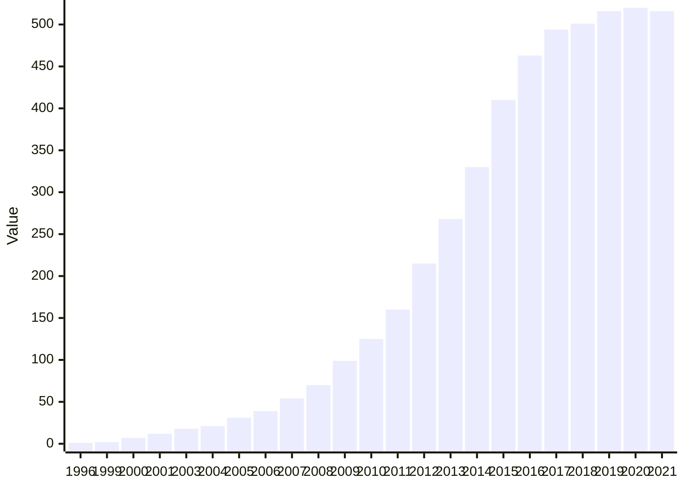
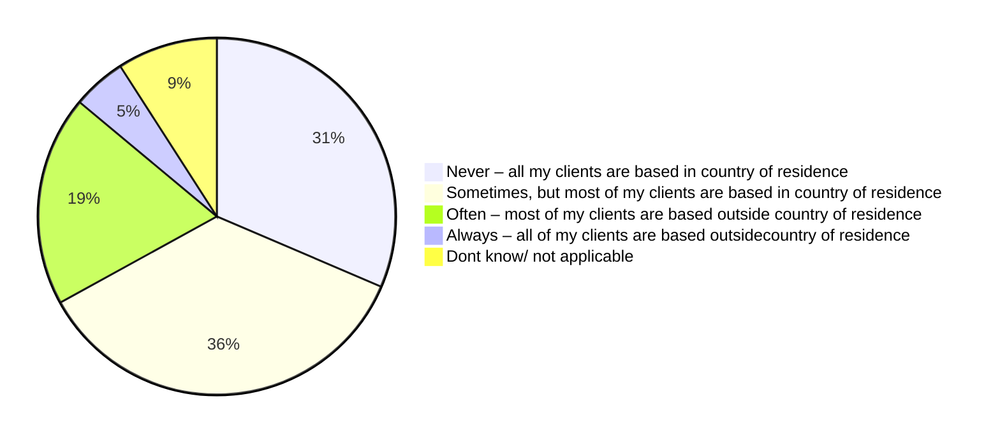

<!--
refigure example output — generated by `refigure.docx.convert()`
Source: swd2021-396-platform-work-ia.docx (tests/integration/fixtures/docx/swd2021-396-platform-work-ia.docx)
License: EU reuse right (Commission Decision 2011/833/EU)
Attribution: European Commission. SWD(2021) 396 final — Impact Assessment accompanying the proposal on improving working conditions in platform work. EUR-Lex CELEX 52021SC0396.
Source URL: http://publications.europa.eu/resource/cellar/48491c8f-59bb-11ec-91ac-01aa75ed71a1.0001.01/DOC_1
Full provenance: tests/integration/fixtures/manifest.yaml
-->

*(...front matter, table of contents, and the problem-definition/policy-options/impact-assessment body sections omitted for this excerpt...)*

Estimated numbers of people working through platforms for clients based in other countries at least sometimes

|  |  |  |
| --- | --- | --- |
|  | **Working more than sporadically** | **Of them - working more than sporadically and at risk of misclassification** |
| **Total** | **16.69 million** | **3.18 million** |
| Low-skill on-location | 2.04 million | 0.97 million |
| High-skill on-location | 1.01 million | 0.17 million |
| Low-skill online | 5.13 million | 0.66 million |
| High-skill online | 8.51 million | 1.38 million |

*(...text on impacts on platforms omitted...)*

#### **A5.2: Data visualisations**

The European platform labour economy has evolved rapidly in the past decade, although platform work is still more notable in some countries compared to others. To begin with, the growth of platform work economy can be illustrated by the proliferation of platforms in the past decade. For example, a recent study[[211]](#footnote-212) found over 500 labour platforms operating within the EU and/or used by EU citizens to generate income in early 2021. The majority of them have started operations since 2014, and the overall number hast grown especially in 2014-2016 (see figure A below).

**Figure A. Number of labour platforms active in the EU**

| Category | Series 1 |
| --- | --- |
| 1996 | 1 |
| 1999 | 2 |
| 2000 | 7 |
| 2001 | 12 |
| 2003 | 18 |
| 2004 | 21 |
| 2005 | 31 |
| 2006 | 39 |
| 2007 | 54 |
| 2008 | 70 |
| 2009 | 99 |
| 2010 | 125 |
| 2011 | 160 |
| 2012 | 215 |
| 2013 | 268 |
| 2014 | 330 |
| 2015 | 410 |
| 2016 | 463 |
| 2017 | 494 |
| 2018 | 501 |
| 2019 | 516 |
| 2020 | 520 |
| 2021 | 516 |

Source: PPMI (2021). Based on CEPS (2021). Active platforms minus deactivated platforms by year. N=590.

Before the pandemic, the size of the global platform work economy had been projected to increase almost twofold from 2018 to 2023.[[212]](#footnote-213) However, the coronavirus crisis might have further encouraged its spread. For example, based on the data of the newest platform work survey conducted by PPMI in late 2021, over 38% of the people working through platforms first started working via platforms in 2020 or 2021. Moreover, almost 37% reported that they have started or restarted platform work because of COVID-19, while another 37% said they worked more hours via platforms than before because of the pandemic (see the figure below).

| Category | Yes, started or restarted working through platforms | Yes, worked more hours/ got more assignments | Yes, worked fewer hours or got fewer assignments | Yes, stopped working | No |
| --- | --- | --- | --- | --- | --- |
| People who worked through platforms in May-November 2020 (EIGE survey)  | 38.00% | 25.50% | 11.90% | 4.60% | 16.10% |
| People who worked through platforms in December 2020 - May 2021 (2021 survey) | 36.80% | 37.11% | 8.87% | 1.71% | 15.70% |

Figure D. Impacts of the COVID-19 pandemic or related policy measures (e.g., lockdowns, quarantine, closures of businesses, schools, etc.) on the work via platforms (% of people who have worked through platforms)

Source: 2020 EIGE survey;[[213]](#footnote-214) 2021 survey of people working through platforms conducted for this impact assessment. The same question formulation was used in both surveys.

According to COLLEEM 2017 data, 36.1% of people working through platforms have provided services to clients based in countries other than their country of residence. Among people who engaged in online services on, this figure was 32.5%, and among people engaged in on-location services only – 25.6% (and among people in both types of platform work – 44.2%). The new data from 2021 survey show that 59% of all people working though platforms for clients from other countries at least sometimes (see the figure below).[[214]](#footnote-215) Among people for whom the main activities on labour platforms fall under the category of online work, this figure was 62%, and among people mainly (but not necessarily exclusively) engaged in on-location wok – 49%.

**Figure E. 2021 survey: When working via online platforms, how often have you worked for clients based in countries other than [country of residence]**

| Category | Series 1 |
| --- | --- |
| Never – all my clients are based in [country of residence] | 31.4 |
| Sometimes, but most of my clients are based in [country of residence] | 35.5 |
| Often – most of my clients are based outside [country of residence] | 19.1 |
| Always – all of my clients are based outside[country of residence] | 4.9 |
| Dont know/ not applicable | 9.1 |

Source : PPMI (2021).

*(...several further figures/annexes, including a second xychart-beta bar chart (Figure 6: Share of low-wage earners in the EU, by country) and a table-only chart fallback (Figure F, a two-series platform-count projection whose gaps against the axis dropped its mermaid diagram, same honest verify+fallback behaviour shown in the swd2018-combo example), omitted for this excerpt; see the full file for the complete conversion...)*
